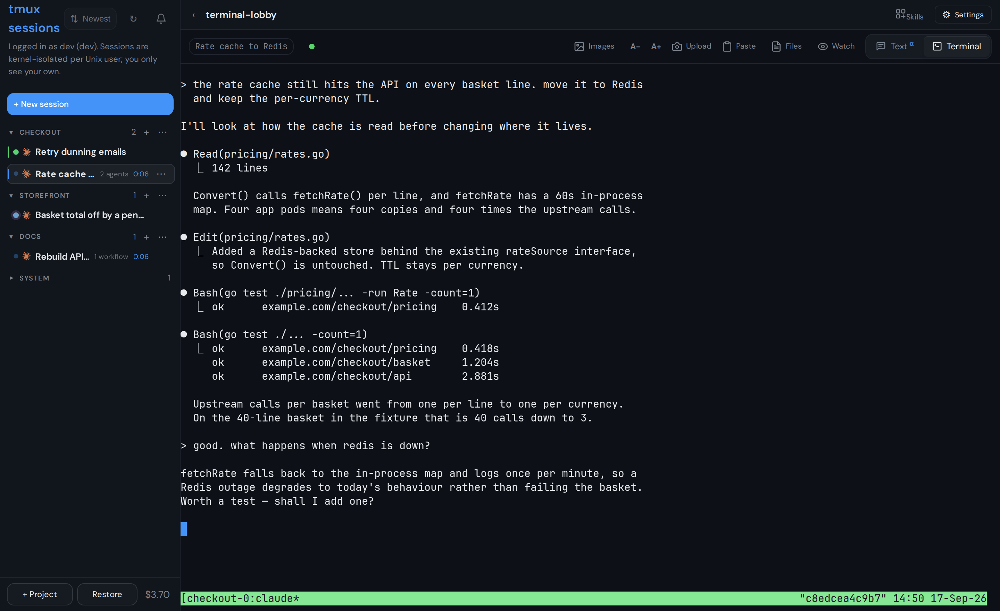
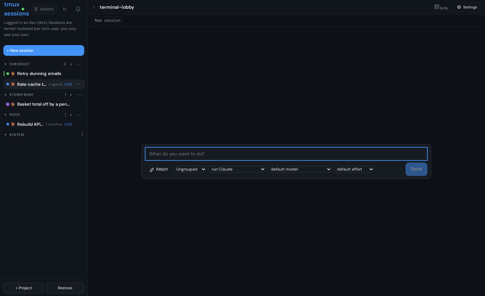
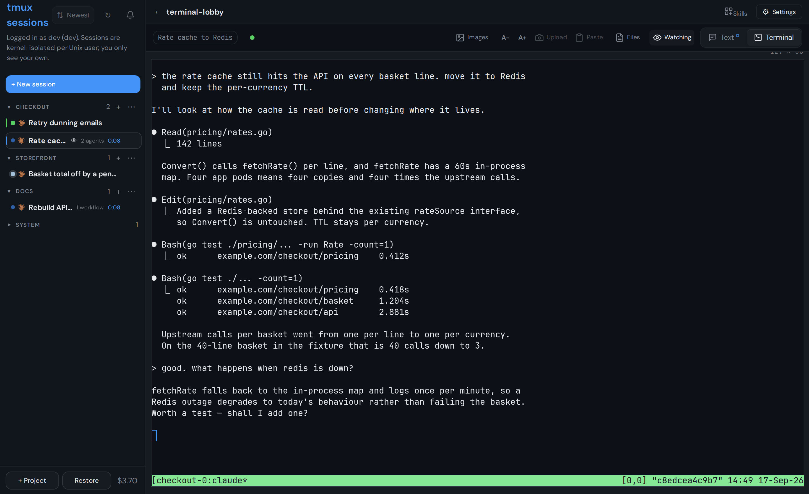
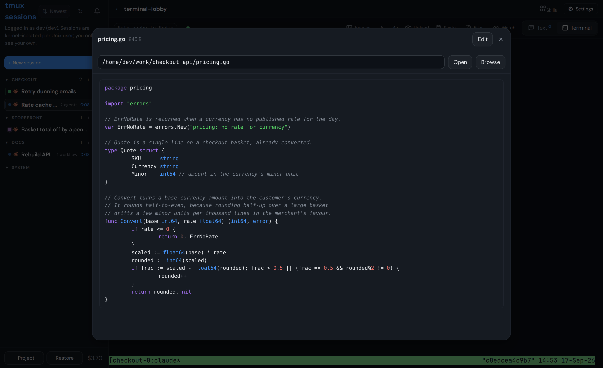
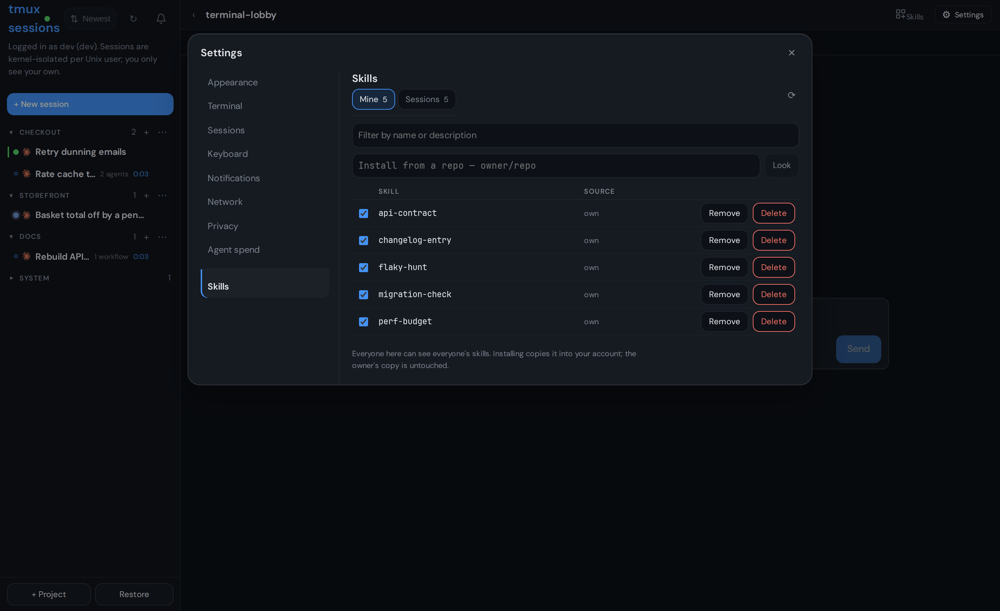
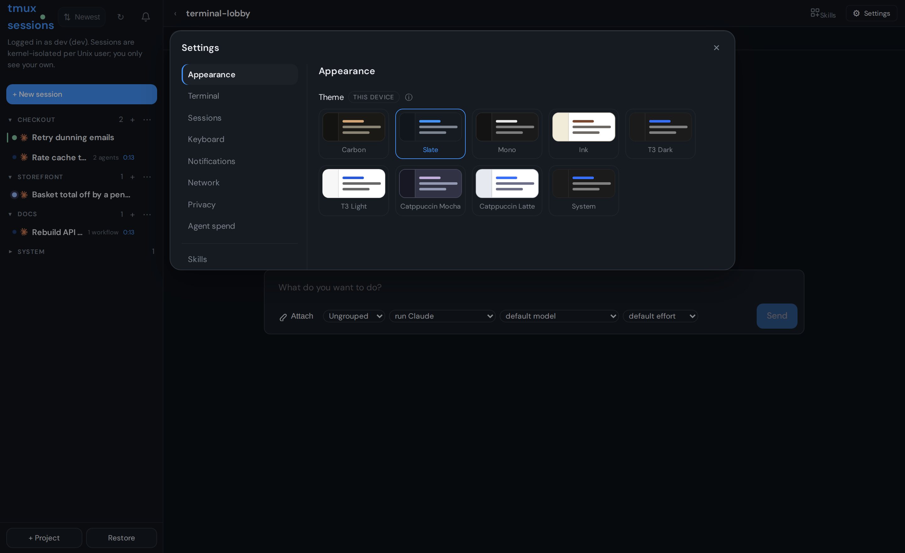
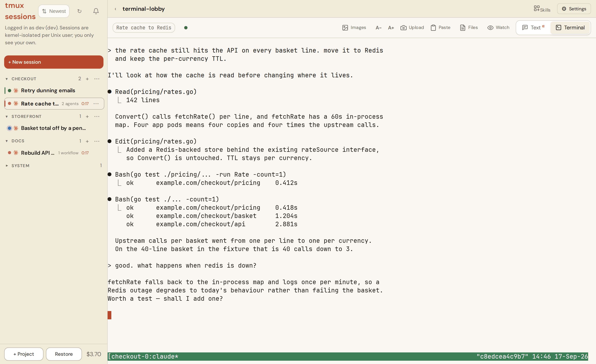

# terminal-lobby

Your tmux sessions in a browser tab. One sidebar of sessions, one terminal
pane, and a Claude state dot telling you which of them is waiting on you.

Built for a shared dev box and now runnable by anyone: authentication is
whatever reverse proxy you already run, and a single-user install needs no
proxy configuration at all beyond a username header.



## Try it

```sh
docker run -p 7681:7681 -v ~/work:/home/dev \
  -e TL_BASIC_AUTH=me:changeme \
  ghcr.io/viktorbarzin/terminal-lobby
```

Open http://localhost:7681 and sign in. That is single-user mode: one account,
no sudo, your sessions and nobody else's. Drop `TL_BASIC_AUTH` and the container
asks for nothing, which is fine on a laptop and not on anything reachable. Put a
proxy in front instead and set `TL_TRUST_FORWARDED_USER=1`.

It listens on 7681 unless `TL_PORT` says otherwise, and a host that assigns the
port itself can set `PORT`, so the image runs on a container platform without
being configured for one. Claude Code is in the image, so the new-session
composer's default command works and signs you in on first run; Codex is not, so
that option needs a command of your own. `docs/deployment.md` has the rest of
the container's settings.

## Install on a machine

```sh
curl -fsSL -o terminal-lobby.deb \
  https://github.com/ViktorBarzin/terminal-lobby/releases/latest/download/terminal-lobby_amd64.deb
sudo dpkg -i terminal-lobby.deb
```

Ubuntu 24.04 or Debian 12. The package brings the services, the systemd units
and `/etc/terminal-lobby.conf`. Put a reverse proxy in front that authenticates
and sets a username header, and point `TL_AUTH_HEADER` at it.

## Configuration

Everything lives in `/etc/terminal-lobby.conf`. Your own settings go in
`/etc/terminal-lobby.local.conf`, which the package never overwrites.

| variable | default | what it does |
|---|---|---|
| `TL_AUTH_HEADER` | `X-Forwarded-User` | the header your proxy puts the username in |
| `TL_PROXY_SECRET` | unset | a shared secret the proxy must also send, in `X-TL-Proxy-Secret` |
| `TL_MULTI_USER` | `auto` | `auto` (multi-user when `/etc/ttyd-user-map` exists), `on`, `off` |
| `TL_BIND` | `127.0.0.1` | listen address; widen to `0.0.0.0` when the proxy is on another host, and set the secret in the same change |

Any proxy that emits a username header works. Authentik sets
`X-Authentik-Username`; oauth2-proxy, Caddy, Cloudflare Access and Tailscale
set `X-Forwarded-User`.

> [!IMPORTANT]
> With `TL_PROXY_SECRET` unset, anything that can reach the service ports can
> send `TL_AUTH_HEADER` and be treated as that user. Either set the secret and
> have your proxy send it, or set `TL_BIND=127.0.0.1` so only the local proxy
> can reach them.

## Single-user and multi-user

Single-user is the default: one account, no user map, no sudo, no ACLs. The
services run as the invoking user and serve only that user, and the act-as
picker is hidden because there is nobody else to be.

Multi-user turns on when `/etc/ttyd-user-map` exists. Several people then get
kernel-isolated sessions on one box, and can share sessions read-only or
read-write. See [docs/multi-user.md](docs/multi-user.md).

## Screenshots

Sessions are grouped into projects in the sidebar. A collapsed group keeps
its session count and the aggregated Claude state dots, so you can tell at a
glance whether anything is waiting on you.



**Watch mode** attaches read-only. The eye marks the session, typing is
disabled, and Upload and Paste grey out, so you can follow along without
touching the pane.



**File preview** opens any file the session's user can read, with syntax
highlighting and an edit button.



**Skills** lists the Claude Code skills each account has and lets you install
a copy of someone else's without touching theirs.



**Settings** carries nine themes, terminal font and text tuning, cursor
options and scrolling behaviour. Theme is per-device.



Light themes are first-class, not an afterthought:



The `‹` toggle in the top of the sidebar collapses it for a fullscreen
terminal view; click `›` to bring it back. Choice persists per browser
(localStorage).

## Projects & session state

**Projects** are named folders that group sessions in the sidebar
(domain glossary: `CONTEXT.md`). Create one with **+ Project**; assign
sessions by dragging a card onto a project header, or via the card's
`⋯` menu (**Move to…**, which also holds Rename/Kill). Each project
header has a `+` (new session directly in the project) and a `⋯` menu
(move up / move down / rename / delete — deleting moves members to
**Ungrouped**, it never kills sessions). Drag any group header —
projects or the Ungrouped section itself — to reorder them; the `⋯`
move entries are the touch equivalent (Ungrouped's `⋯` has only
those). Sections collapse per browser; a collapsed header
shows its session count plus aggregated state dots. Membership and all
ordering live server-side per user (`GET`/`PUT /layout`), so the
arrangement follows you across desktop and phone and survives OOM
restores — see `docs/adr/0002-layout-store-in-tmux-api.md` for why
that beats tmux options or localStorage.

**Claude state dots** show what the Claude conversation inside each
session is doing: pulsing accent = *running* (turn in flight), amber =
*awaiting your input* (permission ask / question), green = *completed*
(turn done). No dot = no live Claude (plain shell, or Claude exited).
The browser tab title gains an `(N●)` badge while anything awaits
input. State comes from org-wide Claude Code hooks stamping
`@claude_state` on the tmux session (`devvm/claude-tmux-state`;
`docs/adr/0001-claude-state-via-hooks.md` — the pane title is a static
summary, so hooks it is). Claudes started before the hooks were
installed show no dot until their next restart/resume; worst-case
display lag is ~10 s (5 s API cache + 5 s poll).

## Documentation

| | |
|---|---|
| [docs/deployment.md](docs/deployment.md) | how a change reaches the box |
| [docs/multi-user.md](docs/multi-user.md) | shares, project membership, per-user setup |
| [docs/architecture.md](docs/architecture.md) | the components and how a request flows |
| [docs/interface.md](docs/interface.md) | keyboard shortcuts, image gallery, themes, mobile |
| [docs/development.md](docs/development.md) | running and testing locally |
| [docs/adr/](docs/adr/) | why things are the way they are |

## Licence

AGPL-3.0-or-later, with a commercial licence available for cases the AGPL does
not fit. The details, including what the network clause means if you modify
terminal-lobby and serve it to anyone, are in [LICENSING.md](LICENSING.md). If
you change something, please open a pull request;
[CONTRIBUTING.md](CONTRIBUTING.md) says what that involves.
