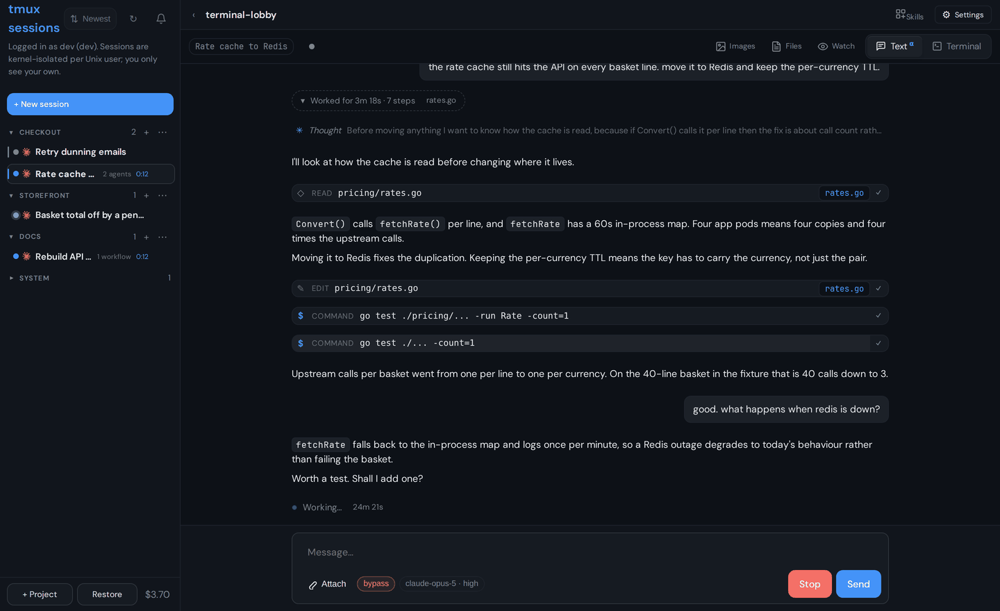
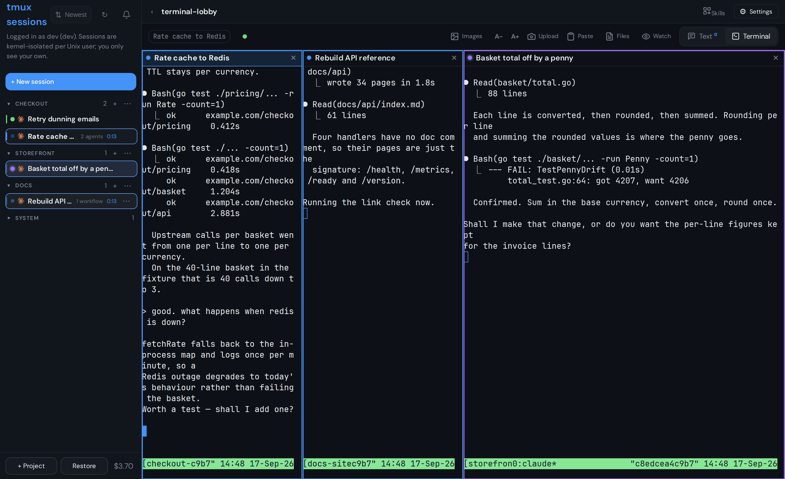
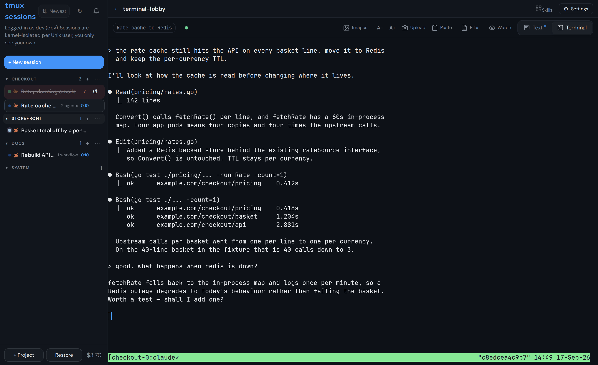
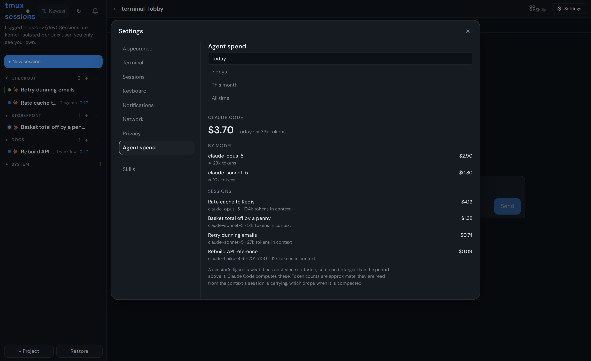
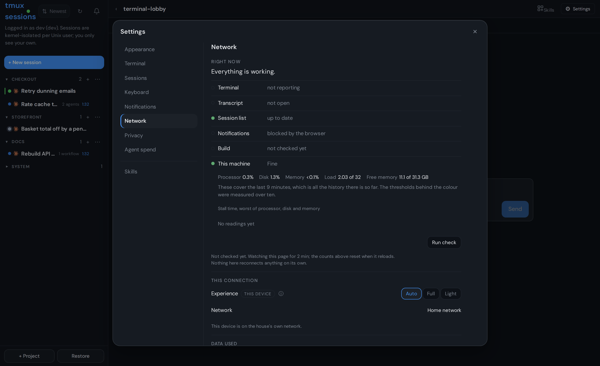
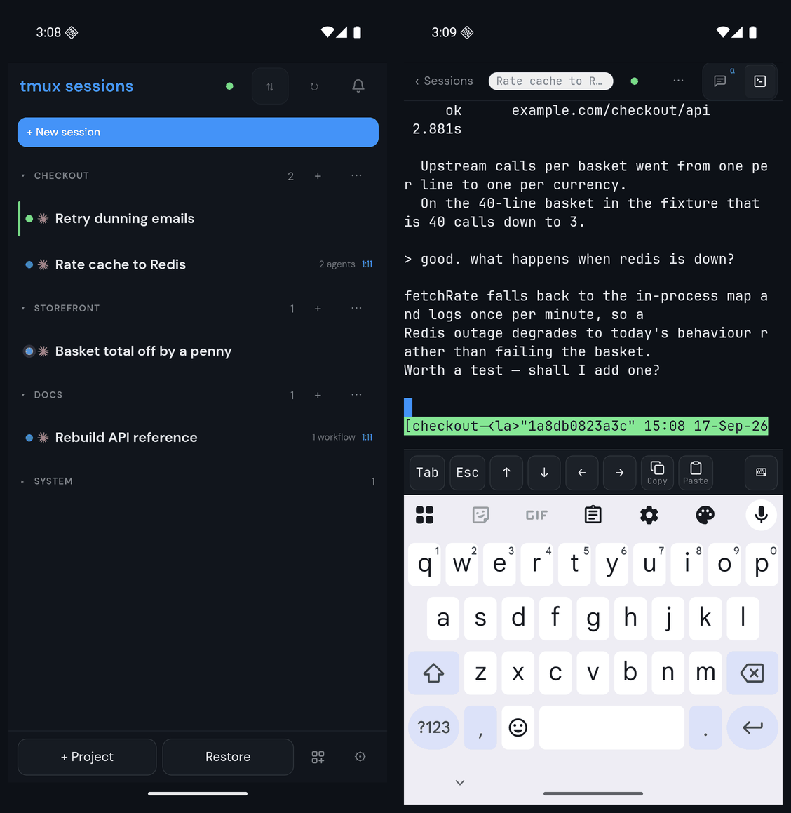
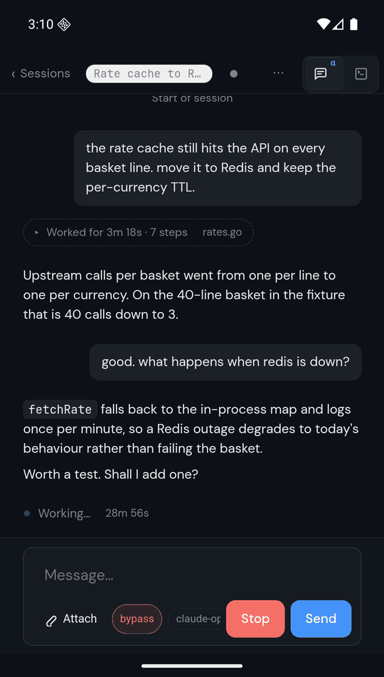

# terminal-lobby

Your tmux sessions in a browser tab. One sidebar of sessions, one terminal
pane, and a Claude state dot telling you which of them is waiting on you.

Built for a shared dev box and now runnable by anyone: authentication is
whatever reverse proxy you already run, and a single-user install needs no
proxy configuration at all beyond a username header.


## Try it

```sh
docker run -p 7681:7681 -v ~/work:/home/dev \
  -e TL_BASIC_AUTH=me:changeme \
  ghcr.io/viktorbarzin/terminal-lobby
```

Open http://localhost:7681 and sign in. That is single-user mode: one account,
no sudo, your sessions and nobody else's. Drop `TL_BASIC_AUTH` and the container
asks for nothing, which is fine on a laptop and not on anything reachable. Put a
proxy in front instead and set `TL_TRUST_FORWARDED_USER=1`.

It listens on 7681 unless `TL_PORT` says otherwise, and a host that assigns the
port itself can set `PORT`, so the image runs on a container platform without
being configured for one. Claude Code is in the image, so the new-session
composer's default command works and signs you in on first run; Codex is not, so
that option needs a command of your own. `docs/deployment.md` has the rest of
the container's settings.

## Install on a machine

```sh
curl -fsSL -o terminal-lobby.deb \
  https://github.com/ViktorBarzin/terminal-lobby/releases/latest/download/terminal-lobby_amd64.deb
sudo dpkg -i terminal-lobby.deb
```

Ubuntu 24.04 or Debian 12. The package brings the services, the systemd units
and `/etc/terminal-lobby.conf`. Put a reverse proxy in front that authenticates
and sets a username header, and point `TL_AUTH_HEADER` at it.

## Configuration

Everything lives in `/etc/terminal-lobby.conf`. Your own settings go in
`/etc/terminal-lobby.local.conf`, which the package never overwrites.

| variable | default | what it does |
|---|---|---|
| `TL_AUTH_HEADER` | `X-Forwarded-User` | the header your proxy puts the username in |
| `TL_PROXY_SECRET` | unset | a shared secret the proxy must also send, in `X-TL-Proxy-Secret`; covers the five HTTP services, not ttyd |
| `TL_MULTI_USER` | `auto` | `auto` (multi-user when `/etc/ttyd-user-map` exists), `on`, `off` |
| `TL_BIND` | `127.0.0.1`, from the shipped conffile and compiled in | listen address for the services and ttyd; widen to `0.0.0.0` when the proxy is on another host, and set the secret in the same change. `ttyd.service` marks both `EnvironmentFile` lines optional, so a box with no conffile falls to the same loopback default |

Any proxy that emits a username header works. Authentik sets
`X-Authentik-Username`; oauth2-proxy, Caddy, Cloudflare Access and Tailscale
set `X-Forwarded-User`.

> [!IMPORTANT]
> With `TL_PROXY_SECRET` unset, anything that can reach the service ports can
> send `TL_AUTH_HEADER` and be treated as that user. Set the secret, and have
> your proxy send it.
>
> `TL_BIND=127.0.0.1` is not an alternative to it on a multi-user box. It keeps
> the ports off the network, which is worth having, but every OS user on the box
> reaches loopback and nothing checks a request's source, so any local account
> can still send the header and be treated as any mapped user. Treat the secret
> as required whenever `TL_MULTI_USER` resolves to true, and narrow the bind as
> well when the proxy is local.
>
> The secret covers the five HTTP services: 7683 clipboard-upload, 7684
> tmux-api, 7685 session-events, 7686 file-api, 7688 skills-api. It does not
> cover ttyd on 7681, which trusts `TL_AUTH_HEADER` and has no second header to
> check, and 7681 is the port that hands out a shell. ttyd does honour
> `TL_BIND`, so keep 7681 reachable from the proxy alone: narrow `TL_BIND`, or
> leave it wide and restrict 7681 at the firewall or the ingress.

Six more variables set when the lobby calls the box busy. It reads
`/proc/pressure` every 10 seconds and shows one `This machine` row in Settings
under Network, which tells a slow box apart from a slow connection. Each number
is a percentage of a ten-minute window that tasks spent stalled waiting for the
resource; cross the first and the row turns amber, cross the `_VERY_` one and it
says typing is slow right now rather than may feel slow. All six ship commented
out, so leaving them alone keeps the values the binary compiles in.

| variables | defaults | what they measure |
|---|---|---|
| `TL_HEALTH_CPU_PCT`, `TL_HEALTH_CPU_VERY_PCT` | `10`, `20` | CPU stall, time at least one task waited to run |
| `TL_HEALTH_IO_PCT`, `TL_HEALTH_IO_VERY_PCT` | `50`, `70` | IO stall, time every non-idle task waited on disk |
| `TL_HEALTH_MEM_PCT`, `TL_HEALTH_MEM_VERY_PCT` | `10`, `20` | memory stall, time every non-idle task waited on memory |

Those defaults are one machine's, calibrated against 696 hours of the devvm this
was built on, where the three together are crossed for 17 hours, 2.44% of the
time. Another box's disks and cores put it somewhere else, so watch the row for
a week against how the machine actually feels before moving anything.
[docs/deployment.md](docs/deployment.md) has the measurements and how to check
your own. Where the kernel has no `/proc/pressure`, the row falls back to load
average per core and memory headroom and says on screen that it has.

## Single-user and multi-user

Single-user is the default: one account, no user map, no sudo, no ACLs. The
services run as the invoking user and serve only that user, and the act-as
picker is hidden because there is nobody else to be.

Multi-user turns on when `/etc/ttyd-user-map` exists. Several people then get
kernel-isolated sessions on one box, and can share sessions read-only or
read-write. See [docs/multi-user.md](docs/multi-user.md).

## Screenshots

Sessions are grouped into projects in the sidebar. A collapsed group keeps
its session count and the aggregated Claude state dots, so you can tell at a
glance whether anything is waiting on you.


Attaching gives you the session itself, rendered by the lobby rather than
handed to an iframe.


**Text mode** is the same session read as a conversation instead of a screen.
It is built from the Claude Code transcript rather than from the pane, so it
carries what the transcript holds and the terminal only shows in passing:
thinking, every tool call and its result, token usage, mode changes and queued
prompts. The work between two replies collapses into one line you can open.
The composer is at parity with the CLI, including the permission-mode chip and
the model, and a blocking question is answered from here by mirroring the pane
and injecting the keys. Terminal is the default on every device; text is one
tap away and the choice sticks per session. See
`docs/adr/0018-the-transcript-is-what-people-said.md`.



**Workspaces** put several sessions on screen at once. Drag a session onto a
tile to split it and drag a divider to resize. Splitting never moves a running
terminal: the tiles position slots in a fixed DOM order, so a session keeps its
xterm, its socket and its tmux attach while the layout changes around it. A
split that would leave any tile under 240px is refused at the drop rather than
shrinking into it. See
`docs/adr/0027-a-live-terminal-never-moves-and-a-workspace-splits-in-two.md`.



**Undo** covers the sidebar. `Ctrl+Z` (`Cmd+Z`) takes back the last structural
change and `Ctrl+Shift+Z` puts it back: kill, create, retitle, move between
projects, reorder cards and groups, the session-order mode, project create,
rename and delete, collapse, and the watch choice. A kill no longer asks. The
card dims and counts down for eight seconds before anything reaches the server,
so the way out is to carry on rather than to answer a dialog naming a
12-character session id. Settings → Keyboard hands `Ctrl+Z` back to the
terminal if you would rather keep SIGTSTP. See
`docs/adr/0025-undo-takes-ctrl-z-and-a-kill-waits.md`.



**Agent spend** is a Settings page for what the agents in your sessions have
consumed, over today, 7 days, this month or all time. Each tool speaks its own
language: Claude Code reports dollars, which it computes itself, and Codex
reports how much of its 5-hour and weekly limits is gone, because a ChatGPT
plan reports no cost anywhere. The Claude figures come from a recorder in the
statusLine slot (`devvm/tl-usage-record`, wired the same way the state dot's
hooks are); Codex needs nothing installed. A small figure beside the gear
carries the one number for the session you are attached to. See
`docs/adr/0023-agent-spend-via-a-statusline-wrapper.md`.



**Machine health** answers "is it me or the box". Settings → Network carries a
"This machine" row that reads stall time from `/proc/pressure`, because load
average counts what is queued while stall time measures what actually waited.
Where the kernel has no `/proc/pressure` the row falls back to load average per
core and memory headroom, and says on screen that it has. See
`docs/adr/0028-stall-time-says-the-box-is-busy.md`.



**Watch mode** attaches read-only. The eye marks the session, typing is
disabled, and Upload and Paste grey out, so you can follow along without
touching the pane.


**File preview** opens any file the session's user can read, with syntax
highlighting and an edit button.


**Skills** lists the Claude Code skills each account has and lets you install
a copy of someone else's without touching theirs.


**Settings** carries nine themes, terminal font and text tuning, cursor
options, scrolling behaviour and the keyboard map. Theme is per-device.


Light themes are first-class, not an afterthought:


**On a phone** the sidebar becomes the whole screen and a session takes the
whole screen, with `‹ Sessions` between them. A terminal gets a key row the
soft keyboard cannot provide: Tab, Esc, the four arrows, Copy and Paste, plus a
keyboard-dismiss pinned outside the scrolling row so it never scrolls away. Tab
leads because it is the most-tapped key that is not an arrow. Copy and Paste
are there because on a phone in terminal mode the row is the only route to
either.



Text mode is where a phone is at its best, since a conversation reflows and an
80-column pane does not.



The `‹` toggle in the top of the sidebar collapses it for a fullscreen
terminal view; click `›` to bring it back. Choice persists per browser
(localStorage).

## Projects & session state

**Projects** are named folders that group sessions in the sidebar
(domain glossary: `CONTEXT.md`). Create one with **+ Project**; assign
sessions by dragging a card into another project's list, or via the
card's `⋯` menu (**Move to…**, which also holds Rename/Kill). A
collapsed project opens on its own when you hold a dragged card over
its header, so a card lands where you point rather than at the end.
Each project header has a `+` (new session directly in the project)
and a `⋯` menu (move up / move down / rename / delete — deleting
moves members to **Ungrouped**, it never kills sessions). Drag any
group header — projects or the Ungrouped section itself — to reorder
them, with a mouse or a finger; the `⋯` move entries do the same from
a menu (Ungrouped's `⋯` has only those). Sections collapse per
browser; a collapsed header shows its session count plus aggregated
state dots. Membership and all ordering live server-side per user
(`GET`/`PUT /layout`), so the
arrangement follows you across desktop and phone and survives OOM
restores — see `docs/adr/0002-layout-store-in-tmux-api.md` for why
that beats tmux options or localStorage.

**Claude state dots** show what the Claude conversation inside each
session is doing: pulsing accent = *running* (working, and it will
produce more output), amber = *awaiting your input* (permission ask /
question), green = *completed* (finished, ready for the next prompt).
No dot = no live Claude (plain shell, or Claude exited). The browser tab
title gains an `(N●)` badge while anything awaits input. State comes
from org-wide Claude Code hooks stamping `@claude_state` on the tmux
session (`devvm/claude-tmux-state`;
`docs/adr/0001-claude-state-via-hooks.md` — the pane title is a static
summary, so hooks it is). Claudes started before the hooks were
installed show no dot until their next restart/resume; worst-case
display lag is ~10 s (5 s API cache + 5 s poll).

A dot that is wrong can be set by hand: the card's `⋯` menu carries a
**Status** group with the same three states, and picking one writes the
same option a hook writes. So it holds until the session's Claude says
otherwise and no longer, which is the point — a session that really is
working corrects itself within seconds. Marking one *done* also clears
whatever it was counted as still waiting on, and none of it notifies
your devices.

*Running* is not the same as "a turn is in flight". A session that
launched a background agent, a workflow or a teammate keeps that dot
until the work reports back, because it will speak again with nobody
prompting it, and the card names what it is waiting on ("2 agents",
"1 workflow"). A background command does not hold the dot — that line
was drawn at agents on 2026-09-20, so a tailed log left running does not
read as the session working. What is outstanding lives in a second
option, `@claude_bg`, written by the same hooks. At the end of
every turn the set is rebuilt from the tasks the harness still reports
live, so work that finished while Claude was mid-turn stops holding the
dot, and work that is still going keeps it — through anything you type
meanwhile, and through a compaction. A teammate is the exception the
harness cannot answer for, since it stays listed while idle, so one is
held from `SubagentStart` until `TeammateIdle` instead.
Design: `docs/plans/2026-09-04-background-work-session-state-design.md`.

A session showing you a question or a plan to approve stays amber for as
long as the menu is on screen, in a third option, `@claude_ask`. Before
that (2026-09-13) the state heard about a dialog only through the
notification the CLI sends 5–6 s after drawing one, which fires once: a
later stamp overwrote it and nothing put it back, and one session read
*Working* for eleven hours with a question on its pane.

**Where a session came from.** A session records what created it, so the ones
a person opened are not mixed in with the ones a harness or an API caller made.
Anything created by tooling collects in a group that stays closed, and its
completions do not ring your phone. See
`docs/adr/0024-a-session-knows-who-made-it.md`.

**Opening is warm.** Hovering a session in the sidebar attaches it in the
background, at the size it will be shown at, so the click lands on a terminal
that is already drawn. A preloaded terminal attaches without driving: it sends
no input and does not take the session out of whatever state it was in. See
`docs/adr/0026-a-preloaded-terminal-attaches-without-driving.md`.

**Connection status.** Five things stay alive between the browser and the box
— the terminal socket, the transcript stream, the session-list poll,
notifications, and whether the page is running the current build. When one of
them is not, the dot by the sidebar title says which, and Settings → Network
spells it out rather than showing a generic spinner. See
`docs/adr/0016-connection-status-in-the-ui.md`.

## Documentation

| | |
|---|---|
| [docs/deployment.md](docs/deployment.md) | how a change reaches the box |
| [docs/multi-user.md](docs/multi-user.md) | shares, project membership, per-user setup |
| [docs/architecture.md](docs/architecture.md) | the components and how a request flows |
| [docs/interface.md](docs/interface.md) | keyboard shortcuts, image gallery, themes, mobile |
| [docs/development.md](docs/development.md) | running and testing locally |
| [docs/adr/](docs/adr/) | why things are the way they are |

## Licence

AGPL-3.0-or-later, with a commercial licence available for cases the AGPL does
not fit. The details, including what the network clause means if you modify
terminal-lobby and serve it to anyone, are in [LICENSING.md](LICENSING.md). If
you change something, please open a pull request;
[CONTRIBUTING.md](CONTRIBUTING.md) says what that involves.
