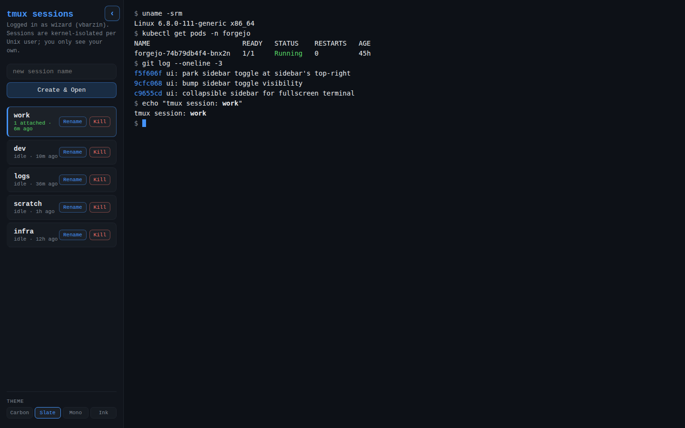
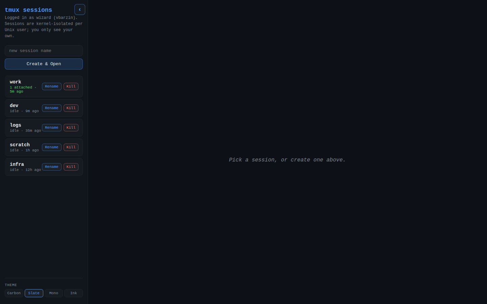
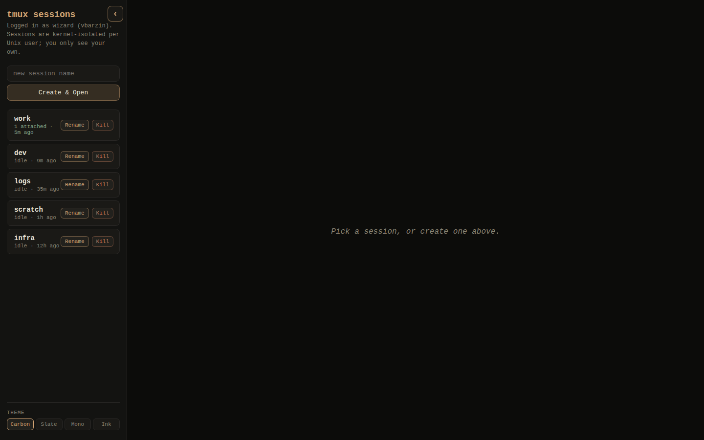
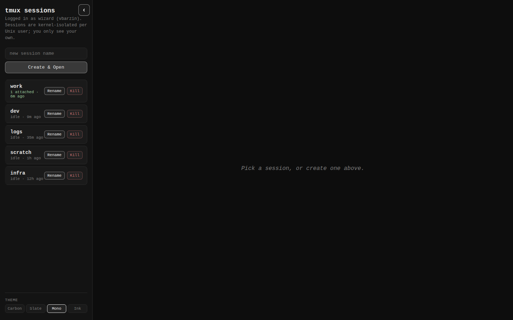
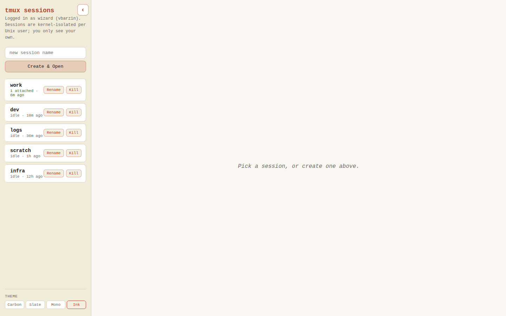
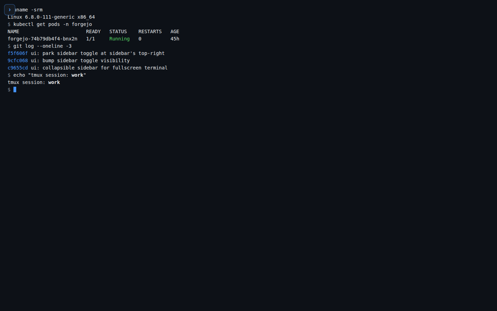

# terminal-lobby

Web tmux sessions, gated by Authentik, isolated per OS user. Lives at
`https://terminal.viktorbarzin.me/`.

A sidebar lists the current user's tmux sessions — grouped into
collapsible **projects**, each session carrying a **Claude state dot**
(running / awaiting input / completed) — and the right pane is an
iframe that swaps between sessions on click. Direct-linked sessions
(`?arg=<name>` at the top level) bypass the lobby and render fullscreen
for bookmarks / CLI links.



## Screenshots

<table>
  <tr>
    <td></td>
    <td></td>
  </tr>
  <tr>
    <td align="center"><sub>Slate (default) — cool dark, electric blue accent</sub></td>
    <td align="center"><sub>Carbon — warm dark, restrained amber</sub></td>
  </tr>
  <tr>
    <td></td>
    <td></td>
  </tr>
  <tr>
    <td align="center"><sub>Mono — strict greyscale</sub></td>
    <td align="center"><sub>Ink — warm paper, terracotta accent</sub></td>
  </tr>
</table>

The `‹` toggle in the top of the sidebar collapses it for a fullscreen
terminal view; click `›` to bring it back. Choice persists per browser
(localStorage).



## Projects & session state

**Projects** are named folders that group sessions in the sidebar
(domain glossary: `CONTEXT.md`). Create one with **+ Project**; assign
sessions by dragging a card onto a project header, or via the card's
`⋯` menu (**Move to…**, which also holds Rename/Kill). Each project
header has a `+` (new session directly in the project) and a `⋯` menu
(move up / move down / rename / delete — deleting moves members to
**Ungrouped**, it never kills sessions). Drag any group header —
projects or the Ungrouped section itself — to reorder them; the `⋯`
move entries are the touch equivalent (Ungrouped's `⋯` has only
those). Sections collapse per browser; a collapsed header
shows its session count plus aggregated state dots. Membership and all
ordering live server-side per user (`GET`/`PUT /layout`), so the
arrangement follows you across desktop and phone and survives OOM
restores — see `docs/adr/0002-layout-store-in-tmux-api.md` for why
that beats tmux options or localStorage.

**Claude state dots** show what the Claude conversation inside each
session is doing: pulsing accent = *running* (turn in flight), amber =
*awaiting your input* (permission ask / question), green = *completed*
(turn done). No dot = no live Claude (plain shell, or Claude exited).
The browser tab title gains an `(N●)` badge while anything awaits
input. State comes from org-wide Claude Code hooks stamping
`@claude_state` on the tmux session (`devvm/claude-tmux-state`;
`docs/adr/0001-claude-state-via-hooks.md` — the pane title is a static
summary, so hooks it is). Claudes started before the hooks were
installed show no dot until their next restart/resume; worst-case
display lag is ~10 s (5 s API cache + 5 s poll).

## Components

| Piece | Where it runs | Port | Purpose |
|---|---|---|---|
| `frontend/index.html` | Served by ttyd on the DevVM | 7681 | Lobby UI + xterm.js terminal |
| `tmux-api/` (Go) | DevVM systemd service | 7684 | `GET /sessions` (incl. per-session `state` + `project`), `DELETE /sessions/<n>`, `POST /sessions/<n>/rename`, `GET /whoami`, `POST /restore`, `GET`/`PUT /layout` (per-user sidebar layout, stored under `/var/lib/tmux-api/layout/`) |
| `clipboard-upload/` (Go) | DevVM systemd service | 7683 | Receives pasted/uploaded images, returns a path the terminal can paste |
| `devvm/tmux-attach.sh` | DevVM, invoked by ttyd | — | Validates `X-authentik-username`, maps to OS user via `/etc/ttyd-user-map`, `sudo -u <user> tmux new-session -A` |
| `devvm/claude-tmux-state` | DevVM, invoked by Claude Code hooks | — | Stamps `@claude_state` (running / awaiting / done) on the enclosing tmux session; wired org-wide via `/etc/claude-code/managed-settings.json` (infra repo, `scripts/workstation/`, self-deploys hourly). No-ops outside tmux. See `docs/adr/0001-claude-state-via-hooks.md` |
| `devvm/tmux-restore-user` | DevVM, invoked by `tmux-api` via sudo (`POST /restore`) | — | "Restore sessions" button helper: validates the user against `/etc/ttyd-user-map`, runs `tmux-persist restore <user>` (recreates that user's saved-but-dead sessions, resuming each Claude conversation). Idempotent — live sessions are left alone. Useful after an OOM kills the tmux server without a reboot (the boot-only restore never fires) |
| `devvm/ttyd.service`, `ttyd-ro.service`, `tmux-api.service`, `clipboard-upload.service` | DevVM | — | systemd units |
| `devvm/clipboard-cleanup.service` + `.timer` | DevVM | — | Daily `find /tmp/clipboard-images -mtime +7 -delete` |
| `devvm/ttyd-user-map`, `sudoers.d-ttyd-users` | `/etc/` on DevVM | — | Authentik → OS-user mapping + sudo grant |
| `devvm/start-claude.sh` | Per-user, e.g. `/home/bob/` | — | Optional Claude-Code launcher invoked by tmux `default-command` |

## How a request flows

1. Browser hits `https://terminal.viktorbarzin.me/`.
2. Traefik forward-auth → Authentik → adds `X-authentik-username` header.
3. K8s ingress (in `infra/stacks/terminal/`) routes:
   - `/api/sessions/*` → `tmux-api` (port 7684 on the DevVM)
   - `/clipboard/*` → `clipboard-upload` (port 7683)
   - everything else → `ttyd` (port 7681) which serves `index.html` + WebSocket
4. The browser preflights `/api/sessions/whoami` to discover its OS user, then either renders the lobby or opens a session iframe with `?arg=<name>`.
5. ttyd, on each WS connection, runs `tmux-attach.sh` with `X-authentik-username` in `$TTYD_USER`. The script `sudo`s into the mapped OS user and `exec tmux new-session -A -s <name>`. Each OS user has its own `/tmp/tmux-<uid>/default` socket — kernel-level isolation.
6. `tmux-api` reads the same `X-Authentik-Username` header on every API call and runs tmux under the mapped OS user, so users only see their own sessions.

## Deployment

For now: **manual deploy via `./scripts/deploy.sh`** from a workstation
that can SSH `wizard@192.0.2.10`. The script cross-builds the Go
binaries, SCPs all artefacts, installs them under `sudo`, runs
`daemon-reload`, restarts services, and smoke-tests `/whoami` +
`/health`.

```bash
./scripts/deploy.sh                      # full deploy
DEVVM=192.0.2.10 ./scripts/deploy.sh     # explicit host
SKIP_BUILD=1 ./scripts/deploy.sh         # reuse ./out/ binaries
```

### ttyd (patched)

The devvm runs a patched ttyd: stock 1.7.7 reports a 0×0 pixel size to
the pty, which makes tmux swallow sixel images — the patch forwards
the browser's pixel size so `viu` & co. render inline (see
`docs/adr/0004-sixel-images-in-the-terminal.md`). Run
`./scripts/build-ttyd.sh` once before deploying whenever the ttyd
binary needs (re)building — it pins upstream tag 1.7.7, applies
`devvm/ttyd-pixel-size.patch`, and drops the binary at `out/ttyd`;
`deploy.sh` ships it only if it exists and says so either way.

### viu

`viu` is a system binary on the devvm, installed once, outside
`deploy.sh`: `cargo install viu --features icy_sixel` (the sixel
feature is off by default), then
`sudo install ~/.cargo/bin/viu /usr/local/bin/viu`.

### CI status — TODO

`.woodpecker.yml` is ready and the deploy SSH key is provisioned
(`secret/woodpecker/devvm_ssh_key`), but **Forgejo-side activation is
blocked**:

- Woodpecker user `viktor` (forge_id=2) cannot activate `viktor/terminal-lobby`
  in the current installation — returns HTTP 500 on activation, same
  symptom that blocked `viktor/payslip-ingest` previously.
- Forgejo Actions is not enabled in `app.ini` and there's no
  `forgejo-runner` provisioned in the cluster.

Either of these unblocks CI:
1. **Enable Forgejo Actions**: add `[actions] ENABLED = true` to
   Forgejo `app.ini`, restart, then deploy a `forgejo-runner` Helm
   release in a new Terraform stack. Move `.woodpecker.yml` →
   `.forgejo/workflows/deploy.yml` (similar syntax, native YAML).
2. **Fix Woodpecker ↔ Forgejo activation** (root cause of the
   HTTP 500 unknown — needs server logs).

Until then: `./scripts/deploy.sh` after each push.

## Per-user setup

Adding a new user (`auth_local_name` → `os_user`):

1. Append `auth_local_name=os_user` to `devvm/ttyd-user-map`.
2. Append `wizard ALL=(os_user) NOPASSWD: /usr/bin/tmux` to `devvm/sudoers.d-ttyd-users`.
3. Ensure the OS user exists: `useradd -m os_user`.
4. (Optional) Copy `devvm/start-claude.sh` into the user's home and reference it from their `~/.tmux.conf` via `set -g default-command "$HOME/start-claude.sh"`.

The K8s + Terraform side (services, endpoints, ingress, Traefik
middlewares) lives in the `infra` repo at `infra/stacks/terminal/`.
The DNS record, TLS secret, and Authentik forward-auth integration
all come from there — this repo only owns the application code and
the DevVM-side artefacts that the application binds to.

## Local development

The Go services are small and self-contained. To run locally:

```bash
# tmux-api needs a /etc/ttyd-user-map (read-only) and an Authentik header.
cd tmux-api && go run .

# Then:
curl -H "X-Authentik-Username: $(whoami)" http://localhost:7684/whoami
curl -H "X-Authentik-Username: $(whoami)" http://localhost:7684/sessions
```

`clipboard-upload` is even simpler — it just accepts multipart POSTs at
`/upload` and saves to `/tmp/clipboard-images`.

For the frontend, there's no build step. The whole UI is a single
`index.html` with inline CSS + a single `<script>` IIFE. ttyd serves
it verbatim with `-I`.

## Theme

Four themes shipped as CSS variables on `body.theme-{slate,carbon,mono,ink}`.
Slate is the default. Picker lives at the bottom of the sidebar; choice
persists in `localStorage` (`tmux-theme`). The iframe re-mounts on
theme change so the inner xterm re-reads CSS vars.

## Mobile

The lobby works on phones and tablets. The viewport meta declares
`viewport-fit=cover` + `interactive-widget=resizes-content` so the
soft keyboard pushes the layout up instead of overlaying it, and the
xterm pane refits whenever `visualViewport` reports a size change.

**Soft-key toolbar.** On any device that reports `pointer: coarse`, a
docked toolbar appears above the soft keyboard with keys mobile
keyboards lack: `Esc`, `Tab`, `Ctrl`, `Alt`, arrow keys, `|`, `` ` ``,
plus `Copy` / `Paste` / `Kbd` (re-summon keyboard). `Ctrl` and `Alt`
are one-shot on a single tap and **latch** on a double-tap (within
400 ms); a small dot on the button indicates latch state. Latched
modifiers apply to subsequent letters typed on the system soft
keyboard until you tap the modifier again to release.

**Install as a PWA.** A `manifest.webmanifest` (served from `/`) plus
the two icons (`/icon-192.png`, `/icon-512.png`) let iOS Safari and
Chrome Android "Add to Home Screen" install the lobby as a standalone
app. Run in standalone mode and the URL bar / tab strip disappear,
giving the terminal the full screen. iOS PWA cookies are sandboxed
per-app, so on first launch you may need to re-authenticate via
Authentik.

**Gestures.** `overscroll-behavior: none` suppresses Chrome
pull-to-refresh and iOS rubber-band on the terminal. `touch-action`
keeps pinch-zoom available for accessibility but kills double-tap
zoom. The sidebar auto-collapses on first session activation on
mobile so the terminal gets the full viewport; the toggle in the
top-right re-opens it (choice persists in `localStorage`).
