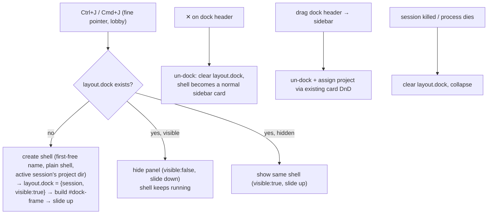

# Ctrl+J shell → persistent bottom dock

**Repo:** `terminal-lobby` · **File:** `frontend/index.html` · **Supersedes** the
swap behavior shipped in `12985ab` (the shell no longer replaces the window; it
docks below it).

`Ctrl+J` / `Cmd+J` opens a plain shell in a **persistent bottom panel** that
slides up under the current session and stays docked as you navigate. Drag it to
the sidebar to promote it to a normal session. VS-Code / T3-Code-style.

## Decisions (agreed)

| # | Decision |
|---|----------|
| Split model | Separate session shown in a **frontend split** (two live terminals: top + dock) |
| Persistence | **Persistent** dock — survives top-session switch + reload; roamed server-side |
| Toggle/close | `Ctrl+J` toggles the panel (create → hide → show); `✕` un-docks to a card; kill = existing `⋯` |
| Drag | **Out only** — drag the dock to the sidebar to promote (project header → joins; else Ungrouped) |
| Mobile | **Desktop / fine-pointer only**; coarse pointers ignore the dock (top fullscreen) |
| Shell | Reuse `12985ab`: plain `shell` command, first-free name (`shell`/`shell-2`…), active session's project dir |

## Layout

`#lobby-content` becomes a vertical stack. With nothing docked, `#session-frame`
fills 100% (today's behavior, untouched).

```
┌ sidebar ──┬───────── #session-frame (top = currentActive) ─────────┐
│ ▾ proj    │  work   (claude)                                        │
│  •work ◀  │                                                         │
│  •shell ▤ ├══════════ gutter (drag ⇕ to resize) ═════════════════════┤
│           │  ⠿ shell            [drag handle]              [–] [✕]  │  dock header
│           │  #dock-frame (bottom = layout.dock.session)             │
│           │  shell $ _                                              │
└───────────┴─────────────────────────────────────────────────────────┘
```



## State & persistence

- `layout.dock = { session: "<name>", visible: bool }` — added to the roamed
  layout object (PUT/GET `/api/sessions/layout`; `fetchLayout` preserves unknown
  keys, so it round-trips + follows the user across devices). Normalize defensively.
- **Split ratio** → per-browser `localStorage` key `tl:dock-split:v1` (screens
  differ). Default top 70 / dock 30. Clamped to sane min heights.
- **Restore on load:** if `layout.dock.session` is a live session → build the
  split (visible per flag); if it's gone → clear the dock.

## Interactions

- **Gutter:** pointer-drag to resize; writes the ratio to localStorage; both
  iframes re-fit (ttyd `-W` + pixel→pty resize already handles terminal reflow).
- **Dock header:** shows the session name, a `[–]` hide, a `[✕]` un-dock, and is
  the `draggable` handle (fine-pointer only) — `dataTransfer` carries the session
  name; the existing sidebar drop targets (project headers / Ungrouped) accept it,
  extended so a drop from the dock also clears `layout.dock`.
- **Clicking the docked session's card:** focuses the dock pane (no layout change).
- **Sidebar marker:** the docked session's card shows a small dock glyph.

## Edge cases

- **No top session:** `#lobby-empty` placeholder on top, shell docked below.
- **Deep-linked bare `?arg=` tab** (no lobby): `Ctrl+J` is a **no-op** (the dock
  needs the lobby chrome) — replaces the shipped navigate-to-shell in that context.
- **Coarse pointer / mobile:** ignore the dock; show `currentActive` fullscreen.
  Keyboard chord doesn't exist there anyway.

## Implementation order (`frontend/index.html`)

1. **CSS + DOM:** restructure `#lobby-content` into a flex column: `#session-frame`
   (flex top) + `#dock-gutter` + `#dock` (holds `#dock-header` + `#dock-frame`).
   Hidden state ⇒ top fills 100%. Slide-up transition on `#dock`.
2. **Dock state module:** read/write `layout.dock` (via the layout store) +
   `tl:dock-split:v1` ratio; `dockState()`, `setDock()`, `clearDock()`.
3. **Rewire `session.new.shell`** (lobby `runAppCommand`): replace `openNewShellHere`'s
   swap with dock create/toggle/show/hide. Keep first-free naming + project dir.
   `#dock-frame` src via `frameArgs(name, {cmd:'shell', dir})`.
4. **Dock header controls:** `[–]` hide, `[✕]` un-dock, draggable handle.
5. **Gutter resize:** pointer handlers → ratio → persist.
6. **Drag-out:** extend the sidebar drop handlers to clear `layout.dock` when the
   dragged session is the docked one.
7. **Restore on load + reconcile:** build the split from `layout.dock` after the
   layout + first sessions poll; clear when the docked session vanishes; focus the
   dock when its card is clicked; add the sidebar dock marker.
8. **Guards:** coarse-pointer ⇒ no dock; unframed deep-link ⇒ `Ctrl+J` no-op.
9. **Settings tooltip:** update the `Ctrl+J` note (now "docks a shell").

## Testing (dev stub + Playwright)

Create → split appears; toggle hide/show; persist across a top-session switch +
reload (mock layout with `dock`); drag-out promotes + collapses; gutter resize
persists; coarse-pointer ⇒ no dock; killed/dead docked session clears; unframed
`Ctrl+J` no-op. No console errors.
