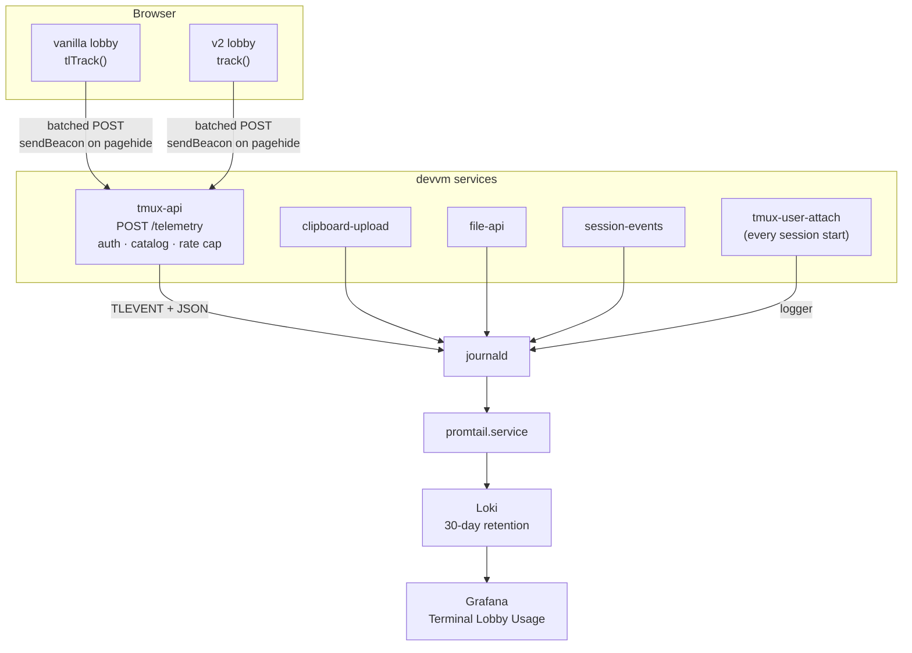

# Usage events ride the journal we already ship, not a new collector

We could not answer "which parts of the lobby earn their keep?" — nothing
recorded usage. Every service and both frontends now emit **usage events**:
one line per meaningful action, carrying the OS user who took it.

The transport is the pipeline that was already there. The devvm's journal is
shipped to the cluster's Loki by `promtail.service`, so a line written to
stdout is queryable in Grafana within seconds — no new service, no new host,
no cost. Verified before building: `{job="devvm-journal",unit="tmux-api.service"}`
already returns live lines.

Each event is a `TLEVENT` marker followed by a JSON object using
**OpenTelemetry log-record naming** (`event.name`, `service.name`,
`service.version`, `user.id`, `attrs`). The names are the OTel ones on purpose:
the payload can be pointed at a real OTLP collector later without touching a
single call site.

```
TLEVENT {"ts":"2026-08-03T00:12:31Z","event.name":"session.selected",
         "service.name":"tmux-api","service.version":"65e8b57","user.id":"wizard",
         "attrs":{"tl.session":"worktree","tl.kind":"own","tl.client":"lobby-v2"}}
```



## Considered Options

- **Real OTLP into the cluster's Alloy** — Grafana Alloy already runs as a
  6-pod DaemonSet and is OTel-native, so this looked like the obvious answer.
  It exposes only port 12345 with **no OTLP receiver configured**, so it would
  need a Terraform change plus an authenticated ingress for browser traffic —
  new moving parts for a payload we can already deliver. Kept as the upgrade
  path, which is why the field names are OTel's.
- **Full OTel with traces (add Tempo)** — there is no trace backend in the
  cluster. Spans would answer latency questions this feature never asked.
- **JSONL files on disk** — the shape `clipboard-upload`'s existing
  `/telemetry` route uses for selection diagnostics. Rejected here: files on
  the devvm are not queryable from Grafana, which is where the questions get
  asked. **Note the name collision:** `/clipboard/telemetry` is unrelated
  trackpad-selection debugging; usage events go to `/api/sessions/telemetry`.

## Constraints that shaped it

- **Loki is a shared single anonymous tenant with a global 5000-active-stream
  cap.** `promtail`'s config strips labels deliberately to stay under it —
  exceeding it 429s new streams *for every service in the homelab*. So every
  attribute lives inside the JSON line and **nothing here becomes a label**.
  The naive "label by user × event × session" design would have taken down
  homelab logging.
- **Loki retention is 30 days** (`720h`). This is a rolling window, not
  history. Long-term trends would need counters in Prometheus (26 weeks),
  which this ADR does not build.
- **Session and project names are user-supplied.** A raw newline in one would
  let anyone who can name a session forge whole telemetry records in the
  journal, so values are JSON-escaped onto one line and length-bounded.
- **The event vocabulary is closed** (`telemetry/events.go`). A typo would
  otherwise mint a series nobody queries, and the browser intake accepts names
  from the client — an open vocabulary there would let a tab write anything.

## What is recorded, and what is not

Events record **which feature ran**: ids, names, counts, kinds. Never
conversation content, prompt text, file contents, or keystrokes.
`claude.prompt_sent` carries the prompt's *length*, never its text.

Events carry `user.id` — the whole point is to compare how each of us works —
resolved **server-side** from the Authentik header. The browser never states
who it is, and a tab cannot attribute an event to another user.

## Where events come from

| Source | Events |
|---|---|
| `tmux-api` | session kill/rename/restore, session→project moves, project CRUD + mode/co-own, shares, layout reorder, copy-mode, push subscribe |
| `clipboard-upload` | image upload, gallery list, `show-image` registration, non-image transfers |
| `file-api` | file preview, file save (by extension) |
| `session-events` | prompt sent, cancel, SSE stream open/close |
| `tmux-user-attach` | `session.attached` — **every** session start flows through this script, including plain ttyd URLs that never touch the lobby |
| both lobbies | tab boot, selection, creation, palette/commands, view switch, sidebar + group collapse, theme, prefs, gallery/editor opens, paste/drop, soft keys, notification opt-in/delivery, self-updates applied (`app.reloaded`) or given up on (`app.update_failed`, ADR-0007), errors the user saw |

Client events deliberately do **not** duplicate what a service already
records. Kills, renames, moves, shares, saves and uploads are emitted
server-side only — emitting them in the browser too would double every count.

## The browser intake

The pages cannot write to the journal, so they batch events and POST them to
`tmux-api`'s `/telemetry`, which already authenticates every request. It is
client-facing, so: body capped at 64 KiB, 50 events per batch, 600 events per
minute per user (token bucket), event names checked against the catalog,
attributes restricted to flat `tl.*` scalars, and identity taken from the auth
header. Telemetry never breaks a page — failures are swallowed, buffers are
bounded, a dead intake costs one dropped batch. The final flush of a closing
tab rides `sendBeacon` on `pagehide`.

## Querying

```logql
# every usage event
{job="devvm-journal"} |= "TLEVENT" | json

# what each of us used this week, most-used first
sum by (event_name, user_id) (
  count_over_time({job="devvm-journal"} |= "TLEVENT"
    | json event_name="event.name", user_id="user.id" [7d])
)

# which tool sessions actually get started
sum by (tl_kind) (count_over_time({job="devvm-journal"} |= "TLEVENT"
  | json name="event.name", tl_kind="attrs.tl.kind"
  | name = "session.attached" [7d]))

# errors people actually saw
{job="devvm-journal"} |= "TLEVENT" | json name="event.name" | name = "app.error"
```

The **Terminal Lobby Usage** dashboard in Grafana
(`infra/stacks/monitoring/modules/monitoring/dashboards/terminal-lobby-usage.json`)
renders these.

## Consequences

- Adding an event means editing **three** places in one commit: the Go catalog
  (`telemetry/events.go`), the TS union (`frontend-v2/src/telemetry/track.ts`),
  and the table above. The duplication is deliberate — it makes a typo a
  compile error on both sides.
- Analysis is limited to a rolling 30 days.
- Event volume is bounded by the intake's rate cap, not by taste. A new
  high-frequency call site should be counted client-side and reported
  periodically rather than emitted per occurrence.
