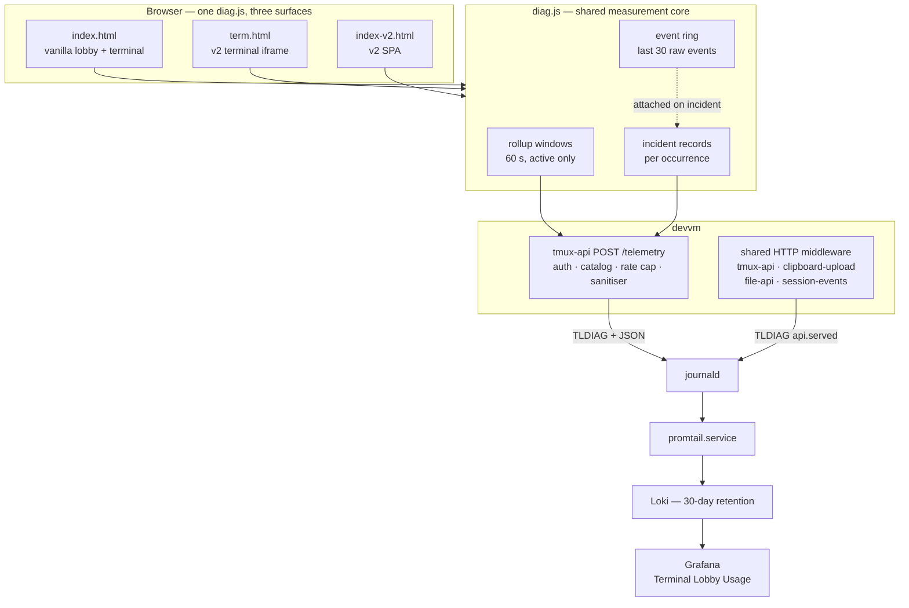
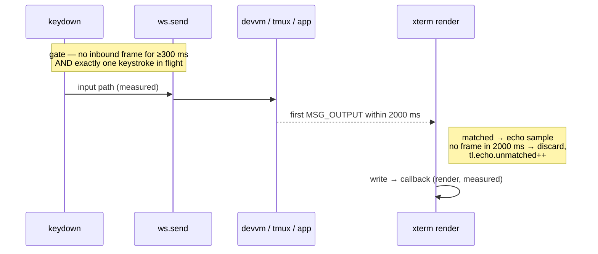
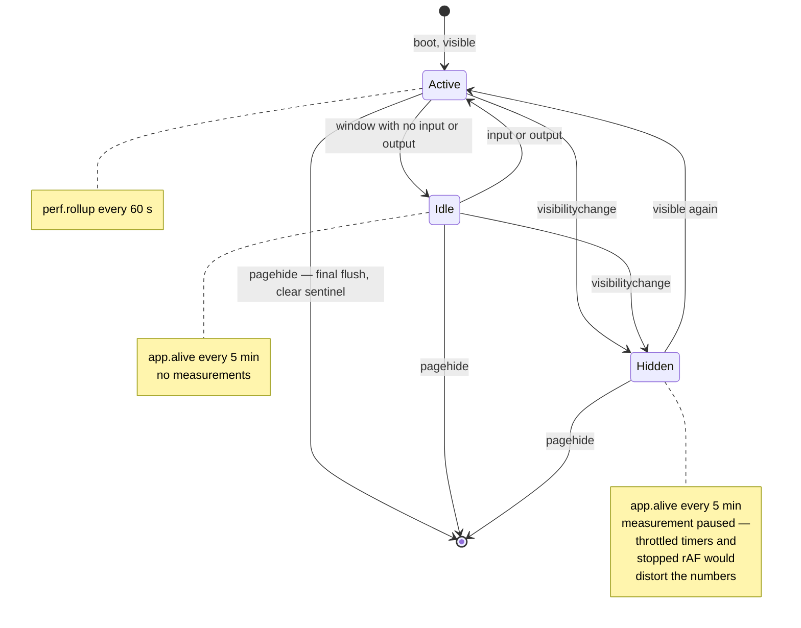
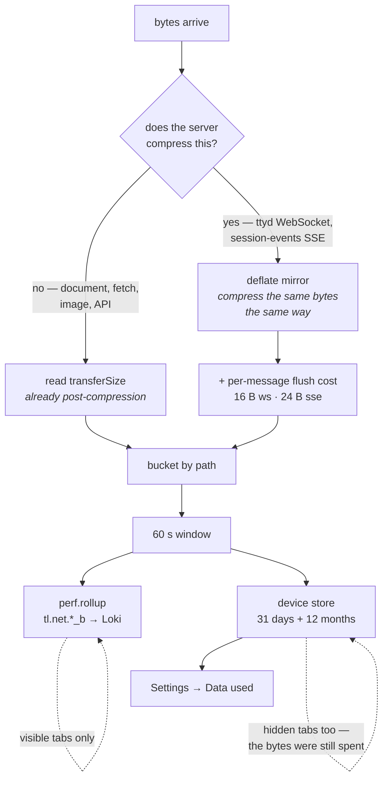

# Client diagnostics ride the usage pipeline, with their own marker

We can answer "which parts of the lobby earn their keep?" (ADR-0006) but not
"why did it feel slow on Tuesday?" or "what broke on emo's phone?". Nothing
records performance yet, and reliability is covered by one event, `app.error`,
which carries a `kind`.

This ADR adds **diagnostics**: per-session performance measurements and a full
record of each failure, from every surface, queryable in Grafana.

```stats
60 s | rollup window, active tabs
5 min | liveness heartbeat when idle
300/min | diagnostics rate budget per user
30 days | Loki retention, unchanged
3 | surfaces, one shared diag.js
12 | record types in the catalog
```

## Where the gap is today

ADR-0006 built a working browser→Loki path and this design reuses all of it.
What that path does not yet carry:

| Signal | State today |
|---|---|
| Any latency measurement | None. `performance.now` appears 15× per frontend, all for internal timing |
| Navigation / resource timing | None. No `PerformanceObserver` anywhere |
| Device and network context | None captured |
| Exception detail | `app.error` records `tl.kind` only — no message, no stack |
| Terminal-surface telemetry | `frontend/term.html` emits nothing. It calls `tlTrack` at `:4737` and `:4743` but never defines it, so those paths raise a `ReferenceError` when a pending self-update record exists |
| Tab correlation | No identifier joins one tab's records together |
| Connection health | WebSocket drops, reconnects and downtime are unrecorded |

The `tlTrack` gap shows the shape of the problem: a latent error on the
post-self-update boot path of the terminal surface, which no current signal
would report.

## Decisions

| Question | Decision |
|---|---|
| Scope | All four: terminal interactivity, reliability/errors, startup performance, backend latency as the client sees it |
| Record shape | Hybrid — windowed rollups for measurements, per-occurrence records for failures |
| Channel | Same `/telemetry` intake and same Go module as ADR-0006; distinct `TLDIAG` marker, own catalog, own rate budget |
| Correlation | Tab id, parent (lobby) id, persistent device id, session name, connection sequence |
| Echo latency | Quiet-gated sampling with an explicit unmatched count |
| Exception detail | Message, source location and stack, unredacted, deduped with a count |
| Cadence | 60 s rollups while active; liveness heartbeat every 5 min while idle or hidden; crash detection via a boot sentinel |
| "Active" | Visible **and** saw traffic. Focus not required |
| Code shape | One `frontend/diag.js`, inlined into all three surfaces at build |
| Server side | Shared middleware on the four Go services, joined to the client by request id |
| Retention | Loki only, 30 days. No Prometheus, no alerting |
| Dashboard | Health rows added to the existing *Terminal Lobby Usage* dashboard, collapsed by default |
| Disclosure | Default on, with a settings toggle and a `?diag=0` per-tab escape hatch |
| Selection JSONL | Folded in — its flight-recorder capability becomes a general TLDIAG feature |
| Rollout | All three surfaces in one pass |

## Architecture



## The record vocabulary

A closed catalog, for the reasons ADR-0006 gives: a typo would mint a series
nobody queries, and the intake accepts names from the client.

| Record | When | Carries |
|---|---|---|
| `perf.rollup` | every 60 s while active | input / echo / render latency (n, p50, p95, max), echo unmatched count, long-task count and total, frame jank count, WS bytes and frames, per-endpoint API n/p50/p95/errors, wire bytes per feature bucket (`tl.net.*_b`, see [Counting bytes](#counting-bytes)) |
| `app.alive` | every 5 min while idle or hidden | ids, uptime, `tl.state` (idle\|hidden). No measurements |
| `app.died` | next boot after an unclean exit | previous tab id, uptime, last-seen session |
| `conn.opened` | per occurrence | token-fetch ms, handshake ms, attempt number |
| `conn.dropped` | per occurrence | close code, uptime, reconnect number, downtime ms, `tl.reason` |
| `term.stall` | per occurrence | input sent with no output for longer than the threshold |
| `app.exception` | per occurrence, deduped | message, `file:line:col`, stack, occurrence count, `tl.kind` |
| `api.slow` | per occurrence over threshold | endpoint, status, duration, request id |
| `api.served` | server side, over threshold | endpoint, duration, status, request id |
| `api.rollup` | server side, every 60 s | per-service distribution by endpoint group |
| `app.context` | per boot | navigation timing, transfer size, cache hit, device and network context |
| `term.ready` | per boot | iframe boot → first byte → first paint |
| `diag.incident` | per occurrence | `tl.kind` plus the preceding raw event trace |

Boot context is a diagnostics record of its own rather than an extension of the
usage `app.loaded`, so the whole health vocabulary stays selectable by the
`TLDIAG` marker.

Every record additionally carries `tl.tab`, `tl.parent`, `tl.device`,
`tl.session`, `tl.conn`, `tl.client` and `tl.role`. `tl.client` names the
surface; `tl.role` distinguishes lobby from terminal, because vanilla
`index.html` serves both roles from one file.

## How echo latency is sampled

A keystroke travels `keydown` → `term.onData` → soft-mod wrapper → `sendInput` →
`ws.send` → devvm → inbound `MSG_OUTPUT` frame → `term.write(data, cb)` → render
callback. The flow-control accounting at `term.html:9441+` already registers
those write callbacks, so the render leg costs nothing new.

Input-path cost and render cost are unconfounded. Echo round-trip is not: if
Claude is mid-turn, the next inbound frame is unrelated output rather than an
echo. Sampling is therefore gated.



The rollup reports `tl.echo.unmatched` alongside `tl.echo.n`. A p95 drawn from
47 usable samples out of 165 attempts is a different claim than one drawn from
400, and the record says which it is.

Percentiles come from raw samples held per metric per window, capped at 512 with
reservoir sampling beyond, sorted at window close. Exact for windows of 512
samples or fewer; sampled above that, and bounded in memory either way.

## When a tab measures



Focus is deliberately not part of "active": a terminal rendering a long Claude
turn in a background window is a real rendering-performance case worth
measuring. Input-latency fields are simply absent from windows where nobody
typed.

Crash detection costs nothing while idle. Boot writes a sentinel to
localStorage; `pagehide` flushes a final partial rollup and clears it. A
sentinel present at the next boot means the previous page life ended without a
`pagehide` — killed rather than closed — and is reported once as `app.died`.

## The flight recorder

The existing selection-diagnostics channel (`?seldebug` →
`_telemetry/<user>.jsonl`) is retired, and the capability that made it valuable
becomes general. It keeps a 30-entry ring of raw input events and flushes it
when a selection anomaly fires; that recording identified the cause after
earlier fixes had not. Reducing it to counts would discard the part that carried
the diagnostic value.

So `diag.js` keeps a rolling ring of recent raw events on every surface, and any
incident — stall, exception, WS drop, selection clear — carries the preceding
trace. One channel, one opt-out, and the recorder now covers every failure class
rather than one.

Measured before deciding: the JSONL channel is live, not dormant —
`emo.jsonl` was written on 2026-08-14 at 09:51 (150 KB) and `wizard.jsonl` is
393 KB. Retiring it removes a working instrument, which is why the capability
is carried across rather than dropped.

## Constraints inherited, and two deliberate relaxations

ADR-0006's constraints all still apply: Loki is a single anonymous tenant with a
global 5000-active-stream cap, so nothing here becomes a label and every
attribute lives inside the JSON line; retention is 30 rolling days; user-supplied
names are JSON-escaped and bounded.

Two rules are relaxed on purpose, both scoped to diagnostics records:

- **`tl.stack` may reach 1024 bytes**, against the 512-byte `MaxValueLen` that
  applies elsewhere. A stack truncated to 512 bytes routinely loses the frames
  that identify the call path.
- **`tl.trace` may be an array**, which `sanitizeAttrs` otherwise drops
  (`telemetry.go:156`). It is validated as a flat array of scalar-valued
  objects, capped at 30 entries and 4 KiB, and permitted only on per-incident
  records — never on a rollup.

Diagnostics gets its own token bucket at 300 events/min/user, separate from the
600/min usage budget, so a diagnostics burst cannot starve usage events or the
reverse. Expected steady-state volume is roughly 2 records/min per active tab.

## Counting bytes

Added for the *Data used* readout in the v2 settings panel: how
many bytes Terminal Lobby cost this device today, this month and last month,
broken into five feature buckets.

`tl.ws.in_b` has been recorded since this ADR shipped, and it measures something
different.
ttyd negotiates `permessage-deflate` with context takeover in both directions —
verified live against ttyd 1.7.7-40e79c7, whose upgrade response carries a bare
`Sec-WebSocket-Extensions: permessage-deflate` with no `no_context_takeover`
parameter — so `tl.ws.in_b` is counted after the browser inflates the frame.
Measured against real pane content shaped as a stream, the wire carries about
13.6x less; a static capture gives 2.6x and a redraw-heavy turn far more.

So one rule decides how each bucket is counted: **anything the server
compresses is modelled; everything else is read from `transferSize`.**

```stats
13.6x | terminal output compresses on the wire
~4% | modelled vs measured, end to end
5 | feature buckets
48 | attribute cap, raised from 24
31 + 12 | daily buckets, monthly totals
16 ms | mirror CPU per busy minute
```



| Bucket | Attribute | Source | Kind |
|---|---|---|---|
| Terminal | `tl.net.term_b` | ttyd WebSocket, deflate mirror | modelled |
| App code | `tl.net.app_b` | document, `term.html`, fonts, build stamps | exact |
| Text view | `tl.net.text_b` | session-events SSE, deflate mirror | modelled |
| Files & images | `tl.net.files_b` | file-api reads, listings, `` sources | exact |
| API | `tl.net.api_b` | tmux-api, clipboard, skills | exact |

`tl.net.term_in_b` and `tl.net.text_in_b` carry the decompressed input each
estimate was computed from, so the ratio the mirror believes is derivable from a
single record. `tl.net.term_drop` and `tl.net.text_drop` appear when a mirror
refused frames under backpressure, so a figure that is low because the mirror
gave up does not look like one that is low because the link was quiet.
`tl.ws.in_b` keeps its existing meaning, so panels built on it are unaffected.

### The attribute cap

`perf.rollup` is the record that carries the most, and adding seven fields put a
busy one over `MaxAttrs`. `bound()` truncates by **sorted key**, so an overflow
does not lose an arbitrary field — `tl.net.*` sorts ahead of `tl.role`,
`tl.session`, `tl.tab`, `tl.win_s` and `tl.ws.*`, which are exactly the
correlation attributes and the byte counts.

Measured over 24 hours of live diagnostics before changing anything: 400
records, median 15 attributes, maximum exactly 24 — the cap — with 4.5%
sitting on it. Records were therefore already being truncated in
production, independently of this change. `MaxAttrs` is therefore 48, which fits the full
vocabulary (8 correlation + 2 window + 20 metric + 3 counters + 4 WebSocket + 7
`tl.net.*` = 44) with headroom, and a Go test now asserts a complete
`perf.rollup` survives `bound()` intact.

### The mirror

Each compressed stream is fed into a `CompressionStream("deflate-raw")` in
parallel with the application, reproducing the server's own compression
including the shared sliding window that makes a redrawn screen collapse.

It is rotated at each window boundary. A `CompressionStream` emits nothing until
`close()` —
measured, 435,600 bytes of input produced zero readable output across 200 writes
— so one mirror per connection would read zero for the life of a socket that
never closes. It is therefore closed and restarted at each window boundary, and
its result is attributed to whichever window is open when it resolves.

Rotation resets a context the server never resets, so it overstates. Measured
over the same 3,000-frame stream:

| Model | Wire bytes | Ratio |
|---|---|---|
| Continuous context (the server) | 268,833 | 13.6x |
| Rotated per window (the mirror) | 273,591 | 13.3x |

+1.8%, against the 13.6x being estimated. Cost is 23 MB/s of decompressed
input — about 16 ms of CPU per minute for a busy window, taken from a live
`perf.rollup`.

### The per-message correction

The mirror and the server differ in a second, larger way. `permessage-deflate` ends a deflate block per message with a sync
flush; `CompressionStream` has no flush API, so the mirror compresses a whole
window as one continuous block and never pays that cost. Over the same 3,000
frames: 273,591 bytes with a per-message flush against 208,671 without — the
mirror would under-report by 23.7%, or 21.6 bytes a message.

The cost grows with message size, because ending a larger block early wastes
more:

| Message | 40 B | 200 B | 600 B | 1.2 kB | 4 kB | 16 kB |
|---|---|---|---|---|---|---|
| Missing bytes | 11.3 | 12.5 | 17.5 | 20.7 | 28.2 | 29.6 |

Terminal messages measured live average about 780 B (377,080 B over 486 frames;
318,710 over 400), which puts the flush cost near 18 B. The mirror therefore
adds 16 bytes per message: that 18, less the four-byte tail
`permessage-deflate` strips, plus a two-byte WebSocket frame header at these
payload sizes.

It is a calibrated estimate rather than a measurement, and it is deliberately
auditable — `tl.ws.in_n` carries the message count on the same record, so the
correction can be backed out of any figure.

Checked end to end against a real capture through the shipped code: 3,647,144
decompressed bytes model to 256,127 wire bytes against a ground truth of roughly
267,600, so **within about 4%** — where the uncorrected mirror was 24% low.

### The Text view's stream

Three things about SSE differ from the WebSocket and each needed its own answer.

**Named events.** `session-events` writes `event: state` for the opening
snapshot, `event: back` for the backfill and `event: ready` (`sse.go:229-317`),
and a `message` listener fires only for *unnamed* events. Subscribing to
`message` alone would have missed the opening replay — the largest single
transfer the view makes, and the reason the wrapper exists. Rather than hard-code
the protocol's event names, the wrapper intercepts `addEventListener` and mirrors
whatever the page itself subscribes to.

**The framing.** The browser strips `id:`, `event:` and the blank-line
terminator before handing an event over, but the server compressed them with the
payload. The mirror is fed the line form reconstructed from the event's own
`lastEventId` and `type`, so what it compresses is what went over the wire.

**Its own per-message constant.** gzip over HTTP is not `permessage-deflate` over
a WebSocket: no frame header, and no four-byte tail stripped. Measured over 300
events at gzip 6 — 9.5 bytes missing per 200 B event, 14.5 at 1 kB, 26.4 at 5 kB,
25.8 at 20 kB — plus roughly 9 bytes of HTTP chunk or HTTP/2 DATA framing per
flush. The SSE mirror uses 24. It is the least precise number here, and on
the multi-kilobyte turns this stream mostly carries it is under 1% of an event.

A closed `EventSource` does produce a Resource Timing entry, and the client
closes and reconnects itself on every error (`sse/client.ts:164`), so one arrives
per reconnect. `/events/` is therefore excluded from the `transferSize` path;
counting both would charge that stream twice. `/earlier/` is an ordinary fetch
and is measured normally.

### Two failure modes the mirror avoids

**Rotation must not drop frames.** A mirror with no writer discards everything
written to it, so a rotation hands the replacement over *before* closing the
outgoing compressor. Each compressor owns its own counters, because the closed
one's pump keeps running while it drains.

**An empty flush is not traffic.** Closing a `CompressionStream` that received
nothing still emits two bytes. Counted as output that would mark traffic on every
rotation — and the lobby surface has no terminal socket at all, so its terminal
mirror rotates empty every minute. A visible but idle tab would have emitted
`perf.rollup` indefinitely, `app.alive` would never have fired again, and the panel
would have shown Terminal bytes on a device that never opened one. A mirror with
no messages therefore does not rotate at all.

### Two deliberate divergences

The device counter is not gated on visibility, unlike the rollup. A hidden
tab that downloaded four megabytes really did spend four megabytes, whatever its
throttled timers were doing to the latency numbers. The `tl.net.*` attributes
still ride `perf.rollup` and so are only recorded when a rollup is emitted —
the panel is complete, Loki is a sample.

Counting also continues while **Send diagnostics** is off. That toggle is
consent to send, and a counter that never leaves the browser is not a send;
someone who has just opted out is the person most likely to want to know what
the app is costing them. The panel says so in place of the usual note.

### What no measurement can settle yet

Traefik logs no `101` for the terminal route, so there is no server-side wire
figure to validate the mirror against. The `tl.ws.in_b` / `tl.net.term_in_b`
pair gives the ratio the mirror believes, which is a consistency check rather
than an accuracy one. `transferSize` is also a floor: it excludes TLS record
framing and HTTP/2 header-compression amortization.

## Volume

| State | Records |
|---|---|
| Active tab | ~1 rollup/min (lobby) + ~1/min (terminal iframe) |
| Idle or hidden tab | ~12 liveness records/hour |
| Incidents | Per occurrence, deduped by message and top frame within the window |

At two users this sits well inside both the intake cap and the stream budget.

## Where the code lives

One implementation, `frontend/diag.js`, holding the measurement core: quiet-gate
state machine, percentile accumulation, dedupe, event ring and bounded buffer.

- `deploy.sh` and `deploy-v2.sh` substitute it into a `__TL_DIAG__` placeholder
  in `index.html` and `term.html` — plain `sed`, matching how `__TL_BUILD__` and
  `__TL_ASSET__` already work, with the same fail-the-deploy check for surviving
  placeholders.
- `frontend-v2` inlines it through the single-file build it already runs
  (`vite-plugin-singlefile`, `removeViteModuleLoader: true`).
- `frontend-v2/test/` covers it directly. vitest with jsdom is already the
  runner for 65 test files, and a plain-JS module imports into it unchanged.

> [!IMPORTANT]
> The asset fingerprint has to cover `diag.js`. ADR-0007 computes `TL_ASSET`
> from `sha256sum frontend/index.html` on the unstamped source, so a change
> confined to `diag.js` would leave every page's identity unmoved and no tab
> would ever self-update to the corrected code — ADR-0007's failure mode
> inverted. Each surface's fingerprint therefore hashes its own source
> concatenated with `diag.js`.

Wiring `diag.js` into `term.html` also supplies the `tlTrack` that its
self-update paths already call, closing the dangling reference at `:4737` and
`:4743`.

> [!WARNING]
> **The placeholder needs its own line.** `sed`'s `d` deletes the whole matched
> line, so a `<script>__TL_DIAG__</script>` written on one line loses both tags
> and the core ships as inert text in `<head>` — present, greppable, and never
> executed. The first deploy of this ADR did exactly that on both vanilla
> surfaces; the v2 SPA was unaffected because its placeholder was already on
> its own line.
>
> It passed every check that was being run: the core was in the page, no
> placeholder survived, and every inline script parsed — because text outside a
> script block is not a script for a parser to check. **Presence is not
> evidence of execution.** Both deploy scripts now assert the core sits inside
> an open script element, and the boot path is exercised by driving `bind()`
> against the real served page under jsdom.

## Splitting network from server

The client stamps `X-TL-Req: <tab>-<n>` on API calls. A shared middleware across
`tmux-api`, `clipboard-upload`, `file-api` and `session-events` emits a 60 s
rollup per service by endpoint group, plus an `api.served` record for any
request over the threshold, echoing the request id.

```
client  api.slow   {tl.ep:"/layout", tl.ms:812, tl.req:"f3a91c02-17"}
server  api.served {tl.ep:"/layout", tl.ms:6,   tl.req:"f3a91c02-17"}
```

The 806 ms difference is not devvm handling time. `ttyd` stays uninstrumented —
it is the C binary carrying a local patch, and its health is already visible
through the client-side WebSocket metrics.

## Deploys drop every WebSocket

A deploy restarts `ttyd`, which drops every open WebSocket; tabs reconnect
automatically. Every deploy will therefore produce a `conn.dropped` for every
open tab, and unlabelled that would read as a reliability problem. When the
asset id observed after a reconnect differs from the one before it, the drop
carries `tl.reason:"deploy"` so deploy churn is separable from real instability.

## What is recorded, and what is not

> [!NOTE]
> Diagnostics record how the app performed and how it failed — never what was
> typed into it. The same boundary ADR-0006 set for usage events applies here
> unchanged.

Diagnostics record timings, counts,
close codes, stack traces, device and network characteristics. Never
conversation content, prompt text, file contents, or general typing. The event
ring captures input *geometry and control keys* — pointer positions, wheel
deltas, Enter/Escape/modifier chords — on the same basis the selection channel
already did, not typed characters.

Records carry `user.id` resolved server-side from the Authentik header. The
browser never states who it is.

`tl.device` is a persistent random id in localStorage. It identifies a browser
profile across reloads so device-specific problems are visible, and it adds no
identification beyond the OS-user attribution every record already carries.

## Disclosure

Diagnostics are on by default, with a **Send diagnostics** toggle in the
settings panel and a `?diag=0` escape hatch for a single tab. The toggle is the
disclosure: discoverable by anyone who opens settings, with no banner.

This is a change from ADR-0006, which recorded usage with no in-app surface.
Diagnostics collect more — stack traces, a persistent device id, hardware
and network characteristics — from both users, so the control is visible.

## Querying

A journal line carries a prefix before the marker and the record's field names
contain literal dots, so every query strips the prefix and addresses fields
with bracket notation. ADR-0006 has the full explanation; the short version is
that `| json` on a raw line raises `JSONParserErr`, and a dotted path walks
nested objects that do not exist.

```logql
# echo latency p95 over time, per device
max by (device) (max_over_time({job="devvm-journal"} |= "TLDIAG"
  | line_format `{{ regexReplaceAll "^.*?TLDIAG " __line__ "" }}`
  | json name="[\"event.name\"]", device="attrs[\"tl.device\"]",
         v="attrs[\"tl.echo.p95\"]"
  | name = "perf.rollup" | unwrap v | __error__ = "" [$__interval]))

# what one tab did, in order, before it went wrong
{job="devvm-journal"} |= "TLDIAG"
  | line_format `{{ regexReplaceAll "^.*?TLDIAG " __line__ "" }}`
  | json tab="attrs[\"tl.tab\"]" | tab = "f3a91c02"

# exceptions, most frequent first
sum by (msg, src) (count_over_time({job="devvm-journal"} |= "TLDIAG"
  | line_format `{{ regexReplaceAll "^.*?TLDIAG " __line__ "" }}`
  | json name="[\"event.name\"]", msg="attrs[\"tl.msg\"]", src="attrs[\"tl.src\"]"
  | name = "app.exception" [$__range]))

# one slow call, client-side and server-side
{job="devvm-journal"} |= "TLDIAG" |= "f3a91c02-17"
```

The **Terminal Lobby Usage** dashboard renders these as four rows — Latency,
Connections, Failures and Load — collapsed by default, so the usage view is
unchanged until a health question comes up.

## Consequences

- Adding a diagnostics record means editing the Go catalog, `diag.js`, and the
  vocabulary table above in one commit. Same deliberate duplication as ADR-0006.
- `diag.js` is inlined into three artifacts, so any change to it re-fingerprints
  all three and every open tab self-updates. That is the intended behaviour and
  it makes diagnostics changes more visible than backend-only ones.
- Analysis stays within a rolling 30 days. Long-term drift ("is the terminal
  slower than it was in spring") and alerting both remain unbuilt. The host side
  of that path already works — the devvm runs node_exporter with an active
  textfile collector at `/var/lib/prometheus/node-exporter/` — and the cluster
  side would need a scrape target; none for the devvm appears in
  `infra/stacks/monitoring/` today.
- Retiring the JSONL channel removes on-host raw traces. The ring buffer
  replaces the capability, bounded at 30 entries rather than unbounded on disk.
- Building this surfaced that ADR-0006's queries and every panel on the
  existing dashboard were returning parser errors rather than data, for the two
  reasons under Querying. They are corrected in the same change, since the
  health rows land in that dashboard and shipping working panels beside broken
  ones would be worse than either.

## Open questions

- The 300 ms quiet gate, 2000 ms match deadline, and stall threshold are
  starting values chosen from the shape of the problem, not from measurement.
  They will need tuning once real distributions exist; `tl.echo.unmatched` is
  the signal for whether the gate is too strict.
- Whether the 5-minute heartbeat is frequent enough to locate a tab death
  usefully is untested. The sentinel makes the *fact* of an unclean exit exact;
  only the timing is bounded by the heartbeat.
- Rollup memory under a very long-lived tab (many days) has not been measured.
  The buffers are bounded by construction, but the bound has not been observed
  in practice.
