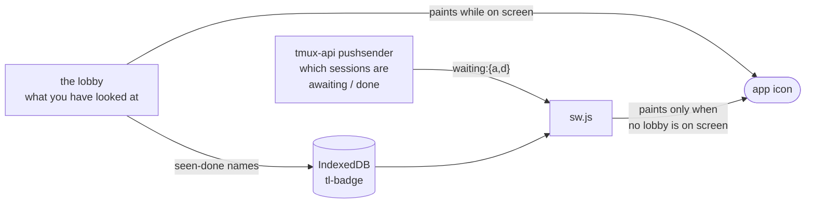

# The device decides what you have seen

Viktor, 2026-09-01: *"somethign is wrong with the counter. i dont know which
sessions are unread. also once a new notification comes, the counter wrongly
resets to a bigger number."*

The installed app badges its icon with how many sessions are waiting. The number
has two writers, and they have to agree, because the badge only earns its keep
while the app is shut and the page cannot paint it then.

The first version had the server send a total. That could not work, and the
reason is worth stating plainly: the two halves of the answer live in different
places. Only the server knows which sessions are awaiting input or finished. Only
the browser knows which of them the user has already looked at. A server-side
total counted every finished session, so a push replaced the page's number with a
larger one — measured at 1 becoming 8 on Viktor's account — in front of him.

## What we decided

**The server sends the population; the device reaches the conclusion.**

The push payload carries `waiting: { a: [names awaiting], d: [names done] }`
alongside the old `badge` total. `store/visits.ts` mirrors the finished-and-read
session names into IndexedDB whenever the unseen set changes, and `sw.js`
subtracts that set from `d` before drawing. The page keeps painting from its own
poll while a window is on screen, and the worker now checks for a focused or
visible lobby and leaves the icon alone when it finds one.

One rule that is not obvious: the session a push is *about* is dropped from the
seen set before the subtraction. It has just transitioned, so whatever was read
of it is stale and it is unread again. The page applies the same rule, which is
why a session you had already read counts again when it finishes a second time.

`badge` stays in the payload. It is what a worker installed before this change
draws, and what any device draws when the name list would exceed 64 entries —
about 2 KB against a Web Push body of roughly 4 KB.

## Why not have the server learn what you have seen

It is the obvious alternative and it makes the number exact everywhere, including
across devices. We did not take it because the roamed prefs store is written as a
whole document, so "seen" would become shared mutable state that every device
overwrites wholesale. A phone that has been offline would PUT a stale map and
un-read sessions on the laptop. That is a number that jumps, which is the
complaint. It also puts a debounced write on every 5 s poll into a
mutex-guarded file store.

Worth revisiting if per-key prefs writes ever land.

## Why not narrow the badge to something the server knows on its own

Counting only sessions awaiting input needs no seen set at all. Measured live on
Viktor's account: 0 awaiting, 8 finished. An awaiting-only badge would read zero
almost always, and `done` is the state he cares about — a finished turn is the
thing that wants reading.

## What the number does while the app is shut

| situation | badge |
|---|---|
| a session you have never read finishes | counts |
| a session you already read is still finished | not counted |
| a session you read finishes again | counts |
| a completion the activity gate suppressed | counts on the next push |
| no stored record at all (private window, cleared data) | every finished session counts |

Two limits we accept, stated so nobody has to rediscover them. Seen is per
device, so reading a session on the laptop does not clear the phone's badge. And
while the app is shut the badge cannot shrink, because a push that shows no
notification costs iOS the notification permission, so there is no silent
count-only update to send. Both fail in the same direction: a number that is too
big, not a number that moves under the user. One app open corrects it.

## What else this had to fix first

The count was not the only thing wrong, and the largest problem was not in the
badge at all.

**The visit store was emptied on every app open.** `observe()` prunes its records
against the session list it is handed, and the notification effect handed it the
*pre-poll empty* list on mount. Every launch deleted every visit and every state
stamp, and the first real poll re-stamped each session as freshly finished, so the
whole account came back unread. On iOS a notification tap cold-launches the PWA,
which is a mount, which is why it looked like the notification caused it. An
empty list now means "not known yet" and observes nothing.

**Nothing could show which sessions were unread.** The card answered with
`state === "done"`, a placeholder left when the visit store was wired for the tab
title and favicon, so every finished session wore the unread treatment and the
dimmed variant was unreachable. Measured on the deployed build: 8 finished, 8
marked unread, 0 dimmed, unchanged after visiting half of them. The badge counted
a set the sidebar had no way to point at.

**The dot could not carry the distinction alone even once wired.** Measured
against the resting sidebar backdrop, the seen-to-unseen opacity step is 3.35:1
on slate, 2.97:1 on carbon and 1.77:1 on catppuccin-latte, so five of eight
themes sit below the 3:1 floor for non-text contrast; and unread-done and
awaiting shared a halo, leaving them separated by hue. Unread moved to the row —
a bar and a heavier name, reusing what the active row already teaches — and the
halo went back to awaiting alone. `stateLabel` gained "Done, not seen yet" so a
tooltip and a screen reader get it as words.

**The badge never corrected itself.** `setSessions(reconcile(...))` writes nothing
on an unchanged poll, so the effect did not re-run: measured at zero repaints
across 35 s of live polling. It now reads a poll counter and repaints every
cycle, which also fixes a failed first poll clearing a correct badge, since
`loading` goes false whether or not `/sessions` answered.

## Consequences

Parity is now pinned by a fixture both sides read, `testdata/badge-parity.json`.
Each side had tests before and each passed, because neither ran the other's
arithmetic. For the shape measured on Viktor's account the old server total is 9
where the answer is 1.

Visit records are keyed by tmux session id rather than by name, so a rename made
on another device or at a shell no longer resurrects work already read. Records
written under the old scheme are carried across the first time their session is
seen with an id.

"Seen" now requires focus, not merely visibility. A turn finishing while the
lobby is visible behind another window stays unread. That is a deliberate
tightening of an earlier choice, and it is what makes the count trustworthy
enough to act on.

A session someone else shared with you is excluded from the count on both sides.
Nobody here has one today, so it would otherwise have surfaced the first time
somebody did.
