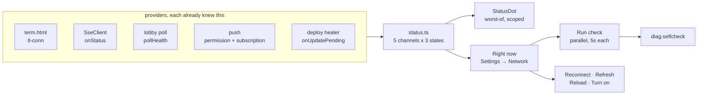

# A client can see whether it is connected

Viktor, 2026-09-01: *"clients should be able to see their connection status
(e.g. is websockets working) etc. this should be viewable in the ui somewhere so
it's easy to see the status"*

A client keeps five things alive, and until now a person could see two of them.
The transcript stream had a badge in the session bar. The terminal socket
painted a pill inside its own iframe. The session-list poll, notifications and a
build the page is no longer running reported nothing at all.

So "it stopped working" had no answer anyone could reach on their own. ADR-0008
records all of it — every drop, every reconnect, every stall goes to Loki and
has for weeks — but reading it means a Grafana trip, which is not something the
person holding the frozen phone can do.

```stats
5 | channels, one status model
3 | states, plus one that is not a verdict
2 | places the badge appears, scoped differently
5 s | cap on each probe, run in parallel
0 | notifications sent by a check
1 | new record in the diagnostics catalog
```

## What we decided

**Five channels, three states, one badge, and a panel that can go and look.**

| Channel | Where its truth lives | What was visible before |
|---|---|---|
| Terminal | the ttyd WebSocket, inside `term.html` | a pill inside the iframe |
| Transcript | `SseClient` status | a badge, text view only |
| Session list | the lobby poll's backoff ladder | nothing |
| Notifications | permission, subscription, and the server's copy | nothing |
| Build | the deploy healer's deferred update | nothing |

`src/diagnostics/status.ts` holds the model and is pure: the rules that decide
what a person is told are testable without a browser, a socket or a clock. The
live wiring is `status-store.ts`, the probes are `probes.ts`, and the two
readers are `StatusDot.tsx` (the badge) and `settings/RightNow.tsx` (the panel,
at the top of Settings → Network).



### Three states, and a fourth value that is not one

`working` / `degraded` / `down` is the whole vocabulary, and it carries the
distinction a frozen terminal needs: degraded means wait, down means act. A poll
climbing its backoff ladder is degraded. A stale build is degraded, never down —
the page in front of the reader still works.

`unknown` is the fourth value and deliberately not a severity. Every rule skips
it rather than counting it as health or as fault. A booting terminal iframe, a
cached older build that predates the `tl-conn` message, a browser without push,
and a session with no terminal on screen all land there. Reporting "everything
is fine" on the strength of channels that have not spoken is the failure this
panel exists to remove; so is painting red because one has not.

### One indicator at a time, scoped to the surface it sits on

The session bar carries all five channels. The sidebar header carries the three
a list screen can honestly report. Without that rule, a badge above a list of
sessions would go red for a dead socket belonging to a session not on screen —
naming the wrong problem on the one surface that cannot show the right one.

**Amended 2026-09-02.** The first cut of this had them both on screen at once,
and kept `term.html`'s own pill beside them. Measured: one dropped socket, three
indicators — the pill saying "Reconnecting… (attempt 7)", the session bar saying
"Reconnecting" 40px above it, and the sidebar's badge, which cannot see a
terminal, sitting green. Two identical statements and a contradiction. So:

- the sidebar's badge stands down whenever a session bar is on screen, and
  exists for the screens without one (the phone's list, the desktop empty
  state) — `sessionBarOnScreen()` in `components/lobby.logic.ts`;
- the pill defers when framed, speaking only when it has something the badge
  cannot say (keystrokes held for replay). Standalone `term.html` keeps it in
  full, since no badge surrounds it there;
- the badge carries the retry attempt the pill used to show, so a climbing
  ladder still reads differently from a stuck one.

The badge shows a dot always and a word only when something is wrong.
"Reconnecting 7", "Offline", "Update ready" — a small vocabulary about the
client, rather than the transport words the old badge showed (`open`,
`no transcript`), which described a mechanism instead of answering a question.

### The check reads; the repairs are separate taps

Run check fires all five probes at once, each capped at 5 s, and fills the panel
row by row as answers land. On the 400 kbps link this app is built to survive, a
serial check costs 20-25 s and people stop waiting for it; a single combined
result is a five-second blank stare on the surface someone opened *because*
things were already hanging.

No probe touches a live connection, so the broken state a person came to look at
is still there afterwards. Repairing is a separate, explicitly tapped action on
the row that needs it — Reconnect, Refresh, Reload, Turn on — and a row nobody
can fix from here grows no button. A browser-level notification refusal is one
of those: script cannot undo it, so the row says "blocked by the browser" and
offers nothing.

### Notifications are checked without sending one

`/push/test` fans a real push out to every device a person owns. A diagnostic
that buzzes the phone in someone's pocket is one they stop running, so the check
reads instead: permission, the service worker, this device's subscription, and —
the part no local flag can answer — whether the server still holds this device's
endpoint, via `GET /push-subscriptions`. That is the silent failure the row
exists for: everything local reads healthy while the server dropped the endpoint
after a 410 and nothing has been delivered since.

The trade is real and worth naming. Reading four things that all look right does
not prove a notification would arrive. Delivery stays unproven until someone
presses "Send a test" on the Notifications page, which is still there.

### One new record

`diag.selfcheck` joins the ADR-0008 catalog: `tl.chk.<channel>` is the verdict a
person just read on that row, `tl.chk.<channel>_ms` is how long the probe took.
It is the only record that says what the UI *claimed*, which is what a support
question is actually about — and someone pressing the button is having a
problem, which makes it the highest-value moment on the channel. It respects the
same opt-out as everything else in ADR-0008.

## The terminal's status crosses an iframe, for now

`term.html` posts `{type:'tl-conn', state, attempt}` to its parent and answers
`tl-conn-ask` with its current state. That is the only new protocol here, and it
is written as a **provider**, not a contract: the shell treats silence as "not
reporting" rather than as health, which is what makes it safe to receive from a
frame that might be a cached older build.

Moving the terminal into a native Solid component — no iframe, no postMessage —
is a direction the codebase is already leaning toward (`theme.ts` says "once it
owns xterm", `keybindings/engine.ts` says "future xterm merge"). When that
happens, this seam is one message type replaced by a local signal, and the
status model does not notice. It was deliberately not made a prerequisite:
`term.html` is 471 KB and 8,111 lines of app logic beyond the vendored xterm
bundle, including the reconnect ladder and the liveness watchdog that this panel
exists to observe, and its vendor bundle is transpiled to `safari15` for
iPadOS 15. Putting a status panel behind that port would have delayed it
considerably — and the panel is a useful instrument to have *before* the port,
because it is what will say whether a native terminal reconnects as well as the
proven one does.

## What we did not do

**A second rail page called "Connection."** Settings → Network already opens
with a group called "This connection". Two adjacent rail entries about the link
would split one mental model, so Right now became that page's first group
instead.

**A panel that repairs as it checks.** One button that fixes everything is fewer
taps, and it means the diagnostic changes the thing it is measuring — the broken
state is gone before it can be read.

**Reporting on your other devices.** "Your phone last connected 2h ago" is a
genuinely useful answer to "why did my phone not buzz", and it needs new
server-side state, a retention decision and a privacy question. That is its own
piece of work, not a row in this panel.

**Persisting the history.** The counts reset on reload, and a frozen terminal is
usually met with a reload, so the evidence is lost exactly when it mattered. The
durable copy is already in Loki keyed by tab, and keeping a second one on the
device would buy a storage decision and a Privacy-page question. Worth
revisiting if the reset turns out to bite in practice.

## Open questions

- The session list turns from degraded to down after 60 s of failure. That is
  two full rungs of a ladder capped at 30 s, chosen by reasoning rather than
  measured against how often a real link recovers on rung three.
- The check reports what each channel says about itself. It has not yet been run
  against a genuinely broken box, only against induced failures, so the phrasing
  of the down states is untested on the real thing.
- The Notifications row cannot prove delivery, by design. If "my phone stopped
  buzzing" keeps arriving after this ships, a device-scoped `/push/test` is the
  next thing to build.
