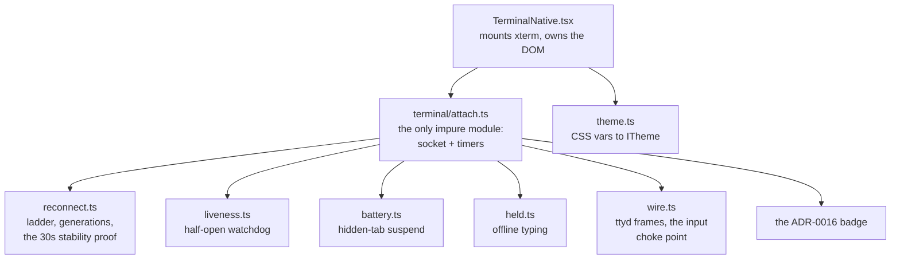

# The lobby renders its own terminal

Viktor, 2026-09-02, mid-design on the connection status work: *"also we can move
the iframe into a native component where we render the terminal"*, and then
*"let's build it"*.

The terminal has been a `frontend/term.html` page in a cross-document iframe.
Everything the shell wants to know about it crosses a postMessage boundary one
message type at a time, and everything the page needs from the shell crosses
back. The connection status work (ADR-0016) had just added one more such message
because the shell could not otherwise see whether the terminal was connected.

This replaces the iframe with xterm mounted by the SPA, behind `?native=1` while
it is incomplete.

```stats
330 KB | xterm, its own chunk (83 KB gzipped)
946 KB | what term.html vendors today
8,199 | lines of app logic in term.html
8 | pure modules its rules were lifted into
366 | tests over those modules and the socket
0 | class static blocks in the shipped chunk
```

## What was blocking it, and why that stopped being true

`vite.config.ts` marked xterm `external` with a guard-rail, on the reasoning that
it must never enter the no-store single-file blob — every deploy would have
re-downloaded it. Each half of that is now false:

| The rationale said | Measured 2026-09-02 |
|---|---|
| the lobby is one single-file document | `viteSingleFile` was removed; it is an HTML shell plus content-hashed chunks |
| xterm would re-download every deploy | `/assets/` is served `immutable`, and its own comment cites this as what stopped the terminal page costing ~474 KB per deploy |
| xterm needs hand-transpiling for iPadOS 15 | the npm **ESM** build has zero class static blocks; only the CDN's CJS build (18 of them) does, which is what `scripts/vendor-xterm.py` was transpiling |
| — | esbuild's `safari15` and `esnext` output for the built chunk are **byte identical**: nothing needs lowering |

A docs-versus-live mismatch is a finding, and this one had been guarding against
a build shape that no longer existed.

## The shape

One impure module owns the socket and the timers. Everything it does on an edge,
it asks a pure module.



`attach.ts` decides nothing: an event goes into `reduce()` and it carries out the
actions that come back. That is what lets the rules be tested without a socket, a
browser or a clock — none of them could be, inside term.html.

## How the rules were extracted, and why that matters to how much you trust them

Eight agents lifted one area each out of term.html; eight more read each module
against the source trying to REFUTE that it preserved the behaviour.

The first pass produced **290 passing tests and 17 behaviour changes**, and the
adversarial pass found all 17. Among them: Ctrl+C reaching the pty as SIGINT with
a highlight on screen (xterm right-trims rows, so a drag into trailing whitespace
has a selection range but empty text — the failure ADR-0003 exists to prevent); a
liveness probe loop that never exited on any keystroke without an echo; a
read-only watcher's keys being held and later flushed into a session they cannot
write to; and a `/token` 404 becoming a successful empty-token handshake.

A second round fixed those, and a blind re-check found six more — two real, and
four false claims in comments, including one that argued its own divergence from
term.html with a reason that was not true.

The lesson is not about agents. Tests written by whoever wrote the module encode
the module's assumptions, so a green suite from that pairing is not evidence.
Every generate stage here is paired with an independent refute stage.

## What driving it caught that assertions did not

- xterm ships a stylesheet and does not lay out without it, and the host div had
  no size. DOM checks said "rendered" and text extraction returned plausible
  content while the screen showed a column of overlapping glyphs.
- The held-key replay fired on socket `open` and lost everything. ttyd drops what
  arrives before the process is spawned; the first output frame is the only proof
  there is one, which `wire.ts` already said about the resize.
- `decodeServerFrame`'s `instanceof ArrayBuffer` fails cross-realm, so a test
  could only reach it with a view rather than the ArrayBuffer a socket delivers.
  Branded now: a test that has to avoid the production path is not testing it.

## What is verified

Against a live tmux session, through the shipped code path: xterm mounts and
renders with the app's theme; a pressed key reaches the pty and echoes; a dropped
socket walks the badge up the ladder and recovers; a socket **frozen** with
SIGSTOP — `ss` confirming both ends still ESTABLISHED, so nothing closed — is
given up on by the client alone, which only the liveness watchdog does, and
recovers when unfrozen; typing into a dead socket is held and replayed
(`❯ qw`); and paste through the unchanged `__tlPasteToTerminal` bridge lands on
the prompt.

## What is not done

Selection and copy (module extracted, not wired), pinch-zoom, sixel images and
WebGL. The last two are xterm ADDONS rather than logic to lift, so they are a
dependency decision of their own — and sixel is load-bearing here (ADR-0004,
`show-image`).

`term.html` is untouched and remains the shipped terminal. `?native=1` is
off by default.

## The cutover is blocked, deliberately

iPadOS 15.8 is the floor, and it is the device `vendor-xterm.py` exists to
protect: xterm 6 shipped syntax that WebKit could not parse and the lobby was a
blank page there for two days. The evidence that the new chunk is safe is a byte
comparison, not a device — nobody has opened `?native=1` on the iPad, and there
is no instrument here that can. Until someone does, the flag stays off and
term.html stays.
