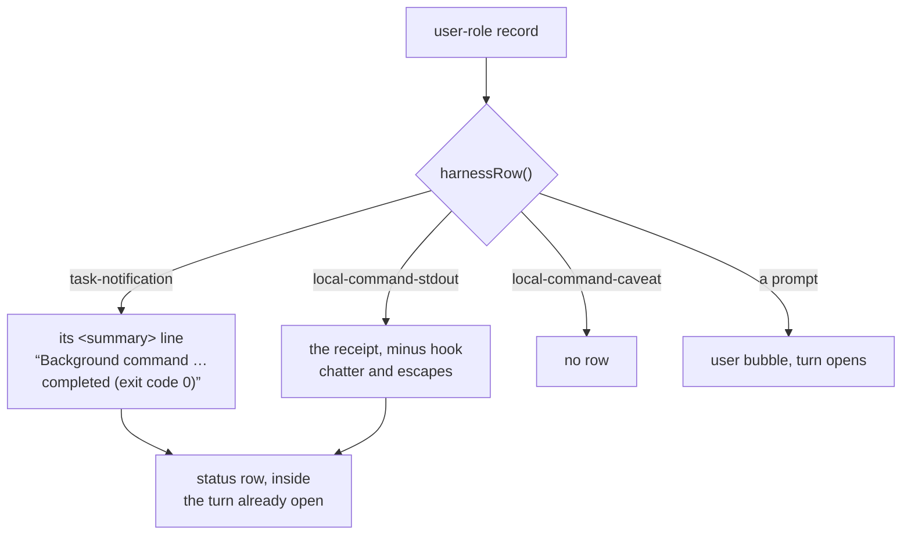

# The transcript is what people said, not what the harness wrote

Viktor, 2026-09-02: *"let's work on the rendering in text mode. I see artifacts
which shouldn't be there"* — with a screenshot of a `/compact` turn showing a
user bubble containing `<local-command-stdout>`, a row of tofu boxes where the
escape bytes were, and a caveat addressed to the model rendered as prose Claude
had written.

Claude Code writes more than a conversation into its transcript. It writes its
own bookkeeping as **user-role records**, which is exactly the shape the
renderer reads as "a person spoke": the record opens a turn and renders as a
prompt. That is fine for a prompt and wrong for everything else.

Measured across 355 transcripts on this box — 26,011 text-bearing records:

| shape | records | how it rendered |
|---|---|---|
| `<task-notification>` queued | 2,140 | `queued · <task-notification><task-id>…` as a divider row |
| `<task-notification>` delivered | 583 | a prompt bubble of XML, plus a turn nobody started |
| `<local-command-caveat>` | 18 | a paragraph attributed to Claude |
| `<local-command-stdout>` | 15 | a prompt bubble, tags and SGR codes included |
| control bytes in a tool result | 911 | `⍰[32m` in the output view |
| control bytes in a prompt | 12 | `⍰[2m`, or stray editor keys before the words |

The `/compact` receipt was the worst single row: 2,402 characters, of which
2,206 were a `PostCompact` hook's entire shell command.

## What we decided

**A record is a prompt only if a person typed it. Everything else the harness
writes renders as a muted status line, or as nothing.**

The classification lives in `sessionio/harness.go`, beside the slash-command
unwrapping it is a sibling of, so every consumer of the normalizer gets it
rather than each surface re-deriving it:

Three rules make it work, and each was chosen against the measured population
rather than in the abstract.

**The summary is the row.** A task notification carries an id, a tool-use id, an
output path and a status; its `
` already says all of it in a sentence,
and all 583 delivered records had one. So the row is that sentence.

**The harness's records do not open a turn.** They join whatever turn is open.
Claude's reply then opens a fresh turn through the existing "work resumed after
the turn closed" rule, so the structure is unchanged — 583 spurious turns
disappear without a new mechanism.

**A notification delivered twice is shown once.** 415 of the 419 whose ids we
could pair arrived both as a queued enqueue *and* as a record. The record is the
row; the queue event still flows untouched, so `queuedPrompts()` keeps working
and the timeline simply does not draw it (`deriveRows`).

Terminal control bytes are stripped from every body bound for a row —
prompts, messages, thinking, tool results, and the captured `stdout`/`stderr`
inside a structured result, which is what a Bash row actually renders. Tab,
newline and carriage return stay; they are layout. Malformed input costs its
introducer and nothing more, so one stray escape byte cannot swallow the rest of
a message.

## What this does not do

The wire stays lossless where it can. `tool_use` inputs are left byte-for-byte
(2 records in the corpus carry a control byte, and those are a file's own
contents rendered as a diff), and a structured result's other fields — `content`,
`originalFile` — are untouched for the same reason.

The hook filter is a pattern (`^\S+ \[…\] completed successfully`), so it will
not recognise a shape the CLI has not printed yet. A receipt is therefore capped
at 1 KiB: every real one measured is under 200 bytes, and the cap bounds what
the pattern cannot foresee. A hook that *fails* is unaffected — that arrives as
`MetaHookError` off the system record and always did.

`<local-command-stderr>` is a plausible sibling that appears nowhere in the
corpus, so it is deliberately not guessed at.

## Where the rule can rot

The discriminators are tag names the CLI chose, and this is the third time a
transcript-shape assumption in this repo has needed revisiting. The unit tests
pin the shapes measured on 2026-09-02, so a CLI that renames one fails loudly
rather than quietly showing XML again.

The check that found all of this is worth repeating when the CLI changes: replay
every transcript under `~/.claude/projects/*/*.jsonl` through `Normalizer.Line`
and count how many rendered rows still begin with a harness tag or carry a
control byte. It was 3,669 and 923 before this change and 0 and 2 after — the
two being `tool_use` inputs, which are left alone deliberately. It is a
throwaway script rather than a test because the corpus is one box's history, not
something CI can see.
