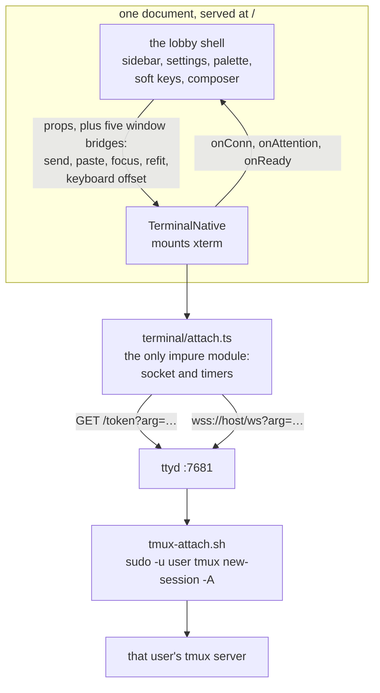

# One terminal, in one document

Viktor, 2026-09-05: *"yes, delete both, term.html and the escape hatch."*

The terminal was a `frontend/term.html` page inside a cross-document iframe for
the whole life of the lobby.
[ADR-0017](0017-the-lobby-renders-its-own-terminal.md) mounted xterm in the SPA
behind `?native=1`, and
[the de-iframe plan](../plans/2026-09-04-native-terminal-de-iframe-design.md)
took it to parity and made it the default on 2026-09-04, keeping the iframe
installed for one release as the way back. This release removes the page, the
component that framed it, the tool that vendored xterm into it, and the switch
that chose between the two.

```stats
10,441 | lines in frontend/term.html, 1,470,516 bytes
525 | lines in TerminalView.tsx, the iframe host
159 | lines in scripts/vendor-xterm.py
18 | postMessage types retired
353 | `term.html:NNNN` citations the port keeps
```

## What went, and what each thing was for

| Deleted | Size | What it did |
|---|---|---|
| `frontend/term.html` | 10,441 lines, 1,470,516 B | the terminal, and a second whole document with its own vendored xterm |
| `frontend-v2/src/components/TerminalView.tsx` | 525 lines | mounted that page in an iframe and translated eight window bridges and 18 message types across the boundary |
| `scripts/vendor-xterm.py` | 159 lines | spliced a hand-transpiled xterm between `BEGIN/END VENDOR` markers in the page. Its `INDEX` default was `term.html` and nothing else called it |
| the escape hatch | `?native` in both directions, the per-device **Engine** row on Settings → Terminal, and the `tl-terminal-renderer` key behind it | selected which of the two terminals a tab or a device got |
| `/term-build-id`, and the `tl-build-stale` message it fed | | the framed page's own build stamp, so it could notice its own staleness on every reconnect. The lobby's `/build-id` and the healer's poll are the surviving leg |

The four test files that read the page's source rather than a module
(`TerminalView.bridge`, `term-html.bridge`, `term-html.tdz`,
`term-html.token-origin`) go with their subject, along with
`healer.parity.test.ts`, whose whole job was comparing the SPA's update kernel
against the copy inlined in the page.

## Why the switch goes with the page

`?native=0` and the Engine row both resolve to a terminal that is no longer
installed, so keeping either would leave a control with nothing behind it. That
is worse than no control: a person reaching for it is already having a problem
with the terminal in front of them, and a switch that appears to work spends
their attention before it fails. The way back for a device where the built-in
terminal is unusable is a `.deb` downgrade, which is the lever the release
already has.

One stored value outlives the code. `tl-terminal-renderer` is written for both
choices on purpose (`store/device-prefs.ts` explains why: an explicit `native`
had to survive the default changing under it), so any device that ever opened
that row still holds `native` or `iframe` in `localStorage`. Nothing reads the
key after this, and a device that chose **Classic** gets the built-in terminal
at its next reload. Clear local data drops it with the rest of the `tl-` prefix.

## The shape that is left



Both requests carry the identical positional `arg=` string from
`lib/terminal-url.ts`, because a flag on one and not the other attaches a socket
the token was not issued for (`terminal/wire.ts` states that contract). That
part did not change with the iframe: it is the same query the page used to put
in its own URL, which is why watch mode, act-as and the directory argument all
survived the port untouched.

Rules live in 19 modules under `frontend-v2/src/terminal/`, and `attach.ts`
decides nothing on its own: an event goes into `reduce()` and it carries out the
actions that come back. ADR-0017 has the reasoning and the record of how the
extraction was checked.

## What was dropped on purpose

Each of these was in the page and is in nothing now. None is reachable by a flag
any more, which is the point of recording them here rather than in a settings
hint.

| Dropped | Where it is recorded |
|---|---|
| sixel images in the terminal | [ADR-0004](0004-sixel-images-in-the-terminal.md), superseded 2026-09-04. Fix 1 of `devvm/ttyd-local.patch` came out, so tmux sees a zero-pixel pty and draws its `SIXEL IMAGE (WxH)` placeholder |
| `show-image`'s temporary split pane and the `viu` inside it | Same supersede. Every client lost the inline picture, a real sixel terminal inside tmux included. The image is filed in the session library and the tmux status line names it |
| the two-finger toolbar tap and the three-finger session swipe | `terminal/touchscroll.ts` says so twice, and the plan's decision table: they shared a multi-touch registry of 361 lines that nothing else needed. The pinch to font size is ported and lives in `terminal/font.ts` |
| clickable web links, the held-key decoration overlay, flow-control accounting, OSC 52 clipboard, the live pref bridge behind A− and A+ | `TerminalNative.tsx`'s own header lists them, and three legs of what IS ported wait on one of them: Escape cannot discard an offline hold while nothing exposes one, the copy chord's recovery arm has no stashed selection to recover, and A− / A+ cannot reach a mounted terminal |
| the WebGL renderer | The vendored block defined `Terminal`, `FitAddon` and `WebglAddon`. `frontend-v2` installs `@xterm/xterm` 6.0.0 and `@xterm/addon-fit` 0.11.0 only, so xterm's canvas path is what ships. ADR-0017 already had WebGL under "what is not done" |

The pinch is worth one more line, because it is the answer to the A− / A+ gap on
the devices where it bites: a coarse pointer resizes the terminal with two
fingers, which is a gesture the page had and the port kept.

## What the page did well

It needed no build step. The vendored xterm was committed, so a deploy copied a
file and the QA harness pointed a browser at it, and a fix could be edited into
the installed copy on the box. That property is what let it be the terminal for
as long as it was, and it is the property the SPA gave up in exchange for
content-hashed chunks that a deploy leaves alone.

It also carried the iPadOS 15.8 floor by hand. `vendor-xterm.py` transpiled the
CDN's CJS build, whose 18 class static blocks WebKit 15 cannot parse, and that
was load-bearing until the npm ESM build turned out to have none of them
(measured 2026-09-02, ADR-0017).

And it was legible enough to be lifted. 353 citations of the form
`term.html:NNNN` survive in the port and its tests (171 in `src/` across 19
files, 182 in `test/`). Those line numbers index the file as it stood when it was
deleted; `git log -- frontend/term.html` finds it. The tests that verified the
citations against the live file are deleted in this change, so from here they are
provenance rather than a checked claim.

## What stays unverified

iPadOS 15.8 is the floor and there is still no WebKit instrument in this
homelab, which is the same standing gap ADR-0017 recorded and the flip accepted.
Nothing here changes it. What changed is the size of the bet: before this, a
device that could not run the built-in terminal had a setting; now it has a
package downgrade.

The floor guards are static and they now read one artifact instead of two.
`scripts/test_frontend_compat.py` keeps the esbuild `safari15` differential, the
literal-API sweep and the CSS syntax check, all aimed at the shipped SPA bundle,
and `frontend-v2/test/xterm.baseline.test.ts` still asserts that xterm's
`OffscreenCanvas` fallback round-trips written text in jsdom. That file lost 15
cases with the page it read: five test functions, of which three already had an
SPA counterpart in the same file and would have been duplicated by re-pointing
them. Two had no counterpart and needed none: that a vendored block defines
`Terminal`, `FitAddon` and `WebglAddon`, and that four `BEGIN/END VENDOR`
markers are present. 30 cases survive, all aimed at the bundle.

The question those two answered has one new test rather than none.
`test_the_spa_loads_no_script_from_a_cdn` asserts that the shipped
`index.html` carries no `<script src>` from another origin and that no
`assets/*.js` names a CDN host. That is not belt-and-braces: every other check
in that file reads bytes that are IN the payload, and the SPA fixture collects
script BODIES, so an `<script src="https://cdn…">` hand-added to
`frontend-v2/index.html` contributed no piece and was invisible to all of them.
Watched fail before it was kept — a real `cdn.jsdelivr.net` tag injected into a
copy of the release gate's directory turned it red and nothing else, and a URL
`import()` appended to a chunk did the same.

## One thing is knowingly dead

`frontend/diag.js:242-243` still buckets `/term-build-id` in `bucketFor`. The
endpoint is gone, so that arm is a counter that can never increment. It is left
alone deliberately: `diag.js` is inlined verbatim into the page by
`release/stamp.go` and shared with nothing else that could disagree, so a
harmless dead branch is cheaper than a change to the file every surface's asset
id depends on. `frontend-v2/test/diag.netusage.test.ts:110` still asserts that
arm and is consistent with it. Whoever next edits `diag.js` for another reason
can take it out.
