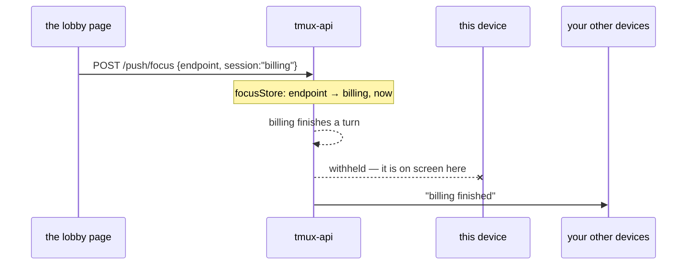

# The page says what it is showing

Viktor, 2026-09-06: *"I think I stopped receiving mobile notifications if the app
is open. I want to still receive them but only for sessions that I'm not focused
on right now."*

A notification about the session already on your screen is noise, so the push
sender has always tried to withhold it. Until now it worked that out from tmux
rather than from the app.

## What the guess was, and why it drifted

`stillAtTheKeyboard` (added 2026-09-02) held a push for 60 seconds after any
`client_activity` on the session, standing in for "the person is sitting in front
of this one". tmux moves `client_activity` on real client input, which is a good
signal, but it also **initialises it at attach time**. Measured against tmux 3.4
on 2026-09-06:

```
at attach        created/activity = 1788687997 1788687997
after 6s idle    created/activity = 1788687997 1788687997
after a keypress                  = 1788687997 1788688005
```

The lobby keeps every session you visit mounted for a day, each holding an
attached tmux client (`frontend-v2/src/store/keepalive.ts`), so opening the app
re-attaches all of them at once and mints a fresh false keystroke on each. Over
the four days to 2026-09-06 that held **118 pushes — every held push in the
window** — including four while Viktor was asleep.

Two smaller consequences of the same stamp: `send-keys` does not move
`client_activity` at all, so a session driven only from the lobby's prompt box
registers no keystroke ever; and the attach stamp also fed
`userTypedSinceLastPush`, the gate that ARMS the next push, so an attach could
arm a push no human asked for and then consume the credit for the next real one.

## What we decided

**The page reports the session it is showing, and the server withholds that one
from that device.**

`POST /push/focus {endpoint, session}`, keyed by the browser's own push endpoint.
`""` means the app is showing no session — the lobby list, a backgrounded tab, a
window sitting behind another one — and silences nothing. The report is refreshed
every 45 seconds while it stands and expires server-side after 90.



Three things this settles, each of which could have gone the other way.

**Per device, not per person.** Only the device that sent the report goes quiet.
A desktop watching a session does not silence the phone in your pocket, because
you may well walk away from the desk. The alternative — any open page silences
everyone — is quieter at the desk and loses the alert the moment you leave it.

**In memory, never on disk.** The record is worthless once stale, and a restart
forgetting everything reads as "nobody is looking", which notifies. That is the
direction that loses no alert, and the page refills the store within one
heartbeat.

**`stillAtTheKeyboard` is gone rather than repaired.** Its job is now done by a
fact instead of a proxy, and done for the device that is actually looking. The
volume rule it shared the function with — one outstanding notification per
session until you engage with it — stays exactly as it was.

`latestActivity` also stops counting a client that has only attached
(`Activity <= Created`), which is what the arming gate needed independently of
any of this. A tmux too old to report `client_created` leaves it at zero and the
activity is taken at face value, as before.

## What this does not do

A device that reports nothing is told everything: an old build, a phone with the
app shut, a browser that never subscribed. That is deliberate — silence must
never be read as "they are looking at it".

Nothing here changes the foreground path. A device the server does not push to
still fires its own notifications and applies the same per-session rule locally
(`notify/transitions.ts`), which is where this rule was first written.
