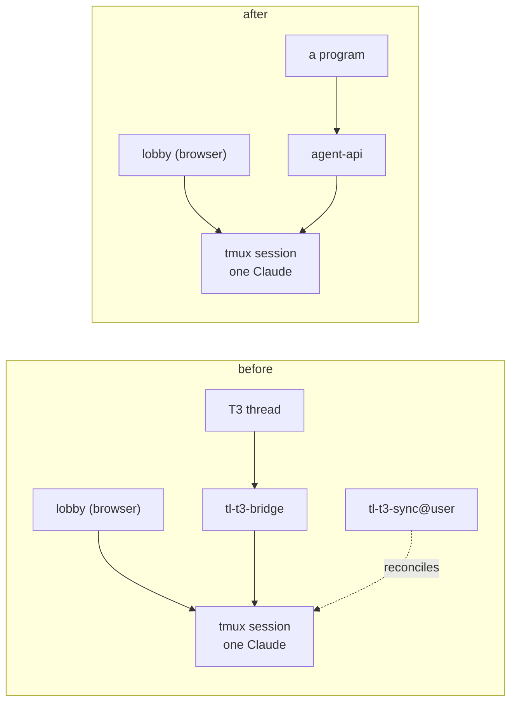

# The lobby is the only surface again

Viktor, 2026-09-19: *"we should sunset the t3 sync. i'm not using t3 anymore."*

ADR-0009 built a second window onto a session. A provider binary, `tl-t3-bridge`,
was spawned by T3 Code in place of `claude` and attached downward to a tmux
session instead of starting a Claude of its own, so a T3 thread and a lobby
session were one conversation in one process. A per-user reconciler,
`tl-t3-sync@<user>`, kept the two lists in step: adopting sessions into threads,
following renames, and carrying a deliberate kill across in both directions.

It worked, and the parts of it that were hard are worth naming before they go.
Attaching to a live Claude rather than resuming a second one was what kept the
memory bill flat on a box where earlyoom fires. The kill-notify
(`tmux-api/killnotify.go`) drew a distinction nothing else on this box drew:
`DELETE /sessions/{name}` is the only proof that a session was destroyed on
purpose, and an OOM, a crashed tmux server and a reboot are indistinguishable
from the outside. The durable binding index (`sessionio/index.go`) held the one
fact that dies with a tmux session and cannot be recovered from anywhere else —
the session's name and cwd, keyed by a conversation uuid that outlives it.

The engineering held up. The reason for it did not: the person it was built
for stopped using T3.

```stats
2 | Go modules removed, of 16
4 | replace edges removed, of 24
50 | files deleted
17,613 | lines deleted
1 | systemd unit, tl-t3-sync@
0 | remaining callers of anything removed
```

## What we decided

**Delete the bridge, the syncer and everything that existed only to serve them.
The lobby is the only surface onto a session again, and `agent-api` is the only
machine-facing one.**



| What | Where it was | What happened |
|---|---|---|
| The bridge | `t3-bridge/`, 23 files, 9,495 lines | Deleted |
| The syncer | `t3-sync/`, 20 files, 6,255 lines | Deleted |
| Its unit | `devvm/tl-t3-sync@.service` + the env example | Deleted, with the manifest entries that shipped them |
| The kill-notify | `tmux-api/killnotify.go`, 602 lines with its test | Deleted; the kill path keeps the two steps that still have readers |
| The durable index | `sessionio/index.go`, 696 lines with its test | Deleted; nothing outside the bridge read it |
| `@t3_thread` | `sessionio.OptionThread` | Deleted |
| `t3e2e-` | the two reserved-prefix lists | Dropped; the harness that minted those names went with the bridge |
| The design doc | `docs/plans/2026-08-15-t3-code-bridge-design.md`, 440 lines | Deleted; git history holds it |

ADR-0009 stays where it is, carrying a note that this record supersedes it. Its
reasoning about integrating with software that upgrades nightly — use a seam the
vendor documents, never a fork — is the part worth keeping, and it is advice
about a class of problem rather than about T3.

### What stays, and why

Four things looked removable and are not.

**`sessionio.Injector.NewSession`** reads as bridge machinery and is not:
`agent-api/sessions.go` calls it to create a session for an external credential.
Its comment named the bridge as its only caller, which is now agent-api.

**`sessionio.SessionMap`** and the `@claude_transcript` stamp are untouched. The
index and the map were deliberate opposites — one outlived the tmux session, the
other died with it so a reused name could never serve a dead conversation — and
only the first belonged to the bridge.

**`slug/`** keeps every exported function. `FromTitle`, `Free`, `CleanTitle`,
`MaxNameLen` and `MaxTitleRunes` all have callers in `tmux-api`; ADR-0022 brought
that half of the package back to the lobby. Only the doc comments naming the
bridge as a consumer changed.

**`tlp-t`** stays in `reservedNamePrefixes` and in `tl-session-watch`'s
`systemPrefixes`. It reads like a sibling of `t3e2e-` and is not one: it belongs
to the lobby's own Playwright run
(`tl-session-watch/collect_test.go`, `tmux-api/origin_test.go`). Dropping it
would have let a throwaway e2e session take a minted id, land in a person's
sidebar and push to their phone.

Two smaller keeps, stated so they are not a surprise:
`sessionio.Injector.KillSession` has no production caller now — it existed so
deleting a thread could destroy the session behind it — and stays as the
counterpart to `NewSession` on the same seam, covered by that package's tests.
The `Unit{Template: true}` machinery in `release/` has no templated unit to
drive now that `tl-t3-sync@` is gone, and stays with its tests rebased onto a
fixture name, because the next per-user service would otherwise rebuild it and
rediscover that `systemctl` marks a failed instance with a bullet rather than an
asterisk.

## Consequences

- **The kill is still a distinct event, and nothing subscribes to it.**
  `DELETE /sessions/{name}` goes on writing a tombstone
  (`tl-session-watch/collect.go`) and dropping the session's layout entry and
  manifest row, which is what separates a kill from a death for the death alert
  and for the restore picker. What it no longer does is tell anything outside
  this box. A future consumer of "this was deliberate" has a working signal to
  read and would not have to rebuild the distinction.
- **The package stops the syncer; the rest of the deployed box is an operator
  pass.** Measured on the devvm on 2026-09-19, while this was written:
  `tl-t3-sync@wizard.service` was active and running, and three `tl-t3-bridge`
  processes were live under T3 threads. dpkg removes files a new version stops
  shipping, so the upgrade takes `/usr/local/bin/tl-t3-sync`,
  `/usr/local/bin/tl-t3-bridge` and the unit with it — and, on its own, would
  leave the running service going from an unlinked binary with a dangling
  enablement symlink in `multi-user.target.wants`. So the manifest names the
  unit in a `Retire` list and the postinst stops it, disables it and removes
  the symlink before `daemon-reload`, in the same release that stops shipping
  it (`release/manifest.go`). What is still an operator step: a thread bridged
  at the moment of the upgrade loses the binary T3 spawns for it, T3's provider
  instance has to be pointed back at the stock `claudeAgent`, and
  `/etc/tl-t3-sync/` is operator data the package never owned and does not
  clean up.
- **T3 itself is untouched.** `t3-serve@`, `t3-dispatch` and the rest belong to
  the infra repo and to the box, not to this one. This removes Terminal Lobby's
  side of the integration and nothing else, so reinstating it later is a matter
  of restoring code from history rather than rebuilding an environment.
- **The module graph is smaller and one library is down to a single consumer.**
  Fourteen Go modules joined by 20 `replace` edges, from sixteen and 24.
  `sessionio` goes from five consumers to four and `slug` from two to one,
  recorded in `docs/architecture.md`. Every remaining edge is still imported by
  non-test code.
- **One test lost half its subject.** `session-events/gate_test.go` pinned "a
  mid-turn send is never refused" across both senders by reading the bridge's
  source. The surviving half still guards this service, and the cross-check it
  performed has no second party to check against.

## What we did not do

**Keep the bridge behind a flag.** It is 15,750 lines across two modules that
compile, test and ship on every release, held against a user who says they are
not using it. Git history is the cheaper way to hold code nobody runs, and
ADR-0009 plus this record are what make it findable again.

**Generalise the durable index into neutral storage.** `Binding` carries a
`ThreadID` and an `AliasOf` that exists for one quirk of how T3 invents provider
session ids, so it is a T3-shaped type rather than a store with a T3 field.
Anything that needs a uuid → tmux-name binding later can be designed for its own
requirements; the atomic-write and flock mechanics are in history if they are
worth lifting.

## Open questions

- The operator half of the pass above is the part with a real deadline, and it
  is timed by whenever the next `.deb` lands rather than by anyone choosing a
  moment. The `Retire` entry can come out of the manifest once every box has
  taken that release.
- Two reserved-prefix lists are still kept in step by hand
  (`tmux-api/migrate_ids.go`, `tl-session-watch/collect.go`). Editing both
  together here was straightforward, and the arrangement stays a place where the
  two can drift.
