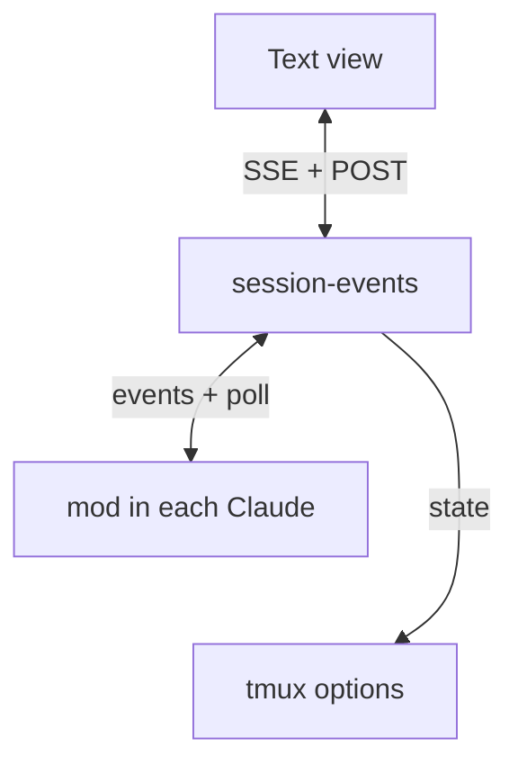

# Claude speaks to the lobby through a mod

Viktor, 2026-10-02: *"I think this opens the opportunity for massively
simplifying how terminal lobby handles events from Claude … the goal will be to
simplify how we handle Claude events, especially in text mode so that the
experience we have in text mode is better."*

Claude Code 2.1.287 (2026-10-01) ships **mods**: TypeScript function hooks that
run inside the Claude process and see its events as data. The lobby now learns
everything about a Claude session from one mod, `terminal-lobby@terminal-lobby`,
and acts on a session through the same mod. It replaces the transcript tail, the
state hooks, the session-start and question hooks, the pane watcher, and the key
drivers for dialogs.

pi and codex sessions are unchanged. Mods exist only in Claude Code.



## What it replaces

| Before | With the mod |
|---|---|
| Tail the transcript JSONL every 200 ms, through a privileged reader for other users' homes | The mod forwards every row as Claude stores it (`session.append`) |
| Whole messages only: a long answer appears at once | `turn.step` text and thinking deltas, coalesced to about 50 ms |
| Turn ends guessed from `stop_reason` and interrupt notices | `turn.start` / `turn.complete`, with `isAborted` |
| `claude-tmux-state` (849 lines of shell) stamping tmux options | session-events stamps the same options from mod events |
| `claude-se-hook session-start` binding a tmux session to a transcript | The mod's hello names its session id, pane and transcript |
| `claude-se-hook question` holding AskUserQuestion (ADR-0034) | The mod races the drawn dialog against the web answer |
| 2 s pane scrape for plan and permission dialogs | `tool.check` reports them before they draw |
| Key injection to approve a plan or a permission prompt | The mod draws its own dialog and races it against the web answer |
| Key injection to send a prompt or interrupt | `$.prompt.submit`, `$.turn.abort` |
| A nested `claude -p` firing hooks against its parent's pane | A non-interactive Claude's mod stays inert |

## Decisions

**Full replacement.** The mod is the only channel for a Claude session while
it runs. On-demand reads of large blobs that the wire never carries (a
truncated tool result, a picture) open the transcript file by the row id the
mod reported, because those ids are the same in the file.

**A rebuilt log is replayed from the transcript (2026-10-05).** Until then the
history after a session-events restart came from the mod's
`$.session.messages()`, which holds the newest 4096 entries, starts at the last
`/compact`, and carries no uuid, timestamp or stop reason. Measured on the day:
a session with three compactions came back with 9 of its 19 prompts, led by the
compaction summary drawn as a prompt. Now a 0.4.0 mod puts `last`, the uuid of
the newest main-thread row its snapshot covers, on the history's final chunk,
and session-events replays the transcript through the Normalizer up to exactly
that row (`FileSource.ReplayTranscript`). Rows stored after it arrive live, and
a live copy of a replayed row is dropped by uuid. Claude writes the transcript
in batches every 100 ms (2.1.289), so the replay waits up to 2 s for that row
to reach the file. When it never does, the read fails, or the mod is older and
names no row, the log is rebuilt from the mod's history as before. Up to three
replays run at once; the largest transcript on the box (39 MB) took about 1.5 s
of CPU and kept 6 to 13 MB of log. The log stays empty until the rebuild, so a
reader attached early holds nothing that would make the rebuild look like a
gap, and its stream is ended so it reopens with the usual window. The scope is
the current conversation: `/clear` starts a new transcript, and the replay does
not reach across it.

**session-events is the server, the mod is the client.** A mod cannot listen on
a socket. It POSTs events and long-polls for commands over loopback HTTP. Each
`$.http.fetch` is capped at 30 s by Claude Code, so a poll holds for 25 s.

**Plan approval and permission prompts are drawn by the mod.** Once Claude
draws its native menu, a mod has no handle on it. So when `tool.check` resolves
to `ask`, the mod draws its own Approve / Reject dialog with `$.ui.ask` and
races it against the web answer. The cost: approving a plan from either side
lands in Claude's default mode. The native menu's "accept edits" and "clear
context" choices are not reachable from a mod.

**AskUserQuestion keeps Claude's own dialog.** `tool.call` races `next(e)`,
which draws the native menu, against the web answer. When the web wins, the mod
returns `{result: {questions, answers, annotations}}` and Claude takes the menu
down.

**Only interactive sessions talk.** `session.start` carries `isInteractive`. A
nested `claude -p` loads the mod too, with its parent's `TMUX_PANE`, so the mod
does nothing at all when the session is not interactive.

**Rollout restarts sessions that are safe to restart.** A session that started
before the mod existed has no event stream. session-events restarts it with
`claude --resume <id>` once it is safe: Claude idle, no background work, an empty
input line, and no dialog up. Busy sessions are restarted the next time they are
safe.

## Facts this rests on

Measured on 2.1.287 on this box, 2026-10-02:

- A user-tier mod cannot hook `classic.*` events here: the managed settings seat
  `cc-plugin-sec-default` outermost and it bypasses them. Everything below uses
  `tool.call`, `tool.check`, `turn.*`, `session.*` and `prompt.submit`, which
  fire normally.
- Text deltas arrive one to three words at a time, 20 to 30 ms apart. A loopback
  POST from the mod lands in 2 to 5 ms.
- `$.http.fetch` refuses a request body over 4,194,304 characters, inside
  Claude, before anything is sent (measured 2026-10-02: 4 MiB went through,
  6 MiB threw). A long session's history is bigger than that, and a refused
  batch goes back on the queue ahead of everything else, so the first long
  session had an empty Text view and no streaming. The mod now sends history
  in chunks of about 800 KB, caps a batch at 1 MB, and drops an event that
  could never fit; session-events skips an event it cannot decode rather than
  refusing the batch.
- `$.prompt.submit` starts a turn at once when idle and queues behind a running
  turn.
- `$.turn.abort` stops the turn cleanly; `turn.complete` fires with
  `isAborted: true`.
- `tool.call` sees AskUserQuestion's questions before the dialog draws. A
  `{result}` returned while the dialog is up takes it down.
- `tool.check` resolves to `ask` for ExitPlanMode and for a tool that needs
  permission. Holding it keeps Claude's menu off the screen. `allow` approves,
  `deny` with a reason rejects and passes the reason to the model. Since CLI
  2.1.293 `allow` no longer approves a plan; see "Plan approval on Claude Code
  2.1.293" below.
- `$.session.id()`, `TMUX` and `TMUX_PANE` identify the session.

## Wire protocol (version 1)

All routes are on session-events' loopback listener and refuse anything that is
not loopback.

### `POST /mod/v1/hello`

Identifies the caller by peer credentials (the OS account that opened the
socket), the way the hook routes do.

```json
{"sid": "uuid", "pane": "%12", "tmux": "/tmp/tmux-1000/default,123,0",
 "session": "tmux-session-name", "cwd": "/home/u/code", "transcript": "/home/u/.claude/projects/-home-u-code/uuid.jsonl",
 "model": "claude-opus-5-5", "version": "2.1.287", "mod": "0.2.0",
 "ops": ["prompt", "abort", "answer", "decide", "model", "history", "steer"]}
```

Answer: `{"token": "…", "history": true|false}`. The token authenticates every
later call for this sid. `history: true` asks the mod to send what the session
already holds, because session-events has no log for it (it restarted, or this
is a resumed conversation).

`ops` names the command ops the mod runs, so session-events sends a mod only
what it can do. A mod from before the field (0.1.0) sends none; a route that
needs a newer op, such as `steer`, answers 501 for that session instead of
queueing a command the mod would refuse.

`transcript` is present only once the file exists, and Claude creates it with
the first row it stores, so a new session's first hello names none. The mod says
hello again as soon as the file appears, and session-events gives the existing
source that path and points its agent watch at the session directory, keeping
the log (`history` stays false). Until 2026-10-03 that second hello was read as
a reload: the source kept the empty path for the life of the session, so no
picture or full result could be read back and the agent panel listed nothing.
A text view re-rendering 34 such pictures sent 421 requests that answered 404,
and the edge banned the phone for probing. Rebuilding the source with history
was considered and not taken: history entries carry no row uuid, so a first row
still queued while history was read would be drawn twice. (The transcript replay
that came later dedupes by uuid, but this hello still only sets the path: a
rebuild runs only on an owed history.)

After every hello the mod also sends the `ask`, `plan` and `permission` events
of the dialogs still on screen, behind the history and ahead of anything else
queued. A dialog is reported once when it opens, and a session-events that
restarted since has forgotten it: until this resend (2026-10-02), every deb
install left the web unable to answer any question asked before it, and the
Text view's card said it could only be answered in the Terminal.

### `POST /mod/v1/events`

`{"token": "…", "events": [ … ]}`. One request in flight per session, so events
arrive in order. Every event has `type` and `t` (epoch ms).

| type | fields | from |
|---|---|---|
| `history` | `messages` (as `$.session.messages()` returns them), `running` (a main-thread turn is in flight), `last` on the final chunk (0.4.0: the newest main-thread row covered) | answer to hello |
| `row` | `uuid`, `door`, `origin`, `agentId?`, `message` {`type`, `name?`, `role?`, `isMeta?`, `content`} | `session.append` |
| `result` | `toolId`, `tool`, `agentId?`, `result`, `text`, `isError?` | `tool.call` after `next` |
| `turn_start` | `turnId`, `agentId?`, `text?` | `turn.start` |
| `delta` | `turnId`, `agentId?`, `step` (the request in the turn), `index` (the block in the response), `kind` (`text`/`thinking`), `text` | `turn.step` |
| `turn_end` | `turnId`, `agentId?`, `aborted`, `answer?`, `usage?`, `durationMs?` | `turn.complete` |
| `prompt` | `text`, `origin` | `prompt.submit` |
| `ask` | `toolId`, `questions` | `tool.call` on AskUserQuestion |
| `plan` | `toolId`, `plan`, `planFilePath?` | `tool.check` on ExitPlanMode resolving to `ask` |
| `permission` | `toolId`, `tool`, `input`, `reason?` | `tool.check` resolving to `ask` |
| `settled` | `toolId`, `by` (`terminal`/`web`/`gone`) | a dialog closed |
| `model` | `model`, `effort?` | `turn.step`, when it changes |
| `agents` | `agents` (as `$.agent.list()` returns them) | after every `turn_end` |
| `summary` | `text`, a few words for the session's title | the first `prompt` command of a fresh conversation, from `$.model.complete` on haiku (see below) |
| `ack` | `id`, `ok`, `error?` | a command finished |
| `bye` | `reason` | `session.end` |

Answer: `204`, or `409` when the token is unknown (session-events restarted),
which sends the mod back to hello.

`summary` exists because Claude Code writes its conversation summary into the
terminal title only for a prompt somebody typed, and the lobby's prompts reach
Claude through `$.prompt.submit`. Until it was added (2026-10-03), every session
started from the lobby kept its random id as its name, and pushes about it said
the id. session-events stamps the text as `@tl_summary`, and tmux-api's
auto-title rule adopts it when the pane title has no summary of its own, under
the same two-minute window and the same cleaning.

### `GET /mod/v1/poll?token=…`

Held for up to 25 s. Answer: `{"commands": [ … ]}`, possibly empty.

| op | fields | the mod does |
|---|---|---|
| `prompt` | `id`, `text` | `$.command.run({command, args})` when the whole text is `/name args` and the session lists a command by that name (submit hands any text to the model, so a bare `/skill` sent through it ran nothing); `$.prompt.submit({text, asUser: true})` otherwise |
| `abort` | `id` | `$.turn.abort` on the running main-thread turn |
| `answer` | `id`, `toolId`, `answers` or `chat`, `annotations?` | resolves AskUserQuestion with `{result}`, or with `{deny: chat}` for "Chat about this" |
| `decide` | `id`, `toolId`, `decision` (`allow`/`deny`), `reason?` | resolves a held `tool.check` |
| `model` | `id`, `model`, `effort?` | `$.command.run({command: "model", args})`, then `effort` |
| `history` | `id` | sends a fresh `history` event |
| `steer` | `id`, `agentId`, `text` | `$.session.send({to: {agentId}, text})` with the person prefix, if `$.agent.list()` lists the agent running and not a workflow |

Every command is answered with an `ack` event.

A `steer` is the person messaging a subagent open in the Text view (added
2026-10-03). The engine frames a plugin's message as the coordinator's, so the
text opens with "The person watching this session in the lobby says:"
(`sessionio.SteerPrefix`, which the drill-in strips to show only what was
typed). Measured on CLI 2.1.288: a running subagent reads it at its next tool
boundary, as a `queued_command` attachment; an idle teammate reads it when it
next runs, as a user record in its `<teammate-message>` envelope. Finished
agents are read-only by choice, though the engine would resume one. A refused
`ack` names the agent's state first (`finished: …`, `not-addressable: …`),
which session-events answers 409, and anything else 502.

## Wire version 3 (2026-10-04, mod 0.3.0)

A review of the mod after a working session showed as ready found that the
status was folded from edges held in session-events' memory, which restarts on
every deploy (9 times in 19 hours on 10-03/04). Version 3 adds a snapshot and
changes how options are written. Mods 0.1.0 and 0.2.0 keep working on the
version 1 rules above and are upgraded only by a restart.

- **hello** adds `instance` (random per module load), `dropped` (events the
  queue has shed since it loaded) and the ops `level` and `decide-feedback`. The
  ops `model` and `history` are gone; session-events never sent them. A hello
  from a new `instance` for a known sid is a new module: its fold starts over
  and history is owed. For a 0.3.0 mod, `history` in the answer stays true on
  every hello until a final history chunk has been applied.
- Before saying hello, the mod checks that every listening socket on the
  server's port is owned by root or by the `User=` of
  `/etc/systemd/system/session-events.service`, and backs off otherwise. The
  service user is trusted so that a rollback to a release without the socket
  unit, where session-events binds the port itself, does not silence every
  running 0.3.0 mod. systemd now holds
  port 7685 through `session-events.socket`, so the port is never unbound
  during a restart and any account that took it could not receive hellos or
  send commands.
- **level** `{running, compacting, tool, agents, asks, reply?, notice?}` is the
  mod's whole view of the session. `reply` and `notice` are `{t, text}`: the
  last main-thread answer and PushNotification, so a turn that ends while
  session-events restarts still gets its reply written. session-events writes
  them only when `t` is newer than the one it last wrote, and writes
  `@claude_state` after them, so a "done" push carries this turn's reply. It goes out after every hello (behind history and the open
  dialogs), after every turn edge, settled dialog, Agent call, compaction start
  and end, and every 30 s. The queue keeps only the newest one and never sheds
  it. session-events replaces its fold with it wholesale. The mod keeps the turn
  and open dialogs in `$.state`, so a reload does not forget them, and re-learns
  the turn from `turn.step`.
- **Writing options.** The four state options are diffed against what was last
  written successfully, and written in full on the first state-bearing event
  after each hello, after a failed write, and on `bye`. For an old mod that
  event is its last history chunk. A state set by hand in the lobby lasts until
  the derived state next changes; an unchanged level writes nothing.
- When a hello answers `history: true`, the mod drops every queued event except
  `ack`, `summary` and `command_failed`, since the history, the open dialogs and
  the level restore the rest. Before this, the backlog replayed after the
  history and the Text view showed the conversation's tail twice.
- When the log is rebuilt from the mod's history (the fallback above), that
  history carries no stop reason and no turn edges, so session-events closes a
  turn where Claude replied without a tool call and the next message is a
  prompt or a harness notice (2026-10-05). Before this, a rebuilt session ran
  every turn up to the next prompt together, and the Text view folded a turn's
  final answer into its work when a background task's notice followed it.
- **bye** carries `sid`; a bye for another conversation is ignored, which
  covers `/clear` while the old id is still answered for about 500 ms.
  `/clear` and `/resume` both keep the link and say hello again.
- **command_failed** `{id, op, error}` reports a prompt dropped or rejected
  after its ack, or a slash command that failed.
- **decide** carries `feedback` for mods that list `decide-feedback`. The mod
  returns it as the ExitPlanMode result's `context`, so the words reach the
  model in the same turn as the approval. Older mods get the approval and then
  the words as a prompt, as before.
- Esc on the mod's own dialog hands over to Claude's native dialog without a
  `settled`, so the session stays awaiting until the tool's result or the turn
  end. The web still cannot answer the native dialog.
- Workflow runs are tracked from the Workflow call's `taskId` to the task
  notification that names it. Measured on a scratch session (2026-10-04):
  `classic.Stop` and `classic.SubagentStop` never reach a mod, workflows never
  appear in `$.agent.list()`, and `turn.start` fires for the main loop only.
- A subagent or workflow counts as background work while `pending`, `running`
  or `waiting` (a finished one may be listed `idle`), and a teammate while its
  loop is active.
- Golden JSON for every event is in `testdata/mod-wire/`. The Go side decodes
  each file with unknown fields refused, and the mod's tests check its events
  carry the same keys.

## Plan approval on Claude Code 2.1.293 (2026-10-08, mod 0.5.1)

Viktor could not approve a plan from the Text view and had to switch to the
Terminal. On CLI 2.1.293 the mod's approach to plans stopped working.

What we measured on 2.1.293:

- The mod's `allow` from `tool.check` no longer approves a plan. Claude draws
  its own "Ready to code?" menu after it, and nothing in the lobby could answer
  that menu. This reproduced from the card and from the mod's dialog in the
  Terminal. In one field case the card approved at 08:33:42 and the plan was
  only resolved from the Terminal at 08:40:57. The 2.1.293 types describe this
  as intended: `ToolCheckResult.decision` says that for a tool that requires the
  person "a hook only tightens: its `allow` does not dismiss the dialog".
  Permission prompts are not affected, and `allow` still answers them.
- A settings `PermissionRequest` hook answering `allow` with a `setMode`
  update also leaves the menu up.
- A `tool.call` hook that returns `{deny}` while `next(e)` is pending takes
  Claude's plan menu down. The model gets the reason, and the session stays in
  plan mode.
- Some ExitPlanMode calls are written to the transcript with an empty input,
  and the plan exists only in its file. The plan card showed `{}` for these.

How plans work from mod 0.5.1:

- The mod no longer holds ExitPlanMode in `tool.check`. Claude's own menu comes
  up once, and `tool.call` races it against the web (`racePlan`). `tool.check`
  runs inside `tool.call`'s `next(e)` (the 2.1.293 types: "after the
  `tool.call` and PreToolUse hooks"), so the `plan` event is announced when the
  check asks, which is when the menu draws, and carries the plan text the check
  saw. Mod 0.5.0 looked for the check's input before the check had run and so
  announced no plan; it was replaced by 0.5.1 the same evening.
  When that input has no plan, the mod reads the plan file the input names, or
  the one the main loop's last `plan_mode` reminder named.
- The hello lists the op `plan-keys`. For such a mod, session-events reads the
  menu off the pane once Claude draws it (every 300 ms for up to 15 s) and the
  card shows Claude's own rows and feedback row. The reading carries the plan
  text as `plan`.
- An approval is a key press. session-events sends `decide allow` first, which
  tells the mod that the web answered and gives it any words. The mod attaches
  those words to the approved result, as `decide-feedback` already did. Then
  session-events presses the row's digit (`sessionio/plankeys.go`). It does
  this only after checking a fresh reading that still draws that label, with
  the cursor off the feedback row, and then waits for the menu to go.
- The label decides what an answer means. Approving with words, agent-api's
  "Approve plan", and the card's single row from before the menu was read all
  press the first row that neither clears the context nor turns permission
  prompts off. Clearing the context would drop the words. agent-api's "Keep
  planning" is a deny, even though it is row 2, because row 2 of Claude's menu
  approves.
- "Keep planning" and words sent back are a `decide deny`. The mod's
  `tool.call` returns it as the call's answer, and the menu goes, with no keys.
- A session started before the release keeps its old mod until it restarts. It
  keeps the old behaviour: approve from the card, then answer Claude's menu in
  the Terminal.

## Consequences
- `claude-tmux-state` and `claude-se-hook` leave Claude's managed hooks, except
  SessionEnd, which keeps `claude-tmux-state clear`: it records a deliberate
  exit for tl-session-watch, which nothing in the mod can write for another
  user. pi still calls `claude-tmux-state` from its extension, so the script
  stays installed.
- The permission-mode chip still walks Shift+Tab through the pane. The spike
  measured `$.config.set({key: "permissionMode"})` writing only the default for
  new sessions and leaving the live mode alone.
- The model chip still drives Claude's `/model` picker through the pane. The
  mod's `model` command works, but `/model` asks Claude's own "Switch model?"
  once a conversation is cached, which only the terminal can answer, so the
  route does not use it.
- Prompts sent from the web show in the pane as "Prompt from the terminal-lobby
  plugin" followed by the text, and a prompt sent mid-turn waits for the turn to
  end instead of being folded into it. No mod API takes a prompt off Claude's
  queue, and Up in the pane does not pop one the mod submitted (measured on
  2.1.289, 2026-10-05).
- `$.prompt.submit` resolves only once the prompt runs, so the mod reports a
  web prompt after it has opened its own turn. session-events therefore puts a
  prompt sent mid-turn on the session's queue when the mod acks it, and every
  device watching the session sees it waiting (2026-10-05). Before that, only
  the device that sent it showed it.
- Amended 2026-10-05: so that Stop and the Text view's Up can hand queued
  prompts back, session-events holds a prompt sent while a main turn runs and
  sends it through the mod when the turn ends (`session-events/held.go`). The
  stream shows it queued meanwhile. `POST /prompt/<session>/unqueue` hands every
  held prompt back, and a Stop that names a queue takes them first. A slash
  command is not held: it leaves no row to take it off the queue. Held prompts
  are written to a file per conversation under `-held-dir` so a restart keeps
  them, since tmux refuses a command over about 16 KB. Sent at a turn's end
  together, they reach Claude in one poll.
- Amended 2026-10-06: Claude Code 2.1.290 refuses a `$.prompt.submit` text
  whose first non-space character is a slash, so a prompt opening with a pasted
  image's path did not run. A prompt that starts with a slash and is not a
  command now goes to Claude with a zero-width space in front, which the model
  reads past. session-events adds it for a prompt whose first word is a path
  (`sessionio.MarkProse`), which covers every open session whatever mod it
  loaded; the mod (0.4.1, `asProse`) adds it for any other non-command text.
  sessionio takes it off again when it reads the transcript (`Unmark`), so the
  Text view and the held queue see the prompt as written. A mod change reaches
  only Claude processes started after it ships, since each loads the mod once.
- Amended 2026-10-09: a queued bubble in the Text view can be cancelled by a
  sideways swipe, a press and hold, or a × with a mouse. `POST
  /prompt/<session>/cancel-queued` with `{"text": ...}` drops that one held
  prompt and leaves the rest held. It is a route of its own because a
  session-events from before it ignores a body on `unqueue` and hands back
  every held prompt; this route answers 404 there instead. A prompt already in
  Claude's own queue (a session without the mod, or one typed in the pane)
  cannot be cancelled, and the view says so.
- If session-events is down, the mod keeps retrying hello with backoff and
  Claude itself is unaffected; what happened meanwhile is delivered in order
  once it is back.
- Mods were served off by a rollout switch for some Claude processes on this
  box even on 2.1.287 (measured 2026-10-02 by the mod's live test), and loaded
  once `CLAUDE_CODE_ENABLE_FUNCTION_HOOKS=1` was in Claude's environment. The
  managed settings set it.
- A reload of the mod can take a module away with a command in hand. A newer
  hello supersedes the older token, whose polls are refused, and commands that
  were handed out but never acked go to the module that says hello next. The
  mod ignores a command id it has already run.
- Pressing Esc on the mod's own dialog lets Claude draw its native prompt, which
  the web cannot answer; since wire version 3 the session stays awaiting until
  the terminal answers it.
- agent-api still reads and answers dialogs through the pane, so sessionio keeps
  the pane parsers and key drivers for it. On a session with the mod it meets
  the mod's Allow / Deny or plan dialog, which is drawn as a question, and can
  answer it as one. Moving agent-api onto the mod is a separate change.

## What the rollout showed (2026-10-02)

- Running Claudes pick up a managed plugin when the managed settings change:
  about 25 sessions said hello within a minute without a restart. The safe
  restart was needed for 5.
- A running Claude older than 2.1.287 also tries, fails, and records one
  "hooks module did not load" notice in its conversation (seen from 2.1.282).
  It has no mod afterwards, so it is restarted on the user's current CLI once
  it is safe to.

## What the live test settled

- `$.ui.ask` can be taken down. It runs as an AskUserQuestion tool call that
  passes through the mod's own `tool.call` hook, so the mod races its own
  dialog and returns the web's answer as the result. The dialog leaves the
  screen at once.

## Open questions

- How a mod built against 2.1.287's types behaves on the next Claude release;
  the API is marked as moving between releases.
- Whether subagent events render well in the Text view: the wire carries them
  and the unit tests cover them, but the live test did not run a subagent.
  the API is marked as moving between releases.
