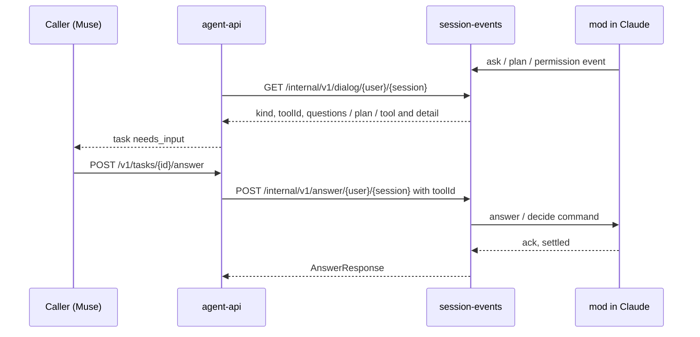

# agent-api answers dialogs through the mod

Viktor, 2026-10-02: *"ok let's move agent api."* This followed ADR-0036, which
moved the Text view onto the lobby's Claude mod and left agent-api as the one
consumer still reading dialogs off the tmux pane.

agent-api (the API Muse and other programs use) now reads the dialog a Claude
session is waiting on, and answers it, through the same mod the Text view uses.
session-events serves it two internal routes for that. The pane parsers and key
drivers that only agent-api still used are removed.

## Decisions

- **Choice questions are answerable.** An AskUserQuestion menu asking one
  question takes a row by number, or words as its "Other" answer. Before, every
  menu was refused with 422, because the pane was not a reliable way to answer
  one. A menu asking several questions together is still refused: an answer
  body carries one answer. (Viktor's choice.)
- **No pane fallback.** A session with no mod connected has no dialog to read;
  its question is reported as `unknown`, with the bottom of the pane as the
  text, and an answer is refused. About 2% of sessions never say hello
  (memory #14529). Keeping the pane parsers for them would have kept two paths
  for every dialog. (Viktor's choice.)
- **Answers name their dialog.** The request carries the dialog's tool call id,
  and the mod settles that call or acks it as gone. A dialog that opens in the
  place of the one the caller read never receives the answer.

## The internal routes

On session-events' root mux, beside `/mod/*`, outside the web gate:

| Route | Answers |
|---|---|
| `GET /internal/v1/dialog/{user}/{session}` | 200 with the oldest open dialog; 204 when the mod is connected and nothing is open; 404 when no mod is connected |
| `POST /internal/v1/answer/{user}/{session}` | an `AnswerRequest` naming its `toolId`; 409 when that dialog is no longer open; 404 with no mod |

A request passes four checks:

1. It comes from loopback.
2. The socket that sent it belongs to session-events' own OS account, which is
   also agent-api's.
3. Its `Host` is `127.0.0.1` or `localhost`, and it carries `X-TL-Internal: 1`.
   A web page cannot add that header without a CORS preflight, which
   session-events never grants, so a browser running as the same account
   cannot reach the routes, DNS rebinding included.
4. The user it names is one the lobby serves (`/etc/ttyd-user-map`).

agent-api still holds no proxy secret and takes no identity header.

The routes add no power the account lacks: it already holds
`sudo -u <user> tmux` for every user the lobby serves, which can type into any
of their panes. The fourth check is what keeps that true. The mod connects for
any account that runs Claude, and the tmux grant covers only the roster.

## Other changes that came with it

- session-events holds a list of open dialogs per session instead of one.
  Parallel AskUserQuestion calls used to overwrite each other, and settling one
  took both off the Text view's card.
- "Keep planning" with no words is accepted; the mod sends its own
  keep-planning message.
- The mod sends its open dialogs again after every hello (shipped first, in
  0.94.4), so a dialog open across a session-events restart can still be
  answered from the web and from agent-api.

## What it removes

`sessionio/answerdrive.go`, `permdrive.go`, `plandrive.go` and `permdialog.go`
with their tests, and agent-api's pane reading and digit pressing for the mod's
own dialogs. `ParseDialog` and `ParsePlanDialog` stay: `sessionio/setmode.go`
uses them to drive the permission mode.

## Open questions

- A subagent's permission prompt reaches session-events without an agent id
  (the mod's `tool.check` carries none), so it is shown and answered as a main
  thread dialog. Unchanged here.
- agent-api still follows a turn's state from the transcript when the mod is
  not connected (`agent-api/turn.go`, `stateFromTranscript`).
