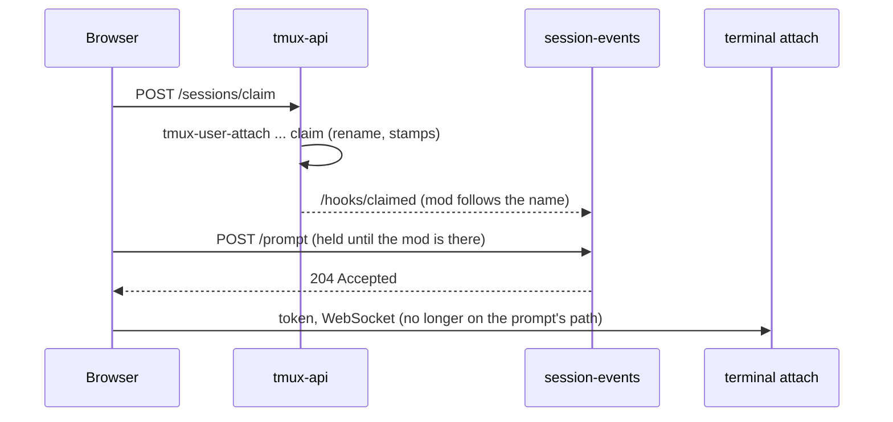

# A new session's slot is claimed at Send

Viktor, 2026-10-03: *"once i send a prompt, it takes quite a while to get it
passed to the terminal"*, and then *"also now it's quite bad, especially on slow
networks"*.

A Claude session created from the New-session composer usually starts on a
**pre-warm slot**: a Claude already booted in the session's directory, adopted by
renaming it. Until now that rename happened in one place, `tmux-user-attach`,
which ttyd runs when the browser's terminal opens its WebSocket. ADR-0019 chose
that on purpose: creating a session reaches no server, so it works while
tmux-api is down.

The first prompt cannot land before the claim, so it waited for everything the
browser does before that WebSocket opens. On a slow link that was about five
round trips in sequence:

| step before the claim | iPhone, 7 days to 2026-10-03 |
|---|---|
| layout save | `/api/sessions/layout` slow (≥1.5s) 93 times, p50 3.3s |
| terminal code (phones skip the prefetch) | 83 KB gzipped |
| `GET /token` | slow 55 times, p50 2.7s, p90 11.4s |
| WebSocket open | handshake p50 560ms, p90 1.2s (n=831) |

## Decision

Send also claims the slot, through tmux-api's `POST /sessions/claim`, fired at
the same moment as the layout save. tmux-api runs `tmux-user-attach` in a
claim-only mode (a sixth argument, `claim`) as the user, so the claim follows the
script's own rules and stamps, and then sizes the session to the device's last
terminal size.

The attach keeps its claim. Whichever of the two renames the slot first wins:
`tmux rename-session` is atomic and refuses a name in use, so the other finds
the session there. A create therefore still works with tmux-api down, which is
what ADR-0019 protected.

## Boundaries

- **Only what a slot can be.** Claude with no model or effort flag, a minted id,
  and a directory that is one of the user's projects or their home. Everything
  else is left to the attach, as before.
- **Not under act-as.** An administrator acting as someone attaches to their
  sessions and never creates one (tmux-attach.sh's foreign branch), so the claim
  answers `claimed: false` whenever the effective user is not the caller.
- **An argument, not an environment variable.** sudo's `env_reset` would strip a
  variable on a box with the packaged sudoers.
- **Sized, then unpinned.** A slot is started detached at 80x24, and Claude would
  wrap its first reply to that before any terminal attaches. tmux-api resizes the
  window to the device's last terminal size and unsets `window-size` straight
  after, which keeps the size while no client is attached and lets the first
  attach resize it as usual (measured on tmux 3.4).

## Consequences

- A session can now exist, with its first prompt running, before any terminal
  has attached to it. If the tab closes or its WebSocket fails, the prompt still
  runs, unwatched. Viktor's call: that is what Send means. The session is stamped
  `@tl_origin user` at the claim, so it lists like any other.
- There are two callers of the claim. The script stays the one place its rules
  live; tmux-api only decides whether asking is worthwhile.
- Pool misses (about 14% of Claude creates) are unchanged: they still pay
  Claude's own boot and wait for the attach.

Design: `docs/plans/2026-10-03-first-prompt-latency-design.md`.

## Amendment, 2026-10-04: a slot is kept warm for Send

Viktor, 2026-10-04: *"it takes ~20 seconds from me sending the prompt in the
composer until i see it in the session and claude working on it."* Of 17 first
prompts measured, 13 were Accepted within 1.1s and 4 took 3.7 to 12.9s. Each of
the four claimed a slot whose Claude was still booting, three of them because a
package install had made the standing slot stale and nothing replaced it until
Send. Design: `docs/plans/2026-10-04-warm-slot-at-send-design.md`.

What changes in the decision above:

- **An install replaces stale slots.** tmux-api notices a new mod id within
  5s and replaces every slot warmed under the previous one, one per user every
  5s, keeping each slot's kind, directory and flags. tmux-api starts a slot by
  running `tmux-user-attach` with a `prewarm` or `pool` argument, the way it
  claims, and `tl-prewarm@.service` is retired.
- **Asking for a slot replaces a stale one.** `POST /sessions/prewarm` used to
  answer that a slot exists whatever mod it ran. The composer now asks again
  when its tab becomes visible or its window regains focus.
- **The first boundary above is narrowed.** "Claude with no model or effort
  flag" no longer holds: a slot can be warmed with the model and effort picked
  in the composer, and a claim takes only the slot matching directory, model and
  effort. The standing slot stays on Default.
- **The prompt is held until the hello.** session-events holds a first prompt
  for the mod's hello up to 25s, and the browser's retries join the attempt
  already waiting (the request id), repeating a held request without waiting
  between attempts.

The pool-miss consequence above still holds for a directory with no slot and
for a Send within one boot of opening the composer.
