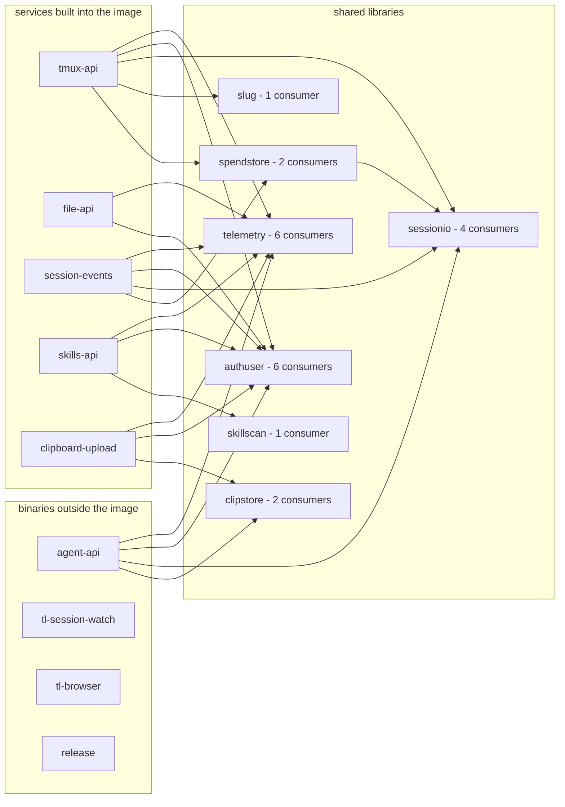

# Architecture

What the pieces are and how a request reaches a terminal.

## Components

| Piece | Where it runs | Port | Purpose |
|---|---|---|---|
| `frontend-v2/` (SolidJS + Vite) | `index.html` served by ttyd on the DevVM; its hashed assets by clipboard-upload under `/assets/` | 7681 | **The lobby.** It renders the terminal itself: `TerminalNative` mounts xterm in the lobby's own document and attaches over `/token` + `/ws` (`docs/adr/0020-one-terminal-in-one-document.md`); backends are tmux-api / clipboard / session-events / file-api. Build: `npm run build` — a small `index.html` plus content-hashed chunks, so the heavy libraries load on demand rather than inlined into one file |
| `tmux-api/` (Go) | DevVM systemd service | 7684 | `GET /sessions` (incl. per-session `state` + `project`), `DELETE /sessions/<n>` (snapshots first, then answers `{resurrect: {snapshot, sessions[]}}` so an undo can bring the session back), `POST /sessions/<n>/rename`, `GET /whoami`, `POST /restore` (blanket, or a `{snapshot, sessions[]}` body from the picker), `GET /snapshots` (the session-snapshot series, plus the newest snapshot already resolved and the live count behind the deltas — one call opens the restore picker) + `GET /snapshots/<ts>` (one snapshot resolved against what is live, for switching to an older version), `GET`/`PUT /layout` (per-user sidebar layout, stored under `/var/lib/tmux-api/layout/`), `GET /netinfo` (which network the caller is on — a private address is the house's own, a public one resolves to its operator through Team Cymru DNS, cached; feeds the WiFi/cellular split in Data used), `GET /agent-spend` (what this user's Claude Code and Codex sessions have consumed over a period: dollars and tokens from the spend store `spendstore/` keeps under `/var/lib/tmux-api/spend/`, limit windows and tokens read straight out of Codex's own rollout files), `POST /sessions/claim` (the New-session composer's Send claims a warm pre-warm slot for the session it is creating, by running `tmux-user-attach` in its claim-only mode as the user and sizing the session to the device's last terminal size, so the first prompt does not wait for the terminal to attach; refused under act-as, `docs/adr/0038-a-new-sessions-slot-is-claimed-at-send.md`). `GET`/`POST`/`DELETE /links` and `DELETE /links/<id>` are the owner's public links; the five anonymous public-link routes are `POST /link/redeem`, which sets a per-link view cookie, and `GET /link/transcript`, `/link/result`, `/link/image` and `/link/picture`, which read the linked session's conversation as its owner through session-events' privileged child (ADR-0039 to ADR-0041). Each session in `GET /sessions` carries `browser: "live"\|"frozen"` while it has a browser open, read from the session's `@tl_browser` option and omitted otherwise, which is what lights the session bar's browser indicator. Each also carries `origin` (`@tl_origin`: `user`, `test`, a Caller's name, or omitted) and, when a Caller made it, `caller` with that name (`sessionio.CallerOf`, with the reserved name prefixes winning), which is what files it in the sidebar group named after its Caller rather than in System |
| `clipboard-upload/` (Go) | DevVM systemd service | 7683 | Per-session attachment store (`/var/lib/clipboard-store/<user>/<session>/`): `POST /upload` persists pasted/uploaded/dropped images, and documents up to 25MB under a `file-` prefix, replying `{path, stored}` — `stored:false` means it stayed an ephemeral `/run/clipboard-files` transfer, which is what a document over the cap does. `POST /register` records `show-image` renders (localhost). `GET /list` serves the gallery and lists the `pasted-`/`displayed-` prefixes only, so a document is never drawn as a thumbnail; `GET /img/…` serves image bytes and refuses anything that does not sniff as an image; `GET /file/…` serves a stored document with sniffing disabled, forcing a download for anything that could execute as markup. Per-user isolation via the configured identity header → `/etc/ttyd-user-map`, like tmux-api. The naming, sniffing and no-overwrite write rules live in `clipstore/`, shared with agent-api, the store's other writer. See `docs/adr/0005-session-image-store.md` |
| `session-events/` (Go) | DevVM systemd service | 7685 | **The text-mode backend.** It learns everything about a Claude session from the lobby's Claude mod and acts on the session through it (`docs/adr/0036-claude-speaks-to-the-lobby-through-a-mod.md`): `GET /events/<session>` (what people and the agent said, as events, with the reply streaming in as live-only `delta` events while Claude writes it, `docs/adr/0018-the-transcript-is-what-people-said.md`; a Claude that started before the mod gets a `nomod` frame until it is restarted), `GET /earlier` (older turns), `GET /result/<session>/<toolId>` (one tool result in full), `GET /result/<session>/<toolId>/image/<n>` and `GET /result/<session>/user/<record>/image/<n>` (one picture a tool result or a terminal paste carried, read back from the transcript file by its row id so the event stream never carries image bytes, `docs/plans/2026-09-24-text-view-native-images.md`), `GET /search`, `GET /pane` (the live pane), `GET /commands`, `POST /prompt` (a prompt sent while a main turn runs is held and sent when the turn ends, `session-events/held.go`), `POST /prompt/<session>/unqueue` (every held prompt handed back, for the Text view's Up to edit), `POST /prompt/<session>/cancel-queued` (one held prompt dropped, cancelled from its queued bubble), `POST /answer-text`, `POST /keys` and `POST /answer/<session>` (a question, plan approval or permission prompt answered through the mod as data), `POST /cancel`, `POST /model`. `GET /browser/<session>` (whether the session has a browser, its tabs and who holds control, read from the host's hello) and `GET /browser/<session>/stream` (a WebSocket relaying the viewer protocol to the session's browser host, one message per line; Attach mode is enforced here, before the host, and a session shared with you is reached through `sudo -n -u <owner> session-events -privop browser-bridge <socket>`; `docs/adr/0035-each-session-gets-its-own-browser-started-on-first-use.md`). `POST /mod/v1/hello`, `POST /mod/v1/events` and `GET /mod/v1/poll` are the mod's, `POST /hooks/usage` is where `tl-usage-record` posts what a session has spent (a statusLine payload rather than a hook, `docs/adr/0023-agent-spend-via-a-statusline-wrapper.md`), and `POST /hooks/claimed` is where `tmux-user-attach` says it just claimed a pre-warm slot, so the slot's mod moves to the session's new name before the first prompt arrives (`docs/plans/2026-10-03-first-prompt-latency-design.md`); all of them are gated to loopback in code and identify the calling account by peer credentials, and the ingress must not route them. It also restarts, once each is idle, the Claudes that started before the mod existed. Per-user isolation via the identity header → `/etc/ttyd-user-map`, like tmux-api |
| `claude-mod/` (TypeScript) | DevVM, `/usr/share/terminal-lobby/claude-plugins/`, loaded inside every interactive Claude | — | **The lobby's Claude Code mod** (`terminal-lobby@terminal-lobby`), enabled for every user by `/etc/claude-code/managed-settings.json` (infra repo) as a directory marketplace. It forwards each row Claude stores, each tool result, the turn boundaries and the reply as it streams to session-events, and takes commands back: send a prompt, stop the turn, answer a question, decide a plan approval or a permission prompt, switch the model. A nested or non-interactive Claude's mod stays inert. See `docs/adr/0036-claude-speaks-to-the-lobby-through-a-mod.md` |
| `file-api/` (Go) | DevVM systemd service | 7686 | **The file preview and editor backend.** `GET /files/list`, `GET /files/read`, `POST /files/write`, with every path confined to the caller's `/home/<user>` by the four checks in `file-api/paths.go`. `GET /files/image` is the one exception: it serves pictures (PNG, JPEG, GIF, WebP, and SVG under a sandbox policy) from any path the caller's OS user can read, `/tmp` included, and nothing else, so the Text view can draw the pictures Claude reads from its scratchpad (`docs/plans/2026-09-24-text-view-native-images.md`). A request that maps to a different OS user than the service runs as re-execs this binary under `sudo -u <user>` (`-privop`), so validation and the file operation both happen as that user inside their `0750` home; a same-user request runs inline (`file-api/privop.go`) |
| `skills-api/` (Go) | DevVM systemd service | 7688 | **The skill manager's backend** — reached from the **Skills** overlay on the shell bar, beside Settings (`docs/adr/0011-skills-move-between-users-by-copy.md`). `GET /skills` answers the whole Settings group in one round trip — this account's skills and marketplace plugins, then every other terminal account's skills with a `same`/`differs`/`absent` verdict against your own — and `/skills/view` (a skill's `SKILL.md`, its file list and where it lives on disk), `/skills/edit` (write one of your OWN skill files back — no `owner` field, so a peer's skill cannot be written through it), `/skills/diff`, `/skills/install`, `/skills/toggle`, `/skills/remove` (keeps a backup), `/skills/delete` (permanent — the skill, its backups, its enabled state and its provenance), `/skills/plugin-update`, `/skills/plugin-uninstall`, `/skills/restart`, and `/skills/source/inspect` + `/skills/source/install` (bring a skill or plugin in from a GitHub repo — one read-only look, then that project's own installer run as the caller; `docs/adr/0012-installing-from-a-source-runs-its-installer-as-you.md`) do the rest. Unlike its siblings one request acts as TWO users: peer homes are `0700`, so an install packs the owner's skill in one privileged child (`sudo -n -u <user> skills-api -privop pack`) and unpacks it in the recipient's. Filesystem semantics live in `skillscan/` |
| `agent-api/` (Go) | DevVM systemd service | 8710 | **The machine-facing interface** — the same tmux-resident Claude conversations the lobby serves, served to a program (`infra/docs/plans/2026-09-14-muse-agent-broker-design.md`). A caller off the devvm reaches it at `https://terminal-api.viktorbarzin.me`, where Traefik routes only `/v1/` and `/openapi.json` to it; that replaced the tailnet path on 2026-10-02 (`infra/docs/plans/2026-10-02-muse-homelab-integration-design.md`). `GET /v1/conversations` (the caller's own OS user's sessions, its own and the ones a person started), `POST /v1/conversations` (a new session through `sessionio` in-process, with a cwd resolved through its symlinks and confined to `/home/<user>/code`; `TL_CALLER_PINS` can force a Caller's model, effort and permission mode whatever it sends, where `inherit` drops its value for the box default, `agent-api/pins.go`), `GET /v1/conversations/<id>`, `DELETE /v1/conversations/<id>` (the owning Caller only, 403 otherwise; cancels the conversation's open tasks, kills the tmux session through `sessionio.KillSession`, tombstones it with `tmux-persist-forget` as the lobby's kill does, and leaves the transcript on disk), `GET /v1/conversations/<id>/transcript` (`?after=<index>&last=<n>` for an incremental read; every message carries its `index` and the reply its `total`), `POST /v1/conversations/<id>/messages` (answers a task id; one turn at a time per conversation, the next queues; every turn stamps `@agent_last_turn`, the clock tmux-api's suspend sweep times a Caller's conversation by, 24 h by default; a turn in a suspended conversation resumes it first through `sessionio.Resume`, the same sequence the lobby's resume click runs; `?wait=N`, up to 300 s, holds the request and answers with the task if the turn settles in time; as `multipart/form-data`, a `text` field plus `file` parts, each streamed into the session's attachment store under clipboard-upload's naming through `clipstore` and its absolute path appended to the prompt under `Attached files:`. Images are judged from their bytes, PNG/JPEG/GIF/WebP up to 25 MB, any other file up to 100 MB, 200 MB a request, 413 past any of them, and the files a refused request wrote are removed; the 30 s read deadline is lifted to 30 min for that request only, after the bearer check), `GET /v1/tasks/<id>` (`accepted`/`running`/`needs_input`/`done`/`failed`/`cancelled`; `?wait=N` long-polls until the status moves; a `needs_input` task carries its question's `kind` and `options`), `POST /v1/tasks/<id>/cancel`, `POST /v1/tasks/<id>/answer` (a permission prompt, a plan approval or a one-question AskUserQuestion menu, read and answered through the lobby's mod by session-events' internal routes `GET /internal/v1/dialog/<user>/<session>` and `POST /internal/v1/answer/<user>/<session>`, which admit this service's own account on loopback with `X-TL-Internal` and take no proxy secret (`docs/adr/0037-agent-api-answers-dialogs-through-the-mod.md`); a menu of several questions, and a session with no mod, are refused with 422), the **Delegation** routes for work handed the other way, to a Caller (`POST /v1/delegations` by a Caller named in `TL_DELEGATION_CREATORS`, empty by default so the feature is off, answering with the WhatsApp `message` to send and its callback under `TL_AGENT_PUBLIC_URL`; `POST /v1/delegations/<id>/sent` and `/undelivered` by that creator, the second traced as `event: delegation.undelivered` with its `reason` for infra's Loki alert; `POST /v1/delegations/<id>/result` by the target Caller only, 410 after `expires_at`; `GET /v1/delegations[/<id>]` for creator and target, `?wait=N` on the single read; 20 per target Caller per rolling hour and 100 per day, 429 with `Retry-After`; expiry read lazily and swept every minute; kept in `$STATE_DIRECTORY/delegations.json`, `/var/lib/agent-api`, written whole and renamed into place so it survives a restart), plus `GET /health` and `GET /openapi.json`, the two open routes. Auth is not its siblings': every `/v1` route needs a per-caller bearer from `TL_BEARER_TOKENS` (`authuser/bearer.go`), and the identity header and `X-TL-Proxy-Secret` are stripped before the gate reads the request, so the browser path cannot answer here. Every request is appended verbatim to `/var/log/agent-api/trace.jsonl`, never its headers |
| `tl-browser/` (Go) | DevVM, `/usr/local/bin/tl-browser`, started by Claude Code per session over stdio | — | **The session browser's launcher**, configured as each user's `playwright` MCP server so tool names stay `mcp__playwright__*`. It answers `initialize` and `tools/list` from a cache keyed by the host's version, so a session that never browses runs no Node and no Chrome. The first other request starts the host under `systemd-run --user --scope` in `tl-browser.slice` with a per-browser ceiling (`MemoryHigh=1G`, `MemoryMax=1536M`, `CPUQuota=300%`), replays Claude's `initialize`, and pipes both ways. When the host exits it goes back to waiting; when Claude exits it stops the host. See `docs/adr/0035-each-session-gets-its-own-browser-started-on-first-use.md` |
| `tl-browser/host/` (Node) | DevVM, `/usr/lib/terminal-lobby/tl-browser-host/`, one process per browsing session | — | **The session browser.** `@playwright/mcp` pinned to 0.0.76 over stdio, with headless Chrome launched on first use (pipe transport, no TCP debugging port). It sits on the MCP stream, so it enforces the control lock and times activity; it records itself on the tmux session as `@tl_browser` and `@tl_browser_sock`, and serves the viewer protocol on a 0600 unix socket in its owner's runtime directory. Frozen (SIGSTOP) after 10 minutes idle, closed after 2 hours frozen, and closed when the agent calls `browser_close`. The package carries its production `node_modules`, installed from the committed lockfile at build time |
| `devvm/tl-browser.slice` | DevVM, `/usr/lib/systemd/user/`, one per user's systemd instance | — | The ceiling over one user's browsers together: `MemoryMax=4G`, `CPUQuota=800%`, `CPUWeight=50`. Every host scope tl-browser starts sits under it, at `user@<uid>.service/tl.slice/tl-browser.slice`: systemd nests a dashed slice name under its prefix, so `tl.slice` is created implicitly and is the path `playwright-reaper` has to watch. Beside it, `devvm/tl-browser-scope-cap.conf` installs as `/usr/lib/systemd/user/tl-browser-.scope.d/60-tl-browser-cap.conf` and holds each browser scope at `MemoryHigh=1G`, `MemoryMax=1536M`, which the devvm's box-wide `scope.d/50-devvm-pane-cap.conf` (`MemoryMax=6G` on every user scope) would otherwise override. postinst reloads each running user manager so both take effect without a fresh login |
| `spendstore/` (Go) | Shared package | — | What a user's agents have consumed, on disk at `/var/lib/tmux-api/spend/<user>.json`, beside the prefs, titles, layout and assignment stores. Two services share it: session-events writes from the recorder, tmux-api reads to serve the Settings page. A reading is a conversation's running total, so a write replaces that session's row and moves the day's rollup by the difference. The day rollups are the complete record, which is what makes All time answerable; a row past 30 days keeps its totals as the baseline the next reading is differenced against and loses everything else |
| `skillscan/` (Go) | Shared package | — | What a skill IS on disk: scan, inspect, hash, compare, diff, pack/unpack, backup, and the two bits of state the manager keeps — Claude Code's own `enabledPlugins` key in `settings.json`, and `.manager.json` beside the skills for provenance. The hash covers content, path and the executable bit only, because users here have different umasks and hashing the full mode would report every shared skill as divergent |
| `devvm/tmux-attach.sh` | DevVM, invoked by ttyd | — | Validates `X-authentik-username`, maps to OS user via `/etc/ttyd-user-map`, `sudo -u <user> tmux new-session -A` |
| `devvm/claude-tmux-state` | DevVM, invoked by pi's extension and by Claude Code's SessionEnd hook | — | Stamps `@claude_state` (running / awaiting / done) on the enclosing tmux session for pi, alongside `@claude_bg` and `@claude_ask`. For Claude, session-events stamps these from the mod's events since 2026-10-02 (`docs/adr/0036-claude-speaks-to-the-lobby-through-a-mod.md`), and the script is wired only to Claude's SessionEnd, where it clears the options and records a deliberate exit for tl-session-watch; wired via `/etc/claude-code/managed-settings.json` (infra repo, `scripts/workstation/`). No-ops outside tmux. See `docs/adr/0001-claude-state-via-hooks.md` |
| `devvm/tl-usage-record` | DevVM, invoked by Claude Code as its statusLine command | — | The spend recorder. Claude Code pipes a JSON payload carrying `cost.total_cost_usd` to its statusLine command on every render; this posts it to `POST /hooks/usage` and then runs whatever statusLine the user already had, with the same JSON on stdin, so their own prompt keeps drawing. Wired org-wide via `/etc/claude-code/managed-settings.json` (infra repo), the same split as `claude-tmux-state`. No-ops outside tmux, drops a render where the running total has not moved, and does the whole POST in a background subshell. See `docs/adr/0023-agent-spend-via-a-statusline-wrapper.md` |
| `devvm/tmux-restore-user` | DevVM, invoked by `tmux-api` via sudo (`POST /restore`, `GET /snapshots*`, `DELETE /sessions/{name}`) | — | The tmux-persist gateway behind the Restore picker. Validates the user against `/etc/ttyd-user-map`, then runs one of `tmux-persist restore\|picker\|snapshots\|snapshot\|restore-selection\|save`. `open` is the picker's one call: the series, the live count and the newest snapshot resolved, from one process. The bare one-argument form still means "restore now". `save` is what a kill asks for before destroying a session, so undo has a snapshot to bring it back from; it is the only verb that is not per-user, because `tmux-persist save` takes no user and snapshots everyone, the same work the 5-minute timer does. Snapshot ids and session names are re-validated here because the sudo grant places no restriction on argv. Idempotent — live sessions are left alone. Useful after an OOM kills sessions without a reboot (the boot-only restore never fires) |
| `devvm/show-image` | DevVM, `/usr/local/bin/show-image`, run inside sessions | — | Puts an image in front of whoever is at the terminal without drawing it there. Inside tmux, two channels for two audiences: a localhost `POST /register` files it in the session's image library and a `tmux display-message` notice names it on the status line of every client attached to the session, which is what reaches the person, while stdout carries the `/clipboard/img/<session>/<name>` path it landed on (prefixed with `$TL_LOBBY_URL` when a deployment sets one), which is what reaches the agent whose tool call captured it. The 🖼 gallery is where the image is viewed. It used to open a temporary split pane running `viu` (sixel); that came out on 2026-09-04 with the sixel flow (`docs/adr/0004-sixel-images-in-the-terminal.md`) and took the inline picture away from every client, a real sixel terminal inside tmux included, and the registration became synchronous in the same change, since it is now the whole job and the reply is the only place the stored name exists. Outside tmux: plain `viu`, a human at a real terminal. See `docs/adr/0005-session-image-store.md` |
| `devvm/ttyd.service`, `tmux-api.service`, `clipboard-upload.service` | DevVM | — | systemd units. `ttyd` :7681 serves the lobby. (`ttyd-v2` :7687 served the retired terminal-dev canary, removed 2026-08-16; `ttyd-ro` :7682 served the read-only host, removed 2026-08-29.) |
| `devvm/clipboard-cleanup.service` + `.timer` + `clipboard-store-clean` | DevVM | — | Daily retention sweep: store dirs live while their session does (live tmux or saved layout) + 30-day `.deleted-at` grace; `_unsorted` 90 d; `/run/clipboard-files` 7 d |
| `devvm/sudoers.d-ttyd-users` | `/etc/sudoers.d/ttyd-users` on DevVM | — | The per-user sudo grant every attach depends on. Hand-maintained here; validated with `visudo -cf` on install |
| *(not in this repo)* `/etc/ttyd-user-map`, `/etc/ttyd-admins` | `/etc/` on DevVM | — | The Authentik → OS-user mapping and the admin list, **generated** from `infra/scripts/workstation/roster.yaml` by the hourly `t3-provision-users` reconcile. Read by every service here; written by nothing here (see "Per-user setup") |
| `devvm/start-claude.sh` | Per-user, e.g. `/home/bob/` | — | Optional Claude-Code launcher invoked by tmux `default-command` |

## Go modules

Sixteen Go modules, joined by 22 `replace` edges to seven shared libraries.
Every edge is imported by non-test code, so none of them is dead. Counted after
ADR-0029 removed `t3-bridge` and `t3-sync`, which were two of the modules and
four of the edges, after ADR-0035 added `tl-browser`, which brought a module
and no edge, and after `clipstore` (the attachment store's naming and write
rules, shared by the two services that write the store) brought a module and
two edges.

`agent-api` ships in the `.deb` as a systemd unit but is not bundled into the
container image, so a change to a library it shares does not rebuild that image.
`tl-session-watch`, `tl-browser` and `release` stand alone: they require no
local module, and nothing requires them. `tl-browser` is a binary Claude Code
runs, not a unit; the Node host it starts is not a Go module, and its tests run
in the release workflow's `test (browser host)` step.

Three places have to agree on this graph, and each is derived or tested rather
than trusted:

| Where | What it lists | What holds it right |
|---|---|---|
| each `go.mod` | its own `replace` edges | the compiler |
| `.github/workflows/release.yml`, the `test (go)` step | every module to build and test | `release/releaseworkflow_test.go`, which walks the tree for `go.mod` files and compares |
| `.github/workflows/container.yml`, the `paths` filter | every directory whose change has to rebuild the image | `release/containerfilter_test.go`, which takes the transitive closure of the Dockerfile's service list over the `replace` edges and compares in both directions |

The container filter is the one worth naming. A paths filter that omits a
directory does not fail. It does not fire, and the published image keeps the
library it was built with, so a fix in a shared module reaches the `.deb` and
not the container.

## How a request flows

1. Browser hits `https://terminal.viktorbarzin.me/`.
2. Traefik forward-auth → Authentik → adds `X-authentik-username` header.
3. K8s ingress (in `infra/stacks/terminal/`) routes:
   - `/api/sessions/*` → `tmux-api` (port 7684 on the DevVM)
   - `/clipboard/*` → `clipboard-upload` (port 7683)
   - `/skills/*` → `skills-api` (port 7688)
   - `/browser/*` → `session-events` (port 7685), including the WebSocket upgrade for `/browser/<session>/stream`
   - `/assets/*` and `/term.html` → `clipboard-upload` (port 7683), which serves the SPA's content-hashed chunks and the terminal page
   - `/s/api/link/redeem` and `/s/api/link/{transcript,result,image,picture}` (each exact) → `tmux-api` with `/s/api` stripped, `/s/assets/` → `clipboard-upload` with `/s` stripped, `/s` and `/s/` → `clipboard-upload`, which serves the public-link page. These have NO forward-auth and blank the identity headers first (`infra/stacks/terminal/public_links.tf`); see ADR-0041
   - everything else → `ttyd` (port 7681) which serves `index.html` + WebSocket
4. The browser preflights `/api/sessions/whoami` to discover its OS user, then renders the lobby. Attaching a session mounts xterm in that same document (`frontend-v2/src/components/TerminalNative.tsx`), which fetches `/token?arg=<name>&…` and opens `wss://<host>/ws?arg=<name>&…` at the ttyd root. Both carry the identical positional `arg=` string, built by `frontend-v2/src/lib/terminal-url.ts`, because a flag on one and not the other attaches a socket the token was not issued for.
5. ttyd, on each WS connection, runs `tmux-attach.sh` with `X-authentik-username` in `$TTYD_USER`. The script `sudo`s into the mapped OS user and `exec tmux new-session -A -s <name>`. Each OS user has its own `/tmp/tmux-<uid>/default` socket — kernel-level isolation.
6. `tmux-api` reads the same identity header (`TL_AUTH_HEADER`) on every API call and runs tmux under the mapped OS user, so users only see their own sessions.
