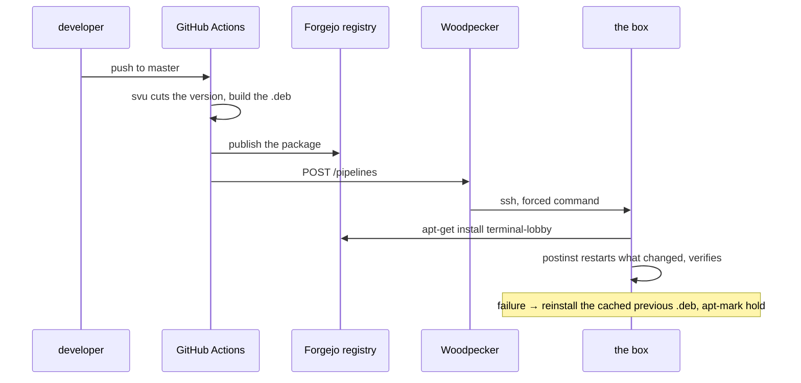

# Deployment

How a change reaches the box. Nothing here is run by hand.

A push to master builds a Debian package and the box installs it. That is the
whole mechanism, and it replaced three hand-run scripts on 2026-08-29. The
reasoning is in [adr/0013-the-box-installs-the-lobby-nobody-ships-it.md](adr/0013-the-box-installs-the-lobby-nobody-ships-it.md).



## What each piece does

**GitHub Actions** builds. CI compute is external by ADR-0002, so nothing is
built in the cluster. `svu` derives the version from conventional commits, so a
`feat:` bumps the minor and a `fix:` the patch.

**The Forgejo Debian registry** distributes. It serves its index and signing key
anonymously, so the box needs no apt credential. GitHub releases carry the same
package as an off-site copy, which is what to reach for if the cluster is down.

**Woodpecker** carries the trigger and nothing else. Runners cannot route to the
box, and Woodpecker is deploy-only by ADR-0002.

**`tl-reconcile`** is the only command the deploy key may run. It takes no
arguments and ignores `SSH_ORIGINAL_COMMAND`: a forced command still receives
whatever the client asked for, and acting on it would hand back the freedom the
forced command exists to remove. It holds a lock so two pushes cannot interleave
inside dpkg, refreshes only this project's apt source, and reports every unit's
state.

**`postinst`** restarts only the units whose files changed, verifies them, and on
failure reinstalls the cached previous package and `apt-mark hold`s it.

## Versions and rollback

The box tracks whatever the registry publishes as latest. There is no version
pin, so **rollback is fix-forward**: publish a higher version. A hand-run
downgrade is undone by the next push.

## Turning it on

The pipeline builds and publishes on every push to master. The trigger that
tells the box to install is off until three things exist.

It was switched on for this homelab on 2026-08-29. What that took, for anyone
setting it up elsewhere or rebuilding this:

**A `WOODPECKER_TOKEN` secret** on the GitHub mirror, authenticating Actions to
Woodpecker. Here it comes from Vault `secret/ci/global` → `woodpecker_api_token`:

```sh
vault kv get -field=woodpecker_api_token secret/ci/global \
  | gh secret set WOODPECKER_TOKEN --repo ViktorBarzin/terminal-lobby
```

**A pipeline that answers the trigger.** `infra/.woodpecker/terminal-lobby-deploy.yml`,
gated on `PIPELINE == "terminal-lobby-deploy"`, plus a `devvm_ssh_key`
repo-secret on the infra repo carrying the private half of
`secret/woodpecker/devvm_ssh_key`.

Then the two box-side pieces below, and finally:

```sh
gh variable set TL_DEPLOY_ENABLED --body true --repo ViktorBarzin/terminal-lobby
```

## Setting it up on a new box

Two pieces are not in the package, because both need root and neither belongs in
a repository.

The apt source, from `devvm/terminal-lobby.sources.template`:

```sh
sudo install -m 0644 devvm/terminal-lobby.sources.template \
  /etc/apt/sources.list.d/terminal-lobby.list
sudo curl -fsSL -o /etc/apt/keyrings/forgejo-viktor.asc \
  https://forgejo.viktorbarzin.me/api/packages/viktor/debian/repository.key
```

And the forced command. The key in `secret/woodpecker/devvm_ssh_key` is issued
for `wizard`, not root, so the entry goes in **wizard's** `authorized_keys` and
the reconcile reaches root through one narrow sudo grant:

```
command="sudo -n /usr/local/bin/tl-reconcile",no-agent-forwarding,no-port-forwarding,no-pty,no-user-rc,restrict ssh-ed25519 AAAA... woodpecker-terminal-lobby
```

```sh
# /etc/sudoers.d/tl-reconcile, mode 0440 root:root
wizard ALL=(root) NOPASSWD: /usr/local/bin/tl-reconcile
```

Every restriction matters: without `command=` this key is a shell. It was
installed unrestricted before 2026-08-29, which is what that audit found.

## Stopping a deploy

```sh
gh variable set TL_DEPLOY_ENABLED --body false --repo ViktorBarzin/terminal-lobby
```

The build and publish still run; only the trigger stops. Unset it or set it to
anything else to resume.

## Watching one

```sh
gh run list --repo ViktorBarzin/terminal-lobby --workflow=release --limit 1
homelab logs query '{unit="ttyd"}' --since 15m
```

## The container

The single-user image is built and published by `.github/workflows/container.yml`,
which smoke-tests it before pushing, so a broken image is never published. It is
for people running terminal-lobby elsewhere; this box installs the package.

## What used to be here

`deploy.sh`, `deploy-v2.sh` and `deploy-services.sh`, 929 lines that
cross-built, SCPed to `/tmp`, installed under sudo and smoke-tested. They were
hardened against a real incident where a deploy from a stale worktree reinstated
an older lobby. The package pipeline removes that class of problem rather than
guarding against it: the box has exactly one writer, holding dpkg's lock. They
are in git history if the detail is ever wanted.
