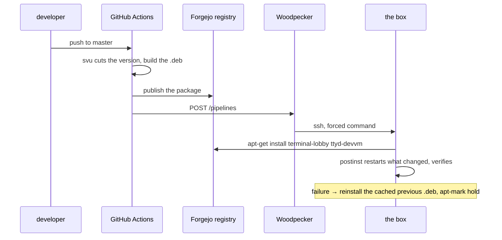

# Deployment

How a change reaches the box. Nothing here is run by hand.

A push to master builds a Debian package and the box installs it. That is the
whole mechanism, and it replaced three hand-run scripts on 2026-08-29. The
reasoning is in [adr/0013-the-box-installs-the-lobby-nobody-ships-it.md](adr/0013-the-box-installs-the-lobby-nobody-ships-it.md).



## What each piece does

**GitHub Actions** builds. CI compute is external by ADR-0002, so nothing is
built in the cluster. `svu` derives the version from conventional commits, so a
`feat:` bumps the minor and a `fix:` the patch.

**The Forgejo Debian registry** distributes. It serves its index and signing key
anonymously, so the box needs no apt credential. GitHub releases carry the same
package as an off-site copy, which is what to reach for if the cluster is down.

The deploy trigger fires as soon as that package is published, and the GitHub
release is attached afterwards. The order is worth keeping: the box installs
from the registry, so nothing after the trigger is on the path to shipping, and
a backup copy that fails should cost the release assets rather than the deploy.
On 2026-09-06, with the trigger running last, `gh release create` hit a tag that
had not yet mirrored from Forgejo, the job went red, and a published 0.42.3 sat
undeployed until someone ran `tl-reconcile` by hand.

**Woodpecker** carries the trigger and nothing else. Runners cannot route to the
box, and Woodpecker is deploy-only by ADR-0002.

**`tl-reconcile`** is the only command the deploy key may run. It takes no
arguments and ignores `SSH_ORIGINAL_COMMAND`: a forced command still receives
whatever the client asked for, and acting on it would hand back the freedom the
forced command exists to remove. It holds a lock so two pushes cannot interleave
inside dpkg, refreshes only this project's apt source, and reports every unit's
state.

It installs **two** packages, `terminal-lobby` and `ttyd-devvm`, and reports the
version of each before and after. The lobby declares `Depends: ttyd-devvm`, but
an unversioned depend is satisfied by whatever version is already installed, so
asking for the lobby alone leaves a newer terminal server in the registry
untouched. Upgrading `ttyd-devvm` restarts `ttyd` from its own `postinst`, which
drops every attached terminal's WebSocket; tmux sessions survive, because the
tmux server that owns them is parented to the user's own systemd manager rather
than to `ttyd.service`, and browsers reconnect.

**`postinst`** restarts only the units whose files changed, verifies them, and on
failure reinstalls the cached previous package and `apt-mark hold`s it.

## Versions and rollback

The box tracks whatever the registry publishes as latest. There is no version
pin, so **rollback is fix-forward**: publish a higher version. A hand-run
downgrade is undone by the next push.

"Latest" is dpkg's opinion, which makes a sortable version scheme part of the
mechanism rather than a cosmetic choice. `terminal-lobby` gets semver from `svu`.
`ttyd-devvm` is versioned `1.7.7+git<commit date>.<sha>`, Debian's snapshot
convention, because the bare short sha it used before does not sort: dpkg
compares the leading non-digit run first, where end-of-string sorts below a
letter, so `1.7.7+02cbf4b` is below `1.7.7+c76b116` and four published builds sat
behind that one unreachable. `dpkg --compare-versions A gt B` answers the
question for any pair.

## Turning it on

The pipeline builds and publishes on every push to master. The trigger that
tells the box to install is off until three things exist.

It was switched on for this homelab on 2026-08-29. What that took, for anyone
setting it up elsewhere or rebuilding this:

**A `WOODPECKER_TOKEN` secret** on the GitHub mirror, authenticating Actions to
Woodpecker. Here it comes from Vault `secret/ci/global` → `woodpecker_api_token`:

```sh
vault kv get -field=woodpecker_api_token secret/ci/global \
  | gh secret set WOODPECKER_TOKEN --repo ViktorBarzin/terminal-lobby
```

**A pipeline that answers the trigger.** `infra/.woodpecker/terminal-lobby-deploy.yml`,
gated on `PIPELINE == "terminal-lobby-deploy"`, plus a `devvm_ssh_key`
repo-secret on the infra repo carrying the private half of
`secret/woodpecker/devvm_ssh_key`.

Then the two box-side pieces below, and finally:

```sh
gh variable set TL_DEPLOY_ENABLED --body true --repo ViktorBarzin/terminal-lobby
```

## Setting it up on a new box

Two pieces are not in the package, because both need root and neither belongs in
a repository.

The apt source, from `devvm/terminal-lobby.sources.template`:

```sh
sudo install -m 0644 devvm/terminal-lobby.sources.template \
  /etc/apt/sources.list.d/terminal-lobby.list
sudo curl -fsSL -o /etc/apt/keyrings/forgejo-viktor.asc \
  https://forgejo.viktorbarzin.me/api/packages/viktor/debian/repository.key
```

And the forced command. The key in `secret/woodpecker/devvm_ssh_key` is issued
for `wizard`, not root, so the entry goes in **wizard's** `authorized_keys` and
the reconcile reaches root through one narrow sudo grant:

```
command="sudo -n /usr/local/bin/tl-reconcile",no-agent-forwarding,no-port-forwarding,no-pty,no-user-rc,restrict ssh-ed25519 AAAA... woodpecker-terminal-lobby
```

```sh
# /etc/sudoers.d/tl-reconcile, mode 0440 root:root
wizard ALL=(root) NOPASSWD: /usr/local/bin/tl-reconcile
```

`sudo tl-users apply -deploy-grant -service-user wizard` writes that file. Name
the account: the line has to carry the account the key sits in, and without the
flag the grant is rendered for whoever invoked `sudo`. Where a roster owns
`/etc/ttyd-user-map` and `/etc/sudoers.d/ttyd-users`, as on the devvm, that run
writes the deploy grant alone and prints that the other two are still the
roster's. `devvm/sudoers.d-tl-reconcile.template` is the annotated reference the
package ships to `/usr/share/terminal-lobby/`. The package never installs the
live path: the line names one account, so a copy landing on a box with a
different service user would grant root to whoever holds that name there. `postinst` does validate
it with `visudo -cf` when it exists, alongside `ttyd-users`.

Every restriction matters: without `command=` this key is a shell. It was
installed unrestricted before 2026-08-29, which is what that audit found.

## Stopping a deploy

```sh
gh variable set TL_DEPLOY_ENABLED --body false --repo ViktorBarzin/terminal-lobby
```

The build and publish still run; only the trigger stops. Unset it or set it to
anything else to resume.

## Watching one

```sh
gh run list --repo ViktorBarzin/terminal-lobby --workflow=release --limit 1
homelab logs query '{unit="ttyd"}' --since 15m
```

## Machine health thresholds

The lobby reports whether the box itself is stalling, as a sixth row, `This
machine`, in Settings under Network. `tmux-api` reads `/proc/pressure` every 10
seconds and measures it against six numbers. All six ship commented out in
`/etc/terminal-lobby.conf`, so a box that leaves them alone runs on the values
the binary compiles in and picks up a later recalibration. Override them in
`/etc/terminal-lobby.local.conf` and restart `tmux-api`. Why the colour comes
from stall time and not from a load average:
[adr/0028-stall-time-says-the-box-is-busy.md](adr/0028-stall-time-says-the-box-is-busy.md).

| variable | default | what it measures |
|---|---|---|
| `TL_HEALTH_CPU_PCT` | `10` | CPU, `some`: time at least one task spent waiting to run |
| `TL_HEALTH_IO_PCT` | `50` | IO, `full`: time every non-idle task spent waiting on disk |
| `TL_HEALTH_MEM_PCT` | `10` | memory, `full`: time every non-idle task spent waiting on memory |
| `TL_HEALTH_CPU_VERY_PCT` | `20` | the CPU reading again, where "may feel slow" becomes "is slow right now" |
| `TL_HEALTH_IO_VERY_PCT` | `70` | the IO reading, at the same tier |
| `TL_HEALTH_MEM_VERY_PCT` | `20` | the memory reading, at the same tier |

Each is a percentage of a **ten-minute window** spent stalled, computed from the
cumulative `total=` counters in `/proc/pressure` rather than from the `avg`
fields beside them, because the thresholds were calibrated against ten-minute
rates and `avg60` is noisier than what anyone measured. Cross one of the first
three and the row turns amber. Cross the matching `_VERY_` line and the sentence
at the top of the panel changes. The dot never goes red: red means "you are
disconnected" everywhere else in this UI, and a busy box is the opposite of
disconnected.

The `_VERY_` lines are not multiples of the first three and setting them as if
they were breaks IO. A stall rate cannot exceed 100%, so twice IO's 50% is a
line no ten minutes of disk stall could ever cross; the measured maximum here is
87.59%. `tmux-api` refuses a `_VERY_` line that is not strictly above its own
amber line, logs what you typed, and pins that resource at 100 so it reports
busy and never very busy. The same refusal catches an amber line raised past a
`_VERY_` line left alone. A value that is not a percentage above 0 and up to 100
is logged and ignored and the compiled default stands, because a cosmetic
setting should not keep the service from starting.

### The defaults describe one machine

They come from 696 hours of this devvm's own history in Prometheus, each line
picked to land near 1% of a month on its own:

| resource | amber above | hours in 30 d | very busy above | hours in 30 d |
|---|---|---|---|---|
| CPU, `some` | 10% | 7.17 | 20% | 2.50 |
| IO, `full` | 50% | 7.33 | 70% | 1.17 |
| memory, `full` | 10% | 4.83 | 20% | 1.33 |
| any of the three | | **17.00**, 2.44% of 696 h | | |

The target was 1-3% of the time, about half an hour a day: rare enough to carry
meaning, common enough that people meet it before the day it matters.

Another box will not have this box's distribution. IO stall here is 4.5 times
more common than CPU stall: the picture people carry of an overloaded machine is
a busy CPU, and on this box that is the rarer event. A box with slower disks or
fewer cores sits somewhere else again. Watch the row for a week against how the
machine actually feels before moving anything. Amber more often than you will
read it means raising the line for the resource the row blames; green through an
hour that felt bad means lowering that one.

If you already scrape the box, `node_pressure_*` answers the same question over
a longer window. Without it, each `/proc/pressure` line carries avg10, avg60 and
avg300 beside the total, and avg300 is the nearest single field to what the row
computes, over five minutes rather than ten:

```sh
watch -n10 grep . /proc/pressure/cpu /proc/pressure/io /proc/pressure/memory
```

### On a kernel without /proc/pressure

Older kernels and some container runtimes do not have it, the Docker dev
environment among them, and none of the six variables is read there. The row
keeps reporting, from the load average per core and the memory headroom in
`/proc/meminfo`, and says on screen that it has fallen back, so the three stall
percentages are absent rather than silently zero. That fallback calls the box
busy above one runnable task per core, the figure a load average is already read
against, which this devvm crosses 0.84-1.1% of the time: the same band of rarity
as the three stall thresholds. Memory headroom is shown beside it and decides
nothing, because no headroom threshold has been measured and an invented one
would fire at a rate nobody has checked.

A row that vanishes reads as a bug and cannot be asked about, which is why it
degrades instead of disappearing.

## The container

The single-user image is built and published by `.github/workflows/container.yml`,
which smoke-tests it before pushing, so a broken image is never published. It is
for people running terminal-lobby elsewhere; this box installs the package.

nginx inside the container is the only thing that listens. It publishes 7681 and
routes to the five services and ttyd on loopback, so those ports are internal and
the container needs exactly one published.

| variable | default | what it does |
|---|---|---|
| `TL_PORT` | `7681` | the port nginx publishes |
| `PORT` | unset | the same thing under the name a container platform assigns; `TL_PORT` wins when both are set |
| `TL_BASIC_AUTH` | unset | `user:pass`; nginx asks for it and the username becomes the identity |
| `TL_TRUST_FORWARDED_USER` | unset | take the identity from the proxy in front instead |
| `TL_AUTH_HEADER` | `X-Forwarded-User` | which header that is |
| `TL_USER` | `dev` | the account everything runs as |

A `TL_PORT` that is not a number, is outside 1-65535, or collides with a service
inside the container is refused at startup rather than at nginx's bind.

Mount a volume at `/home/dev` to keep sessions, projects and files across a
restart; everything the lobby writes is under that home.

The image carries tmux, git, a shell and Claude Code, so the new-session
composer's default command runs. Claude is a pinned binary at `/usr/local/bin/claude` rather than a
`claude.ai/install.sh` install, because that installer puts everything under
`$HOME` and the quickstart mounts a volume over `/home/dev` — an install there
would disappear the first time anyone followed the README. Credentials and
config live in `~/.claude`, which is inside the mount and so persists. Claude
signs in on first run, and it accounts for about 335MB of the image.

Settings → Agent spend stays empty here. Claude Code hands its cost figures to
whatever sits in its statusLine slot and to nothing else, and the image owns no
Claude configuration to point at a recorder: `~/.claude` belongs to the mounted
home, and writing into it would make the image the first install shape that
edits a user's Claude config for them. Filling the page takes two things the
image does not carry: a copy of `devvm/tl-usage-record` from this repo, named as
`statusLine.command` in your own `~/.claude/settings.json`, and `jq`, which the
recorder needs and no-ops without. It posts the reading and then runs whatever
statusLine was there before. Reasoning:
`docs/adr/0023-agent-spend-via-a-statusline-wrapper.md`.

Codex is the one option in that dropdown with nothing behind it, and the lobby
says so: it greys the option out and labels it "not installed", because
`tmux-api` asks the box what it can run before offering it. Give Codex, or any
other key, a command by writing `~/.config/terminal-lobby/commands`
(`codex=<command line>`) in the mounted home; `tmux-user-attach` reads that
before its built-in map, and the greyed-out option comes back to life within two
minutes, which is how long the answer is cached.

> [!IMPORTANT]
> With neither `TL_BASIC_AUTH` nor a proxy in front, anything that reaches the
> published port gets a shell. The entrypoint logs that on startup. It is a
> laptop default, not one to carry onto a host that gives the container a public
> address.

## What used to be here

`deploy.sh`, `deploy-v2.sh` and `deploy-services.sh`, 929 lines that
cross-built, SCPed to `/tmp`, installed under sudo and smoke-tested. They were
hardened against a real incident where a deploy from a stale worktree reinstated
an older lobby. The package pipeline removes that class of problem rather than
guarding against it: the box has exactly one writer, holding dpkg's lock. They
are in git history if the detail is ever wanted.
