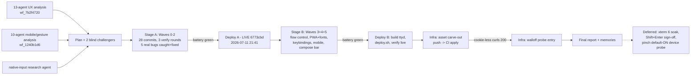

# T3-Code UX Parity Implementation Plan

> **For agentic workers:** This plan is executed by an orchestrated implementation workflow
> (sequential task agents in the `wizard/t3-ux` worktree, battery-verified between waves).
> Steps use checkbox (`- [ ]`) syntax for tracking. Every task = one commit. Research record:
> `docs/plans/2026-07-11-t3-ux-parity-analysis.md`.

**Goal:** Bring terminal.viktorbarzin.me to T3-Code-level UX — real fonts, themed ANSI palettes,
contrast, notifications, session UX, polish, PWA install, flow control — while remaining a true
terminal emulator that renders Claude Code's TUI (workflows, spinners, sixel) flawlessly.

**Architecture:** All frontend work lands in the single-file `frontend/index.html` (no build
step; served by patched ttyd). Server-side additions extend the two existing Go services
(tmux-api, clipboard-upload) and the existing local ttyd patch. Infra changes (PWA asset
carve-out) land in `infra/stacks/terminal/main.tf` via Terraform/CI. A committed dev harness
(`scripts/devserve/`) reproduces the production routing locally so every task is verified with
a real browser (Playwright) against real ttyd+tmux before anything deploys.

**Tech stack:** xterm.js 5.5.0 (pinned; 6.0 deferred), ttyd 1.7.7 + local patch, tmux 3.4,
Go 1.21 services, vanilla JS/CSS, JetBrains Mono + Iosevka-subset webfonts, Terraform.

## Pipeline

**Status: COMPLETE — Stage A live 2026-07-11 21:41 (6773cbd), Stage B live 2026-07-12 07:44 (6aa1663), infra carve-out applied (CI #582) + walloff guard (CI #583) — fonts, ANSI
palettes, 8 themes + live switching, contrast, Unicode 11, stepper, padding, polish, SRI,
truecolor, attention system, reconnect ladder, focus return, status pills, session cards,
settings + roaming prefs, toasts, density. Stage B in flight.**

**RED LINE (non-negotiable, applies to every task):** nothing may alter mouse/wheel/selection/
scroll semantics. Alt-screen scrolling (Claude Code, vim, less), ADR-0003 drag-selection,
buttonless-motion swallow, OSC52 copy, and the 6px tap-vs-swipe mobile path must behave
byte-identically. Tasks flagged **[RL-adjacent]** carry mandatory battery items. `smoothScrollDuration`
stays unset forever. Every task is one commit, independently revertible.

**Multi-user blast radius:** terminal-lobby serves wizard, bob, and anca. Deploy restarts ttyd
(tabs auto-reconnect; tmux sessions survive; stale-tab healer reloads old frontends). TWO staged
deploys (Stage A after Wave 0-2, Stage B after Wave 3-4) — never per-task, never all-at-once;
an SSH session stays open during each as the recovery channel.

---

## Wave 0 — Verification harness (build FIRST; everything else gates on it)

### Task 0.1: Extend `scripts/dev-harness.py` — local production-shaped stack

**REUSE (challenge finding):** an equivalent harness ALREADY EXISTS — `scripts/dev-harness.py`
(+ `scripts/dev-harness.md`). It already does the stripped-prefix routing the frontend actually
uses (`/api/sessions/*` → tmux-api :7684, `/clipboard/*` → clipboard-upload :7683, both
prefix-stripped; everything else incl. WS → a ttyd child mirroring `ttyd.service` flags incl.
`-a`), injects `X-Authentik-Username`, and passes WebSockets through (aiohttp, proven). Do NOT
build a new Go proxy. (Note: `/register` is NOT localhost-only — it accepts the auth header or
a self-reported mapped user.)

**Files:**
- Modify: `scripts/dev-harness.py` (close the two real gaps)
- Create: `scripts/devserve/BATTERY.md` (battery only)
- Modify: `README.md` (pointer)

- [ ] **Step 1: Read `scripts/dev-harness.py` + `scripts/dev-harness.md` fully.** Record its
  flags, ports, and ttyd child invocation.
- [ ] **Step 2: Close gap 1 — scratch tmux server.** Today the harness ttyd child attaches to the
  REAL default tmux server (touches real sessions). Add a `--scratch` mode (default ON for
  battery runs): the ttyd child runs `tmux -L tl-dev new-session -A -s main` and teardown kills
  the `tl-dev` server (`tmux -L tl-dev kill-server`). `-L` only changes the socket name — the
  user's `~/.tmux.conf` still loads, matching prod.
- [ ] **Step 3: Close gap 2 — parameterize upstream ports** (tmux-api default 7684,
  clipboard-upload default 7683) so scratch Go builds of the services can be tested
  (`--tmux-api-port/--clipboard-port` flags), plus a `--delay <path>=<secs>` debug flag (used by
  Task 2.7's slow-toast battery).
- [ ] **Step 4: Build `out/index.html` for the harness** with stamp `DEV-$(git rev-parse --short HEAD)`
  (mirror deploy.sh's sed) if the harness doesn't already; point the ttyd child's `-I` at it.
- [ ] **Step 5: Write `scripts/devserve/BATTERY.md`.** The regression battery (exact steps +
  expected results). Battery runs drive the OUTER lobby page top-level (exactly as prod — the
  terminal is an iframe INSIDE it), never the iframe URL directly, so title/focus/visibility
  paths are the real ones. Two sections:
  **A. Red-line battery (run after EVERY wave and before deploy):**
  1. 1003h selection: `tmux -L tl-dev send-keys -t main "printf '\\e[?1003h\\e[?1006h'; cat" Enter`,
     then in Playwright: drag-select over text → `term.hasSelection()` true; dispatch a buttonless
     `mousemove` over `.xterm-screen` → selection SURVIVES (the #7378 swallow); press Escape →
     restores flow. Cleanup: `q`, `printf '\e[?1003l'`.
  2. Alt-screen wheel: `send-keys "less /etc/services" Enter`; dispatch `wheel` events over the
     terminal → `tmux -L tl-dev capture-pane -p` shows the viewport MOVED (content changed); `q`.
  3. OSC52 copy: select text, trigger the copy chord/flow → "Copied" toast appears.
  4. Sixel: `send-keys "viu -w 20 <repo>/frontend/icon-192.png" Enter`; screenshot; crop the image
     region; ≥100 distinct colors = real render (placeholder ≤40, per stored calibration).
  5. Mobile swipe path: emulate iPhone viewport; the 6px tap-vs-swipe synthetic-wheel logic and
     `--kb-offset` visualViewport plumbing still fire (code-inspect + touch-event dispatch).
  6. Paste: `page.keyboard` Ctrl+V of multi-line text → arrives bracketed (capture-pane shows no
     execution of intermediate lines).
  **B. Feature acceptance (grows with each wave):** placeholder list; each task below appends its
  acceptance line here in the same commit that implements the feature.
- [ ] **Step 6: Verify the harness itself.** Start `dev-harness.py --scratch` (background); curl
  the harness origin's `/api/sessions/whoami` → 200 + `wizard`-mapped identity; Playwright loads
  the harness URL, console shows `terminal-lobby build: DEV-…`, terminal renders, typing
  `echo hi` echoes; confirm the REAL tmux server's session list is untouched. Run red-line
  battery §A end-to-end once against the UNMODIFIED frontend to capture the golden baseline
  (screenshots into `scripts/devserve/baseline/`, gitignored).
- [ ] **Step 7: Commit** `devserve: scratch-server harness mode + regression battery`.

---

## Wave 1 — Terminal core quality (fonts, color, rendering)

### Task 1.1: Real monospace webfont + TL Symbols fallback **(P1, quick win)**

**Files:**
- Modify: `frontend/index.html` (head + CSS `:root` + boot sequence)
- Create: `scripts/build-tl-symbols.sh` + `frontend/fonts/tl-symbols.woff2` (committed, 16.5 KB)

- [ ] **Step 1: Build the symbols subset.** `scripts/build-tl-symbols.sh`: download the GitHub
  release asset `PkgTTF-Iosevka-34.7.0.zip` from `github.com/be5invis/Iosevka/releases` and
  unzip `Iosevka-Regular.ttf` (challenge-verified: jsdelivr `/gh/` ships NO built TTFs — the
  release ZIP is the only source). Tooling is already present on this devvm (`pyftsubset`,
  fontTools 4.63.0, Brotli 1.1.0 — verified). Run
  `pyftsubset Iosevka-Regular.ttf --unicodes="U+2300-23FF,U+2700-27BF,U+2800-28FF,U+203B,U+2610,U+2612,U+25FC" --flavor=woff2 --no-hinting --layout-features='' --name-IDs=0,1,2,3,13,14 --output-file=frontend/fonts/tl-symbols.woff2`.
  Expected size ≈16,524 B. Script is idempotent + documents provenance (Iosevka is OFL-1.1).
- [ ] **Step 2: @font-face + preload for JetBrains Mono.** Vendor the four woff2 files into the
  repo: `frontend/fonts/JetBrainsMono-{Regular,Bold,Italic,BoldItalic}.woff2` from
  `https://cdn.jsdelivr.net/gh/JetBrains/JetBrainsMono@v2.304/fonts/webfonts/` (~92 KB each,
  OFL-1.1; URL challenge-verified 200). In `<head>`: `<link rel=preload as=font type=font/woff2
  crossorigin>` + `@font-face` 400/700 (+italics), `font-display: block`, with a TWO-source
  fallback chain per face: `src: url('/fonts/JetBrainsMono-Regular.woff2') format('woff2'),
  url('https://cdn.jsdelivr.net/gh/JetBrains/JetBrainsMono@v2.304/fonts/webfonts/JetBrainsMono-Regular.woff2')
  format('woff2')` — same-origin self-hosted primary (served by Task 3.1/3.2's asset route;
  until that lands the 404 makes browsers silently fall through to jsdelivr, which is already a
  hard dependency of this page), CDN fallback second. Owner preference: self-host everything.
- [ ] **Step 3: `--font-mono` variable.** `:root { --font-mono: 'JetBrains Mono', Menlo, Monaco,
  monospace; }` and replace the ~6 duplicated mono stacks (lines ≈217, 250, 494, 582, 2866) with
  `var(--font-mono)`. The xterm constructor keeps an explicit string (xterm doesn't resolve CSS vars).
- [ ] **Step 4: Fonts-ready boot gate.** Immediately before `new Terminal(...)`:
  `await Promise.race([document.fonts.load('15px "JetBrains Mono"'), new Promise(r => setTimeout(r, 2000))])`
  (wrap boot in an async IIFE if needed). After open: `document.fonts.addEventListener('loadingdone',
  () => { fitAddon.fit(); term.clearTextureAtlas?.(); })`.
- [ ] **Step 5: TL Symbols post-boot face.** Embed `tl-symbols.woff2` as a base64 `data:` URI
  const; after `term.open()`: `const f = new FontFace('TL Symbols', 'url(data:font/woff2;base64,…)',
  { unicodeRange: 'U+2300-23FF, U+2700-27BF, U+2800-28FF, U+203B, U+2610, U+2612, U+25FC' });
  await f.load(); document.fonts.add(f); term.options.fontFamily = "'JetBrains Mono','TL Symbols','Fira Code','Cascadia Code',Menlo,Monaco,'Courier New',monospace"; term.clearTextureAtlas?.();`
  The unicodeRange guard means JBM keeps supplying ASCII → cell metrics bit-identical (no reflow).
  Do NOT add emoji ranges (would suppress color emoji).
- [ ] **Step 6: Battery line.** Append to BATTERY.md §B: in-page
  `document.fonts.check('15px "JetBrains Mono"')` AND for each of
  `✢ ✳ ✻ ✽ ⏺ ⎿ ✔ ☐ ☒ ⏵ ◼ ※ ⠋` → `document.fonts.check('15px "TL Symbols"', ch)` true; echo the
  glyph battery + `─│┌┐└┘├┤╭╮╯╰ ▀▄█░▒▓ ` into the pty, screenshot, zero tofu boxes. PLUS a
  metrics check (JBM may be wider than the OS fallback): at a 390×844 mobile viewport, portrait
  cols UNCHANGED vs the golden baseline (measured 41→41; JBM 'W' advance 9.000px ≤ OS-mono
  9.031px so no shrink is possible — the original "≥80 cols portrait" wording was arithmetically
  impossible at any mono face and was corrected during implementation); 80-col floor holds at
  844×390 LANDSCAPE with sidebar collapsed (measured 92). Rows 27→23 portrait from JBM's taller
  line box — intended, covered by the deploy heads-up. Box-drawing alignment intact at both
  15px and the stepper extremes (10/22).
- [ ] **Step 7: Run harness + battery §A (red-line) + new §B lines. Commit**
  `fonts: ship JetBrains Mono + TL Symbols subset with fonts-ready boot gate`.

### Task 1.2: Lobby UI font — DM Sans Variable **(P13, quick win)**

**Files:** Modify: `frontend/index.html`

- [ ] Add `@font-face` 'DM Sans Variable' (`font-weight: 100 1000; font-display: swap`): vendor
  `frontend/fonts/dm-sans-latin-wght-normal.woff2` (36.9 KB, from
  `https://cdn.jsdelivr.net/npm/@fontsource-variable/dm-sans@5.2.8/files/dm-sans-latin-wght-normal.woff2`,
  challenge-verified 200) with the same two-source chain (`/fonts/…` primary, jsdelivr fallback);
  define `--font-ui: 'DM Sans Variable','DM Sans',-apple-system,BlinkMacSystemFont,'Segoe UI',system-ui,sans-serif`;
  apply to lobby chrome (sidebar, cards, dialogs, toasts, buttons, headers) ONLY — never the
  xterm element or anything that renders pty content. Weights: 400 body / 500 buttons / 600 headings.
- [ ] Battery: lobby `getComputedStyle` shows DM Sans; terminal computed font unchanged. Screenshot
  lobby. **Commit** `fonts: DM Sans Variable for lobby chrome`.

### Task 1.3: Constructor quality options **(P3+P7, quick wins)**

**Files:** Modify: `frontend/index.html:1785-1809` (Terminal constructor + one listener)

- [ ] Add to the constructor: `minimumContrastRatio: 4.5` (VS Code default; box/block glyphs
  excluded by xterm, dim held to half-ratio), `cursorInactiveStyle: 'outline'`,
  `fontWeight: '400'`, `fontWeightBold: '700'`. Do NOT set `smoothScrollDuration` (red line),
  do NOT set `rescaleOverlappingGlyphs` (surveys disagree; revisit after visual pass).
- [ ] Add `document.addEventListener('visibilitychange', () => { if (!document.hidden)
  term.clearTextureAtlas?.(); })` (WebGL atlas corruption recovery after OS sleep).
- [ ] Battery: echo dim text (`printf '\e[2mdim\e[0m'`) on ink theme → readable in screenshot;
  selected-text readability eyeball on all four themes (contrast adjustment interacts with
  selectionBackground). **Commit** `xterm: minimum contrast 4.5 + cursor/bold polish`.

### Task 1.4: Unicode 11 width tables **(P4, quick win)**

**Files:** Modify: `frontend/index.html` (script tags block ≈14/673-678 + addon wiring ≈1829-1880)

- [ ] Add `<script src="https://cdn.jsdelivr.net/npm/@xterm/addon-unicode11@0.8.0/lib/addon-unicode11.js">`
  (non-`.min` published path, matches Task 1.13's SRI respec) and wire with the existing defensive
  try/catch UMD pattern: `term.loadAddon(new Unicode11Addon.Unicode11Addon()); term.unicode.activeVersion = '11';`
- [ ] Battery: `send-keys "echo '🙂🙂🙂 ├── test'" Enter` → screenshot columns align with tmux's
  wcwidth (no drift of the `├──` tree under emoji). **Commit** `xterm: Unicode 11 width tables`.

### Task 1.5: Full 16-color ANSI palettes for existing themes **(P2, quick win)**

**Files:** Modify: `frontend/index.html` (theme CSS blocks ≈16-98 + `readTerminalTheme()` ≈707-716)

- [ ] Add 16 `--terminal-ansi-*` vars (black,red,green,yellow,blue,magenta,cyan,white + bright*)
  to each `body.theme-{carbon,slate,mono,ink}` block. Dark themes (carbon/slate/mono) seed from
  T3's hand-tuned dark palette: red `rgb(255,122,142)`, green `rgb(134,231,149)`, yellow
  `rgb(244,205,114)`, blue `rgb(137,190,255)`, magenta `rgb(208,176,255)`, cyan `rgb(124,232,237)`,
  white `rgb(210,218,230)`, brightBlack `rgb(110,120,136)` (brights: same hue, +10–15% lightness;
  black = theme bg-elevated). `ink` seeds from T3 light: red `rgb(191,70,87)`, green `rgb(60,126,86)`,
  yellow `rgb(146,112,35)`, blue `rgb(72,102,163)`, magenta `rgb(132,86,149)`, cyan `rgb(53,127,141)`,
  brightBlack `rgb(112,123,140)`. Keep every theme's existing `--terminal-bg/fg/cursor/selection`
  verbatim (red line: selection color untouched).
- [ ] Extend `readTerminalTheme()` to emit all 16 ansi keys + `cursorAccent` from the vars (with
  the current hard fallbacks), plus xterm scrollbar keys from Task 1.10 when present.
- [ ] Battery: `for i in $(seq 30 37) $(seq 90 97); printf "\e[${i}m█ "` on every theme →
  screenshot: 16 distinguishable swatches, legible on ink. **Commit**
  `themes: full 16-color ANSI palettes (T3-seeded) for all four themes`.

### Task 1.6: New theme presets + system auto-follow **(P11, quick win)**

**Files:** Modify: `frontend/index.html` (theme blocks, picker UI ≈651-659, `<head>`)

- [ ] Add four complete `body.theme-*` blocks (all existing vars + the 16 ANSI vars):
  `t3-dark` (bg #161616, panels #1b1b1b, hairline rgba(255,255,255,.06), fg #f5f5f5, accent
  #366ffb, cursor rgb(180,203,255), ANSI = T3 dark set from Task 1.5), `t3-light` (bg #ffffff,
  fg #262626, borders rgba(0,0,0,.08), accent #1b4ed8, ANSI = T3 light set), `catppuccin-mocha`
  (bg #1e1e2e, fg #cdd6f4, cursor #f5e0dc, red #f38ba8, green #a6e3a1, yellow #f9e2af, blue
  #89b4fa, magenta #f5c2e7, cyan #94e2d5, brightBlack #585b70), `catppuccin-latte` (bg #eff1f5,
  fg #4c4f69, red #d20f39, green #40a02b, yellow #df8e1d, blue #1e66f5, magenta #ea76cb, cyan
  #179299, brightBlack #6c6f85). Selection var per theme: keep the same rgba alpha pattern the
  four existing themes use (accent at ~0.22 alpha) — no opaque selections.
- [ ] Add picker entries + a `system` choice. Pre-paint inline `<head>` script (~10 lines): read
  localStorage `tmux-theme`; if `system` (or unset→default current behavior), resolve
  `matchMedia('(prefers-color-scheme: dark)')` → `t3-dark`/`t3-light`; set body class + update
  `<meta name=theme-color>` (#161616 dark / #ffffff light) BEFORE first paint; attach a
  `matchMedia.addEventListener('change', …)` for live OS flips (routes through Task 1.7's live
  switch when it exists, else reload path).
- [ ] Battery: each new theme screenshot (lobby + terminal with ANSI swatches); `system` follows
  an emulated `prefers-color-scheme` flip. **Commit** `themes: T3 dark/light + Catppuccin + system auto`.

### Task 1.7: Live no-reload theme switching **(P10)** **[RL-adjacent: repaint only]**

**Files:** Modify: `frontend/index.html` (picker handler ≈1706-1728 + inner-page message handler ≈2906-2910)

- [ ] Replace the iframe-reload on theme change with a `postMessage({type:'tl-theme', name})`
  into the session iframe (same channel as `tl-drop-files`). Inner handler: swap body theme
  class, `term.options.theme = readTerminalTheme()`, `term.refresh(0, term.rows - 1)`. Keep the
  reload path as fallback when the iframe doesn't ACK (stale build) — send an ACK message back.
- [ ] Battery §A full re-run (theme reassignment repaints the selection overlay: verify an ACTIVE
  selection survives a theme switch, then the standard 1003h/wheel checks). Battery §B: switch
  theme mid-`less` → colors change, viewport position unchanged, no reload (build stamp survives
  in console). **Commit** `themes: live switching via postMessage (no iframe reload)`.

### Task 1.8: Font-size stepper **(P6, quick win)**

**Files:** Modify: `frontend/index.html` (theme-picker row + floating button cluster ≈668-670)

- [ ] `A−`/`A+` buttons (lobby settings row + terminal floating cluster): inner page applies
  `term.options.fontSize = Math.min(22, Math.max(10, n)); fitAddon.fit();` (fit → the existing
  sendResize/pixel-size path — the exact window-resize code path, declared safe by ADR-0003).
  Persist localStorage `tl-font-size`, read at boot (constructor uses it instead of literal 15).
  Outer→inner via `postMessage({type:'tl-font-size', size})`. No keyboard chords in this task.
- [ ] Battery: click A+ → cols/rows shrink (`tmux -L tl-dev display -p '#{client_width}'`
  decreases), Claude-style box redraw stays aligned; reload → size persists. **Commit**
  `ux: font-size stepper (10–22, persisted)`.

### Task 1.9: Window padding **(P8, quick win)** **[RL-adjacent: geometry]**

**Files:** Modify: `frontend/index.html` (terminal container CSS)

- [ ] `#terminal { padding: 8px 10px; background: var(--terminal-bg); box-sizing: border-box; }`
  — `box-sizing` is MANDATORY (challenge finding): `#terminal` is `height:100%;width:100%` with
  NO global border-box reset, so content-box padding would overflow the container by 20×16 px
  AND fight `syncViewport()`'s inline px height on the mobile keyboard path (≈2464). FitAddon
  subtracts the element's own padding when proposing cols/rows — grid math stays exact; matching
  background emulates Ghostty `window-padding-color=background`. Call `fitAddon.fit()` after.
- [ ] Battery §A items 1–2 (challenge verified the ADR-0003 pixel→cell replay is anchored to
  `.xterm-screen`'s LIVE getBoundingClientRect and self-corrects for padding — verify anyway),
  PLUS the mobile `has-soft-keys` inline-height path: emulated keyboard-open → prompt stays
  above the keyboard, no horizontal scroll/clipped last column anywhere. §B: screenshot shows
  the grid inset with theme-matched border. **Commit** `polish: 8×10px window padding`.

### Task 1.10: Scrollbar restyle **(P16, quick win)**

**Files:** Modify: `frontend/index.html` (CSS + `readTerminalTheme()`)

- [ ] Lobby/gallery lists: `::-webkit-scrollbar { width: 6px }`, thumb `rgba(0,0,0,.15)`→hover
  `.25` (light) / `rgba(255,255,255,.1)`→`.18` (dark), `border-radius: 3px`, transparent track.
  `readTerminalTheme()` additionally emits `scrollbarSliderBackground/HoverBackground/ActiveBackground`
  (dark: white at .1/.18/.22; light: black at .15/.25/.3). Color-only; no geometry/behavior overrides.
- [ ] Battery: visual. **Commit** `polish: 6px scrollbars (lobby + xterm slider colors)`.

### Task 1.11: Surface polish pack **(P15, quick win)**

**Files:** Modify: `frontend/index.html` (lobby CSS only)

- [ ] (a) Grain: `body.lobby::after` fixed, `inset: 0`, `pointer-events: none`, `opacity: .035`,
  tiling 256px inline-SVG `feTurbulence` fractalNoise (baseFrequency .9, numOctaves 4,
  stitchTiles stitch) data-URI — NEVER over the terminal/sixel canvas. (b) Cards/dialogs:
  `border: 1px solid var(--border)`, `box-shadow: 0 4px 6px -1px rgb(0 0 0/.05), inset 0 1px
  rgb(255 255 255/.06)` (dark) / `inset 0 -1px rgb(0 0 0/.04)` (light); primary buttons
  `inset 0 1px rgb(255 255 255/.16), 0 1px 2px rgb(27 78 216/.24)`. (c) Radius scale
  `--radius: 10px`: cards 18px, buttons/menus 10px, tooltips/toasts 8px. (d) Session-card
  loading skeleton: `linear-gradient(120deg, transparent 40%, var(--skeleton-highlight),
  transparent 60%)` bg-size 200% 100%, keyframed background-position to -200% 0, 2s -1s infinite.
  Port reference on disk: `~/code/t3code/apps/web/src/index.css:323-332,69-80`, `ui/button.tsx:34-43`.
- [ ] Battery: lobby screenshots per theme; grain absent over terminal view. **Commit**
  `polish: grain, bevels, shadows, radius scale, skeletons (lobby)`.

### Task 1.12: Mobile viewport audit — fill gaps only **(P27, mostly DONE already)** **[RL-adjacent: touch]**

**Files:** Modify: `frontend/index.html` (only if the audit finds gaps)

- [ ] **Challenge finding: the analysis overstated this gap.** Already implemented in production:
  `interactive-widget=resizes-content` (line 5), `html,body{overscroll-behavior:none}` (≈105),
  `env(safe-area-inset-*)` at ≈133,144-146,151,166-167,180,298-299. AUDIT instead of add: grep
  each of the three mechanisms; add ONLY genuinely missing spots (e.g. `overscroll-behavior-y`
  on a scrollable app-root child if one chains, safe-area on any NEW chrome added by Wave 2
  tasks). Do not duplicate existing rules.
- [ ] Battery §A item 5 on BOTH emulated iOS and Android viewports (tap-vs-swipe synthetic wheel
  + `--kb-offset` plumbing) regardless of whether anything changed. **Commit** (or docs-only
  close recording "already implemented") `mobile: viewport audit — fill gaps only`.

### Task 1.13: SRI on CDN pins (non-`.min` respec) **(P14, quick win)**

**Files:** Modify: `frontend/index.html` (all 7 CDN tags ≈14, 673-678 + the unicode11 tag from 1.4)

- [ ] Swap every jsdelivr URL to the PUBLISHED non-`.min` path (`/lib/xterm.js`, `/css/xterm.css`,
  `/lib/addon-{fit,web-links,webgl,clipboard,image,unicode11}.js`) — jsdelivr `.min` variants are
  dynamically generated and explicitly SRI-unsafe; npm ships no `.min` files (JS tags shrink
  ~273 B each; CSS grows +2.7 KB, cached immutable).
- [ ] Compute EVERY hash fresh at implementation time:
  `curl -s <url> | openssl dgst -sha384 -binary | base64` → `integrity="sha384-…"
  crossorigin="anonymous"` on each tag. (Analysis-time values exist in the research record for
  cross-checking; the freshly computed value wins — a wrong hash bricks the page for every user.)
- [ ] Battery: full page load with DevTools network — all 8 assets 200 with integrity OK; then
  corrupt one hash locally → asset blocked (proves SRI active) → restore. **Commit**
  `security: SRI + crossorigin on all CDN assets (published non-min files)`.

### Task 1.14: Truecolor passthrough audit **(P5, verify-first)**

**Files:** Possibly create: `devvm/tmux.conf.system` + Modify: `scripts/deploy.sh`, `devvm/ttyd.service`

- [ ] In the harness: `tmux -L tl-dev display -p '#{client_termfeatures}'` with a Playwright
  client attached, and render a 24-bit ramp
  (`awk 'BEGIN{for(i=0;i<77;i++){r=255-i*3;printf "\033[48;2;%d;%d;%dm ",r,i*3,i*2}print "\033[0m"}'`)
  → screenshot: smooth gradient (no 256-color banding) AND termfeatures contains `RGB`?
- [ ] If RGB absent: create `/etc/tmux.conf` content as `devvm/tmux.conf.system` with exactly
  `set -as terminal-features 'xterm*:RGB'` + a provenance comment; add
  `install -m 0644 /tmp/tmux.conf.system /etc/tmux.conf` to deploy.sh's install block; add
  `Environment=COLORTERM=truecolor` to `devvm/ttyd.service`. (System tmux conf is additive —
  user confs load after and can override.) If RGB present: record the finding in the analysis
  doc and close the task with no change.
- [ ] Battery: ramp screenshot smooth on the harness (re-run after deploy on prod). **Commit**
  `terminal: guarantee 24-bit color through tmux (verify-first)` (or docs-only commit).

**WAVE 1 GATE:** full battery §A + all §B lines green on the harness. Fix-forward loop until green.

---

## Wave 2 — Attention & session UX

### Task 2.1: Attention system — favicon badge + opt-in notifications **(P9)**

**Files:** Modify: `frontend/index.html`

- [ ] Favicon badge: canvas-render the existing icon-192 with an 8px amber dot (top-right) →
  swap `<link rel=icon>` href to the dataURL while ANY session `state=awaiting` (state already
  flows from ADR-0001 hooks via tmux-api `/sessions` polling); restore on clear.
- [ ] Opt-in OS notifications: a bell toggle in the lobby header → `Notification.requestPermission()`;
  on state transition →`awaiting` AND `document.hidden`: `new Notification('<session> needs input',
  {tag: 'tl-' + session})` (tag dedupes); click focuses the tab + attaches that session. Never
  auto-request permission.
- [ ] `term.onBell(() => badge())` + output-while-hidden → title prefix `● <session>` cleared on
  `visibilitychange`/focus (extends the existing `(N●)` title logic ≈1013-1020). No terminal
  output parsing — state source stays hooks + tmux-api.
- [ ] Battery: simulate `awaiting` (poke the state via the same path the hook uses in the scratch
  tmux session) → title + favicon change; with permission granted + page hidden → Notification
  fires once per transition. **Commit** `attention: favicon badge + opt-in notifications + bell`.

### Task 2.2: Reconnect ladder + connection pill **(P17)**

**Files:** Modify: `frontend/index.html` (WS connect path ≈3035-3103)

- [ ] `RETRY_DELAYS_MS = [1000, 2000, 4000, 8000, 16000]` capped at 16 s, index reset after 30 s
  stable connection; instant retry on `visibilitychange→visible` and window `online`;
  `navigator.onLine === false` → pill "You are offline". Slim non-modal pill: "Connecting…"
  (attempt 1) vs "Reconnecting… (attempt N)". tmux reattach makes aggressive retry lossless.
  Coexists with (does not replace) the stale-tab healer's reconnect hook.
- [ ] Battery: kill scratch ttyd → pill appears with ladder counts; restart ttyd → session
  reattaches, pill clears, healer still functional (console). **Commit**
  `connection: retry ladder + status pill`.

### Task 2.3: Focus return after overlays **(P18)**

**Files:** Modify: `frontend/index.html`

- [ ] Central `closeOverlay(el)` used by gallery/lightbox, menus, dialogs, (future settings):
  hides + `requestAnimationFrame(() => term.focus())`, driven by a `focusRequestId` counter so
  any parent can re-request focus (T3 pattern, `ThreadTerminalDrawer.tsx:761-779`). Wire every
  existing overlay dismiss path through it.
- [ ] Battery: open gallery → Esc → type immediately: keystrokes reach the pty (capture-pane).
  Same for menus. **Commit** `ux: reliable focus return after overlays`.

### Task 2.4: Session status pills v2 + working timer **(P21)**

**Files:** Modify: `frontend/index.html` (card CSS ≈392-410 + card render JS)

- [ ] Semantic state colors: awaiting → amber #f59e0b; running → sky #0ea5e9 + pulse + "Working
  for Xs" (span.textContent updated 1/s — no re-render) + three staggered 4px dots
  (animation-delay 0/200/400ms); done-and-unseen → emerald #10b981 while
  `stateChangedAt > lastVisited` (localStorage `tl:session-visits:v1`), cleared on attach.
  Roll max-priority state into the existing tab-title badge.
- [ ] Battery: drive states in scratch session → card cycles amber/sky/emerald; timer ticks;
  visiting clears emerald. **Commit** `sessions: semantic status pills + working timer`.

### Task 2.5: Session cards — live command, inline rename, context menu **(P22)**

**Files:** Modify: `tmux-api/main.go` + `tmux-api/main_test.go` (or new `sessions_test.go`), `frontend/index.html`

- [ ] **(TDD)** Go test first: `/sessions` response items include `pane_current_command` and
  `pane_title` (table test against a fake/`tmux -L` fixture, matching existing test style — read
  the package first). Implement: extend the list format with
  `tmux list-panes -t <s> -F '#{pane_current_command}|#{pane_title}'` (~5 lines; tmux tracks
  natively, zero polling). Run `go test ./tmux-api/...` → green.
- [ ] Frontend: 11 px `var(--font-mono)` chip on cards ("claude", "vim", …);
  `document.title = '<cmd> — <session>'` while attached. Double-click card title → inline rename
  input posting to the existing rename endpoint (guards: `MouseEvent.detail > 1` suppresses
  navigation; skip when a modifier key is held or the event bubbles from nested buttons).
  Right-click on CARDS and gallery thumbs only (never the xterm surface) → promise-based DOM
  menu with rAF first-frame dismissal guard + 4px viewport clamping (port
  `contextMenuFallback.ts:72-305` from the t3code clone).
- [ ] Battery: chip shows `cat` while battery item A.1 runs; rename round-trips; right-click menu
  opens on card, native context menu still appears over the terminal. **Commit**
  `sessions: live command chip, inline rename, card context menu`.

### Task 2.6: Settings panel + roaming `/prefs` **(P23)**

**Files:** Modify: `tmux-api/main.go` (+ test), `frontend/index.html`

- [ ] **(TDD)** Go tests first: `GET /prefs` (empty → `{}`), `PUT /prefs` round-trip, per-user
  isolation via `X-Authentik-Username`, invalid JSON → 400 — cloning the `/layout` whole-document
  handler pattern (storage `/var/lib/tmux-api/prefs/<osUser>.json`, last-writer-wins). Implement
  (~40 lines). `go test` green. (No harness change needed: the frontend reaches tmux-api through
  the stripped `/api/sessions/*` prefix `dev-harness.py` already routes — mirror however the
  frontend calls `/layout` today.)
- [ ] Settings popover next to the theme picker: fontSize (10–22, shared with stepper),
  lineHeight (1–1.4), letterSpacing (0–1 px), cursorStyle (block/bar/underline), cursorBlink,
  fontWeightBold ('600'/'700'). Stored as `tl:prefs:v1` JSON behind a validate-or-default
  wrapper + same-tab CustomEvent; live-applied via `term.options.X` + `fitAddon.fit()` over the
  postMessage channel; synced to `/prefs` (fetch on boot, PUT on change; localStorage wins until
  first successful GET). Panel explicitly EXCLUDES smoothScrollDuration, renderer toggles, and
  any mouse/scroll option (red line).
- [ ] Battery: change lineHeight → grid refits (client_width changes); second browser context
  gets the roamed prefs; garbage in localStorage → defaults (no crash). **Commit**
  `settings: panel + per-user roaming prefs via tmux-api`.

### Task 2.7: Typed toasts + slow-request health toast **(P24)**

**Files:** Modify: `frontend/index.html` (replace `showToast` ≈719-725, keep its call sites working)

- [ ] ~100-line vanilla manager: types error/info/loading/success/warning; id-based
  update-in-place + close; descriptions ≥180 chars clamp to 4 lines with a Copy button; the old
  `showToast(msg, type, duration)` signature stays as a thin wrapper so existing call sites work.
  Track tmux-api/clipboard-upload fetches + WS liveness: anything unacknowledged >15 s feeds ONE
  self-updating "Some requests are slow" toast (timeout 0, expandable detail), closed when all ack.
- [ ] Battery: induce a slow endpoint in devserve (proxy `-delay /sessions=20s` debug flag or
  suspend tmux-api with SIGSTOP) → single slow toast appears, updates, clears on SIGCONT.
  **Commit** `ux: typed toast manager + slow-request health toast`.

### Task 2.8: Chrome density pass **(P25)**

**Files:** Modify: `frontend/index.html` (lobby CSS)

- [ ] T3 metrics: header 52 px; buttons h-32 px / padding 0 11 px / radius 10 px / 500 14 px /
  16 px icons at 80% opacity; `:disabled { opacity: .64 }`; `:focus-visible { outline: 2px solid
  var(--ring); outline-offset: 1px }`; hover tints rgba(0,0,0,.04) light / rgba(255,255,255,.04)
  dark; type scale 12 px default + 10 px uppercase `.08em` group labels;
  `@media (pointer: coarse) { min-height: 44px; font one step larger }` (keeps the existing
  soft-key toolbar sizing).
- [ ] Battery: keyboard-Tab across lobby → visible focus rings; mobile viewport → 44 px targets.
  **Commit** `polish: chrome density pass (T3 metrics)`.

**WAVE 2 GATE:** battery §A + §B full pass.

---

## Wave 3 — Infra, PWA, flow control, robustness

### Task 3.1: PWA asset handlers in clipboard-upload **(P12 step A)**

**Files:** Modify: `clipboard-upload/main.go` + test; `frontend/manifest.webmanifest`

- [ ] **(TDD)** Tests first: GET `/manifest.webmanifest` → 200 `application/manifest+json` +
  `Cache-Control: public,max-age=3600` WITHOUT `X-Authentik-Username`; same for
  `/icon-192.png`, `/icon-512.png`, `/icon-512-maskable.png` (Task M.9 ships the file; a 404
  until then is harmless) (`image/png`) and `/fonts/<each vendored woff2>`
  (`font/woff2`, `Cache-Control: public,max-age=604800` — they're versioned by content, not
  path); POST → 405; `/icon-../etc/passwd` and `/fonts/../../etc/passwd` → 404 (exact-path
  WHITELIST from a fixed table, no dir serving). Implement: exact-path GET handlers reading
  from `/usr/local/share/ttyd/` (configurable base for tests). `go test` green.
- [ ] deploy.sh: ship `frontend/fonts/*.woff2` → `/usr/local/share/ttyd/fonts/` (install block,
  mode 0644) so the same files back both the repo and the served route.
- [ ] Trim `manifest.webmanifest` description to `"Web tmux sessions."` (drops the Authentik
  vendor string from a world-readable file).
- [ ] Battery: devserve curls (no auth header) → 200 for manifest+icons+each font with correct
  content-types; traversal probes 404. **Commit**
  `pwa+fonts: serve manifest, icons and vendored webfonts from clipboard-upload (exact paths)`.

### Task 3.2: PWA ingress carve-out **(P12 step B — INFRA REPO)**

**Files:** Modify: `infra/stacks/terminal/main.tf` (own worktree in the infra clone; git-crypt
filter flags per org rules; this file is not encrypted)

- [ ] Clone the proven pattern from `stacks/tasks/main.tf:296-328` (`module "ingress_icons"`):
  `module "ingress_assets"` with `auth = "none"` preceded by the MANDATORY comment
  (`# auth = "none": public PWA manifest + icons, no user data; OS icon fetchers carry no
  session cookies` — the `check-ingress-auth-comments.py` CI gate requires it);
  `ingress_path = ["/manifest.webmanifest", "/icon-192.png", "/icon-512.png",
  "/icon-512-maskable.png",
  "/fonts/JetBrainsMono-Regular.woff2", "/fonts/JetBrainsMono-Bold.woff2",
  "/fonts/JetBrainsMono-Italic.woff2", "/fonts/JetBrainsMono-BoldItalic.woff2",
  "/fonts/dm-sans-latin-wght-normal.woff2"]` (exact paths only — public OFL font files + two
  icons + manifest carry no user data; the ingress_factory emits per-path K8s Ingress rules with
  NO stripPrefix, challenge-verified, so paths reach the Go handlers unmodified);
  `service_name`/`port` = SAME upstream the existing `/clipboard` route uses (read main.tf:164-175
  and reuse its service — clipboard-upload on the devvm); `full_host = "terminal.viktorbarzin.me"`
  (CRITICAL — without it the factory derives terminal-assets.viktorbarzin.me and the carve-out
  never matches); `dns_type = "none"`; `anti_ai_scraping = false`; `homepage_enabled = false`.
- [ ] Land via infra flow (push → CI auto-applies). Acceptance AFTER apply: 3× cookie-less
  `curl -sI https://terminal.viktorbarzin.me/{manifest.webmanifest,icon-192.png,icon-512.png}`
  → `HTTP/2 200` + correct content-type + NO authentik redirect. DevTools Application→Manifest
  clean. **Commit (infra)** `terminal: public carve-out for PWA manifest+icons`.

### Task 3.3: Walloff probe entry **(P12 step C — INFRA REPO, only after 3.2 verified live)**

**Files:** Modify: `infra/stacks/monitoring/modules/monitoring/authentik_walloff_probe.tf`

- [ ] Add `"terminal-pwa-assets" = "https://terminal.viktorbarzin.me/manifest.webmanifest"` to
  the probe targets (its own rule: the URL must ALREADY be non-Authentik before this line lands —
  hence strictly after 3.2's curl verification). **Commit (infra)**
  `monitoring: walloff probe guards terminal PWA carve-out`.

### Task 3.4: ttyd server-side flow-control fix **(P19)**

**Files:** Modify: `devvm/ttyd-pixel-size.patch` → rename `devvm/ttyd-local.patch`,
`scripts/build-ttyd.sh` (the `PATCH=` var at line ≈26 is the ONLY functional rename ref — the
skip-marker sha256 is computed live from the file, challenge-verified; also update the
explanatory comment blocks in build-ttyd.sh ≈4-11 AND deploy.sh ≈26-27, which both say
"pixel-size"), README patch section. Create: `scripts/devserve/flowprobe.py` (python
`websockets` 10.4 is installed). Preflight: build-ttyd.sh aborts without
cmake/gcc/libwebsockets-dev/libjson-c-dev — check before starting, surface if missing.

- [ ] `flowprobe.py` FIRST (red): raw-WS client (python3, `websockets` lib or stdlib socket +
  minimal WS framing) that authenticates the devserve/scratch ttyd handshake, triggers
  `yes | head -c 20M` via send-keys, sends `0x32` (PAUSE) mid-flood, measures bytes received in
  the following 2 s → prints `pause_honored: false` against the current binary.
- [ ] Extend the patch (~6 lines): `pty_pause` → set `paused = true` + `uv_read_stop`
  (drop the `if (process->paused) return;` early-return that made it a no-op — `pty.c:124,470`);
  `pty_resume` → clear + `uv_read_start` (UV_EALREADY harmless); make the SERVER_WRITEABLE pump
  restart conditional: `if (!pss->process->paused) pty_resume(...)` (`protocol.c:279`) while the
  initial resume (:257) and client RESUME (:326) stay unconditional. Rebuild:
  `scripts/build-ttyd.sh` → `out/ttyd`.
- [ ] Green: run devserve against `out/ttyd` → `flowprobe.py` prints `pause_honored: true` AND
  an UN-paused throughput control (same flood WITHOUT sending PAUSE: bytes/s within ~10% of the
  unpatched baseline, no added latency — guards against a partial-freeze regression in the
  shared binary that a total-freeze check would miss); sixel battery item still passes
  (pixel-size hunks unchanged). Blast-radius note for the commit body: `/usr/local/bin/ttyd`
  backs BOTH :7681 and the read-only :7682 (whose STOCK client's built-in flow control becomes
  live — benign, it's the upstream-intended behavior); consider upstreaming next to PR #1560.
  **Commit** `ttyd: honor client PAUSE (extends local patch; fixes upstream no-op)`.

### Task 3.5: Client WS flow control **(P20 — requires 3.4)**

**Files:** Modify: `frontend/index.html` (ws.onmessage ≈3066-3103, ws.onopen ≈3035)

- [ ] Port stock ttyd's `writeData` accounting (~25 lines; reference upstream
  `html/src/components/terminal/xterm/index.ts:200-221`): defaults limit=100000 bytes,
  highWater=10, lowWater=4 — every 100 KB written register a `term.write(chunk, cb)` completion
  callback counted pending; pending > 10 → send single byte `0x32` PAUSE; callbacks dropping
  pending < 4 → `0x33` RESUME. Reset counters in `ws.onopen`; capture the socket per registration
  and guard sends with `sock === ws && sock.readyState === 1` (a stale callback must never RESUME
  a new connection).
- [ ] **Fail-OPEN safeguards (challenge requirement — without these the failure mode is a frozen
  terminal for a real user):** (a) watchdog: while paused, if NO write callback fires for 4 s,
  force-send `0x33` RESUME, reset counters, `console.warn('tl-flow: watchdog resume')`;
  (b) kill-switch: `localStorage['tl-flow-control']='off'` (also surfaced as a toggle in the
  Task 2.6 settings panel) bypasses the whole branch — plain `term.write(payload)` — so flow
  control is disableable per-browser without a redeploy.
- [ ] Battery: with 6× CPU throttle (Playwright CDP `Emulation.setCPUThrottlingRate`), flood
  `yes | head -c 20M`: poll `term._core._writeBuffer._pendingData` → peak ≤ ~1.2 MB and main
  thread responsive (<200 ms lag probe via rAF timestamps); `flowprobe.py` stays
  `pause_honored: true`; watchdog test (artificially swallow callbacks) → output resumes ≤5 s;
  kill-switch test → behavior identical to today's. **Commit**
  `frontend: WS flow control (bounded write queue, fail-open watchdog, kill-switch)`.

### Task 3.6: Query-reply sanitization on replay paths **(P30)**

**Files:** Modify: `tmux-api/` (new `sanitize.go` + `sanitize_test.go`), wire into the restore
path; check `devvm/tmux-restore-user` for other capture→pty replay routes.

- [ ] **(TDD)** Table tests first, porting T3's rules (`Manager.ts:869-897`): strip CSI…`n` (DSR),
  CSI `[0-9;?]*R` (CPR), CSI `[>0-9;?]*c` (DA), OSC `^(10|11|12);(\?|rgb:)…` replies; MUST handle
  an escape sequence straddling two chunks (carry incomplete tails); leave all other bytes
  untouched (property test: sanitize(x) == x for sequences-free corpora). Implement; `go test` green.
- [ ] Wire into every path that re-feeds captured pane content toward a shell/pty (tmux-persist
  restore; any capture-pane preview). **Commit** `restore: strip terminal query replies (DSR/CPR/DA/OSC) from replayed content`.

**WAVE 3 GATE:** battery §A + §B + `go test ./...` in both service dirs + flowprobe green.

---

## Wave 4 — Keyboard command layer **(P26)**

### Task 4.1: Keybindings + command palette

**Files:** Modify: `frontend/index.html`

- [ ] **BLOCKER GUARD (challenge finding):** `index.html:2503` ALREADY installs
  `attachCustomKeyEventHandler` — it IS the ADR-0003 copy/paste contract (Ctrl/Cmd+C copy :2509,
  selStash recovery :2515, Ctrl/Cmd+V paste :2525, Escape-clears-but-reaches-app :2505, SIGINT
  fallthrough :2528, layout-proof `isChord` matcher :2498). xterm stores ONE handler; a second
  call REPLACES it and silently destroys that contract. Task 4.1 must MERGE: add a
  `matchesAppChord(e)` branch that returns false INSIDE the existing :2503 handler, evaluated
  BEFORE the copy/paste branches; never call `attachCustomKeyEventHandler` a second time.
- [ ] **DEFAULT OFF (challenge finding):** the whole layer ships disabled
  (`tl:keybindings:v1 = {enabled:false}`); a "App shortcuts" toggle in the Task 2.6 settings
  panel enables it per-browser. Never steal keys from users who didn't opt in (Alt+digit is
  readline meta-N; bob/anca must see zero change).
- [ ] Declarative `KEYBINDINGS = [{key, command, when}]` with contexts
  `{terminalFocus, lobbyOpen, galleryOpen}`; ONE capture-phase window keydown that
  `preventDefault()`s ONLY on exact chord match while enabled. Bindings: `Ctrl+Shift+K` palette
  (avoids TUI-owned Ctrl+K/Ctrl+F), `Alt+1..9` attach Nth session, `Alt+Shift+[`/`]` cycle
  sessions; holding Alt 100 ms overlays numbered badges on session tabs (keydown/keyup tracker
  + window-blur reset). Palette: sessions recents-first (`tl:session-visits:v1`) + actions
  (new/kill/rename/gallery/paste) with `>` action filter, rank exact=3/prefix=2/substring=1.
  Overrides in `tl:keybindings:v1`. Port references on disk: `keybindings.ts:21-54`,
  `CommandPalette.logic.ts:182-280`, `shortcutModifierState.ts:29-96`.
- [ ] Battery — run with the layer ENABLED **and** DISABLED: the full ADR-0003 key contract
  (Ctrl/Cmd+C copy with active selection, "Copied (recovered)" stash path, Ctrl/Cmd+V paste,
  Escape clears selection AND reaches the app, Ctrl+C SIGINT with no selection) works
  IDENTICALLY in both states; enabled: chords act and never reach the pty (capture-pane clean);
  disabled: Alt+digit reaches the pty unchanged; palette opens/filters/executes; keyboard-only
  session switch works. **Commit**
  `ux: keybinding layer + command palette (merged handler, default-off)`.

---

## Wave 5 — Mobile & gestures (analysis run `wf_1240b1d6-8f4`, 2026-07-11)

Viktor's follow-up ask: a first-class mobile experience with gestures where appropriate.
Analysis: 4 surveys + critic + 3 CDP probes against the production touch surface. Design
doctrine that emerged (binding for all tasks below): **the single-finger touch path is
untouchable** (it self-disarms on multi-touch at :2227/:2232 — that makes ≥2-finger recognizers
safe-by-construction, preferring horizontal/pinch shapes since vertical 2-finger gestures leak
stagger-scroll); **iOS reserves the entire 3-finger vocabulary** while a text input is focused
(helper textarea ≈ always) → terminal gestures are Android/Chromium-gated, with soft-key buttons
as the universal affordance; **every gesture ships with an opt-out** (`tl:prefs:v1.gestures.*` +
a `tl-gestures` master kill) and a CDP battery recipe (`Input.dispatchTouchEvent` — Playwright's
touchscreen is tap-only). All recognizers bind ONLY provably-unused inputs. 23 rejected gestures
are recorded in the analysis appendix — do not re-litigate (notably: anything on OS edge zones,
double-tap/long-press/1-finger-horizontal on the terminal, 2-finger vertical, card swipe-kill).

### Task M.1: Soft-key row upgrade + hold-to-repeat **(mobile P1+P2)**

**Files:** Modify: `frontend/index.html` (soft-keys builder ≈2257-2374)

- [ ] Append via the existing `makeBtn`/`sendKey` (≈2301-2332): `⇧Tab` → `sendKey('\x1b[Z')`
  (back-tab — Claude Code mode cycle; Termius calls it THE key mobile keyboards can't send),
  `/` and `-` literals (slash-commands, CLI flags); a right-pinned `⌄` button calling
  `helperTextarea.blur()` (keyboard DISMISS — the actual gap; show-keyboard already exists);
  CSS `mask-image` linear-gradient fade on `.sk-row` edges (scroll affordance). Modifier state
  machine (≈2252-2299) untouched.
- [ ] Hold-to-repeat: extend `makeBtn` with `opts.repeat` for arrows+Tab — initial send, then
  500 ms delay, then 60 ms interval; cancel on pointerup/pointercancel/pointerleave (BOTH cancel
  events or keys machine-gun after an OS gesture interrupt); `navigator.vibrate?.(5)` per tick.
  Toggle `tl:prefs:v1.gestures.keyRepeat` (default on).
- [ ] Battery: scratch session runs `cat -v`; tap each new key → capture-pane shows `^[[Z`, `/`,
  `-`; hold ↓ 1.2 s → ≥10 `^[[B`, stops on release; `⌄` blurs the helper textarea. Red line:
  §A.5 legs + a standing `git diff` guard that :2223-2250 is byte-unchanged. **Commit**
  `mobile: soft-key upgrades (Shift+Tab, /, -, dismiss, hold-to-repeat)`.

### Task M.2: Touch copy — copy-mode + capture endpoints, Sel/Copy-screen keys **(mobile P3)**

**Files:** Modify: `tmux-api/main.go` (+ tests), `frontend/index.html`

- [ ] **(TDD)** New endpoints cloning the rename-handler pattern (main.go:361-433):
  `POST /sessions/{name}/copy-mode` → `tmuxCmd(osUser,'copy-mode','-t',name)` and
  `GET /sessions/{name}/capture` → `capture-pane -p -J` output. Prefix/rebind-immune (wizard's
  prefix is remapped to M-x — client-side `\x02` synthesis is BROKEN for the owner himself; the
  server-side command is binding-table-independent). Table tests: 200 happy path, 404 unknown
  session, auth-header user scoping, method guards.
- [ ] Frontend: `Sel` soft key POSTs copy-mode (arrows then move the copy cursor — verified live;
  optional Mark/Yank keys use binding-independent `send-keys -X begin-selection /
  copy-selection-and-cancel`; OSC52 → browser clipboard via the existing empty-selection-tolerant
  provider ≈1843-1852). Upgrade the dead `Copy` key: empty `term.getSelection()` → GET /capture +
  `clipboard.writeText`, wrapped in a ClipboardItem-promise for iOS transient-activation (the
  fetch hop otherwise voids the user gesture). Probe-proven green end-to-end
  (clipboard == show-buffer == 'ALPHA BRAVO').
- [ ] Battery: the proven ~30 s probe sequence (tap Sel → `#{pane_in_mode}`==1 → soft-arrows grow
  `#{copy_cursor_line}`/selection → Enter → 'Copied' toast → `clipboard.readText()` == show-buffer);
  Copy-with-no-selection → clipboard == capture-pane. INVERTED guard stays: vertical drag still
  wheels + `term.hasSelection()` stays false (touch can never create an xterm selection — that's
  the point of the server-side path). **Commit**
  `mobile: touch copy via tmux copy-mode + screen capture (server-side, rebind-immune)`.

### Task M.3: Flat iframe history — `location.replace` session swaps **(mobile P4)**

**Files:** Modify: `frontend/index.html` (frameEl.src writers :1029, :1045, :1128)

- [ ] One helper `setFrameUrl(url)`: `try { frameEl.contentWindow.location.replace(url) } catch
  { frameEl.src = url }` — same-origin iframe `location.replace` adds NO joint-history entry, so
  the iOS standalone edge-back-swipe stays permanently disarmed and Android predictive-back
  minimizes the app instead of walking stale attaches. This is the enabler for the deliberate
  "bind NOTHING to OS edge zones" decision. Pure fix, no flag.
- [ ] Battery: attach 3 sessions via cards → `history.length === 1` (today it grows per swap);
  `page.go_back()` → active session + outer URL unchanged. **Commit**
  `mobile: flat history — swap session iframes with location.replace`.

### Task M.4: Lobby gestures — card long-press menu + lightbox swipes **(mobile P5+P6+P10)**

**Files:** Modify: `frontend/index.html`

- [ ] Shared `attachLongPress(el, fn)` for session cards (+ gallery thumbs): `contextmenu`
  listener (Android fires it free ≈500 ms — same handler Task 2.5 installs) AND a pointerdown
  500 ms timer fallback (iOS never fires contextmenu), timestamp-deduped; cancel on >10 px
  travel, pointerup, pointercancel, second pointer; on fire preventDefault + swallow the
  trailing click (one-shot capture flag) + `vibrate?.(10)` + open the Task 2.5 menu at the touch
  point. CSS on `.session-card`: `user-select:none; -webkit-user-select:none;
  -webkit-touch-callout:none`; `card.draggable = !isCoarsePointer` (HTML5 DnD never fires from
  touch on Android anyway; touch reorder stays via ⋯ Move up/down); extend the repaint guards
  (`isDragging` precedent :1572,:1601) with a `gestureActive` flag so the 5 s poll can't detach a
  mid-press card. Opt-out `gestures.cardLongPress` (default on).
- [ ] Lightbox swipe-DOWN dismiss: per-open recognizer on the box (`{passive:false}` touchmove on
  the OVERLAY only — never the terminal): 1 finger, axis-lock claim |dy|>12px && |dy|>1.5|dx|;
  follow-finger translateY at 0.85× + backdrop fade 1−(dy/400); release ≥96 px or velocity
  >0.5 px/ms → close (through Task 2.3 closeOverlay → term.focus()), else 180 ms spring-back;
  keep the :2583 mousedown focus guard (must not collapse the keyboard mid-gesture).
- [ ] Lightbox swipe-HORIZONTAL gallery nav: extend `openLightbox(url, onClose)` with optional
  `nav={urls, index}` (only the gallery call site :2832-2836 passes it); horizontal axis-lock
  |dx|>12px && |dx|>1.5|dy|; release |dx|≥50 px → neighbor (preload via `new Image()`),
  rubber-band at ends; '3/12' position chip. One axis claim per gesture (shared lock with
  dismiss). Opt-out `gestures.overlaySwipe` (default on).
- [ ] Battery (CDP touch): long-press card 600 ms → menu (Rename/Kill visible); 15 px travel
  variant → no menu, plain tap still attaches; lightbox: dy-drag → dismissed + focus back on
  helper textarea; dx-drag → second image; at last image → rubber-band. Red line: §A.5 + diff
  guard. **Commit** `mobile: lobby gestures (card long-press, lightbox swipe dismiss/nav)`.

### Task M.5: Bottom-sheet presentation on coarse pointers **(mobile P11)**

**Files:** Modify: `frontend/index.html` (presentation layer of Task 2.5 menu + Task 2.6 panel)

- [ ] On `isCoarsePointer`, render the settings panel + card context menu as a fixed-bottom
  sheet: 32×4 px grabber, pointer-drag on grabber/header only (content scrolls natively —
  no scroll-vs-drag ambiguity), snap detents at 55%/92% of `visualViewport` height, dismiss on
  >25% downward drag or backdrop tap, close through closeOverlay; positioned
  `bottom: calc(var(--kb-offset) + env(safe-area-inset-bottom))` — reuses existing plumbing
  (≈2456-2466), NO new visualViewport listeners. Opt-out `gestures.bottomSheet` (default on
  coarse → off = desktop popover). Depends on 2.5/2.6 having landed (they will have — Stage B).
- [ ] Battery: 390×844 → settings opens at 55%; grabber-drag up → 92% snap; drag down → closed
  AND keystrokes reach the pty; backdrop tap closes. **Commit**
  `mobile: bottom-sheet presentation for settings + card menu`.

### Task M.6: Terminal multi-touch module + session cycling **(mobile P7+P8)** **[RL-adjacent: declared brush]**

**Files:** Modify: `frontend/index.html`; Create: `scripts/devserve/gestures.py`,
`scripts/devserve/ios-3finger-probe.html`

- [ ] Shared multi-touch module (INNER document): standing PASSIVE capture
  touchstart/touchend/touchcancel ONLY; the `{capture:true, passive:false}` document touchmove
  is LAZILY attached on the 2nd touch and detached at last touchend/touchcancel/pagehide —
  probe-validated model: 1-finger sequences traverse ZERO blocking listeners (a standing
  non-passive listener would tax every scroll's latency — probe leg H; forbidden). Expose
  `window.__tlGestures.attached` for the battery. Master kill: `tl-gestures` localStorage flag.
- [ ] Session prev/next: `‹`/`›` buttons in the soft-key row (PRIMARY affordance — works on iOS,
  Android, TalkBack) → NEW origin-checked inner→outer `tl-gesture` postMessage (add
  `parent !== window` guard; the outer listener mirrors :2906-2910) → one outer
  `cycleSession(dir)` over `lastSessions` order. PLUS the accelerator: 3-finger horizontal swipe,
  registered ONLY on Android coarse-pointer UAs (iOS: the OS owns the entire 3-finger vocabulary
  while a text input is focused — analysis exclusion #1; NEVER register there): arm at exactly 3
  touches inside terminalEl none within 32 px of side edges; commit at mean dx ≥80 px, |dx|>2|dy|,
  cumulative |dy|<24 px, same sign, <600 ms; abort if fingers rest >350 ms (OEM partial-screenshot
  hold); `vibrate?.([10,10])` + 220 ms pill naming the target. Flag `gestures.swipeSession`
  (default ON Android coarse only).
- [ ] Two-finger TAP → toggle the soft-key toolbar (reclaim ~50 px): 2 pointers down+up within
  220 ms, per-finger travel <10 px, inter-touch distance delta <8% (rejects pinch starts) →
  toggle `#soft-keys` + `body.has-soft-keys` + `syncViewport()+refit()`; persist
  `gestures.toolbarHidden`; first toggle toasts 'Two-finger tap to restore keys'; single tap
  only — NEVER bind 2-finger double-tap (Safari smart zoom). Flag `gestures.twoFingerTap`
  (default ON coarse). All platforms (iPadOS caveat: OS word-select may co-fire over the helper
  textarea — UX-only, xterm's insertText filter keeps the pty clean; covered by the manual iPad
  checklist).
- [ ] `scripts/devserve/gestures.py`: CDP helpers (multi_swipe, pinch, long_press, two_finger_tap)
  used by all Wave-5 battery lines. `ios-3finger-probe.html`: the standing MANUAL device
  checklist page (variants A/B/C) — run on a real iPhone (Safari tab + installed PWA) per major
  iOS release and before any deploy touching terminal touch handlers.
- [ ] Battery: multi_swipe (3 pts, Android UA emulation) → outer hash flips to neighbor AND the
  original session's capture-pane is unchanged (no scroll/bytes leaked); `‹` button leg →
  engine-independent same assert; 2-finger tap → `body.has-soft-keys` toggles +
  `#{client_height}` grows; module-isolation leg: 1-finger 5 px-step swipe →
  `__tlGestures.attached` stays false AND synthetic-wheel count equals baseline. Red line: §A.5
  + :2223-2250/:2043-2121 diff guards. **Commit**
  `mobile: multi-touch module, session cycling (buttons + Android 3-finger swipe), 2-finger toolbar toggle`.

### Task M.7: Haptic vocabulary **(mobile P9)**

**Files:** Modify: `frontend/index.html`

- [ ] One `haptic(kind)` helper (same-origin unsandboxed iframe — API works; user activation
  supplied by the in-flight touch): selection=`vibrate(5)` (soft-key taps, repeat ticks,
  stepper/pinch step commits, Copy/Sel success), impact=`vibrate(15)` (long-press menu open,
  session-switch commit, toolbar toggle), error=`vibrate([10,60,10])` (error toasts). Always
  `navigator.vibrate?.()` (undefined-safe: iOS has NO vibration API in 2026 — Android-only
  progressive enhancement), always paired with a visual cue. Settings row rendered only when
  `'vibrate' in navigator`; flag `gestures.haptics` (default on).
- [ ] Battery: spy over navigator.vibrate → soft-key tap calls (5); session-switch commit calls
  impact grade; toggle off → no calls. **Commit** `mobile: haptic vocabulary (Android)`.

### Task M.8: Pinch-to-font-size (default OFF) + resize repaint mask **(mobile P12+P13)** **[RL-adjacent: declared brush]**

**Files:** Modify: `frontend/index.html`; Create: `scripts/devserve/pinch-probe.html`

- [ ] **Respec is probe-derived — do NOT simplify back** (both naive models FALSIFIED on the
  production surface: Chrome's cancelable-touchmove window is ~1-3 moves so
  classify-at-12%-then-claim never lands, and a one-shot first-move preventDefault doesn't hold —
  native zoom resumes when consumption stops. A claim = CONTINUOUS consumption of every 2-finger
  touchmove). Flag `tl:gesture-pinch-font:v1` DEFAULT OFF (Task 2.6 toggle) + master kill;
  Chromium-family coarse pointers only; armed only while `visualViewport.scale ≤ 1.001`. On a
  2-finger sequence over the terminal: consume EVERY 2f touchmove from move 1 (via the module's
  lazy non-passive listener); at 2f-move 3 classify |span/span0−1| ≥ 0.05 → claimed: keep
  consuming, ±1 font step per ±7% cumulative span ratio through the shared `applyFontSize(n)`
  (refactor Task 1.8's stepper action into this shared fn: clamp 10-22, persist, fit()),
  'Aa 15px' pill + `vibrate?.(5)` per step; else → RELEASE (native resumes with only ~7.5 px
  centroid swallowed). Declared displacement while ON: deliberate pinch over the terminal
  font-resizes instead of native-zooming; mid-scroll finger-joins stay native BY PLATFORM LIMIT
  (all events arrive cancelable=false — probe legs G/N: panic-zoom mid-scroll always works).
  `touch-action` at :110 stays UNTOUCHED (the flag-OFF battery leg — native zoom must still
  reach scale>1 — is the standing regression guard). Commit `pinch-probe.html` for the hardware
  leg. **Default stays OFF until Viktor runs the real-device probe** (no adb on the devvm; the
  release-resume legs are the hardware-fragile part).
- [ ] Repaint mask: `applyFontSize` wraps changes with `terminalEl.style.opacity = .35` (80 ms
  transition) → apply+fit → restore 180 ms after the last fit in the burst (reuse the 120 ms
  refit debounce :2469-2478). Container opacity only — never the WebGL canvas contents.
- [ ] Battery (FINE steps only — coarse CDP dispatch false-greens; raw Input.dispatchTouchEvent
  only): flag-ON diverging pinch (35 moves, 2.5 px/finger/move) → first consumed move index==1 &&
  cancelable===true, every consumed move defaultPrevented, END `visualViewport.scale===1`,
  tl-font-size stepped ≥2, converging leg steps down; flag-OFF same gesture → scale>1 (then
  `Emulation.resetPageScaleFactor`); span-constant 2f-pan → released at move 3, font unchanged;
  staggered join → zero defaultPrevented (declared leak); 1-finger isolation leg. Stepper mask:
  burst screenshots show one dimmed frame, final aligned. Red line: §A.5 + diff guards.
  **Commit** `mobile: pinch-to-font-size (default off, probe-derived claim model) + resize mask`.

### Task M.9: Maskable PWA icon **(mobile P14)**

**Files:** Modify: `frontend/manifest.webmanifest`, `clipboard-upload` whitelist (Task 3.1),
infra ingress list (Task 3.2); Create: `frontend/icon-512-maskable.png`

- [ ] Generate `/icon-512-maskable.png` (existing artwork inset to the ~80% safe zone on a
  theme-bg field); add `{src, sizes: '512x512', purpose: 'maskable'}` as a THIRD icons entry
  (keep the 'any' entries — purpose-any-only letterboxes on Android adaptive launchers); the
  Task 3.1 whitelist + Task 3.2 ingress_path lists ALREADY include it (amended). Keep
  `orientation: 'any'` (terminals want landscape — T3's portrait lock does not transfer).
- [ ] Battery: cookie-less curl → 200 image/png; in-page manifest parse → 3 icons, one maskable;
  traversal probe still 404. **Commit** `mobile: maskable PWA icon for Android launchers`.

### Task M.10: Native compose bar — full-fidelity mobile text input **(mobile P15, research agent 2026-07-11)** — SEQUENCE AFTER M.1

**Verdict basis (do not re-litigate):** the helper-textarea `type=password` suppression exists
because Gboard predictive text BROKE terminal input (xterm #2403; composition corruption
#3600/#675) — a hidden field cleared on every keystroke can never host autocorrect/swipe/
dictation, so "un-suppress the helper textarea" is rejected even behind a flag; the suppression
block stays byte-untouched. The fix is a separate, VISIBLE, opt-in field sending through the
proven bracketed-paste primitive. Rejected also: contenteditable (WebKit focus-loss #112854),
raw `sendInput(text+'\r')` (loses bracketing → N submits), Enter-inside-the-paste (normalizes
to `\r` INSIDE `\x1b[201~` = soft newline, never submits), outer-doc placement (all primitives
live in the inner iframe), CSI-u encoding (that's deferred P29 — compose handles Enter locally).

**Files:** Modify: `frontend/index.html` — CSS near `#soft-keys`; the `isCoarsePointer` builder
(after the toolbar append); `syncViewport()`; prefs schema (`PREF_DEFAULTS`/`PREF_VALID`/
`normalizePrefs` — M.1 generalizes the nested namespace first, hence the ordering).

- [ ] **Field (inner doc, sibling of `#soft-keys`):** `#compose-bar` (display:none) with
  `<textarea id="compose-input" rows="1">` + `▶` Send + `⌄` collapse. Attributes — the OPPOSITE
  of the helper textarea, never inheriting `type`: `autocapitalize="sentences"`,
  `autocorrect="on"`, `spellcheck="true"`, `autocomplete="off"` (kills form-autofill only —
  keyboard-level swipe/suggestions/dictation stay), `inputmode="text"`, dynamic `enterkeyhint`,
  `aria-label`, inline `font-size:16px` (blocks iOS focus auto-zoom). Auto-grow to 5 lines
  (`scrollHeight` clamp), internal scroll past that.
- [ ] **Send path (byte-exact):** `doSend(withEnter)`: guard `text.trim()` non-empty (send raw
  text); `consumeSoftMods()` (armed Ctrl/Alt must not remap the paste's first char);
  `term.paste(text)` → `\x1b[200~` + text with `\r?\n`→`\r` + `\x1b[201~` when the pane has
  DECSET 2004 (Claude Code always does) → the existing onData→sendInput→ws path; if
  `withEnter`, a SEPARATE `sendInput('\r')` lands AFTER `\x1b[201~` → Claude Code submits;
  clear field, re-focus it (keyboard stays up), `haptic?.('selection')`.
- [ ] **Send modes (LOCAL to the field — no pty encoding change):** default
  `compose.enterKey='newline'` → Return inserts a newline natively, `enterkeyhint="enter"`,
  Send button submits; `'send'` → Enter submits (`preventDefault`), Shift+Enter falls through
  to newline, `enterkeyhint="send"`. Long-press Send ~500 ms → `doSend(false)` — stage the
  block into Claude Code's composer WITHOUT submitting (toast "Staged (no Enter)").
- [ ] **Focus routing (RL-adjacent, guarded):** `makeBtn`'s post-tap `term.focus()` becomes
  `focusActiveInput()` (→ compose field while composing, else terminal — byte-equivalent when
  compose is off). Soft keys keep reaching the pty while the field is focused because
  `sendInput` writes to the socket regardless of DOM focus — battery-asserted. Documented
  limitation: armed-Ctrl/Alt + typed-letter chords need terminal focus (compose is for prose).
- [ ] **Toggle + geometry:** `✎` button in the M.1 soft-key row toggles the bar + focuses the
  field; bar `position:fixed` at `bottom: calc(var(--kb-offset,0px) + env(safe-area-inset-bottom)
  + var(--sk-h,0px))` — directly above the toolbar, SAME `--kb-offset` plumbing, no new
  visualViewport listeners; `syncViewport()` additionally subtracts the visible compose-bar
  height from the terminal height (compose hidden ⇒ formula identical to baseline).
- [ ] **Settings (roaming `tl:prefs:v1`):** `compose: { autoShow:false, enterKey:'newline' }`
  (opt-in; validated like `gestures.*`). Two coarse-pointer settings rows: auto-show toggle +
  Return-key segmented control. Default `'newline'` matches T3/mobile-messaging convention and
  avoids accidental submits — flag to Viktor that he can flip the default if he prefers
  desktop Enter=submit muscle memory.
- [ ] **Battery:** attributes assert (autocapitalize/autocorrect/spellcheck/no-type/≥16px/
  enterkeyhint); focus-routing leg (type into field → capture-pane UNCHANGED; soft-key ↑/Esc
  still reach the pty); the decisive framing leg — scratch pane runs
  `printf '\e[?2004h'; cat -v`, send two lines → capture shows
  `^[[200~line1^Mline2^[[201~^M` (ONE block, submit CR outside the bracket); long-press leg →
  same block, NO trailing `^M`; geometry leg (390×844: no overlap, bottom row visible, no fit
  thrash). Real-device checklist additions (mac/Appium iPhone rig): Gboard swipe, iOS dictation
  (must not blur the field), autocorrect accept, enterkeyhint rendering, no focus auto-zoom.
- [ ] **Red line:** full §A runs with compose OFF; standing diff guards on the helper-textarea
  suppression block, `sendInput`, and the onData wrapper (byte-unchanged); the bar only CALLS
  the unchanged `term.paste()`/`sendInput()` primitives and is default-off. **Commit**
  `mobile: native compose bar (opt-in) — bracketed-paste send for Claude Code prompts`.

**WAVE 5 GATE:** full battery §A + all Wave-5 §B lines (gestures.py) + `go test ./tmux-api/...`
+ the module-isolation leg (1-finger path provably untouched). The manual iOS device checklist
(`ios-3finger-probe.html`) is a STANDING pre-deploy item for any future change to terminal touch
handlers, and the first run is Viktor's (documented in the deploy heads-up).

## Explicitly deferred (decided, not forgotten)

- **xterm.js 6.0.0 lockstep upgrade (P28)** — red-line-flagged core bump (selection/scroll
  internals reimplemented). Do AFTER this pass soaks in daily use; the battery built here makes
  that upgrade safely attemptable. Includes lockstep addon bumps + fresh SRI hashes.
- **extended-keys / Shift+Enter (P29)** — changes key ENCODING for every tmux app; ships only
  after Viktor's explicit sign-off, then only as an off-by-default settings toggle.
- **19 recorded exclusions** (chat renderer, composer, diff UI, search overlay, ligatures,
  transparency, splits, Berkeley Mono, smooth scroll, scroll-pill, …) — reasons in the analysis
  record; do not re-litigate without new evidence.
- **Pinch-to-font-size default-ON** — ships default-OFF (Task M.8); flipping the default needs
  Viktor's real-device probe run (`pinch-probe.html` via chrome://inspect — the release-resume
  legs are hardware-fragile and the devvm has no adb).
- **iOS terminal gestures** — the OS reserves the 3-finger vocabulary; a tightly-gated 2-finger
  horizontal swipe is the only unreserved multi-finger shape left and would need its own device
  test + sign-off. Session cycling on iOS = the `‹`/`›` soft keys.
- **Synthetic-wheel delta scaling with font size** — edits the red-line dispatch itself
  (:2238-2243); catalogued for explicit sign-off ONLY if scroll feel degrades after the stepper
  ships. Rejected by default.
- **23 mobile-gesture exclusions** (OS edge zones, terminal double-tap/long-press,
  1-finger-horizontal, 2-finger-vertical, card swipe-kill, VirtualKeyboard API, …) — reasons in
  the analysis appendix; do not re-litigate without new evidence.

## Landing & deploy (operator steps — STAGED, challenge requirement)

**Blast-radius reality:** one devvm, one binary, one index.html for wizard/bob/anca; the
stale-tab healer force-reloads every open tab onto each new build. Boot-critical changes (SRI
hashes, webfont gate, pre-paint theme script) therefore hit all three users at once → two
stages, each independently verified, with an SSH session HELD OPEN throughout (recovery channel
— never assume the web terminal can fix the web terminal).

**Stage A — after Wave 0-2 gates green (cosmetic + session UX):**
1. Merge `origin/master` into `wizard/t3-ux`, re-run battery §A quick pass, push the Wave 0-2
   commits `HEAD:master` (per-task commits kept; subject WHAT / body WHY).
2. `~/code/scripts/presence claim service:terminal-lobby --purpose "T3-UX Stage A deploy: frontend + services restart"`.
3. From the landed master checkout: `./scripts/deploy.sh` (NO out/ttyd yet — Wave 3 not landed).
   Restarts ttyd/ttyd-ro/tmux-api/clipboard-upload; tmux sessions survive; tabs reconnect;
   healer reloads them.
4. Verify live over SSH: installed stamp `sudo grep -c "$(git rev-parse --short HEAD)" /usr/local/share/ttyd/index.html`;
   authed smoke `curl -s -H "X-authentik-username: alice" localhost:7681/ | grep -o 'tl-build[^"]*'`;
   `journalctl -u ttyd -u tmux-api -u clipboard-upload --since -5min` clean; edge alive
   (`curl -sI https://terminal.viktorbarzin.me/` → Authentik 302 = edge+auth healthy). A fully
   authed real-browser pass through Authentik isn't scriptable headlessly — the healer reloads
   the owner's own open tab within minutes, which IS the production check; watch journal for
   any error burst after the reload wave. Release presence. Soak while Wave 3-4 is implemented.
**Stage B — after Wave 3-4-5 gates green (ttyd patch, flow control, PWA, keybindings, mobile):**
5. `scripts/build-ttyd.sh` (preflight build deps first) → `out/ttyd` present; merge + push Wave
   3-4-5 commits; presence claim; `./scripts/deploy.sh`; same verification as step 4 PLUS
   flowprobe against :7681 (authed) and the un-paused throughput control. Deploy heads-up to
   users includes the mobile additions and the standing iOS device-checklist ask
   (`ios-3finger-probe.html`).
6. Infra: land Task 3.2 (presence `stack:terminal`; push → CI auto-applies), then the cookie-less
   curls → 200 ×8 (manifest, 2 icons, 5 fonts) + `curl -s https://terminal.viktorbarzin.me/fonts/JetBrainsMono-Regular.woff2 | wc -c`
   ≈ 92164; only THEN land Task 3.3 (walloff probe); confirm probe green in Prometheus.
7. Post-deploy: full battery §A against production origin (SSH-tunneled authed context) +
   screenshots; store learnings to homelab memory; heads-up note to bob/anca-visible change log
   (font metrics shift cols/rows slightly — intended); candidate ADR-0006 "webfont strategy &
   battery-gated UX changes".

## Rollback

**Channel: SSH (`wizard@192.0.2.10`) — deploy.sh's own transport — NOT the web terminal.**
Every task is one commit → `git revert <sha>` + `./scripts/deploy.sh` from master. Fonts/themes/
options are additionally runtime-degradable (delete a family name, pick an old theme, unset an
option); client flow control has the localStorage kill-switch. ttyd binary: rebuild from the
previous patch state (`git checkout <prev> -- devvm/ttyd-local.patch scripts/build-ttyd.sh &&
scripts/build-ttyd.sh`) and redeploy — or fastest: reinstall the previous binary if kept at
`/usr/local/bin/ttyd.prev` (deploy step should `cp` the old binary aside before install; add to
deploy.sh in Task 3.4). Infra carve-out: revert the module block; CI applies the removal; the
walloff probe line must be reverted in the SAME push (inverse of the landing order).
