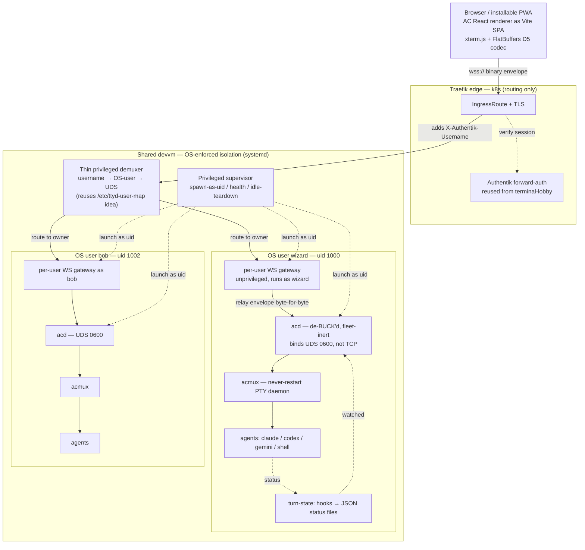

# Agent Conductor → Web — design record

**Port Meta-internal `agent-conductor` (AC) into a self-hosted, multi-user web app that succeeds terminal-lobby.**

- **Status:** ✅ **LIVE & VERIFIED (admin-gated first cut)** — 2026-07-16. `ac.viktorbarzin.me` serves agent-conductor's UI over the de-Meta'd daemon: **M0** (de-BUCK) → **M1** (browser) → **M2** (per-user isolation) → **C4** (deployed). Edge external+internal 200, Authentik forward-auth admin-gated, a real session runs (`id -un`→wizard through the live socket-activated path), and cross-user isolation is red-team-proven. Runs alongside terminal-lobby. Remaining: **M3** (multi-user rollout — needs the bob map-key fix + the `:7690/:7691` firewall), **M4** (renderer breadth / PWA), **M5** (fleet excision).
- **Date:** 2026-07-15 (approved & execution started 2026-07-16)
- **Owner:** Viktor (wizard)
- **Provenance:** AC is Meta-internal proprietary code (uploaded as `agent-conductor.zip`, reviewed as private reference). Building a self-hosted fork is Viktor's call; he has cleared the IP question. This design assumes a **frozen snapshot**, owned as first-party.
- **How we got here:** two adversarial fan-out workflows — `ac-vs-tl-review` (what's worth taking) and `ac-web-port-feasibility` (can we port it, and how) — feeding a `/grilling` interview.

---

## 1. Goal & north star

terminal-lobby today is a lean web tmux lobby: browser terminals via patched **ttyd** + stock **tmux** + a small Go **`tmux-api`**, Authentik-gated, per-OS-user on one shared devvm, sessions shown as a name + a 3-state dot behind a ~10s poll.

The north star chosen is **ambitious**: make the lobby an **attention console** — "which of my many agents needs me right now" — by **porting agent-conductor's actual UI and agent-conducting engine** into a self-hosted web app, rather than merely borrowing ideas. AC is a genuinely excellent, mature implementation of exactly this.

## 2. Feasibility verdict — GO, with conditions (effort: **XL**)

No hard technical blocker. Verified-good:

- `acd`'s Rust deps are **clean** — ~57 public crates + 4 well-scoped internal deps, **no smuggled Meta-internal crates**; generated files checked in.
- The transport is **already browser-shaped**: 131 of ~188 call sites open a WebSocket straight from the renderer to `acd` (`RemoteConnectionBrowser`, 3356 lines). AC is mid-migration to exactly the shape a browser needs.
- Renderer: **~400 of 505 files are Electron-free**; it talks to a single seam (`window.electronAPI`, an 883-line interface).
- **Turn-state detection** (hooks → JSON status files) — the single highest-value piece — is fully decoupled and Meta-free.
- `acmux` (AC's never-restart PTY daemon) survives redeploys; `acd`'s PTY layer already supports a **Tmux backend**, so the familiar scroll/copy workflow can be preserved.

Two **load-bearing, non-negotiable** conditions (proven by the adversarial challengers):

1. **Live cross-uid RCE.** `acd` binds plain loopback TCP, does **no** peer-uid check, and trusts any tokenless loopback connection — its own docs flag this as unfixed. 4 real OS accounts exist on the devvm today, and `acd`'s job is spawning shells. **A shared `acd` must never ship.**
2. **Per-OS-user isolation is a from-scratch, security-critical subsystem** — `acd` is single-user-by-assumption. This, not the renderer work, is the dominant cost and the honest reason the total is **XL**.

Plus a permanent **proprietary-fork tax** — mitigated by freezing the snapshot (§4, decision F).

## 3. Target architecture

A browser / installable **PWA** loads AC's React renderer built as a plain Vite SPA (the ~400 Electron-free files, xterm.js, and the FlatBuffers/D5 wire codec re-bundle unchanged), with a new `window.electronAPI` **browser shim** replacing the Electron preload. It opens **one `wss://`** connection carrying AC's binary envelope untouched.

That lands at the **Traefik edge**, where **Authentik forward-auth** (reused verbatim from terminal-lobby) authenticates the human and injects `X-Authentik-Username`. Behind it sits the **only** privileged, browser-adjacent component: a **thin, stateless demuxer** mapping username → OS user → that user's `acd` socket.

Isolation is fixed by the RCE: **one `acd` per OS user**, launched as that uid by a privileged **supervisor**, each bound to a **`0600` Unix socket** in a `0700` dir (replacing `acd`'s unsafe TCP bind). The **protocol relay runs per-user and unprivileged**, so the root-equivalent surface stays as small as possible. Each `acd` is de-BUCK'd, fleet-inert, Meta-services-stubbed; owns PTYs via `acmux`; spawns only external agents (claude/codex/gemini/shell); and runs the reused turn-state detection with a **fail-open** ambiguous case (zero cost). Everything runs as **systemd units on the devvm**; k8s only routes.

### Component inventory

| Component | Source | Role |
|---|---|---|
| AC React renderer (Vite SPA) | reused-from-AC | The UI. ~400/505 files Electron-free; xterm.js, stores, toasts port unchanged. |
| `window.electronAPI` browser shim | **new** | Plain-object impl of the 883-line interface; 131 hot-path methods only change URL/auth. |
| `RemoteConnectionBrowser` WS client | reused-from-AC | FlatBuffers encode/decode + RPC. Add reconnect/backoff/resubscribe (absent today). |
| D5 envelope + FlatBuffers codec | reused-from-AC | Re-bundles as-is; gateway relays it opaquely. |
| Per-user WS gateway | **new** | Terminates the browser leg, relays the envelope to the owner's `acd`. Unprivileged, per-uid. |
| Thin privileged demuxer | **new** | The only root-equivalent, browser-adjacent piece. Stateless username→socket map. |
| Authentik forward-auth | from-TL | Reused Traefik middleware + IngressRoute + TLS. |
| Per-user `acd` lifecycle supervisor | **new** | Spawn-as-uid, socket alloc, health, idle-teardown. No AC precedent — greenfield. |
| `acd` (de-BUCK'd, fleet-stripped) | reused-from-AC | The session/agent engine. Cargo bring-up; fleet inert; Meta services stubbed. |
| `acd` UDS-0600 transport patch | **new** | Replace `TcpListener` with per-user `0600` UDS. Closes the cross-uid gap. |
| `acmux` never-restart PTY daemon | reused-from-AC | Holds PTY masters across `acd`/gateway restarts. |
| Agent registry (trimmed) | reused-from-AC | Keep claude/codex/gemini/shell; delete ~6 Meta-only modes. |
| Turn-state detection | reused-from-AC | Hooks → JSON status files. **Fail-open** on ambiguity (zero cost). |
| 6 browser-capability swaps | **new** | OS-notif→Web Push, clipboard, openExternal→window.open, save-dialogs→remote picker, `ac-media://`→auth'd HTTPS range, deep-link→HTTPS route. |
| sudo-scoped launch pattern | from-TL | Template for the supervisor dropping privilege per named binary. |

## 4. Decisions (this grilling)

| # | Decision | Chosen | Why |
|---|---|---|---|
| A | Ambition / north star | **Attention console via full port** | Where all of AC's value lives; matches heavy multi-agent, desktop+phone use. |
| B | Port strategy | **Port the code** (reuse renderer) | Reuses 1,000+ polished React files + real attention UX. IP is Viktor's cleared call. |
| C | Commit level | **All-in now** (staged M0→M5) | Wants AC's actual UI, multi-user, replacing TL — with the XL cost accepted. |
| D | Security core | **UDS-0600 + thin root demuxer** | Smallest root surface; forced by the RCE. Shared `acd` off the table. |
| E | Turn-state classifier | **Fail-open, free** | Zero-cost rule; Claude Code's Stop hook is already reliable. |
| G | v1 feature bar | **TL parity + AC attention core** | Defers AC's Meta-workflow surfaces (bundles/chat-agent/AC-in-AC). |
| F | Fork strategy | **Freeze a snapshot, own it** | Structural divergence makes tracking a fast upstream impractical. |
| H | Deployment shape | **systemd on the devvm** (assumed) | Per-user `acd` must run as real OS users; matches TL; k8s only routes. |
| I | Cutover | **Parallel until M4 parity + red-team** (assumed) | Never retire TL until multi-user isolation is proven. |

**Rejected alternatives (recorded):** *Harvest-onto-TL* (graft turn-state onto TL's isolation — cheaper, but no AC UI; the ambitious path was chosen instead) · *Shared `acd`* (live cross-uid RCE) · *One privileged gateway for all users* (root-equivalent browser-facing surface) · *Paid Anthropic classifier* (recurring spend) · *Track upstream* (unsustainable reconciliation) · *Pods* (per-OS-user model doesn't fit) · *Maximal scope with Sapling→git bundle rewrite* (detour of uncertain homelab value).

## 5. Roadmap

| Milestone | Effort | Scope | Unlocks |
|---|---|---|---|
| **M0 — De-BUCK spike** | L | Author `Cargo.toml`/lock (~57 crates), patch the ~3 compile hard-stops, drop `plog` + `tokio-uds-compat`, `flatc`-generate protocol-types. `cargo build` → a binary that binds a socket, single-user, fleet-inert. | A buildable `acd` outside Meta — go/no-go gate, **not** a useful daemon yet. |
| **M1 — Single-user browser thin-slice** | L | Vite SPA + `electronAPI` shim; one user on their **own** OS account (safe from the RCE); one agent (claude); terminal I/O + status dot end-to-end through a per-user gateway. Add WS reconnect/backoff. | Proves the whole vertical in a browser. The de-risking demo. |
| **M2 — Security + tenancy subsystem** | XL | `acd` onto per-user `0600` UDS; per-user lifecycle supervisor (spawn-as-uid, health, idle-teardown); thin privileged demuxer; Authentik→OS-user. Adversarially test the identity→instance mapping. | Mandatory gate to **any** second user. The dominant cost. |
| **M3 — Multi-user rollout + hardening** | M | 2+ real OS users; red-team the trust boundary; operational-weight measurement; resubscribe-on-reconnect. | Safe multi-tenant use; can begin replacing TL for early adopters. |
| **M4 — Feature breadth + PWA** | L | The ~20 backend RPC namespaces the renderer needs; the 6 browser-capability swaps; PWA/mobile polish; docked send-on-idle composer (replaces tray quick-compose). | Parity bar for cutover. |
| **M5 — Fleet excision + fork discipline** | L | Prune `host_manager` (24.7K-line god-object, 75–84 callers) + dead Meta modules; CI drift-guards for FlatBuffers codegen + the hand-mirrored Rust/TS agent registry. | A sustainable frozen fork, not a merge-conflict surface. |

## 6. Top risks & mitigations

| Risk | Mitigation |
|---|---|
| **Live cross-uid RCE** on the shared devvm (verified: 4 accounts, tokenless-loopback trust). | Never ship shared `acd`. Per-user `acd` on `0600` UDS (M2) is a hard precondition to multi-user. Single-user pilot on the owner's own account is the only safe interim. Keep TL running until isolation is built **and** red-teamed. |
| **Effort understated ~3–5×** by the "reuse" framing; honest total is XL. | Commit to XL + staged delivery up front. Treat "`cargo build` binds a socket" as a spike result, not progress. Don't cut over on "it compiles and one user connects." |
| **Privileged demuxer** = root-equivalent, browser-facing; a routing bug = shell-as-another-user. | Keep it thin + stateless; run relays per-user + unprivileged. Make identity→instance mapping the top security artifact with explicit adversarial testing. |
| **Permanent fork tax** (security patch + FlatBuffers codegen lockstep + hand-mirrored registry) vs a ~15-RFC/week upstream. | **Freeze** the snapshot (decision F). Own it; CI drift-guards for codegen + registry (M5). |
| **"Compiles" ≠ "useful"** — 9 Meta services woven across 40–79 files each; `interngraph` built unconditionally in `Server::new`. | Ship the fleet layer **inert** first (runtime degrades to Local by construction). Prune as separate hardening (M5). Stub Meta services behind small interfaces. |
| **Operational weight scales with users** — N per-user `acd` (SQLite + state + `acmux` child + ~50 loops each) vs TL's two tiny Go binaries. | Model real footprint on the devvm during M3; enforce idle-teardown; cap concurrent users initially and measure. |

## 7. Status & execution log

All decisions **A–I confirmed** (H systemd-on-devvm, I parallel-until-parity signed off 2026-07-16). Hostname: **`ac.viktorbarzin.me`**. Fork repo: `~/code/agent-conductor` (fresh git, frozen snapshot baseline; no Meta history carried).

**M0 — de-BUCK `acd` — ✅ PASSED (2026-07-16):**

- ✅ `flatc` 23.5.26; Cargo workspace (resolver 2); both `protocol-types` crates compile (`schema_generated.rs` checked in, `flatbuffers` `=23.5.26`).
- ✅ **`acd` compiles on stable Cargo (lib + bin), 0 errors / 0 warnings** — 631 MB binary; `acd --help` runs, `serve` = "Start the WebSocket server". Warm rebuild 0.46 s, reproducibly green. Commits `79e6659` → `8d2a2b8` → `906ccd8`.
- **How:** 57 crates.io deps API-matched to the code (hyper/http 1.x, rustls 0.23 ring-only, rand 0.9, rusqlite 0.32 bundled, …); `//tools/plog` + `//common/rust/shed/tokio-uds-compat` each replaced by a <30-line shim crate; two compile-time `env!` sites (build-info + ISL tarball) fed via a generated `build.rs`; **acd is edition-2024** (one bump erased ~94% of errors — 424 let-chains); 27 nightly `#[coverage]` attrs stripped.
- **Verdict: GO, no fundamental walls.** The Meta-service integrations (interngraph/x2p/scuba/eden/fbclone) needed **no stubbing** — pure Rust over the 57 public crates; they compiled as-is (runtime degrades to single-host "Local"). Buck's strict-deps graph proved the 57-crate set complete and closed.

**M1 — single-user browser thin-slice (underway):**

- ✅ **`acd serve` runs de-Meta'd** — binds **loopback only** (`127.0.0.1:<port>`, default 14100; `--instance` isolates the state-dir; actual port in `~/.agent-conductor/<instance>/state.json`), zero extra config, no Meta-service reach at startup. RPC round-trips (`acd host/agent/status`) and **session launch works** (`acd agent create --mode shell` → live PTY via the in-process **bare** `portable-pty` backend — no `acmux` needed for a basic session).
- ✅ **`acmux` PTY daemon compiles** (`d0a4fcc`, 68.7 MB); `acmux serve --socket <UDS>` binds a `0600` socket in a `0700` dir and RPC round-trips — validating the `tokio-uds-compat` shim end-to-end (this is the shape the M2 UDS-0600 patch generalizes).
- **Connection interface (spec for the gateway + `electronAPI` shim):** WebSocket at `ws://127.0.0.1:<port>/` (root path), binary FlatBuffers/D5 envelope. **Two-layer auth:** (1) a CSWSH **Origin gate** — native clients (no `Origin`) admitted, a real web origin (`https://ac.viktorbarzin.me`) is **403'd**; (2) `ConnAuthState` — browser origins need a token `hello`, while native-loopback (no `Origin`) is trusted **tokenless** (← precisely the design's cross-uid-RCE condition). **Gateway rule:** the per-user relay must terminate the browser WS and open a **fresh native connection** to `acd` (stripping the browser `Origin`), so `acd` admits it under native-loopback leniency; the gateway is the trust boundary (per-uid, behind Authentik, UDS-0600 in M2).
- ✅ **Frontend vertical proven in a browser.** The renderer builds as a standalone web SPA (`vite.web.config.ts` → `dist-web/`, 0 console errors); a `window.electronAPI` browser shim (`src/web/electron-api-shim.ts`) implements the hot path (pty I/O, session create/list, status, file/dir picker) over the existing FlatBuffers WS client and stubs the rest; a dev-only loopback relay (`relay/relay.mjs`) bridges browser → `acd` (strips Origin, serves the daemon's grid-token). **Demo (screenshots in `docs/m1/`):** in-browser, deployed a **zsh shell** (typed a command, saw output round-trip) and a **live Claude Code agent** (Opus 4.8, replied to a prompt), each a session with a turn-state dot. Renderer source untouched; new code isolated under `src/web/` + `relay/`. Commits `c297588`→`a489416`.
- **M2-reshaping finding:** `acd`'s `hello` does **not** trust a no-Origin loopback connection tokenless — it requires the **matching per-user grid-token** (`~/.agent-conductor/<instance>/grid-token`; empty/wrong ⇒ 401). So M2's per-user gateway must **fetch and present each user's grid-token**, not rely on native-loopback leniency. (This tightens, and slightly simplifies, the trust-boundary design.)

**M2 — security / tenancy subsystem (in progress):**

- ✅ **Component 1 — cross-uid RCE fix (`61b356d`, runtime-proven).** `acd serve` now defaults to a **per-user `0600` Unix socket** in a `0700` dir (`--socket`; `--listen-tcp` opts back into loopback TCP, off by default). A new `transport.rs` (`ClientStream`/`BoundListener` enum) carries the WS/FlatBuffers protocol over either transport. Trust boundary: a kernel-authoritative **`SO_PEERCRED`** check drops any UDS peer whose euid ≠ the daemon's (logged, non-fatal); **every TCP peer now requires the grid-token** (`requires_hello` true for all non-`uid_verified` conns) — so the only tokenless path is a same-uid UDS peer. **Verified end-to-end** (by a daemon-capable subagent): perms `0700`/`0600`, no TCP listener, RPC + session over the UDS, and the two-layer rejection — `bob` blocked by fs perms, then with perms loosened `SO_PEERCRED` still dropped it (`rejecting UDS peer: euid 1002 != daemon euid 1000 … dropping and continuing to serve`) while the owner's client kept working.
- ✅ **Components 2 + 3 — the tenancy gateway (`c105a17`, adversarially verified).** Chosen mechanism: **systemd socket-activated template units** (`ac-relay@.socket`/`.service`, `User=%i`) — the uid-drop is systemd's, so there is **zero custom privileged code** and the browser-facing demuxer (`acd-demux`, service user `acgw`) holds no OS privilege. Flow: shared-secret gate (constant-time, checked first, refuse-to-start-without-it) → validate/`getpwnam`-map `X-Authentik-Username` via `/etc/ttyd-user-map` → connect the mapped user's relay socket → splice, **with `X-Gateway-Auth` + `X-Authentik-Username` stripped before the tenant boundary**. Per-user relay (`ac-relay`, `User=%i`) dials that user's `acd` UDS as a native same-uid client (no Origin/token; `SO_PEERCRED` is the boundary) and ensures `acd` via `systemd-run --user` (survives relay restart → sessions persist). **Verification:** a blind challenger review (safe-with-conditions; 5 conditions folded in) + an independent §9 routing test — **27/27 official + 16/16 beyond-script**, incl. `id -un` ground-truth, exact-match near-miss rejection, and empirical proof A can't reach B; the one real finding (the secret leaking to tenant relays via verbatim head-forwarding) fixed by the strip. Reachable-user set = enabled socket units = a closed, OS-enforced allowlist; within-allowlist A-vs-B is honestly documented as demuxer routing correctness (exhaustively tested), not OS-enforced.
- ✅ **Component 4 / deployment — LIVE + VERIFIED (2026-07-16).** k8s edge stack `stacks/ac/` (infra `2e2f9a80`): namespace, Services/Endpoints → devvm `192.0.2.10:{7690 demux, 7691 spa}`, ingress (admin-gated SPA), `/ws` IngressRoute, and the `X-Gateway-Auth` inject middleware (secret from Vault `secret/ac-gateway`; wildcard TLS copied from the `traefik` namespace — no per-stack cert). `ac.viktorbarzin.me` added to `ADMIN_ONLY_HOSTS`. Devvm install via `agent-conductor/scripts/deploy.sh` (under a presence claim): `acgw` service user, systemd units (`acd-demux` as `acgw` on `:7690`, `ac-spa` on `:7691`, socket-activated `ac-relay@wizard`), `dist-web` to `/usr/local/share`, secret file from Vault. **Verified:** edge external+internal 200 + `/`,`/ws` → 302 forward-auth; in-cluster SPA 200; and an independent red-team on the live units proved a working `wizard` session (`id -un`→wizard) **and** two-tenant isolation (alice→wizard, ancaelena98→carol, zero crossover; strip + secret-gate + `0770 acgw` dir + `SO_PEERCRED` all hold).
- **Deploy follow-ups (before M3 multi-user):** (a) `bob` locked out — `/etc/ttyd-user-map` key `bob.smith` has a dot the validator rejects; needs a dotless roster/map alias (nothing reached bob — isolation held). (b) `acd-demux` build-info reports `(uncommitted)` — stamp the build to its commit. (c) firewall `:7690/:7691` to the k8s node IPs (network-isolation layer; the `X-Gateway-Auth` secret is the control until then).
- **Follow-ups (non-blocking):** (a) latent Component-1 bug — concurrent `acd serve` in UDS mode doesn't converge to one daemon (pre-flight health probe is TCP-only); the gateway serializes the spawn so it never bites in practice, but worth an `acd` fix. (b) `docs/m2/gateway-design.md` lives in-repo; fold into this plan or publish separately.

Environment gotchas: `/tmp` is a 2 GB tmpfs (build only under `~/code`); `install` is shadowed by a package-manager alias (use `cp`+`chmod`); a full debug `acd` build is ~9 min cold. Daemon-runtime verification must run in a **subagent** — the main-loop shell's own tool commands can't hold a long-lived `acd serve` (and beware `pkill -f '<pattern>'` self-matching the wrapper's command line).
