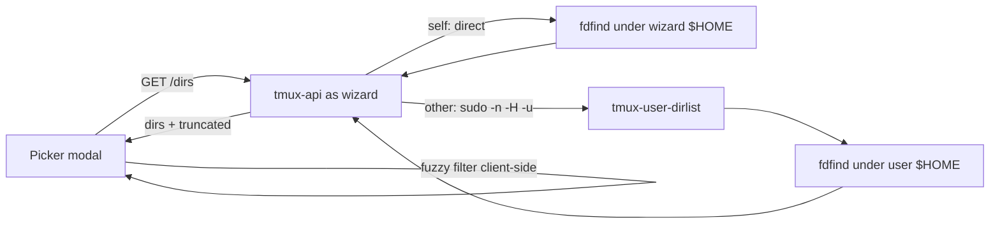
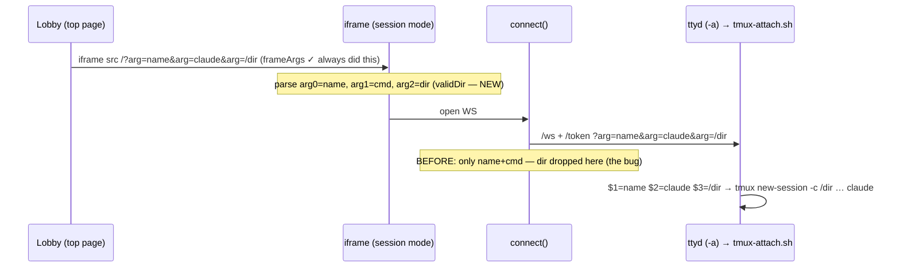

# Forbid duplicate session names + per-project launch directory

**Status:** Shipped 2026-07-15; **follow-up fix 2026-07-16** — the dir never
actually reached tmux, and the command was silently dropped (see "Follow-up fix"
below) · **Repo:** terminal-lobby · **Owner:** Viktor (wizard)

Two changes, delivered together because both touch the create path.

1. **Bug:** creating a session whose name already exists silently *reattached*
   to it (ttyd's `tmux new-session -A`). It now refuses.
2. **Feature:** a project can carry a base **directory**; sessions launched
   inside it start there (t3-code-style per-project cwd), chosen via a fuzzy
   picker over the user's home.

## Decisions (from the grilling session)

| Decision | Choice | Why |
|---|---|---|
| Dup-name enforcement | **Frontend guard** | Minimal, mirrors the existing duplicate-*project*-name check; the server's `-A` stays the backstop. |
| On collision | **Reject + keep typed text** | Matches "don't allow"; lets the user tweak the name. |
| Dir selection | **Fuzzy search under `$HOME`** (one-shot list → client filter) + typed-path fallback | Nicer than a raw path field; the chosen dir always exists. |
| Picker reach | **All 3 users** | wizard runs the scan directly; emo/ancamilea via an audited sudo wrapper. |
| Dir field | **Optional**, editable later | Back-compat: existing dir-less projects keep working (sessions → `$HOME`). |

## Constraint (surfaced and accepted)

A tmux session's cwd is fixed at `tmux new-session -c` — it can only be set at
creation. So: sessions **created** in a project (and project sessions that get
**resurrected** on attach) land in the dir; sessions **moved into** a project
later keep their cwd; top-level sessions use `$HOME`; a dir change only affects
sessions created afterwards.

## Design — how the dir reaches `tmux new-session -c`

The frontend already controls two positional `?arg=` values forwarded by ttyd's
`-a` (name, command). The dir is threaded as a **stable arg3**: whenever a dir
is present the command is pinned to arg2 (as `default` when none — the attach
scripts treat that as "no command"), so the dir is always `$3`.

```mermaid
sequenceDiagram
    participant U as User
    participant L as Lobby (index.html)
    participant T as ttyd (-a)
    participant A as tmux-attach.sh (as wizard)
    participant W as tmux-user-attach (as OS user)
    U->>L: Create session in project "tripit" (dir=/home/wizard/code/tripit)
    L->>L: dup-name guard (reject if name is a live session)
    L->>L: frameArgs → /?arg=name&arg=cmd&arg=/home/wizard/code/tripit
    L->>T: iframe src (arg1,arg2,arg3)
    T->>A: $1=name $2=cmd $3=dir
    A->>A: dir absolute? → start_dir=$3 (else home)
    A->>W: tmux-user-attach name start_dir cmd
    W->>W: [[ -d start_dir ]] || start_dir=$HOME
    W->>W: tmux new-session -A -s name -c start_dir …
    Note over W: -c applies only when tmux CREATES (new/resurrect); ignored on reattach
```

The picker's candidate list comes from a new `GET /dirs`, scanned by an audited,
argument-free wrapper:



## What shipped

- **tmux-api (Go):** `Project.Dir` (optional, absolute-path validated; persists
  via the existing `PUT /layout`); `GET /dirs` → `{dirs, truncated}` (self =
  direct `fdfind`, others = `sudo -n -H -u <user> tmux-user-dirlist`). Test-first.
- **devvm:** `tmux-user-dirlist` — audited, argument-free wrapper (`fd --type d
  --no-ignore-vcs`, depth+count-capped, noise-pruned). `--no-ignore-vcs` is
  load-bearing: `~/code`'s allowlist `.gitignore` would otherwise hide every
  nested project repo. `tmux-attach.sh` accepts arg3=dir (absolute-only,
  re-checked as the user, `$HOME` fallback). sudoers grants the wrapper for
  emo + ancamilea (also closes ancamilea's previously-missing base grant).
- **lobby (index.html):** dup-name guard on both create paths; a create/set-
  directory modal with the fuzzy picker + typed-path fallback; "Set directory…"
  on the project ⋯ menu; `frameArgs` dir threading.

## Verification

- Backend unit tests (Dir round-trip/validation; `/dirs` happy/truncate/error/auth). `go build`/`vet`/`test` green.
- `tmux-attach.sh` arg-forwarding tested with a stubbed `tmux-user-attach`.
- Live on the devvm: `GET /dirs` = 1251 dirs for wizard, **200 + 265 dirs for emo via sudo**.
- Browser (dev-harness, no Authentik): lobby renders; modal + fuzzy filter rank
  `~/code/tripit` top; dir selection updates state; **dup-guard rejects `fable`
  without navigating**; console clean. The `.gitignore` blind-spot was caught
  here and fixed (`--no-ignore-vcs`).

## Follow-up fix (2026-07-16)

The 2026-07-15 "verified live" was **incomplete**: it exercised the picker, the
modal, the dup-guard and `GET /dirs`, but never confirmed a *created* session's
actual `pwd` or command. Two bugs hid in exactly that gap — a `+`-in-project
session opened in `$HOME` running a plain shell, honoring neither the project
dir nor the shown command.

**① The dir never reached tmux.** `frameArgs` correctly emitted arg3=dir into
the iframe URL — but that URL just reloads `index.html` in *session mode*, and
the code that opens the connection, `connect()`, rebuilt the `/ws` + `/token`
URL from only arg0 (name) + arg1 (command). Arg2 (the dir) was parsed nowhere
and forwarded nowhere, so it died at the iframe boundary. The sequence diagram
above elided the session-mode page, which is precisely why the gap was missed.
Fix: session mode now parses arg3 (`validDir`, absolute-only, mirrors
`tmux-attach.sh`), and `connect()` forwards it — pinning the command to arg2
(`'default'` if none) so the dir always lands on `$3`.

**② The command was silently dropped — for wizard specifically.** wizard's
stored `newCommand` pref was the legacy `'default'`, which `syncNewCmd` *displays*
as `claude` but which `frameArgs` sends as "no command". `'default'` means "use
the tmux `default-command`" — correct for LAUNCHER users: emo and ancamilea both
have `~/start-claude.sh`, emo wires it via `set -g default-command`, and emo's
pref is deliberately pinned to `'default'` to keep it. wizard has *no* launcher,
so his `'default'` resolved to a plain login shell — the "plain bash" he saw. The
fix is a **per-user data correction**, not a code change: wizard's pref was set
to `'claude'` server-side (`frameArgs` then sends it, mapped to his personalized
`claude` via `~/.config/terminal-lobby/commands`).

> **Course-correction (same day):** a first attempt normalized `'default'` →
> `'claude'` in code with a pref self-heal, on the wrong belief — from a check
> silently blocked by `/home/emo` permissions — that no launcher users remained.
> It was briefly deployed, then reverted before emo loaded it: the heal would
> have clobbered emo's pinned `'default'` and bypassed the launcher. `'default'`
> stays a valid, honored value; only the individual stale pref was corrected.
> Bonus from bug ①: a launcher session created in a project now also lands in
> the project dir.

Delivered alongside (unrelated UI, same file): on the already-selected session a
single click on its **name** opens inline rename (desktop only; mobile keeps
tap-to-terminal + long-press); the card **session name** is larger/bolder and the
not-very-helpful live-command chip (`bash`/`node`/…) is removed.



**Verified end-to-end this time.** Dev-harness (Playwright network capture):
`/token` + `/ws` carry the command and the project dir at arg3 (was dropped);
inline rename opens only on the active card's name; non-active clicks still
attach. Real attach through the **deployed** scripts, both command paths:
`cmd='shell'` → `pane_current_path=/home/wizard/code/tripit`,
`start_cmd=/bin/zsh -l`; `cmd='default'` → same dir, `start_cmd=[]` (empty → the
user's `default-command`/launcher runs). Contrast the pre-fix
`dir='/home/wizard' cmd='<none>'`.

## Security notes

- The wrapper is whitelisted under sudo, **not** `fd` itself — `fd --exec` would
  be a code-exec vector as another user; the wrapper takes no input.
- The client-supplied dir grants no new capability: it runs as the user's own
  account and only sets a cwd they can already reach (else falls back to `$HOME`).

## Deploy

Manual `./scripts/deploy.sh` (no CI auto-deploy for this repo). Restarts
ttyd/tmux-api — sessions survive via the systemd-scope design; only WebSockets
briefly reconnect.
