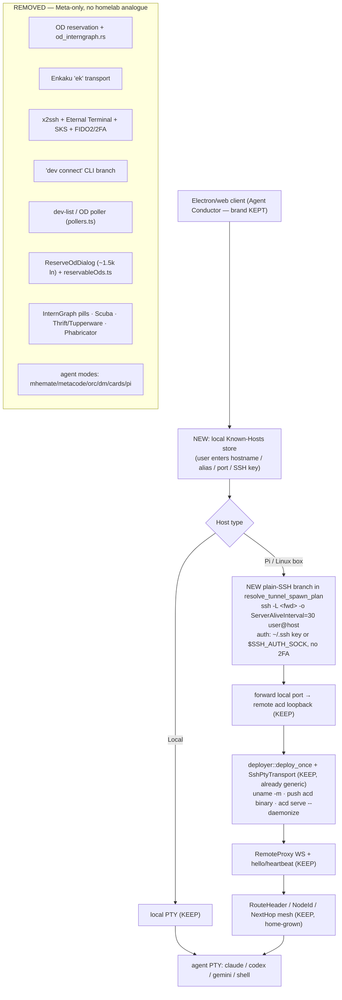

# Agent Conductor — de-Meta + generic remote-hosts — design record

**Purge every Meta/fb-specific reference from the fork, and genericize remote-hosts so a Pi / any Linux box can be added over plain SSH — as a private, self-hosted fork.**

- **Status:** Approved — grilled 2026-07-16 (`/grill-with-docs`), executing next.
- **Owner:** Viktor (wizard). **Fork:** `~/code/agent-conductor` (local-only, no remote).
- **Follows:** the [web-port design](https://plans.viktorbarzin.me/2026-07-15-agent-conductor-web-port-design.html) (M0–C4, LIVE at `ac.viktorbarzin.me`). This is the de-Meta / genericize phase on top of that working, verified app.
- **Prime constraint:** the deployed app must keep working — every change is re-verified (build + M1 browser demo + M2 isolation red-team + deployed check), and `ac.viktorbarzin.me` stays admin-gated until it re-verifies.

## Goal & the enumeration

A 4-sweep enumeration workflow mapped the Meta surface across **5,248 files**: `(c) Meta` headers on **~52%**; ~161 files referencing `fbsource//`/`fbcode//`; a ~43k-line Meta-only remote-host stack; live-but-inert corp services (InternGraph, Eden, Scuba, Thrift/Tupperware); Meta packaging identity + 6 dead agent modes; and ~2,700 Meta hostname literals in fixtures. Keep the **"Agent Conductor"** brand and the **remote-host capability**; purge the rest.

## Decisions (grilled 2026-07-16)

| # | Decision | Choice |
|---|---|---|
| 1 | **Remote-host architecture** | **Plain-SSH, drop reservation.** Delete OD/Enkaku/x2ssh/SKS/FIDO2 entirely; add one plain-SSH transport branch (`ssh -L`, `~/.ssh` key/agent, no 2FA) + a new local **known-hosts** store. Keep the generic downstream verbatim. **Linux/macOS clients** for v1 (Windows is x2ssh-only today → deferred). |
| 2 | **License / OSS** | **Private, all-rights-reserved.** Fork stays local-only; strip `(c) Meta` → `Copyright 2026 Viktor Barzin — all rights reserved` header + LICENSE. Open-sourcing is a separate future call. |
| 3 | **Meta runtime services** | **Delete corp-only** (InternGraph diff-pills/Agent-Home coupling, Scuba, Thrift/Tupperware PTY identity-forwarding, Phabricator/fetchImage); **replace Eden/Sapling with plain-git** (default; `notify` crate already a dep). Keep the core acd-sourced agent/session list. |
| 4 | **Agent modes** | Drop the 6 dead Meta-only modes (`mhemate/metacode/orc/dm/cards/pi`); keep `claude/codex/gemini/shell`. |
| 5 | **`fbclone`/`enlistment` rename** | **Defer** — XL, breaks wire-compat, zero functional gain (pure de-jargoning). |
| 6 | **`./ac` CLI** | **Drop** the broken `fbpython`+`buck2` entrypoint; document raw commands (`deploy.sh` + `cargo` + `vite` already cover build/deploy). |
| 7 | **Mobile / Android** | **Drop native** (`acd-embedded` + `ac-mobile-gateway`); the responsive web SPA covers phone. |
| 8 | **Packaging identity** | Re-own the **visible/functional** bits (package.json author, plugin.json email/homepage, in-UI `fb.workplace` links → GitHub/removed); **defer** the desktop/mobile bundle-ID (`com.meta.*`) rename (web-first, not shipping installers). Keep "Agent Conductor". |
| 9 | **Docs / skill-trees** | Pragmatic pass: scripted fixture rename (`devvm*/facebook.com` → `example.com`), delete CFM wiki-publish + dead Meta-hardware RFCs, fix `build.md`, collapse `.metacode/.llms/.claude` → `.claude`; **defer** deep RFC rewrites; annotate (not strip) T/D-numbers cited as incident history. |
| 10 | **CI** | Stand up minimal GitHub Actions (cargo build/test/clippy + npm/vite); delete the dead Meta Skycastle `ci/BUCK`. |

## The generic-remote-host design (the load-bearing part)

Everything **downstream of the tunnel is already generic** and is kept verbatim: `deployer` + the `DeployTransport` trait (which already has a generic `SshPtyTransport` impl alongside the Meta `EkTransport`), `RemoteProxy`'s `ws://localhost:<port>` handshake, the home-grown `RouteHeader`/`NodeId` mesh addressing, the reconnect ladder. (Note: "FlatBuffers/FB" wire = Google OSS, **not** Facebook — untouched.) The Meta-specific part is **only how the tunnel opens**.

**Genericization specifics:** the `$SSH_AUTH_SOCK` fallback already half-exists (`unix_sks_agent_socket`); add a no-2FA "key/agent" `HostsConnectAuth` variant; fix `vscode-url.ts` (it appends `.facebook.com` → breaks `pi.lan`) to OSS `vscode://vscode-remote/ssh-remote+<host>`; generalize `canonical_host_key`'s 3 hardcoded Meta suffixes. **Biggest new piece:** there is **no** "add a host by hostname" entry point today (every host comes from Meta's `dev list`) — a locally-persisted known-hosts store + add-host UI is genuinely new (effort M).

## Execution buckets (effort-ordered)

| Bucket | Effort | Action |
|---|---|---|
| **[CORE] Generic-SSH transport + auth** | L | New plain-SSH branch, no-2FA auth, `vscode-url` fix, suffix generalization. The headline. |
| **[NEW] Known-hosts store + add-host UI** | M | Local host list + renderer entry point (the only strictly-new feature). |
| Delete Meta reservation stack + OD UI | L | `od_interngraph.rs`, `reserve_direct_od` chain, Enkaku, x2ssh/SKS/FIDO2, `ReserveOdDialog`, `reservableOds.ts`. |
| Cut corp-only services | L | InternGraph, Scuba, Thrift/Tupperware, Phabricator/fetchImage. |
| Eden/Sapling → plain-git default | M | git + `notify` file-watch as default; drop Eden. |
| Drop 6 Meta agent modes | M | `KNOWN_AGENT_MODES` + spawn arms + pickers + glyphs. |
| Legal headers + LICENSE | S | Scripted `(c) Meta` strip → proprietary header; add LICENSE. |
| Packaging identity + UI links | S | author/email/homepage/fb.workplace (defer bundle-IDs). |
| Drop `./ac` + dead BUCK + stand up CI | L | Delete ~4.5k Starlark lines + Skycastle; add GHA. |
| Docs / skill-trees / fixtures | L | Scripted fixture rename (S) + human keep/archive/delete on docs. |
| Delete `isl-egui-proto` | S | Self-archived, Meta-only deps, nothing depends on it. |

## Verification (the app must keep working)

After each risky bucket and before redeploy: `cargo build -p acd -p acmux -p ac-gateway` green + `vite build` green; re-run the **M1** browser demo (SPA → session); re-run the **M2** isolation red-team on the live units (working session + no cross-user shell); confirm `ac.viktorbarzin.me` still 200/302. `ac.viktorbarzin.me` stays admin-gated (wizard-only) throughout. The generic-SSH remote-host path gets its own new verification: add a real second Linux host (or a container standing in for a Pi) and prove a session opens on it over plain SSH.
