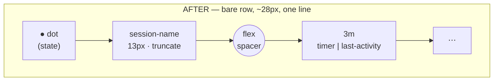
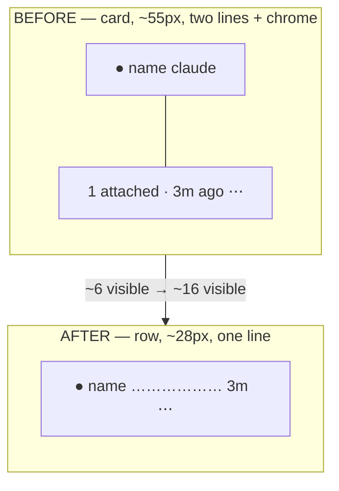

# Thin session rows — sidebar density redesign

**Repo:** terminal-lobby &middot; **File touched:** `frontend/index.html`
**Date:** 2026-07-16 &middot; **Status:** Done — deployed (build `3069802`)
**Owner:** Viktor (wizard)
**Re-verified against HEAD `bfa210e` (2026-07-16):** the checkout advanced past the
plan's baseline (`a16a960`); commit `0422eb6` ("card polish") already deleted the
on-row `.cmd-chip`, enlarged `.session-name` to 15px/700, and added a desktop
single-click-to-rename on the active card. Line numbers below are current; no
decision changed.

## Problem

The sidebar session list renders each session as a two-line, bordered,
drop-shadowed **card** (~55px tall — `renderCard`, `frontend/index.html:5839`).
At 5–6 sessions the viewport is full, so the list does not scale to many
concurrent threads. T3 Code's thread list solves the same problem with **bare
single-line rows** (`h-7` / ~28px — `Sidebar.tsx:684`, `resolveThreadRowClassName`).
Adopt that density.

## Goal

Replace the card with a bare, single-line row (~28px desktop, ~44px on touch),
keeping the signals that matter, so **~16 sessions fit where ~6 do today**.

## Decisions (from the grilling session)

| # | Decision | Choice | Why |
|---|----------|--------|-----|
| 1 | Row shape | **Bare rows** — no per-row border / shadow / big radius. Active = subtle bg tint + 3px left accent; hover = bg tint | The card chrome *is* the height; T3 rows carry none |
| 2 | Height / touch | ~28px desktop; **~44px min-height floor on touch** via the existing `isCoarsePointer` path | A mouse is precise; a fingertip needs ≥44px (Apple HIG) |
| 3 | Right edge | **Always a time** — running → live self-ticking elapsed timer in state colour; otherwise → relative last-activity | Preserves the "working for Xs" signal, compressed. Retires `showIdleMeta` (now always-on) |
| 4 | Live-command chip | **Move to hover / long-press tooltip** — the on-row chip was already deleted in `0422eb6`, so only the tooltip is left to add | It read "claude" on nearly every row — noise on-row, and it stole width from the name |
| 5 | Actions (⋯) | **Always visible**, right of the time | Discoverability over minimalism |
| 6 | Vertical rhythm | **Tight stack** — row gap `6px → 2px`, group headers compressed to ~22px | Removing the inter-row gap is the last density lever; ~16 rows visible |

## Row anatomy

```
[●]  session-name ……………………………………  3m   ⋯
 │    │                                     │    └ always-visible actions menu (Move / Rename / Kill)
 │    │                                     └ time: live elapsed timer (running, state colour) | last-activity
 │    └ 13px, medium weight, truncate; active row = 600
 └ state dot in a fixed-width slot (names align even when a session has no Claude state):
   running = pulse · awaiting = glow · done-unseen = ring, then dims

hover / long-press → title tooltip:
   "running: <pane_current_command> — <pane_title> · N attached · active 3m ago"
```





## Implementation — `frontend/index.html` only

**CSS**

- `.session-card`: flatten to a one-line flex row — drop `border`, `box-shadow`,
  and the `border-left` bar (the accent survives as an **active-only** left
  border), shrink the radius, padding ~3–4px × 8px, `min-height: 28px`; under
  `@media (pointer: coarse)` (or the JS `isCoarsePointer` class) `min-height: 44px`.
- `.session-meta`: no longer a column — name + right slot share one line.
- `.session-name`: **15px/700 today → 13px, weight 500** (active 600); drop the
  added `letter-spacing`. Truncate mechanics unchanged.
- The `.cmd-chip` rule + its `renderCard` builder were **already deleted** in
  `0422eb6` — nothing to remove. Replace `.session-detail` + `.working-note` with a
  compact right-aligned `.row-time` (+ a running state-colour variant). Keep the
  `.working-timer` self-tick (the 1 Hz `setInterval` at `:4712`).
- `.session-list` / `.project-group` gap `6px → 2px`; `.project-header` tightened to ~22px.
- `.session-skeleton` height `55px → 28px`.
- `.state-dot` unchanged (pulse / glow / unseen semantics kept).

**JS — `renderCard` (`:5835`)**

- Build one row: `[dot][name] …flex spacer… [time][⋯]`.
- Right slot: `s.state === 'running'` → live timer (reuse `stateChangedAt` +
  `formatWorking` + a `.working-timer` span); otherwise `relativeTime(s.lastActivity)`.
- Move `pane_current_command`, `pane_title`, and the attached count into the row's
  `title` tooltip. Both fields still arrive on the `/sessions` poll (`tmux-api/main.go:84-85`);
  attached is usually redundant — the attached session is the active row you're viewing.
- **Keep the class name `.session-card`** so every existing call-site stays valid:
  drag/drop membership + reorder (`:4576`, `:4621`), active-card lookup (`:5381`),
  keyboard-nav enumeration (`:7428`, `:7549`), and the kb-badge anchor (`:1100`).
- Keep dblclick-rename, long-press + right-click menu, activate-on-click/Enter, **and
  the desktop single-click-to-rename on the _active_ card's name** added in `0422eb6`
  (`:5895`-ish, gated on `s.name === currentActive && !isCoarsePointer &&
  e.target.closest('.session-name')`) — the click-handler rewrite must carry it over.

**Prefs cleanup**

- Remove the `showIdleMeta` settings toggle (`:6583`, `:6924`) and its read (`:5858`,
  live-apply at `:6520`); neutralise/drop the pref key (`:2578`, `:2656`). The time is
  now always shown.

## Stays working

Drag-to-reorder & drag-to-project · kb-badge keyboard overlay · dblclick inline
rename · **desktop single-click-to-rename on the active card's name** (new in
`0422eb6`) · long-press / right-click menu · active-row + scroll preservation across
polls and session switches · loading skeletons · all four themes (slate / carbon /
mono / ink).

## Verification

Drive the dev harness (`scripts/devserve` / `scripts/dev-harness.py`) with ~15 mock
sessions across states (running / awaiting / done / idle, some attached, some
non-claude commands, some grouped). Screenshot desktop **and** a narrow / touch
width. Confirm: ~15+ rows visible; the running timer ticks in state colour; hover
tooltip shows the command; ⋯ opens the menu; drag still reorders and moves between
projects; long names truncate; dot slot keeps names aligned for stateless sessions;
all four themes read well. Compare against `docs/screenshots/`.

## Rollout — done (2026-07-16)

Worktree → implement → verify (headless browser, 15 mock sessions across all
states) → merge to master (`3069802`).

**This repo has no CI** (`deploy.sh`: *"kept as a stand-alone script so it works
without CI (which is currently TODO)"*) — there is no GitHub Actions workflow and
Woodpecker 404s for it, so the push does not auto-deploy. Went live via a manual
`scripts/deploy.sh` run on the DevVM (`10.0.10.10`) after claiming presence
(`service:terminal-lobby`): it rebuilds the Go binaries, stamps the frontend, scps
to the box and restarts `ttyd`/`tmux-api`/`clipboard-upload`. The lobby is designed
to keep active terminals connected across a deploy, so no session was dropped.

Verified live: `/usr/local/share/ttyd/index.html` serves build `3069802` with the
new markers (`.row-time`, `min-height: 28px`, `rowTooltip()`) and none of the old
ones (`session-meta` / `working-note` / `showIdleMeta` / `cmd-chip`).

Follow-up worth noting (not this task): CI/CD for terminal-lobby is still TODO —
every change ships by a manual `scripts/deploy.sh`.
