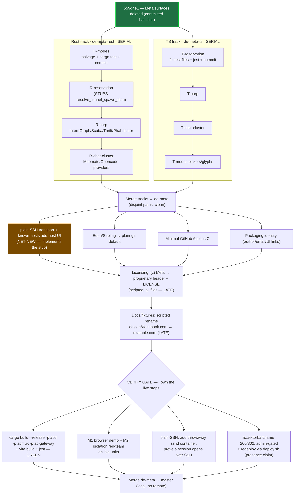

# Agent Conductor — de-Meta execution / resume plan

**Status:** approved, executing · **Date:** 2026-07-17 · **Owner:** Viktor (wizard)
**Fork:** `~/code/agent-conductor` (local-only, no remote)
**Design of record:** [2026-07-16-agent-conductor-de-meta-design.md](2026-07-16-agent-conductor-de-meta-design.md) — the 10 de-Meta decisions are **settled**; this doc resumes **execution** after the prior session died.

## Why this doc exists

The de-Meta work was being executed by a long-running session (`terminal-lobby/68c8d15a`)
that **died 2026-07-16 21:20, mid-surgery** — cut off right after dispatching its two
parallel surgery agents. This plan reconstructs exactly where it stopped and drives the
**full** de-Meta plan to completion. The design is not being re-opened; only the execution
strategy was (re-)grilled on 2026-07-17.

## Where the dead session stopped

| Work | Branch / worktree | State |
|---|---|---|
| Delete Meta **surfaces** (`./ac` buck2 CLI, `acd-embedded`, `ac-mobile-gateway`, `isl-egui-proto`, dead CI) | `de-meta` @ `559d4e1` | ✅ **committed** |
| **Agent-modes** surgery (Rust) | `de-meta-rust` (uncommitted) | ⏳ R1 interrupted — **`cargo check` GREEN**, tests not run |
| **Reservation** surgery (TS) | `de-meta-ts` (uncommitted) | ⏳ T1 finished — **`vite build` GREEN**, but **32 `tsc` errors, all in `__tests__`** (dangling refs to removed OD surfaces) → `jest` red |
| Reservation-Rust, corp-services (Rust+TS), chat-cluster (Rust+TS), modes-pickers (TS) | — | ❌ mapped, never dispatched |
| Verify gate, Eden→git, plain-SSH transport, known-hosts UI, licensing, packaging, docs/fixtures, CI | — | ❌ not started |

The 5 surgical **delete-maps** the dead session authored (precise line numbers, keep-guards,
ordering, false-positive lists) survive on disk and are the ground-truth spec for every
surgery bucket. They are copied to this session's scratchpad and handed verbatim to the
executing agents.

## Decisions grilled this session (2026-07-17)

| # | Decision | Choice |
|---|---|---|
| A | **Finish line** | **Full de-Meta** — every bucket incl. the net-new plain-SSH feature, licensing, docs/fixtures, CI. |
| B | **Dead session's uncommitted work** | **Salvage with audit** — keep the compiling diffs, but audit each against its delete-map (no over/under-deletion), fix gaps (e.g. TS test files), run build+test, then commit. Not blind trust. |
| C | **Execution mechanism** | **Resumable Workflow** for the mechanical bulk (map-driven deletions + scripted genericization + CI). Git commit per bucket = the resumable checkpoint. **I own every live-infra step** (redeploy, red-team) at the gates — the workflow never mutates `ac.viktorbarzin.me`. |
| D | **plain-SSH verification target** | **Throwaway sshd container on the devvm** — zero-cost, isolated, exercises the exact new code path, torn down after. |

## Execution structure

Two hard constraints shape everything:

1. **Serial within a track.** `protocol.rs`, `server.rs`, `lib.rs`/`main.rs`, `wire_bridge`,
   the `ChatProvider` enum — all are edited by *multiple* surgery buckets. Buckets on the
   same language track therefore cannot run concurrently; they serialize on one worktree.
2. **Parallel across tracks.** The Rust track (`acd/**`, `*.rs`) and the TS track
   (`src/**`, `*.ts[x]`) touch **disjoint** file sets, so `de-meta-rust ‖ de-meta-ts` run
   in parallel and merge back conflict-free.

Plus two ordering rules: the reservation bucket **stubs** `resolve_tunnel_spawn_plan`
(`bail!("plain-ssh lands in Phase B")`) which the SSH-transport bucket later **implements**;
and the two broad, near-every-file passes — **licensing header strip** and **scripted
fixture/doc rename** — run **last**, after all structural code changes, so they don't churn
every other diff.

### Buckets → maps

| Bucket | Track | Delete-map / spec | Notes |
|---|---|---|---|
| R-modes | Rust | `modes-map.md` §1A–1D, 1G | already applied+compiling → audit, `cargo test`, commit |
| R-reservation | Rust | `reservation-rust-map.md` | stubs the tunnel resolver; Group A→B→Core→C order baked into the map |
| R-corp | Rust | `corp-map.md` (Rust) | InternGraph GraphQL, Scuba, Thrift/Tupperware, Phabricator |
| R-chat-cluster | Rust | `chat-cluster-map.md` | STRICT: hand-written enum only, **do not touch `schema.fbs`/generated**; `codex` stays wire-value 2 |
| T-reservation | TS | `reservation-ts-map.md` | production done; **fix/delete dangling `__tests__`** → jest green, commit |
| T-corp | TS | `corp-map.md` (TS) | diff-pills / Agent-Home coupling / telemetry renderer bits |
| T-chat-cluster | TS | `chat-cluster-map.md` (TS) | provider pickers |
| T-modes-pickers | TS | `modes-map.md` §1E–1F | renderer pickers/glyphs/labels for the 6 dropped modes |

### Workflow shape

`parallel([rustTrack, tsTrack])`, where each track is a **serial `await` chain** of
one agent per bucket (each `cd`s into its worktree, reads its map, applies it, runs the
track's build, commits). Each surgery agent is followed by an **adversarial audit agent**
briefed to *disprove* completeness — find anything over-deleted (a keep-guard symbol gone)
or under-deleted (a map target still present) — before the commit stands. After both tracks
are green + committed, a merge step folds them into `de-meta`; then the post-merge buckets
run serially on the unified branch, licensing + docs last. The gate is mine.

If the workflow dies, it resumes from the last bucket commit (`resumeFromRunId`, or simply
re-run from the maps + git state).

## Verification (the app must keep working)

Per the design's prime constraint. After the structural buckets and before landing:

- **Build/test:** `cargo build --release -p acd -p acmux -p ac-gateway` + `vite build -c vite.web.config.ts` + `jest` — all green.
- **M1:** browser demo — SPA loads, a local session opens.
- **M2:** isolation red-team on live units — a working `wizard` session **and** no cross-user shell.
- **plain-SSH (new):** spin a throwaway sshd container, add it via the new known-hosts UI, prove a session opens over `ssh -L` with key auth / no 2FA, tear it down.
- **Edge:** `ac.viktorbarzin.me` still `200` + `302` forward-auth, **admin-gated (wizard-only) throughout**.
- **Redeploy:** `scripts/deploy.sh` — a sudo local install on the devvm; run **by me under a `presence claim`**, never by the workflow.

## Landing

`agent-conductor` is a local-only fork, so landing = **merge `de-meta` → `master` locally**;
no push, no PR. Each bucket commit is a resumable checkpoint along the way.

## Risks / one flag

- **The net-new plain-SSH transport + known-hosts UI is the weakest fit for unattended
  generation** — it's feature design (new tunnel-resolver branch, a new local host store,
  renderer add-host flow), not map-driven deletion. Within the chosen fully-automated
  workflow, that bucket will **scaffold + unit-test** only; I hand-review its diff and
  personally drive the live second-host proof rather than trust it blind. Everything else
  (deletions, scripted licensing/fixtures, CI) is squarely in the workflow's wheelhouse.
- **Over-deletion** is the main surgery hazard → every surgery bucket is paired with an
  adversarial audit agent + the map's explicit keep-guard/false-positive lists.
- **Shared-file coupling** (`protocol.rs`, `wire_bridge`, `ChatProvider`) → enforced by
  serial-within-track; the maps call out the coordinated multi-site landings.
