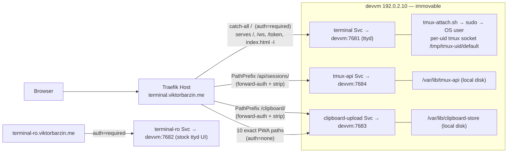

# terminal-lobby — Vite/Solid frontend deployment options

Decision doc. Forcing question: today the frontend is one hand-written file served
verbatim by `ttyd -I`; adopting Vite/Solid introduces a *build step* and (unless
constrained) a *tree of hashed chunks*, neither of which has a home in the current
topology. This doc decides **who BUILDs the bundle, who SERVEs the bytes, and how
it gets DEPLOYed** — three separable concerns — under the hard constraints below.

---

## 1. Current state

The K8s cluster is a **pure reverse-proxy + auth edge**; all compute runs on the
devvm (`192.0.2.10`). The four Services in `infra/stacks/terminal` are manual
Endpoints pointing at devvm ports — `terminal→7681` (ttyd, catch-all shell + `/ws`
+ `/token`), `terminal-ro→7682`, `clipboard-upload→7683`, `tmux-api→7684` — under
one Traefik Host `terminal.viktorbarzin.me`, path-routed and gated by the
`authentik-forward-auth` middleware (`infra .../terminal/main.tf:46-61,63-86,
180-229,355-404`). The frontend is a single ~800 KB self-contained `index.html`
(inline CSS + one `<script>` IIFE, **no build step today**) served by ttyd's `-I`
flag; the 10 PWA/font/`sw.js` static files are served separately by
`clipboard-upload` via a fixed compile-time exact-path whitelist
(`clipboard-upload/main.go:115-127`). There is **no CI** — deploy is manual
`scp`+systemd via `scripts/deploy.sh`, which also cross-builds the two Go binaries
and stamps `__TL_BUILD__`→git SHA into `index.html`.

---

## 2. The HARD constraint — ttyd/tmux/Go services stay on the devvm

**Non-negotiable, verified in both surveys.** The dynamic plane is *irreducibly*
a devvm service; only the static bytes are movable:

- **ttyd (`:7681`/`:7682`)** spawns per-WebSocket `tmux-attach.sh`, which `sudo`s
  into the mapped OS user and attaches that user's **local per-uid tmux socket**
  `/tmp/tmux-<uid>/default` (`devvm/tmux-attach.sh:124-131`). The tmux servers are
  kernel-isolated per OS user under each user's systemd manager — they cannot run
  in a shared pod.
- **`/ws` + `/token` ride the `/` catch-all** to that same ttyd endpoint — there
  are no separate IngressRoutes for them (`main.tf:63-86`). They stay pinned to
  devvm ttyd.
- **tmux-api (`:7684`)** shells `tmux` as the mapped OS user via `sudo` and stores
  layout/projects/shares on **local disk** `/var/lib/tmux-api`.
- **clipboard-upload (`:7683`)** reads/writes the per-session image store on
  **local disk** `/var/lib/clipboard-store/<user>/<session>`, plus a localhost
  `show-image`/`register` path.
- **OS-level state**: `/etc/ttyd-user-map`, `/etc/sudoers.d/ttyd-users`,
  `/etc/tmux.conf`, and the VAPID web-push env file.

None of this can move to the cluster — it depends on `sudo` into local OS accounts
and node-local unix sockets/disk. **The cluster stays a proxy/auth edge for the
dynamic plane no matter which option is chosen.**

### Two constraints every SERVE option must satisfy

- **Same-origin (hard, 3 independent reasons).** (a) `/sw.js` controls the whole
  origin and intercepts `/api/sessions/*` — a service worker is only served *and*
  scoped same-origin. (b) The lobby↔session-iframe `postMessage` bus rejects any
  message with `e.origin !== location.origin`, and the iframe **is** the ttyd
  session. (c) PWA scope + WebSocket same-origin. The frontend uses **zero absolute
  host URLs** — all paths relative. **Key nuance: this forces same-HOST
  (`terminal.viktorbarzin.me`), not same-process.** Because the cluster is already
  a single-Host path-routed edge, a cluster pod on that host satisfies same-origin
  *just as well as ttyd*. **Same-origin is therefore NOT the discriminator between
  serving on ttyd vs. in-cluster.**
- **Forward-auth carve-out.** The catch-all `/` (shell, `/token`, `/ws`),
  `/api/sessions/*`, and `/clipboard/*` are `auth=required`; the **10 PWA/font/
  `sw.js` paths must bypass auth** (`auth=none`, `main.tf:248-274`) because OS icon
  fetchers and SW update fetches carry **no session cookie** and would otherwise
  get Authentik's 302. Traefik's longer-exact-path priority is what keeps *only*
  those 10 ungated; a regression is guarded by the `terminal-pwa-assets` walloff
  probe. Any option must preserve **both** states and the exact-path ordering.

---

## 3. Ranked options, by concern

### BUILD — who compiles the Vite/Solid bundle

| Rank | Option | Reuses | Same-origin / auth | Tradeoffs |
|---|---|---|---|---|
| **B1** | **Local `vite build` in `deploy.sh`** | The existing local Go cross-build flow in the same script | N/A (build only) | Simplest; keeps one deploy path. **Not** forbidden by ADR-0002 — that ADR bans *in-cluster* build compute, not a developer building on the workstation before `scp` (exactly what deploy.sh already does for the Go binaries). Must re-implement the `__TL_BUILD__`→SHA stamp as a Vite define. |
| B2 | **GitHub Actions (join ADR-0002 off-infra fleet)** via `scripts/offinfra-onboard` | GHA external CI + offinfra scaffolding + ghcr | N/A | The **only sanctioned in-*fleet* build capability**; free. Required *only if* SERVE needs a ghcr image (S3). Costs one-time onboarding: create the GitHub mirror this repo lacks, commit the workflow on the Forgejo side (mirror is one-way), add secrets. Moves build off the workstation. |
| ✗ | Woodpecker / Forgejo Actions | — | — | **Rejected.** ADR-0002 removed in-cluster buildkit (clean cut); terminal-lobby's Woodpecker activation returns HTTP 500; Forgejo Actions is not running. Listed so the plan doesn't revisit it. |

### SERVE — who serves the static bytes

| Rank | Option | Reuses | Same-origin / auth | Tradeoffs |
|---|---|---|---|---|
| **S1** | **Single-file inlined `index.html` on `ttyd -I`** (e.g. `vite-plugin-singlefile`) | ttyd `-I` + clipboard-upload whitelist, **unchanged**; deploy.sh scp+systemd | **Both ✓ by construction** — topology unchanged, single endpoint under the one Host | **Minimal blast radius.** Zero new infra, zero new Traefik routes, no carve-out re-impl, no walloff-probe re-point. Cost: forfeits per-chunk caching and inlining defeats lazy chunks (mitigated by existing edge gzip/br/zstd + ETag/no-cache). A Solid+Vite single file is likely *smaller* than today's hand-written ~800 KB. |
| S2 | **Caddy + git-sync static pod** (reuse the learn/plans pattern) | The `learn` viewer pod (stock Caddy + git-sync already serving `plans.viktorbarzin.me`) + `ingress_factory` + Authentik + LAN pull-through cache; **no image build** | **same-origin ✓** (same Traefik Host, path-routed). **auth ✓ only if** carve-out reproduced via `ingress_factory` (`auth=none` PWA paths, `auth=required` `/`+`/assets/`), exact-path priority preserved, walloff probe re-pointed | Highest cluster reuse; matches the pattern Viktor **explicitly blessed** for "devvm shouldn't host prod services". Built assets must reach a git ref (push a `dist` branch — the *same* "built output in git" model plans/ already uses, so de-risked). Needs a Vault-backed git-sync deploy key. **Wrinkle:** if Vite emits a hashed `sw.js` or workbox runtime chunks, the fixed clipboard whitelist can't serve them → PWA assets likely move onto the pod too. |
| S3 | **nginx/caddy baked image + Keel rollout** (blog pattern) | The blog static-serve pattern + Keel (terminal ns **already** `keel.sh/enrolled=true`) + ghcr + `ingress_factory` | Same as S2 | Same carve-out work as S2, **plus** forces an image BUILD (⇒ B2) and a new Deployment where none exists. Keel `:latest`-digest needs the per-workload force+matchTag override (Kyverno default is semver-only). Cleanest "join the fleet" story *if* an image is wanted anyway; otherwise strictly more moving parts than S2. |
| ✗ | configmap serving | — | — | **Rejected.** ~1 MiB cap; churns on every hashed rebuild. Fits the Caddyfile only, not JS/CSS/font bundles. |

### DEPLOY — how bytes/manifests reach their target

| Rank | Option | Reuses | Notes |
|---|---|---|---|
| **D1** | **scp + systemd (current)** | `scripts/deploy.sh` | Pairs with **S1**. Already stamps build-id, installs `index.html`, restarts units, smoke-tests. Zero new mechanism. |
| D2 | **git push → git-sync (~30-60 s)** | learn-pattern git-sync sidecar | Pairs with **S2**. Frontend deploy = a push; no scp for the static bytes (Go/ttyd changes still scp separately). |
| D3 | **Keel digest rollout** | Keel (already enrolled) | Pairs with **S3**. Sidesteps the blocked Woodpecker path entirely. |
| D4 | Woodpecker `set-image` (fleet deploy) | Woodpecker deploy-only pipeline | Fleet standard, **but** terminal-lobby's Woodpecker activation returned HTTP 500 (on the Forgejo forge); the GitHub-mirror registration *may* avoid it but is **UNVERIFIED**. Keel (D3) reaches the same rollout with no Woodpecker dependency — prefer D3. |
| — | **infra GitOps auto-apply** (orthogonal) | `.woodpecker/default.yml` terragrunt-applies changed stacks on push to infra master | Covers **only the K8s manifests** (any new Deployment/Service/IngressRoute for S2/S3). Content still deploys via D2/D3. Already the mechanism shipping the current terminal stack — zero new setup. |

---

## 4. Recommendation

**Primary combination: B1 + S1 + D1** — build a **single inlined `index.html`**
with a local `vite build` (single-file plugin) added to `deploy.sh` alongside the
existing Go cross-build, keep **ttyd `-I`** serving it, deploy via the existing
**scp+systemd**. No K8s manifest changes, so no infra GitOps needed either.

Why this over the cluster options, given Viktor's "don't serve prod off the devvm"
preference (which genuinely pulls the other way):

- That preference was recorded for the `learn`/`plans` pod — a *pure* static site
  with **no** devvm dependency. terminal-lobby is categorically different: its core
  (`/ws`, `/token`, ttyd, tmux, tmux-api, clipboard-upload) is **irreducibly** a
  devvm service. Moving only `index.html` to the cluster does **not** get
  terminal-lobby off the devvm — it just splits ~800 KB of static bytes off the
  serving path while every dynamic request still lands on `192.0.2.10`. The
  preference doesn't cleanly transfer here.
- The entire same-origin web **and** the security-sensitive auth carve-out (shell
  gated / 10 PWA paths ungated / exact-path priority) are **already correctly wired
  and probe-guarded**. S1 preserves them by construction; S2/S3 require
  re-implementing them in a new place and re-pointing the walloff probe — pure risk
  (get it wrong and either the shell is exposed unauthenticated, or PWA icons 302
  and the install breaks) whose only reward is code-splitting.
- Same-origin does **not** force ttyd serving — only same-*host*. So this is not a
  correctness call; it's a blast-radius/risk call, and S1 wins it decisively for a
  frontend that is fundamentally a lobby shell + iframe host.

**Documented upgrade path (single, clear trigger): B2 + S2 + D2** — if/when the
Solid app grows enough that **real code-splitting / lazy-loaded views** matter
(single-file inlining actively defeats that), move to the **Caddy + git-sync learn
pattern** with a **GitHub Actions** build pushing a `dist` ref, and add the
manifests via infra GitOps. At that point re-implement the carve-out with
`ingress_factory` (proven by `ingress_assets`), fold the PWA/`sw.js` paths onto the
pod, and re-point the walloff probe. Prefer **S2 over S3** unless a ghcr image is
independently wanted — S2 needs no image build and is the pattern already blessed.
**Do not adopt Vite-single-file if the whole point of Solid/Vite is a large
multi-view app** — that would be a false economy; jump straight to the upgrade path.

**Open question for Viktor (drives primary vs. upgrade):** is the frontend expected
to stay a modest shell (→ S1), or grow into a multi-view app needing lazy chunks
(→ S2)?

> **Doc-vs-reality flag (per planning.md §2):** `README.md:244-264` ("CI status —
> TODO") claims `.woodpecker.yml` is "ready" and only blocked on Forgejo activation.
> That is **stale** — the file was removed and the builder decommissioned under
> ADR-0002 (`terminal/main.tf:300-306`). Authoritative state: *no CI; any revival
> adopts ADR-0002's GHA→ghcr pattern* (which is image/rollout-shaped and needs
> adaptation for a non-image static artifact). Fix the README when this work lands.

---

## 5. What stays on the devvm — no matter which option

- **ttyd** (`:7681`) and **ttyd-ro** (`:7682`), and their per-WebSocket
  `tmux-attach.sh` that `sudo`s into OS users.
- **`/ws` and `/token`** (ride the ttyd catch-all — no separate routes).
- The **per-uid tmux servers + sockets** `/tmp/tmux-<uid>/default` (kernel-isolated
  per OS user under each user's systemd manager).
- **tmux-api** (`:7684`) + its local state `/var/lib/tmux-api`.
- **clipboard-upload** (`:7683`) + the local image store
  `/var/lib/clipboard-store/…` + the localhost `show-image`/`register` path.
- **OS state**: `/etc/ttyd-user-map`, `/etc/sudoers.d/ttyd-users`,
  `/etc/tmux.conf`, the VAPID web-push env file.
- The **read-only mirror** (`terminal-ro.viktorbarzin.me`) — serves ttyd's *stock*
  built-in UI (no `-I`, no `index.html`), so a frontend build change never touches
  it.

Only ever movable to the cluster: **`index.html` + the 10 PWA/font/`sw.js` files**
— the sole pure-static bytes, and only if same-origin (same host) + the auth
carve-out are preserved.
