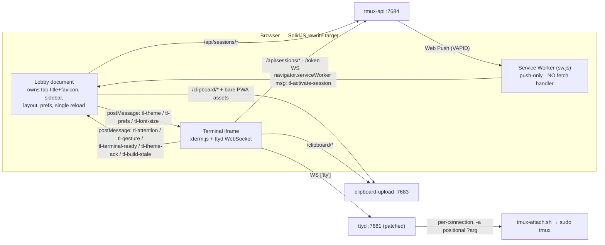

# terminal-lobby — Feature Parity Inventory (SolidJS + TS rewrite)

Merged & deduped from 9 surveyor reports. This is the parity checklist for a **frontend-only** rewrite: the Go backends (`tmux-api`, `clipboard-upload`) and all `devvm` ops plumbing are FIXED contracts the new SPA must call/observe correctly — they are catalogued here (categories 11–12) but are NOT reimplemented.

**Total distinct features: 302**

Breakdown: Theming & Visual 26 · Lobby & Sessions 40 · Projects/Layout/Sharing 15 · Terminal 27 · Mobile/Touch/Gestures 50 · Settings & Prefs 18 · Toasts & Request Health 4 · Gallery/Images/Dock 9 · PWA & Notifications 33 · Deploy & Self-Update 11 · Backend APIs consumed 39 · Ops/devvm 30.

**Legend** — complexity badge `low` / `medium` / `high`; a leading ⚠ marks a **red-line / high-risk** item (a documented invariant that silently breaks the app if not reproduced exactly, or a `high`-complexity subsystem). Evidence is `frontend/index.html` unless another path is given.

## Runtime topology (why the red-lines exist)

## Red-line / high-risk callout (do NOT refactor away)

- **Native select/copy contract (ADR-0003)** — capture-phase mousedown clone interceptor + the full selection-lifecycle guard set (ghost-click, clone-drag heal, buttonless-motion swallow, status-row carve-out). Selections die on trackpads without every guard.
- **OSC 52 clipboard provider** — must accept an *empty* selection field (tmux 3.4 copy-mode) and must *refuse* `readText` (clipboard-read exfil).
- **Terminal geometry** — window padding lives on `.xterm` only (never `#terminal`); `.xterm-viewport` scrollbar is deliberately unstyled; container is border-box. Any deviation clips a grid row/column.
- **Pre-paint theme bootstrap** — must run as body's first child (selectors are `body.theme-*`), cannot live in `<head>`; wrong palette flashes otherwise.
- **iframe swap via `location.replace`** (never `src=`) + `replaceState` hash — keeps joint history length 1 so iOS edge-back / Android predictive-back stay disarmed.
- **Positional `?arg` ordering** — owner MUST land at arg4; earlier args emitted as `default` placeholders or shared attach silently falls back to your own server.
- **SW notificationclick** — route via `postMessage` (not `WindowClient.navigate`), skip `?arg=` clients, and NEVER let the IndexedDB stash gate `showNotification` (iOS revokes permission if a push shows nothing).
- **SW has NO fetch handler** — no Workbox/precache ever; a fetch listener serves stale bytes across deploys and defeats the healer.
- **Whole-document `/layout` PUT** — must resend the entire doc incl. `dock` every time (omitting a field drops it); dead-session refs are load-bearing for OOM regroup.
- **`/whoami` fetched no-cache on every page + every terminal load** — its server-side cache-invalidation side effect is how out-of-band new sessions appear within one poll.
- **TOP-owned reload** — an iframe never reloads itself; it signals `tl-build-stale` up and the lobby does the single reload.
- **Context-menu carve-out** — the xterm surface keeps the *native* browser menu; custom menus attach only to cards/thumbs. Never a global `contextmenu` preventDefault.
- **`#terminal` `touch-action: pan-x pan-y pinch-zoom`** — standing regression guard so native pinch-zoom reaches the compositor when the pinch-font flag is off.
- **Discrete `DOM_DELTA_LINE` wheels** for all scroll paths — xterm 6 damps pixel deltas ×0.3 and caps one app-event per DOM wheel; a deltaY multiplier breaks scroll in mouse-tracking panes.
- **Ghost composer never `display:none`/`visibility:hidden`** — kills focus + the iOS soft keyboard; paint it away with opacity instead.
- **Helper textarea `type=password`** (suppresses Gboard predictive-text garbage); the compose field conversely *omits* `autocomplete` (restoring iOS QuickType).
- **Server push payload shape `{title,body,tag,session}`** must match `sw.js` byte-for-byte; shared tag `tl-<session>` coalesces foreground + background; done edge is `running→done` only.
- **`switch-client -r` must never be bound** in any tmux config — it toggles a read-only shared guest to write (code-exec as owner).
- **`/img` traversal defenses** (4 layered) and **sudoers scoped per named user** (never `(ALL)`) — backend security invariants the client relies on.

---

## 1. Theming & Visual Design  (26)

- [ ] **CSS-variable design-token system** — one body-scoped custom-property taxonomy drives ALL chrome + terminal colors (chrome/state/terminal ANSI 16-slot + `--radius` scale + `--font-mono`/`--font-ui`); each theme is one value-set under `body.theme-*`. Terminal ANSI-black = elevated card surface; `--terminal-cursor-accent` = bg. `medium` (97-161, 442-476)
- [ ] **Eight theme palettes + 'system'** — carbon/slate(default)/mono/ink/t3-dark/t3-light/catppuccin-mocha/catppuccin-latte as `body.theme-*`, plus `system` (not a class; resolves to t3-dark/light from OS). ANSI palettes copied VERBATIM from upstream sources — load-bearing for parity. `medium` (111-476, 2275-2276)
- [ ] **Scheme-dependent token overrides** — six tokens (scrollbar thumb/hover/active, surface-shadow bevel, skeleton-highlight, hover-tint) default dark and flip as a GROUP via a 3-light-theme selector list; a new light theme MUST join that list. `low` (442-476)
- [ ] ⚠ **Pre-paint theme bootstrap (FOUC-free)** — IIFE as body's FIRST child reads `tmux-theme`, resolves `system`, sets `body.theme-*` + `<meta theme-color>` before first paint; exposes `__tlThemes`/`__tlApplyTheme`. Cannot live in `<head>`. `high` (2263-2315)
- [ ] ⚠ **Live theme switching (postMessage tl-theme + ACK→reload fallback)** — writes localStorage, applies body class, posts `{type:'tl-theme',name}` to iframe; iframe `liveRetheme()` repaints xterm in place + ACKs; no ACK in 1000ms → reload iframe. Pure repaint keeps selection/scroll/mouse untouched. `high` (7644-7686, 13236-13288)
- [ ] **System-theme following (live OS scheme change)** — `matchMedia(prefers-color-scheme)` listener re-applies when stored theme is `system`; live-rethemes or reloads the terminal page. `medium` (2299-2314)
- [ ] **Terminal ITheme derivation (readTerminalTheme)** — builds xterm ITheme from computed `--terminal-*` vars (bg/fg/cursor/cursorAccent/selection + 16 ANSI + 3 scrollbarSlider keys) with slate fallbacks; xterm can't read CSS vars. `medium` (2605-2648)
- [ ] **theme-color meta / iOS status-bar tinting** — `<meta theme-color>` synced to `--bg-page`; paired with `apple-mobile-web-app-status-bar-style=default` (opaque, NOT translucent). iOS bakes it at A2HS time. `medium` (6, 9-16, 2288-2292)
- [ ] ⚠ **Scrollbar theming allowlist + xterm slider via ITheme** — slim 6px webkit scrollbars on an EXPLICIT allowlist of lobby scrollables; the `.xterm-viewport` scrollbar is DELIBERATELY unstyled (styling any pseudo changes measured width → grid corruption), colored only through ITheme scrollbarSlider keys. `high` (1411-1439, 2634-2646)
- [ ] **JetBrains Mono webfont** — vendored 2.304 (OFL) same-origin + jsdelivr fallback, 4 @font-face, Regular+Bold preloaded crossorigin, `font-display:block`; boot races `document.fonts.load` vs 2s cap before measuring cell metrics; weights pinned 400/600-700 (no faux bold). `medium` (32-81, 9470)
- [ ] **DM Sans Variable UI webfont** — `--font-ui` chrome face (OFL, `font-display:swap`); never applied to xterm/pty content. `low` (82-95, 105)
- [ ] ⚠ **TL Symbols data-URI fallback icon font** — Iosevka subset (braille + Claude spinner/status glyphs) embedded base64, loaded post-boot via FontFace; narrow unicodeRange guard so JBM keeps ASCII (cell metrics bit-identical, no reflow); NO emoji ranges; atlas cleared on load. `high` (98-101, 10089-10105)
- [ ] **Inline Lucide SVG icon system** — icons authored as a spec table → DOM via `createElementNS` (no HTML-string parse); `[data-icon]` boot fill + dynamic call sites; `stroke=currentColor`, aria-hidden. `medium` (2461-2582)
- [ ] **Film-grain texture over lobby chrome** — `body.lobby::after` SVG fractalNoise tile at 3.5%, z-0 UNDER the z-1 content pane so the terminal/sixel is never washed; survives theme switches. `low` (904-920, 4643)
- [ ] **T3 surface language (bevels/shadows/hairline/color-mix)** — shared elevated-surface treatment (hairline border + radius scale + hard drop + `--surface-shadow` inner bevel; primary-button inset bevel; backdrop-blur on floats); pervasive `color-mix(in srgb, var(--accent) N%, …)` — keep, don't precompute. `medium` (1129-1568, 696-751)
- [ ] **Session-card skeleton shimmer** — placeholder cards with one gradient band sweeping via 2s keyframe (−1s delay so first paint is mid-sweep); cleared on first real render. `low` (1253-1270)
- [ ] **Claude state dots (visual)** — 8px dots: running pulses (state-pulse), awaiting static violet glow ring, done dimmed 0.45 or full+ring while unseen; per-theme colors; reused as header chips + conn-pill dot; shared hover legend. `medium` (1272-1297, 128-133)
- [ ] **Focus-visible ring + disabled treatment** — 2px `--ring` keyboard-only via `:where()`; full-bleed rows use INSET −2px ring (a +1px ring clips under sidebar overflow); disabled = opacity 0.64. `medium` (1841-1861, 1187-1193)
- [ ] **Dynamic viewport height (dvh) + fallback chain** — `@supports(height:100dvh)` switches to dvh; ordered fallback `100dvh; 100svh; var(--app-vh)`. `medium` (522-526, 1867)
- [ ] **Global baseline + overscroll suppression** — html/body margin/padding 0, overflow hidden, `overscroll-behavior:none` (kills pull-to-refresh + rubber-band); `#terminal` `touch-action: pan-x pan-y pinch-zoom`; hardcoded `#0d1117` fallbacks for the first frame. `medium` (478-511)
- [ ] **Drop-target overlay (drag files)** — full-screen JS-built dashed-accent overlay shown on dragenter-with-files, styled via inline `color-mix`/token vars; unconditional preventDefault on dragover+drop. `low` (13182-13211)
- [ ] **Non-modal status pills (conn/session/font)** — top-center pills sharing card+bevel look, `pointer-events:none` (mouse passes to terminal); conn-pill pulsing dot / offline danger; session-pill 220ms gesture flash; font-pill pinch readout; toast stack with typed styles. `medium` (648-695, 560-647)
- [ ] **9-button theme grid picker (Settings)** — flex-wrap grid rows of 3, active = accent border/text; built from `[id,label]`; theme is per-DEVICE (`tmux-theme`), deliberately NOT roamed. `medium` (1441-1460, 7926-7951)
- [ ] **Sidebar + content two-pane CSS grid** — `#lobby-shell` = 260px sidebar + 1fr content, 0.18s transition; content is a 3-row grid (terminal/gutter/dock) collapsed to 1fr 0 0 by default; sidebar `box-sizing:border-box` is load-bearing on mobile. `medium` (930-969, 1024-1062)
- [ ] **Responsive narrow breakpoint (≤720px, pointer-agnostic)** — shell stacks single-column, sidebar max-height 40vh, dock hidden, toggle repositions; kept separate from the coarse two-view block so shrunk fine-pointer windows stay byte-identical. `medium` (994-1004, 1863-1882)
- [ ] **xterm.css external stylesheet (SRI-pinned)** — base structural CSS from jsdelivr `@xterm/xterm@6.0.0/css/xterm.css` with SRI (non-min path only) + crossorigin; a bundled rewrite must reproduce `.xterm` padding-box behavior. `low` (34-41)

## 2. Lobby, Sidebar & Sessions  (40)

- [ ] ⚠ **Boot dispatch: `?arg=` terminal-mode bypass vs lobby-mode** — a valid `?arg=<session>` (NAME_RE `^[a-zA-Z0-9_-]{1,32}$`) skips the whole lobby into full-screen terminal; no arg → lobby. Same URL family the lobby's own iframe loads. Args 2-4 (cmdKey/dir/owner) separately validated. `high` (2458, 4628, 9330-9334)
- [ ] **whoami preflight gate + access-denied** — GET `/whoami` before any render; non-OK paints full access-denied screen. `whoami={osUser,authentik}`; osUser suffixes per-browser keys + drives foreign-session detection. `medium` (4611-4626, 4490)
- [ ] **Lobby shell markup** — static `#lobby > #lobby-shell > (sidebar | content)`; sidebar = header/new-row/`#session-list`/+Project/Restore/Settings; content = empty-state/iframe/#frame-cover/dock; iframe carries `allow=clipboard-*`, `referrerpolicy=same-origin`; lobby-mode hides floats + adds `body.lobby`. `low` (2318-2356)
- [ ] **`.lobby-sub` sidebar header sub-line (+ mobile-browsing hide)** — a helper/subtitle line under the sidebar header (absent from the shell-markup entry above), deliberately `display:none` in the mobile full-screen browsing view (≤720px/coarse) to reclaim a row for another session card. `low` (1946-1948)
- [ ] ⚠ **paint() — pure-view sidebar render** — rebuilds list from `lastSessions`+layout (no fetch); splits own/foreign, hides docked shell, renders groups in `groupSeq` order then Shared-with-me then empty state. Returns early (no repaint) during drag/gesture/menu/rename; saves+restores scrollTop across rebuild. `high` (7298-7354)
- [ ] ⚠ **renderLobby() — 5s poll + graceful degrade** — fetches `/sessions`+`/layout` in parallel, reconciles, then notify→track→favicon→paint; sessions still render if layout fails; activeConfirmed / dockGrace / layoutGrace windows + dock-drop hysteresis (streak<2) shield local state from stale polls. `high` (7420-7514, 9254-9255)
- [ ] **quickRefreshAfterCreate burst polling** — extra `renderLobby` at 700/1600/3000/4500ms after any create so a new card appears in ~1-2s (a new tmux session is born only after the iframe WS reaches ttyd). `low` (7530-7532)
- [ ] **Loading skeletons + empty/error states** — 3 shimmer cards until first `/sessions`; `emptyState()` renders "No sessions yet." / "Failed to load: HTTP n" / "Error: …". `low` (4708-4713, 4053)
- [ ] **Session card — thin row** — state-dot slot + name (left) + time (right) + optional foreign owner badge + conditional ⋯; `role=button`, tabindex 0; `draggable = !coarse && !foreign`; active-match differs for own (name) vs foreign (owner+name). `medium` (6863-7051)
- [ ] **Row hover/long-press tooltip** — `card.title` aggregates state phrase · command [— pane_title] · N attached · active <rel time> (the only place these surface after the thin-row redesign). `low` (6846-6861)
- [ ] **Right-edge time: live working timer vs relative** — running session shows a live elapsed timer (colored `--state-running`), others show `relativeTime(lastActivity)`; one shared 1Hz interval updates only `.working-timer` textContent (never re-renders), skips hidden tabs. `medium` (6906-6921, 5043-5051)
- [ ] **Card activate on click / Enter / Space** — always selects+attaches; foreign threads `{owner,access}` into frameArgs; ignores `detail>1` (dblclick=rename); re-tap on mobile flips forward to terminal, docked target reveals the dock. `medium` (6956-6975, 5626-5680)
- [ ] ⚠ **Inline rename (double-click title)** — swaps name for input; Enter commits `performRename`, Esc/blur cancels; `renameEditing` pauses poll AND paint (else repaint destroys the editor); every pointer/mouse/click/dblclick/contextmenu stopped so text-selection can't start a drag. `high` (6979-6986, 5843-5892)
- [ ] ⚠ **Card context menu (right-click / long-press)** — Move-to / Share… / Rename / Kill (foreign → info + Leave) at pointer; `ctxMenuOpen++` pauses repaint; cards-only (terminal keeps native menu); item pick refocuses terminal except Rename. `high` (6987-7020)
- [ ] **Adaptive ⋯ actions button** — opens session menu; HIDDEN on touch when long-press enabled so the row collapses to 28px; re-evaluated per render. `low` (6924-6954)
- [ ] **Create session (new-row)** — name input + Create (Enter submits); NAME_RE + live-dup guard (keeps typed name on dup); server `new-session -A` is the backstop against stale poll. `medium` (7553-7569)
- [ ] **New-session command dropdown (roamed)** — `#new-cmd` = claude/codex/Plain shell → `prefs.session.newCommand` (roams; live via `tl-prefs-change`); `default` is a valid backing value for launcher accounts, reflected as `claude` without overwriting. `medium` (7536-7552)
- [ ] **Kill session** — ⋯/context → confirm → DELETE `/sessions/<name>`; toast on 204/404/error; `killSessionSilent` (no confirm) for dock reclaim; a UI kill is the ONLY thing that removes a session from server layout. `low` (5703-5734)
- [ ] **Backspace/Delete kill shortcut** — plain Backspace/Delete kills focused/attached session (reuses confirm); LOBBY-ONLY (never in the iframe, so a bare Backspace in the shell reaches the pty); skips text fields / drags / menus. `medium` (5983-5999)
- [ ] **Rename session (prompt + endpoint)** — POST `/rename`, handles 204/404/409(taken)/400(invalid); mirrors into layout for instant repaint AND carries pills-v2 bookkeeping (VISITS/STATES keys) to the new key. `medium` (5763-5827)
- [ ] **Move-to (card ⋯ menu)** — Ungrouped + each other project; pullFromLayout then push into target + saveLayout; disabled "No projects yet"; touch-friendly alternative to drag. `medium` (6770-6784, 4876-4886)
- [ ] **Restore saved sessions (OOM recovery)** — POST `/restore` recreates saved-but-dead sessions + resumes Claude; non-destructive, skips live sessions; disables button during call; handles 401/403. `low` (5741-5758)
- [ ] 🆕 **NEW REQUIREMENT (2026-07-18) — Restore-from-history PICKER** — the button above is all-or-nothing from the live manifest, which only holds *currently-live* sessions; a save after a partial loss clobbers the dead ones so the button can't recover them (this is exactly how the 2026-07-18 Sofia power outage lost ~14 sessions). ADD a picker: list the session **history** (dead sessions now survive) and let the user choose which to bring back. **Backend is DONE** (`infra/scripts/tmux-persist.sh`, deployed 2026-07-18): `<user>.history.tsv` is merge-never-clobbered on every save + verbs `tmux-persist history <user>` (name/cwd/uuid/last-seen/ALIVE-dead) and `tmux-persist restore-one <user> <name|uuid>`. The rewrite needs: (1) tmux-api `GET /history` (list) + `POST /restore-one {name}`; (2) extend the `tmux-restore-user` sudo wrapper to accept a session arg (currently restores all); (3) a lobby panel — dead sessions with click-to-restore, honoring the ~3–4 concurrent-active-session ceiling (warn/confirm before mass-restore). `medium`
- [ ] ⚠ **Unseen-done latch + per-browser state tracking** — a completed session stays emphasized only while UNSEEN (state-change newer than last visit); `trackStateChanges` timestamps first-observation of each transition + prunes dead; attach/visible-tab stamps a visit; persisted `tl:session-states:v1` / `tl:session-visits:v1`. `high` (5007-5040, 4998-5002)
- [ ] **Collapse per-browser + collapsed-header chips** — header toggle (click/Enter/Space) stored `tmux-collapsed-<user>` (NOT roamed); collapsed header shows member-count + running/awaiting/done state-chips (done keeps unseen emphasis). `medium` (7058, 7084-7106, 4941-4952)
- [ ] **Auto-expand group on activate** — activating a session in a collapsed project expands it (`ensureSessionVisible`). `low` (4955-4962)
- [ ] **Shared-with-me section (foreign sessions)** — layout-free collapsible section at bottom, owner-major sort, no add/drag/actions; flagged `dataset.foreign` so captureLayoutFromDom never folds them in; own FOREIGN_COLLAPSE_ID flag. `medium` (7244-7294)
- [ ] **Foreign card + Leave share** — owner badge with honest glyph (eye=RO / square-pen=RW), attach-only menu; direct share can be Left (DELETE `/shares/owner/name/me`), project-sourced shows info; never draggable/renamable. `medium` (6863-6903, 6804-6819)
- [ ] ⚠ **iframe session swap via `location.replace`** — `contentWindow.location.replace(url)` (NOT `frameEl.src=`) keeps joint history length 1 across every swap; `frameUrl` tracked separately (replace doesn't reflect into src); src fallback only on detached contentWindow. `high` (4659-4702)
- [ ] ⚠ **frameArgs — positional `?arg=` construction** — `/?arg=<name>` + optional arg2 cmdKey / arg3 dir / arg4 owner; positions load-bearing (ttyd `-a` → $1..$4); a later arg forces earlier ones to `default` placeholders; foreign attach never derives dir from my layout; connect() re-emits the exact suffix after reload. `high` (5567-5614)
- [ ] ⚠ **Session-swap cover (#frame-cover)** — themed panel shown INSTANTLY (no fade-in) on any real (re)load, fades out (200ms) on incoming `tl-terminal-ready` or 1800ms fallback (outlives the terminal's own 1500ms reveal cap); `opacity:0 pointer-events:none` at rest so it never sits over the live canvas. `high` (1007-1017, 4670-4695)
- [ ] **Hash sync + hashchange routing** — active session encoded via `replaceState`: `#name` own / `#name@owner` foreign; hashchange re-attaches or deactivates on clear; replace (not push) keeps history flat. `medium` (5662-5695, 7573-7586)
- [ ] ⚠ **Boot landing precedence** — 1) explicit `#hash`; 2) touch + reopen-last + FRESH SW-stashed notif target (iOS killed-PWA); 3) last-active reland. `LAST_ACTIVE_KEY` set on activate, cleared on detach; reland is BOOT-ONLY (fixes iOS edge-back to `/`). `high` (9257-9330)
- [ ] **Sidebar collapse toggle (desktop)** — ‹/› toggles `.sidebar-collapsed` (grid `0 1fr` slide), persisted `tmux-sidebar-collapsed`; xterm re-fits on the grid-transition resize; desktop honors saved pref at boot (mobile doesn't). `medium` (7591-7636)
- [ ] ⚠ **Keybinding engine — declarative table + capture-phase dispatcher + layout-proof parseChord** — the shared engine under every app chord: a declarative `KEYBINDINGS=[{key,command,when}]` table, ONE capture-phase window `keydown` that preventDefaults only on an exact chord match while enabled, `when`-context gating (`terminalFocus`/`lobbyOpen`/`galleryOpen`), user overrides (`tl:keybindings:v1.overrides={command:'chord'}`), and a keyboard-layout-proof `parseChord` (`e.code` aliases so Alt+1 fires on AZERTY `&`, a Slash alias so Alt+/ matches, KeyN/KeyS… surviving Mac Option+Shift); MUST merge into the ADR-0003 `attachCustomKeyEventHandler` (xterm stores exactly one — a 2nd call destroys the copy/paste contract). `high` (3278-3494, table 3309-3366, parseChord 3371-3494)
- [ ] ⚠ **Command palette (Ctrl+Shift+K)** — fuzzy session+action search overlay; sessions recents-first (last-attach epoch desc from `tl:session-visits:v1`), actions filtered with a leading `>`, ranked exact=3/prefix=2/substring=1 (port of T3 `CommandPalette.logic.ts`); actions = new/kill/rename/gallery/paste/"Keyboard shortcuts"; bound `ctrl+shift+k`→`palette.toggle`. `high` (CSS 1736-1786, logic 3555-3760, binding 3312)
- [ ] **Keyboard-shortcuts help overlay (`/`, `?`, `Alt+/`)** — shortcuts-help panel opened from the lobby by a bare `/` or `?` (only when lobby chrome has focus, never in the terminal), from ANYWHERE incl. inside a session by `Alt+/` (`Option+/` on Mac), and via the palette's "Keyboard shortcuts" action; enumerates every chord with platform-localized Alt/Option labels. `medium` (CSS 1789-1826, build 8621-8740, Alt+/ binding 3337, global opener 3334)
- [ ] **Alt-hold numbered chips + Alt+1..9 / Alt+0 attach-Nth** — holding `Alt` ≥100ms overlays numbered chips on the first ten sidebar cards; `Alt+1..9` attaches the 1st–9th session (sidebar order), `Alt+0` the 10th; `syncAltBadges` drops the chips on repaint mid-hold, on window blur, and when the layer is disabled. `medium` (CSS 1828-1830, bindings 3313-3322, syncAltBadges 8071 & 9113, repaint guard 7348)
- [ ] **Dev-flow chords (Alt+Shift+Enter / S / N / W / R)** — five lobby chords (`when: lobbyOpen && !galleryOpen`): Alt+Shift+Enter jumps to the next session AWAITING input (`session.next.awaiting`, a distinct hop over the amber-dot sessions), Alt+Shift+S toggles the sidebar, Alt+Shift+N new session, Alt+Shift+W kill current, Alt+Shift+R rename current. `medium` (KEYBINDINGS 3329-3333, session.next.awaiting 9054-9062)
- [ ] **Always-on Alt+Shift+Backspace (kill attached session anywhere)** — distinct from the lobby-only plain Backspace/Delete kill: `Alt+Shift+Backspace` kills the ATTACHED session from anywhere — even mid-type inside a session — and is ALWAYS ON (NOT gated by the App-shortcuts toggle), forwarded up from the iframe. `medium` (KEYBINDINGS 3366, rationale 3363-3365)
- [ ] ⚠ **tl-command channel (iframe → lobby) + runAppCommand dispatcher** — the postMessage contract that makes chords work while focus is inside xterm: the terminal iframe posts `{type:'tl-command',command}` (origin-scoped) to the lobby, which routes it to `runAppCommand`; a deep-linked top-level terminal tab falls back to running the command locally; the enabler for the help overlay / dev-flow chords / always-on kill from inside a session. `medium` (iframe post 9104 & 13420, lobby recv 9164, iframe recv 13278, runAppCommand 9037 lobby & 13410 iframe)

## 3. Projects, Layout & Sharing  (15)

- [ ] **Create project (name + dir modal)** — centered modal: name + fuzzy dir picker; pushes `{name,sessions:[],dir?}` into `layout.projects` + saveLayout + mints global project (POST `/projects`); same modal serves edit-dir mode; dup-name + absolute-path checks. `medium` (6149-6316, 6099-6110)
- [ ] **New-session-in-project (header +)** — prompts name, records assignment BEFORE the iframe spawn (moveSessionTo → activateSession → quickRefresh) so the card never flickers through Ungrouped; + button `draggable=false`. `medium` (7112-7121, 6753-6768)
- [ ] **Rename project** — sets `p.name` and carries the per-browser collapse flag to the new name (map is keyed by name); settings-dialog rename also PATCHes the global project. `low` (6022-6033)
- [ ] ⚠ **Delete project (never kills sessions)** — confirm (warns if N live members move to Ungrouped), moves members to ungrouped, removes project, clamps ungroupedIndex, clears collapse flag, best-effort dissolves global project; co-equal (any member may delete). `medium` (6037-6054)
- [ ] **Reorder groups up/down (menu)** — Move up/down on the combined `groupSeq` (projects + UNGROUPED_COLLAPSE_ID sentinel) so a project and Ungrouped move past each other; touch parity for header drag; ends disabled. `medium` (7129-7152, 6737-6748)
- [ ] **Project header (chevron/title/count/+/⋯)** — click/Enter/Space toggles collapse; badges = count [+ collapsed state-chips]; + and ⋯ set `draggable=false`; `aria-expanded`/`aria-label`. `low` (7064-7154)
- [ ] ⚠ **Project settings dialog (name/dir/members/mode/co-own)** — dialog over the GLOBAL project store: batched name+dir PATCH, live member POST/DELETE via `/users` picker, blanket attach-mode (ro/rw) for other members' sessions, co-ownership flag; re-resolves the live project BY NAME before writing (a poll can swap objects mid-dialog). `high` (7147, 6326+)
- [ ] **Directory picker (fuzzy + absolute)** — candidates from GET `/dirs` (scanned under $HOME), subsequence `fuzzyScore` with contiguity bonus, or type any absolute path; blank = home; dir only affects a session at CREATE time (`new-session -c`); `truncated` hint. `medium` (6134-6315)
- [ ] ⚠ **Ungrouped section (movable slot, hides empty)** — implicit area via `renderGroup('')` at `ungroupedIndex`; members = explicit `layout.ungrouped` order then never-referenced live sessions; skipped while empty but keeps its slot (sentinel in groupSeq; captureLayoutFromDom preserves ungroupedIndex even when unrendered). `high` (7330-7340, 4921-4926)
- [ ] ⚠ **Drag-reorder session cards** — HTML5 DnD; dragover inserts before/after by clientY-vs-midpoint incl. cards in ANOTHER project (reassign on drop); dragend → captureLayoutFromDom + saveLayout; fine-pointer only, never foreign; `isDragging` pauses poll/paint. `high` (7022-7048)
- [ ] ⚠ **Drag-reorder group headers** — headers draggable; dragover inserts the whole group by midpoint; reorders projects AND Ungrouped through the same DOM path; mutually exclusive with card drag. `high` (7160-7185)
- [ ] ⚠ **Header as drop target** — accepts a session card (append into that project, even collapsed) OR the docked scratch shell dragged out (un-dock + join); `.drag-over` class; the dock-shell drop is a cross-surface handoff. `high` (7199-7221, 8945)
- [ ] ⚠ **captureLayoutFromDom** — rebuilds the whole layout from rendered DOM order after a drag; DEAD members (assigned but not alive/rendered) re-appended to their project (the mechanism that makes OOM restores regroup); dirs + dock preserved; foreign group skipped via `dataset.foreign`. `high` (4892-4930)
- [ ] ⚠ **Layout store client (optimistic mutate-then-save)** — `fetchLayout` normalizes (arrays defaulted, ungroupedIndex clamped, dock validated/dropped); `saveLayout` paints optimistically then PUTs, on failure toasts + re-fetches to snap back (preserving a live dock); arms `layoutGraceUntil +4000ms` so a stale GET can't strip local dirs; whole-doc LWW, no field merge. `high` (4780-4854)
- [ ] **Legacy drag-order migration (one-time)** — untouched server layout + legacy `tmux-session-order-<user>` seeds old order into Ungrouped once, then PUTs; runs only when both server lists empty. `low` (7486-7524)

## 4. Terminal (xterm.js 6.0.0 subsystem)  (27)

- [ ] ⚠ **xterm core construction + option contract** — one `new Terminal({...})`: JBM stack, validated font/cursor prefs, `fontWeight:'400'`, `minimumContrastRatio:4.5`, `cursorInactiveStyle:'outline'`, `macOptionClickForcesSelection:true` (constructor-only), `altClickMovesCursor:false`, `scrollback:10000`, `linkHandler`, `allowProposedApi:true`; then `open()`→`fit()`→`focus()`. `medium` (9467-9535)
- [ ] **Addon suite (fit/webgl/web-links/clipboard/image/unicode11)** — 6 addons from pinned jsdelivr + SRI; clipboard/image/unicode11 via `X.X||X` accessor in try/catch (fail-soft); unicode11 `activeVersion='11'` BEFORE first paint (emoji width-2 = tmux wcwidth); LOAD ORDER load-bearing (join link provider before web-links). `medium` (2384-2403, 9772-9984)
- [ ] ⚠ **WebGL renderer + context-loss + atlas rebuild** — WebglAddon for GPU glyphs; `onContextLoss` disposes → DOM renderer; texture atlas rebuilt on fonts `loadingdone`, on `visibilitychange` back-to-visible (GPU corrupts across sleep with no loss event), and after TL Symbols loads. `high` (9895-9901, 10037-10053)
- [ ] ⚠ **ADR-0003 native select/copy interceptor** — capture-phase document mousedown intercepts unmodified trusted left presses inside `.xterm-screen`, stopImmediatePropagation+preventDefault, re-dispatches a synthetic clone carrying altKey(Mac)/shiftKey(else) so SelectionService provides drag/word/persistence; clones `isTrusted=false` (no re-entry); modified/right/wheel pass through. `high` (10278-10356, 10264-10277)
- [ ] ⚠ **Selection lifecycle guards** — clears ONLY on wheel-past-threshold / Escape (still reaches app) / replacing drag; press over an existing selection held back until >REPLACE_PX; ghost-click guard (400ms/8px), clone-drag healing (button-up motion finalizes a lost mouseup; Mac stall-resume), buttonless-motion swallow (mode-1003 panes report every move → capture-swallow to stop hover-repaint clearing the highlight). `high` (10154-10374, 10596-10617)
- [ ] ⚠ **Status-row carve-out + raw SGR click replay** — a press on the bottom (tmux status) row is held back: >REPLACE_PX travel = selection drag; travel-less release replayed to the app as a raw SGR mouse report (`\x1b[<0;COL;ROWM`…`m`) computed from pixel position, ONLY when `mouseTrackingMode!=='none'`. `high` (10284-10324)
- [ ] ⚠ **Layout-proof copy/paste chord + selStash recovery** — one `attachCustomKeyEventHandler` (xterm stores exactly one): `isChord` matches Ctrl/Cmd+C/V via e.key (Dvorak) falling back to e.code (Cyrillic), excludes AltGr; Ctrl+C with selection copies (returns false), without stays SIGINT; 15s selStash recovers a repaint-cleared selection ("Copied (recovered)"); also routes app-chords/F12/Mac Option+Arrow→Meta-b/f; gated `if(e.type!=='keydown')return true`. `high` (12453-12520, 10211-10222)
- [ ] ⚠ **OSC 52 clipboard provider** — ClipboardAddon with CUSTOM provider: `writeText` accepts selection `''` OR `'c'` (tmux 3.4 copy-mode emits empty field — default provider drops it) → `navigator.clipboard.writeText` + toast; `readText` returns `''` (refuses OSC 52 `?` clipboard-read). Requires tmux `set-clipboard on`. `high` (9910-9940)
- [ ] **Paste path** — capture-phase `paste` listener: image items → preview + POST `/clipboard/upload` + sendInput(path); text items → `consumeSoftMods()` then `term.paste(text)` (bracketed paste + `\r\n` normalize); text aimed at `#compose-input` deferred to the field. `medium` (12819-12915)
- [ ] ⚠ **Custom wrapped-URL link provider (tmux-join)** — 3 layers: custom `registerLinkProvider` reproducing web-links detection VERBATIM + a bounded join heuristic (tmux redraws TUI rows unwrapped so URLs hard-split at pane edge; buildWindow seams them with EDGE_SLACK/MAX_* gates + RFC3986 boundary class excluding CC glyphs); web-links addon as fallback; OSC 8 `linkHandler`; all open via `openDetectedLink` (opener nulled, http(s) only); body-level "⧉ Copy link" chip. Registration order load-bearing. `high` (9537-9893)
- [ ] ⚠ **Desktop smooth wheel** — `attachCustomWheelEventHandler` converts trusted vertical wheels to px, accumulates, rAF-drains as discrete 1-row `DOM_DELTA_LINE` wheels (undamped 1:1; xterm 6 damps sub-50px ×0.3 + caps one app-event/DOM-wheel); untrusted/modified/horizontal pass through; toggling off detaches (byte-identical raw). `high` (10521-10594)
- [ ] ⚠ **Client→server WS flow control (PAUSE/RESUME)** — port of ttyd writeData accounting: every FLOW_LIMIT(100000) bytes registers a write-completion callback; pending>10 sends PAUSE (0x32), callback dropping pending<4 sends RESUME (0x33); fail-open watchdog (4000ms), kill-switch (`tl-flow-control='off'`), onopen resets + per-callback socket capture (stale callback never RESUMEs a newer connection). `high` (9345-9436)
- [ ] ⚠ **Sixel inline images** — ImageAddon (sixel + iTerm IIP) amends DA1 + answers CSI 14t/16t; `sendResize()` measures `.xterm-screen` and sends xpixel/ypixel with cols/rows; one-shot `needsPixelResizeKick` fires on the FIRST MSG_OUTPUT per connection (ttyd drops RESIZE before spawn); depends on forked ttyd (stays deployable against stock). `high` (9942-9961, 12308-12329, 13748-13759)
- [ ] **WS binary transport + I/O wiring** — ttyd protocol: server→client OUTPUT(0x30)/SET_TITLE(0x31 ignored)/SET_PREFS(0x32 logged); client→server INPUT('0')+bytes / RESIZE('1')+JSON; `term.onData`→sendInput (soft-mod remap + momentum cancel), `onBinary`→INPUT, `onResize`→sendResize; onData is the single input choke point. `medium` (9339-9343, 12293-12363, 13739-13796)
- [ ] **Token auth + positional arg forwarding (connect)** — fetch `/token?arg=…` (same-origin creds), open `WebSocket(url,['tty'])` binaryType arraybuffer, send init `{AuthToken,columns,rows}`; arg suffix forwards session/cmd/dir/owner with `default` placeholders; re-fetch `/whoami` on open to bust the lobby's stale `/sessions` cache. `medium` (13646-13727)
- [ ] **Reconnect ladder + conn pill + kill guard + stale-tab heal** — backoff 1→2→4→8→16s (connAttempts resets only after 30s stable); pill Connecting/Reconnecting(N)/offline; `retryNow()` on visible/online; after first connect, `sessionStillExists()` gates reconnect (reconnecting would resurrect a killed session); onopen runs `reloadIfStale()`; connect() neutralizes any prior socket first. `medium` (13506-13835)
- [ ] **Battery saver — drop WS while hidden** — after `HIDDEN_SUSPEND_MS(60000)` hidden, close socket (ttyd's 30s pings keep the radio warm); lossless (tmux repaints on resume; Web Push still arrives); resume on visibilitychange/pageshow; suspend re-checks `document.hidden` to avoid closing a healthy visible socket. `medium` (13520-13616)
- [ ] ⚠ **Boot opacity-hold reveal + tl-terminal-ready** — `#terminal` container `opacity:0` at open(); reveals (80ms fade) only after BOTH boot-end fit AND first WS frame (phones never flash a wrong-sized grid), 1500ms hard cap; first-frame reveal deferred 120ms; posts `{type:'tl-terminal-ready'}` to lift the parent's frame-cover. `high` (9998-10032, 13760-13769)
- [ ] **Fonts-ready boot gate + late-font refit** — `await Promise.race([fonts.load('15px JetBrains Mono'), 2s])` before measuring metrics (OS-fallback bakes wrong metrics); `loadingdone` refits during boot only + rebuilds atlas. `medium` (9450-9460, 10037-10045)
- [ ] ⚠ **maskFitBurst — repaint mask over font-metric fits** — dims `#terminal` CONTAINER (never WebGL canvas) to opacity 0.35 (80ms fade) before each fit during pinch/A±/lineHeight/letterSpacing bursts, restores 180ms after the LAST fit; no-op while `!terminalRevealed`; needFit gates no-op applies. `high` (13078-13134)
- [ ] **Roaming prefs → live term.options (applyTermPrefs)** — diffs+applies fontSize/lineHeight/letterSpacing (needFit→fit via the ADR-0003-safe resize path) + cursorStyle/blink/boldWeight (pure repaint); NEVER touches mouse/wheel/scroll options (red line: `smoothScrollDuration` stays unset forever). `medium` (13090-13158)
- [ ] **Render tuning: minimumContrastRatio + cursor styles** — `minimumContrastRatio:4.5` (VS Code default; box glyphs excluded, dim held to half-ratio), `cursorInactiveStyle:'outline'`, user cursorStyle block/bar/underline, cursorBlink, fontWeightBold 600/700. `medium` (9467-9508, 2704-2709)
- [ ] ⚠ **Gboard/iOS input hardening (helper textarea)** — on `.xterm-helper-textarea`: autocorrect/autocapitalize/autocomplete off, spellcheck false, `type='password'` (suppresses Gboard predictive garbage — xterm #2403), aria-label, `font-size:16px` (blocks iOS focus auto-zoom); must run after `open()`. `medium` (10653-10668)
- [ ] **Focus management (requestTerminalFocus / closeOverlay / tapFocus)** — focuses on rAF+50ms guarded by a monotonic id; `closeOverlay` removes then focuses synchronously + deferred (closes the 1-frame hole after Escape); `tapFocus()` is the single reassignable seam the interceptor + touch tap call. `medium` (12573-12598, 10107-10121)
- [ ] ⚠ **Geometry red lines** — window padding (8×10px) on `.xterm` ONLY (addon-fit@0.11.0 subtracts it; on `#terminal` border-box clips a row/col); `#terminal` border-box + `--terminal-bg` fill; `.xterm-viewport` scrollbar deliberately unstyled; `touch-action: pan-x pan-y pinch-zoom`. `high` (485-521, 1411-1418)
- [ ] ⚠ **Context-menu carve-out** — custom menus attach only to lobby chrome / gallery thumbs; the xterm surface keeps the native browser menu; no global `contextmenu` preventDefault. `low` (6987-6992)
- [ ] **Selection telemetry + ?seldebug diagnostics** — input-event ring (mouse/wheel geometry + chord keys, never typing) + selection lifecycle events batch to `/clipboard/telemetry` via sendBeacon (default ON; `?seldebug=0` opts out); flags a clear not routed through `clearSelectionBecause` within 200ms as UNEXPLAINED. `medium` (10156-10222, 10619-10643)

## 5. Mobile, Touch & Gestures  (50)

- [ ] ⚠ **Soft-key toolbar container (#soft-keys)** — fixed toolbar above the soft keyboard, built in JS, coarse-pointer only; `body.has-soft-keys` shrinks `#terminal` by a REAL CSS height (not padding) so FitAddon proposes the right rows; 50px static fallback; z-9998, blurred bg, `role=toolbar`; lives in the iframe. `high` (1987-2015, 2228-2237, 10874-10877)
- [ ] **Two-tier toolbar layout** — flex column: overflow tier (hidden unless `.expanded`) above a bottom line = scrolling primary row + pinned ⋯ + pinned ⌄; primary = Esc/⇧Tab/4 arrows; overflow = 6 hairline groups (Tab·Ctrl·Alt / Copy·Paste / `/ - | \`` / Sel·Mark·Yank / ‹·› / 🖼·📷·⌨); pinned keys are direct children so they never scroll away. `medium` (2071-2129, 11144-11188)
- [ ] **Horizontal scroll + edge-fade rows** — each `.sk-row` scrolls x with a static two-sided 16px gradient mask; primary line drops the mask ≥361px, single-glyph keys shrink to 36/34px so it fits 390px-class phones with zero scroll. `low` (2016-2031, 2108-2129)
- [ ] ⚠ **Pre-baked key bytes** — Esc `\x1b`, ⇧Tab CSI Z (`\x1b[Z`, only way from a mobile keyboard), arrows `\x1b[A/B/D/C`, Tab `\t`, literal `/ - | \``; all via `sendKey()` = cancel momentum → `mirrorLineReset()` (pre-baked bytes bypass onData, so the mirror must reset) → sendInput → consumeSoftMods. `high` (11128-11193)
- [ ] ⚠ **One-shot(armed) / double-tap(latched) Ctrl/Alt modifiers** — tri-state idle→armed→latched; first tap arms (400ms auto-revert), second within window latches, tap latched clears; armed = accent outline, latched = filled + `::after` dot; `consumeSoftMods` drops armed after a key, leaves latched; `softMods` null on fine pointers. `high` (2055-2070, 10869-10947)
- [ ] ⚠ **Modifier byte-remap in term.onData wrapper** — armed/latched Ctrl remaps first char `&0x1f`, Alt prefixes `\x1b`, then consumeSoftMods; only the first char; letters typed on the system keyboard (needs terminal focus, not the compose field); the wrapper also fires `mirrorLineReset` for out-of-band bytes unless `mirrorEmitting`. `high` (12331-12354)
- [ ] ⚠ **Server-side touch-copy (Sel/Mark/Yank)** — touch drag scrolls (red line), so touch selects IN tmux: Sel POST `/copy-mode` (enter), Mark POST `begin-selection`, Yank POST `copy-selection-and-cancel` (→ OSC52 → clipboard); 409 without Sel → "Tap Sel first"; binding-table-independent (user's prefix may be rebound); all noFocus + haptic. `high` (11195-11237)
- [ ] ⚠ **Copy key — selection or /capture with sync ClipboardItem** — selection → writeText; no selection → fetch `/capture` and hand `navigator.clipboard.write` a ClipboardItem whose text/plain is a PROMISE, called SYNCHRONOUSLY in the tap (iOS honors clipboard writes only in transient activation; an awaited hop voids it); writeText fallback where ClipboardItem absent. `high` (11239-11280)
- [ ] **Paste key delegates to hidden #paste-btn** — calls `getElementById('paste-btn').click()` so the hidden float stays the image-aware function owner (image→upload→path; text→term.paste); `.click()` fires a `display:none` handler fine. `medium` (11281-11289)
- [ ] ⚠ **Hold-to-repeat engine (arrows + Tab)** — initial send at pointerdown, then after 500ms re-fire every 60ms (~16/s) with a haptic tick until up/cancel/leave; single repeat slot; BOTH pointercancel AND pointerleave wired (an OS gesture interrupt gives cancel with no up); gated by `gestures.keyRepeat` + master kill. `high` (10949-11089)
- [ ] ⚠ **Tap-commit vs down-fire wiring (10px travel gate)** — non-repeat keys record pointer at down, commit at up ONLY if travel <10px (a row-scroll starting on ‹/› must scroll, never fire); both paths preventDefault at pointerdown (keep focus on the helper textarea or the keyboard collapses); up is still a user-activation context for clipboard/focus. `high` (10975-11126)
- [ ] ⚠ **Trailing-click swallow for overlay-opening keys** — keys that open a full-viewport overlay (🖼) arm a one-shot window-capture click swallower discriminating on `isTrusted` (the tap-synthesized trusted click would pass a detail===0 gate), 700ms safety timeout; without it the tap's trailing click closes the just-opened gallery (~3ms flash). `high` (11004-11047, 11330-11336)
- [ ] **⋯ overflow-row expand toggle** — toggles `#soft-keys.expanded`, DEVICE-LOCAL `tl:input.keyRowExpanded:v1`; borrows sk-mod armed paint + aria-pressed (no data-mod so the Ctrl/Alt machine ignores it); runs syncViewport+refit (tap-time only — TDZ if eager). `medium` (11358-11399)
- [ ] **⌄ dismiss-keyboard key (pinned)** — blurs whichever input holds the keyboard (helper textarea OR `#compose-input`, resolved via `document.activeElement`) to collapse it; noFocus; does NOT hide the bar (bar-trap fix); way back is a terminal tap. `medium` (11401-11421)
- [ ] ⚠ **Compose/mirror bar — live pty mirror engine** — a visible sibling textarea that is a TRANSPARENT LIVE MIRROR of the pty input line (not a staged composer); every edit diffs vs `lastValue` and emits the byte delta via `term.input()`→onData→sendInput (zero new socket paths); event-shape-agnostic (sidesteps Gboard event-interpretation bugs); V1: no pty cursor tracking, mid-string edit = backspace-to-common-prefix + retype tail, Enter always submits, one line. `high` (11426-11641)
- [ ] ⚠ **Grapheme-aware delete reconciliation (three-branch differ)** — code-unit common prefix snapped to a grapheme boundary, then: (1) nothing deleted → insert; (2) delete counts agree in graphemes AND codepoints → `\x7f` per codepoint + retype; (3) disagree (emoji/ZWJ) → NUKE: over-delete past empty (verified no-op both receivers) + retype whole line; `Intl.Segmenter` with Array.from fallback. `high` (11539-11608)
- [ ] ⚠ **Compose Enter submit + bracketed multiline paste** — the keyboard's send key inserts `\n` → reconcile whole value minus `\n` (a mid-string Enter must not split) → emit `\r` as its own frame → mirrorLineReset; `enterkeyhint` fixed `send`; multiline paste keeps bracketed-paste (`beforeinput` insertFromPaste with `\n` → preventDefault + consumeSoftMods + term.paste). `high` (11625-11663)
- [ ] ⚠ **Compose field iOS input attributes** — opposite of the helper textarea: autocapitalize off, autocorrect on, spellcheck true, inputmode text, enterkeyhint send, NO type attribute, and `autocomplete` DELIBERATELY OMITTED (setting it 'off' also suppresses iOS QuickType in WKWebView); inline `font-size:16px` blocks focus auto-zoom. `high` (11445-11471)
- [ ] **Compose auto-grow to 5 lines + refit** — heights derived from computed style, clamp to 5 lines then overflowY auto; `growAndRefit` calls `refit()` only when `offsetHeight` changed (a typing burst costs one fit); syncViewport subtracts the live bar height. `medium` (11489-11514)
- [ ] ⚠ **Ghost composer mode (invisible mirror)** — default on coarse when `input.bar==='auto'`: field painted away (opacity 0, transparent caret/border/bg, no ⌄) but in-DOM, focusable, keyboard-summoning; `.ghost` sets `pointer-events:none` and reserves no terminal space (syncViewport reads height 0). NEVER `display:none`/`visibility:hidden` (kills focus + iOS keyboard); keeps real on-screen size. `high` (2199-2227, 11692-11833)
- [ ] ⚠ **Out-of-band mirror baseline reset (mirrorLineReset)** — bytes from ANY non-mirror path (soft keys, Paste, raw Kbd, upload path-sends, fresh WS attach) drop field value + baseline with NO emission; wired into sendKey + the onData wrapper (unless `mirrorEmitting`); early-out when both already empty. `high` (11609-11623, 12336)
- [ ] **⌨ input-mode soft key (toggleInputBar)** — flips DEVICE-LOCAL `tl:input.barHidden:v1` and reconciles via the effective-visibility rule; bar visible = mirror is the typing surface, bar hidden = a terminal tap summons the RAW keyboard; never writes the roamed `input.bar`. `medium` (11340-11356, 11711-11733)
- [ ] ⚠ **Terminal-tap focus routing (tapFocus seam)** — reassignable: default `term.focus()`; coarse input-bar block routes to the mirror field when `composeVisible && input.tapFocus==='field'`, else terminal; three call sites (touchend tap + the two interceptor focus sites) route through it so the tap double-fire degrades to a double focus() on the same element. `high` (10107-10121, 11770-11787)
- [ ] ⚠ **applyInputPrefs reconciliation + ghost coach** — reconciles bar visibility both directions (`want = input.bar!=='off' && !barHiddenHere()`, `ghost = want && bar==='auto'`); fires setComposeVisible on engage OR ghost-ness divergence; one-time ghost coach toast under 'auto' (device-local `tl-ghost-hint:v1`); inert stub on fine pointers. `high` (11806-11833)
- [ ] ⚠ **Shared multi-touch module** — the ONLY home for ≥2-finger recognizers; standing listeners are capture+PASSIVE touchstart/end/cancel; the `{capture,passive:false}` touchmove is LAZILY attached on the 2nd finger and detached at last lift/pagehide; master kill enforced at gesture start (killed → nothing runs and the non-passive listener never attaches); 1-finger sequences traverse ZERO blocking listeners. `high` (10698-10787)
- [ ] ⚠ **2-finger tap → toggle soft-key toolbar** — 2 fingers down+up within 220ms, per-finger travel <10px, span delta <8% (rejects pinch), both inside terminal; fires `setToolbarHidden(!hidden)` + haptic + one-time coach; NEVER 2-finger double-tap (Safari smart-zoom); observes only (no preventDefault) so native pinch survives. `high` (11835-11976)
- [ ] ⚠ **Soft-key toolbar visibility state** — `toolbarHidden` DEVICE-LOCAL `tl:input.toolbarHidden:v1` (re-keyed from a burned roamed key so one accidental tap can't strand the row on ALL devices); `setToolbarHidden` toggles display + `body.has-soft-keys` + syncViewport/refit; `applyToolbarPrefs` reconciles; storage-event listener re-reconciles cross-context (settings row lives in the lobby); boot restore-coach once. `high` (3201-3219, 11844-11912)
- [ ] ⚠ **3-finger horizontal swipe → session cycle (Android only, opt-in)** — registers only on Android coarse UAs; arm at exactly 3 touches inside terminal none within 32px of screen sides (OS back zones); commit <600ms, mean dx≥80px, |dx|>2|dy|, same direction, dy<24px, no >350ms rest; left=next/right=prev; iOS reserves the 3-finger vocabulary so it NEVER registers there (‹/› soft keys are the iOS affordance); default OFF. `high` (11978-12081)
- [ ] ⚠ **Pinch-to-font — Chromium touch-span front-end** — continuous preventDefault of every 2f touchmove from move 1; classify at move 3 (|span/span0−1|≥0.05) → CLAIMED (step font) else RELEASE; font = `clampFontSize(base+trunc((ratio−1)/0.07))`; probe-derived (both naive models falsified); armed only over the terminal and while `pageScale()≤1.001`. `high` (12083-12241)
- [ ] ⚠ **Pinch-to-font — WebKit GestureEvent front-end** — `gesturestart/change/end {passive:false}`; preventDefault at gesturestart IS the claim; `e.scale` drives the same `trunc((ratio−1)/0.07)` step; a noop-move recognizer tracks finger count (GestureEvent lacks it) for the 3rd-finger guard which FREEZES stepping through gestureend; 5% deadzone parity. `high` (12243-12290)
- [ ] **Font-size pill readout (#font-pill)** — inner-doc 'Aa NNpx' shown while a claimed pinch (or A−/A+) steps the font, fades 220ms after the last step; shares `#session-pill` styling; per-step haptic (clamped no-ops silent). `low` (679-695, 12136-12168)
- [ ] ⚠ **1-finger touch scroll → discrete LINE-wheel scroller** — a 1f swipe (>6px, else tap summons keyboard) scrolls via `feedScroll`: finger px accumulate and every `rowPx=cellHeight/scrollSpeed` emits ONE `deltaMode=LINE` wheel (±1) on `term.element` → pty (tmux mouse on) → copy-mode; discrete LINE wheels because xterm 6 damps pixel + caps one report/DOM-wheel; sign finger-down → scroll up; burst cap 10. `high` (10376-10448, 10799-10836)
- [ ] ⚠ **Flick momentum / kinetic coast** — release velocity from a 100ms sample ring, gap-attenuated (`exp(-gap/400)`, >180ms held = no coast), ≥3 rows/s starts an rAF coast (τ=325ms) capped at 4 screens; stationary-lift uses EVENT time not clustered-slow-samples (browsers dedupe identical touchmoves); any new touch/key/pty-byte/real-wheel hard-cancels via the single sendInput choke point. `high` (10396-10490)
- [ ] ⚠ **Long-press → context menu (cards + gallery thumbs)** — shared recognizer, NEVER the xterm surface; two deduped detectors: contextmenu (desktop right-click / Android hold) + a 500ms pointerdown timer for iOS; gated by `gestures.cardLongPress` + master kill; cancels on >10px/lift/2nd touch; opt-out silences TOUCH-derived contextmenu too but mouse right-click stays unconditional; trailing click+contextmenu swallowers armed first. `high` (4343-4488)
- [ ] ⚠ **Overlay swipe (lightbox dismiss + gallery nav)** — per-open recognizer on the lightbox box only ({passive:false} allowed there); one axis claim: vertical swipe-down dismiss (translateY 0.85×, backdrop fade, release ≥96px/fling → close) or horizontal gallery flip (release |dx|≥50 → preloaded neighbor, 0.3× end rubber); a 2nd finger abandons the claim (native pinch survives); gated by `gestures.overlaySwipe`. `high` (12663-12790)
- [ ] ⚠ **Bottom-sheet presentation (settings + context menu)** — coarse presentation; pointer-drag on grabber/header ONLY (content scrolls natively — no scroll-vs-drag ambiguity, no touch listener near the terminal); settings opens 55% visualViewport, grabber snaps 55%⇄92%, menus content-sized ≤55%; dismiss on downward drag >25% or backdrop click; rides `--kb-offset`+safe-area; gated by `sheetPresentationWanted`. `high` (1682-1734, 4060-4228)
- [ ] **Haptic vocabulary (Android-only)** — one helper, three grades: selection (5ms), impact (15ms), error ([10,60,10]); gated by master kill + `gestures.haptics`; row renders only where `'vibrate' in navigator`; iOS has no web vibration (safe no-op, every call pairs with a visual cue). `low` (3249-3276)
- [ ] ⚠ **syncViewport — keyboard offset + toolbar/bar heights + terminal height** — on visualViewport resize/scroll (rAF): `--kb-offset = max(0, innerHeight − vv.height − vv.offsetTop)` (iOS shrinks only the visual viewport for the keyboard); on coarse sets `--sk-h`/`--cb-h` (ghost bar = 0) and `terminalEl.height = vv.height − tbH − cbH` (else the prompt hides behind the keyboard); gates on pointer type not `has-soft-keys`. `high` (12365-12416)
- [ ] ⚠ **refit — debounced fit + rAF viewport sync** — schedules one rAF syncViewport + a 120ms-debounced `fitAddon.fit()` (fit emits a tmux resize/call; the keyboard animates ~250ms firing a burst); bound to resize/orientationchange/visualViewport; seeded once on first frame (also flips `booted=true`); reads let-bindings that init later (TDZ caveat for eager callers). `high` (12417-12443)
- [ ] ⚠ **Safe-area-inset plumbing (viewport-fit=cover)** — `env(safe-area-inset-*)` folded into toast/pills/floats/img-preview/soft-keys/compose-bar/sheet/sidebar/back-pill, combined with `--kb-offset`+`--sk-h`+`--cb-h` where they track the keyboard; `env()` is 0 on desktop (byte-identical); img-preview on coarse sets `top:auto` (load-bearing). `high` (5, 574-575, 944-949, 1999-2003, 2152-2157)
- [ ] ⚠ **--app-vh true-visible-viewport setter** — IIFE sets `--app-vh = window.innerHeight px` pre-paint + on resize/orientation/load + a 300ms delayed re-read (iOS-26 cold-start innerHeight is stale); drives the mobile sessions-list scroll height; `innerHeight` NOT `visualViewport.height` (a focused rename field's keyboard must not resize the list); vh/svh/dvh resolve to the LARGE viewport in iOS-26 PWAs. `high` (2242-2261, 1934-1942)
- [ ] **Floating action button cluster hidden on coarse** — `#paste-btn/#img-btn/#gallery-btn/#font-inc/#font-dec` `display:none` on coarse; functions fold into the soft-key row as thin `.click()` delegates onto the still-present hidden elements (which stay the function owners). `low` (696-751, 11317-11339)
- [ ] ⚠ **Two-view full-screen mobile nav (coarse + ≤720px)** — a phone shows EITHER the whole list OR the whole terminal; `#lobby.sidebar-collapsed` IS the terminal view; every activate collapses, every deactivate expands, toggle relabels '‹ Sessions'; pure CSS + class state, NO history entries (M.3 flat history holds); sidebar height MUST be `var(--app-vh)` + `box-sizing:border-box`. `high` (1912-1985, 5650-5700)
- [ ] **List-close ✕ (mobile back-to-session)** — a ✕ in the list header returns to the attached session without re-picking its card; shown only when mobile + attached + list open; recomputed on every view flip. `low` (7624-7631)
- [ ] ⚠ **Per-device gesture kill-switches** — plain per-browser keys OUTSIDE `tl:prefs:v1` so they work when prefs are broken (no redeploy): `tl-gestures` (master kill, 'off' disables all Wave-5 gestures), `tl:gesture-pinch-font:v1` (default ON, writes explicit on/off), `tl-flow-control`, plus device-local `tl:input.{barHidden,toolbarHidden,keyRowExpanded}:v1`; cross-context writes reach the iframe via storage events. `medium` (3055-3226)
- [ ] **Coach-mark one-shots (device-local reversibility)** — persistent one-shots naming the way back when UI is hidden: `tl-ghost-hint:v1`, `tl-toolbar-hint:v1`, `tl-bar-hint:v1`; each with a page-life bool guarding a double-toast; never roamed (a coach mustn't resurrect on every device nor pre-suppress on a new one). `medium` (3175-3226, 11734-11751)
- [ ] **overscroll-behavior + touch-action policy** — `body overscroll-behavior:none`; `#terminal touch-action: pan-x pan-y pinch-zoom` (standing regression guard — pinch reaches the compositor when the flag is off; front-ends claim via JS preventDefault, never by changing this line); buttons `touch-action:manipulation` + no tap-highlight; sheet handles `touch-action:none`. `medium` (483, 500-504, 1696-1732)
- [ ] **Session-switch pill + cycleSession ring** — `cycleSession(dir,announce)` = shared ring for Alt+Shift+[/], ‹/› soft keys, Android 3f swipe; gesture callers flash a 220ms OUTER-document pill naming the target (must live in the lobby — the swap kills the iframe); order = painted card order; single-session no-op. `medium` (8748-8783)
- [ ] ⚠ **tl-gesture postMessage channel (iframe → lobby)** — `postSessionCycle(dir)` posts `{type:'tl-gesture',gesture:'cycle-session',dir}` to `window.parent` (origin+source-scoped, dir∈{±1}); the lobby owns sidebar order + iframe swap + pill so the iframe can't cycle itself; a deep-linked top-level tab falls back to `runAppCommand`. `medium` (11291-11316, 9168-9178)
- [ ] **Touch ergonomics: 44px targets + type step-up** — `@media(pointer:coarse)` all lobby/menu/panel buttons+inputs get min-height 44px, square icons 44×44, text 14→16 / 12→14, header reserve 56px; session rows stay 28px (renderCard hides the ⋯ on touch); rename input excluded. `medium` (1884-1910, 1178-1185)

## 6. Settings & Prefs  (18)

- [ ] **⚙ Settings button + panel open/close/toggle** — `#settings-btn` builds the whole panel fresh each open; second click / outside pointerdown (capture, registered after the opening click) / Escape closes with focus-return; `aria-expanded` tracked; title states roam/per-device split. `medium` (7912-8608, 7833-7861)
- [ ] **paintSettingsPanel** — central repaint reading getPrefs()/device-local keys into every control's value/checked/active; each optional row null-guarded (`if(el)`); `.sp-seg` reflect splits dotted keys one namespace level; called on open + `tl-prefs-change` + storage events. `medium` (7744-7821)
- [ ] ⚠ **Roamed prefs core (tl:prefs:v1 ↔ /prefs)** — one whole-doc last-writer-wins store; flat fields fontSize/lineHeight/letterSpacing/cursorStyle/cursorBlink/fontWeightBold + one-level namespaces gestures.*/input.*/session.*/notify.*/links.*; localStorage applies at boot, one GET then adopts server unless locally dirty; DELIBERATELY ABSENT: smoothScrollDuration + all mouse/wheel/scroll options. `high` (2701-2898, 3038-3053)
- [ ] ⚠ **normalizePrefs / PREF_VALID (validate-or-default + burned-key discipline)** — unknown top-level keys dropped, invalid values → per-field default, namespace validators recurse one level; retired keys DROPPED on read and OMITTED on next write (no migration write-back) — how a default-flip reaches devices whose doc serialized the old default (swipeSession→swipeSessionOptIn, scrollSpeed→scrollSpeedV2, compose.*→input.*). `high` (2905-2941)
- [ ] ⚠ **setPrefs / getPrefs / adoptPrefs** — setPrefs deep-merges one level, no-ops if identical, writes doc + legacy font key, dispatches `tl-prefs-change`, schedules PUT; getPrefs seeds fontSize from the legacy key; adoptPrefs lets server fields win but performs NO PUT-back (adoption isn't a user change or it clobbers concurrent edits). `high` (2942-3033)
- [ ] ⚠ **Debounced PUT + cross-frame dirty marker + bootSyncPrefs** — 400ms debounced whole-doc PUT; `prefsDirty` per-frame + `tl:prefs-dirty:v1` cross-frame/persistent marker keeps an unacked change winning over server adoption until pushed; both lobby and iframe run bootSyncPrefs against the SAME localStorage (marker prevents a panel change during the iframe's in-flight boot GET snapping back). `high` (2949-3053)
- [ ] **Device-local localStorage key inventory (never-roamed)** — exact key names a rewrite must keep: `tmux-theme`, `tl-font-size`, `tl-flow-control`, `tl-gestures`, `tl:keybindings:v1`, `tl:input.{barHidden,toolbarHidden,keyRowExpanded}:v1`, `tl:gesture-pinch-font:v1`, `tl:last-active:v1`, `tl:prefs-dirty:v1`, `tl:dock-split:v1`, `tl:notify:v1`, `tmux-session-order-<user>`, `tmux-collapsed-<user>`. `medium` (2589-4934)
- [ ] **Live prefs propagation to iframe** — `tl-prefs-change` repaints panel + re-renders cards + posts `{type:'tl-prefs',prefs}` AND `{type:'tl-font-size',size}` into the iframe (redundant for stale builds; applied idempotently); storage event repaints the panel for other-frame changes. `medium` (7706-7728, 13246-13266)
- [ ] **Font-size control (A−/A+ stepper, dual-write)** — clamps [6,22] default 15, routes through setPrefs writing BOTH roamed `fontSize` AND legacy device-local `tl-font-size` (seeds the doc for stale builds); mirrored by floating steppers; stale-build devices re-validate a roamed <10 against their own MIN. `medium` (2654-2674, 7695-7700, 13159-13166)
- [ ] **Cursor / blink / bold / line-height / letter-spacing controls** — Cursor seg (block/bar/underline), blink checkbox, Bold weight seg (600/700), Line height range 1–1.4, Letter spacing range 0–1; all roamed via `segCtl`/`rangeCtl` (seg supports dotted namespace keys + optional onPick). `low` (7962-8031)
- [ ] **Flow-control kill-switch toggle** — writes the plain `tl-flow-control` key (not setPrefs, never roamed); the terminal picks up a flip live via storage event or next WS connect. `low` (3055-3066, 8037-8048)
- [ ] **App-shortcuts toggle (keybinding layer)** — toggles the whole keybinding/command-palette layer via `tlKb.setEnabled` (`tl:keybindings:v1`), DEFAULT ON; overrides `= {command:'chord'}`; long title enumerates chords with platform-localized Alt/Option; Ctrl+J/Cmd+J dock toggle is always active. `medium` (8055-8073, 3283-3441)
- [ ] **Hover-pointer-only settings rows** — rendered only under `(hover:hover)`: Link copy button (`links.copyChip`), Smooth scrolling (`gestures.wheelSmooth` default ON, off detaches for byte-identical raw), Scroll speed seg (`gestures.wheelSpeed`); all roamed. `medium` (8079-8116)
- [ ] ⚠ **Coarse-pointer gesture settings rows** — under `(pointer:coarse)`: Scroll speed (`scrollSpeedV2`), Momentum, Key repeat, Card long-press, Overlay swipes, Bottom sheets, 3-finger swipe (Android → `swipeSessionOptIn`), 2-finger tap, Show key row (device-local), Haptics (vibrate-only), Pinch font (Chromium/WebKit only, device-local), Reopen last, Input mode seg, Terminal tap seg; sub-gated per UA/capability; input.bar onPick clears the device-local suppression. `high` (8266-8521)
- [ ] **Settings panel presentation (popover vs bottom sheet)** — fine pointer = anchored popover (flips/clamps to viewport); coarse + gestures + `gestures.bottomSheet` = draggable sheet (see §5 bottom-sheet); choice made at open, applies next open. `high` (7913, 8564-8603)
- [ ] **Reload app button** — header ⟳ + settings row both `location.reload()`; the reachable manual reload inside the installed PWA (no browser chrome). `low` (2324-2325, 8523-8533)
- [ ] **Advanced: Clear local data (+ optional reset roamed)** — confirm → removes every `tl:`/`tl-`/`tmux-` prefixed localStorage key + sessionStorage.clear + `location.replace(pathname)`; optional "Also reset roamed" PUTs `normalizePrefs({})` to `/prefs`; prefix sweep is the only complete enumeration (user-suffixed keys); tmux sessions untouched. `medium` (7862-7911, 8535-8562)
- [ ] **closeOverlay focus-return contract** — shared teardown for settings/gallery/lightbox/menus: remove element then return focus to terminal; terminal-mode does a synchronous `term.focus()` + deferred `requestTerminalFocus()` (closes the 1-frame hole where a keystroke after Escape leaked to a button). `medium` (5908-5911, 12584-12598)

## 7. Toasts & Request Health  (4)

- [ ] ⚠ **Typed toast stack (tlToast)** — top-right stack, 5 types (error/warning/success/info/loading spinner); each: title, optional clamped description (Copy past 180 chars, always on error), expandable detail rows (expanded survives re-render), ✕, optional whole-card onTap (wired once on add); `MAX_STACK 6` drops the oldest AUTO-dismiss first; timeout undefined→3000ms, 0→sticky; errors haptic. `high` (3780-3948, 560-645)
- [ ] **showToast legacy wrapper** — `showToast(msg,type,duration)` over `tlToast.add`: maps error/success, else info; duration||3000; keep the exact signature (many call sites). `low` (3951-3960)
- [ ] ⚠ **Slow-request health toast coordinator** — anything pending >15s joins ONE self-updating sticky warning toast ("Some requests are slow", per-request expandable rows), closes when the last acks; failures ack too; MAX_TRACKED 64. `high` (3962-4019)
- [ ] **Global fetch wrapper (auto-track)** — `window.fetch` monkey-patched so every same-origin `/api/sessions/*` or `/clipboard/*` call is auto-tracked by slowRequests (by `METHOD /path`) without touching call sites; returns the ORIGINAL promise (rejection semantics intact); WS connect tracked separately. `medium` (4021-4047)

## 8. Gallery, Images & Dock  (9)

- [ ] **Session image gallery overlay (🖼)** — floating button opens a full-viewport `#img-gallery`: GET `/clipboard/list?session=<arg>` on EVERY open (no cache), lazy thumbnail grid in server order (mtime-desc); `show-image` renders get a 'shown' badge; keeps xterm focused (box mousedown preventDefault); backdrop/Escape closes (Escape defers to an open lightbox). `medium` (12965-13074)
- [ ] ⚠ **Shared lightbox** — `openLightbox(url,onClose,nav)` reused by paste-preview (dismiss-only) and gallery (nav → 'N/M' chip + neighbor preload + overlay-swipe recognizer: swipe-down dismiss + horizontal flip); click/Escape closes then onClose; 2nd finger keeps native pinch; per-open listeners on THIS overlay only (never the terminal). `high` (12600-12793)
- [ ] **Gallery thumbnail long-press / right-click menu** — Open / Insert path into terminal (`mirrorLineReset()` then sendInput + close gallery) / Download (synthesized `<a download>`); attaches only to thumbs (+ lobby cards), never xterm. `medium` (13046-13071)
- [ ] **Drag-and-drop file upload + typed-path insertion** — dropped image → POST `/clipboard/upload` (image field, per-session store); dropped non-image → `/tmp` via the file field; both reply `{path}` typed straight into the pty (paths space-joined, sanitized so verbatim insertion is safe); preview shown before upload. `medium` (13456-13470, 12844-12856)
- [ ] ⚠ **Ctrl+J / Cmd+J shell dock** — a persistent bottom panel hosting a scratch shell iframe split from the top terminal; Ctrl+J creates+docks (auto-named shell/shell-N) or toggles visibility (hidden keeps the iframe alive at 0-height); – hide / ✕ un-dock buttons + grip; the docked session is REMOVED from the sidebar list on desktop; `newShellChord` always toggles regardless of the App-shortcuts toggle. `high` (8784-8955)
- [ ] ⚠ **Dock orphan reclaim + poll reconcile hysteresis** — before creating, reclaims stranded live scratch shells (`/^shell(-\d+)?$/` not project-assigned): re-docks the newest, auto-kills the rest; `reconcileDock` clears a dead-session dock but FAILS OPEN (only when lastSessions non-empty and positively excludes it); renderLobby uses a 2-poll drop streak before believing a cross-device undock; 4s grace windows. `high` (8817-8970)
- [ ] ⚠ **Dock resize gutter + drag-out to sidebar** — fine-pointer gutter drag resizes the split (full-viewport shield over the iframes), ratio persisted device-local `tl:dock-split:v1` (12–85%, default 30); the header is HTML5-draggable onto a project header (join) or elsewhere in the sidebar (un-dock to Ungrouped); grid transition disabled while dragging. `high` (8790-9035)
- [ ] ⚠ **Dock desktop-only gating + mobile fallback + state persistence** — `dockAllowed() = fine && ≥721px`; on coarse/narrow the dock never renders (Ctrl+J → full-window shell; docked session appears as a normal card); docked session + visibility ride the ROAMED `layout.dock`, split ratio is device-local; crossing the width threshold re-runs applyDock + paint; applyDock reattaches the iframe only when the docked session changes. `high` (8830-8875)
- [ ] **Ctrl+J bottom-dock visual chrome** — `#lobby-content` 3-row grid animates open (0.18s): terminal / row-resize gutter (hover/resizing → accent) / dock (flex, `--terminal-bg`); 28px grab-bar header (grip/title/hide/close, drag-out opacity 0.5); rows collapsed to 1fr 0 0 by default; hidden ≤720px and on coarse. `medium` (955-1063, 2357-2367)

## 9. PWA, Service Worker & Notifications  (33)

- [ ] **Web App Manifest** — `manifest.webmanifest`: name/short_name 'Terminal', `display:standalone` (whole app assumes standalone), `orientation:any`, bg/theme `#0d1117`, icons 192/512/512-maskable; `start_url:'/'` (iOS cold-launches here, drops the hash — hence the IndexedDB stash). `low` (manifest.webmanifest, index.html:18)
- [ ] ⚠ **iOS status-bar style = 'default' (not black-translucent)** — opaque bar, app laid out below it, tinted from theme-color; translucent would draw the terminal scrollback under the clock; iOS BAKES this meta at A2HS (existing installs must be deleted + re-added to pick up a change). `medium` (9-16)
- [ ] **iOS/Android PWA meta + icons** — apple-mobile-web-app-capable, mobile-web-app-capable, apple-mobile-web-app-title='Terminal', apple-touch-icon=/icon-192.png. `low` (7-19)
- [ ] **Viewport meta (viewport-fit=cover + interactive-widget=resizes-content)** — enables safe-area insets and makes the keyboard resize content rather than overlay it. `medium` (5)
- [ ] **Standalone-mode detection** — `matchMedia('(display-mode: standalone)') || navigator.standalone`; gates iOS bell/A2HS behavior. `low` (5484-5485)
- [ ] **Service-worker registration** — registers `/sw.js` on boot when supported, stores the registration; failure never breaks boot; SW-backed notifications preferred (Android Chrome requires them). `medium` (5260-5264)
- [ ] ⚠ **SW push handler** — on `push`, parses `{title,body,tag,session}`, shows the notification AND stashes the session CONCURRENTLY via `Promise.allSettled` — the stash must NEVER gate/delay `showNotification` (iOS revokes permission if a push shows nothing); only pushes carrying `data.session` stash. `high` (sw.js:65-85)
- [ ] ⚠ **SW notificationclick routing** — close notification, matchAll(includeUncontrolled), SKIP any client with a valid `?arg=` (a terminal), focus the first lobby window and `postMessage {type:'tl-activate-session',session}`; no lobby window → `openWindow('/#'+session)`; uses postMessage NOT `navigate()` (navigate needs a controlled client, reloads/tears down the iframe); never default session to 'main'; focus() may reject — switch anyway. `high` (sw.js:87-144)
- [ ] ⚠ **SW IndexedDB stash (iOS killed-PWA handoff)** — writes `{session,ts}` to db `tl-notif` v1 store `pending` key `last`; the page reads+consumes at boot when iOS cold-launched a KILLED PWA at start_url without the hash (no notificationclick fires but the push handler does); resolve on complete/error AND abort. `high` (sw.js:32-63)
- [ ] ⚠ **SW pushsubscriptionchange re-subscribe** — on rotation, re-fetch VAPID key, re-subscribe (userVisibleOnly), PUT the fresh subscription, DELETE the superseded endpoint if surfaced; best-effort (page re-subscribe + server pruning back it up). `high` (sw.js:152-181)
- [ ] ⚠ **SW has NO fetch handler (by design)** — no fetch listener, no install/precache; a fetch listener would serve stale bytes across deploys and defeat the healer; a rewrite must NOT add Workbox/precaching (calling fetch() from push handlers is fine). `high` (sw.js:1-18)
- [ ] **Bell toggle — permission request** — header bell is the ONLY `Notification.requestPermission()` site (needs the click); toggles per-browser opt-in `tl:notify:v1`, surfaces 'denied' via toast, checks `notifyDeliverable()`, calls subscribe/unsubscribePush; never auto-requests. `medium` (5458-5531)
- [ ] **Bell visibility + iOS A2HS hint** — when Notification API is undefined: iOS Safari OUTSIDE a PWA keeps the bell visible with an "Add to Home Screen" toast; elsewhere hidden; iOS detection covers iPad-as-MacIntel. `medium` (5476-5494)
- [ ] **Bell icon state paint** — swaps bell↔bell-ring, `.on` (accent), aria-pressed, descriptive title; 'on' requires BOTH opt-in AND permission granted. `low` (5462-5475)
- [ ] ⚠ **Foreground OS-notification transitions** — compares each `/sessions` poll: fires on running→awaiting and STRICTLY running→done; gated by opt-in + permission + `notify.onAwaiting/onDone` + a PER-SESSION `away()` gate (active+focused session stays quiet, background sessions notify even while the tab is focused); first poll seeds silently. `high` (5413-5456)
- [ ] ⚠ **fireNotification (foreground)** — tag `tl-<session>`, title "<s> needs input"/"<s> finished", icon FAVICON_HREF, `data.session`; prefers `swRegistration.showNotification` else Notification constructor whose onclick activates; the shared tag coalesces foreground with the server's background push (alert at most once). `high` (5386-5412)
- [ ] **notifyDeliverable / constructor probe** — `swRegistration || notifyConstructorUsable()`; the constructor probe (`new Notification('').close()`) runs only when there's no SW; gates the bell so it never enables a toggle that shows nothing. `medium` (5299-5306)
- [ ] ⚠ **Web Push subscribe** — requires SW+PushManager, fetches VAPID from `/push/vapid-public` (404 = push dark), reuses `getSubscription()` or subscribes `{userVisibleOnly,applicationServerKey}`, PUTs `sub.toJSON()` to `/push-subscriptions`; own base64url→Uint8Array; fully best-effort. `high` (5316-5346)
- [ ] **Web Push unsubscribe** — `getSubscription().unsubscribe()` then DELETE `{endpoint}`; server also prunes dead endpoints on 404/410. `medium` (5347-5362)
- [ ] **Push subscription self-heal on load** — if bell on + granted, calls subscribePush() once (idempotent) to refresh a lapsed/rotated endpoint (fixes the desktop-silent bug). `medium` (5532-5542)
- [ ] **deviceSubscriptionState (self-diagnosis)** — 'yes'/'no'/'unsupported' by comparing this browser's live pushManager endpoint against the server's stored list; feeds the settings 'Subscribed here' readout. `medium` (5369-5380)
- [ ] ⚠ **Settings → Notifications section** — two roamed toggles (onDone/onAwaiting), per-device readouts (Permission, Subscribed here filled async once on open, Bell), 'Test this device', 'Test all devices'; toggles govern BOTH foreground and server background push. `high` (8118-8258)
- [ ] **Test this device (local)** — SW showNotification (else constructor) tag `tl-test-here` to exercise the browser→OS display chain, then guidance toast about Focus/DND; no server. `medium` (8184-8219)
- [ ] **Test all devices (server push)** — POST `/push/test`, shows sent/pruned counts; sent==0 prompts enabling the bell; disables while in flight; fans to EVERY registered device. `medium` (8221-8252)
- [ ] **Roamed notify prefs (onDone/onAwaiting)** — both DEFAULT TRUE (opt-out), validated bool; govern foreground AND the server's background push (server reads the same keys via parseNotifyPrefs). `medium` (2829-2841)
- [ ] ⚠ **Favicon state badge (canvas dataURL)** — renders the icon onto a 64px canvas with a state-colored dot and swaps `link[rel=icon].href`: awaiting = amber dot, done = green circle + white tick; cached per kind; awaiting outranks done; onerror fills a theme tile so the dot still shows. `high` (5111-5181)
- [ ] ⚠ **Tab title state badge** — leading badge `(N●)` awaiting / `(N⋯)` running / `(N✓)` unseen-done (precedence awaiting>running>done), plus a `● <session>` attention prefix while latched, plus the live pane command. `high` (5067-5088)
- [ ] ⚠ **Attention system (3 signals, lobby owns the tab)** — awaiting (from the poll), bell (`term.onBell`), output-while-hidden; bell/output latch ONLY while `away()` (hidden || !hasFocus) and clear on visibility+focus return; no terminal-output PARSING anywhere. `high` (5090-5207)
- [ ] ⚠ **tl-attention message from terminal iframe** — lobby accepts `{type:'tl-attention',kind:'bell'|'output',session}` only when `e.origin===location.origin && e.source===frameEl.contentWindow` + NAME_RE (anti-spoof); sender: `signalAttention` on BEL + one-per-hidden-period output latch. `high` (5186-5196, 9055-9087)
- [ ] **Terminal self-title '● ' prefix (top-level tab)** — a directly-opened top-level terminal (no lobby parent) prefixes its own title on hidden output/bell, strips on visibility return (only when `!isFramed`). `medium` (10076-10087)
- [ ] ⚠ **Notification-tap handoff (page half)** — a `navigator.serviceWorker` 'message' listener (NOT window) receives `{type:'tl-activate-session',session}`, validates NAME_RE, activateSession + consumes any stash; no currentActive guard (lets an already-active session flip the mobile list forward). `high` (5265-5292)
- [ ] ⚠ **readAndClearPendingSession** — opens db `tl-notif` v1 store `pending`, reads+DELETEs key `last` in one readwrite txn (one-shot), resolves `{session,ts}`/null; mirrors sw.js's stash contract exactly; resolve on complete/error AND abort. `high` (5232-5251)
- [ ] **relandLastActive (boot-only reattach)** — reattaches the device's last session on coarse + reopenLast (fixes iOS edge-back to the list / cold relaunch at '/'); BOOT-ONLY (never on hashchange); rides `replaceState` (a pushState sentinel would re-arm the swipe). `medium` (9264-9292)

## 10. Deploy & Self-Update Healing  (11)

- [ ] **TL_BUILD marker + console line** — `const TL_BUILD='__TL_BUILD__'` sed-stamped at deploy; logged as `terminal-lobby build: <id>` + written to `dataset.tlBuild`; the substring `terminal-lobby build:` is what `fetchSelf` validates (a rewrite must keep it in the served HTML). `medium` (2408-2410, scripts/deploy.sh:44)
- [ ] ⚠ **hashPage + fetchSelf** — `hashPage()` djb2 → `len:hash`; `fetchSelf()` fetches `location.pathname+search` (same-origin creds), returns text ONLY if 200 AND includes the build substring (else null — an auth interstitial never becomes the baseline); content-hash IS the deploy detector (no server build header). `high` (4569-4588)
- [ ] ⚠ **armBaseline / reloadIfStale (TOP-owned)** — armBaseline hashes served bytes; reloadIfStale re-fetches + compares — an embedded terminal posts `{type:'tl-build-stale'}` up (never reloads itself), a top-level document drives its own reload; a failed boot baseline re-arms rather than disarming forever. `high` (4547-4608)
- [ ] ⚠ **cacheMode knob (lobby 304 vs terminal no-store)** — lobby self-check fetches `cache:'no-cache'` (bodyless 304 vs ttyd's strong ETag); terminal uses `cache:'no-store'` on reconnect; depends on the patched ttyd serving a strong ETag + honoring If-None-Match (unpatched just serves 200s). `high` (4560-4565, 9249, 13630)
- [ ] ⚠ **tlStormOK reload throttle** — caps AUTO reloads at 1/2min per top document (`sessionStorage 'tl-stale-reload'`); the served page is byte-stable within a deploy so a reload re-arms to new bytes and detection stops; an EXPLICIT 'Update ready' tap is NEVER storm-gated. `high` (4526-4545)
- [ ] ⚠ **requestTopReload — 'Update ready' pill policy** — no attached terminal OR hidden tab → reload immediately (storm-gated); attached + visible → sticky tappable "Update ready — tap to refresh" (timeout 0) reloading on tap (NOT gated), on tab hide, or next idle; a new build NEVER yanks the page from an active viewer; the typing-recency defer was retired. `high` (7356-7418)
- [ ] ⚠ **Deferred-update fire on hide + resume/bfcache re-check** — visibilitychange: on hide fire a pending deferred reload (storm-gated); on show run lobbySelfCheck immediately; pageshow (persisted/bfcache) also re-checks (iOS suspends bg timers hard; a whole deploy may have landed while asleep). `high` (7401-7418)
- [ ] ⚠ **Lobby self-check 5s poll (only deploy channel)** — `setInterval(lobbySelfCheck,5000)` → reloadIfStale('no-cache') (skipped while hidden); armBaseline seeds at startup; the ONLY deploy channel (no server build header), 304 keeps it cheap. `high` (9233-9252)
- [ ] ⚠ **Terminal reconnect heal** — armBaseline at terminal startup; on `ws.onopen` if a reconnect (hasConnectedOnce) call reloadIfStale() — a reconnect usually means ttyd restarted (a deploy); tmux reattach makes the reload lossless; terminal uses default no-store cacheMode. `high` (13624-13630, 13710-13714)
- [ ] ⚠ **tl-build-stale bridge (lobby receives)** — lobby message handler routes `{type:'tl-build-stale'}` → `requestTopReload('terminal signal')`; completes the TOP-owned reload contract (iframe detects → signals up → top reloads once, taking the iframe with it). `high` (9182-9187)
- [ ] **Manual 'Reload app' control** — header ⟳ + settings row both `location.reload()`; reachable in the installed PWA where there's no browser refresh (and the bell may be hidden). `low` (2324-2325, 8523-8533)

## 11. Backend APIs consumed  (39)

*Fixed contracts — NOT reimplemented. The SolidJS app must call these with the exact paths/verbs/status codes/JSON shapes. All app routes are same-origin under the `/api/sessions/` (tmux-api) and `/clipboard/` (clipboard-upload) prefixes; the reverse proxy strips the prefix and injects `X-Authentik-Username` — the SPA never sends the auth header and uses `credentials:'same-origin'`.*

### tmux-api (:7684) — 29

- [ ] ⚠ **Reverse-proxy prefix contract** — every tmux-api path is reached under `/api/sessions/` (note the doubled `/api/sessions/sessions`); the proxy strips `/api/sessions` and injects the auth header; the SPA cannot/must not send it. `low` (dev-harness.py:221, index.html:2412-2432)
- [ ] ⚠ **NO session-creation endpoint** — there is no create/new API; to CREATE a session the SPA opens the ttyd terminal (iframe/WS) with positional `?arg=name&arg=cmdKey&arg=dir&arg=owner` (ttyd `-a` → $1..$4); `new-session -A` makes cmd/dir inert for a live session; a new session appears in `/sessions` only after the iframe's `/whoami` invalidates the cache. `high` (tmux-api/main.go, devvm/tmux-attach.sh:50-134)
- [ ] **GET /sessions** — JSON array of own + foreign (shared) sessions; per-user 5s server cache; `Cache-Control:no-store`; tmux-down-with-nothing returns literal `[]`, success returns array+`\n` (handle both); poll ~5s. `medium` (main.go:306-408)
- [ ] **Session object wire schema** — `{name, attached, lastActivity, created, state?, project?, owner?, access?('ro'|'rw'), pane_current_command?, pane_title?}`; omitempty fields ABSENT (treat missing==default); owner present ⇒ foreign; timestamps unix seconds; pane_title is last field (soaks embedded `|`). `low` (main.go:68-106, 419-452)
- [ ] **@claude_state + proc-tree liveness backstop** — state ∈ running/awaiting/done/'' from the tmux hook; server blanks state for a session whose pane_pid subtree has no `claude` process (catches kill -9/OOM); fails open on a failed scan; same edges drive the UI dot and the push sender. `medium` (main.go:336-350, proc.go)
- [ ] **DELETE /sessions/{name}** — name validated (400) before auth; 204 success / 404 not-found / 500; also drops the layout entry + invalidates cache (a UI kill is the only thing that removes an assignment). `low` (main.go:460-528)
- [ ] **POST /sessions/{name}/rename** — body `{name}`; 204 / 204 no-op same-name / 404 / 409 (taken) / 400 (invalid); renames the layout reference. `low` (main.go:482-570)
- [ ] ⚠ **POST /sessions/{name}/copy-mode** — empty body → enter copy-mode; `{command:'begin-selection'|'copy-selection-and-cancel'}` (EXACT whitelist) → send-keys -X; 204 / 404 / 409 (not in mode → "Tap Sel first") / 400; binding-table-independent touch-copy path; body ≤1024B. `high` (copymode.go:28-93)
- [ ] ⚠ **GET /sessions/{name}/capture** — `capture-pane -p -J` → PLAIN TEXT (not JSON) visible screen; `no-store`; 404/500; the Copy soft-key fallback when there's no xterm selection. `high` (copymode.go:101-122)
- [ ] ⚠ **GET /whoami (+ cache-invalidation side effect)** — `{authentik,osUser}`, `no-store`; SIDE EFFECT: invalidates the caller's `/sessions` cache on EVERY call; must be fetched with no client caching on each page + each terminal load or new out-of-band sessions lag one 5s TTL. `medium` (main.go:253-276)
- [ ] **POST /restore** — `sudo tmux-restore-user`; idempotent (fills only what died); 200 `{status:ok}` / 500; invalidates cache; on-demand OOM recovery. `low` (main.go:285-304)
- [ ] ⚠ **GET/PUT /layout** — GET the doc (empty default), PUT replaces WHOLE-DOC (LWW, ≤64KB); must resend everything incl. `dock`; member lists MAY reference dead sessions (renders live only); validation (version==1, ≤100 projects, name charset, unique names, session referenced ≤once, dirs absolute ≤4096, ungroupedIndex in range); 204 + cache invalidate. `medium` (layout.go:22-346)
- [ ] **GET/PUT /prefs** — GET raw prefs (`{}` default), PUT stores WHOLE-DOC (LWW, ≤16KB); server validates only the envelope (one JSON object) and reads only `notify.{onDone,onAwaiting}` (both default TRUE) for the push gate; all other fields opaque (client validates-or-defaults on read). `medium` (prefs.go:98-193)
- [ ] **GET /dirs** — `{dirs:[...],truncated}` from the argument-free dirlist wrapper (dir paths only, hidden+.gitignore excluded, ≤4000); `truncated` → keep the typed-path fallback; `no-store`. `low` (dirs.go)
- [ ] **GET/POST /projects** — GET lists projects the caller is a MEMBER of; POST creates `{name,dir}` with caller as sole member, 201 + the GlobalProject `{id,name,dir?,attachMode('ro'|'rw'|''),coOwned,createdBy,members:[{osUser,addedBy}],sessions:[{owner,name}]}`; names NOT unique (id is identity); co-equal governance. `medium` (projects.go:337-410)
- [ ] **PATCH /projects/{id}** — partial `{name?,dir?,attachMode?,coOwned?}` (pointer fields distinguish absent/empty); member-only (403), 404; returns updated project; coOwned/dir change fires async setfacl for members; attachMode = blanket mode for how OTHERS attach this project's sessions. `medium` (projects.go:699-764)
- [ ] **DELETE /projects/{id}** — member-only; removes the grouping (never touches tmux sessions); async setfacl revoke if coOwned+dir; 204. `low` (projects.go:768-792)
- [ ] **POST /projects/{id}/members** — `{osUser}`; member-only, 400 if target not a mapped user; idempotent; async setfacl grant if coOwned+dir; 204. `medium` (projects.go:533-571)
- [ ] **DELETE /projects/{id}/members/{osUser}** — member-only; drops membership + that member's session refs; zero members → project auto-dissolves; async revoke; 204. `medium` (projects.go:575-615)
- [ ] **POST /projects/{id}/sessions** — `{owner,name}`, owner MUST equal caller (403); member-only; one-project-per-session globally → 409 if taken; 204. `medium` (projects.go:619-666)
- [ ] **DELETE /projects/{id}/sessions/{owner}/{name}** — member-only; unassigns (never kills); 204. `low` (projects.go:670-694)
- [ ] **GET /users** — sorted distinct mapped OS users (share/member picker); `no-store`. `low` (projects.go:504-518)
- [ ] **GET/POST /shares** — GET lists shares involving the caller; POST shares the caller's OWN session `{name,guest,mode('ro'|'rw')}`, guest must be mapped & ≠ caller; re-share updates mode + clears stale clientTty; 201; a shared session attaches AS THE OWNER. `medium` (shares.go:159-243)
- [ ] **DELETE /shares/{owner}/{name}/{guest}** — owner (revoke) or guest (leave) may delete (403 else); removes the row FIRST then `detach-client` kicks the guest's live tty; 204. `medium` (shares.go:248-294)
- [ ] **GET/PUT/DELETE /push-subscriptions** — per-OS-user list keyed by endpoint; GET → array ([] if none); PUT UPSERTs one `{endpoint,keys:{p256dh,auth}}` (server-stamps added_at, preserves across re-subscribe); DELETE `{endpoint}` (idempotent; last device removed deletes the file); ≤16KB, `no-store`. `high` (push.go:227-297)
- [ ] **GET /push/vapid-public** — VAPID key as text/plain (not JSON), `no-store`; 404 = push not configured (the deliberate feature-dark signal → foreground-only, NOT an error). `medium` (push.go:341-359)
- [ ] **POST /push/test** — fans a fixed push to all the caller's subscriptions, returns `{sent,pruned}`; 503 = push dark; goes through the real send path. `low` (push.go:299-339)
- [ ] ⚠ **Background Web Push sender** — 5s poll diffing states, pushes on running→awaiting and running→done (done edge ONLY), gated by notify prefs + a user-activity gate (one push per keystroke, via client_activity); payload `{title,body,tag:'tl-<session>',session}` must match sw.js byte-for-byte; shared tag coalesces with foreground; prunes 404/410. `high` (pushsender.go)
- [ ] **Uniform error contract + status codes** — 401 missing auth / 403 no account or not member / 404 unknown / 405 wrong method / 409 rename-taken or session-already-in-project or copy-mode-not-in-mode / 400 invalid / 500 opaque "internal error"; 204 = EMPTY body (don't parse JSON); 201 create returns the object; 500 bodies never machine-parseable. `medium` (multiple)

### clipboard-upload (:7683) — 10

- [ ] **POST /upload — image branch** — multipart `image` field (Content-Type must be `image/*`), optional `session`; saved `pasted-<stamp>-<rand><ext>` under `/var/lib/clipboard-store/<osUser>/<session>/`; replies `{path}`; 100MB cap; backs paste/paste-button/file-picker/dropped-image. `medium` (clipboard-upload/main.go:317-348)
- [ ] **POST /upload — generic file branch** — multipart `file` field (any type) → `/tmp/clipboard-files/<stamp>-<rand>-<sanitized>`, replies `{path}`; NOT gallery content, returns BEFORE auth resolution (relies solely on the ingress gate); 100MB cap. `medium` (clipboard-upload/main.go:304-315)
- [ ] ⚠ **Typed-path JSON response `{path}` contract** — `/upload` and `/register` reply an ABSOLUTE path the SPA types straight into the pty (paste-to-prompt); changing the key or making it non-absolute breaks the flow. `low` (clipboard-upload/main.go:661-664)
- [ ] **GET /list** — requires auth; `session` must strictly match `^[a-zA-Z0-9_-]{1,32}$` (400, does NOT collapse to _unsorted like writes); returns `[{name,path,size,mtime,kind}]` mtime-DESC, kind='displayed' if name starts `displayed-`; skips dirs+dotfiles; missing dir → `[]`; `no-store`; re-fetched every gallery open. `medium` (clipboard-upload/main.go:453-516)
- [ ] ⚠ **GET /img/<session>/<name>** — requires auth; FOUR layered traversal defenses (exactly 2 path parts, session regex, name `^[A-Za-z0-9._-]+$` + no `..` + not dotfile + `==Base(name)`, joined-path re-checked under userDir); Content-Type SNIFFED from bytes; `Cache-Control: private, max-age=3600`; ServeContent (Range/HEAD/conditional). `high` (clipboard-upload/main.go:518-589)
- [ ] **POST /register** — records a `show-image` render into the gallery; dual-auth (localhost self-reports `user` accepted if mapped; a present Authentik header wins); `path` must be absolute+existing+regular+image ≤25MB; already-in-store answered as-is else copied `displayed-<stamp>-<basename>`; image bytes never ride the request. `medium` (clipboard-upload/main.go:361-435)
- [ ] **POST /telemetry** — requires auth; JSONL sink (`store/_telemetry/<osUser>.jsonl`), body ≤64KB must be valid JSON, wrapped `{at,user,ev}`, single-slot rotation at 50MB; 204; receives selection-diagnostics via sendBeacon. `medium` (clipboard-upload/main.go:666-711)
- [ ] ⚠ **Public asset EXACT-path whitelist + auth-none carve-out** — exact-path map (manifest, 3 icons, `sw.js` served **no-cache**, 5 woff2) served WITHOUT auth (PWA install + fonts fetch pre-auth); traversal near-misses and not-yet-installed files degrade to a clean 404; GET/HEAD only; Content-Type authoritative from the table (never sniffed); the request path is only ever a table key. `high` (clipboard-upload/main.go:97-197)
- [ ] **Two-route ingress model** — `/clipboard/*` → Authentik forward-auth, prefix stripped, header injected (upload/register/list/img/telemetry); exact public asset paths → auth=none, unstripped; so the SPA calls `/clipboard/upload` for app routes but bare `/fonts/…`, `/manifest.webmanifest`, `/sw.js` for assets. `medium` (dev-harness.py:82-311)
- [ ] **clipboard-upload service internals** — bind `:7683` (override `CLIPBOARD_UPLOAD_ADDR`, dev-only); session-name→bucket mapping (invalid → `_unsorted`); `isImage` byte-sniff + extension fallback (SVG); filename gen (`stamp`/`randToken`/`sanitizeName`/`imageExt`); world-readable store (API-enforced isolation, ADR-0005); `GET /health` → 'ok'. `medium` (clipboard-upload/main.go:48-81, 203-659)

## 12. Ops / devvm (fixed infra the frontend depends on)  (30)

*Not rewritten. Catalogued because the SPA's contracts (positional args, ttyd patches, auth chain, push, retention) rest on these.*

- [ ] **Authentik→OS-user mapping (/etc/ttyd-user-map)** — single source of truth `<auth_local>=<os_user>[:<cwd>]`; only the part before `@` of `X-authentik-username`; unmapped = DENIED (no fallback); parsed identically by four consumers (attach/tmux-api/clipboard-upload/store-clean). `low` (devvm/ttyd-user-map)
- [ ] ⚠ **tmux-attach.sh — per-connection attach entrypoint** — ttyd runs it per WS; validates the header, sudos into the mapped user, execs `tmux new-session -A`; reads exactly 4 positional args in order (name/cmdKey/dir/owner) — the frontend↔backend URL contract; invalid name → falls back to the OS user's name; every attach `logger`-audited. `high` (devvm/tmux-attach.sh)
- [ ] ⚠ **Shared / foreign session attach (4th arg = owner)** — a differing owner triggers a POST to token-gated `/internal/attach`, which authorizes against the share store and returns the mode; the tmux argv is FIXED, `-r` (read-only) comes ONLY from the server's mode (never a client arg); fail-safe RO; guest tty recorded for kick-on-revoke. `high` (devvm/tmux-attach.sh:74-120, shares.go:325-350)
- [ ] **Command-key mechanism** — 2nd arg is a whitelisted KEY (`^[a-z0-9_-]{1,16}$`), resolved to a command as the target user (user file then builtins claude/codex/shell) run through the login+interactive shell; inert for a live session (`new-session -A`). `medium` (tmux-attach.sh:52-56, tmux-user-attach:28-71)
- [ ] **Start-directory arg** — 3rd arg = base dir for a NEW session (absolute, ≤4096, existence re-checked as the user → $HOME fallback); `new-session -A` ignores `-c` for a live session. `low` (tmux-attach.sh:58-72)
- [ ] ⚠ **tmux-user-attach — server parenting into the user systemd scope** — launches tmux inside `systemd-run --user --scope --collect` so the tmux SERVER is parented to `user@<uid>.service` (not ttyd.service); WITHOUT it, ttyd `Restart=always` kills every session on each ttyd restart/deploy; falls back to plain `new-session -A` if the per-user manager isn't up. `high` (devvm/tmux-user-attach)
- [ ] ⚠ **claude-tmux-state — Claude Code hook** — stamps `@claude_state` (running/awaiting/done) on turn transitions; MUST stay silent + exit 0; no-op without $TMUX; notify classification (permission/approval/needs-input → always awaiting; idle-reminder/unknown promotes to awaiting ONLY from running so a done session stays green); case-insensitive. `high` (devvm/claude-tmux-state)
- [ ] ⚠ **show-image — split-pane sixel renderer** — inside tmux opens a temp split running `viu` (reliable for agents whose captured stdout breaks bare viu) + fire-and-forget `/register`; a SPLIT not display-popup (tmux 3.4 popups don't pass sixel); path via `-e IMG=` env; agents MUST use this not bare viu. `high` (devvm/show-image)
- [ ] ⚠ **ttyd patch #1 — sixel pixel-size to the pty** — reads optional xpixel/ypixel from RESIZE and forwards via TIOCSWINSZ so tmux re-emits sixel instead of a text placeholder; the frontend must send pixels + fire a first-output resize kick; deployable against stock (no fields = stock behavior). `high` (devvm/ttyd-local.patch:40-108)
- [ ] ⚠ **ttyd patch #2 — honor client PAUSE/RESUME** — stock PAUSE is a no-op; patch makes PAUSE stop pty reads until RESUME (real backpressure); the frontend's flow control rides on this. `high` (devvm/ttyd-local.patch:68-97)
- [ ] **ttyd patch #3 — cache the -I index (ETag + no-cache + 304)** — serves the single-file frontend with a strong ETag + Cache-Control no-cache honoring If-None-Match (cheap revalidation); any stat/fopen failure falls back to stock file serving; the healer's 304 optimization depends on it. `medium` (devvm/ttyd-local.patch:110-186)
- [ ] **build-ttyd.sh** — reproducibly builds patched ttyd 1.7.7 (cmake Release); refuses to build unpatched; idempotent via checksum marker; deploy ships `out/ttyd` and keeps `ttyd.prev` for rollback. `medium` (scripts/build-ttyd.sh)
- [ ] **ttyd.service (:7681)** — main terminal service; load-bearing flags `-W -a -H X-authentik-username -t enableClipboard=true -I …/index.html -p 7681 -P 30` (ping 30s for phone battery, under proxy idle limits); `COLORTERM=truecolor`; `Restart=always`; User=wizard. `low` (devvm/ttyd.service)
- [ ] **ttyd-ro.service (:7682)** — second ttyd `-R` read-only attaching a fixed `read-only` session at /home/wizard/code (watch-only view); same patched binary; `-P 30`. `low` (devvm/ttyd-ro.service)
- [ ] **tmux-api.service (:7684) + VAPID EnvironmentFile** — `EnvironmentFile=-/etc/tmux-api/vapid.env` (leading `-` = boot even if absent, push stays dark; read as root before the User=wizard drop); Restart=always. `low` (devvm/tmux-api.service)
- [ ] **clipboard-upload.service (:7683)** — Restart=always, User=wizard, no environment (all overrides dev-only). `low` (devvm/clipboard-upload.service)
- [ ] **clipboard-cleanup.service + .timer** — oneshot + daily timer (`OnCalendar=daily`, `Persistent=true`) running the retention sweep. `low` (devvm/clipboard-cleanup.{service,timer})
- [ ] ⚠ **clipboard-store-clean — retention sweep** — keeps each per-(user,session) image dir while the session lives (tmux OR saved layout), stamps a `.deleted-at` marker on death, rm -rf after 30-day grace (marker mtime, so recreation within the window restores images); `_unsorted` 90d; `/tmp` dirs 7d; `_telemetry` never swept (bounded by the handler's 50MB rotation). `high` (devvm/clipboard-store-clean)
- [ ] ⚠ **Retention liveness probe** — reverse-maps os_user→authentik, curls `/sessions` (jq or fixed-string grep) then greps the saved layout JSON; ALWAYS errs toward keeping (unreachable tmux-api only (re)starts grace, never deletes early; a layout substring false-match merely delays). `high` (devvm/clipboard-store-clean:34-89)
- [ ] ⚠ **tmux-user-setfacl — POSIX-ACL co-ownership wrapper** — ROOT wrapper grants/revokes rwX ACLs on a shared project dir for members (async from tmux-api); guardrails are pure input validation (dir absolute+canonical==`realpath -e` (rejects symlinks), strictly below `/home/<user>/…`, real users, inode-cap 200000 -xdev); grant sets DEFAULT ACLs; prunes node_modules/.git/.venv/target/dist. `high` (devvm/tmux-user-setfacl)
- [ ] **tmux-user-dirlist — dir-picker source** — argument-free wrapper (backs GET /dirs); a dedicated wrapper not a sudo `fd` grant (fd `--exec` would be code-exec); `fd --type d --absolute-path --no-ignore-vcs --max-depth 4 --max-results 5000` with prune list; prints dir names only. `low` (devvm/tmux-user-dirlist)
- [ ] **tmux-restore-user — /restore backing wrapper** — ROOT wrapper (reads a root-owned 0600 manifest, runuser's in) running `tmux-persist restore <user>`; accepts exactly one arg re-validated against the map; idempotent; chiefly for OOM without reboot. `low` (devvm/tmux-restore-user)
- [ ] **setup-user-persistence.sh — resurrect/continuum provisioning** — writes a managed `~/.tmux.conf` block (capture-pane-contents on, continuum-restore on, save-interval 5, and the `@resurrect-hook-pre-restore-all` sanitize hook); brings sessions back after the server dies (reboot); manual per-user step (not in deploy). `medium` (devvm/setup-user-persistence.sh)
- [ ] ⚠ **sanitize-resurrect — CLI subcommand** — `tmux-api sanitize-resurrect` strips terminal query/reply escapes (DSR/CPR/DA/OSC-color) from resurrect pane_contents before replay so the fresh pty doesn't answer captured queries into the prompt; C1 controls recognized only as UTF-8 runes (emoji-safe); always exits 0; lives in the tmux-api binary (no extra artifact); wired via the resurrect hook. `high` (tmux-api/sanitize.go)
- [ ] **internal.token — localhost shared-attach auth** — token minted/loaded at tmux-api startup (`/var/lib/tmux-api/internal.token`, 0600), presented by tmux-attach.sh to `/internal/attach`; non-fatal if init fails; recorded tty bounded by `^/dev/[a-zA-Z0-9/]{1,60}$`. `low` (tmux-api/shares.go:301-322)
- [ ] **deploy.sh — manual deploy pipeline** — cross-builds Go (linux/amd64 CGO_ENABLED=0), stamps `__TL_BUILD__`→short SHA, fetches VAPID from Vault, scps + installs with exact modes (sudoers 0440 + `visudo -cf`, vapid.env 0600, store dirs), daemon-reload, restarts services, enables the cleanup timer, smoke-tests /health + assets; the only deploy path today. `medium` (scripts/deploy.sh)
- [ ] **VAPID / Web-Push-dark graceful fallback** — VAPID keypair from `vault kv get secret/terminal-lobby/vapid` as tmux-api's EnvironmentFile; absent → push dark, `/push/vapid-public` 404s (the feature-dark signal), deploy still succeeds; self-hosted (zero cost). `low` (scripts/deploy.sh:52-65)
- [ ] ⚠ **tmux.conf.system — box-wide tmux defaults + sharing invariant** — installs /etc/tmux.conf: NEVER bind `switch-client -r` (would toggle a RO guest to write = code-exec as owner); `terminal-features xterm*:RGB` (24-bit) + `xterm*:hyperlinks` (tmux 3.4 strips OSC 8 otherwise); copy-mode wheel `-N1` scoped to wizard; loads before user conf, applies at each server's next start. `medium` (devvm/tmux.conf.system)
- [ ] ⚠ **sudoers.d-ttyd-users — scoped passwordless grants** — per-named-user `NOPASSWD: /usr/bin/tmux, tmux-user-attach, tmux-user-dirlist` + root `tmux-restore-user, tmux-user-setfacl`; NEVER `(ALL)`; one line per non-wizard mapped user; validated by `visudo -cf`. `low` (devvm/sudoers.d-ttyd-users)
- [ ] **start-claude.sh — optional per-user launcher** — referenced from `~/.tmux.conf default-command`; names the Claude session after the tmux session; deliberately does NOT `exec` (clean exit closes the pane; a crash falls through to `exec $SHELL -l` so a new session isn't destroyed in a ttyd reconnect loop); per-user, not auto-deployed. `low` (devvm/start-claude.sh)

---

*End of inventory. Cross-cutting invariants are consolidated in the "Red-line / high-risk callout" at the top; every ⚠ line is a place a naive rewrite silently regresses.*
