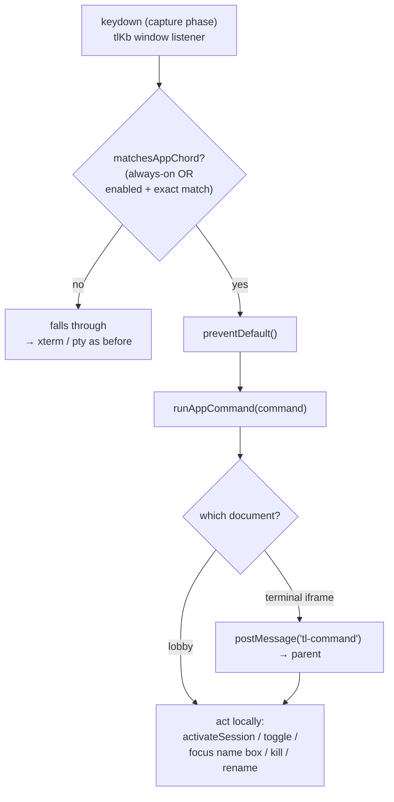
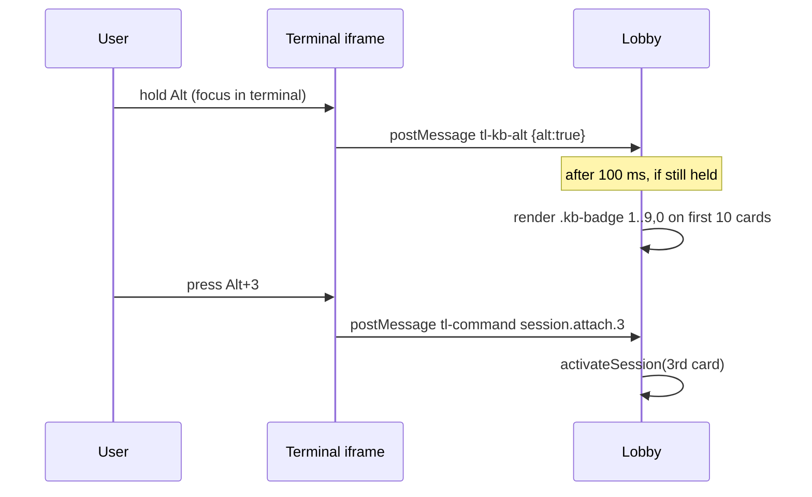

# Keyboard session switching (0–9) + dev-flow shortcuts

## Summary

Let a user switch between sessions and drive the lobby entirely from the
keyboard: **hold `Alt`** to reveal numbered chips (`0`–`9`) on the first ten
sidebar cards, then press the digit to jump. Add a handful of dev-flow chords
(jump to the next session awaiting input, toggle the sidebar, new / kill /
rename), and turn the whole layer **on by default**.

The user's original phrasing was "capture the cmd/ctrl key and show an inline
preview from 0–9 for all threads." Two words were sharpened during design:

- **thread → session.** The glossary (`CONTEXT.md`) already fixes the term as
  *session*; "thread" is on the _Avoid_ list. No new domain vocabulary is
  introduced — this is interaction on existing concepts, so `CONTEXT.md` is
  unchanged.
- **cmd/ctrl → Alt.** See [Decision: modifier](#decision-modifier).

## Key finding — this is *completion*, not greenfield

Most of the machinery already ships on `master` as the opt-in **keybinding
layer** ("Task 4.1", `frontend/index.html`):

| Already working | Where |
|---|---|
| `Alt+1..9` → jump to Nth sidebar session | `runAppCommand` / `orderedSessionNames()` |
| Hold `Alt` ≥100 ms → numbered chips on the first 9 cards | `syncAltBadges` / `.kb-badge` |
| `Alt+Shift+[` / `]` → cycle prev/next | `session.prev` / `session.next` |
| `Ctrl+Shift+K` → command palette | `tlKb.createPalette` |
| `Ctrl+J` / `Cmd+J` → new shell dock (always-on) | `KB_ALWAYS_BINDINGS` |
| Chords work from inside the terminal iframe (forwarded up) | `postMessage('tl-command')` |

Jumping already works in **both** the lobby and the fullscreen terminal (the
iframe forwards the command up to the lobby, which swaps the pane). The layer
is **default-OFF** and numbers **1–9** only.

So the actual work is small: extend to `0`, flip the default, and add five
chords — four of which bind commands that *already exist*.

## Decision: modifier {#decision-modifier}

**Alt/Option**, not Cmd/Ctrl.

`Cmd+1–9` (macOS) and `Ctrl+1–9` (Win/Linux) are **reserved by the browser for
tab-switching** and fire before the page — a web app in a normal browser tab
**cannot** `preventDefault()` them. They only become available inside an
installed PWA (no tab strip), and even there capture is unreliable
(`microsoft/vscode#150735`: an installed PWA still loses `Ctrl+W`/`Ctrl+N` to
the browser). The only guaranteed capture path is the Keyboard Lock API, which
requires fullscreen and is Chromium-only.

The user runs terminal-lobby in **both** a browser tab and the installed PWA.
`Alt/Option+digit` is the only modifier that behaves identically in both
contexts, and it is what the existing layer already uses. Accepted cost:
`Alt+digit` overrides readline's meta-N in the pty — which is exactly why the
layer is opt-in today (see [Decision: default-on](#decision-default-on)).

## Interaction model

Hold-Alt preview (badges) is driven by a separate Alt tracker; the terminal
forwards its Alt state up over `tl-kb-alt` so the badges render on the lobby's
cards even while the keyboard is inside the terminal:

## The 0–9 mapping

`Alt+1..9` = sidebar cards 1–9 (unchanged); **`Alt+0` = the 10th card**.
Matches the physical number-row order (`1234567890`) and preserves every
existing binding. Numbering follows **sidebar order** (`orderedSessionNames()`),
not recency — stable positions are more learnable.

Sessions **beyond ten are not digit-jumpable**; use `Alt+Shift+[` / `]` to
cycle or `Ctrl+Shift+K` to search. Badges render on the first ten cards only.
This is a deliberate cap ("0–9 for all threads" resolves to "the ten digits,
plus cycle/palette for the rest") — it is called out in the UI copy, never
silent.

## New / bound chords

| Chord | Command | Status | Notes |
|---|---|---|---|
| `Alt+0` | `session.attach.10` | extend | 10th sidebar card |
| `Alt+Shift+Enter` | `session.next.awaiting` | **new command** | next session with `state === 'awaiting'`, from after the current, wrapping; toast if none |
| `Alt+Shift+\` | `sidebar.toggle` | **new command** | keyboard `‹`/`›`; expands or collapses |
| `Alt+Shift+N` | `session.new` | bind existing | focus the new-session name box (expands sidebar) |
| `Alt+Shift+W` | `session.kill.current` | bind existing | kills the focused session (with confirm) |
| `Alt+Shift+R` | `session.rename.current` | bind existing | renames the focused session |

All chords remain user-overridable via `tl:keybindings:v1.overrides`. Chords
follow the existing collision discipline (avoid pty-critical keys and browser
chords); `Alt+Shift+<key>` is the safe space the layer already uses.

## Decision: on by default {#decision-default-on}

The layer flips from default-OFF to **default-ON for all users**.

- Enablement logic changes from "absent → off" to **"absent → on; an explicit
  stored `{enabled:false}` → off"**, so the settings toggle still turns it off
  and that choice persists per browser.
- The setting stays **per-browser** (`tl:keybindings:v1`, never roamed).
- **Blast radius (accepted):** this is a shared DevVM; every user's terminal
  loses `Alt+digit` (meta-N) until they opt out. A **one-time, dismissible
  hint** ("Keyboard shortcuts are on — Alt+1..0 switches sessions; toggle in
  Settings") is shown on first load per browser so nobody is blindsided.

## Implementation surface

Single file for behavior: `frontend/index.html`.

1. `KB_DEFAULT_BINDINGS`: add `alt+0 → session.attach.10`, `alt+shift+enter →
   session.next.awaiting`, `alt+shift+\ → sidebar.toggle`, `alt+shift+n →
   session.new`, `alt+shift+w → session.kill.current`, `alt+shift+r →
   session.rename.current`.
2. `normalizeKeybindings`: default `enabled` to `true` when the stored doc is
   absent; keep an explicit `false` as off.
3. `applyAltBadges`: `.slice(0, 10)`; label the 10th chip `0` (`i` 0–8 → `i+1`,
   `i===9` → `0`).
4. `runAppCommand` (lobby): add `session.next.awaiting` (scan `lastSessions`
   for `state==='awaiting'` in sidebar order from after `currentActive`) and
   `sidebar.toggle` (flip `setSidebarCollapsed`). The terminal side already
   forwards unknown commands up — no change needed there.
5. First-run hint: reuse the existing toast/hint mechanism, gated on a
   per-browser `tl:kb-hint-seen` flag.
6. Copy: settings tooltip (`#sp-kb .title`) + `README.md`.

## Verification

No JS unit-test runner exists in this repo (the whole keybinding layer shipped
E2E-verified); follow that pattern. Drive `scripts/dev-harness.py` with ~10
scratch tmux sessions and Playwright headless:

- layer is on with no stored setting; toggling off persists;
- hold Alt → chips `1..9` then `0` on the 10th card; releasing clears them;
- `Alt+0` attaches the 10th; `Alt+3` the 3rd;
- `Alt+Shift+Enter` jumps to an `awaiting` session (mark one via
  `@claude_state`); no-op toast when none;
- `Alt+Shift+\` toggles the sidebar; `Alt+Shift+N` focuses the name box;
  `Alt+Shift+W`/`R` reach kill/rename (confirm dialogs fire).

## Rejected alternatives

- **Cmd/Ctrl+digit** — browser-reserved; dead in a tab, unreliable in a PWA.
  See [Decision: modifier](#decision-modifier).
- **Overlay/HUD preview** (so a preview shows when the sidebar is collapsed) —
  considered and declined for scope. Consequence accepted: holding Alt in a
  fullscreen terminal shows no preview, though the jump still works. Left as a
  future enhancement.
- **0-indexed / `0`=toggle-last** — rejected in favor of `1..9,0` to preserve
  existing bindings.

## Out of scope

Overlay preview for the collapsed sidebar; roaming the enabled setting across
devices; per-user server-gated defaults; chords for project CRUD.
