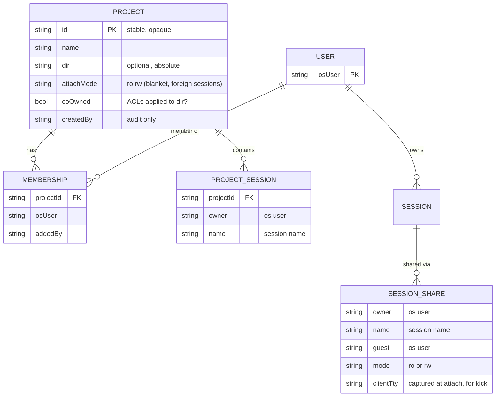
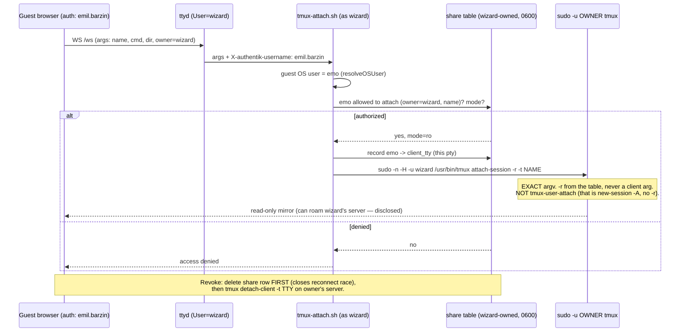
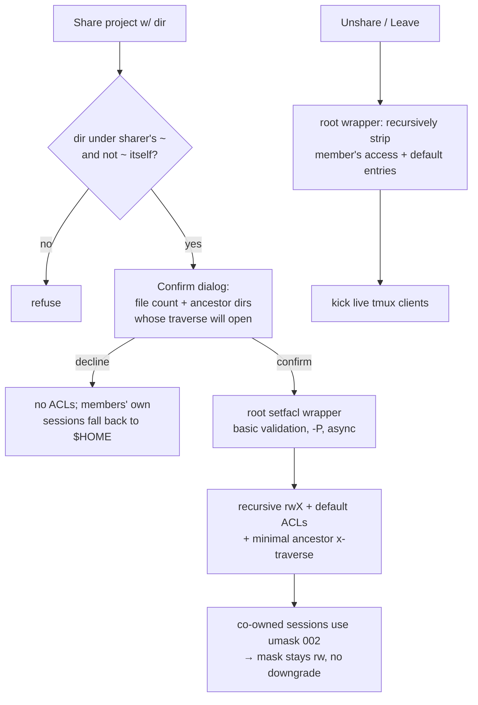

# Shared multi-user projects & sessions — terminal-lobby

**Status:** Design — verified via adversarial pass (2 blind challengers) · **Repo:** terminal-lobby · **Owner:** Viktor (wizard) · **Date:** 2026-07-17 · **Flow:** grill-with-docs

Expand the terminal-lobby "project" from a per-user sidebar label into a **first-class, multi-owner, shareable workspace**, and let users **share sessions** with each other — read-only (watch) or read-write (drive) — across the box's per-OS-user isolation boundary. Delivered as one drop, built in dependency order (P1→P4).

## Goal

1. A **project** is a first-class object with settings (name + directory), edited from one dialog (`⋯ → Project settings…`).
2. A session's starting directory is **derived from its project**.
3. **Sessions** can be shared between users on the same machine; a shared session = a second user attached to it simultaneously (RO watch or RW drive).
4. **Projects** can be shared — becoming multi-owner workspaces holding sessions from several users — and sharing a project also grants members **filesystem co-ownership** of its directory.

## The two hard constraints everything bends around

1. **Per-uid kernel isolation.** Each Authentik identity maps to an OS user (`/etc/ttyd-user-map`); that user's tmux server runs as their uid; ttyd and tmux-api (both running as service account `wizard`) reach other users only through `sudo -n -u <user> tmux …`.
2. **tmux enforces access per _server_, not per _session_** (verified against this box's tmux 3.4). A tmux server owns one uid's whole set of sessions; a client attaching it is bound to that uid, and can navigate to *any* session on that server. There is **no per-session sandbox and no per-client identity** inside a server.

Consequences, both accepted deliberately:

- **Sharing a session is really "sharing your whole tmux server."** A read-only guest can press the default `switch-client` keys (`prefix ) ( L`, which fire even for read-only clients) and roam to every session the owner has. Accepted (decision #14): the UI names the grant honestly.
- **Read-write = a full interactive shell as the owner**, across *all* their sessions — not scoped to the shared one. A RW guest can `prefix c` a new window → shell as the owner, read/write their files, roam anywhere. "RW to a session" = *arbitrary code-exec as `<owner>`*. Accepted as a deliberate, harder-gated escalation among trusted users.

## Decisions (grilling 2026-07-17; ✓ = survived adversarial verification)

| # | Decision | Choice | Notes |
|---|----------|--------|-------|
| 1 | "thread" | = session | matches CONTEXT.md |
| 2 | Session share modes | RO + RW, owner picks; RO default | ✓ but scope is server-wide, not per-session (see #14) |
| 3 | Granularity | Both single-session and whole-project | |
| 4 | Project ownership | **Multi-owner** — sessions from many OS users coexist | |
| 5 | Governance | Co-equal members | delete dissolves grouping, never kills sessions |
| 6 | Path model | Single absolute dir + **filesystem co-ownership** on share | |
| 7 | Co-own mechanism | **POSIX ACLs**, trust-based (no armor): any dir *under* `~` except `~` itself | **revised** after pass — original under-home+denylist was unsafe |
| 8 | Handshake | Auto-appear, badged shared-by-owner, recipient can Leave | |
| 9 | Revoke (live) | Kick immediately | via `client_tty` capture at attach (see plumbing) |
| 10 | Co-view | Mirrored, `window-size latest` | coherent for RO; jittery for two RW clients (accepted) |
| 11 | Settings dialog | `⋯ → Project settings…` (Name / Directory / Members) | |
| 12 | Delivery | All at once (built in dependency order, verified E2E) | |
| 13 | Member access to others' sessions | Per-project blanket RO/RW mode | |
| 14 | **Session-share scope** | **Accept server-wide, honest UI** | tmux can't scope to one session; RW named "full shell as owner" |

## What the adversarial pass changed

Two blind challengers were briefed to *break* the two riskiest halves; both found real defects that reshaped the design.

**Co-ownership (challenger-acl) — original model was unsafe, redesigned.** The under-`$HOME` + denylist model (locked #7) was confirmed to leak catastrophically: to let a guest reach a project under `~/code`, it must grant traverse-`x` on `~/code`, which is the *sole* lock (`drwxrws---`, group `code-shared` = wizard only) over a **world-readable git-crypt master key** (`~/code/infra-git-crypt-key`, `-rw-rw-r--`, decrypts all infra secrets), a listable `infra/secrets/` with plaintext SSH/TLS keys, and 22 world-readable files / 59 traversable trees. A denylist structurally can't cover an *ancestor→sibling* leak. Also proven: only root can setfacl mixed-ownership trees, so revoke can't complete without root; and default-ACL inheritance is silently mask-downgraded (`0644` create → co-owner gets `r--`). → **Owner decision: trust-based model** (below) — no `~` sharing, no armor stack, root wrapper for correct revoke, umask 002 for the mask footgun, transparent per-share disclosure instead of a denylist.

**Session sharing (challenger-attach) — mechanics sound, scope assumption false.** Attach-as-owner works with the *existing* sudo grant, no new privilege (verified live). But `tmux attach -r` is a *write* boundary, **not a scope boundary and not system-enforced**: (1) an RO guest roams to all the owner's sessions; (2) if the owner's `~/.tmux.conf` ever binds `switch-client -r`, RO silently flips to RW; (3) RW is full account takeover; (4) kick-on-revoke can't target the guest without capturing their pty; (5) tmux-api has *no* `(owner,name)` dimension today — every handler assumes the caller's own server. → Design adapted: **server-wide scope accepted + named honestly**; RW relabelled "full shell as owner," gated harder; feature-owned `/etc/tmux.conf` invariant (never binds `switch-client -r`); `client_tty` capture for kick; the `(owner,name)` rework scoped as its own tested task.

## Architecture

### Data model

Projects can no longer live in one user's JSON (they span users). Split into a **global store** (owned by tmux-api as `wizard`) + the existing **per-user layout** reduced to view-ordering. Sessions are identified globally as `(owner, name)` wherever they cross users.

- **Global store** `/var/lib/tmux-api/projects.json` (+ `shares.json`, mode `0600`, wizard-owned): projects, memberships, project→session refs, single-session shares including the captured `clientTty`. Whole-document, mutex-guarded, atomic write — same discipline as today's layout store.
- **Per-user layout** (existing `<user>.json`) reduced to *ordering + ungrouped slot*, referencing projects by **id**. Collapse stays per-browser. Existing name-keyed projects **auto-migrate** to single-member projects with generated ids.
- **`(owner, name)` everywhere it crosses users** — tmux names aren't unique across servers. This is greenfield: `resolveOSUser` / `handleSessionByName` / the sessions cache all assume the caller's own server today (its own task — see Build plan).

### Session sharing — plumbing

- **Attach-as-owner** overrides the header-derived OS user with the target `owner`, *only after* the wizard-owned share table authorizes this guest for `(owner, name)`. No new sudo grant — the existing broad `(emo)/(ancamilea) NOPASSWD: /usr/bin/tmux` covers `attach-session`.
- **Load-bearing invariant:** because that grant runs *any* tmux subcommand as the owner, the RO boundary rests entirely on `tmux-attach.sh` emitting exactly `attach-session -r -t <validated-name>` with **zero guest-controlled argv**, `-r` sourced only from the `0600` share table. Any path letting a guest influence the tmux argv = full owner compromise.
- **Server-wide scope (accepted).** RO = read the owner's whole server; the UI says so. A feature-owned `/etc/tmux.conf` invariant guarantees no `switch-client -r` rebind (closes the config-flip escape for the system default; owner dotfiles remain their own responsibility, disclosed).
- **RW = full shell as the owner** — labelled that way, gated behind a stronger confirm than RO.
- **Kick-on-revoke:** capture the guest's `client_tty` at attach; revoke deletes the share row then `detach-client -t <tty>`. Re-record on every reattach (new pty per WS).
- **Co-view:** `window-size latest`; RO's `ignore-size` means an RO guest never resizes the owner (coherent). Two RW clients thrash resize (accepted, minor).

### Multi-owner projects

- A shared project renders in every member's sidebar (position/collapse per-user), showing **all members' sessions**; foreign-owned ones are **owner-badged** and attach-only at the project's blanket RO/RW mode — you kill/rename only your **own** sessions.
- A member may create their **own** session in the project (their uid, their identity/credentials); it starts in the project dir (co-ownership makes that writable) and appears for all members.
- Co-equal governance via the Members section: any member may rename, change dir, add/remove members, set attach mode, or delete (dissolves grouping; members' sessions fall back to their Ungrouped).

### Filesystem co-ownership — ACL model (trust-based)

- **Trust-based, no armor** (owner decision after the pass proved the guarded model both unsafe and unbuildable-safely). Only mechanical rule: any directory **under the sharer's home except `~` itself**. Users are trusted to share only what should be shared.
- **Informed trust replaces the denylist:** the confirm dialog shows the **file count** *and* **which ancestor dirs get traversal (`x`) opened** — so the trusted user sees the blast radius (e.g. sharing something under `~/code` opens traverse on `~/code`, which holds the git-crypt key) and can decline per share. Transparency, not enforcement.
- **Wrapper runs as root** (not the dir owner): the tree already holds mixed-ownership inodes, so a non-root apply partially fails and a non-root revoke can't strip a departed member's own ACLs. Basic input validation only (absolute path, real dir, under a real user's home, not `~`, `-P` physical walk) — not the rejected armor stack.
- **Mask footgun handled:** co-owned sessions start `umask 002` so new files stay group-writable and the `u:<member>:rwx` default entry isn't silently downgraded.
- **Cost control:** `~/code` ≈ 360k inodes; recursive setfacl (×2 for defaults) runs **async/detached**, excludes `node_modules`/`.git`/build dirs, hard inode cap (the "huge tree" warning is a refuse, not advisory).
- **Prereqs:** `apt install acl`; audited root setfacl wrapper; sudoers line (target `root`).

### UI

- **Project settings dialog** (`⋯ → Project settings…`, replacing separate *Rename* + *Set directory…*): **Name**; **Directory** (existing fuzzy `/dirs` picker + typed fallback; co-ownership confirm when shared); **Members** (add-member picker over mapped users, per-project RO/RW attach-mode toggle, Remove/Leave). Reuses `openProjectModal`.
- **Session share** (`⋯ → Share…` on a session card): pick mapped users, each RO/RW. Wording is honest — RO = "watch my terminal (can see all my sessions)", RW = "**full shell as me**". RW behind a stronger confirm.
- **Badges:** foreign-owned sessions and shared-in projects show a shared-by/owner badge; foreign sessions expose attach only.
- Claude state dots on foreign sessions read the owner's `@claude_state` via the existing cross-user `sudo tmux list-sessions` path.

## Security model (consolidated)

- **Trust posture:** a 2–3 person box of trusted users (wizard, emo, ancamilea per memory #7290). The design leans on that throughout; it is **not** safe for untrusted tenants.
- **Session RO share** = read access to the owner's *entire* tmux server (disclosed in UI). Not a hard boundary if the owner rebinds `switch-client -r` in their own dotfiles (disclosed; the system default config never does).
- **Session RW share** = arbitrary code execution as the owner across all their sessions ("full shell as me"). Harder-gated than RO.
- **The one invariant that must never break:** `tmux-attach.sh` emits an exact, guest-uninfluenced tmux argv; `-r` and the owner target come only from the `0600` wizard-owned share table. This is the entire security boundary given the broad sudo grant.
- **Co-ownership** exposes whatever the shared dir's ancestor traverse reveals; mitigated by disclosure + trust, not enforcement. The setfacl wrapper is root but argument-constrained and physical-walk (`-P`).
- **Pre-existing hygiene note (out of scope but worth fixing):** the git-crypt master key and `infra/secrets` private keys are world-readable in `~/code` today; only the `~/code` group gate hides them. One group-add from exposure regardless of this feature.

## Build plan (one landing, dependency order)

- **P1 — First-class projects + settings dialog.** Project `id` + migration; global store scaffolding; unify Rename/Set-dir into `Project settings…`. (Low risk.)
- **P2 — `(owner,name)` rework in tmux-api.** Thread `owner` through the arg chain (`?arg=` → `/token` → `/ws`) and every handler that can act on a shared session; resolve `(caller, owner, name)` + share-table check before `tmuxCmd(owner,…)`; cache stays owner-keyed, authorization keys caller+owner+name. **Own task, test-first** (bug-prone caller-vs-owner).
- **P3 — Session sharing (RO/RW).** Share table (+ `clientTty`); `tmux-attach.sh` attach-as-owner with the exact-argv invariant + server-side `-r`; kick via `client_tty`; feature-owned `/etc/tmux.conf` invariant; session `⋯ → Share…` with honest wording; auto-appear + badge + Leave; `window-size latest`. (No FS changes, no new sudo.)
- **P4 — Multi-owner projects.** Global-store membership; foreign-session rendering + owner badges; guest-creates-own-session; co-equal governance UI; per-project blanket attach mode.
- **P5 — Filesystem co-ownership.** `acl` package; audited root setfacl wrapper + sudoers; trust-based eligibility (under-`~`, not `~`); transparent confirm (count + ancestor traverse); recursive + default ACLs + umask 002 + async; root-wrapper revoke.

*(Reordered from the grilling's P1–P4: the `(owner,name)` rework surfaced by the pass is pulled forward as its own task before session sharing depends on it.)*

## Prerequisites & deploy

- `apt install acl` on the devvm (free; `deploy.sh` should ensure it).
- `ancamilea` → `/etc/ttyd-user-map` line to participate (already in the sudoers grant). Design is N-user generic.
- Feature-owned `/etc/tmux.conf` invariant: never bind `switch-client -r`.
- New audited **root** setfacl wrapper + sudoers line (P5 only).
- Manual `./scripts/deploy.sh` (no CI auto-deploy); restarts ttyd/tmux-api, sessions survive via the systemd-scope design.

## Accepted residual risks

1. A session share grants read (RO) / full-shell (RW) of the owner's **whole** tmux server, not one session. *Mitigation: honest UI wording; trusted users.*
2. RO is not enforceable against an owner who rebinds `switch-client -r` in personal dotfiles. *Mitigation: disclosed; system default never does.*
3. Co-ownership opens ancestor traverse that can expose sibling secrets under a shared parent. *Mitigation: per-share disclosure of exactly what opens; trust.*
4. A root setfacl wrapper is a privileged primitive. *Mitigation: argument-constrained, physical-walk, under-`~`-only, async, capped.*

## Verification plan

- Backend unit tests: global-store round-trip, migration, share authorization `(caller,owner,name)`, `(owner,name)` routing — test-first per repo convention.
- `tmux-attach.sh`: exact-argv + share-table gating with a stubbed sudo/tmux; assert no client arg can alter the emitted tmux argv or drop `-r`.
- Live E2E on the devvm (the 2026-07-16 lesson — verify the *attached session*, not just the modal): emo attaches a wizard session RO (input rejected; roam disclosed) and RW (drives it, shell as wizard); revoke kicks the exact guest client; a shared project shows both users' sessions; a guest creates a session in a shared co-owned dir and writes a file both can edit; unshare strips ACLs. Confirm each attached session's `pwd`, identity, and RO-enforcement.
