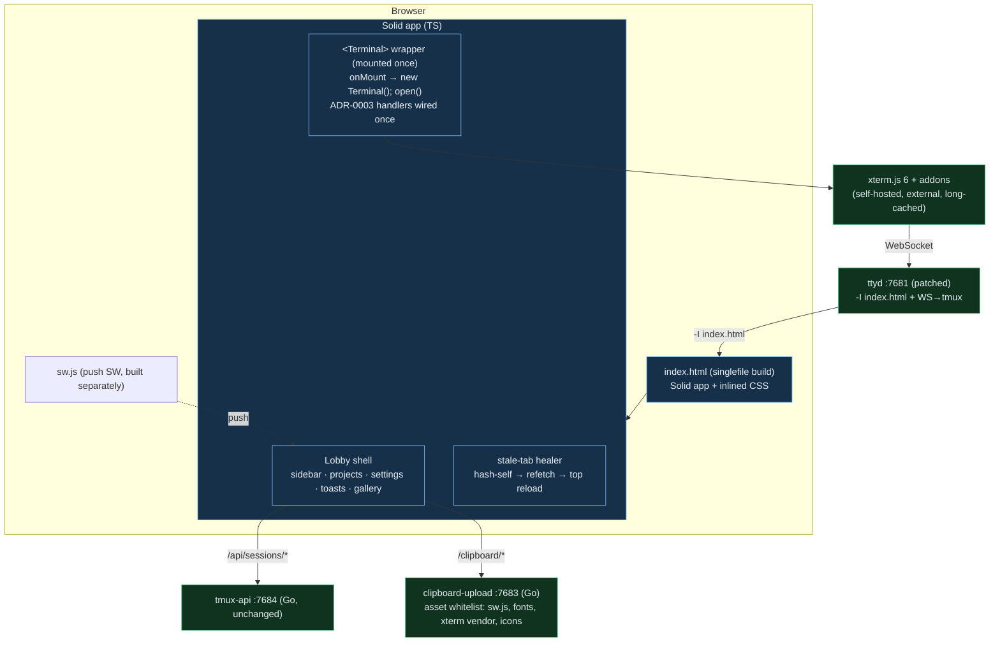

# SolidJS frontend rewrite — design & plan

**Status:** Revised after adversarial review — execution-ready pending Viktor's go
**Date:** 2026-07-17
**Owner:** wizard
**Supersedes UI direction of:** the vanilla single-file `frontend/index.html`

> This plan was stress-tested by two blind adversarial challengers (planning.md
> §2b). Their verified findings are folded in below; §12 records the audit trail.
> Headline changes from the first draft: perf reasoning corrected, **decision #7
> reversed** (xterm stays external), a **real executable gate** replaces the prose
> gate, and four missed blast-radius items added.

**Companion documents (produced by the 15-agent research workflow, 2026-07-17):**
- `2026-07-17-frontend-feature-inventory.md` — the **302-feature parity checklist**
  (133 red-line/high-risk), the authoritative source for "reproduce all features."
- `2026-07-17-frontend-deploy-options.md` — the full BUILD/SERVE/DEPLOY analysis
  behind §8's recommendation.

---

## 1. Goal & drivers

Rebuild terminal-lobby's frontend on **SolidJS + TypeScript**, replacing the
single 12,691-line / 717 KB hand-written `frontend/index.html` (84% one JS IIFE,
323 functions, imperative `createElement` + DOM-`dataset` state).

Drivers, priority order (settled during `/grill-with-docs`):

1. **Maintainability / velocity** — one giant file with closure+DOM state is slow
   and risky to change; refactors break silently. *(Primary.)*
2. **UX quality ceiling** — declarative components + reactive state raise what's
   cheap to build.
3. **Future scope** — new surfaces (agent-conductor web port, dashboards).

**NOT a driver: performance.** A UI framework cannot speed the perf-critical path
(xterm.js rendering + the WebSocket byte stream); `paint()`/lobby render runs on a
5 s interval over a handful of cards — not a bottleneck. **Correction from draft
v1:** the shell is *not* service-worker-cached — `sw.js` deliberately has no fetch
handler and no precache; the page is served `no-store`/`no-cache`+ETag and
revalidated every load. The "framework can't help the hot path" conclusion stands;
the earlier "SW-cached" justification was wrong and is retracted.

## 2. Decisions (grill outcomes)

| # | Decision | Choice | Rationale |
|---|----------|--------|-----------|
| 1 | Tooling appetite | **Tier C** — framework + build | Wanted the UX ceiling + new surfaces; accepted a Node/bundler toolchain |
| 2 | Framework | **SolidJS** (v1.9) | JSX (T3 ports near-mechanical) **and** no vdom (fits surgical-DOM + xterm); ~7 KB. `onMount` runs once, never re-run by reactivity (verified) |
| 3 | Migration | **Big-bang, full from-scratch** | Viktor's call, twice, against the recommended incremental + verbatim-port. Held after the adversarial review, with mandatory mitigations (§5) |
| 4 | Styling | **Keep** the 9-theme CSS-var system as token layer; CSS Modules for components | Framework-agnostic; live-switch + xterm ITheme sync already work; zero fidelity loss |
| 5 | Language | **TypeScript** | Kills silent-refactor-breakage; Solid is TS-first; T3 source is TS |
| 6 | Build output | **Vite + `vite-plugin-singlefile`** (v2.3.3) → one inlined `index.html` | Keeps single-file serving; `deploy.sh` scps one file |
| 7 | ~~Bundle xterm in~~ → **xterm stays EXTERNAL, self-hosted** | **REVERSED after review.** Self-host xterm 6 + addons as separate static assets (via the `clipboard-upload` whitelist, like fonts), long-cache + immutable; mark `@xterm/*` Rollup-`external`. | Bundling into the `no-store` single file would re-download the whole xterm+app blob on every deploy (2+/day) and every stale-heal reload — a perf regression on mobile. Self-hosting removes the third-party CDN dep **and** keeps xterm independently cached. |

**On record (Viktor overruled twice):** incremental migration + verbatim-porting
the imperative subsystems was the recommended, lower-risk path (§5, §12). Big-bang
from-scratch is retained by explicit choice; the residual red-line risk on the
imperative subsystems (§5) is higher than a verbatim port would carry.

## 3. Scope & non-goals

**In scope (rewritten from scratch, Solid+TS):** the entire `frontend/` — lobby
sidebar (projects, ungrouped, drag-reorder, session rows, state dots), settings +
9-theme picker, toasts/slow-request coordinator, image gallery, mobile soft-key
toolbar + gestures, compose bar, keybindings layer, web-push registration, the
**stale-tab healer**, flow-control client, and the terminal view (xterm wrapper +
ADR-0003 selection/copy).

**Built but NOT through the singlefile rollup:** `sw.js` — hand-authored vanilla,
copied verbatim to `dist/sw.js` (it imports nothing; a 2nd rollup input would
hard-fail singlefile). Fonts + self-hosted xterm — external assets, absolute URLs.

**Out of scope (untouched):** Go services (`tmux-api/`, `clipboard-upload/` — API
contract fixed), the patched **ttyd** binary, tmux plumbing, the WS↔ttyd protocol,
and the asset-whitelist routes. The 9 theme definitions port verbatim.

**Confirmed NOT blast radius:** ttyd-ro `:7682` runs with **no `-I` flag** → serves
ttyd's stock HTML, not our `index.html`. The read-only view is unaffected.

## 4. Target architecture

**Build:** `frontend/src/**` (TS/TSX + CSS Modules) → `vite build` (xterm marked
external; build id via `define`, not sed) → `vite-plugin-singlefile` inlines
JS+CSS → `frontend/dist/index.html` (+ `dist/sw.js` copied). `deploy.sh` scps them.
Serving is byte-identical to today.

## 5. The red-line & risk (the crux — do not skim)

**Standing constraint (Viktor, stored preference):** nothing may alter
mouse/wheel/selection/scroll semantics. A prior mouse-mode change broke his
workflow and was reverted. Alt-screen TUI scrolling must keep working exactly.

**Verified risk level: HIGH.** The adversarial review established:
- **43 red-line-adjacent frontend commits in 45 days** — these subsystems are
  actively being fixed, not "done."
- **ADR-0003 carries three addenda** — trackpad ghost-clicks, Option-click
  cursor-moves, mode-1003 motion clear — **each discovered by Viktor using the tool
  for weeks; none caught by any test.** A from-scratch rewrite re-derives from a
  spec that does not contain these bugs.
- A **second real user (`bob`)** shares this daily driver — a regression hits them
  too.

**Mandatory mitigations (Viktor accepted these as the condition for big-bang):**

1. **Executable golden-master suite, built FIRST (P0.5), blocking.** Playwright +
   pytest over `scripts/dev-harness.py` (scratch `tmux -L tl-dev`), capturing
   *today's vanilla* behavior as the baseline: ADR-0003 drag-select → OSC52
   clipboard bytes, pixel→cell replay under window padding, wheel/alt-screen
   scroll, flow-control client (not just the server `flowprobe`), gesture probes.
   The Solid build must match byte-for-byte. **This replaces the "BATTERY.md gate"
   — BATTERY.md is 3,334 lines of *manual* prose and is insufficient alone;** it
   stays as the manual acceptance layer on top.
2. **Canary soak before cutover.** Deploy the rewrite to a **parallel host**
   (second ttyd unit on a new port + a `terminal-next` ingress route in
   `infra/stacks/terminal/`) and dogfood it — Viktor **and bob** — against the real
   backend for a soak period. This is the only thing that catches the
   field-discovered class of bug that no automated test can. Flip the main URL only
   after the soak is clean.
3. **`bob` in the acceptance gate**, not just Viktor.
4. **Stale-tab healer treated as a red-line subsystem** (§3) — its
   hash/refetch/`postMessage('tl-build-stale')`/storm-guard/`sessionStorage`
   throttle contract must be reproduced exactly, or installed tabs never update or
   reload-storm. It is the *only* deploy-update channel (no build header).
5. **Rollback reverts `sw.js` too** (§9) — the rewrite ships a new `sw.js`
   push/`notificationclick`/IndexedDB contract; reverting only `index.html` leaves
   old-page + new-SW mismatched.
6. **Tagged rollback point** (`v-vanilla-final`) + installed `index.html.prev` on
   the devvm (mirrors the `ttyd.prev` pattern).

**`?arg=` dual-mode is red-line-class:** the fullscreen deep-link path (framed
iframe vs. bare top-level tab: `isFramed` branches, `visualViewport.scale` from
`window.top` vs `self`, deep-link boot-hash, `?arg=`×2/×3 = session/command/dir) is
woven through 20+ call sites and backs bookmarks + CLI links. Reproduce the full
contract, not just the `location.replace` history-leak fix.

## 6. Rewrite plan (phased; one cutover)

- **P0 — Foundation.** `frontend/src/`, Vite + singlefile + TS + Solid; `vitest`.
  xterm marked `external` + self-hosted vendor assets. **Gate: `vite build` emits
  exactly ONE file in `dist/` (no `.js`/`.wasm`/worker sidecars)** — the empirical
  test for the singlefile worker hard-fail (esp. `addon-image` sixel). Build id via
  `define`. `sw.js` copied separately.
- **P0.5 — Golden-master suite (blocking, §5.1).** Build it before any UI rewrite;
  it captures current behavior and gates cutover.
- **P1 — Theme tokens.** 9 themes verbatim as CSS vars; pre-paint boot; live
  `tl-theme` switch; xterm `ITheme` derivation.
- **P2 — `<Terminal>` wrapper + red-line.** xterm via `onMount` (once, **mounted for
  page lifetime — never keyed/toggled**), ADR-0003 selection/copy, mouse/scroll,
  addon wiring (tmux-join link provider out-ranking the addon's; OSC52 provider
  accepting empty *and* `'c'` selection for tmux 3.4; webgl context-loss disposal),
  flow-control client. **Gate against golden master before proceeding.**
- **P3 — Lobby shell.** Sidebar model (sessions/projects/ungrouped/layout via
  `/api`), rows + state dots, drag-reorder, project CRUD, `⋯` menus, iframe swap
  (`location.replace`), the `?arg=` dual-mode contract, the stale-tab healer.
- **P4 — Peripherals.** Settings, toasts + slow-request coordinator, gallery, web
  push + `sw.js`, favicon/tab badge.
- **P5 — Mobile.** Soft-key toolbar, latching modifiers, gestures (pinch-font;
  session swipe Android-only), compose bar, safe-area/keyboard. Gate against gesture
  probes.
- **P6 — Canary soak + cutover.** Parallel-host soak (§5.2) with Viktor + bob; full
  BATTERY + golden-master + 4-theme screenshot diff; then flip the main URL. Tag +
  keep `.prev`.

## 7. Testing & acceptance

- **Unit (`vitest`):** layout ordering, sanitize mirrors, state reducers, time-ago,
  hash-page.
- **Golden-master (blocking, P0.5):** Playwright+pytest over `dev-harness.py` — the
  real cutover gate.
- **Manual (BATTERY.md):** per-feature acceptance, **run by Viktor and bob**; 4
  theme screenshots re-shot + diffed.
- **Canary soak (§5.2):** parallel host, real backend, real usage, before cutover.
- **Type gate:** `tsc --noEmit` clean; no `any` where a type exists.

## 8. Build & deploy changes

- `deploy.sh`: add `npm ci && npm run build` (guarded like the ttyd-binary step;
  `SKIP_BUILD=1` reuses `dist/`). scp `frontend/dist/index.html` + `dist/sw.js`.
  **Replace the `__TL_BUILD__` sed with Vite `define`** (sed lacks `g` and breaks
  under minification). Fonts + xterm vendor stay external absolute URLs (served by
  the `clipboard-upload` whitelist) — do **not** let Vite inline them
  (`assetsInlineLimit` is forced to inline-all by the plugin).
- **New whitelist entries** in `clipboard-upload/main.go`: the self-hosted xterm +
  addon files (long `max-age`, immutable), mirroring the font entries.
- **No CI** — and the README's "CI status — TODO / `.woodpecker.yml` ready" is
  **STALE**: that file was removed and the builder decommissioned under infra
  ADR-0002 (verified in `terminal/main.tf`). So the day-one build is a **local
  `vite build` in `deploy.sh`** (node v24.15.0 / npm present on the box) — this is
  *allowed* by ADR-0002, which bans in-*cluster* build compute, not a workstation
  build before scp (exactly what `deploy.sh` already does for the Go binaries).
  Moving the build off the workstation (GitHub Actions per ADR-0002) is a real
  option but needs one-time onboarding — this repo has **no GitHub mirror yet** —
  so it's the upgrade path, not day-one. **Fix the stale README when this lands.**
- **Node toolchain enters the repo** (`package.json`, lockfile, `node_modules`
  gitignored) — the first non-Go, non-vanilla toolchain here; a deliberate Tier-C
  cost against the house stdlib-Go/no-framework pattern.

## 9. Rollback

Two-file swap (not one): reinstall `index.html.prev` **and** the previous `sw.js`
on the devvm (ttyd `-I` re-reads on connect; SW re-registers) — or
`git checkout v-vanilla-final -- frontend` + redeploy. No DB/state migration, so
rollback is fast; the canary soak means the main URL only ever sees a soaked build.

## 10. Effort

Full from-scratch, solo: substantial — multi-session, days of focused work. The
long poles are P2 (terminal red-line) and P5 (gestures) — irreducibly imperative,
so "from scratch" costs the most there for the least design gain, and the golden
master + canary soak exist precisely to contain that.

## 11. Open questions (pre-execution)

- Empirically confirm P0's one-file gate with `addon-image` (sixel) in the ESM
  build — the only thing a spike, not docs, can settle.
- `terminal-next` canary: second ttyd unit + ingress route — scope the
  `infra/stacks/terminal/` change (small, but infra-side).
- Confirm the `type=password` hidden-textarea input trick (Gboard fix) is
  reproduced in the Solid terminal input path.
- **Serving trigger (decides day-one vs upgrade path):** the deploy analysis
  recommends day-one **B1+S1+D1** (local `vite build` → single inlined `index.html`
  on `ttyd -I` → scp) because it preserves the same-origin web + the security-
  sensitive auth carve-out *by construction*. But `vite-plugin-singlefile`
  **defeats code-splitting**. If the frontend is expected to grow into a multi-view
  app with lazy-loaded routes (driver #3: agent-conductor web, dashboards), that's
  a **false economy** → jump to the upgrade path **B2+S2+D2** (GitHub Actions build
  → Caddy + git-sync static pod, the blessed `learn`/`plans` pattern → git-push
  deploy), re-implementing the auth carve-out via `ingress_factory`. **Open
  question for Viktor: modest shell (single-file) or multi-view growth (cluster +
  code-splitting)?** — see the deploy-options companion doc.

## 12. Adversarial review audit trail (planning.md §2b)

Two blind challengers, briefed to disprove; findings verified against repo + docs.

- **Challenger B (strategy/risk) — REVISE.** Caught: the retracted SW-cache claim;
  decision #7 as a perf regression (→ reversed); the prose "gate" being
  unenforceable (→ executable golden-master P0.5); HIGH red-line risk (43 commits/45
  d; 3 field-found ADR-0003 addenda, none test-caught); missed blast radius (bob,
  healer, sw.js rollback, `?arg=` dual-mode). Cleared ttyd-ro as non-impacting.
  Recommended incremental + verbatim-port; Viktor retained big-bang with the
  mandatory mitigations above.
- **Challenger A (build tooling) — PROCEED, with amendments.** Confirmed singlefile
  v2.3.3 handles 700 KB+ and dynamic imports; `onMount` runs once. Amendments folded
  in: one-file build gate (worker hard-fail), `define` over sed, `sw.js` built
  separately, fonts/xterm external, `<Terminal>` mounted once for page lifetime.
  Confirmed xterm is consumed as UMD globals today → mechanical ESM conversion.
