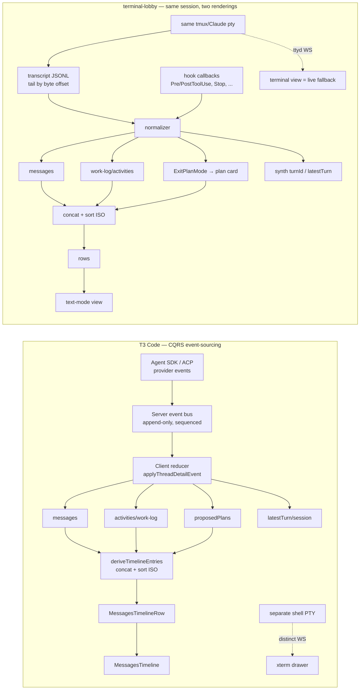
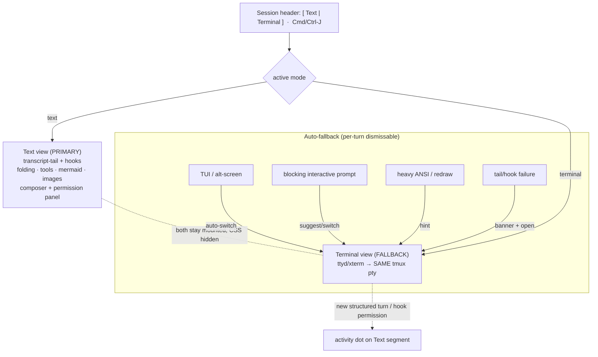

# T3 Code two-view UX & mode-switch — synthesis for terminal-lobby v2 pillar #2

**Purpose.** Inform pillar #2 (the text-mode / terminal two-view + the switch between them). All T3 anchors are relative to `/home/wizard/code/t3code/`.

**The one fact that reframes everything.** T3's "two views" are **two different things shown together**: chat renders the agent (agent-SDK/ACP event stream) and is always primary; the terminal is a **separate scratch shell (zsh/bash) that is NOT the agent**, shown *additively* as a bottom drawer or right-panel tab. There is **no chat↔terminal mode-switch** in T3 — the toggle only *shows/hides an extra pane*. terminal-lobby is the inverse: text-mode and terminal are **two renderings of the SAME tmux/Claude session** (transcript-tail vs live pty attach), so ours is an **XOR swap**, and showing both at once would duplicate one session's output. Consequence: T3's *layout/plane semantics are mostly reject/adapt*, but its *switch mechanics and structured-render engineering transfer almost wholesale*.

---

## 1. How T3 does it — the two views + the switch

### View A — structured chat (the model for our text-mode)
- The real renderer is **`MessagesTimeline`** (`apps/web/src/components/chat/MessagesTimeline.tsx:188`, ~2057 lines) + a pure-logic sibling **`MessagesTimeline.logic.ts`** (602 lines) that does all row derivation and is unit-tested without a DOM. `ChatView.tsx` (5370 lines) is *only* the orchestrator/data-wiring + drawer host; it derives ~30 props and hands them to `<MessagesTimeline>` (`apps/web/src/components/ChatView.tsx:5072`).
- Data model: three heterogeneous streams (messages, work/activities, proposed-plans) merged into one array and sorted by ISO `createdAt` into a discriminated-union `TimelineEntry` (`apps/web/src/session-logic.ts:1340`), then a second pass derives render-ready `MessagesTimelineRow[]` whose kinds (`message | work | work-toggle | turn-fold | proposed-plan | working`) express every affordance — folding, "show more", the live working row — **as data rows, not conditional JSX** (`MessagesTimeline.logic.ts:366`).
- Virtualized with `@legendapp/list`, type-based recycling, `maintainScrollAtEnd` + `maintainVisibleContentPosition` (`MessagesTimeline.tsx:474`).

### View B — terminal (a separate spawned shell)
- `ThreadTerminalDrawer.tsx` runs an xterm.js viewport over a **plain login shell** spawned server-side by the terminal `Manager` (`apps/server/src/terminal/Manager.ts:439-443, :1839-1843`) — `env.SHELL ?? "bash"`, no agent/claude/codex reference anywhere in its 2623 lines. The agent instead runs as a separate JSON-RPC/ACP child process on its own plane; agent work **never appears in this terminal** and there is zero provider→terminal bridging (only cleanup on delete, `apps/server/src/orchestration/Layers/ThreadDeletionReactor.ts:42`).
- Rendered as a bottom drawer `<aside class="… shrink-0 border-t">` with a pixel height that **reflows (shrinks) chat, never replaces it** (`ChatView.tsx:5011,5066,5278`), or as a right-panel tab (`mode="panel"`, `h-full flex-1`) alongside diff/preview/plan/files surfaces.

### The "switch" (really a show/hide)
- A single Radix ghost **`Toggle`** in the header, `pressed={terminalOpen}`, `onPressedChange={onToggleTerminal}`, `PanelBottomIcon`, aria-label "Toggle terminal drawer", tooltip carrying the shortcut (`apps/web/src/components/chat/PanelLayoutControls.tsx:18-54`).
- Bound to **`mod+j`** (`⌘/Ctrl-J`, the VS Code terminal key) via a configurable keybindings table with when-clauses (`packages/shared/src/keybindings.ts:23`); button + shortcut both dispatch the one `terminal.toggle` command (`ChatView.tsx:2281,3701-3711`).
- `toggleTerminalVisibility` flips a per-thread `terminalOpen` boolean in a persisted Zustand store; **first open lazily spawns a shell** (`ChatView.tsx:2281-2324`).

---

## 2. The switch UX in detail (Viktor's focus)

Everything below is *how T3 does the toggle*, with the read for our XOR swap noted per row.

| Dimension | T3's mechanism (file:line) | Read for our swap |
|---|---|---|
| **Control type** | One icon `Toggle`, pressed-state = pane open; ghost, size sm. Two *independent* toggles (terminal `PanelBottomIcon` + right-panel `PanelRightIcon`), not one XOR control (`PanelLayoutControls.tsx:18-54`). | We need a **two-state XOR** control, so prefer a **segmented `Text | Terminal`** (or a single flip-toggle), not two independent toggles. Adopt the pressed+shortcut+tooltip chrome. |
| **Placement** | Workspace titlebar / chat header, right cluster (`ChatView.tsx:4917-4938,5036`). | Same — session header, stable location. |
| **Keyboard** | `mod+j` → `terminal.toggle`; label resolved from keybindings and shown in tooltip (`keybindings.ts:23`, `shortcutLabelForCommand`). | Adopt `Cmd/Ctrl-J`; drive button + key through one command so the tooltip advertises it. |
| **Entry points** | Button + shortcut (must-haves); command palette is state-aware but a dedicated "toggle terminal" palette row was *not* confirmed (`CommandPalette.tsx`). | Button + shortcut for v2; palette entry = later polish. |
| **State store** | Zustand `persist` → localStorage, keyed **per-thread**, `t3code:terminal-state:v1`, version 4 + `migrate` + `partialize`; orphaned entries GC'd (`terminalUiStateStore.ts:20-30,585-640`). **Per-device, not server-synced.** | Adopt shape; **key by session id**, persist just `{mode}` (drop T3's terminalIds/groups/height). Per-device is correct for us too (phone→text, desktop→terminal). |
| **Layout relationship** | **Additive.** Drawer `shrink-0 border-t` reflows/shrinks chat; chat always visible. "Maximize" collapses the chat column to `w-0 flex-none` to *fake* a full-screen panel (`ChatView.tsx:5013`). | **Reject additive coexistence as the primary model** — same session ⇒ duplicate output. Use the **`w-0`/CSS-`hidden` collapse trick as the swap mechanism** (both children mounted, one visible). |
| **Transition** | Instant, no animation; drawer height changes immediate (`ThreadTerminalDrawer.tsx`). | Instant swap; optional light crossfade as polish. |
| **State preservation** | **Hide-don't-unmount:** `
` keeps xterm instance + pty + scrollback alive across toggles *and* thread switches; up to `MAX_HIDDEN_MOUNTED_TERMINAL_THREADS=10` retained (`ChatView.tsx:778-810,5278-5295`). Chat timeline is likewise never unmounted (scroll preserved). | **Adopt verbatim.** Keep the ttyd/xterm iframe *and* the text view mounted; toggle CSS visibility. Unmounting would drop the ttyd WebSocket + tmux attach and reset scrollback on every switch. Never key the terminal element on view-mode. |
| **Refit on show** | Hidden (`display:none`) elements measure 0×0, so a `resizeEpoch` counter (bumped on becoming-visible/resize/drag) drives `requestAnimationFrame(() ⇒ fit(); scrollToBottom(); resizeTerminal(cols,rows))` (`ThreadTerminalDrawer.tsx:781-796,1181`). | **Adopt.** On →terminal: rAF → fit → push cols/rows to the tmux pty → restore bottom-follow, or the fallback renders mis-wrapped/scrolled wrong. |
| **Focus follows view** | closed→open bumps `terminalFocusRequestId` → focuses xterm (rAF, because it was `display:none`); open→closed → `rAF(focusComposer)`. A monotonically-bumped id triggers imperative focus without re-render churn (`ChatView.tsx:3652-3672,5287`). | **Adopt.** →terminal focuses the pty; →text focuses the composer. |
| **Focus-while-terminal-owns-keys** | `terminal.attachCustomKeyEventHandler` returns `false` for app chords (toggle/split/new/close) so global shortcuts fire even when the pty has focus (`ThreadTerminalDrawer.tsx:499-534`). | **Critical:** ttyd captures all keys; the "switch back to text" hotkey must be intercepted before the terminal (ttyd option or a capture-phase window listener). |
| **Availability gating** | `terminalAvailable = activeProject !== null` disables the button + swaps tooltip to "unavailable"; first open runs the server `terminal.open` handshake (`PanelLayoutControls.tsx:43,50-52`). | Keep the disabled+explanatory-tooltip pattern for genuinely-unavailable states (session not started). **Drop the lazy spawn** — our terminal is a live attach to an already-running tmux session, nothing to create. |
| **Default view** | Chat-only; all secondary planes default closed (`terminalOpen=false`), opt-in — with one agent-driven exception: the plan sidebar **auto-opens** on a proposed plan, with per-turn dismissal so it doesn't nag (`terminalUiStateStore.ts:183`, `ChatView.tsx:1048`). | Confirms **text-mode primary** as default. Model our **auto-fallback** exactly like the auto-open-plan-sidebar (content-driven reveal + per-turn dismissal). |
| **Activity signalling** | Only at sidebar/thread level (unread pill, pulsing terminal icon) and a pending-dot on panel tabs; **no "new output" badge on the toggle itself** (`ThreadStatusIndicators.tsx:85`, `RightPanelTabs.tsx:421`). | **Gap to fix:** in an XOR swap the *hidden* view accrues unseen activity. **Add an unread/activity dot on the inactive segment** (reuse RightPanelTabs' dot visual). |
| **Mobile** | Right panel becomes an overlay `Sheet` (`keepMounted`) at `≤980px`; terminal stays a bottom drawer capped at 75vh; **no unified mobile view-switcher** — planes stack (`rightPanelLayout.ts`, `ChatView.tsx:5298`, `RightPanelSheet.tsx:20`). | Phones can't show two planes ⇒ **single full-screen view + the segmented switch** (simpler than T3's mixed sheet+drawer). Reuse `keepMounted`; 980px breakpoint is a sane default. |

---

## 3. Data-model comparison — T3 agent-SDK events vs our transcript-tail/hooks

| Concern | T3 | terminal-lobby (transcript-tail + hooks) |
|---|---|---|
| **Source of truth** | Append-only, monotonically-sequenced server event log; 22-variant `OrchestrationEvent` union (`packages/contracts/src/orchestration.ts:805`). | The **transcript JSONL is already a durable, ordered, replayable log** — we get for free what T3 built. **But hook events (approvals/permission prompts) are NOT in the JSONL** — ephemeral — so they need a *separate* durable store + cursor. |
| **CQRS command/event split** | Commands (intents) are a separate union from events (facts); server is the write model (`orchestration.ts:682-803`). | **Not needed** — no server write model. We need only the *projected read-model* + a reducer folding JSONL lines + hook events. |
| **Text vs work-log** | Durable text (messages) kept strictly separate from a work log of tools/approvals/reasoning/errors, each tagged `tone: info\|tool\|approval\|error`; merged only at render by timestamp (`ProviderRuntimeIngestion.ts:265-628`). | **Adopt directly.** transcript `tool_use`/`tool_result` → activities(tone:tool); Pre/PostToolUse hooks → tone:approval/tool; errors → tone:error. This split is what makes a terminal transcript legible. |
| **Normalized item** | Raw provider payloads → flat `WorkLogEntry` {label,detail,command,changedFiles,tone,toolTitle,itemType,requestKind,toolLifecycleStatus}; tool.updated+tool.completed collapsed by `toolCallId` (`session-logic.ts:63,677`). | Define the same contract; pair transcript `tool_use`↔`tool_result` by **`tool_use_id`** (their `collapseKey`); UI never sees raw JSONL → decoupled from Claude Code transcript-format churn. |
| **Streaming** | Intra-message char deltas appended by `messageId` + a `streaming` boolean; server offers buffered vs streaming delivery (`decider.ts:609`, `threadReducer.ts:194`). | Transcript yields **whole assistant blocks** (we're natively in T3's "buffered" mode). Adopt the append-by-id + streaming-flag *shape* (future stream-json drop-in), but default-render complete blocks keyed by entry `uuid`. **Intra-char live typing = explicit non-goal** of the transcript path (needs pty-tail or stream-json). |
| **Turn** | First-class `latestTurn {turnId,state,startedAt,completedAt,assistantMessageId}`; turn-end inferred from session leaving `running`, not one event (`orchestration.ts:333`, `threadReducer.ts:278`). | No provider turn events. **turn-start = prompt inject; turn-end = Stop hook** (SubagentStop for sub-agents); interrupted = our injected interrupt; error = error hook/exit. **Synthesize our own `turnId` at inject** and tag every JSONL/hook item until the next Stop (transcripts carry uuid/parentUuid/sessionId/timestamp but **no turn id**). |
| **Turn folding** | User-message-boundary grouping; last assistant message per turn = "terminal" answer (keeps meta), rest folds behind "Worked for 12s"; running turn never folds (`MessagesTimeline.logic.ts:146-364`). | **Adopt wholesale** — data-source-agnostic; user-boundary grouping is exactly right since transcripts lack turn ids. |
| **Prompt send** | Unary command, client-generated `messageId`+`commandId`, optimistic echo, dedup by id, returns applied `sequence` (`commands.ts:55-199`). | Our send = **write into the tmux pty** (send-keys/bracketed paste) + optimistic local render. Adopt client-gen-id + optimistic-echo + dedup when the prompt reappears in the JSONL; transcript line offset plays the read-your-write role. |
| **Cancel** | Dedicated `turn.interrupt` command; reducer optimistically marks turn `interrupted` (`threadReducer.ts:156`). | Inject **ESC/Ctrl-C into the pty**; optimistically mark interrupted, confirm on Stop hook. |
| **Permissions** | Dual representation: a timeline activity **and** a `hasPendingApprovals` flag driving a **composer-docked** panel; decisions keyed by `requestId` (accept/acceptForSession/decline/cancel); live `runtimeMode` (`orchestration.ts:35-137,559-665`). | **Highest-value adapt.** Our approvals arrive via **PreToolUse hook**; `request.opened == hook fired`; decision = hook allow/deny/ask. Map accept→allow, decline→deny, acceptForSession→allow+persist, cancel→interrupt. Keep the dual representation + composer-docked panel + number-key affordances. `runtimeMode` ↔ `--permission-mode`. |
| **Reconnect/resume** | Monotonic sequence + cached snapshot + gap-aware replay (`afterSequence`, dedup, backoff) (`threads.ts:44-256`, `orchestrationRecovery.ts:88`). | **Cursor = byte offset / line count; resume = re-tail; snapshot = parsed transcript to offset N.** Adopt the discipline. **Caveat:** hook-sourced approvals aren't in the JSONL — they need their own durable store + cursor (or fold hooks into a unified sequenced store) to survive reconnect. |
| **Transport** | WS RPC: unary commands vs streaming subscriptions; HTTP snapshot then WS delta (`rpc/client.ts:42`). | Small backend tails JSONL + receives hook callbacks, pushes snapshot+delta over one WS. Control = send/interrupt/respond-approval; data = thread subscription. **Terminal fallback = separate ttyd WS, orthogonal.** |
| **Plan mode** | Streamed `proposedPlan` lands as its own actionable card, not chat text (`orchestration.ts:239-253`). | Detect **`ExitPlanMode` tool_use** → render an actionable plan card (approve-plan / start-implementing). |
| **Terminal plane** | Fully separate: own PTY, own snapshot {history,pid,exitCode,status,sequence}, distinct WS subs (`packages/contracts/src/terminal.ts:49-111`). | **Reject the two-plane model** — one session, two renderings. But the **snapshot+delta+version reconcile** (`ThreadTerminalDrawer.tsx:710-767`: prefix-extension → write delta; else `ESC c` + rewrite) is the right client logic for our ttyd fallback resume/roam. |

---

## 4. ADOPT / ADAPT / REJECT — every notable pattern

### Structured / text-mode rendering engine
| Pattern | Verdict | What transfers to our same-session model |
|---|---|---|
| Pure `.logic.ts` derivation + thin `.tsx` render (`MessagesTimeline.logic.ts` / `.tsx`) | **ADOPT** | Put the risky transcript→rows mapping in a DOM-free, unit-tested module. |
| 3 streams → `TimelineEntry` merged + sorted by ISO `createdAt` (`session-logic.ts:1340`) | **ADAPT** | Transcript already interleaves in order with timestamps; merge = concat+sort, near-free. |
| Normalized `WorkLogEntry`, lifecycle dupes collapsed by `toolCallId` (`session-logic.ts:63,677`) | **ADAPT** | Pair tool_use↔tool_result by `tool_use_id`; UI never sees raw JSONL. |
| Rows-as-data (`turn-fold`/`work-toggle`/`working`) (`MessagesTimeline.logic.ts:366`) | **ADOPT** | Every affordance is a row with a stable key → virtualization stays correct; expand = pure re-derive. |
| Turn folding "Worked for 12s"; last assistant msg stays, rest folds (`…logic.ts:246`) | **ADOPT** | Single most important readability feature; turn-boundary = Stop hook. |
| Assistant = full-width markdown no bubble; user = right-aligned collapsible bubble (`MessagesTimeline.tsx:828,977`) | **ADOPT** | The visual grammar for text-mode; assistant-not-bubbled matches CLI reading. |
| Commentary vs terminal: only last assistant msg per turn gets timestamp/copy (`…logic.ts:499`) | **ADOPT** | Claude emits multiple text blocks/turn interleaved with tools; treat the final one as "the answer". |
| Tool row: compact line + status tick → expand to `<pre>` monospace I/O (`MessagesTimeline.tsx:1900`) | **ADOPT** | Exact pattern for tool_use/tool_result; tool_result gives the body directly. |
| Failure detection heuristic (tone/lifecycle → text scan for exit codes/ENOENT) (`session-logic.ts:202`) | **ADAPT** | Prefer transcript `is_error`; keep exit-code/text scan as secondary (Bash exits non-zero but "succeeds"). |
| Consecutive-tool cap + "+N previous tool calls" toggle, `MAX_VISIBLE=1` (`…logic.ts:423`) | **ADOPT** | Keeps the *live* turn compact; settled turns already fold. Tune the cap. |
| Thinking = a folded work-log row (bot icon), no dedicated panel (`session-logic.ts:712`) | **NOTE** | We have full thinking text; lean foldable row **but keep full text on expand** (potential improvement over T3). |
| Markdown: react-markdown + gfm + breaks + **rehype-sanitize** + Shiki with **streaming-aware LRU cache** (`ChatMarkdown.tsx:36,648`) | **ADOPT** | Sanitize (transcript can carry arbitrary HTML); bypass highlight cache only for the actively-streaming block. |
| Per-message `streaming` boolean; empty→`(empty response)` once settled (`MessagesTimeline.tsx:979`) | **ADAPT** | Same render contract; derive `streaming` = "last assistant msg & Stop not yet fired". |
| Virtualization: LegendList, type recycling, `maintainScrollAtEnd` + `maintainVisibleContentPosition` (`MessagesTimeline.tsx:474`) | **ADOPT** | Hard requirement, not nice-to-have; transcripts get long and streaming changes row heights. |
| Perf: context-stable `renderItem`, referential row freezing, direct-DOM self-ticking timers (`MessagesTimeline.tsx:451,1082`) | **ADOPT** | Keeps a once-per-second-updating streaming view from re-rendering the whole list. |
| Live-follow generation-counter + "Scroll to end" pill + scroll-up cancels follow (`ChatView.tsx:3164,5107`) | **ADOPT** | Essential streaming UX; don't yank the viewport when the user scrolled up. |
| Working row (pulse + timer) + Send↔Stop button morph (`MessagesTimeline.tsx:1053`, `ComposerPrimaryActions.tsx:126`) | **ADOPT** (adapt action) | Adopt the visuals; Stop = inject ESC/Ctrl-C into the pty, not an RPC. `isWorking` = between inject and Stop. |
| Approvals docked to the **composer**, not inline; buttons Approve once / Always allow session / Decline / Cancel turn + number keys (`ComposerPendingApproval*.tsx`) | **ADAPT** | Keep composer-docked card + number-keys; wire to PreToolUse hook decision; leave a timeline breadcrumb. |
| User message auto-collapse (>600 chars / >8 lines, fade mask) (`MessagesTimeline.tsx:1379`) | **ADOPT** | Cheap polish; keeps pasted logs skimmable. Note `data-scroll-anchor-ignore` on the toggle. |
| Layered empty/loading/error; error as dismissable banner above timeline (`ThreadErrorBanner.tsx:7`) | **ADOPT** | Separate "no session" / "empty transcript" / "error"; dead tmux / detached ttyd / tail failure surfaces here. |
| Tool output flattened to plain `<pre>`, **no ANSI/cursor handling in chat** (`MessagesTimeline.tsx:2050`) | **ADAPT** | Text-mode is lossy for ANSI/spinners; strip/limit ANSI, treat terminal as the honest renderer; **live TUI can't be shown at all → auto-fallback trigger.** |
| Reasoning collapsible; **interrupted turn left expanded** (`providerRuntime.ts:124`, `MessagesTimeline.tsx:216`) | **ADOPT** | Nice heuristic — keep an interrupted turn open so the user keeps context. |
| Minimap rail for long threads (`MessagesTimeline.tsx:603`) | **NOTE** | Post-MVP; the imperative dataset in-view update (no re-render) is the reusable idea. |
| Per-turn changed-files diff subscribing to store directly (`MessagesTimeline.tsx:1192`) | **NOTE** | We can derive changed files from Edit/Write `changedFiles`; full diffs need machinery we lack. Later. |
| Agent images = "eye" icon only, no inline render (`MessagesTimeline.tsx:1870`) | **NOTE / BEAT** | **Render image blocks inline in text-mode** — improvement over T3. |
| No mermaid / no math in markdown (`ChatMarkdown.tsx:34`) | **ADAPT / BEAT** | **Render mermaid** (house style) so a diagram-heavy answer isn't a reason to leave text-mode. |
| Subagent/collab tool call = one generic row, no nested sub-timeline (`providerRuntime.ts:105`) | **ADAPT** | Reasonable default; consider nested/indented sub-timelines as a differentiator. |
| Per-entry inline "expand to raw" (`MessagesTimeline.tsx:2044`) | **NOTE** | Adopt as in-text "view raw" so "what did that command print" doesn't require a terminal trip. |

### Switch mechanics
| Pattern | Verdict | What transfers |
|---|---|---|
| Titlebar icon Toggle, pressed = current view, tooltip = shortcut, disabled+explanatory state (`PanelLayoutControls.tsx:18-54`) | **ADOPT** | The switch chrome; use a two-state XOR control (segmented). |
| `mod+j` via configurable keybindings + when-clauses (`keybindings.ts:23`) | **ADOPT** | `Cmd/Ctrl-J`; when-clause suppresses composer typing when the pty is focused. |
| Hide-don't-unmount (CSS `hidden`), cap 10 (`ChatView.tsx:778,5278`) | **ADOPT** | Keep both views mounted; toggle visibility → instant, stateful swap; ttyd WS + tmux attach survive. |
| Refit + pty-resize + scroll-restore on becoming visible via `resizeEpoch` (`ThreadTerminalDrawer.tsx:781`) | **ADOPT** | Prevents 0×0 mis-wrap after `display:none`. |
| Focus follows view (`focusRequestId` bump / rAF) (`ChatView.tsx:3652`) | **ADOPT** | →terminal focuses pty; →text focuses composer. |
| App shortcuts survive terminal focus (`attachCustomKeyEventHandler`) (`ThreadTerminalDrawer.tsx:499`) | **ADAPT** | Intercept the switch-back hotkey before ttyd swallows keys. |
| Per-thread view state persisted to localStorage, versioned + migrate (`terminalUiStateStore.ts:20`) | **ADAPT** | Persist `{mode}` per **session id**, per-device; prune defaults. |
| `w-0 flex-none` collapse to fake full view (`ChatView.tsx:5013`) | **ADOPT** | The mechanism for full-swap XOR without unmounting. |
| Availability gating + **lazy shell spawn** on first open (`ChatView.tsx:2281`) | **ADAPT** | Keep disabled+tooltip for unavailable states; **drop the spawn** — we attach a live session. |
| Default = chat-only; plan sidebar **auto-opens** with per-turn dismissal (`ChatView.tsx:1048`) | **ADOPT** | Text-mode default; model auto-fallback the same way. |
| No activity badge on the toggle (`ThreadStatusIndicators.tsx:85`) | **ADAPT / BEAT** | **Add an unread dot on the inactive mode segment** (reuse RightPanelTabs dot). |
| Instant, no animation; drag-resize clamp [180px, 75vh] (`ThreadTerminalDrawer.tsx:74`) | **NOTE** | Instant swap fine; drag-resize only relevant if we ever add a split. |

### Terminal-view plumbing (fallback)
| Pattern | Verdict | What transfers |
|---|---|---|
| Client attach: full snapshot then live deltas, prefix-diff vs `ESC c` reset (`ThreadTerminalDrawer.tsx:710-767`, `Manager.ts:2305`) | **ADOPT** | Exactly how a late-joining/roaming browser replays tmux scrollback then follows live; ttyd source instead of a server `.log`. |
| Separate WS method family + single auth scope for pty traffic (`ws.ts:324,1631`) | **ADAPT** | Keeps pty bytes off the structured channel; **collapse the (threadId,terminalId) key to just sessionId**. |
| xterm minimal config (fit-only, scrollback 5000, cursorBlink) (`ThreadTerminalDrawer.tsx:381`) | **NOTE** | Only if we own the xterm client; ttyd ships its own. |
| Theme from live CSS + MutationObserver (`ThreadTerminalDrawer.tsx:126`) | **NOTE** | If we own xterm; with ttyd set once via clientOptions. |
| Terminal-link provider (paths→editor, urls→preview) (`ThreadTerminalDrawer.tsx:536`) | **NOTE** | ttyd bundles WebLinks for URLs; path→editor needs a desktop API we lack. |

### Plane model & things to reject outright
| Pattern | Verdict | Why |
|---|---|---|
| Coexisting additive drawer/split as the *primary* relationship (`ChatView.tsx:5011,5278`) | **REJECT** | Same session ⇒ showing both duplicates output; our XOR swap is *more* defensible than T3's split. |
| Terminal = separate spawned shell, not the agent (`Manager.ts:439`) | **REJECT** | Architectural opposite; our terminal *is* the agent's live pty. |
| Zero provider→terminal bridging; agent work invisible in terminal (`ThreadDeletionReactor.ts:42`) | **REJECT** | Our terminal shows exactly the agent's work by construction. |
| Multi-terminal / groups / grid splits / tab sidebar (max 4/group) (`ThreadTerminalDrawer.tsx:1034`) | **REJECT** | One agent pty per session; tmux handles panes itself. |
| Terminal→chat "Add to chat" context bridge (`ThreadTerminalDrawer.tsx:458`) | **NOTE (skip)** | Backwards for us — the terminal output already *is* the session, not external context. |
| Terminal-as-right-panel-tab in a multi-surface IDE (`ChatView.tsx:4940`) | **NOTE** | Confirms T3 is an IDE, not a two-view app; orthogonal to our switch. |
| Permissions live on the agent/structured plane, not the terminal (`AcpAdapterSupport.ts:46`) | **NOTE (aligns)** | Confirms our instinct: render hook-permission prompts in **text-mode**, not as raw pty prompts. |

---

## 5. Recommended mode-switch design for terminal-lobby v2

### The control
- **A two-state segmented control `[ Text | Terminal ]`** in the session header (top-right cluster), not T3's single pressed-toggle. Rationale: our two views are an XOR over one session; a segment-picker reads honestly as "pick one view of this session," whereas a pressed-toggle implies "add a pane." (On very narrow/mobile chrome, degrade to a single flip-button whose icon+label show the *other* mode — "Switch to Terminal".)
- **Labels + icons:** `Text` (chat/list glyph) and `Terminal` (`>_` / terminal-square glyph). Keep both labels visible on desktop; icon-only on mobile.
- **Shortcut:** `Cmd/Ctrl-J` toggles between the two modes; drive button + key through one command so the tooltip advertises the key (T3 pattern). Intercept it in capture phase so ttyd doesn't swallow it when the pty is focused.
- **Activity dot:** a small unread dot on the *inactive* segment when the hidden view has new content (new structured turn while in terminal; new pty output / interactive prompt while in text). Clears on switch.
- **Disabled state:** grey out + explanatory tooltip only when a mode is genuinely unavailable (session not yet started / ttyd not yet attached).

### The two modes
- **Text mode — PRIMARY / default.** MessagesTimeline-style structured render from transcript-tail + hooks: turn folding, compact tool rows with expand-to-raw, full-width assistant markdown (with **mermaid + inline images** — beats T3), user bubbles, composer for prompt-inject, **composer-docked permission panel** (Approve once / Always allow session / Decline / Cancel), Send↔Stop morph, live-follow + scroll-to-end pill.
- **Terminal mode — FALLBACK.** Live ttyd/xterm attach to the **same** tmux session running Claude. The honest renderer for ANSI/spinners/TUI/alt-screen. Input typed straight into the pty.

### Layout — FULL SWAP (XOR), not overlay/drawer/split
- One flex container, two children (text view, terminal iframe), **both permanently mounted**; the switch flips CSS visibility (`hidden` / `w-0 flex-none`), never unmounts. This preserves the ttyd WebSocket, tmux attach, terminal scrollback, and text-mode scroll position, making the swap instant and stateful.
- **Reject** T3's coexisting drawer/split as the primary layout (would double-render one session). A split ("text top / terminal bottom") is a possible *later* power-user option, but only justified when the terminal is showing something text-mode can't (a TUI) — defer.

### Transition
- Instant swap (optional 100–150ms crossfade as polish). On every swap:
  1. **→ terminal:** bump a `resizeEpoch` → `rAF(fit → send cols/rows to the tmux pty → restore bottom-follow)` (hidden elements measure 0×0); then focus the ttyd iframe/xterm.
  2. **→ text:** focus the prompt composer; text view was never unmounted so scroll/expand state is intact.

### Per-session / per-device state
- Persist `{mode: 'text' | 'terminal'}` keyed by **session id** in localStorage (per-device, versioned store + migrate, prune defaults — T3 template). Reopening a session restores the last-used view. Per-device is deliberate: the same session may be text on a phone and terminal on a desktop.

### When to AUTO-suggest / AUTO-switch to terminal (fallback triggers)
Model it like T3's auto-open-plan-sidebar: a **content-driven reveal with per-turn dismissal** so it never fights a user who deliberately chose text.
1. **Live TUI / alt-screen program in the pty** (vim, less, htop, a fullscreen menu) — text-mode *cannot* represent it. **Strongest trigger → auto-switch** (or a full-width takeover banner on mobile), remember if the user switches back.
2. **A blocking interactive pty prompt that isn't a hook-mediated permission** (Claude's own y/n, a raw `read`, a password prompt, a `git rebase` editor) — the text composer can't answer it. **Auto-suggest with a one-click switch** (auto-switch if it's clearly blocking).
3. **Heavy ANSI/redraw output** (spinners, progress bars) — softer **hint** ("output is easier to read in Terminal"), no auto-switch.
4. **Transcript-tail / hook pipeline failure** or any state text-mode can't render — error banner + an explicit "Open Terminal" as the honest fallback.
All of the above render as a non-modal banner/toast in text-mode with a one-click switch, **dismissable per-turn**; only hard-blocking interactivity (#1/#2) auto-switches. Reverse direction: while in terminal, a completed structured turn or an incoming hook permission raises the activity dot on the Text segment (and a hook permission may surface as a lightweight overlay, since permissions belong on the structured plane).

### Mobile
- **Single full-screen view + the switch** (no side-by-side; simpler than T3's sheet+drawer mix). Text-mode is the mobile default (reflows, readable). Breakpoint ~980px to drop any desktop split affordance.
- `keepMounted` both views so the hidden one keeps state. Terminal remains available for the fallback cases with a reduced font + fit-on-show. Auto-fallback matters *more* on mobile (no room for subtle hints) — a full-width takeover banner is appropriate.

---

## 6. Pillar #2 updates (fold into roadmap/spec)

- **Text-mode architecture:** build it as `transcript→rows` in a **pure, DOM-free, unit-tested logic module** + a thin virtualized renderer (LegendList/virtuoso, type-recycling, `maintainScrollAtEnd` + `maintainVisibleContentPosition`). Non-negotiable for long/streaming transcripts.
- **Internal contract = normalized `WorkLogEntry`:** pair transcript `tool_use`↔`tool_result` by `tool_use_id`; hooks map to activity rows; **the renderer never sees raw JSONL** (decouples us from transcript-format churn). Text vs work-log split with `tone`.
- **Rows-as-data:** `turn-fold`, `work-toggle`, `working` are list rows, not conditional JSX. Turn folding ("Worked for Ns", last assistant msg stays, running turn never folds) is the top readability feature.
- **Turn model:** synthesize a `turnId` at **prompt-inject**; turn-end = **Stop hook** (SubagentStop for sub-agents); interrupt = injected ESC/Ctrl-C; group by user-message boundaries for folding.
- **Streaming contract:** append-by-id + `streaming` flag shape (future stream-json drop-in), but default-render whole assistant blocks keyed by entry uuid. **Document intra-char live typing as a non-goal of the transcript-tail path.**
- **Permissions:** composer-docked panel (Approve once / Always allow session / Decline / Cancel) + number-key affordances, sourced from **PreToolUse hook**, mirrored as a timeline breadcrumb. **Reconnect caveat to spec explicitly:** hook approvals are NOT in the JSONL — add a **separate durable hook-event store + cursor** so pending approvals survive reconnect/roam.
- **Reconnect/resume:** transcript **byte-offset cursor** = free snapshot+replay; ttyd fallback uses snapshot-then-delta (prefix-diff vs `ESC c` reset) for scrollback replay on roam.
- **Mode-switch:** segmented `Text | Terminal` in the header, `Cmd/Ctrl-J`, per-session/per-device localStorage `{mode}`, **full-swap XOR via CSS-hidden with both views mounted**, refit+focus on swap, **activity dot on the inactive mode**.
- **Auto-fallback engine:** detect TUI/alt-screen + blocking interactive pty prompts → auto-suggest/switch to terminal (per-turn dismissal, à la auto-open-plan-sidebar); ANSI-heavy output → hint; tail/hook failure → error banner + "Open Terminal".
- **Beat T3 in text-mode:** render **mermaid** and **inline images**; per-entry expand-to-raw; keep full **thinking** text on expand; consider nested subagent sub-timelines.
- **Markdown stack:** react-markdown + remark-gfm + **rehype-sanitize** (transcript may carry arbitrary HTML) + Shiki with **streaming-aware highlight cache** (bypass only the actively-streaming block).
- **Mobile:** single full-screen view + segmented switch, `keepMounted`, ~980px breakpoint, text default, full-width takeover banner for hard auto-fallbacks.
- **Explicitly out of scope (reject):** coexisting drawer/split as the primary layout, multi-terminal/groups/splits, terminal-as-separate-shell, and the terminal→chat "Add to chat" bridge.

---

## 7. Corrections from completeness review (critic pass)

The core switch-mechanism capture was **verified accurate** against source. Five
refinements (none overturn the thesis):

1. **Chat timeline remounts on thread(=session) switch.** T3 keys `MessagesTimeline`
   on `activeThread.id` (`ChatView.tsx:5073`), so only the *terminal* is retained
   across thread switches (≤10 mounted); cross-thread scroll is restored via anchor
   machinery, not by staying mounted. **For us:** keep both views mounted while *on* a
   session; across *session* switches expect a remount with scroll-anchor restore
   (don't assume every session's view stays permanently mounted).
2. **`w-0 flex-none` is the right-panel *maximize*** (`ChatView.tsx:5016`), not a
   terminal mechanism — the "collapse a column to `w-0` to fake a full view" trick is
   real and reusable for our XOR swap; the attribution/line was off.
3. **More show-terminal triggers exist** (`terminal.split`/`new`/open-at-cwd) — lower
   stakes for us since we reject multi-terminal.
4. **A second in-memory-only view-state map** (`suppressedTerminalIds`) is
   deliberately *not* persisted — minor; tied to server-metadata reconciliation we drop.
5. **Plan-sidebar auto-open is USER-SETTING-GATED** (`autoOpenPlanSidebar` can be OFF;
   effect at `ChatView.tsx:3487-3503`). **Substantive:** our **auto-fallback must
   likewise be a user-configurable setting** (default on, disable-able) *on top of*
   per-turn dismissal — not unconditional agent-driven behavior.
