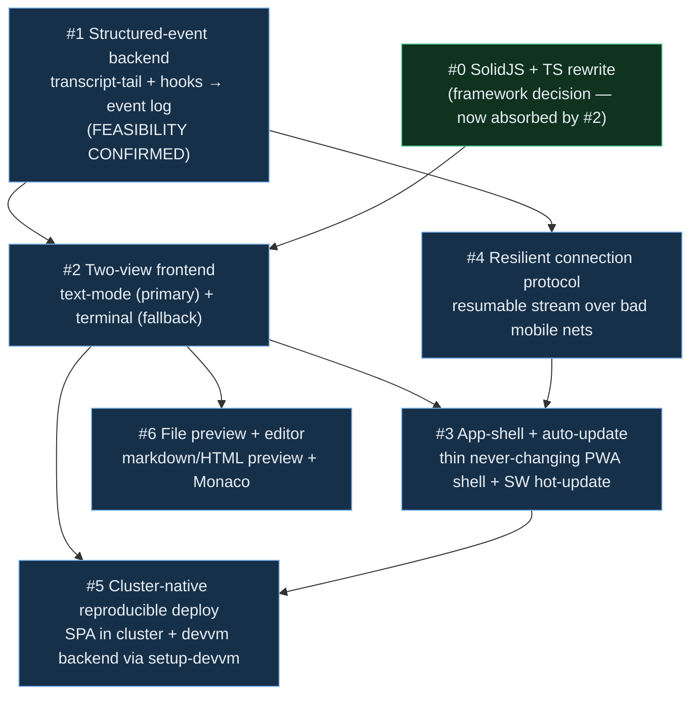

# terminal-lobby v2 — roadmap & tracker

**Status:** Living tracker (updated as we tackle pillars one by one)
**Date:** 2026-07-19 · **Owner:** wizard

## Build progress (updated 2026-07-19) — landed on `master`, all verified green

- **Pillar #1 `session-events` — COMPLETE (backend).** Runnable `:7685` service:
  transcript-tail → SSE (resume + heartbeat), prompt/cancel tmux injection
  (turn-gated), permission control plane (3 safety cases), loopback-guarded hooks,
  systemd unit. **27 Go tests** incl. real tmux integration. *Live activation is
  GATED* — the org-wide PreToolUse hook touches emo's sessions + adds per-tool-call
  latency (needs Viktor's go; see `session-events/DEPLOY.md`).
- **Pillar #2 `frontend-v2` — IN PROGRESS.** Solid+TS foundation + two-view XOR
  switch + MessagesTimeline renderer + resumable SSE client + **lobby sidebar**
  (session list, state dots, projects, drag-reorder, CRUD via tmux-api, layout
  persistence) + e2e Vite proxy + a real-session-events integration test. **61 tests**,
  builds to one file, browser-verified against the real tmux-api (13 live sessions).
  Remaining: terminal-view (ttyd iframe) wiring, settings/toasts/gallery/mobile/
  keybindings/PWA parity.
- **Pillar #6 `file-api` — BACKEND DONE.** list/read/write + path-traversal
  defenses, tested. Frontend preview/editor surface pending.
- **#3 (auto-update shell), #4 (resilient protocol — SSE resume/backoff already in
  the client), #5 (deploy — artifacts written, gated)** remain.

Build model: fan-out workflows across independent pillars; **sequential** waves
within the single `frontend-v2` app (parallel edits would collide). Each wave:
build → independent verify → I re-run gates → merge green.

The scope grew from "adopt a framework" into a coherent **v2**. This doc is the
single source of truth for the pillars, their dependencies, and the agreed order.
We tackle them **one at a time**; each gets its own spec → plan.

## Vision — the convergent architecture

A **cluster-served SPA** (reproducible, GitOps) with a **thin auto-updating shell**,
whose **primary view is a structured text/chat rendering** of a Claude session, with
the **xterm/ttyd terminal as a live fallback** for full-TUI work (workflows,
subagents, sixel). The dynamic core (tmux + Claude CLI + the Go services) stays on
the devvm; the text plane is sourced by **tailing Claude Code's transcript JSONL +
hooks**, rendered with the **claude-breakglass** attach/event-log pattern.

## Pillars

| # | Pillar | Status | Depends on | Notes |
|---|--------|--------|-----------|-------|
| 0 | **Frontend framework** — SolidJS + TypeScript | **Decided** | — | Plan exists; now *absorbed and redefined* by #2 (it's a two-view app, not just terminal chrome). Keep 9-theme CSS-var system; TS. |
| 1 | **Structured-event backend** — live event source + drive for text-mode | **Designed** (pending sign-off) | — | New Go service `session-events` (:7685, sibling to tmux-api): tail transcript JSONL + hooks → normalized events over **SSE** (Last-Event-ID resume); **full-interactive same-session model** — prompt/cancel via tmux pty inject; **permissions via PreToolUse hook → web decision** (fail-closed; falls through to terminal prompt when no text client). Reuse breakglass event-schema + fold. Caveat: hook approvals aren't in the JSONL → need a separate durable store. |
| 2 | **Two-view frontend** — text-mode (primary) + terminal fallback | **Designed** (switch UX) | #0, #1 | Switch = segmented `Text \| Terminal` in the header (`Cmd/Ctrl-J`), **full-swap XOR** (both views mounted, CSS-hidden → preserves ttyd WS + tmux attach + scroll), activity dot on the inactive mode, per-session/per-device state; **auto-fallback** to terminal on TUI/alt-screen (**user-configurable** + per-turn dismissable). Structured render adopts T3's MessagesTimeline engine (pure logic module + virtualized renderer). See `2026-07-19-t3-two-view-mode-switch-research.md`. |
| 3 | **App-shell + auto-update** — thin shell, zero-touch updates | **Designed** | #2, #4 | **Frozen thin app-shell** (loader+manifest+icons; never changes → iOS never reinstalls) boots a **versioned cluster-served bundle** via a version manifest. Update = **SSE-pushed version signal** (poll fallback) → background-fetch → **zero-touch lossless apply-on-idle** (state is server-side; never interrupts a turn). **SW stays push-only** (no fetch handler → no stale-bytes; no offline, fine for a live tool). Carries over the healer's defer-until-idle logic. |
| 4 | **Resilient connection protocol** — robust over bad mobile nets | **Designed** | #1 | **SSE** event stream + POST control (terminal keeps ttyd WS). Unified resumable cursor over transcript + a durable hook-event store (`Last-Event-ID`); backoff+jitter reconnect + instant-retry-on-visible/online; ~20s SSE heartbeats; **snapshot+delta** for large gaps; **offline input queued** with optimistic echo; only the active view holds a live connection (XOR). |
| 5 | **Cluster-native reproducible deploy** | **Decided** | #2, #3 | **S2 confirmed** (multi-view SPA + auto-update trigger it): cluster-served **thin shell + versioned bundles** behind Traefik/Authentik, auth carve-out via `ingress_factory`; **GHA build** (ADR-0002 → ghcr/artifacts; one-time GitHub-mirror onboarding) → **GitOps deploy** (git-sync/Keel). **Devvm backend** (ttyd + tmux-api + `session-events` + file API) reproducible via **`setup-devvm.sh` self-deploy** + CI-built binaries + CI-built patched ttyd — kills the out-of-band deploy. |
| 6 | **File preview + editor** — rendered markdown & inline HTML preview + code editor | **Designed** | #0, #2 | **Session-integrated** (not a full IDE): click a file path in the transcript / recent-files → overlay opens rendered **markdown** (reuse md+mermaid stack), **sandboxed-iframe HTML**, or **Monaco** for code, quick-edit + save. Needs a per-user **file read/write/list API** on the devvm (auth like tmux-api). No full file-tree — that's what the terminal / real VS Code are for. |

## Agreed sequence

**#1 → #2 → (#3 ‖ #4) → #6 → #5.** De-risk the event stream first (done: feasible),
then build the two-view frontend, then auto-update + the resilient protocol (they
share the resumable-stream primitive), then the file preview/editor surface, then
finalize cluster deployment. #0 (Solid/TS) is a decided substrate that #2 builds on.

## Cross-cutting invariants (apply to every pillar)

- **302-feature parity** — the rewrite must not silently drop features. Source:
  `2026-07-17-frontend-feature-inventory.md` (133 red-line/high-risk).
- **Red-line UX** — mouse/wheel/selection/scroll semantics + ADR-0003 copy machinery
  are untouchable; the terminal-view code is verbatim-portable, not "rewrite-worthy."
- **Devvm-immovable core** — tmux + Claude CLI + ttyd + the Go services stay on the
  devvm (sudo-into-OS-users + local tmux sockets). Only static bytes + the text plane
  are cluster-eligible.

## Companion docs

- `2026-07-17-solidjs-frontend-rewrite-design.md` — framework rewrite (pillar #0).
- `2026-07-17-frontend-feature-inventory.md` — the 302-feature parity checklist.
- `2026-07-17-frontend-deploy-options.md` — BUILD/SERVE/DEPLOY analysis (feeds #5).
- `2026-07-19-t3-two-view-mode-switch-research.md` — T3 study → the pillar #2 switch design.

## Decision log

- **Decided:** SolidJS + TS · keep 9-theme CSS-var system · big-bang from-scratch
  (with golden-master gate) · unified v2 · de-risk event stream first · text-mode
  primary with terminal fallback.
- **Decided (pillar #1):** full-interactive text-mode · **same-session injection**
  (Claude stays in tmux; terminal = live fallback of the same session) · new Go
  `session-events` service · SSE + transcript-tail + hooks · hook-mediated permissions.
- **Decided (pillar #2 switch):** segmented `Text | Terminal` · `Cmd/Ctrl-J` ·
  **full-swap XOR** (both mounted, CSS-hidden) · activity dot on inactive mode ·
  per-session/per-device state · **user-configurable auto-fallback** to terminal.
- **Decided (pillar #4):** SSE event stream + POST control (terminal keeps ttyd WS) ·
  unified resumable cursor (transcript + durable hook-event store) · backoff+jitter
  reconnect + instant-retry-on-visible/online · ~20s heartbeats · **snapshot+delta** for
  large gaps · **offline input queued** (optimistic echo) · active-view-only connection.
- **Decided (pillar #3):** frozen thin app-shell (iOS no-reinstall) + versioned cluster
  bundle via a version manifest; SSE-pushed update signal (poll fallback); zero-touch
  lossless apply-on-idle; SW push-only (no fetch handler, no offline).
- **Decided (pillar #6):** session-integrated preview/edit overlay (not a full IDE) —
  transcript-path/recent-files → rendered md (reuse stack) / sandboxed-iframe HTML /
  Monaco quick-edit; per-user file read/write/list API on the devvm.
- **Decided (pillar #5):** cluster-served SPA (S2) — thin shell + versioned bundles
  behind Traefik/Authentik (carve-out via `ingress_factory`); GHA build → GitOps deploy;
  devvm backend reproducible via `setup-devvm.sh` self-deploy + CI-built binaries/ttyd.
- **DESIGN SWEEP COMPLETE — all 6 pillars decided.** Next: write specs →
  implementation plans, starting with pillar #1 (`session-events`), the foundation.
