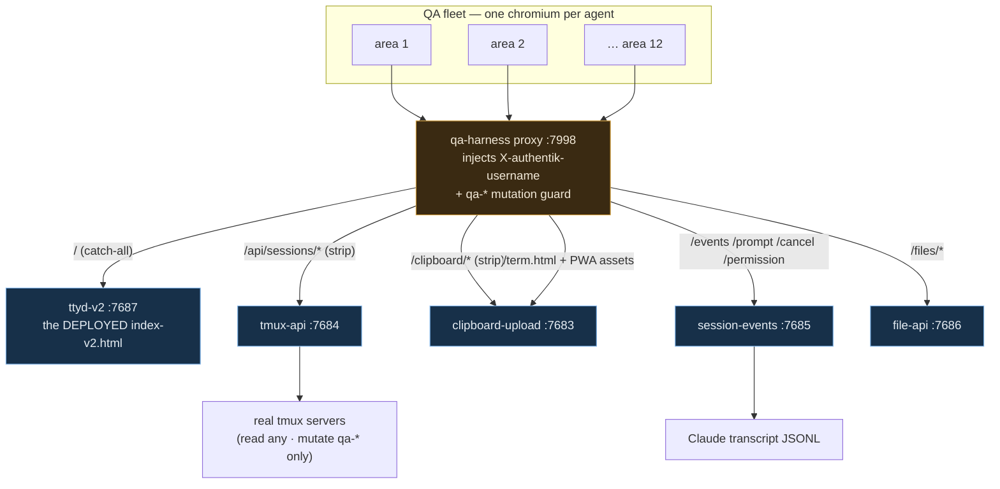
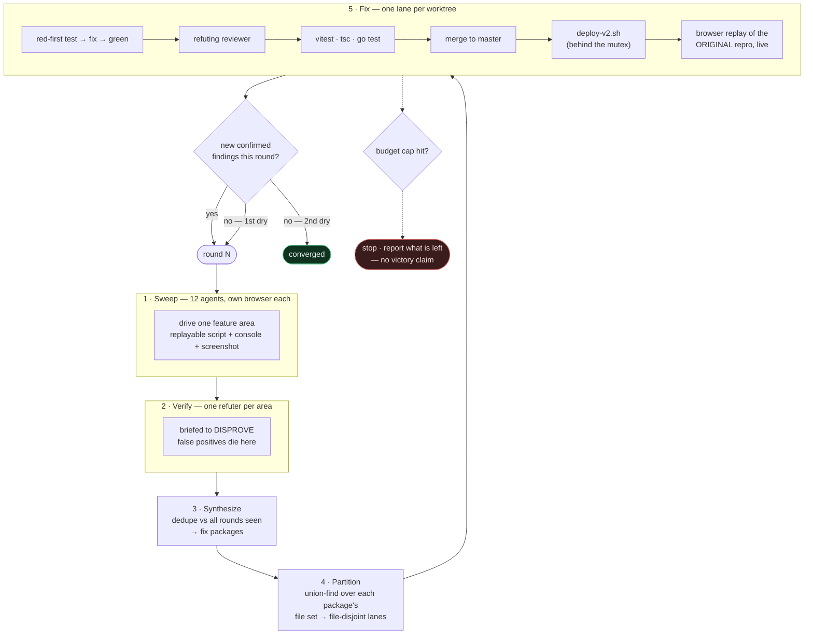

# Dev-tier QA → fix loop: iterate terminal-dev until it converges

**Status:** Approved design, pending execution
**Date:** 2026-08-06 · **Owner:** wizard
**Grilled from:** *"let's check the dev tier. run an agent to interact and find
things that don't fully work — eg the console view. create a workflow to iterate
until we fix all bugs and features that don't work. keep releasing on the dev tier."*

## Goal

Drive `terminal-dev.viktorbarzin.me` (the v2 SolidJS SPA) the way a user would,
find everything that is broken or that the docs promise but the code doesn't
deliver, fix it, and ship each fix to the dev tier — repeating until two
consecutive sweeps surface nothing new.

```stats
4 | findings confirmed before the fleet starts
12 | sweep areas, one browser each
~25-30 | agents per round
2 | consecutive dry rounds to converge
5 | round cap
```

"The console view" resolved to the **Text view**: the `Text` segment of the
`[ Text | Terminal ]` switch — the structured transcript render (MessagesTimeline,
composer, permission panel). No such string exists in the codebase; this document
uses **Text view** throughout.

## What the dev tier actually is

| Piece | Port | Shared with the stable tier? |
|---|---|---|
| `ttyd-v2` — serves the single-file v2 SPA | 7687 | No — dev-tier only |
| `tmux-api` | 7684 | **Yes** — also backs `terminal.viktorbarzin.me` |
| `clipboard-upload` | 7683 | **Yes** |
| `session-events` | 7685 | No — the vanilla page never calls it |
| `file-api` | 7686 | No — v2 only |

Released by `./scripts/deploy-v2.sh`, which is strictly additive: it builds the
SPA, stamps `TL_BUILD`/`TL_ASSET`, installs `index-v2.html`, and restarts only
`ttyd-v2`.

`bob` and `carol` also have sessions on this box.

## Findings already confirmed during the grill

These were verified before the fleet started, and seed round 1.

### A — the Terminal view does not load on the dev tier

`config.ts` sets `TERMINAL_BASE = "/term.html"`. The ingress
(`infra/stacks/terminal/terminal-dev.tf`) routes `Path(/term.html)` to
**clipboard-upload**, whose `publicAssets` whitelist contains ten entries —
manifest, four icons, `sw.js`, four fonts — and `/term.html` is not among them.

```
$ curl -s -o /dev/null -w "%{http_code}" http://127.0.0.1:7683/term.html
404
```

The file exists at the asset dir (`/usr/local/share/ttyd/term.html`); it is not
in the whitelist. It is also stale: the deployed copy is dated 2026-07-20, the
repo copy 2026-08-04, and no deploy script ships it — `vite build` emits
`dist/term.html`, `deploy-v2.sh` copies only `out/index-v2.html`, and `deploy.sh`
does not mention it.

### B — permission Approve/Deny is unroutable

`permissionUrl()` posts to `/permission/<reqId>`. The session-events IngressRoute
matches `PathPrefix(/events/) || PathPrefix(/prompt/) || PathPrefix(/cancel/)`
only, so `/permission/…` falls to the ttyd-v2 catch-all. Independently,
`/etc/claude-code/managed-settings.json` has no references to `:7685`, so the
`PreToolUse` hook that would emit a permission request is not wired — the panel
currently has neither an input nor an output path.

### C — two services have no deploy path

`session-events` and `file-api` are shipped by neither script. Both binaries were
installed out-of-band on 2026-08-03 00:25, so what is running may already be
behind master (not yet verified — see Open questions). `deploy-v2.sh`'s header
comment describes them as "the SAME shared files + services that deploy.sh …
already ship", which does not match what the scripts do today.

### D — documentation drift, both directions

`frontend-v2/README.md` lists gallery, command palette, keybindings, PWA and
soft-keys under "Foundation stubs / follow-ups", but `Gallery.tsx`,
`CommandPalette.tsx`, `keybindings/`, `pwa/` and `SoftKeys.tsx` all exist. The
v2 source contains zero TODO/FIXME markers.

## Decisions

| # | Decision | Rationale |
|---|---|---|
| 1 | "Console view" = the **Text view** | The term is not in the codebase; this fixes the vocabulary |
| 2 | Auto-release the **SPA + session-events + file-api**; land but hold `tmux-api`/`clipboard-upload`/`ttyd` | The first three are dev-tier-only, so a restart cannot disturb the stable tier or other users. The last three are shared |
| 3 | Agents drive the **real deployed artifact against the real backends**, locally | Claude Code runs *on* the devvm (`192.0.2.10`); all six ports are on localhost. No tunnel, no Authentik hop |
| 4 | **Prefix-scoped mutation guard, enforced in the proxy** | Agents may read and attach any session, but may only create/rename/kill/prompt `qa-*`. Enforced as a 403 at the proxy rather than as an instruction in a brief, so it holds independently of how any agent reads its brief |
| 5 | Scope = **broken + broken-promise** | Anything built-but-broken, plus anything the docs claim works and doesn't. Unstarted pillars (#3 app-shell, #5 cluster deploy) and the unwired multi-user project store are reported as a gap list, not built |
| 6 | Stop after **two consecutive dry rounds**, budget-capped | A plain counter misses the tail. If the cap is reached first, the run reports what remains open |
| 7 | Release **per fix lane** | Fastest feedback. Made cheap by skipping `npm ci` when the lockfile is unchanged and skipping the restart when the artifact is byte-identical; serialized behind a deploy mutex |
| 8 | Sweep with **per-agent isolated browsers** | The Playwright MCP is one shared browser; a fan-out over it collides and serializes. Each agent gets its own chromium context via a shared driver module |
| 9 | Per-lane gate: **red-first test → vitest + tsc + go test → refuting reviewer → post-deploy browser replay** | The replay is what catches "fixed in the harness, still broken in the real build" — the `term.html` class of bug |
| 10 | **~25–30 agents per round** | 12 sweep areas + per-area verifier + synthesis + fix lanes with reviewers |

## Architecture

The agents reach the real deployed SPA through a local proxy that stands in for
the Traefik ingress — same path routing, same header injection, plus the
mutation guard the ingress has no reason to carry.



The proxy deliberately routes `/permission` to session-events even though the
production ingress does not — that is finding B, and routing it locally is what
lets the fleet exercise the panel while the ingress fix is in flight. The
divergence is recorded so the post-deploy replay checks the real path.

## The loop



Dedupe is against **everything seen across all rounds**, not against what was
confirmed — otherwise a finding the verifier rejected reappears every round and
the loop never converges.

## Sweep areas

Twelve, each owned by one agent with its own browser and its own `qa-<area>`
sessions:

1. Text view — timeline rendering: turn folding, tool rows, expand-to-raw, markdown, mermaid, inline images
2. Text view — composer: send, Send↔Stop morph, `/prompt` and `/cancel` control channel, turn gating
3. Text view — permission panel (findings B)
4. Terminal view + the `[Text | Terminal]` XOR switch, iframe attach, ttyd WS (finding A)
5. Sidebar — session list, state dots, working timer, shared-with-me
6. Sidebar — projects, grouping, drag-reorder, layout persistence
7. Session CRUD — create, dup guard, rename, kill, restore
8. File preview + editor — file-api list/read/write, CodeMirror, save
9. Images — paste, drop, upload, `show-image` register, gallery
10. Keyboard — keybindings engine, chords, command palette, shortcuts help
11. Notifications — title badge, favicon, system notifications, push/PWA, attention
12. Shell — settings, nine themes, prefs roaming, self-update healer, telemetry, service worker, mobile soft-keys

## Prerequisites, built before round 1

1. **`scripts/qa-harness.py`** — the proxy above: ingress-faithful path routing,
   header injection, and the `qa-*` mutation guard returning 403 on any
   `DELETE`/rename/prompt aimed elsewhere, with file-api writes confined to a
   scratch dir.
2. **`scripts/qa-driver.mjs`** — the shared playwright-core module giving each
   agent an isolated context, console capture, screenshot-on-failure, and a
   replayable script per finding.
3. **A deploy path for `session-events` and `file-api`** — decision 2 authorizes
   releasing them, and today nothing can.
4. **`deploy-v2.sh` made cheap and honest** — skip `npm ci` on an unchanged
   lockfile, skip the `ttyd-v2` restart when the artifact is byte-identical, ship
   `term.html`, and correct the false claim in its header comment.
5. **One presence claim** (`service:ttyd-v2`) held for the whole run, rather than
   one per deploy.

## Safety

- The mutation guard lives in the proxy. Agents cannot kill a real session even
  if a brief is misread.
- `tmux-api`, `clipboard-upload` and `ttyd` changes are landed on master and
  reported, never deployed — they carry stable-tier and other-user blast radius.
- Deploys are serialized behind a mutex and always run from a clean master
  checkout after the lane lands, never from a worktree (`deploy-v2.sh` stamps
  `git rev-parse HEAD` from the repo root).
- Each lane is its own worktree on `wizard/<topic>`, landing to master directly
  per the standing execution policy.

## Budget and stop

Two consecutive dry rounds, capped at **5 rounds or ~4 h wall clock**, whichever
comes first. On reaching the cap the run stops and reports the open findings.
Anything bounded along the way — a dropped finding, a skipped area, a lane that
could not be made green — is named in the final report rather than omitted.

## Open questions

Separating what is verified from what is inferred, so nothing here reads as
settled that isn't:

- **Verified by direct check:** finding A's 404 and the whitelist contents;
  finding B's ingress match expression and the absent `:7685` hook references;
  finding C's absence of a deploy path in both scripts; finding D's file
  existence.
- **Inferred, not yet checked:** whether the running `session-events` and
  `file-api` binaries actually differ from master (dates suggest it; a rebuild
  and compare would settle it). Round 1 checks this before rebuilding them.
- **Unknown until the sweep runs:** how much of the Text view works once the
  Terminal view and permission routing are repaired — findings A and B may have
  been masking further issues behind them, or may account for most of what you
  noticed.

## Out of scope

- Roadmap pillars #3 (app-shell + auto-update) and #5 (cluster-native deploy).
- Wiring the multi-user global project store, sharing, and co-ownership into v2.
- Bugs that exist only in the vanilla tier at `terminal.viktorbarzin.me`.
- Enabling the org-wide `PreToolUse` hook for session-events — it fires in every
  user's Claude session and is blocking, so it stays gated per
  `session-events/DEPLOY.md`.

The first two are reported as a gap list at the end of the run.
