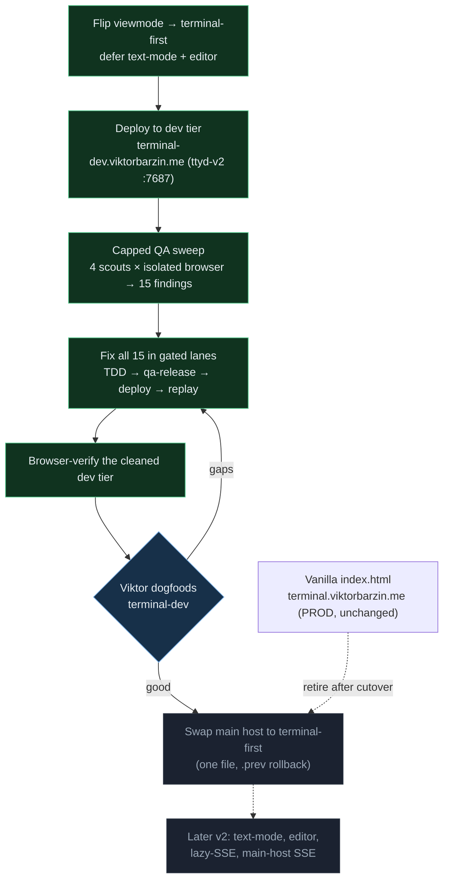

# terminal-lobby v1 — the terminal-first cut

**Status:** Executing — dev tier verified, network-hardened, cutover prerequisites done;
awaiting Viktor's dogfood before the flip
**Date:** 2026-08-08 · **Owner:** wizard
**Supersedes the direction of:** the 2026-07-19 "v2 roadmap" (text-primary, 6 pillars)

## The reframe

The 12,691-line vanilla `frontend/index.html` was being replaced by a SolidJS + TS
app. Along the way the rewrite grew into a new product: text-mode chat as
the **primary** view, a new `session-events` SSE backend, a file editor, auto-update,
a resilient protocol. On 2026-07-20 that text-primary build was cut live to
`terminal.viktorbarzin.me` and reverted the same day — the transcript didn't
stream and the lobby broke (SSE buffered through Cloudflare; never testable because
the devvm can't hairpin to its own public URL). In Viktor's assessment it was unusable.

**v1 is the maintainability rewrite, nothing more:** a SolidJS lobby + terminal that
reproduces today's app. Everything else stays alive on the canary as a later v2.

## Decisions

| # | Decision | Why |
|---|----------|-----|
| 1 | **v1 = terminal-first.** `viewmode.ts` defaults to the Terminal view; text-mode is opt-in per session (`Cmd/Ctrl-J`). | Boots into the app you know. Rides only the transports the vanilla page already uses through Cloudflare (ttyd WS + tmux-api), which removes the SSE-through-Cloudflare failure mode. |
| 2 | **Defer** text-mode (`session-events`), the file editor (`file-api`), auto-update, resilient protocol. | The only stated driver was maintainability; the parity rewrite delivers it. The deferred surfaces stay dormant on the canary, promoted in a real v2. |
| 3 | **Option A — dev-tier first.** Prove terminal-first on `terminal-dev.viktorbarzin.me` (same Cloudflare + Authentik ingress), then swap the main host with instant `.prev` rollback. | Retires the untested-real-path exposure behind the 2026-07-20 revert; the main-host cutover becomes a one-file, reversible move. |
| 4 | **Resume via a capped QA fix-loop**, scoped to the 8 v1 surface areas. | A prior session's loop OOM-killed itself: **agent count (~25–30) was uncapped** — the browser flock only caps browsers at 6. Resumed with ≤5 agents. |

## The staged migration

## What shipped

Terminal-first is flipped, deployed, and **browser-verified** on the dev tier, and
**all 15 QA-sweep findings are fixed + deployed**. By cluster:

| Cluster | Findings | Fix |
|---|---|---|
| **Terminal attach command** | exit-resurrect returns the wrong command; re-attach rebuilds the URL from the live dropdown | arg2 gated on `creating`; a re-attach sends the inert placeholder |
| **Chord / overlay discipline** | gallery won't Esc-close while attached; iframe-forwarded chords bypass when-clauses; chords fire behind the Settings modal; Ctrl+J behind the palette | one shared `keyContext` consulted by every key path (window, iframe-forward, Ctrl+J); overlays take focus on open |
| **Sidebar reactivity** | full DOM rebuild every poll; double-click-rename dead on unselected cards | `stabilizeModel` reuses unchanged group/card objects so the keyed `<For>` keeps its nodes |
| **Notification badges** | "unseen done" never clears; favicon out of sync | new `store/visits.ts` visit-tracking feeding the real `isUnseen` into title + favicon |
| **Layout race** | a second tab silently reverts your move | frontend conflict detection → "Layout changed elsewhere" toast |
| **Terminal status / telemetry** | terminal bar showed the deferred text-view's "no transcript"; gallery telemetry fired before its guards | badge scoped to `mode === "text"`; `track()` moved past the guards |

## Verified end-to-end in a browser

An agent drove the deployed dev tier as a user (isolated chromium through the
harness proxy, `qa-*` sessions only). Terminal, lobby/CRUD, keyboard/overlays,
settings and the nine themes, and notifications all passed; typing was confirmed
to reach the pty via `tmux capture-pane`, and the theme switch was observed
recolouring the framed terminal along with the page.

Thirteen of the fifteen fixes above re-verified live. Of the other two: the
project-grouping fix could not have its precondition set up through the proxy
(assigning a session the proxy does not own returns 403), so it rests on its unit
tests; and double-click-rename turned out to be only partly fixed — `stabilizeModel`
removed the poll-churn cause, but selecting a card still mounted the terminal,
whose auto-focus stole the just-opened rename box and its `onBlur` closed it. The
terminal now declines to take focus while a lobby text field has it.

Known coverage gaps: OSC52 copy/paste is blocked
by the headless clipboard, card-level HTML5 drag is not synthesizable in
Playwright (group reorder was verified instead), and Restore needs a different
setup than "kill, then restore" to exercise.

## Surviving slow and unreliable networks

A read-only investigation mapped the connection stack across both frontends and
found seventeen gaps; sixteen are fixed on both, one is deferred with a reason.
The existing good parts were confirmed intact: the ttyd flow-control patch, the
`-P 30` keepalive, the battery saver with its three race guards, the
`sessionStillExists` kill-guard, and the stale-tab healer.

| Gap | Was | Now |
|---|---|---|
| **Half-open connection (the signature mobile failure)** | The `-P 30` keepalive is server→client and the browser hides ping/pong, so a black-holed path left `readyState === OPEN` forever: a frozen terminal swallowing keystrokes, with no reconnect ladder running because nothing reported a drop. | An active **liveness watchdog**: every 25s a same-origin `/token` round trip plus `bufferedAmount` around a zero-length INPUT frame; three strikes hands the drop to the ordinary kill-guarded ladder. The probe frame is a verified pty no-op (ttyd source + measured). A black-hole rig showed the page believing it was connected at t+56s before, and the watchdog firing at t+63s after, reconnecting 5s after the path returned. |
| **Unbounded connect hops** | Neither the `/token` fetch nor the WebSocket handshake had a deadline, and while either was in flight `retryTimer` was null — which made the existing `online`/visible instant-retry a no-op precisely when it was needed. | 8s on the token hop, 10s on the handshake, and `retryNow()` abandons a stalled attempt instead of returning early. |
| **Synchronised reconnects** | The ladder was a fixed 1/2/4/8/16s table with no randomisation, so every client retried in lockstep after a deploy or partition. | Full jitter, ported from the SSE client. |
| **Input lost while disconnected** | Keystrokes, pastes and soft-key presses were dropped silently. | The connection pill flashes and a throttled toast explains; up to 4 KB is held and replayed if the socket returns within 3s, discarded with a clear message if not, and cleared on session end and battery suspend. |
| **A dropped poll erased the lobby** (vanilla) | One failed 5s poll replaced every session card with `Error: Failed to fetch`, while the tmux sessions themselves were still running. | The last-known-good list stays; a non-destructive note reports the staleness; the empty state renders only when nothing has ever loaded. |
| **Polls piled up and applied out of order** | `setInterval` fired regardless of whether the previous request had answered; the last response to *arrive* won. Deadlines were absent (47 fetch sites, no AbortController). | A self-scheduling loop with an in-flight guard and a monotonic sequence tag, 8s deadlines at the single choke point (uploads exempt), 5→10→20→30s failure backoff, and an `online` wake. |
| **A stalled SSE probe stranded the stream** (v2) | The failure-classification probe was unbounded, and while it awaited, neither a source nor a timer existed — a probe that never settled hung the client permanently. | The probe is bounded; an unsettled probe becomes a plain "unknown" and routes to the reconnect ladder. A source silent past 45s is rebuilt on wake rather than trusted. |

The one deferral is the **warm-frame pool** (instant session switching). It is not
shipped because the `__tl*` bridges are installed on mount and never re-asserted
on activation: with two mounted views the hidden one keeps them, so soft-key
bytes would reach the wrong session's pty. It needs the bridges made
activation-scoped first — worth doing on its own merits, since "exactly one
mounted SessionView" is currently a load-bearing undocumented assumption.

The transport lives in two files, so the mirror is now enforced by a test rather
than by a careful diff: `frontend-v2/test/ws-parity.test.ts` compares the
sentinel-delimited blocks, the liveness watchdog, and the transport constants
between `index.html` and `term.html`. The constants are included because they sit
outside the sentinel blocks: an earlier draft of the test passed clean against a
deliberately-injected change to one of them.

## The rig (reusable)

- **`scripts/qa-harness.py`** — ingress-faithful proxy on `:7998`: injects the Authentik
  header, routes to the real localhost backends, and **guards mutations to `qa-*`
  sessions** (a writable ttyd-WS attach to a non-`qa` session is a 403 *by design*).
- **`scripts/qa_driver.py`** — `QaAgent`: one isolated headless chromium per agent,
  console/request capture, `findings.json` per area.
- **`scripts/qa-release.sh`** — lands one lane: merge → gate (tsc + vitest + go test) →
  push `origin/master` → `deploy-v2.sh` (restarts only ttyd-v2). Shared-tier changes
  (tmux-api / clipboard-upload / ttyd) land but are **not** auto-deployed.

## Ready for the cutover

The prerequisites are done:

- **`v-vanilla-final` tagged** — the rollback point, carrying the vanilla frontend
  with the full resilience kernel, as prod served it before any cutover.
- **Mobile double-toolbar fixed** — a phone showed two stacked soft-key bars in
  terminal mode, because `term.html` built its own while the SPA drew one over it.
  Framed ⟹ the SPA owns the toolbar, so the framed page now suppresses both its bar
  and its height reservation. A bare deep-linked `/term.html?arg=` tab keeps its own.
- **The transcript stream is lazy** — it opens when Text mode is first shown rather
  than on mount, so a terminal-first session no longer spends an SSE connection (and,
  on a mobile network, a reconnect ladder) on a view it never displays. It also ends
  the `/events` 404 that every plain-shell session logged.
- **Webfonts load on the dev tier** — the SPA named JetBrains Mono and DM Sans but
  carried no `@font-face`, so all chrome text fell back to a system face.
- **Parity is tested**, not diffed by hand (above).

What remains is **dogfooding `terminal-dev`** — ideally on a phone and a poor
connection, since that is what the resilience work targets — and then the flip:
one file, with `.prev` and the tag behind it.

## Deferred, with reasons

- **Text mode, the file editor, auto-update, cluster-native deploy (pillar #5)** — the
  later-v2 surfaces. Re-enable the quarantined `sse.integration.test.ts` when text mode
  un-defers; it needs a scratch `tmux -L` server, because the SessionStart registry now
  lives in tmux and rejects a fabricated session.
- **Warm-frame pool** — needs the `__tl*` bridge-ownership refactor first (above).
- Minor and not a v1 defect: there is no lobby-level copy chord; terminal copy/paste
  rides the ttyd page's own OSC52, as in vanilla.

## Open questions

- The liveness probe adds one `/token` GET per visible terminal every 25s, through
  Traefik and Authentik. Negligible at current tab counts; worth a look if many tabs
  are ever open at once.
- Traefik and Cloudflare idle timeouts are not set in-repo. The 30s keepalive margin
  is chosen against upstream defaults (180s / ~100s), asserted by comment rather than
  by configuration.
