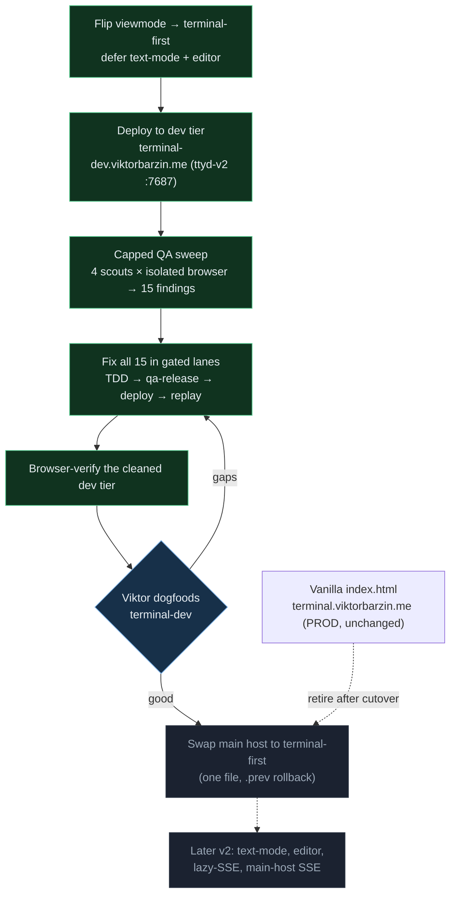

# terminal-lobby v1 — the terminal-first cut

**Status:** Executing — dev tier clean & verified; live cutover pending Viktor's dogfood
**Date:** 2026-08-08 · **Owner:** wizard
**Supersedes the direction of:** the 2026-07-19 "v2 roadmap" (text-primary, 6 pillars)

## The reframe

The 12,691-line vanilla `frontend/index.html` was being replaced by a SolidJS + TS
app. Along the way the *rewrite* quietly became a *new product*: text-mode chat as
the **primary** view, a new `session-events` SSE backend, a file editor, auto-update,
a resilient protocol. On 2026-07-20 that text-primary build was cut live to
`terminal.viktorbarzin.me` and **reverted the same day** — the transcript didn't
stream and the lobby broke (SSE buffered through Cloudflare; never testable because
the devvm can't hairpin to its own public URL). It "became completely unusable."

**v1 is the maintainability rewrite, nothing more:** a SolidJS lobby + terminal that
reproduces today's app. Everything else stays alive on the canary as a later v2.

## Decisions

| # | Decision | Why |
|---|----------|-----|
| 1 | **v1 = terminal-first.** `viewmode.ts` defaults to the Terminal view; text-mode is opt-in per session (`Cmd/Ctrl-J`). | Boots into the app you know. Rides only the transports the vanilla page already uses through Cloudflare (ttyd WS + tmux-api) — the SSE-through-Cloudflare failure cannot recur. |
| 2 | **Defer** text-mode (`session-events`), the file editor (`file-api`), auto-update, resilient protocol. | The only stated driver was maintainability; the parity rewrite delivers it. The deferred surfaces stay dormant on the canary, promoted in a real v2. |
| 3 | **Option A — dev-tier first.** Prove terminal-first on `terminal-dev.viktorbarzin.me` (same Cloudflare + Authentik ingress), then swap the main host with instant `.prev` rollback. | Retires the "untested real path" that bit us; the main-host cutover becomes a one-file, reversible move. |
| 4 | **Resume via a capped QA fix-loop**, scoped to the 8 v1 surface areas. | A prior session's loop OOM-killed itself: **agent count (~25–30) was uncapped** — the browser flock only caps browsers at 6. Resumed with ≤5 agents. |

## The staged migration

## What shipped

Terminal-first is flipped, deployed, and **browser-verified** on the dev tier, and
**all 15 QA-sweep findings are fixed + deployed** (890 unit tests green). By cluster:

| Cluster | Findings | Fix |
|---|---|---|
| **Terminal attach command** | exit-resurrect returns the wrong command; re-attach rebuilds the URL from the live dropdown | arg2 gated on `creating`; a re-attach sends the inert placeholder |
| **Chord / overlay discipline** | gallery won't Esc-close while attached; iframe-forwarded chords bypass when-clauses; chords fire behind the Settings modal; Ctrl+J behind the palette | one shared `keyContext` consulted by every key path (window, iframe-forward, Ctrl+J); overlays take focus on open |
| **Sidebar reactivity** | full DOM rebuild every poll; double-click-rename dead on unselected cards | `stabilizeModel` reuses unchanged group/card objects so the keyed `<For>` keeps its nodes |
| **Notification badges** | "unseen done" never clears; favicon out of sync | new `store/visits.ts` visit-tracking feeding the real `isUnseen` into title + favicon |
| **Layout race** | a second tab silently reverts your move | frontend conflict detection → "Layout changed elsewhere" toast |
| **Terminal status / telemetry** | terminal bar showed the deferred text-view's "no transcript"; gallery telemetry fired before its guards | badge scoped to `mode === "text"`; `track()` moved past the guards |

## The rig (reusable)

- **`scripts/qa-harness.py`** — ingress-faithful proxy on `:7998`: injects the Authentik
  header, routes to the real localhost backends, and **guards mutations to `qa-*`
  sessions** (a writable ttyd-WS attach to a non-`qa` session is a 403 *by design*).
- **`scripts/qa_driver.py`** — `QaAgent`: one isolated headless chromium per agent,
  console/request capture, `findings.json` per area.
- **`scripts/qa-release.sh`** — lands one lane: merge → gate (tsc + vitest + go test) →
  push `origin/master` → `deploy-v2.sh` (restarts only ttyd-v2). Shared-tier changes
  (tmux-api / clipboard-upload / ttyd) land but are **not** auto-deployed.

## Open / next

- **Cutover** the main host once Viktor is happy dogfooding `terminal-dev`.
- **Deferred to v2:** text-mode (make the SSE connection *lazy* — connect only when Text
  is opened — before any main-host SSE), the file editor, auto-update, resilient protocol.
- **Follow-up:** re-enable the quarantined `sse.integration.test.ts` (stand up a scratch
  `tmux -L` server) when text-mode is un-deferred — the SessionStart registry now lives
  in tmux, so it 500s for a fabricated session.
- Minor observed (not a v1 defect): no lobby-level copy chord; terminal copy/paste rides
  the ttyd page's own OSC52 (works as in vanilla).
