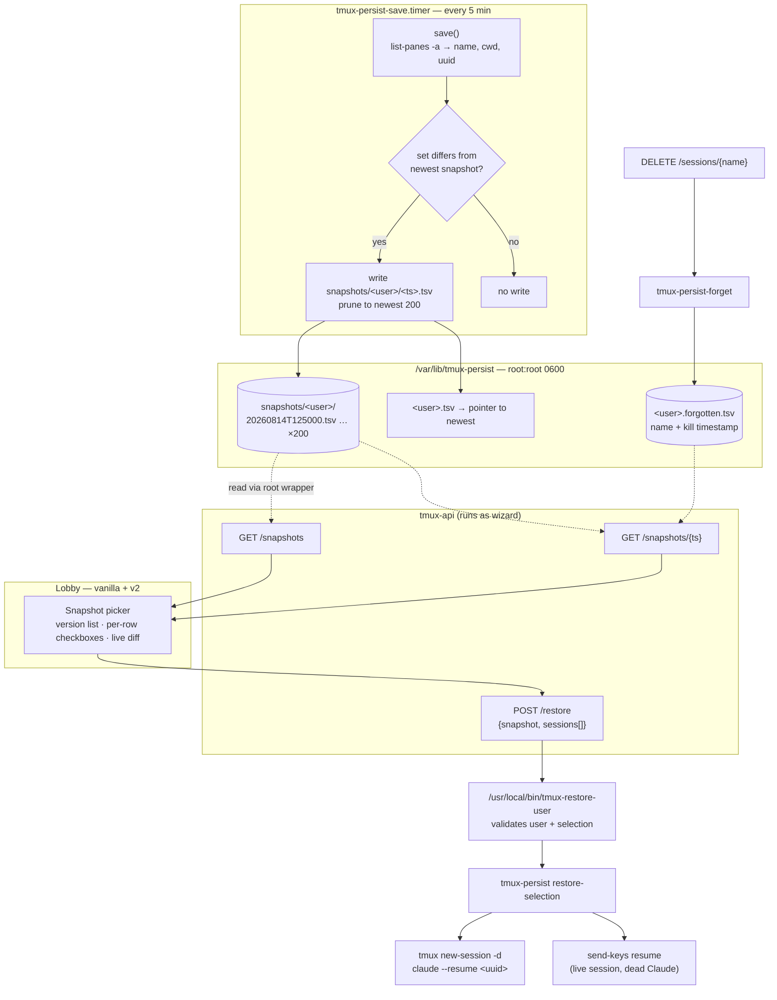
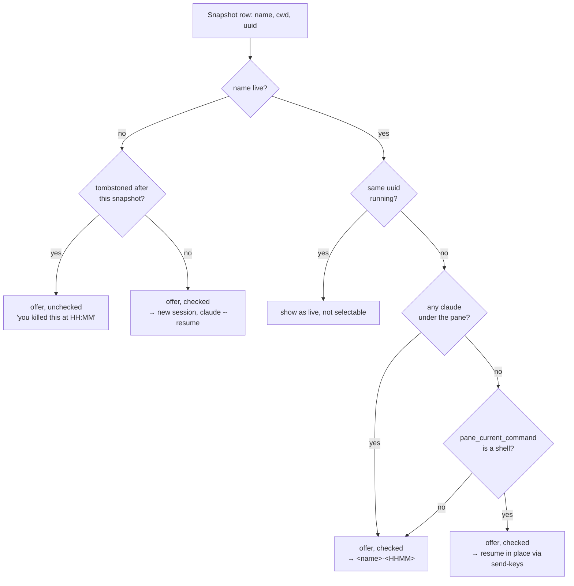

# Restore snapshot picker — design

**Status:** approved, not yet implemented
**Date:** 2026-08-14
**Author:** Viktor (decisions) + Claude (research, drafting)
**Repos touched:** `infra` (`scripts/tmux-persist.sh`), `terminal-lobby` (`tmux-api`, both frontends)

---

## Why

The lobby's "Restore saved sessions" button recreates every session in the caller's
manifest that isn't currently live. It works well for the case it was built for — a
reboot or a dead tmux server — and it has worked for that case since it shipped
on 2026-06-10.

It does not yet cover **partial loss**, where the tmux server survives but the
processes inside individual sessions are killed. That case has now come up twice.

### 2026-08-14, the most recent occurrence

A process inside `t3-serve@wizard.service` grew to 14.2 GiB against the unit's
16 GiB `MemoryMax`. Before the cgroup cap was reached, system-wide `MemAvailable`
fell to 3.5–5%, and `earlyoom` began shedding memory. Its configuration is:

```
--prefer ^(python3|node|chrome|chromium|ugrep|rg|go|claude)$
--avoid  ^(systemd|systemd-.*|sshd|dockerd|containerd|init|t3-dispatch|tmux.*)$
```

`claude` is a preferred victim and `tmux` is protected, so between 12:59:37 and
13:01:29 roughly eleven Claude processes were killed while the tmux server itself
stayed up. Panes running `zsh -lic claude` exited with their process; the sessions
went with them.

The recovery data was intact throughout — transcripts persist at
`~/.claude/projects/<slug>/<uuid>.jsonl` — but the manifest had already been
rewritten. The
5-minute `tmux-persist-save.timer` ticked at 13:00:49, mid-kill, and rewrote
`wizard.tsv` with only the sessions still alive at that moment. A Restore click at
13:03 recreated the five that remained listed.

`save()` does guard against clobbering, but only for the all-dead case:

```bash
n=$(wc -l < "$tmp")
if (( n > 0 )); then
  install -m 0600 "$tmp" "$STATE_DIR/$u.tsv"
```

A partial loss produces `n > 0`, so the guard passes and the dead rows are dropped.

### 2026-07-18, the first occurrence

Same shape, different trigger: a reboot during the Sofia outage, after which the
post-boot save captured only two survivors and replaced a ~14-session manifest.
That incident produced `<user>.history.tsv` (merged on every save, never drops a
dead session) and the `history` / `restore-one` CLI verbs, which is what made
today's recovery straightforward. The remaining gap noted at the time — a UI over
that history — is what this design addresses.

### Observed session counts through the incident

| Time | Sessions live |
|---|---|
| 12:50 | 18 |
| 12:59 | 13 |
| 13:03 | 8 |
| 13:05 | 9 (after the Restore click) |

```stats
18 | sessions before
8 | after the loss
12 | recovered by hand
0 | transcripts lost
```

> [!NOTE]
> Nothing durable was lost in either incident. Claude transcripts persist on disk
> independently of tmux, so recovery is always a matter of finding the right
> `(name, cwd, uuid)` triple and relaunching. This design is about making that
> findable from the lobby instead of the CLI.

---

## What already exists

Two persistence systems run on the devvm today. Both work; they were built for
different jobs and neither currently surfaces version history to the user.

**`tmux-persist`** (`infra/scripts/tmux-persist.sh` → `/usr/local/bin/tmux-persist`)
is root-owned and multi-user, driven by a 5-minute timer, and holds the live
manifest plus the merged history. It backs the lobby button through
`tmux-restore-user`, and `uuid_of_claude()` reads the conversation id from the
process's own argv, which makes per-session attribution reliable.

**tmux-resurrect + tmux-continuum** is per-user and configured from each user's
`.tmux.conf`. It already writes timestamped snapshots — 3,521 files, 46 MB, back to
2026-07-14 for wizard — each carrying session name, cwd and the full
`claude --resume <uuid>` command line. The complete 18-session pre-incident state
was on disk in `tmux_resurrect_20260814T125055.txt` the whole time.

Configuration differs by user: wizard's own `.tmux.conf.local` sets
`@continuum-save-interval 1` without `@resurrect-capture-pane-contents`, while
`setup-user-persistence.sh` gives emo and ancamilea a 5-minute interval **with**
pane contents.

We considered reading resurrect's files directly, since the history already exists
and is richer. We chose to extend `tmux-persist` instead: the lobby button, the
sudo-wrapper pattern, the multi-user model and `restore-one` all already live
there, and its files are root-owned so `tmux-api` can serve any user through the
existing validated-wrapper approach. The trade-off accepted is that the picker
starts empty and gains depth from deploy onward.

---

## Decisions

| # | Decision | Choice |
|---|---|---|
| 1 | Snapshot store | Extend `tmux-persist`; new `snapshots/<user>/<ts>.tsv` |
| 2 | Preview contents | Session name, cwd, and a per-row live/will-restore badge |
| 3 | Selection | Per-row checkboxes; kill-aware defaults via tombstones |
| 4 | Name conflict | Restore alongside as `<name>-<HHMM>` |
| 5 | Write policy | Only when the `(name, cwd, uuid)` set changes; keep 200 |
| 6 | Default selection | Newest snapshot; "last full" labelled but not auto-selected |
| 7 | UI scope | Both frontends — vanilla `index.html` and v2 SolidJS |
| 8 | Live session, dead Claude | Offer resume-in-place, guarded on a shell pane |
| 9 | Pacing | Fire all at once; non-blocking memory warning in the modal |
| 10 | Data model | Manifest becomes a pointer to the newest snapshot |
| 11 | Testing | Shell test harness for `tmux-persist.sh` |

Measurement behind #5: over the three days to 2026-08-14, 277 resurrect snapshots
contained 28 distinct session-sets — a 10% change rate. Writing per tick would be
about 90% duplicates, and the picker list would be mostly identical rows. At ~10
changes/day, 200 snapshots is roughly three weeks of history at about 250 KB per
user.

---

## Architecture



### Restore decision per row



---

## Data model

```
/var/lib/tmux-persist/            root:root, manifests 0600
  snapshots/
    wizard/
      20260814T125000.tsv         18 sessions
      20260814T125900.tsv         13
      20260814T130000.tsv         10
      20260814T130500.tsv          9   ← newest
    emo/
      …
  wizard.tsv                      pointer to the newest snapshot
  wizard.forgotten.tsv            NEW — deliberate-kill tombstones
```

Snapshot rows keep the current manifest format — `name<TAB>cwd<TAB>uuid`, with `-`
for "no conversation" so consecutive tabs can't collapse under IFS.

Tombstone rows are `name<TAB>killed_at_epoch`, appended by `tmux-persist-forget`.

### Consequences

`<user>.tsv` becomes a pointer, so `tmux-persist-forget` can no longer edit it to
drop a deliberately-killed session. The tombstone file takes over that job, and
both the picker and the blanket restore filter through it. This keeps the existing
behaviour — a session you deliberately killed is not silently recreated by a
restore — while leaving snapshots immutable.

`<user>.history.tsv` becomes derived — the `history` verb merges snapshot files
rather than reading a separate store. `restore-one` searches snapshots. Both keep
their current CLI contracts.

While rewriting `restore-one`, fix the still-live awk strnum comparison at
`tmux-persist:204`:

```bash
# now:  $1==s || $3==s      compares numeric-looking names as numbers,
#                           so a session named 007 also matches 7
# fix:  $1""==s"" || $3""==s""
```

---

## API surface

All routes are registered at `tmux-api`'s root and reached by clients under the
`/api/sessions/` prefix, matching the existing `/restore` route.

| Route | Returns |
|---|---|
| `GET /snapshots` | `[{ts, count, delta_vs_live, is_last_full}]`, newest first |
| `GET /snapshots/{ts}` | `[{name, cwd, uuid, state, action, suffix_name, killed_at}]` |
| `POST /restore` | body `{snapshot, sessions[]}`; empty body keeps today's blanket behaviour |

`state` is one of `missing`, `live_same`, `live_other_conv`, `live_no_claude`.
`action` is the resolved plan for that row: `new`, `suffixed`, `in_place`, `skip`.
Resolution happens server-side so both frontends share one rule set.

Every route resolves the caller through the existing `resolveOSUser`, so a user
only ever sees and restores their own snapshots. Reading another user's
root-owned files goes through a validated root wrapper, following the shape of
`tmux-restore-user` and `tmux-persist-forget`.

---

## UI behaviour

The existing "Restore saved sessions" button opens the picker instead of firing
immediately. Both frontends get it: `frontend/index.html` (`restoreSessions`,
around line 6190) and `frontend-v2/src/components/Sidebar.tsx:182` →
`store.restore()`.

```
Restore from snapshot                       [x]

  SNAPSHOT        SESSIONS   vs LIVE
 *13:05 (3m ago)     9         -
  13:00            10        +1
  12:59            13        +4
  12:50            18        +9   <- last full
  11:20            17        +8

  12:50 -- 18 sessions            [all] [none]
  +----------------------------------------+
  | [x] T3              ~/code             |
  | [x] repowise        ~/code             |
  | [ ] chesscom        ~/code             |
  |      ! live chesscom runs a different  |
  |        conversation                    |
  |        -> restores as chesscom-1250    |
  | [x] tripit-casia    ~/code/tripit      |
  |      ! live, but Claude exited         |
  |        -> resume 8791a4d9 in place     |
  | [ ] Wrongmove       ~/code             |
  |      ^ you killed this at 12:52        |
  +----------------------------------------+

  ! 1.4 GiB available; 9 sessions need about
    5 GiB. earlyoom kills claude first below
    1.6 GiB.

     [ Restore 9 selected ]     [ Cancel ]
```

The picker opens on the newest snapshot. The `vs LIVE` column is what points at
older versions; the peak before a decline carries a `last full` label but is not
auto-selected.

Suffixed names must satisfy `sessionNameRe` — `^[a-zA-Z0-9_-]{1,32}$` — so the
`-HHMM` suffix is appended after truncating the base name to fit 32 characters.

Restore fires all selected sessions at once. The memory line appears when
`MemAvailable` is under roughly 4 GiB and does not block the button. The per-session
estimate comes from this morning's OOM dump: `claude` 305–334 MB, workspace-mcp
python 107–118 MB, context7 ~56 MB, plus ~57 MB, so roughly 530–560 MB once a
restored session's MCP servers are up.

The resume-in-place path types `claude --dangerously-skip-permissions --resume
<uuid> --name <session>` into the existing pane, and only when
`pane_current_command` is a shell, so it only types into a pane sitting at a
shell prompt. Expect Claude's trust-folder prompt on that path.

---

## Test plan

`tmux-api` changes follow the existing Go pattern (15 test files today), including
handler gates mirroring the current restore-gate tests.

`tmux-persist.sh` gets its first tests — a shell harness driving the real script
against a temporary `STATE_DIR` and a scratch tmux socket:

| Test | Covers |
|---|---|
| `test_snapshot_on_change.sh` | A write happens on change and is skipped when unchanged |
| `test_retention_prune.sh` | Retention holds at 200, oldest pruned first |
| `test_tombstone_filter.sh` | A kill after snapshot T leaves the row unchecked in T |
| `test_restore_one_strnum.sh` | Session `007` no longer matches selector `7` |
| `test_partial_loss.sh` | Replays 18 → 13 → 9; older snapshots survive the prune |

The last one is the regression test for both incidents.

Test-first per `execution.md`, using a dedicated socket (`tmux -L test-persist`) so
concurrent lanes can't touch each other. Prior QA work found that sharing a scratch
socket across lanes lets one teardown kill sibling sessions.

---

## Deploy sequencing

Backend first, so the picker has real history when the UI arrives.

1. **`infra`** — `scripts/tmux-persist.sh`: snapshot writing, retention, tombstones,
   pointer manifest, `restore-one` rewrite, `restore-selection` verb, plus the shell
   harness. Deployed by `t3-provision-users.sh`'s hourly checksum-gated sync
   (`setup-devvm.sh` installs it on a fresh box). Snapshots begin accumulating.
2. **`terminal-lobby`** — `tmux-api` routes and the updated wrappers, via
   `scripts/deploy.sh`. Check the cgroup before restarting `tmux-api`: confirm its
   `cgroup.procs` holds only its own binary, since a tmux server spawned through the
   ttyd path can land in the service cgroup.
3. **`terminal-lobby`** — vanilla picker, then the v2 port.

Both repos use worktrees per `execution.md`. `infra` is git-crypt, so its worktree
commands carry the per-command filter flags.

---

## Accepted risks

> [!WARNING]
> **Pacing.** Restore fires all selected sessions at once, as decided. Nine
> sessions is roughly 5 GB arriving together. On a healthy box that is
> comfortable; while recovering from active memory pressure it may trigger the
> same `earlyoom` behaviour that caused the loss. The memory warning surfaces this
> without blocking, and the CLI remains available for a paced recovery.

> [!NOTE]
> **The picker starts empty.** No history is imported from resurrect's existing
> month of snapshots, so depth builds from deploy onward — roughly ten rows after
> a day at the measured change rate.

> [!IMPORTANT]
> **Immutable snapshots retain deliberately-killed sessions.** Tombstones handle
> the default, but an older snapshot still contains those rows and they can be
> ticked back on. That is intended for point-in-time restore.

---

## Open questions

- Retention is set by count (200), not age. If the change rate rises sharply — a day
  of heavy session churn — three weeks of history could compress to a few days. Worth
  revisiting once real snapshot data accumulates.
- The existing resurrect/continuum store keeps growing (46 MB for wizard, unbounded).
  It is out of scope here and still serves reboot restore, but it is a reasonable
  follow-up to bound it.
- Whether the v2 picker should share markup with vanilla or be written idiomatically
  in SolidJS is left to implementation; the shared server-side `action` resolution
  keeps the behaviour identical either way.
