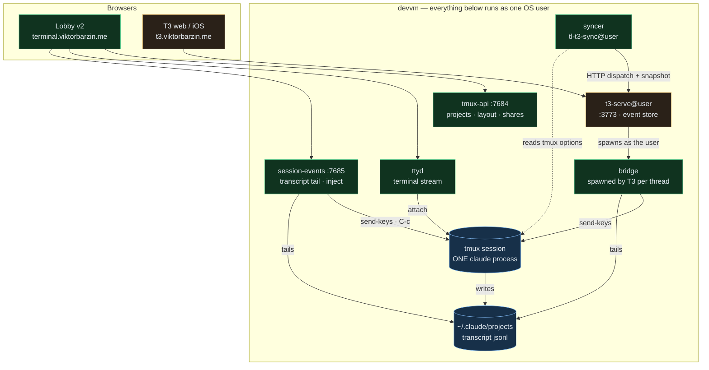
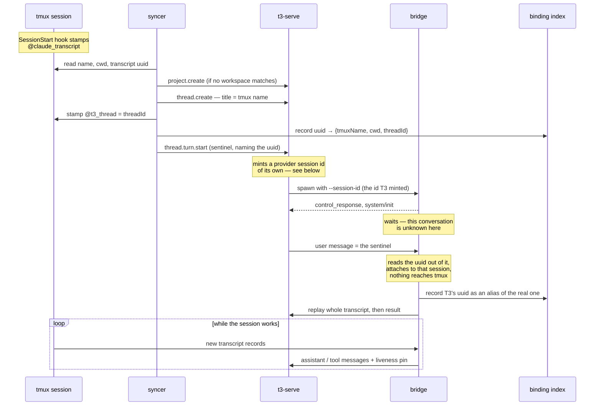
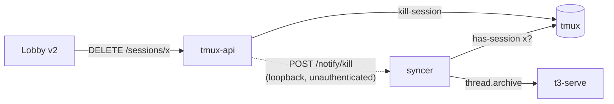

# The T3 Code bridge — one Claude, two windows

**Status:** Built and landed on master 2026-08-16; tmux-api released. Not yet enabled for any user — the bridge is inert until a T3 instance's `binaryPath` points at it.
**Date:** 2026-08-15 · **Owner:** wizard
**Scope:** terminal-lobby v2 only. The vanilla frontend is untouched and needs no change.

## The goal

Operate a session from either surface. Anything created in the lobby is visible and
manageable in T3 Code; anything created in T3 is visible and manageable in the lobby.
One conversation, two windows onto it — never two copies, and never two Claudes.

```stats
14 | live-Claude tmux sessions to mirror
1 | Claude process per session, always
0 | changes to T3 Code
0 | lobby frontend changes
```

Two constraints shape everything below. **T3 is external software** we don't control
(`pingdotgg/t3code`, running here as pinned per-user `t3-serve@<user>` instances that
auto-upgrade), so every integration point has to be a seam T3 already advertises —
no patches, no fork, nothing that a nightly can undo. **The lobby is ours**, so any
asymmetry in the work belongs on the lobby side.

## What made this tractable

Both surfaces already run the same thing. A T3 thread spawns the real `claude` and
writes a standard transcript to `~/.claude/projects/<slug>/<uuid>.jsonl` — the same
files, in the same format, that `session-events` already tails for the lobby's text
view. Verified on this box: thread `eb1a92c6`'s resume cursor points at
`6c420342-…jsonl`, sitting alongside the lobby's own transcripts. There is no format
gap to bridge, and the shared identity is the Claude **session id**.

Five facts were established by probing a throwaway T3 instance (its own port and
base-dir; the live instance was untouched) with a deliberately fake `claude` binary:

| Question | Result |
|---|---|
| Does a non-Claude binary survive T3's SDK handshake? | Yes — `control_request/initialize` → our `control_response` → `system/init`, accepted |
| Does T3's provider health probe pass? | Yes — `--version` delegated to the real binary reports `2.1.233 (Claude Code)` |
| Does our stdout become native thread content? | Yes — stored in `projection_thread_messages` as an ordinary assistant message |
| Can T3 receive work it did not start? | Yes — an assistant message emitted 6 s after the turn, unprompted, was persisted |
| Can the thread list be driven from outside? | Yes — `project.create`, `thread.create`, `thread.turn.start` all dispatch over HTTP with a CLI-minted bearer |

Versions probed: t3 `v0.0.34-nightly.20260815.1098`, `@anthropic-ai/claude-agent-sdk`
`0.3.233`, claude `2.1.233`, tmux 3.4.

The seam itself is a first-class user setting. `ClaudeSettingsPatch` exposes
`binaryPath`, `launchArgs` and `homePath` **per provider instance**, and
`providerInstance.ts` states plainly that multiple instances of one driver with
independent config are supported. T3 also watches `settings.json` for external edits
and invalidates its cache, so an idempotent merge from outside is a path T3
anticipates — no restart, no RPC client.

One more piece of luck in the deployment shape: `t3-serve@%i` runs `User=%i`. A bridge
spawned by your T3 runs as *you*, against your own tmux server. No sudo, no user-map,
no privileged service — the identity boundary is the uid, enforced by the kernel.

## The shape



Green is ours, amber is T3, blue is the shared substrate. Every arrow into T3 is
either its documented HTTP API or a process it chose to spawn.

**The bridge** is the binary in T3's `binaryPath`. Upward it speaks the Agent SDK's
stream-json protocol; downward it attaches to a tmux session — pasting prompts in,
tailing the transcript out. It starts no Claude of its own unless the session doesn't
exist yet.

**The syncer** is a per-user daemon that keeps the two lists in step: adopting new
sessions, following renames, and carrying deliberate destruction across in both
directions. It holds only its own T3 bearer, minted in memory via
`t3 auth session issue` and never written to disk.

Neither is a new stack. Both share packages with `session-events`, which already owns
the transcript tail, the tmux-option reads, the settle logic and — critically — an
injector that already handles the awkward parts: bracketed paste, a deliberate `C-e C-u` line clear (Claude Code
puts an interrupted prompt *back* on the input line), and an interrupt path that
re-derives `@claude_state` because Ctrl-C never fires the Stop hook.

## Decisions

| # | Decision | Why |
|---|---|---|
| 1 | **One Claude, two windows.** tmux is the single runtime; T3 attaches through the bridge. | A second Claude per session is ruled out on memory alone — earlyoom fired 34× in one day here, and each Claude is 0.4–0.8 GB across three users on one box. |
| 2 | **The lobby is the writer of record** for existence, naming, grouping and sharing. | T3 has no notion of owners, shares, layout or OS-user isolation, and we can't teach it any. Whatever T3 knows, we told it. |
| 3 | **Kill crosses; exit doesn't.** `thread.delete` kills the tmux session; a lobby kill archives the thread. OOM, reboots and reaped bridges cross nothing. | Archive is the routine "done" gesture — 386 threads here, mostly archived. Mapping it to a kill would be destructive by accident. |
| 4 | **Every live-Claude session is mirrored, automatically**, minus an ignore list of name prefixes: `qa-`, `t3e2e-`, `tlp-t`. | No per-session bookkeeping and no toggle to forget. Plain shells appear once a Claude starts in them. Agent worktree sessions carry no naming convention today, so they are mirrored like any other — see the note under decision 4 below. |
| 5 | **The default Claude instance carries the bridge; a second instance, `claudeStock`, holds the real binary.** Codex/Cursor/Grok threads stay T3-only. | Threads born in T3 get a real tmux session without anyone choosing anything, and a T3 upgrade that breaks the bridge is one instance switch away from working. |
| 6 | **Replay the whole transcript once at adoption**, with a per-session cursor so re-attach never duplicates. | A session you worked in all day should read as itself in T3, not as a blank thread. |
| 7 | **One name; tmux wins for sessions the lobby named.** T3's title mirrors the session name. A T3-born thread's session is slugged from the WORKSPACE ROOT, not the title, and keeps T3's own title — see the note under decision 7 below. | Both lists read as the same sessions for the sessions a human named. The cost is T3's descriptive titles squeezed into 32 chars of `[A-Za-z0-9_-]`. |
| 8 | **File by directory.** Longest-prefix match against T3 workspace roots; `project.create` at the git root when nothing matches. | Keeps T3's per-repo grouping meaningful. T3 enforces one active workspace per root, so the syncer treats "already exists" as success. |
| 9 | **Mid-turn sends queue in Claude, on both surfaces.** The lobby's 409 gate goes away. | Claude Code already queues typed input (its `queue-operation` records are in the transcript). The queued prompt stays visible in the pane. |
| 10 | **Resurrect silently.** A prompt to a thread whose session is gone recreates the tmux session and `claude --resume`s into it. | On this box dead-and-back is the normal case. It also means the 386 existing threads need no migration — resuming one makes it tmux-backed. |
| 11 | **Warm up adopted threads with a sentinel turn** the bridge swallows. | Only a process T3 spawns can put content into a thread, and opening one doesn't spawn anything. Without this, adopted threads sit empty until first touched. |
| 12 | **Pin while working.** The bridge holds T3's background-liveness pin while the session is mid-turn, so T3 doesn't reap it and work streams live. | Covers the walk-away-and-check-your-phone case. T3 reaps idle provider sessions at 30 minutes. |
| 13 | **Owner-only.** Each user's T3 mirrors only their own sessions; shares come later. | Identity already follows the uid. Crossing it is a deliberate later step, not a side effect. |
| 14 | **The lobby UI doesn't change.** A T3-born session is an ordinary session. | Collapses the frontend work to zero and keeps this fully independent of the pending v2 cutover. |

Three of these read differently in the code than in the row above, and the
difference is worth having in one place.

**Decision 4 — what the ignore list actually covers.** The shipped list is three
prefixes: `qa-` and `tlp-t` (the QA harness) and `t3e2e-` (this project's own
end-to-end harness). Agent worktree sessions have no naming convention to match
on, so the first enablement mirrors them alongside the human ones. Giving them
an agreed prefix is the way to change that; until then the operator's dry run
lists them and the list can be extended with `-ignore`.

**Decision 5 — which instance is which.** `defaultInstanceIdForDriver(driver)`
returns the instance whose id EQUALS the driver name, so the instance that gets
a new thread is the one called `claudeAgent` and there is no way to add a
differently-named default. The syncer therefore points `claudeAgent`'s
`binaryPath` at the bridge and writes a NEW instance, `claudeStock`, holding the
real binary. Both carry a `displayName` — "Claude (tmux)" and "Claude (stock)" —
so the picker still reads as two distinguishable things. An existing
`claudeAgent` instance keeps every other key it had; its `binaryPath` is the one
value the merge owns.

**Decision 9 — the gate is gone from the service, not from the browser.** The
`409 turn in progress` that `POST /prompt` used to answer is removed, so both
surfaces now paste whatever they are given and let Claude queue it. The v2
composer still has a branch that puts the text back on a 409; it is unreachable
rather than wrong, and removing it belongs with the next frontend change.

**Decision 7 — where a T3-born session's name comes from.** T3 spawns the bridge
with the thread's workspace root as cwd and never sends the title, so the bridge
slugs the directory: `terminal-lobby`, then `terminal-lobby-2`, and so on. The
tmux→T3 rename is therefore skipped for those sessions, or T3's descriptive
title would be replaced by a directory name on the next pass. The other
direction — a regenerated T3 title renaming the tmux session — is listed under
"What this deliberately does not do".

## How it behaves

### Adopting a session that's already running



**Why the sentinel names the conversation.** A thread created from outside has
never run, so it has no provider session id; T3 mints one itself
(`crypto.randomUUIDv4`) and spawns the bridge with `--session-id <that>`. No
dispatchable command seeds the id, and `GET /api/orchestration/snapshot` does
not project it, so there is no way to hand T3 the uuid of the conversation the
thread is for and no way to read back the one it chose. The warm-up turn is the
only message that travels from the syncer to the bridge, so it carries the uuid:
`[conversation:<uuid>]` after the sentinel line. Without it the bridge sees a
session id nothing on the box has heard of and has no way to tell an adoption
from a thread genuinely born in T3 — and starting a session for the second is
right while starting one for the first is a second Claude for a conversation
that never stopped running.

Two consequences follow. The bridge does not create anything for an unknown
session id until a prompt arrives, because the prompt is what disambiguates. And
T3's resume cursor for an adopted thread stays the id T3 invented, so the index
records that id as an ALIAS of the real conversation; every later spawn resolves
through the alias to the same tmux session.

### Where the state lives

The binding lives in three places, not two, and the durable one is what
resurrection is built from.

| Where | Holds | Lifetime | Written by |
|---|---|---|---|
| `@t3_thread`, a tmux session option | the thread id | exactly the tmux session's | the syncer, at adoption |
| T3's resume cursor | a session uuid — and nothing else | the thread's | T3, from our `system/init` |
| `~/.local/state/terminal-lobby/t3-bridge/index.json` | uuid → `{tmuxName, cwd, threadId, origin, aliasOf, warmedAt}` | durable, per user | both the bridge and the syncer |

The tmux options are deliberately session-lifetime, so a reused name never
serves a dead conversation — the reasoning that put `@claude_transcript` and
`@claude_state` there (ADR-0001). The index deliberately inverts that rule,
because resurrection needs the tmux NAME and the cwd precisely when the session
that held them is gone, and T3's cursor carries neither. Two processes write it,
so every read-modify-write runs under an exclusive `flock` and each save is
tmp + fsync + rename; a file that will not parse is an error rather than an
empty index, since answering "no bindings" would send the bridge resurrecting
sessions that are alive.

A second, smaller store sits beside it: `…/t3-bridge/cursor/<uuid>.json`, the
replay position per conversation. It is what makes decision 6 idempotent — T3
reaps a bridge at 30 minutes idle and spawns a fresh one on the next touch, and
without a durable cursor each of those would replay the whole transcript into
the thread again.

Both stores are mutable state outside tmux and outside T3, which is a cost the
rest of the design avoids. Two failure modes come with them and are worth naming:
a writer that knows some of an entry must merge rather than replace (the bridge
knows the tmux name and never the thread id), and the prune pass needs positive
evidence that something is gone — an empty `list-sessions` after a reboot looks
exactly like every session on the box having been abandoned at once.

### A thread born in T3

T3 assigns the session id itself (`--session-id <uuid>` on a new thread), so the
bridge creates the tmux session and starts `claude --session-id <that uuid>` inside
it — the ids agree from the first message, and the session appears in the lobby on the
next poll. T3's own MCP server, which it injects via `--mcp-config`, is passed straight
through, so T3-born sessions keep T3's tools. The session's name is a slug of the
workspace root, and the index records that the BRIDGE chose it, which is what keeps
the syncer from re-adopting the session or pushing that name over T3's title.

### Sending from T3

The bridge pastes into the pane and submits, exactly as `session-events` does today.
If a turn is in flight, Claude's own queue holds it. Interrupt maps to the existing
Cancel path: Ctrl-C plus the `@claude_state` re-derivation.

A paste that fails because the session has GONE re-resolves and resurrects, then
retries once. T3 reuses a bridge process for a thread's later turns, so without
that a session killed under a live bridge turns every subsequent prompt into an
error in the thread — the resurrection would only ever run on a fresh spawn. The
retry only ever creates; nothing on this path can destroy a session.

A resurrected session is not typed into until its pane is drawn, showing a
prompt, and has stopped changing. The transcript stamp is not enough on its own:
`claude --resume` fires SessionStart — which is what sets the stamp — and only
then spends about a second loading the transcript before painting. A prompt sent
into that window half-lands, which is worse than losing it outright. Measured on
2026-08-16 against a real resumed session: the bracketed paste arrived on the
input line intact and the Enter that should have submitted it did not, so the
turn never ran while the thread showed a message Claude had not seen. A pane that
never settles is logged and typed into anyway — that is a gamble, where dropping
the prompt is a certainty.

Control requests are answered on the reading goroutine and prompts are handed to
a worker, so a Stop pressed while a resurrection waits for its transcript stamp
is answered rather than queued behind it.

### Destruction

| You do this | This happens |
|---|---|
| Delete a thread in T3 | The syncer kills the tmux session — for a thread it adopted. A T3-BORN thread crosses nothing, because nothing tells the syncer which thread that session belongs to |
| Archive a thread in T3 | Nothing — archive is a T3-side gesture |
| Kill a session in the lobby | tmux-api posts a kill notice to the syncer, which archives the thread; the conversation survives |
| earlyoom kills a Claude | Nothing crosses; the thread stays, and the next prompt resurrects it |
| T3 reaps the bridge | Nothing crosses; the bridge is a detached client, not the session |

The delete row is the one with a hole in it, and it has the same root as the
adoption binding above: for a thread born in T3 the syncer knows the tmux session
and T3 knows the thread, and no read available to either names the other. So a
T3-born session is left out of the destruction contract in both directions
rather than guessed at — an earlier build guessed by re-adopting it, which made
a second thread for one session and then killed on whichever of the two the
index happened to name. Closing this properly is the same work as the open
question about the adoption binding.

Only one row there needs a channel that did not exist: "kill a session in the
lobby". Every other way a session disappears — earlyoom, a reboot, a crashed
tmux server, a claude that exited — leaves exactly the trace a deliberate kill
does, which is the name no longer being in `list-sessions`. The one place on the
box that knows a kill was deliberate is `killSession` in tmux-api, so it says so:
a fire-and-forget `POST /notify/kill` to `127.0.0.1:<port>/notify/kill` carrying
`{osUser, session, killedAt, source}`, off the response path with a 2 s timeout,
and nothing at all when the user has no syncer. The port comes from
`/etc/tl-t3-sync/<user>.env`, the same file the syncer's own unit reads, and the
block reserved for these listeners is 7695–7699. The syncer confirms with tmux
that the session really is gone before it archives anything, so a stray notice is
a no-op. Delivery is at-most-once and best-effort: a syncer that was down when
the kill happened never learns about it, and the thread simply stays unarchived,
which is the safe direction to fail in.



Because tmux-api is the producer, enabling a user's syncer means shipping a
tmux-api that has it — see the build order.

## What this deliberately does not do

- **Renaming a tmux session when T3 regenerates a thread's title.** The
  tmux→T3 direction is implemented; this one is not. `TmuxAPI.Rename` is built
  and tested for it and nothing calls it. Doing it needs a rule for which side
  wins when both names changed since the last pass, and the syncer keeps no
  shadow of what it last pushed either way. Until then a T3-born session keeps
  its workspace-root name in the lobby and its own descriptive title in T3.
- **Binding an adopted thread to its conversation through T3.** No dispatchable
  command seeds a thread's provider session id and the snapshot does not project
  it, so the pairing travels in the warm-up prompt and lives in our own index.
  A per-thread provider instance carrying the uuid in `launchArgs` would let T3
  hold it directly; that is a larger change and is not built.

- **Token-by-token streaming in T3 for bridged threads.** The transcript only gains
  complete messages, so a bridged thread updates per message. The tmux terminal keeps
  its live stream.
- **T3-side approvals.** A bridged session's permission prompts appear in the tmux
  pane. Fine for `--dangerously-skip-permissions` sessions, a real gap for
  approval-required ones — those should stay on the stock instance for now.
- **T3's MCP tools in adopted sessions.** `--mcp-config` can only be set at launch, so
  a session adopted mid-flight doesn't get them. Sessions the bridge launches do.
- **Shared sessions.** A session shared with you appears in the lobby, not in your T3.
- **Non-Claude providers.** Codex, Cursor and Grok threads have the same `binaryPath`
  seam, but each is a separate protocol; they stay T3-only.
- **Plain shells.** They have no conversation to mirror and appear once a Claude starts.

## Risks

**Protocol drift is the risk that shapes the design.** The bridge implements a subset of a protocol
we don't own, under a T3 that auto-upgrades nightly. The mitigations are layered: the
stock provider instance stays configured as a one-switch escape hatch (decision 5); the
syncer runs a handshake self-test at start and after any t3 version change, and reports
failure rather than degrading quietly; and the subset is small — initialize, init,
user-message-in, assistant/result-out, interrupt, set_permission_mode.

**The liveness pin is the least principled part of the design.** It works by emitting
task-lifecycle signals that T3's `ThreadBackgroundLiveness` registry reads. That's a
mechanism we don't own and it could change. If it does, the failure is soft: threads
stop updating live and catch up on next touch.

**A phantom turn per adoption.** The sentinel warm-up leaves one user message in each
adopted thread. Making it a short provenance line rather than a blank keeps it legible;
it now also carries the conversation's uuid, which is the fact T3 gives the bridge no
other way to learn.

**The transcript path has to be Claude Code's, character for character.** The whole
premise above — the same files session-events already tails — rests on deriving the
project directory the same way claude does, and it rewrites every character outside
`[A-Za-z0-9]`, not only `/`. A near-miss does not error: the tail reads a file that
is not there and the thread mirrors silence. `sessionio.TranscriptSlug` is a
transcription of claude 2.1.233's own function, cap and hash suffix included, with a
table test against the real directory names under `~/.claude/projects`.

**Storage duplication.** T3's sqlite gains a second copy of each replayed transcript,
tool results included. Bounded by the number of adopted sessions, not by time.

## Build order

One build, then dogfood — not staged milestones.

1. **Extract shared packages** from `session-events` (transcript tail, tmux options,
   normaliser, injector) so bridge, syncer and service share one implementation.
2. **Bridge**, test-first against recorded transcripts and a replay of the SDK's own
   frames: handshake, replay, live tail, paste, interrupt, resurrect, sentinel.
3. **Syncer**: adoption, workspace filing, rename following, kill/archive symmetry,
   snapshot polling, settings merge, bearer minting, self-test.
4. **Release tmux-api** with the kill-notify producer *(done 2026-08-16 — binary
   installed and only that service restarted, so no browser terminal was
   dropped; the notify is inert until step 5 creates the env file)*, and create
   `/etc/tl-t3-sync/<user>.env`. Without both, "kill a session in the lobby"
   crosses nothing — the consumer alone cannot see the difference between a kill
   and an OOM.
5. **Deploy** to the devvm — binary plus `tl-t3-sync@<user>`, provider instance made
   default for wizard.
6. **Dogfood** on wizard's own sessions, then provision bob and carol.

## Open questions

- ~~Whether the liveness pin holds in practice.~~ **Answered, 2026-08-16.** T3 stored
  the pin as `projection_thread_activities` rows ("terminal-lobby: tmux session
  t3e2e-born is working") in the end-to-end run, and did not reap the session.
- Whether an adopted session's replay should include tool results verbatim or elide
  the largest ones. Worth measuring against a real 2.5 MB transcript before deciding.
- What the syncer's snapshot poll interval should be. Fast enough that a T3 delete
  feels immediate, slow enough to be invisible on the box.
- Whether the adoption binding should move into T3 rather than living in our index.
  A per-thread provider instance whose `launchArgs` carry the conversation's uuid
  would let the bridge learn it from its own argv, and T3 would then hold the pairing
  itself. It costs one settings entry per adopted session and has not been exercised
  against a live T3, so today the warm-up prompt carries it and the alias in the index
  is what makes later spawns land in the same place.
- What a T3-born session should be called in the lobby. The workspace-root slug is
  legible but says nothing about the thread, and the title T3 would give it never
  reaches the bridge.
