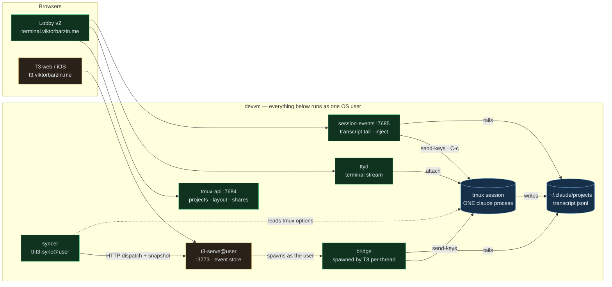
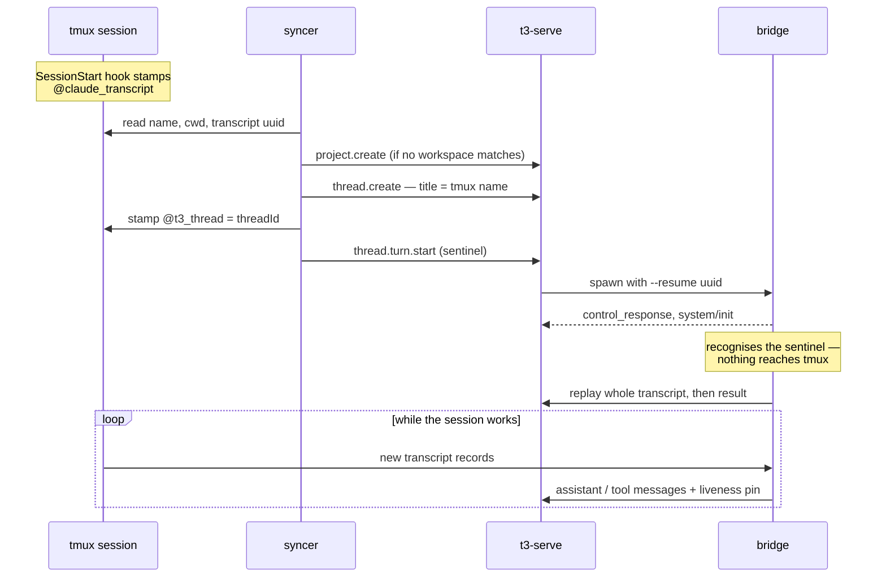

# The T3 Code bridge — one Claude, two windows

**Status:** Designed — grilled 2026-08-15, ready to build
**Date:** 2026-08-15 · **Owner:** wizard
**Scope:** terminal-lobby v2 only. The vanilla frontend is untouched and needs no change.

## The goal

Operate a session from either surface. Anything created in the lobby is visible and
manageable in T3 Code; anything created in T3 is visible and manageable in the lobby.
One conversation, two windows onto it — never two copies, and never two Claudes.

Two constraints shape everything below. **T3 is external software** we don't control
(`pingdotgg/t3code`, running here as pinned per-user `t3-serve@<user>` instances that
auto-upgrade), so every integration point has to be a seam T3 already advertises —
no patches, no fork, nothing that a nightly can undo. **The lobby is ours**, so any
asymmetry in the work belongs on the lobby side.

## What made this tractable

Both surfaces already run the same thing. A T3 thread spawns the real `claude` and
writes a standard transcript to `~/.claude/projects/<slug>/<uuid>.jsonl` — the same
files, in the same format, that `session-events` already tails for the lobby's text
view. Verified on this box: thread `eb1a92c6`'s resume cursor points at
`6c420342-…jsonl`, sitting alongside the lobby's own transcripts. There is no format
gap to bridge, and the shared identity is the Claude **session id**.

Five facts were established by probing a throwaway T3 instance (its own port and
base-dir; the live instance was untouched) with a deliberately fake `claude` binary:

| Question | Result |
|---|---|
| Does a non-Claude binary survive T3's SDK handshake? | Yes — `control_request/initialize` → our `control_response` → `system/init`, accepted |
| Does T3's provider health probe pass? | Yes — `--version` delegated to the real binary reports `2.1.233 (Claude Code)` |
| Does our stdout become native thread content? | Yes — stored in `projection_thread_messages` as an ordinary assistant message |
| Can T3 receive work it did not start? | Yes — an assistant message emitted 6 s after the turn, unprompted, was persisted |
| Can the thread list be driven from outside? | Yes — `project.create`, `thread.create`, `thread.turn.start` all dispatch over HTTP with a CLI-minted bearer |

Versions probed: t3 `v0.0.34-nightly.20260815.1098`, `@anthropic-ai/claude-agent-sdk`
`0.3.233`, claude `2.1.233`, tmux 3.4.

The seam itself is a first-class user setting. `ClaudeSettingsPatch` exposes
`binaryPath`, `launchArgs` and `homePath` **per provider instance**, and
`providerInstance.ts` states plainly that multiple instances of one driver with
independent config are supported. T3 also watches `settings.json` for external edits
and invalidates its cache, so an idempotent merge from outside is a path T3
anticipates — no restart, no RPC client.

One more piece of luck in the deployment shape: `t3-serve@%i` runs `User=%i`. A bridge
spawned by your T3 runs as *you*, against your own tmux server. No sudo, no user-map,
no privileged service — the identity boundary is the uid, enforced by the kernel.

## The shape

Green is ours, amber is T3, blue is the shared substrate. Every arrow into T3 is
either its documented HTTP API or a process it chose to spawn.

**The bridge** is the binary in T3's `binaryPath`. Upward it speaks the Agent SDK's
stream-json protocol; downward it attaches to a tmux session — pasting prompts in,
tailing the transcript out. It starts no Claude of its own unless the session doesn't
exist yet.

**The syncer** is a per-user daemon that keeps the two lists in step: adopting new
sessions, following renames, and carrying deliberate destruction across in both
directions. It holds only its own T3 bearer, minted in memory via
`t3 auth session issue` and never written to disk.

Neither is a new stack. Both share packages with `session-events`, which already owns
the transcript tail, the tmux-option reads, the settle logic and — critically — an
injector that already handles the awkward parts: bracketed paste, a deliberate `C-e C-u` line clear (Claude Code
puts an interrupted prompt *back* on the input line), and an interrupt path that
re-derives `@claude_state` because Ctrl-C never fires the Stop hook.

## Decisions

| # | Decision | Why |
|---|---|---|
| 1 | **One Claude, two windows.** tmux is the single runtime; T3 attaches through the bridge. | A second Claude per session is ruled out on memory alone — earlyoom fired 34× in one day here, and each Claude is 0.4–0.8 GB across three users on one box. |
| 2 | **The lobby is the writer of record** for existence, naming, grouping and sharing. | T3 has no notion of owners, shares, layout or OS-user isolation, and we can't teach it any. Whatever T3 knows, we told it. |
| 3 | **Kill crosses; exit doesn't.** `thread.delete` kills the tmux session; a lobby kill archives the thread. OOM, reboots and reaped bridges cross nothing. | Archive is the routine "done" gesture — 386 threads here, mostly archived. Mapping it to a kill would be destructive by accident. |
| 4 | **Every live-Claude session is mirrored, automatically**, minus an ignore list for machine-made sessions (`qa-*`, agent worktrees). | No per-session bookkeeping and no toggle to forget. Plain shells appear once a Claude starts in them. |
| 5 | **"Claude (tmux)" is the default provider instance; stock `claudeAgent` stays configured.** Codex/Cursor/Grok threads stay T3-only. | Threads born in T3 get a real tmux session without anyone choosing anything, and a T3 upgrade that breaks the bridge is one instance switch away from working. |
| 6 | **Replay the whole transcript once at adoption**, with a per-session cursor so re-attach never duplicates. | A session you worked in all day should read as itself in T3, not as a blank thread. |
| 7 | **One name; tmux wins.** T3's title mirrors the session name; a T3-born thread gets a tmux session slugged from its title, and a regenerated title renames through tmux-api. | Both lists read as the same sessions. The cost is T3's descriptive titles squeezed into 32 chars of `[A-Za-z0-9_-]`. |
| 8 | **File by directory.** Longest-prefix match against T3 workspace roots; `project.create` at the git root when nothing matches. | Keeps T3's per-repo grouping meaningful. T3 enforces one active workspace per root, so the syncer treats "already exists" as success. |
| 9 | **Mid-turn sends queue in Claude, on both surfaces.** The lobby's 409 gate goes away. | Claude Code already queues typed input (its `queue-operation` records are in the transcript). The queued prompt stays visible in the pane. |
| 10 | **Resurrect silently.** A prompt to a thread whose session is gone recreates the tmux session and `claude --resume`s into it. | On this box dead-and-back is the normal case. It also means the 386 existing threads need no migration — resuming one makes it tmux-backed. |
| 11 | **Warm up adopted threads with a sentinel turn** the bridge swallows. | Only a process T3 spawns can put content into a thread, and opening one doesn't spawn anything. Without this, adopted threads sit empty until first touched. |
| 12 | **Pin while working.** The bridge holds T3's background-liveness pin while the session is mid-turn, so T3 doesn't reap it and work streams live. | Covers the walk-away-and-check-your-phone case. T3 reaps idle provider sessions at 30 minutes. |
| 13 | **Owner-only.** Each user's T3 mirrors only their own sessions; shares come later. | Identity already follows the uid. Crossing it is a deliberate later step, not a side effect. |
| 14 | **The lobby UI doesn't change.** A T3-born session is an ordinary session. | Collapses the frontend work to zero and keeps this fully independent of the pending v2 cutover. |

## How it behaves

### Adopting a session that's already running

The binding lives in two places, each with the right lifetime: `@t3_thread` is a tmux
session option, so it dies exactly when the session does (the same reasoning that put
`@claude_transcript` and `@claude_state` there); T3's resume cursor holds the session
uuid durably, which is what lets a resurrected session find its way home.

### A thread born in T3

T3 assigns the session id itself (`--session-id <uuid>` on a new thread), so the
bridge creates the tmux session and starts `claude --session-id <that uuid>` inside
it — the ids agree from the first message, and the session appears in the lobby on the
next poll. T3's own MCP server, which it injects via `--mcp-config`, is passed straight
through, so T3-born sessions keep T3's tools.

### Sending from T3

The bridge pastes into the pane and submits, exactly as `session-events` does today.
If a turn is in flight, Claude's own queue holds it. Interrupt maps to the existing
Cancel path: Ctrl-C plus the `@claude_state` re-derivation.

### Destruction

| You do this | This happens |
|---|---|
| Delete a thread in T3 | The syncer kills the tmux session |
| Archive a thread in T3 | Nothing — archive is a T3-side gesture |
| Kill a session in the lobby | The syncer archives the thread; the conversation survives |
| earlyoom kills a Claude | Nothing crosses; the thread stays, and the next prompt resurrects it |
| T3 reaps the bridge | Nothing crosses; the bridge is a detached client, not the session |

## What this deliberately does not do

- **Token-by-token streaming in T3 for bridged threads.** The transcript only gains
  complete messages, so a bridged thread updates per message. The tmux terminal keeps
  its live stream.
- **T3-side approvals.** A bridged session's permission prompts appear in the tmux
  pane. Fine for `--dangerously-skip-permissions` sessions, a real gap for
  approval-required ones — those should stay on the stock instance for now.
- **T3's MCP tools in adopted sessions.** `--mcp-config` can only be set at launch, so
  a session adopted mid-flight doesn't get them. Sessions the bridge launches do.
- **Shared sessions.** A session shared with you appears in the lobby, not in your T3.
- **Non-Claude providers.** Codex, Cursor and Grok threads have the same `binaryPath`
  seam, but each is a separate protocol; they stay T3-only.
- **Plain shells.** They have no conversation to mirror and appear once a Claude starts.

## Risks

**Protocol drift is the risk that shapes the design.** The bridge implements a subset of a protocol
we don't own, under a T3 that auto-upgrades nightly. The mitigations are layered: the
stock provider instance stays configured as a one-switch escape hatch (decision 5); the
syncer runs a handshake self-test at start and after any t3 version change, and reports
failure rather than degrading quietly; and the subset is small — initialize, init,
user-message-in, assistant/result-out, interrupt, set_permission_mode.

**The liveness pin is the least principled part of the design.** It works by emitting
task-lifecycle signals that T3's `ThreadBackgroundLiveness` registry reads. That's a
mechanism we don't own and it could change. If it does, the failure is soft: threads
stop updating live and catch up on next touch.

**A phantom turn per adoption.** The sentinel warm-up leaves one user message in each
adopted thread. Making it a short provenance line rather than a blank keeps it legible.

**Storage duplication.** T3's sqlite gains a second copy of each replayed transcript,
tool results included. Bounded by the number of adopted sessions, not by time.

## Build order

One build, then dogfood — not staged milestones.

1. **Extract shared packages** from `session-events` (transcript tail, tmux options,
   normaliser, injector) so bridge, syncer and service share one implementation.
2. **Bridge**, test-first against recorded transcripts and a replay of the SDK's own
   frames: handshake, replay, live tail, paste, interrupt, resurrect, sentinel.
3. **Syncer**: adoption, workspace filing, rename following, kill/archive symmetry,
   snapshot polling, settings merge, bearer minting, self-test.
4. **Deploy** to the devvm — binary plus `tl-t3-sync@<user>`, provider instance made
   default for wizard.
5. **Dogfood** on wizard's own sessions, then provision bob and carol.

## Open questions

- Whether the liveness pin holds in practice, or whether T3 reaps a pinned session
  anyway. Measurable as soon as the bridge emits its first task signal.
- Whether an adopted session's replay should include tool results verbatim or elide
  the largest ones. Worth measuring against a real 2.5 MB transcript before deciding.
- What the syncer's snapshot poll interval should be. Fast enough that a T3 delete
  feels immediate, slow enough to be invisible on the box.
