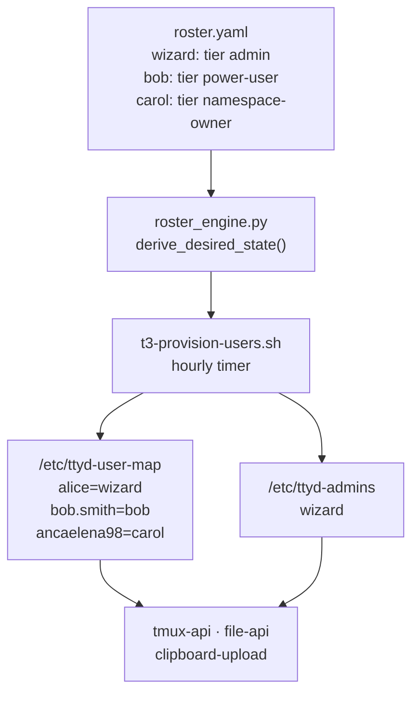
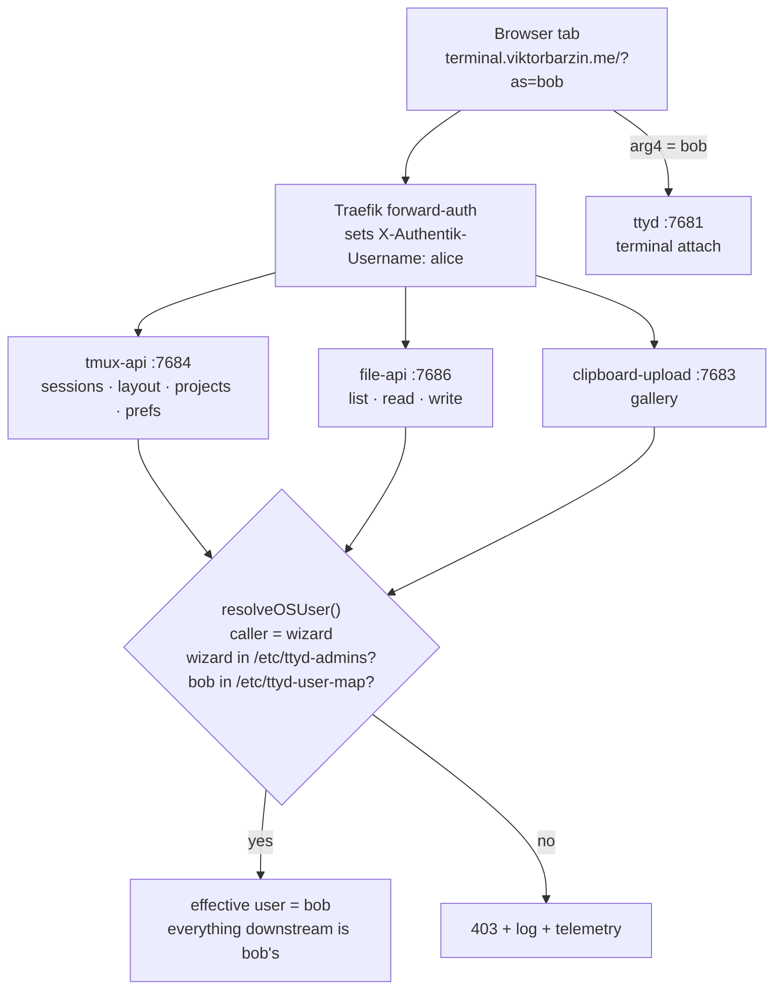
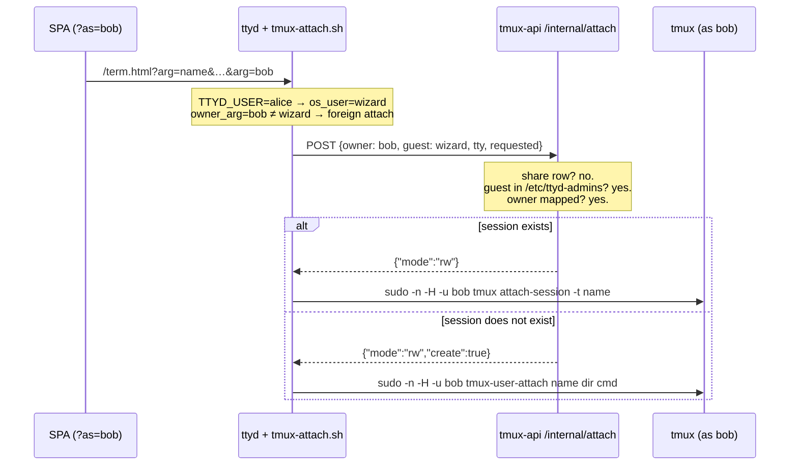

# Act as user — an admin lens on another account's lobby

**Status:** Design agreed 2026-08-16, building. **Author:** Viktor Barzin
(design), Claude (research + build).

## What we wanted

Viktor administers a shared devvm that three people have accounts on. Seeing
what someone else is doing there means leaving the lobby entirely — `sudo -u bob
tmux attach` from a shell, or reading their files with `sudo`. Everything the
lobby offers (the session list with live Claude state, the terminal, the file
browser, the image gallery) is available only for your own account.

The ask is to make the lobby itself do it: an admin picks another user from
Settings, and the lobby becomes that user's lobby.

## What already exists

Most of the machinery is built and, in one case, has never run in production.

| Piece | State today |
|---|---|
| `Session.owner` / `Session.access` on the wire | Shipped; the SPA renders foreign sessions |
| `tmux-attach.sh` arg4 = session owner | Shipped; foreign attach works |
| `tmux-attach.sh` arg5 = read-only request | Shipped (Watch mode) |
| `/internal/attach` server-side authorization | Shipped; sources `-r` from its own answer |
| Cross-user file access (`file-api -privop`) | Shipped 2026-08-16 |
| `sudo` grants for tmux / attach / dirlist / file-api per user | Shipped |
| `shares.json` — the thing that *authorizes* a foreign attach | `{"version":1,"shares":[]}`, empty since July |

The empty share store is what makes this a small change. The foreign-attach path
is complete except for its authorization source, which has never been populated.
An admin switch is largely a second authorization source for a path that already
works, rather than new machinery.

## Where "admin" comes from

Not from Authentik. `terminal.viktorbarzin.me` is gated on the `Home Server
Admins` group, and bob is in that group — that membership is how they reach the
lobby at all (688 `/whoami` calls in the last 30 days). The group answers "may
you open the lobby", not "are you an administrator of this box".

`roster.yaml` already answers the second question, with `tier: admin`, and the
hourly reconcile already turns that file into `/etc/ttyd-user-map`. So the admin
list is derived the same way, from the same source, by the same script:

A missing or unreadable `/etc/ttyd-admins` yields an empty admin set, so the
feature becomes unavailable rather than open.

## The design

One signal, `?as=<osUser>`, carried on the lobby URL and threaded into every
backend call the page makes.

Per tab, so one tab can be bob while another stays yours. In the URL, so it
survives a reload and is visible in the address bar. As a query parameter rather
than a header, because two of the surfaces are not `fetch` calls at all — file
previews and gallery thumbnails are `` — and a parameter is the only
form all of them can carry. This follows the precedent `config.ts` already sets
with `?api=` and `?terminal=`.

The reason this stays small is that `resolveOSUser()` is one function, repeated
near-verbatim in each service. Change what it resolves to and the session list,
layout, projects, prefs, restore, kill, rename, file read/write and the gallery
all follow with no per-endpoint work.

### What the switch covers

While a tab is acting as bob, it **is** bob to every service: their sessions,
their sidebar arrangement, their projects, their prefs, their files, their
gallery, and a read-write terminal attach. Creating, killing and renaming
sessions all operate on their account.

Two deliberate exceptions:

- **Push subscriptions resolve the real caller, never the target.** The SPA
  refreshes its push registration on boot, so without this an as-bob tab would
  enrol your phone as one of bob's devices and keep delivering their session
  notifications to you long after the switch ended. It is the one surface where
  a write creates state that outlives the tab.
- **Telemetry records both identities** — the actor who switched and the target
  they acted as — rather than attributing the action to the target alone.

### The attach path

The terminal is the one surface that does not go through `resolveOSUser`. ttyd
maps `TTYD_USER` to an OS user itself and passes positional `?arg=` values to
`tmux-attach.sh`, whose fixed argv is the security boundary given the broad
`sudo tmux` grant. The switch therefore rides the **existing** arg4 owner slot,
and the authorization decision stays server-side in `/internal/attach`:

The `create` answer is new. Today a foreign attach never creates — the
`SELF ONLY` branch in `shares.go` is explicit that raising a guest from `ro` to
`rw` because a session happens to be missing would be an escalation, and a racy
one. That reasoning still holds for guests: `create` is returned only when the
caller's ceiling is already `rw`, so it grants nothing the caller did not have.

## What this protects, and what it does not

**Enforced server-side, in each service:** the admin check reads the real
caller from the Authentik header, which Traefik strips from the request and
re-sets itself, and consults `/etc/ttyd-admins`, which only root can write.
Nothing client-supplied participates in the decision. A non-admin sending `?as=`
receives 403 with a log line and a telemetry event.

**Not a privilege boundary against the admin.** wizard holds `sudo` on this box
and can already read and write every account. This feature adds convenience, not
capability, and the same is true of every guard in it.

**A boundary against accident.** With a
full identity switch there is no server-side difference between the admin and
the person they are acting as: keystrokes land in that user's shell history and
their agent's transcript, indistinguishable from their own. Two things stand
against that:

- **A tab acting as someone else looks different.** A chip in the shell bar (the
  session bar on a phone) names the target and returns you in one click, and the
  whole app carries a coloured frame and tinted bar, recognisable from a glance
  at a background tab.
- **Every switch is recorded.** A journal line plus an `admin.actas` telemetry
  event carrying actor, target and session, so "was anyone in bob's account on
  Tuesday" has an answer.

**What the target sees:** the attach count on the affected session, which tmux
surfaces already, and nothing naming the admin. A visible banner in the target's
own lobby was considered and set aside; it can be added later without changing
anything below the UI.

## Out of scope

- **The Text view.** `session-events` reads `/home/<user>/.claude/projects`
  directly, `/home/bob` is `drwxr-x---`, and its reader polls the transcript
  every 200 ms with an incremental seek — so the per-operation `sudo` re-exec
  that works for `file-api` would mean five forks a second per open session. A
  cross-user version needs a persistent streaming child instead. Deferred with
  the rest of text mode, which is still being worked on.
- **The eleven settings rows** the SPA dropped relative to the vanilla page
  (line height, letter spacing, cursor, cursor blink, bold weight, flow control,
  send diagnostics, link copy button, smooth scrolling, scroll speed, and the
  Clear-local-data pair). The values are safe — `composeDoc` preserves every
  unknown key, so `term.html` still applies them — they are simply not editable
  from the SPA. Their own piece of work.

## Build order

1. **`/etc/ttyd-admins`** — `roster_engine.py` derives it from `tier: admin`;
   `t3-provision-users.sh` installs it beside `/etc/ttyd-user-map`.
2. **Shared resolution** — an act-as capable `resolveOSUser` in `tmux-api`,
   `file-api` and `clipboard-upload`, plus a `resolveRealOSUser` for the push
   handlers.
3. **Attach path** — `/internal/attach` admin branch and the `create` answer;
   `tmux-attach.sh` acts on it.
4. **SPA** — `?as=` in `config.ts` and every URL builder, the Settings picker
   from `GET /users`, the chip, and the tinted frame.
5. **Telemetry** — `admin.actas` at the switch, actor and target both recorded.

## Verification

Each of these is a behaviour to prove on the live devvm, not a unit test:

| Check | Expected |
|---|---|
| wizard `?as=bob` → session list | bob's sessions, bob's layout |
| wizard `?as=bob` → open a session | attaches read-write as bob; `id -un` says `bob` |
| wizard `?as=bob` → new session | created under bob's uid |
| wizard `?as=bob` → write a file | lands `owner=bob group=bob` |
| bob `?as=wizard` | 403, logged |
| bob `?as=bob` (self) | works — it is their own account |
| wizard `?as=nosuchuser` | 403 |
| wizard `?as=bob` → push subscription | stored under wizard |
| `/etc/ttyd-admins` absent | every `?as=` 403s |
| No `?as=` at all | byte-identical behaviour to today |

The last row is why the others exist: this feature adds a branch to the
identity resolution every request in the lobby passes through, so "nothing
changes when the parameter is absent" needs proving rather than assuming.

## Open questions

None blocking. Two things we chose to leave open deliberately: whether the
target should eventually see a banner naming the admin, and whether the Text
view's cross-user reader is worth building on its own or should wait until text
mode is finished.
