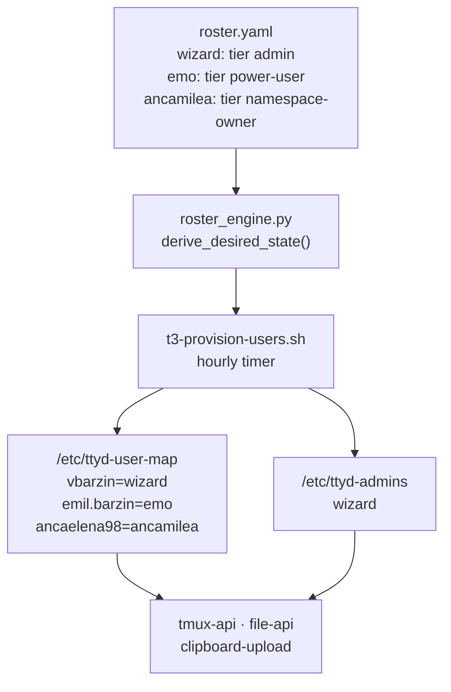
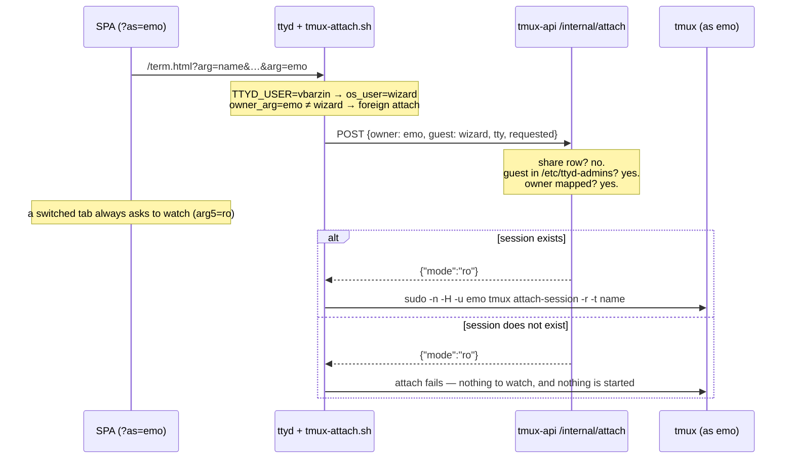

# Act as user — an admin lens on another account's lobby

**Status:** Shipped 2026-08-16, live on `terminal.viktorbarzin.me` (build
`675772e`). **Revised 2026-08-17** — the lens watches rather than drives, and can
no longer start a session in the target's account. **Author:** Viktor Barzin
(design), Claude (research + build).

## What changed on 2026-08-17

Two days of use turned up one thing that had gone wrong and one decision worth
taking again. Both are recorded here rather than in a second document, because
this is the design record for the feature.

**Sessions appeared in emo's account that emo had not created.** The attach path
answered `create: true` whenever the caller held the owner's own access and the
session was not running — reachable only from the act-as branch. So opening a
session *name* that did not exist under the target started it there, read-write,
running their default command as them: wizard's `Council-tax` was live in emo's
account from 08:02:24 until it was killed, and `image-paste` and
`qa-actas-probe` before it. Three things made it easy to reach without meaning
to — a switched page kept `?session=` from the identity it had left, a
notification tap always names one of *your* sessions, and every attach in a
switched tab defaults its owner to the target. The answer is gone, and so is the
branch in `tmux-attach.sh` that acted on it: a foreign attach now only ever
attaches something already running.

**The lens watches.** A tab acting as another user comes up read-only on every
session it opens, the Watch control is a readout rather than a toggle, and the
controls that type into the pty are disabled with it. Enforcement is
client-side: the server's ceiling for an act-as attach is still `rw`, so this is
an accident guard rather than a privilege boundary — which is the same thing the
rest of this document says about every guard in the feature. Taking control
means leaving the lens: ask the owner for an `rw` share, or use `sudo -u <user>
tmux attach` from a shell. The audit line now names the mode each act-as attach
resolved to, and says `DRIVING (read-write)` in words when it is not watching,
so the journal answers "did anyone type in their session, or only watch it".

The sections below are the original design, with the two behaviours corrected in
place.

## What we wanted

Viktor administers a shared devvm that three people have accounts on. Seeing
what someone else is doing there means leaving the lobby entirely — `sudo -u emo
tmux attach` from a shell, or reading their files with `sudo`. Everything the
lobby offers (the session list with live Claude state, the terminal, the file
browser, the image gallery) is available only for your own account.

The ask is to make the lobby itself do it: an admin picks another user from
Settings, and the lobby becomes that user's lobby.

## What already exists

Most of the machinery is built and, in one case, has never run in production.

| Piece | State today |
|---|---|
| `Session.owner` / `Session.access` on the wire | Shipped; the SPA renders foreign sessions |
| `tmux-attach.sh` arg4 = session owner | Shipped; foreign attach works |
| `tmux-attach.sh` arg5 = read-only request | Shipped (Watch mode) |
| `/internal/attach` server-side authorization | Shipped; sources `-r` from its own answer |
| Cross-user file access (`file-api -privop`) | Shipped 2026-08-16 |
| `sudo` grants for tmux / attach / dirlist / file-api per user | Shipped |
| `shares.json` — the thing that *authorizes* a foreign attach | `{"version":1,"shares":[]}`, empty since July |

The empty share store is what makes this a small change. The foreign-attach path
is complete except for its authorization source, which has never been populated.
An admin switch is largely a second authorization source for a path that already
works, rather than new machinery.

## Where "admin" comes from

Not from Authentik. `terminal.viktorbarzin.me` is gated on the `Home Server
Admins` group, and emo is in that group — that membership is how they reach the
lobby at all (688 `/whoami` calls in the last 30 days). The group answers "may
you open the lobby", not "are you an administrator of this box".

`roster.yaml` already answers the second question, with `tier: admin`, and the
hourly reconcile already turns that file into `/etc/ttyd-user-map`. So the admin
list is derived the same way, from the same source, by the same script:

A missing or unreadable `/etc/ttyd-admins` yields an empty admin set, so the
feature becomes unavailable rather than open.

## The design

One signal, `?as=<osUser>`, carried on the lobby URL and threaded into every
backend call the page makes.

Per tab, so one tab can be emo while another stays yours. In the URL, so it
survives a reload and is visible in the address bar. As a query parameter rather
than a header, because two of the surfaces are not `fetch` calls at all — file
previews and gallery thumbnails are `` — and a parameter is the only
form all of them can carry. This follows the precedent `config.ts` already sets
with `?api=` and `?terminal=`.

The reason this stays small is that `resolveOSUser()` is one function, repeated
near-verbatim in each service. Change what it resolves to and the session list,
layout, projects, prefs, restore, kill, rename, file read/write and the gallery
all follow with no per-endpoint work.

### What the switch covers

While a tab is acting as emo, it **is** emo to every service: their sessions,
their sidebar arrangement, their projects, their prefs, their files and their
gallery. Killing and renaming sessions operate on their account.

The terminal attach is **read-only** (2026-08-17). Every session the tab opens —
including one a third party shared with emo read-write, since that grant is
theirs — comes up watching, and the tab cannot start a session in their account
at all. What the lens is for is seeing what is happening on a shared box, and
watching is what that needs.

Two deliberate exceptions:

- **Push subscriptions resolve the real caller, never the target.** The SPA
  refreshes its push registration on boot, so without this an as-emo tab would
  enrol your phone as one of emo's devices and keep delivering their session
  notifications to you long after the switch ended. It is the one surface where
  a write creates state that outlives the tab.
- **Telemetry records both identities** — the actor who switched and the target
  they acted as — rather than attributing the action to the target alone.

### The attach path

The terminal is the one surface that does not go through `resolveOSUser`. ttyd
maps `TTYD_USER` to an OS user itself and passes positional `?arg=` values to
`tmux-attach.sh`, whose fixed argv is the security boundary given the broad
`sudo tmux` grant. The switch therefore rides the **existing** arg4 owner slot,
and the authorization decision stays server-side in `/internal/attach`:

There is no `create` answer (2026-08-17). It was returned when the caller held
the owner's own access and the session was missing, so that opening a
not-yet-started session brought it into being — which is right for your own
session and wrong for someone else's, where it produced a live session in their
account from a name that had never been theirs. The "nothing to watch, so drive
instead" fallback is now self-only, for the same reason the `SELF ONLY` branch in
`shares.go` already excluded guests: a caller who asks for less access should
never be handed more because the session happened to be absent.

## What this protects, and what it does not

**Enforced server-side, in each service:** the admin check reads the real
caller from the Authentik header, which Traefik strips from the request and
re-sets itself, and consults `/etc/ttyd-admins`, which only root can write.
Nothing client-supplied participates in the decision. A non-admin sending `?as=`
receives 403 with a log line and a telemetry event.

**Not a privilege boundary against the admin.** wizard holds `sudo` on this box
and can already read and write every account. This feature adds convenience, not
capability, and the same is true of every guard in it.

**A boundary against accident.** With a
full identity switch there is no server-side difference between the admin and
the person they are acting as: keystrokes would land in that user's shell history
and their agent's transcript, indistinguishable from their own. Three things
stand against that:

- **The lens does not type** (2026-08-17). Every attach in a switched tab is
  read-only, so there are no keystrokes to confuse in the first place. This is
  the guard that closes the case above, where a session name from one identity
  came to life in another.
- **A tab acting as someone else looks different.** A chip in the shell bar (the
  session bar on a phone) names the target and returns you in one click, and the
  whole app carries a coloured frame and tinted bar, recognisable from a glance
  at a background tab. The Watch control in the session bar reads *Watching* and
  names the target in its tooltip.
- **Every switch is recorded.** A journal line plus an `admin.actas` telemetry
  event carrying actor, target, session and the mode the attach resolved to, so
  "was anyone in emo's account on Tuesday, and did they type" has an answer.

**What the target sees:** the attach count on the affected session, which tmux
surfaces already, and nothing naming the admin. A visible banner in the target's
own lobby was considered and set aside; it can be added later without changing
anything below the UI.

## Out of scope

- **The Text view.** `session-events` reads `/home/<user>/.claude/projects`
  directly, `/home/emo` is `drwxr-x---`, and its reader polls the transcript
  every 200 ms with an incremental seek — so the per-operation `sudo` re-exec
  that works for `file-api` would mean five forks a second per open session. A
  cross-user version needs a persistent streaming child instead. Deferred with
  the rest of text mode, which is still being worked on.
- **The eleven settings rows** the SPA dropped relative to the vanilla page
  (line height, letter spacing, cursor, cursor blink, bold weight, flow control,
  send diagnostics, link copy button, smooth scrolling, scroll speed, and the
  Clear-local-data pair). The values are safe — `composeDoc` preserves every
  unknown key, so `term.html` still applies them — they are simply not editable
  from the SPA. Their own piece of work.

## Build order

1. **`/etc/ttyd-admins`** — `roster_engine.py` derives it from `tier: admin`;
   `t3-provision-users.sh` installs it beside `/etc/ttyd-user-map`.
2. **Shared resolution** — an act-as capable `resolveOSUser` in `tmux-api`,
   `file-api` and `clipboard-upload`, plus a `resolveRealOSUser` for the push
   handlers.
3. **Attach path** — `/internal/attach` admin branch. (The `create` answer built
   here was removed on 2026-08-17; the ro→rw "nothing to watch" fallback is
   self-only.)
4. **SPA** — `?as=` in `config.ts` and every URL builder, the Settings picker
   from `GET /users`, the chip, and the tinted frame.
5. **Telemetry** — `admin.actas` at the switch, actor and target both recorded;
   an attach also records the mode it resolved to (2026-08-17).
6. **The watch lock** (2026-08-17) — `watchLockedFor` from `/whoami`, threaded
   into the session bar's Watch control, the sidebar card's `Attach as` menu, and
   the controls that write at the pty.

## Verification

Each of these is a behaviour to prove on the live devvm, not a unit test:

| Check | Expected |
|---|---|
| wizard `?as=emo` → session list | emo's sessions, emo's layout |
| wizard `?as=emo` → open a session | attaches **read-only** as emo (2026-08-17); `tmux list-clients` says `client_readonly=1` |
| wizard `?as=emo` → a session that is not running | the attach fails; nothing is created in emo's account (2026-08-17) |
| wizard `?as=emo` → the Watch control | on, disabled, tooltip names emo (2026-08-17) |
| wizard `?as=emo` → write a file | lands `owner=emo group=emo` |
| emo `?as=wizard` | 403, logged |
| emo `?as=emo` (self) | works — it is their own account |
| wizard `?as=nosuchuser` | 403 |
| wizard `?as=emo` → push subscription | stored under wizard |
| `/etc/ttyd-admins` absent | every `?as=` 403s |
| No `?as=` at all | byte-identical behaviour to today |

The last row is why the others exist: this feature adds a branch to the
identity resolution every request in the lobby passes through, so "nothing
changes when the parameter is absent" needs proving rather than assuming.

## What the build measured

All of the above ran against the live devvm after deploy. Every row passed;
these are the ones worth recording because they were not obvious beforehand.

| Check | Result |
|---|---|
| `?as=emo` sidebar | emo's real sessions (ESP32, Institutions, tablet-viki, …); the unswitched tab still shows wizard's |
| `/whoami?as=emo` | `osUser: emo`, `realUser: wizard`, `admin: true` |
| Session created from wizard's browser at `?as=emo` | pane process runs as **emo**, executing `/home/emo/start-claude.sh` |
| Its working directory | `/home/emo/code` — the start-dir fallback landed in emo's home, not the admin's |
| Same name under wizard's tmux | absent; nothing leaked into the caller's account |
| `DELETE /sessions/<n>?as=emo` | 204, and gone from emo's tmux |
| Share store after an admin attach | still `{"version":1,"shares":[]}` — the admin path invents no grant |
| `?as=` as root / daemon / nosuchuser / `../wizard` / `-emo` | 403 each |
| emo `?as=wizard`, emo `?as=ancamilea` | 403; emo `?as=emo` (self) 200 |
| Push list under `?as=emo` | identical to wizard's own — the switch does not reach it |
| Audit line | `admin.actas user.id=wizard tl.to=emo tl.client=whoami\|attach` |

Two of those rows describe behaviour that has since been withdrawn: a session
created from a switched browser, and the working directory it landed in, were
the `create` answer, removed on 2026-08-17 (see *What changed* at the top). They
are left in place because they are what the build measured on the day.

### One thing found along the way, unrelated to this work

The Text view's SSE endpoint has been answering **500 "streaming unsupported"**
for every session since 2026-08-14, and it is not caused by anything here.
Commit `d7b509e` wrapped each service's handler in `timing.Wrap` for request
timing; its `statusWriter` (`telemetry/httpmw.go:91`) embeds
`http.ResponseWriter` but implements no `Flush`, so `sse.go:44`'s
`w.(http.Flusher)` assertion fails and the stream is refused before it starts.
`session-events` is the only service with an SSE endpoint, so it is the only
one affected.

The fix is a `Flush()` passthrough on `statusWriter`. Left unmade here: text
mode is out of scope for this work by decision, and it is being worked on
separately, so the change belongs with that rather than folded into a
security-sensitive commit.

## Open questions

None blocking. Two things we chose to leave open deliberately: whether the
target should eventually see a banner naming the admin, and whether the Text
view's cross-user reader is worth building on its own or should wait until text
mode is finished.

Three more came out of the 2026-08-17 revision, all decided rather than open,
recorded here so the reasoning survives:

- **The server ceiling stays `rw`.** Enforcing `ro` server-side was considered
  and set aside: wizard holds `sudo` on this box, so it would add friction rather
  than capability, and the lock's purpose is to stop an accident. What that
  leaves is a residual — a client that does not ask to watch still gets `rw` on a
  session that is running — which the audit line now names in words.
- **The rest of the lens still writes.** Kill, rename, layout, prefs, files and
  the gallery are unchanged. They are deliberate, single-shot, audited actions;
  continuous typing into a live agent session is the thing that could not be told
  apart from the target's own work.
- **A read-only attach pins the target's grid** (`window-size manual`, never
  reverted). Accepted: without the pin, a watching browser joins tmux's size
  negotiation and could reflow their session whenever they have no read-write
  client attached. The pin is what makes watching non-invasive.
