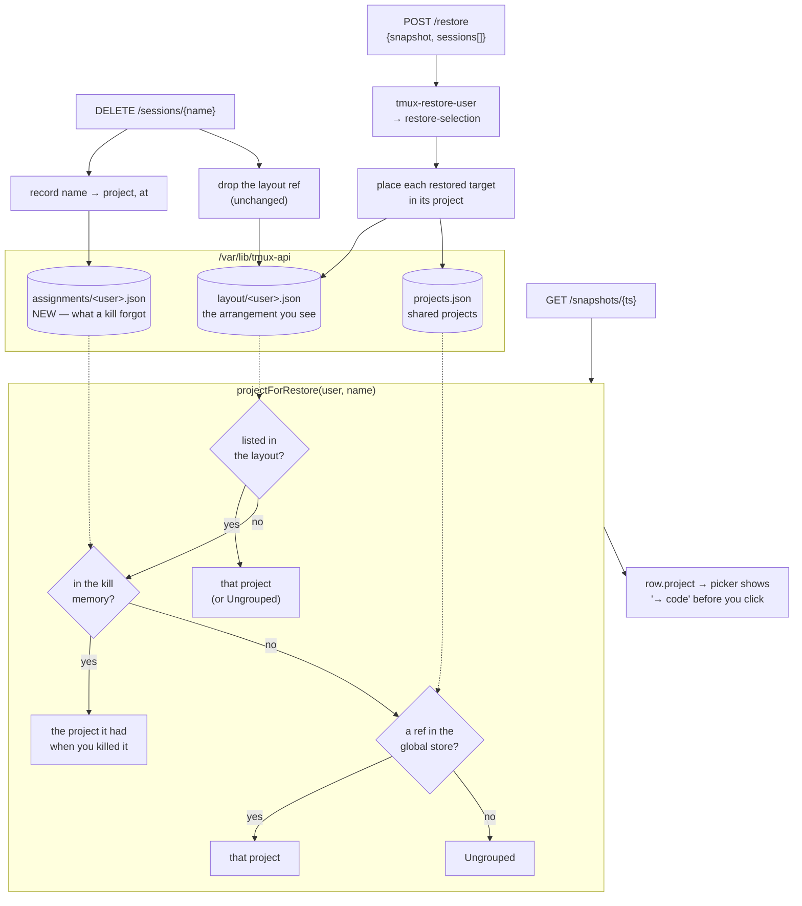

# Restore: diff-first rows and project memory — design

**Status:** done — landed and deployed 2026-08-16
**Date:** 2026-08-16
**Author:** Viktor (decisions) + Claude (research, drafting)
**Repos touched:** `terminal-lobby` (`tmux-api`, `frontend-v2`)
**Follows:** [2026-08-14 restore snapshot picker](2026-08-14-restore-snapshot-picker-design.md)

---

## Why

The snapshot picker shipped on 2026-08-14 and covers the case it was built for:
after a partial loss, pick the version that still holds what died and restore a
chosen subset of it. Two things are awkward once you use it for the ordinary
case — one session died, bring it back.

**Finding the one that changed takes scrolling.** Rows render in snapshot file
order, which is alphabetical. A snapshot of eighteen sessions where seventeen are
still running puts the single missing one wherever its name happens to fall, and
the reader has to scan every row to find the one that differs from what is
already open.

**A restored session can land in Ungrouped.** Grouping survives most deaths
already, so this shows up in two specific situations rather than always:

- a session killed from the UI — `killSession` drops its layout reference on
  purpose, so a later point-in-time restore has nothing left to place it by;
- a restore that has to rename — when the name is taken by a different
  conversation the session comes back as `<name>-<HHMM>`, and no layout has ever
  seen that name.

Both end in Ungrouped, which is the one place a recovered session is hardest to
find again.

---

## Where assignment actually lives

Worth stating plainly, because two stores hold overlapping information and
which one is authoritative decides the design.

| Store | Path | Holds | Prunes dead sessions? |
|---|---|---|---|
| Per-user **layout** | `/var/lib/tmux-api/layout/<user>.json` | ordered projects, each with its session names, plus Ungrouped | No — except on a UI kill |
| Global **project store** | `/var/lib/tmux-api/projects.json` | multi-owner projects: members, attach mode, `(owner, name)` refs | No |

The sidebar renders from the **layout** (`lobby.logic.ts` resolves
`layout.projects[].sessions` against the live set). The global store contributes
`Session.project` on the wire, which `lobby.logic.ts` uses as a fallback for a
live session the layout has never placed. On the live devvm today the layout's
`t3-code` lists seven sessions and the global store's lists four, so the two are
not copies of each other and the layout is the fuller record.

That the layout keeps references to dead sessions is what makes an OOM restore
regroup correctly today. The gap is specific: the assignment the
layout is asked to forget, plus names the layout has never seen.

`CONTEXT.md` describes Assignment as owned by the global project store. That
matched the intent of the shared-projects migration; the rendering path settled
on the layout. This work corrects the wording so the two agree.

---

## Decisions

| # | Decision | Choice |
|---|---|---|
| 1 | Row order | Rows that would be restored first, already-running below a labelled divider |
| 2 | Snapshot list order | Unchanged — chronological, newest first |
| 3 | Already-running rows | Stay on screen below the divider, still not selectable |
| 4 | Which project a restore targets | The one it belonged to **most recently**, not the one recorded at snapshot time |
| 5 | Where that memory lives | A new per-user store in `tmux-api`; snapshot files keep their three columns |
| 6 | Renamed restores | Join the original's project, placed directly after it |
| 7 | UI scope | `frontend-v2` only; the vanilla picker is untouched |
| 8 | Row preview | Rows carry their resolved destination project, shown in the picker |

Decision 4 is the one with a real alternative. Recording the project **in the
snapshot** would be faithful to the moment — restoring a three-day-old snapshot
would restore the arrangement of three days ago. It needs a fourth column in
`tmux-persist.sh` (the `infra` repo), and the roughly 200 snapshots already on
disk would carry no project, so the feature would only apply going forward.
Last-known needs no `infra` change, works on every existing snapshot, and
matches the dominant use — bringing back a session that died minutes ago, into
the project it is a part of now.

Decision 5 follows from 4: if the destination is "where it belongs now", the
answer is derived from live lobby state, and `tmux-persist` never needs to know
about projects.


### As built

All eight decisions shipped as designed, in `terminal-lobby` (`4545fae`,
`28f7972`), deployed the same day to both tiers.

Two things the design did not anticipate, both found while building:

- **The `show` call had to move ahead of the restore.** Placement needs each
  row's target name, and resolving the snapshot afterwards reports every row as
  live — the `-HHMM` targets are gone by then. `restoreFromSelection` now reads
  the snapshot first and restores second, which is also the view the picker
  showed.
- **The client's layout write-grace hid the placement.** v2 holds its own layout
  for 4 s after a local change and warns when the server's copy differs. A
  restore inside that window kept the old arrangement on screen and could warn
  about a change the same click had asked for, so `restore()` now clears the
  grace before refreshing.

Verified on the live devvm: a throwaway session grouped into `code`, killed
through the API — which wrote `qa-projmem → code` into the new memory and
dropped the layout reference as before — then restored through the picker's own
endpoint and rendered back inside `code`. The renamed path is covered by unit
tests rather than that live run: reproducing it needs a live session running a
different conversation under the same name.

---

## Architecture



The memory has exactly one writer (`killSession`) and one reader (the resolver),
so it does not drift during normal use: while a session is alive or merely dead,
the layout answers first and the memory is never consulted.

---

## Data model

```
/var/lib/tmux-api/
  layout/<user>.json          unchanged
  projects.json               unchanged
  assignments/<user>.json     NEW — 0600, same shape rules as layout/
```

```json
{
  "version": 1,
  "entries": [
    { "name": "repowise", "project": "code", "at": 1786837853 },
    { "name": "qa-pfx",   "project": "",     "at": 1786834418 }
  ]
}
```

`project: ""` records "this was Ungrouped when you killed it", so deliberately
un-grouping a session before killing it is not undone by a later restore.

Retention is by count: newest 500 entries, oldest dropped on write. At the
observed kill rate (27 tombstones in wizard's file over two days) that is
roughly a month, and the file stays well under the layout's own size.

---

## Restore placement

For each selected row, after the wrapper reports success:

| Situation | Placement |
|---|---|
| `action: skip` | nothing — the session is already live |
| `action: in_place` | nothing — the name already exists and keeps its slot |
| Target already listed in the layout | nothing — the reference survived the death |
| Layout forgot the name | append the target to the resolved project |
| Renamed (`foo` → `foo-1250`) | insert directly after `foo` in whatever list holds it |
| No project resolves | leave it — Ungrouped is where unplaced sessions already fall |

When the original name is also a `(owner, name)` ref in a shared global project,
a renamed target is mirrored there, so co-members see the recovered session
rather than only its owner.

The targets come from resolving the snapshot **before** the wrapper runs, which
is the same view the picker showed, so the name the user was promised is the name
that gets placed.

---

## API surface

One additive field. The vanilla picker ignores unknown keys, so its behaviour is
unchanged.

| Route | Change |
|---|---|
| `GET /snapshots/{ts}` | rows gain `project` — the resolved destination, `""` for none |
| `POST /restore` | unchanged body; now also places restored sessions |

Resolution stays server-side, so the string the picker previews and the list the
restore writes come from one function.

---

## UI behaviour (v2)

```
Restore from snapshot                       [x]

  SNAPSHOT        SESSIONS   vs LIVE
 *13:05 (3m ago)     9         -            chronological, unchanged
  13:00            10        +1
  12:50            18        +9   last full

  1 of 10 not running               [all] [none]
  +----------------------------------------+
  | [x] repowise      ~/code    -> code    |
  | -- already running (9) --------------- |
  | [ ] portal        ~/code               |
  | [ ] matrix        ~/code               |
  +----------------------------------------+
```

The split is one pure function over the rows the server sent — everything with an
action other than `skip` first, snapshot order preserved inside each part. A
session killed after the snapshot is a difference from what is live, so it sorts
with the changed rows, still unticked, keeping its "you killed this at 12:52"
note.

The divider renders only when both parts have rows. The destination project shows
on rows that would be restored; a row heading for Ungrouped shows nothing rather
than the word.

---

## Test plan

Test-first, following each side's existing patterns.

| Test | Covers |
|---|---|
| `TestKillRemembersAssignment` | A UI kill writes `name → project` before dropping the layout ref |
| `TestKillRemembersUngrouped` | An ungrouped session is remembered as `""`, not skipped |
| `TestAssignmentMemoryPrune` | Retention holds at 500, oldest dropped first |
| `TestProjectForRestorePrecedence` | layout → memory → global store, and Ungrouped when none matches |
| `TestRestorePlacesForgottenSession` | A killed-then-restored session returns to its project |
| `TestRestorePlacesRenamedAfterOriginal` | `foo-1250` lands directly after `foo` |
| `TestRestorePlacementIdempotent` | A row whose reference survived is not duplicated |
| `TestSnapshotRowsCarryProject` | `GET /snapshots/{ts}` exposes the resolved destination |
| `orderRows` unit tests | Changed first, order stable within each part, all-skip and all-changed |
| picker render test | The missing row is first, the divider counts the rest, the project shows |

---

## Deploy

1. `./scripts/deploy.sh` — `tmux-api`, which backs both tiers. Claim
   `service:tmux-api` in presence first, and check the cgroup before the restart
   as the 2026-08-14 deploy did.
2. `./scripts/deploy-v2.sh` — the v2 SPA on `terminal-dev.viktorbarzin.me`.

---

## Accepted risks

> [!NOTE]
> **Last-known, not point-in-time.** Restoring an old snapshot places sessions
> where they belong now. Moving a session between projects and then restoring a
> snapshot from before the move puts it in the new project. This is the intent of
> decision 4; the alternative is recorded above if the point-in-time reading ever
> turns out to matter more.

> [!NOTE]
> **The layout is written by two parties.** Clients PUT the whole layout,
> last-writer-wins, and the server now also patches it during a restore. A client
> holding a layout from before the restore could overwrite the placement on its
> next PUT. v2 refreshes sessions and layout immediately after a restore returns,
> which closes the ordinary window; a second browser left open on a stale layout
> is the case that could still lose the placement.

> [!NOTE]
> **Name reuse.** The memory is keyed by session name. Killing `foo` in project
> `code` and later creating an unrelated `foo` gives the new one no memory —
> the layout answers first while it is alive. Only restoring `foo` from a
> snapshot consults the memory, which is the intended behaviour.

## Open questions

- Whether the picker should offer "restore into the project it was in at the
  time" as an explicit choice once snapshots start carrying a project column.
  Nothing today asks for it.
- The 500-entry retention is a first estimate from two days of kill data. Worth
  revisiting once the file has real history.
