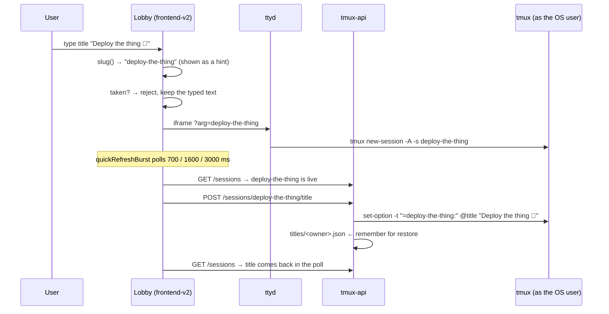
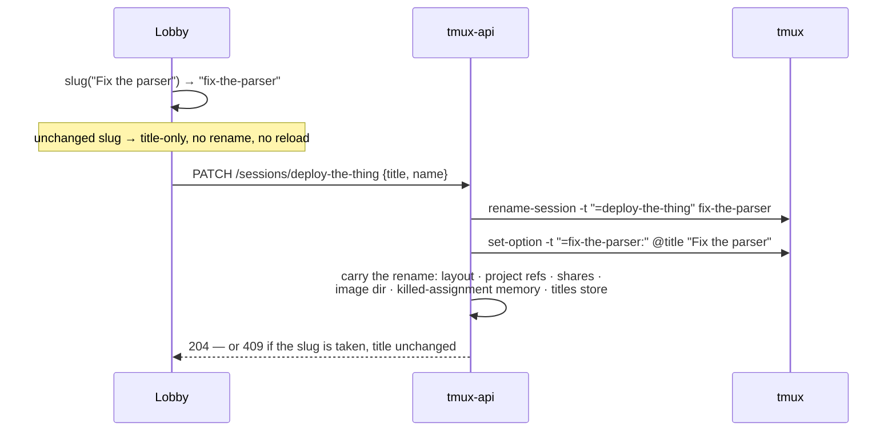

# Session titles — arbitrary text names, normalized tmux names

**Status:** Shipped 2026-08-16 (designed in a grilling session, built the same
day) · **Repo:** terminal-lobby · **Owner:** Viktor (wizard)

Today a session name must match `^[a-zA-Z0-9_-]{1,32}$`, so "Deploy the thing"
and "тестова сесия" are both refused. This adds a **Title** — arbitrary text
that every surface displays — while the tmux session **name** stays the
normalized slug that the rest of the system is keyed by.

```stats
64 | runes a title may hold
32 | characters the tmux name still fits
6 | stores a rename now moves
33 | shared title→name test vectors
```

## Language

**Title**
: Arbitrary display text a person chooses for a session: spaces, punctuation,
  emoji, any script. Up to 64 runes. Stored on the session itself, so everyone
  who can see the session sees the same title. Optional — a session without one
  displays its name.
  _Avoid_: label, nickname, display name

**Name** (unchanged)
: The tmux session name, `^[a-zA-Z0-9_-]{1,32}$`. The identity everything else
  is keyed by: tmux targets, URL segments, store keys, the image directory, the
  `?arg=` attach contract. Derived from the title, never typed directly.
  _Avoid_: slug in user-facing copy (it is fine in code)

## Decisions

| Decision | Choice | Why |
|---|---|---|
| Title vs. wider name charset | **New title field; name stays a slug** | Keeps every identifier guarantee — sudo argv, file paths, URL segments, store keys — exactly as it is |
| Where the title lives | **tmux session option `@title`** | Same mechanism as `@claude_state` (ADR-0001); rides the existing poll for free; session-scoped, so guests see the owner's title |
| Retitle and the name | **Re-slug: the name tracks the title** | The name stays legible in a shell; requires completing the rename cascade (below) |
| Slug collision | **Reject, keep the old title** | Consistent with the existing duplicate-name guard (2026-07-15) |
| Non-Latin titles | **Transliterate, then slug**; `session-N` when nothing survives | A Cyrillic title still yields a meaningful tmux name |
| Slug case | **Lowercased** | It is a normalized identifier now, not the human's chosen text |
| Where slug lives | **Go and TypeScript, one shared fixture** | Create must keep working while tmux-api is down, so the browser has to derive names on its own |
| New-session stamping | **Frontend POSTs the title once the poll sees the session** | Leaves the ttyd argv contract and the sudo boundary untouched |
| Slug visibility | **Live hint while naming, nowhere else** | Makes the collision message legible without putting two concepts on every card |
| Title cap / empty | **64 runes; empty unsets** | Empty is the state every existing session is already in |
| Who may retitle | **Owner only** (act-as resolves to the owner) | Retitling renames, which rewrites share rows and project refs |
| Titles across restore | **`titles/<owner>.json` in tmux-api** | Keeps the change inside this repo; no snapshot-format migration |
| T3 threads | **Thread title follows the lobby title** | What decision 7 was reaching for — the two lists read identically |
| Project names | **Out of scope** | Projects are matched by name with no id field; needs project ids first |

## How a title reaches a session



Retitling is one call, so rename and stamp cannot half-apply:



## Reading the title

`@title` joins the format string tmux-api already polls. Three details came out
of measuring tmux 3.4 directly rather than reasoning about it:

**The field separator changes from `|` to a tab.** `pane_title` is arbitrary
terminal-controlled text and is last in the format precisely so an embedded `|`
cannot shift the columns. `@title` is arbitrary too, and only one field can be
last:

```
#{session_id}⇥#{session_name}⇥#{session_attached}⇥#{session_activity}⇥
#{session_created}⇥#{@claude_state}⇥#{pane_pid}⇥#{pane_current_command}⇥
#{@title}⇥#{pane_title}
```

> [!WARNING]
> A control character cannot separate these fields. tmux escapes non-printable
> bytes on output — in the format literal and inside expanded values alike — so
> both a `\x1f` separator and a `\x1f` inside a value arrive as the four
> characters `\037`, and every row parses as one field. It surfaces as an empty
> session list, not an error.

A unit separator (`\x1f`) was the first choice and does not work. Measured on
tmux 3.4: tmux escapes non-printable bytes on output, in the format literal and
inside expanded values alike, so a `\x1f` separator arrives as the four
characters `\037` — and so does a `\x1f` inside a value, leaving the two
indistinguishable and every row parsing as a single field. Tab passes through
raw on both sides.

What makes tab safe is the argument that made `|` safe for one field, now good
for two: a title can never contain a tab, because control characters are
stripped before a title is stored, and `pane_title` stays last so an embedded
tab is soaked into the trailing field rather than shifting the row. A row is
also anchored at the front — `session_id` must look like `$N`, which catches a
separator smuggled into a session name before the numeric columns have to.

`#{session_id}` (`$0`, `$1`, …) is added at the same time. It survives a rename,
which is what lets another tab follow a session whose name changed rather than
losing track of it.

> [!IMPORTANT]
> tmux resolves a bare session name by unambiguous **prefix match** and exits 0
> doing it. Deriving names from titles makes pairs like `deploy` and
> `deploy-the-thing` ordinary, so every target this feature uses is `=`-anchored.

**Setting the option needs the `exactPane` target form.** `set-option -t "=name"`
is rejected — its `-t` takes a pane — so the target is `"=" + name + ":"`, as
`sessionio/tmux.go:105` already documents. The `=` matters more than usual here:
`sessionio/tmux.go:95` records that tmux resolves a bare name by unambiguous
prefix match and exits 0 doing it, and re-slugging makes pairs like `deploy` and
`deploy-the-thing` ordinary. `tmux-api` has `exactSession` but no `exactPane`,
so it gains one.

Measured on tmux 3.4: `set-option -t "=name:" @title` sets a session option that
`list-sessions -F '#{@title}'` reads back; `"Hello, world! | тест 🚀"`
round-trips intact; `set-option -u` unsets it and it reads back empty, including
when the option was never set.

These are covered by tests that drive the real handlers against a real tmux
server on a private socket (`tmux-api/title_live_test.go`), skipped where tmux
is unavailable. They are what caught the separator problem above, which a
stubbed tmux could not show: it surfaced as an empty session list.

## Deriving the name

`slug(title)`, in both languages, against one fixture:

1. Replace control characters (C0/C1, newline, tab) with a space, collapse
   whitespace runs, trim. A space rather than nothing, so a title pasted out of
   a terminal reads as words rather than one run-on.
2. Transliterate to ASCII — Latin-1 accents by decomposition, Cyrillic and Greek
   by table. Hand-rolled: no module here depends on `golang.org/x/text`, and a
   table covering the scripts actually in use is about a hundred lines.
3. Lowercase.
4. Keep `[a-z0-9_-]`; collapse every other run to a single `-`; trim leading and
   trailing `-`.
5. Cut to 32 characters, trimming a trailing `-`.
6. Empty result → `session-N`, the first N free among live sessions.

`t3-bridge`'s `Slug()` (`resurrect.go`) already did steps 4–6 and moves
into the shared package, so Go has one implementation rather than two. Its
case-preserving behaviour changes to lowercase, which affects the names
t3-bridge gives newly resurrected sessions; existing sessions are not renamed.

The fixture is a JSON file of title→slug pairs read by both the Go test and the
vitest suite, so a divergence between the two implementations fails both.

```
"Deploy the thing 🚀"  → deploy-the-thing
"тестова сесия"        → testova-sesiya
"café ☕"              → cafe
"会议"                  → session-1
"Deploy!!! the thing"  → deploy-the-thing   (collides with the first)
```

## The rename cascade

Renaming was previously a rare act, and `renameSession` carries it into tmux and
the per-user layout. Re-slugging makes it routine, so the remaining stores that
key on the name are brought along in the same change.

| Store | Where | What a missed rename costs |
|---|---|---|
| per-user layout | `layout.go:178` | already handled |
| project-store session refs | `projects.go` | the session leaves other members' sidebars |
| share rows | `shares.go` | guests lose access with no signal |
| image directory | `/var/lib/clipboard-store/<owner>/<name>/` | images stranded |
| killed-assignment memory | `assignments.go` | a later restore lands in Ungrouped |
| titles store | new | the title is lost on restore |
| `visits` (per-browser) | `store/visits.ts` | a "done" badge may not clear |
| other tabs / devices | selection state | a stale tab can recreate the old name as an empty session via `new-session -A` |
| session-events registry | `registry.go` | self-healing — the option rides the session |
| tmux-persist snapshots | infra repo | history, deliberately not rewritten |

tmux-api and clipboard-upload both run as `wizard` and the store is
`wizard`-owned, so moving the image directory is a plain `os.Rename` rather than
a cross-service call.

The stale-tab case is what `#{session_id}` is for: a tab whose selected session
disappears looks for the same id under a new name and follows it, instead of
holding a name whose iframe would resurrect it empty on the next reconnect.

## Titles across a restore

tmux options die with their session, which is right for `@claude_state` and
wrong for a title someone chose. tmux-api keeps `titles/<owner>.json` —
`name → title` — written whenever a title is set or a session is renamed, and
read where `placeRestoredSessions` already runs, re-stamping `@title` on each
restored session. This is the same shape as the killed-assignment memory: one
fact that has to outlive the session.

Entries are dropped when no live session and no snapshot mentions the name.

The alternative — a fourth column in the tmux-persist snapshot — is structurally
tidier, since the snapshot already carries the facts that outlive a session. It
was not chosen because `tmux-persist` lives in the infra repo, whose master
auto-applies, and it would mean a snapshot-format migration across two repos for
one string.

## API

```
POST  /sessions/{name}/title   {"title": "…"}    204 · 400 · 404
PATCH /sessions/{name}         {"title": "…", "name": "…"}
                                                204 · 400 · 404 · 409
```

`POST …/title` stamps a title without touching the name — the create path, and
clearing a title. `PATCH` is the retitle: rename and stamp together, 409 when
the derived name is taken, leaving the title as it was.

`POST /sessions/{name}/rename` stays as it is; `t3-sync/tmuxapi.go:78` calls it.

Both resolve the actor through `resolveOSUser`, so only the owner — or an
administrator acting as them — can retitle. Sessions shared with someone remain
attach-only.

The session JSON gains `title` and `id` (tmux's `#{session_id}`). A session
with no `@title` omits `title`, which is every session that exists today.

## Frontend

- The create box and the rename input take a title, showing the derived name
  beneath as it is typed. Everywhere else — cards, tab title, palette, dock,
  push bodies, the kill confirmation, aria-labels — shows the title, falling
  back to the name.
- The push *tag* stays the name: it is identity used for coalescing, not
  display.
- A retitle whose slug is unchanged skips the rename, so adding an emoji to a
  title does not reload the terminal. When the slug does change, the iframe
  re-navigates and tmux keeps the scrollback, since it is the same session.
- Titles are trimmed and capped at 64 runes at the input, so nothing is silently
  truncated later.

## T3

`adopt.go` creates a thread with the title rather than the tmux name, and
`reconcile.go` compares against it. The title comes from the session's own
`@title` option through the same `Option()` call the syncer already makes for
the thread stamp — so no new call, and no new dependency on tmux-api. A session
nobody has titled falls back to its tmux name, which is every session today.

The option name moved into `sessionio` (`OptionTitle`) so tmux-api and t3-sync
cannot disagree about its spelling.

The `binding.FromT3()` guard is unchanged: a session the bridge named after a
workspace root still does not push that name over a title someone chose in T3.
Renames made in T3 continue not to flow back to the lobby.

## Out of scope

> [!NOTE]
> Project names carry the same restriction. They are left alone here because
> they need a prerequisite this change does not build.

**Project names** carry the same restriction and would benefit from the same
treatment. They need a prerequisite first: the layout matches projects *by
name* and has no id field, and the per-browser collapse store keys on the
project name too, so a project title/slug split means introducing project ids
and migrating both. Worth doing as its own change.

## Open questions

- The transliteration table covers Latin-1, Cyrillic and Greek. CJK and
  emoji-only titles fall through to `session-N`. Whether that is worth extending
  depends on whether anyone titles sessions in those scripts.
- `titles/<owner>.json` grows with retitles and is pruned against live sessions
  and snapshots. The pruning interval is not yet measured against a real store.
