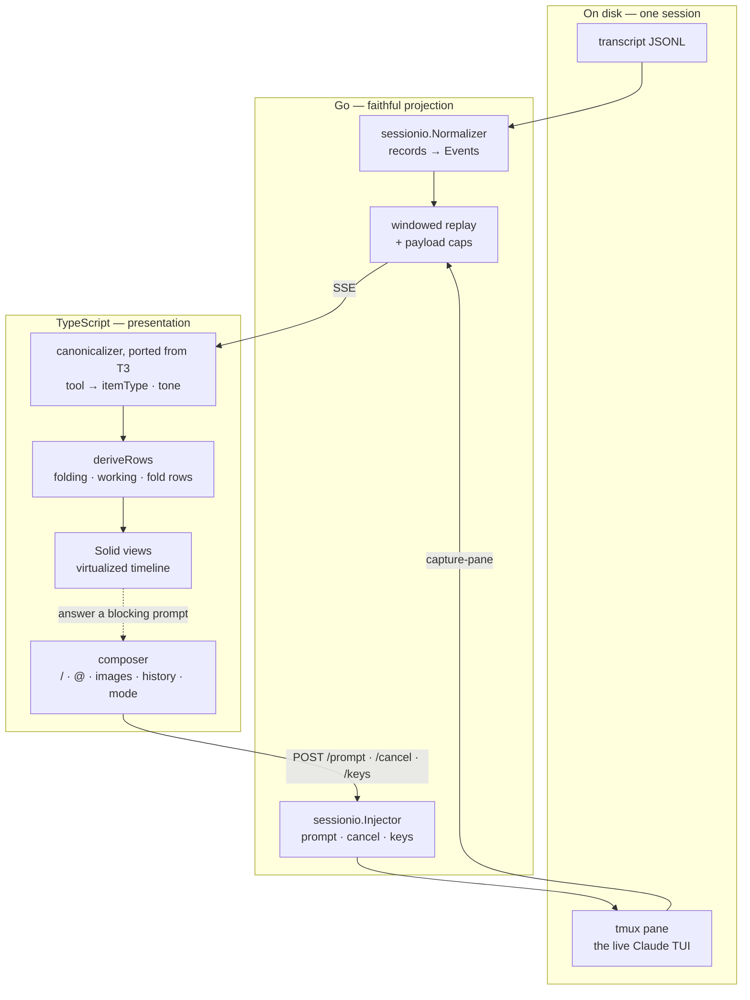
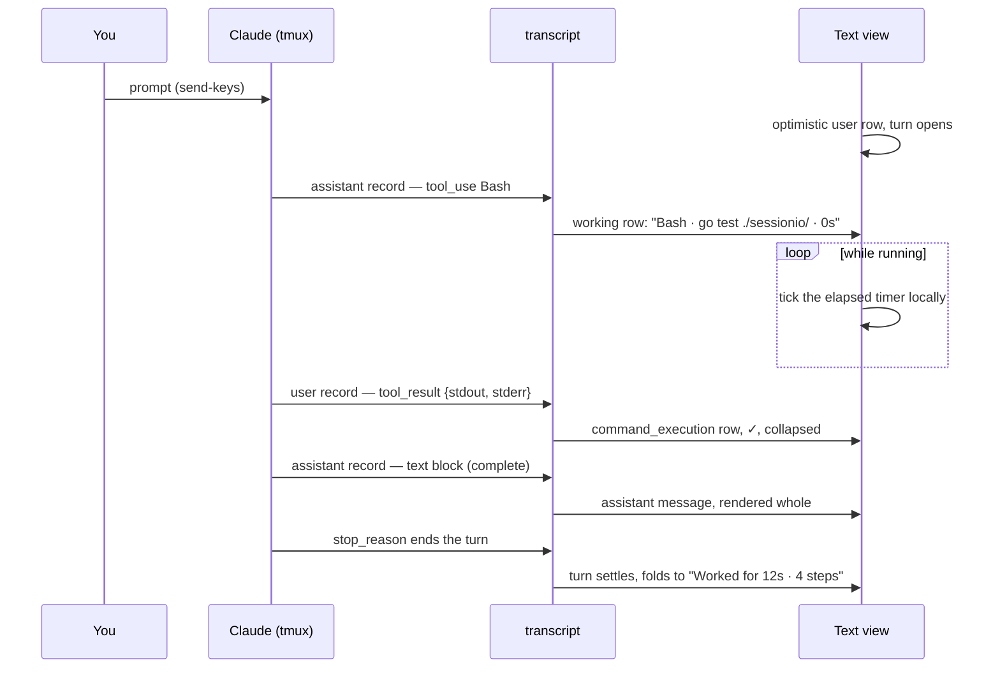
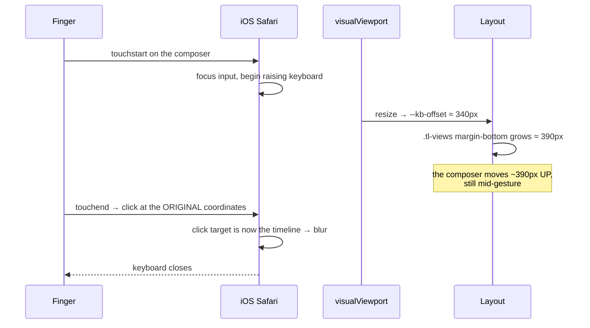

# Text view — a native structured render of a Claude Code session

**Status:** built and deployed · **Date:** 2026-08-16 · **Owner:** wizard

The text view is the lobby's structured rendering of a session: the same tmux
Claude the terminal view attaches to, read from its transcript instead of its
pty. This document settles what it should show, what it should let you do, and
how much of T3 Code's model we adopt.

It supersedes nothing. It builds directly on
[`2026-07-19-t3-two-view-mode-switch-research.md`](2026-07-19-t3-two-view-mode-switch-research.md),
which established the two-view relationship and the switch mechanics; that
research still holds, and this plan fills in the half it deferred — the render
itself.

---

## 1. Where it stands today

```stats
3 days | unavailable in production
541 | thinking blocks dropped, one session
626 | tool results sent without their structured payload
28.9 MB | largest transcript on this box
```

Four measurements taken on this box on 2026-08-16.

**The view has been unavailable since 2026-08-14.** `GET /events/{session}` answers
`500 streaming unsupported` for every session and every user. Commit `d7b509e`
wrapped each service in `timing.Wrap`; its `statusWriter`
(`telemetry/httpmw.go:91`) embeds `http.ResponseWriter` but implements no
`Flush`, so the `w.(http.Flusher)` assertion at `session-events/sse.go:44`
fails and the stream is refused before it starts. `session-events` is the only
service with an SSE endpoint, so it is the only one affected. Reproduced live
against `localhost:7685`. The fix is a `Flush()` passthrough.

**Most of the transcript never reaches the wire.** `sessionio/normalize.go`
emits three block types — `text`, `tool_use`, `tool_result`. Profiling one real
5,086-record session: 541 `thinking` blocks, `usage` on all 1,697 assistant
messages, and `toolUseResult` on all 626 tool results are dropped before they
leave Go, along with the record types `mode` / `permission-mode` (297),
`queue-operation` (232), `system` carrying `hookInfos` (301), `attachment`
(513), `compactMetadata` and `toolDenialKind`.

**What `toolUseResult` actually carries**, sampled across the twelve most
recent transcripts:

| Tool family | Shape | Count |
|---|---|---|
| Bash | `{stdout, stderr, interrupted, isImage, noOutputExpected}` | 3,309 |
| Edit | `{filePath, oldString, newString, structuredPatch, originalFile, replaceAll}` | 313 |
| Write / Edit (content form) | `{type, filePath, content, structuredPatch, originalFile, userModified}` | 114 |
| Read | `{type, file}` | 169 |
| AskUserQuestion | `{questions, answers, annotations}` | 100 |
| WebSearch | `{query, results, searchCount, durationSeconds}` | 39 |

Every row we render as `▸ tool ✓` today has that payload available to it and unused —
including real unified diffs (`structuredPatch`) and a clean stdout/stderr split.

**The rendering layer is thin and the interactive layer is absent.**
`MessagesTimeline.tsx` is 335 lines, `timeline.logic.ts` 443, `TextView.tsx` 37,
`Composer.tsx` 133. There is no virtualization — a `<For>` over every row. The
`PermissionPanel` has no producer today: the web-mediated permission path was
removed in `575d4f5`, and nothing emits `permission_request`.

What already works well and stays: the turn model in `normalize.go` (prompt
opens a turn, `EndsTurn` closes it, interrupt notices settle it), the
`Conversational()` whitelist, the byte-offset cursor with `Last-Event-ID`
resume, the pure-logic split, and the row-identity memoization in
`MessagesTimeline.tsx` that keeps an expanded tool row open across a stream
append.

---

## 2. Decisions

| # | Decision | Why |
|---|---|---|
| 1 | **T3-style agent chat**, not a facsimile of the CLI. Provider-neutral canonical item types, a tone-tagged work log kept separate from message text. | The visual grammar people already read agent work in. It also keeps the render explicit about being a projection rather than a mirror of a TUI. |
| 2 | **Carry everything the transcript has**: thinking, structured tool payloads, agent work structure (todos, plans, subagents), and session meta (usage, mode changes, queued prompts, compaction, hook errors). | These are the difference between a row that says a tool ran and a row that says what it did. The data is already on disk; only the normalizer stands between it and the view. |
| 3 | **Blocking prompts are answered by mirroring the pane and injecting keys** (ADR-0010). A pending `AskUserQuestion` is derivable from the transcript; a pending permission from the existing Notification-hook state stamp plus a `capture-pane` read. Answers go into the same pty. | No new hook on the tool path. `575d4f5` removed the PreToolUse broker because a PreToolUse `"ask"` overrides the allowlist and permission mode, so with nothing watching it forced a prompt on every tool call for every user on the shared devvm. Key injection keeps both surfaces live and adds no per-tool-call cost to other users' sessions. Accepted risk: coupling to the TUI's key handling and dialog wording. |
| 4 | **Composer reaches CLI parity**: `/` command menu, `@` file completion, image paste/drag, prompt history, visible queueing, mode control. | Text mode is the phone's primary surface. Anything you cannot do there sends you back to a 40-column pty on a handset. |
| 5 | **Port T3's pure logic under MIT; rebuild the views in Solid.** | T3 Code is MIT (T3 Tools Inc, 2026), so copying is permitted with the notice retained. React-vs-Solid rules out component reuse, but the derivation rules — which is where the accumulated edge cases live — are plain TypeScript. Inventory in §8. |
| 6 | **Liveness comes from transcript data, not a second stream.** A rich working row: in-flight tool, live elapsed timer, step count, last thinking or text block. | The `tool_use` record lands the moment Claude emits it, so the working row can be specific for free. Token-level streaming is a **non-goal on this path** — see §5. |
| 7 | **Open on a recent window with lazy payloads.** Last ~20 turns replayed; tool results capped on the wire with fetch-on-demand for the rest; "Load earlier" walks back. | Worst case on this box is a 28.9 MB transcript: ~4,936 events and 5.5 MB of tool results, one of them 673 KB. First paint on a phone should not depend on a session's age. |
| 8 | **Text becomes the default on phones, terminal stays the default on desktop** — flipped last, gated on verifying SSE through the prod Cloudflare ingress. | Avoiding SSE-through-Cloudflare was one of the two reasons for terminal-first (`2026-08-08-terminal-first-v1.md`); that path is unverified in prod, and the flush bug has masked it since 2026-08-14. If it proves unreliable, we do not flip and nothing else here is wasted. |
| 9 | **One landing.** All of it builds in `wizard/text-view-native` and merges to master together. | Chosen over staged delivery. |
| 10 | **Fix the mobile composer keyboard** (§7.1) and **grow the session list into a switcher** (§7.2). | Raised during design; both are in the same surface and land with this work. |

> [!IMPORTANT]
> A PreToolUse hook returning `"ask"` **overrides** the allowlist and the
> permission mode — it does not mean "defer to normal flow". That is what made
> the removed broker force a prompt on every tool call for every user on the
> shared devvm. Any future hook on this path must fall through by exiting 0 with
> no decision at all.

---

## 3. Architecture



This split was taken directly rather than in the interview, so it is worth
stating plainly: **Go carries data, TypeScript decides presentation.** Transcript-format churn is
absorbed once, in the normalizer, where it is already unit-tested. Label
vocabulary, tone and icons — the things that change every time we look at the
view — live where iteration does not need a service redeploy.

---

## 4. The wire, and the canonical model

### 4.1 New event kinds and fields (Go)

`sessionio/event.go` gains kinds `thinking`, `todo`, `meta`, and keeps the
existing `permission_request` / `permission_resolved` vocabulary now that
something will populate it again. `Event` gains:

- `result` — the decoded `toolUseResult` object, capped (§6) and tagged when truncated.
- `usage` — token counts from `message.usage`, on the record that closes a turn.
- `mode` — the permission/plan mode in force, emitted on change.
- `sidechain` — true for subagent records, so the client can nest rather than interleave.

Everything stays additive: the field names, optionality and `kind` strings
already on the wire do not move, so a client that has not been reloaded keeps
rendering exactly what it rendered before.

### 4.2 Canonical items (TypeScript)

Each tool call is classified once, in ported T3 code, into
`file_read | file_change | command_execution | web_search | image_view |
mcp_tool_call | dynamic_tool_call`, and each work-log entry is tagged
`tone: info | tool | approval | error`. The renderer never sees a raw tool name
or a raw JSONL field; it sees an item with a label, a detail, an optional
changed-file list and a lifecycle status.

| Item type | Label | Body when expanded |
|---|---|---|
| `command_execution` | the command | stdout and stderr as separate blocks, exit state, `interrupted` flag |
| `file_change` | the path | the `structuredPatch` rendered as a diff |
| `file_read` | the path and range | the read content |
| `web_search` | the query | the result list |
| todo update | the checklist | one checklist that updates in place across the turn |
| subagent (`Task`) | the agent and its prompt | a nested sub-timeline of that agent's own work |

---

## 5. Turn, liveness, and what the view cannot do

The turn model in `normalize.go` is unchanged. What changes is what a running
turn looks like.



> [!NOTE]
> **Token-level streaming is not possible on this path.** It is a stated
> non-goal, not an unfinished feature — if we want it later it needs a
> different source, and that is its own decision.

Claude Code writes one transcript record per *completed* block — sampled on a
live session, 95 of 95 assistant records carried exactly one block and a
terminal `stop_reason`. A long answer therefore arrives in one piece. The
working row closes as much of that gap as the data allows: it names the tool
actually running, counts steps, and ticks a timer. Real streaming would need a
different source — a pty tail, or stream-json.

---

## 6. History and payload budget

- **Open** replays the last ~20 turns. Older history arrives through "Load
  earlier", one window at a time.
- **Tool results are capped on the wire** at a few KB with a truncation marker;
  "show full output" fetches the remainder for that one result.
- **Resume is unchanged in spirit**: `Last-Event-ID` still identifies where a
  reconnecting client left off; the window is a floor on what a fresh open
  replays, not a change to the cursor.
- Virtualization lands regardless of window size, because a single long turn can
  produce hundreds of rows on its own.

---

## 7. Mobile

### 7.1 The composer keyboard bug

Tapping the message field raises the keyboard and then immediately dismisses it;
tapping roughly a keyboard-height above the field works. The mechanism:



`body.has-soft-keys .tl-views` (`app.css:1262`) sets
`margin-bottom: calc(var(--sk-h) + var(--kb-offset) + env(safe-area-inset-bottom))`,
and `.tl-view` is `position:absolute; inset:0` inside it, so the composer — the
bottom child of that column — is displaced by the full keyboard height while the
tap is still in flight. Tapping high works because it lands where the field will
be *after* the reflow.

**Fix:** acquire focus during the gesture, on `pointerdown`, before any layout
change, so the later click cannot steal it. Keep caret placement working by only
taking over when the field is not already focused. To verify on a real handset,
not in jsdom.

### 7.2 The session list and switching

Session rows are 42px after `e7c3417` (down from 54px), at the 40px floor set on
2026-08-16. Switching sessions on a phone is a round trip — back to Sessions,
find, tap — and the row's `⋯` is itself a 40px target inside the 40px row, so a
thumb landing right of centre opens the menu instead of the session.

- Rows grow to ~48px with a 15–16px name — still well below the old 54px.
- `⋯` moves to long-press, making the whole row one target.
- **Swipe left/right** in the session view moves between sessions without
  returning to the list.
- The session name in the session bar becomes a **tap-to-switch** dropdown.

---

## 8. What we take from T3 Code

T3 Code is MIT licensed (T3 Tools Inc, 2026). Ported files keep the notice and
name their upstream path and commit, so a future reader can diff against
upstream.

| From | Lines | Portability | What we take |
|---|---|---|---|
| `apps/web/src/components/chat/MessagesTimeline.logic.ts` | 713 | **High** — one `effect/Equal` call-site | Row derivation, turn folding, `MAX_VISIBLE_WORK_LOG_ENTRIES`, stable-row memoization, follow-rearm threshold, copy-state resolution |
| `apps/server/src/provider/Layers/ClaudeAdapter.ts` (extracts) | ~200 of 4,591 | **High** for the tables, none for the file | `classifyToolItemType`, `isReadOnlyToolName`, `classifyRequestType`, `extractPlanStepsFromTodoInput`, Claude task-state handling |
| `apps/web/src/session-logic.ts` | 1,633 | **Medium** — 5 `effect/*` call-sites | Work-log merge and collapse-by-`toolCallId`, failure heuristics, changed-file extraction |
| `apps/web/src/components/chat/MessagesTimeline.tsx` | 2,383 | **None** — React | Visual grammar only, read and reimplemented in Solid |
| Server orchestration layers | — | **None** — Effect-TS over their event bus | Nothing |

Their dependency set (`@legendapp/list`, `@base-ui/react`, `lucide-react`,
zustand, Tailwind, `@pierre/diffs`) is React-bound; our virtualization and diff
rendering will be Solid-native equivalents.

A small corroboration: T3's follow-rearm threshold is 40px and
our `PIN_SLACK_PX` is also 40 — arrived at independently.

---

## 9. Verification

The dev tier was retired in `ae2bf15`, so verification is against prod with the
`.prev` rollback available.

1. **SSE through Cloudflare** — the gate on decision 8. Confirm a stream stays
   open through the prod ingress across the 20s heartbeat and a reconnect.
2. **A real long session** — open the 28.9 MB transcript's session and measure
   first paint, transferred bytes, and scroll performance on a phone.
3. **Fidelity spot-checks** — a turn with a diff, a failed Bash, a todo list, a
   subagent, a thinking block, and a compaction boundary; each rendered from a
   real transcript rather than a fixture.
4. **Blocking prompts** — an `AskUserQuestion` and a permission prompt each
   answered from the text view on a phone, with the terminal watched to confirm
   one answer and no double-send.
5. **The keyboard bug** — on the actual handset, tapping the field at its
   painted position.
6. **Suite green** — the full v2 suite plus new tests for the ported logic,
   which come with T3's own test expectations where those port.

---

## 10. Out of scope

- **Cross-user text view.** `session-events` deliberately refuses `?as=`
  ("the text view is not available while acting as another user",
  `authuser.go:125`) because it reads `/home/<user>/.claude/projects` directly
  and has no cross-user path. Left as it is; it is its own design.
- **Split view.** Text and terminal remain an XOR swap. Showing both would
  double-render one session, as established in the 2026-07-19 research.
- **Token-level streaming**, per §5.
- **The T3 bridge.** Unaffected — it reads the same transcript through the same
  package, and nothing here changes `sessionio`'s existing contract.

## 11. What building it changed

Four things came out differently from the plan. Each is in the code with its
measurement; they are collected here so the doc and the build agree.

**Row virtualization is gone, and the plan was wrong to assume it.** §6 called
it a hard requirement. The implementation derived its window from an average row
height, with spacer divs standing in for the rows outside it — and those spacers
are most of `scrollHeight`, so the average was computed from a number it had
itself produced. It settled and stopped responding to scrolling: measured on a
real 675-row session, the leading spacer read 21,863px at *every* scroll
position and the same 29 rows stayed mounted, so a session holding 11 questions
and 45 diffs appeared to hold none. What bounds the DOM instead is the data —
20 turns on open, folding, and bounded "Load earlier" steps. That same session
renders every row and expands all of its folds in 782ms. If this ever does hurt,
the fix is a virtualizer that measures rows rather than averaging them.

**An oversized tool result is pruned, not dropped.** §6 said the structured form
would be dropped whole when it exceeded the cap, on the grounds that half a JSON
object is worse than none. That reasoning held; the consequence did not.
An Edit's `toolUseResult` carries `originalFile` — the whole file before the
change — beside the `structuredPatch`, so results routinely blew the cap and
took the diff with them: 209 results across the six most recent transcripts
carried a diff, 54 exceeded the cap, so a quarter of all edits would have
rendered as a file change with nothing visible changing. Pruning the bulky
fields and trimming stdout/stderr brings 48 of those 54 back under the cap.

**The window had to be made to apply at all.** A source's transcript was read by
a goroutine started alongside it, so a client that opened the stream in that gap
replayed an empty log and then received the whole session live, bypassing the
window entirely — 3,396 events and 3.9 MB where 20 turns was 388 events and
442 KB. Sources now hydrate before they are handed out.

**The ingress needed four new routes.** `/earlier`, `/result`, `/pane` and
`/keys` are new root paths on session-events, and the terminal stack's
IngressRoute matched only `/events/`, `/prompt/` and `/cancel/` — the features
would have shipped to the browser and 404'd at the edge. Added in infra
`stacks/terminal/main.tf`.

## 12. The day after — what use turned up

Everything below was found by using the view, and each item is in the code with
its measurement.

**Markdown was richer than the plan claimed, and mermaid was quietly broken.**
Assistant text renders full CommonMark plus GFM tables, task lists,
strikethrough, autolinks, sanitized HTML and inline images, and mermaid fences
render as real SVG. But mermaid carried three defects this repo had already met
on the pages site and never applied here: a fence that fails to parse stranded
its error container in `<body>` (no `suppressErrorRendering`), diagrams shrank to
their container instead of panning (`useMaxWidth` per diagram type, plus
`flex: none` on the SVG — a flex item shrinks by default, which silently undid
the config), and a theme switch left the palette baked in. Code fences are now
highlighted through the same lazy highlight.js path the file preview uses.

**Opening a session was quadratic.** The store appended each arriving event on
its own, so the transcript→rows derivation re-ran over the whole array per event:
deriving once cost 10ms and deriving per event cost 2,644ms on a real 1,383-event
window. Events are coalesced into one store write per frame; the whole
client-side cost of that open is 26ms.

**The view switch was unreachable while text loaded.** With the derivation fixed,
a cold open still blocked 485ms across three long tasks, the worst leaving the
event loop unresponsive for 406ms — long enough that clicking Terminal did
nothing. A row costs about 4ms of markdown and highlighting, so rows mount from
the newest end in small chunks during idle time. First rows at 2ms, worst gap
106ms, and the switch applies in 188ms mid-load.

**Filling upward moved what the reader was looking at.** A short transcript hung
from the top, so the first chunk pushed the newest message 495px down; then every
chunk slid the content down by its own height (515px of drift, one 495px jump).
The timeline bottom-aligns now, and each chunk adds back the height inserted
above it — measured from an anchor row's `offsetTop`, not the container's
`scrollHeight`, because that also grows when rows below get taller and
compensating for it dragged a reader who had scrolled up 5,780px back to the live
end.

**Sending from a phone lost the message.** The composer forked on a coarse
pointer and posted the text into the terminal iframe, which in Text mode has not
attached — so the field cleared and nothing was sent. One route now on every
device: the control channel, which reports whether it landed, so a refusal
restores the text. The phone keyboard's send key is read from `beforeinput`
(`insertLineBreak`), which is unambiguous where a keydown is not.

**The header did not fit.** At 390px with an act-as chip the bar's content ran
25px past its right edge and the session name was 18px wide. The view switch is
icon-only on a narrow header, the terminal tools hide, the act-as chip is capped
and is the one control allowed to shrink. Keyed on width rather than pointer
type: the first attempt used the coarse-pointer block and made a narrow desktop
window worse.

## 13. Open questions

- Whether `capture-pane` reading of the permission dialog is stable enough
  across Claude Code releases to keep, or whether it wants a version guard. The
  question half of ADR-0010 is done and verified against real sessions; the
  permission half is the one that reads the screen.
- Whether the ~20-turn open window is the right size in practice, or whether it
  should be measured in events rather than turns. One real session put 1,005
  events inside 3 turns, which is the case that would argue for events.
- Whether SSE holds up through the prod Cloudflare ingress over a long
  connection. The flush fix means it can now work at all, and the routes are in
  place, but a sustained real-device test has not been run — decision 8's gate
  is met in code, not yet in evidence.
- Whether the remaining per-row cost needs deferring. Total blocking on an open
  scales with row count at roughly 4ms each; no single task is long enough to
  lose a click today, and the next lever if it ever is would be holding a row's
  markdown and highlighting until it is near the viewport.
