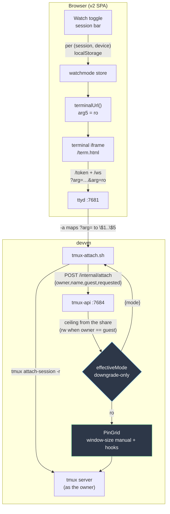
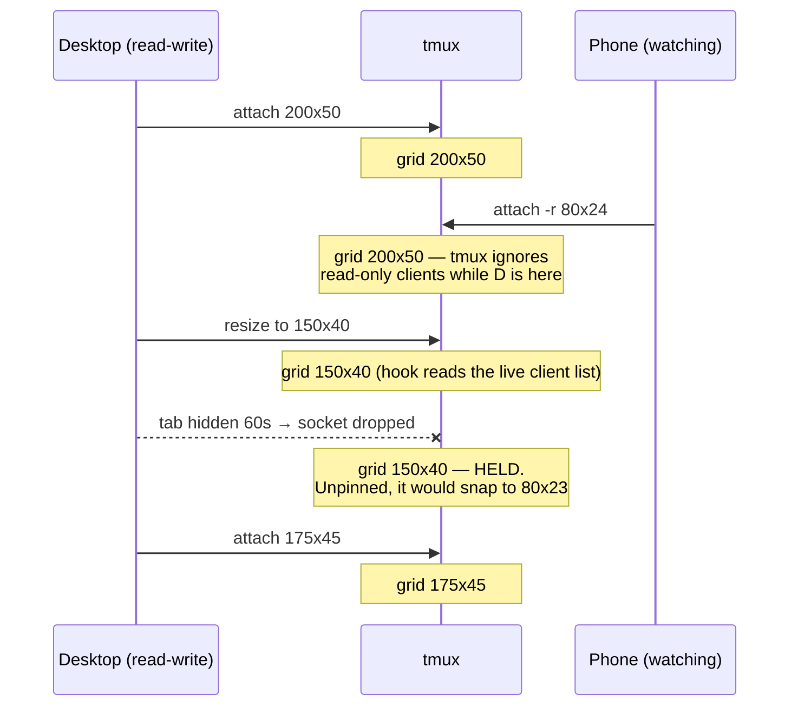

# Watch mode — observing a session without disturbing it

**Status:** Shipped 2026-08-16 (dev tier). Backend live on the devvm; v2 SPA on
`terminal-dev.viktorbarzin.me`. **Author:** Viktor Barzin (design), Claude (build).

## What we wanted

One person is working in a session. Someone else — a colleague, or the same
person on a second device — wants to watch it. The watcher should be able to
observe indefinitely without the person working noticing anything at all.

The concern going in was resizing: a second client attaching would reshape the
terminal to its own screen, reflowing the session under whoever was using it.

## What measurement changed

Measurement corrected the premise, and the correction narrowed the work
considerably. Measured on the devvm's tmux 3.4 with real ptys:

| Observation | Result |
|---|---|
| `tmux attach -r` client flags | `attached,focused,ignore-size,read-only,UTF-8` — read-only **implies** `ignore-size` |
| Read-only viewer (80×24) joins an owner (203×53) | Window stays **203×53** — no disturbance |
| Passing `-f ignore-size` explicitly as well | No change; the flag is already set |
| The **last read-write** client detaches | Window snaps to **80×23**, the viewer's size |
| Owner returns at 203×54 | Window snaps back — a second reflow |
| A second plain **read-write** client at 90×30 | Window → **90×29**; the owner *is* squeezed |

So tmux already protects the owner while they are attached. The gap is narrower
and differently shaped: `resize.c`'s `ignore_client_size` skips read-only clients
only *"if there are any attached clients that aren't read-only."* When the last
read-write client goes, that skip lapses.

This happens in ordinary use here. `frontend/term.html` · `tmux-api/driven.go` drops its WebSocket after
tab has been hidden 60 s, to spare a backgrounded phone's radio — a deliberate
and worthwhile behaviour. Its side effect is that pocketing your phone detaches
your client, hands the grid to whoever is watching, and reflows the session
twice: once when you leave, once when you return.

Two further findings shaped the design:

- **A smaller viewer sees a clipped viewport, not scaled or wrapped content** —
  80 of 150 columns delivered. Vertically it follows the cursor, so a watcher
  tracks where the action is for free; horizontally the right-hand columns are
  simply not sent.
- **The share store was empty and every project single-member**, so the
  cross-user read-only path had never run in production. The resize pain in
  practice came from two of the same user's own devices, both read-write — a
  case that had no read-only option at all, since a self-attach always went
  through `new-session -A`.

## The invariant

> **A read-write client owns the grid. A read-only client consumes it and
> changes nothing — including when no read-write client is attached at all.**

Everything below is enforcement of that one sentence. It already holds while
someone is driving; the work is making it hold in the one case where tmux hands
the grid away.

## Decisions

| # | Decision | Why |
|---|---|---|
| 1 | Covers a cross-user guest **and** your own second device | Same tmux mechanism; only the authorization differs |
| 2 | Terminal surface only | Text mode already observes without a tmux client; a foreign Text mode would need session-events to grow an `owner` dimension and read another user's whole `~/.claude` |
| 3 | Grid pinned with `window-size manual` + hooks | The only formulation that survives the owner detaching |
| 4 | The viewer clips — no font scaling, no pan UI | Deliberate scope call; vertical cursor-follow comes free, and server-side pan stays a cheap follow-on |
| 5 | UI toggle → server enforces, downgrade-only | A client may ask for *less* access than it holds, never more |
| 6 | Remembered per (session, device) | Matches how the Text/Terminal view mode already persists |
| 7 | No watcher indicator, in any case | Viktor's call; shares are consent-gated and the box is effectively single-user today |
| 8 | Frontend also blocks input, with a nudge | tmux discards the bytes anyway; without this a watcher types into a terminal that looks alive |
| 9 | Pin applied lazily at the first read-only attach, never reverted | A session nobody watches behaves exactly as before |
| 10 | **Revised 2026-08-16:** joining a session someone is already *driving* comes up watching; read-write remains the default when nobody is | The original — set the toggle before the attach — could not be done in practice: v2 is terminal-first, so selecting a session attaches in the same tick |
| 11 | v2 only | v2's cutover is already marked ready |
| 12 | Named **Watch mode** | `Attach mode` is taken — it is the server-side, per-share term |

Decision 7 is recorded as a deliberate choice rather than an oversight. The
information exists (`tmux list-clients` shows every client, and tmux-api records
each guest's `ClientTty` at attach), so surfacing it later is a UI change, not a
new mechanism.

## How it fits together



The client never decides its own access. It states a preference; tmux-api
resolves that against the ceiling and answers with a mode, and `-r` is sourced
from that answer. Since the only thing a client can ask for is *less* access,
accepting the new argument leaves `tmux-attach.sh`'s exact-argv discipline —
the security boundary given the broad `sudo tmux` grant — intact.

### What a read-only attach actually does



### The two tmux details that decided the implementation

Both were found by measurement, after a first implementation passed its own
review and failed its tests:

1. **A hook's `#{client_flags}` is the server's *current* client, not the client
   the event happened to.** With a watcher attached, the owner resizing their
   terminal fires `client-resized` carrying the *watcher's* flags and size.
   Guarding on those skips the owner's resize and applies the watcher's size
   instead. The hook therefore reads `list-clients` and filters, which has no
   such ambiguity.
2. **`run-shell` format-expands its command string before running it.** A bare
   `#{client_width}` inside the hook body is substituted with the current
   client's width, so every row of the inner `list-clients` came out identical.
   Doubling to `##{...}` defers evaluation to the inner tmux.

`client-detached` fires but its format context is empty (`detached::` — no tty,
no flags), so a "freeze on the last read-write detach" formulation cannot tell
which client left. The proactive pin does not depend on detach ordering at all,
so it holds however the detach is sequenced.

## What we deliberately did not build

- **Fit-to-grid font scaling or a pan UI.** A watcher on a narrow screen sees
  the left-hand columns and loses the rest. Server-side `refresh-client -L/-R`
  works on a read-only client (verified), so panning is available if this bites.
- **Text mode over a foreign session.** It needs an `owner` dimension in
  session-events plus read access to another user's `~/.claude/projects`, which
  holds every conversation they have rather than the one shared session.
- **A watcher indicator.** Decision 7.

## Known limits

- **Two read-write clients still contend**, as they did before. Watch mode is
  the answer when you want them not to.
- **If you drive from a small screen and watch from a large one**, the grid is
  the small one and the watcher sees blank space around it. That follows from
  the invariant rather than contradicting it.
- **A device taking control while another still drives** contends as two
  read-write clients always have. The toggle is how you avoid it.
- **`manual` + hooks is not a perfect emulation of `latest`.** `latest` follows
  whichever client you most recently *typed* on; the hooks follow whichever most
  recently *attached or resized*. This is only observable with two read-write
  clients on one session, and only until one of them starts watching.

## Revision — decision 10, after first use

Shipped, then corrected the same day. Decision 10 rested on v2's lazy attach:
the toggle would be set before the Terminal view was first shown. In use that
window does not exist — `viewmode.ts` defaults to `"terminal"`, so selecting a
session shows the Terminal view and latches the attach in the same tick, and the
first attach was always read-write.

The rule now: **with no explicit choice recorded, a client joins as a viewer
when the session already has a read-write client attached.** Opening a session
nobody is on is unchanged.

This needs three states rather than two — "I have never said", "watch", and
"drive" — because *take control* has to survive the other device still driving.
Stored as a two-state absence, the automatic rule would immediately undo it and
the button would look inert.

`GET /api/sessions` grew a `driven` field for it: at least one attached client
is read-write. That is a different question from `attached`, which counts
watchers too — a session with two watchers and nobody typing is attached twice
and driven by nobody. It is a courtesy signal, not an access decision: it comes
from the polled list and can be seconds stale, and being wrong costs one click.

## Verification

| Layer | What it proves | Where |
|---|---|---|
| Real tmux, real ptys | The invariant in all four ways a grid can move, plus idempotency, name-injection refusal, and no prefix-matching onto a neighbouring session | `sessionio/grid_test.go` |
| A guard test | That an **unpinned** session still collapses onto the viewer — so if tmux ever changes, we learn the pin became unnecessary | `sessionio/grid_test.go` |
| tmux-api units | Downgrade-only resolution; self-attach needs no share; an unshared guest is still refused whatever they ask; a missing session never upgrades a guest | `tmux-api/watch_test.go` |
| Shipped browser code | The real `argSuffix` builder lifted out of `term.html` and executed, against both the source and the **deployed** file | `scripts/test_watch_mode_e2e.py` |
| The attach script | Executed with curl/tmux/sudo shimmed; asserts the exact argv, that `-r` comes from the server and not the argument, and that a malformed arg5 is ignored | `scripts/test_watch_mode_e2e.py` |
| Session bar | The toggle is reachable from the Text view, persists per session, reaches the attach builder, auto-joins as a viewer on a driven session, and keeps take-control while the other device drives | `frontend-v2/test/SessionView.watch.test.tsx` |
| Driving vs attached | A lone watcher is not a driver; several watchers are still not; a watcher beside a driver is; names match exactly, not by prefix | `tmux-api/driven_test.go` |
| Auto-join rule | An explicit choice beats the automatic one in both directions; values written by the two-state version still read correctly | `frontend-v2/test/watchmode.auto.test.ts` |
| Live round trip | ttyd → `tmux-attach.sh` → tmux-api → tmux, driven exactly as the browser drives it | run 2026-08-16, below |

The live run against the deployed stack, with two real WebSocket clients:

```
1. plain attach (no arg5)         PASS — not read-only
2. watch attach (arg5=ro), 80x24  PASS — one read-only client; grid stayed 200x50
3. window-size after the attach   PASS — manual
4. owner's socket dropped         PASS — grid held at 200x50 with only the watcher left
```

Test counts at landing: 1132 frontend, 111 Python, all Go modules green.

## Open questions

- Whether clipping is tolerable in daily use, or whether the pan control is
  wanted after all. This is the decision most likely to be revisited.
- Whether a watcher indicator becomes desirable once more than one person uses
  the box. The data to render one already exists.

## Files

`sessionio/grid.go` · `tmux-api/shares.go` · `devvm/tmux-attach.sh` ·
`frontend-v2/src/store/watchmode.ts` · `frontend-v2/src/lib/terminal-url.ts` ·
`frontend-v2/src/components/{SessionView,TerminalView,Icons}.tsx` ·
`frontend/term.html`
