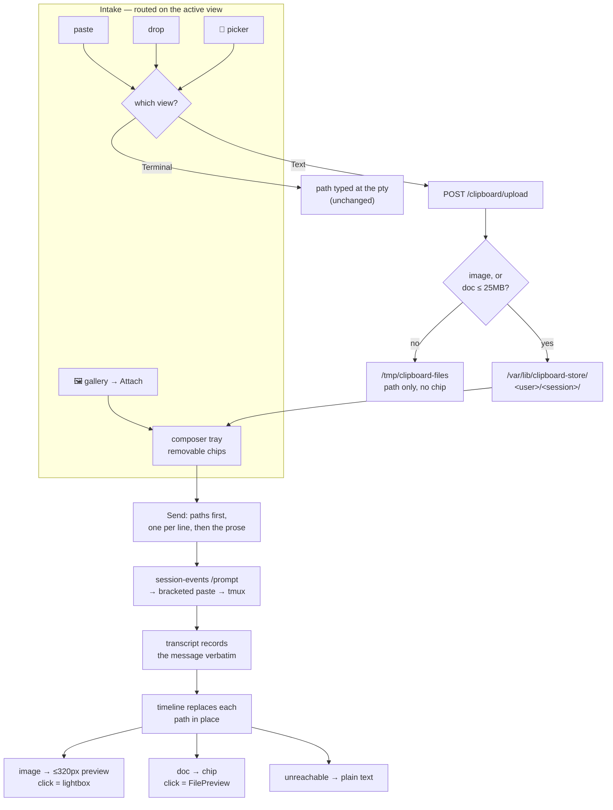

# Attachments in the text view: photos and docs render in the chat

**Status:** Approved design, executing
**Date:** 2026-08-17 · **Owner:** wizard
**Grilled from:** *"let's work on the uploading of files in text mode. right now
it seems to still use the old upload then share path but the path is copied to
the terminal view not text view. uploading photos and docs in the text view
should render them in the chat inline."*

## Goal

Attaching a photo or a document while the **Text view** is open should behave
the way a chat client behaves: a thumbnail you can see and click, sent as part
of the message, rendered in the conversation afterwards. Today the upload
succeeds but its path is typed onto the **Terminal view's** input line, where a
text-view reader never sees it.

The wire format to Claude does not change — a prompt still carries an absolute
path, because that is what Claude Code reads. What changes is what a person
sees on either side of that path.

## What happens today

`SessionView` installs `installImageClipboard` (`frontend-v2/src/clipboard/attach.ts`)
with a **document-level, capture-phase** `paste` listener that calls
`preventDefault()` and `stopPropagation()`. Capture on `document` runs before a
bubble listener on the textarea, so `Composer`'s own `onPaste` — which would
have inserted the path into the field — never runs at all. The upload lands in
the per-session store, and `attach.ts` sends the returned path to the pty over
`window.__tlSendToTerminal`.

`attachImage` in `SessionView.tsx`, wired down to the composer as
`onAttachImage`, is therefore unreachable for pastes and was never wired to
drop or to a picker. Drag-drop and the header's Upload button route through the
same `uploadDropped` → `sendToPty` path.

On the render side, `UserRowView` in `MessagesTimeline.tsx` renders a user
message as `<pre class="tl-user-text">{body}</pre>`. A path in that text is
plain text. The `image_view` item type exists, but it classifies a *tool call*
for its icon and label — it does not render pixels.

A real transcript shows the shape end to end:

```
user:      "which table would you recommend for 2 /var/lib/clipboard-store/
            wizard/anniversary/pasted-20260719-161556-94d38fa6.png"
assistant: tool_use Read { file_path: "/var/lib/clipboard-store/wizard/
            anniversary/pasted-20260719-161556-94d38fa6.png" }
```

The path landed mid-sentence because the pty types it at the caret. Claude read
it correctly regardless.

## Constraints the design has to respect

| Fact | Where | Consequence |
|---|---|---|
| Stored images are served by `GET /clipboard/img/<session>/<name>`, resolved inside **the caller's own** store directory | `clipboard-upload/main.go` | A path naming another user's store cannot be served, and must not silently resolve to your own same-named file |
| `file-api` confines every path to the caller's home | `file-api/paths.go` | It cannot read `/var/lib/clipboard-store/…` or `/tmp/clipboard-files/…` |
| Non-image uploads have **no** read-back route | `clipboard-upload/main.go` | A doc cannot be rendered or previewed until one exists |
| `GET /clipboard/list` returns every regular non-dotfile in the store directory | `clipboard-upload/main.go` | Docs written there would appear in the gallery as undecodable thumbnails |
| `readFile` and the preview's `` both build `fileReadUrl(path)` directly | `lib/file-api.ts`, `FilePreview.tsx` | Reaching a store path needs one resolver both can share |
| `/prompt` injects text as a bracketed paste, then a separate Enter | `sessionio/tmux.go` | A newline inside the prompt is a soft newline, so multi-line sends are safe |
| `application/pdf` classifies as `binary` | `store/preview.logic.ts` | The preview says "preview unavailable" for the most likely doc |
| A `?as=` Lens runs through the act-as gate on the clipboard routes | `clipboard-upload/main.go` | An administrator's lens already sees the target's store |
| HEIC/HEIF is accepted into the store, and chromium cannot decode it | `clipboard-upload/main.go` | An iPhone-native photo may store fine and still not render |

## The shape of it



## Decisions

Fourteen decisions were interview-locked.

1. **The composer shows a thumbnail tray, not a path.** Removable chips above
   the textarea; the field stays clean prose. Clicking an image chip opens the
   full image in the lightbox the gallery already feeds. The absolute path is
   spliced into the prompt text only at send time, so nothing about the wire
   format changes.

2. **The timeline replaces each recognized path in place.** A path becomes a
   thumbnail or a doc chip exactly where it sits in the text. One rule covers
   both a message we composed (paths at the top) and a historical message where
   the pty typed the path mid-sentence.

3. **Docs join the session store.** A non-image upload lands in
   `/var/lib/clipboard-store/<user>/<session>/` beside the images, and a new
   `GET /clipboard/file/<session>/<name>` serves it back. Same identity chain,
   same 30-day-grace lifecycle, no writes into anyone's home — which matters
   because `clipboard-upload` runs as `wizard` and cannot write another user's
   home directory. This **amends ADR-0005 decision 1**, which made non-image
   drops ephemeral `/tmp` transfers on the grounds that they are "arbitrary
   file handoffs into a shell command, not gallery content". That reasoning
   still holds for the gallery; it does not hold for the chat, which is a
   surface that did not exist when the ADR was written.

4. **A doc chip opens the file preview, and the preview learns PDF.** The
   overlay already renders markdown, html, code and plain text. It gains a
   `pdf` kind rendered by the browser's own viewer, so the most likely doc is
   not one click from a dead end.

5. **Intake routes on the active view.** Text view sends paste, drop and the
   picker to the tray; Terminal view types the path at the pty exactly as
   today. A drop that lands inside the terminal iframe is still the ttyd page's
   own business — a separate document we do not touch.

6. **The attach affordance lives in the composer.** A 📎 in the composer row,
   present on every device. This is the only option that fixes a real gap: the
   soft-key row has Copy and Paste and nothing else, so a phone has no file
   picker or camera today, in either view — and the text view is the default
   view on a coarse pointer. In the text view the header drops A−/A+, Upload
   and Paste (terminal controls) and keeps Images, since the gallery is
   view-agnostic.

7. **Recognition is "any absolute path with a known extension", degrading to
   text.** Store paths resolve through `/clipboard`, everything else through
   `file-api`. If the fetch fails — outside home, another user's store, swept —
   the row shows the path text, which is exactly today's behaviour. This also
   renders images Claude produced, not only ones we uploaded.

8. **User bubbles and assistant prose both get substitution; tool rows do
   not.** Assistant markdown already renders ``; this adds bare absolute
   paths, so "I wrote the chart to /home/wizard/out/plot.png" shows the chart.
   Tool rows keep path-only, which avoids showing the same picture twice — your
   bubble and Claude's `Read` of it are adjacent rows.

9. **Send puts paths first, one per line, then the prose.** Bracketed paste
   makes the newlines safe. A send with an empty message and a non-empty tray
   is allowed, where `submit()` currently returns early on empty text.

10. **Draft text and attachments both persist per session.** They survive a
    reload and a session switch, which matters on a phone where iOS evicts
    backgrounded tabs. Stored per-browser under a `tl:` key and pruned to the
    live session list, the way `store/visits.ts` already prunes, so a killed
    session cannot leak an entry forever. A restored chip whose file is gone
    drops itself and says so.

11. **Docs take any type, capped at 25MB.** No type allow-list: on this box the
    OS is the real boundary, which is ADR-0005's own trust model. The cap
    matches the `/register` cap the ADR names as one of the store's bounds, so
    the 30-day-grace store cannot fill with 100MB files. Above the cap, today's
    behaviour continues — `/tmp`, 7-day sweep, path only, no chip — and the
    toast says so.

12. **A guest on a shared session sees paths, not pictures.** Decision 7's
    fallback already covers it and no backend changes. Cross-user reads would
    mean `clipboard-upload` consulting share state that lives in `tmux-api`, a
    new cross-service dependency for a case that only bites multi-user
    sessions. A `?as=` Lens is unaffected — the act-as gate resolves the
    target's store.

13. **An image renders at full bubble width, capped at 320px tall**, aspect
    preserved and lazily loaded. A screenshot is legible without opening
    anything, which is the point of putting it in the chat; on a phone that is
    roughly a third of the screen.

14. **Gallery tiles gain an Attach action.** The gallery already holds every
    image the session touched, including `show-image` renders Claude produced,
    so attaching one costs nothing — the path is already known.

## Consequences

- **`/clipboard/list` needs an allow-list.** It currently returns every regular
  non-dotfile, so the first stored doc would appear in the gallery as an
  undecodable tile — the failure the upload path's byte-sniffing was added to
  prevent. Listing is restricted to the `pasted-` and `displayed-` prefixes,
  which is exactly what the store holds today; the new doc prefix is `file-`.

- **One resolver decides which backend serves a path.** `contentUrlFor(path)`
  maps a store path to `/clipboard/img` or `/clipboard/file`, and anything else
  to `file-api`. The bubble renderer, the tray chips, `readFile` and the
  preview's `` all go through it, so the two backends cannot drift apart
  in one place and not another. It needs the effective OS user (from
  `/whoami`) to reject a store path belonging to someone else rather than
  resolving it against the caller's own directory.

- **The rehype pass must skip code.** Applying substitution to assistant
  markdown means walking text nodes, and a path inside a fence or inline code
  has to stay text. This is the change most likely to regress, so it gets its
  own tests.

- **HEIC stores but does not render.** `clipboard-upload` deliberately accepts
  the HEIF container so a format browsers *might* decode is not refused, and
  chromium does not decode it; Claude Code's `Read` does not accept it either.
  Attaching one is allowed and toasts that it may not be readable. iOS Safari
  usually converts to JPEG when uploading through a file input, so the common
  path is unaffected.

- **A doc URL is hardened against being HTML.** The new route always sends
  `X-Content-Type-Options: nosniff`, and forces
  `Content-Disposition: attachment` when the sniffed type is `text/html` or
  `image/svg+xml`, so an uploaded doc cannot execute against the authed origin.
  The preview's own HTML rendering is unaffected — it goes through the
  maximally-restrictive sandboxed `srcdoc` iframe that `HTML_SANDBOX` pins.

- **The drop overlay's copy becomes view-dependent.** It currently promises
  "paths are typed into the session", which stops being true in the text view.

- **📎 is disabled under a watch-mode lock**, with the same treatment as the
  other controls that type. A Lens always watches, so it never attaches.

## Open questions

- Whether a doc large enough to be refused from the store should still be
  offered as a chip pointing at its `/tmp` path. It would be a chip that dies
  in 7 days, which decision 3 rejected for the general case; the toast is the
  chosen answer for now, and use will say whether that is enough.
- Whether the composer should also treat an `@`-completed path to an image as
  an attachment rather than as text. It renders inline after sending either
  way, so this is about the pre-send view only.
- Whether the store wants a per-user quota now that it holds docs. ADR-0005
  left it at "revisit if `du` ever says so"; the 25MB cap keeps the same shape
  of bound, but the number of files per session goes up.
