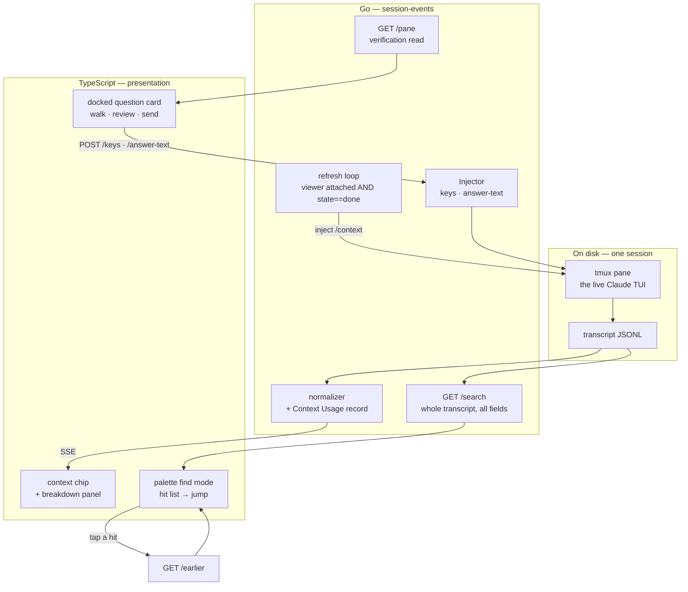
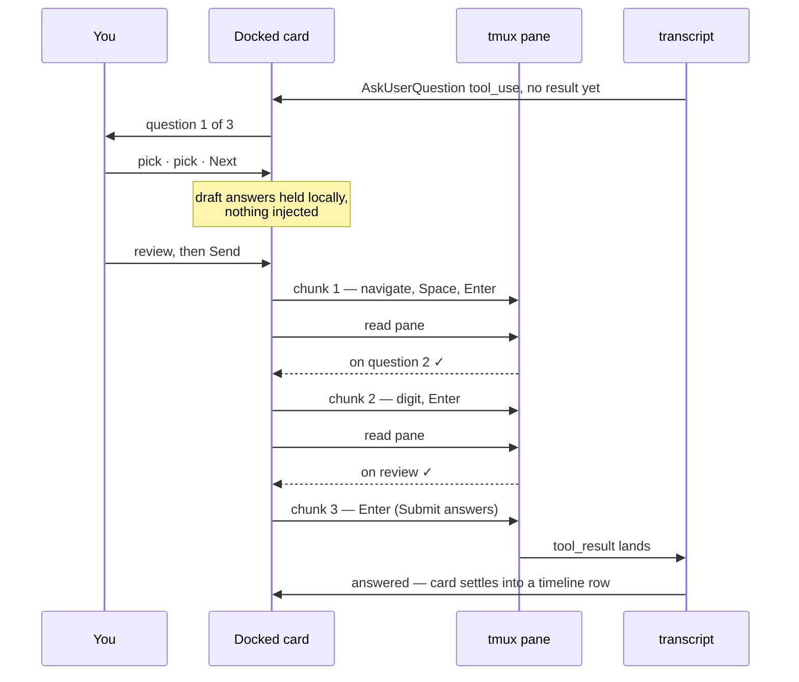

# Answering, finding, and measuring: three additions to the text view

**Status:** Designed, not built · **Date:** 2026-08-18 · **Owner:** wizard
**Grilled from:** *"let's get some design ideas from t3 code for our text mode."*

```stats
3 | additions, one landing
1 of 4 | AskUserQuestion shapes the view can answer today
95% | of the largest session that lives outside the open window
1m | context ceiling on a real session here — 5× the obvious guess
```

The text view shipped on 2026-08-16 and has been in daily use since. This
document takes a second pass over T3 Code for ideas we had not yet mined, and
settles three of them. It builds on
[`2026-08-16-text-view-native-render-design.md`](2026-08-16-text-view-native-render-design.md)
and [ADR-0010](../adr/0010-blocking-prompts-answered-by-key-injection.md), and
supersedes neither.

---

## 1. What the survey found

The earlier port inventory (that design's §8) read T3's `apps/web`. T3 also
ships `apps/mobile` — a native phone client with its own diff module for iOS and
Android — and nothing in our docs had looked at it. Our text view is
phone-primary by design, so that half was worth opening.

The survey put four lanes on the table. Two were taken:

| Lane | Verdict |
|---|---|
| Functional gaps — things you cannot do from a phone | **Taken**, narrowed to questions and search |
| Rendering data we already carry | **Taken**, narrowed to the context meter |
| Mobile shell — swipe actions, push and Live Activity, hardware keys | Not this pass |
| Timeline craft — scroll-anchoring primitive, banner stack, chips | Not this pass |

Within the taken lanes we also set aside T3's review-and-comment flow (diffs stay
read-only; steering keeps going through the composer), the session-level changed-files
tree, the richer plan card, and git controls — the last of which would sit
awkwardly here anyway, since the agent does all git mechanics on this estate.

Permissions were scoped in and then scoped back out: **sessions run in
bypass-permissions**, so a permission dialog is not the blocker it looked like.
`PermissionPanel` and `pendingPermissions()` stay as they are — inert, and
documented as inert.

---

## 2. What the CLI actually does

The question-answering design rests on how Claude Code's own dialog behaves, so
that was read out of the shipped binary (`2.1.234`) rather than assumed. Each row
below is from the CLI's `Select` key handler or the `AskUserQuestion` component.

| Behaviour | Where it comes from |
|---|---|
| Digits `1`–`9` select an option directly | `/^[0-9]$/.test(b)` → `options[n-1]` → `onChange` |
| `Space` toggles the focused option when multi-select | `isMultiSelect && key === " "` → `selectFocusedOption()` |
| One question that is **not** multi-select submits immediately | `EE.length===1 && !EE[0].multiSelect` fast path |
| Every other shape routes to a review screen | `"Review your answers"`, `"Ready to submit your answers?"`, `[Submit answers] [Cancel]`, gated on `allQuestionsAnswered` |
| `Tab` toggles input mode on the focused option | `if (y.key === "tab") { a(r.focusedValue) }` — how `__other__` is reached |
| Two synthetic options exist | `__other__` → "Other" / "Type something", `__chat__` → "Chat about this" |

Two consequences follow directly.

**The fast path is the only shape the view can answer today.** `TextView.tsx:133`
sends `Down × optionIndex` then `Enter`, and only the first question of a call is
answerable at all (`rows.tsx:336`, `qi() === 0`). A single-question single-select
call therefore works — and has been verified in use — while a multi-select
question, or any call carrying two to four questions, cannot be completed from
the text view.

**One code comment is out of date.** `TextView.tsx:136` reads *"more robust than
assuming digits select, which they do not in every dialog."* For this dialog they
do, per the handler above. The arrow-key route still works; the comment's reason
for preferring it does not hold here, and the `keys.slice(0, 8)` cap silently
drops the trailing `Enter` at option index 8 — unreachable with today's option
counts, but worth removing rather than leaving as a latent edge.

Our own limits matter too: `MaxKeys = 8` bounds one batch, and `answerKeys`
(`sessionio/tmux.go:184`) allows digits, `Space`, `Tab`, `Enter`, `Escape` and the
arrows — **no letters** beyond `y`/`n`. That allowlist is the whole security
boundary of the keys route, and this design does not widen it.

---

## 3. Decisions

| # | Decision | Why |
|---|---|---|
| 1 | **Permissions are out of scope.** Sessions run bypass-permissions. | Removes the pane-reading half of ADR-0010 from this work entirely. The inert client half stays put, still documented. |
| 2 | **Answers are collected locally and injected only on Send, in verified chunks.** The pane is re-read between chunks; a reading that does not match expectation stops the sequence and offers the Terminal. | ADR-0010's own principle — treat a failure to recognise the screen as *unknown prompt* and fall back honestly rather than guess a keystroke. The dialog ends up either untouched or fully answered. |
| 3 | **The card walks questions one at a time, then shows a review step.** | Matches what someone watching the pty sees, and matches T3's `questionIndex` / `onAdvance` / `derivePendingUserInputProgress` shape, which is logic we can port rather than invent. |
| 4 | **Docked above the composer while pending; settles into the inline timeline row once answered.** | Above the phone keyboard and unable to scroll away mid-walk, then the permanent record of what was asked and chosen — a row `rows.tsx` already renders. |
| 5 | **Free text goes through a new bounded `/answer-text` route**: `set-buffer` + `paste-buffer -p` only. | `Injector.Prompt` opens with `C-e C-u` and closes with a forced `Enter` (`sessionio/tmux.go:131`). Inside a dialog field that prelude is unverified, and the forced Enter takes the sequencing away from decision 2. Keeping the routes separate also keeps telemetry honest: `claude.answered`, not `claude.prompt_sent`. |
| 6 | **Chunks stay at or below 8 keys, so `MaxKeys` does not change.** | Verification between chunks makes chunk granularity free, so there is no reason to raise a cap that exists to stop a browser typing a paragraph into somebody's shell. |
| 7 | **Search runs server-side over the whole transcript**, across messages, thinking, tool inputs and the uncapped tool results. | The open window is 20 turns; the largest transcript here is 28.9 MB / 7,964 records. A client-side search would quietly cover a few percent of such a session and answer "no matches" for the rest. |
| 8 | **Search opens through the existing command palette.** | The header measurably did not fit at 390px and already sheds controls; this adds nothing to it. |
| 9 | **The context meter reads `/context`'s own output**, not our token arithmetic. | The CLI computes the ceiling, the percentage and the category breakdown, and writes them to the transcript as markdown. |
| 10 | **The `## Context Usage` record is recognised in the normalizer**, the way `skillLoad` recognises a skill load. | Today it renders as a 14,930-character block attributed to Claude — the same pathology `skill.go` was written to fix. |
| 11 | **The reading refreshes on open and after each turn settles.** | The meter is current at the moment you look at a finished turn, which is when it gets read. Costs roughly 15 KB of transcript per turn. |
| 12 | **The refresh is server-owned, one per session, gated on `@claude_state == done`, and runs only while a text viewer is attached.** | Three devices watching must not mean three injections. `running` would queue the command as a prompt; `awaiting` would type into a live dialog. And a background mechanism acting on sessions nobody is watching is exactly what `575d4f5` had to be removed for. |
| 13 | **One landing.** | Chosen over three sequential landings. |

> [!NOTE]
> Decision 12's last clause is the one to hold onto. The failure in `575d4f5`
> was not the broker's logic but its reach: it acted on every session on a
> shared devvm, including those nobody had open. Any refresh loop we add
> inherits that lesson.

---

## 4. Architecture



The split from the original design holds: **Go carries data, TypeScript decides
presentation.** The one place this design puts logic in Go is search, because the
data it searches never reaches the browser.

---

## 5. Answering a question

The UI walks; the injection happens once. Those are separate, and keeping them
separate is what makes the walk safe to abandon — nothing has been typed until
Send.



If a verification read does not show what the next chunk expects, the sequence
**stops where it is** and the card offers the Terminal. That is a visible,
recoverable state; a wrong answer submitted silently is not.

**The `Other` option** needs the text route, because `/keys` carries no letters:
`Tab` into input mode, verify the field is focused, `POST /answer-text`, verify
the text is present, then `Enter`. **`Chat about this`** is offered as its own
button: it selects `__chat__` and focuses the composer, which is what that option
means.

**Two devices of the same user** resolve without special handling. ADR-0010's
whoever-answers-first-wins already applies, and the second submitter's *first*
verification read fails — the dialog is gone — so it stops and offers the
Terminal rather than typing into a session that has moved on.

---

## 6. Search

A new `GET /search/{session}?q=` greps the transcript in Go and returns hits with
their event ids, kind, timestamp and a snippet. Tapping a hit loads that window
through the existing `/earlier` machinery and scrolls to it.

Search runs on submit, not per keystroke — one pass per query rather than one per
letter. It covers what the client never receives: the uncapped tool results, where
the stderr line you half-remember actually lives.

---

## 7. The context meter

`/context` is already recorded. It lands as a `type: "user"`, `isMeta: true`
record whose content is markdown:

```
## Context Usage

**Model:** claude-opus-5
**Tokens:** 65.2k / 1m (7%)

### Estimated usage by category

| Category | Tokens | Percentage |
|----------|--------|------------|
| System prompt | 3.5k | 0.4% |
| MCP tools (deferred) | 95.3k | 9.5% |
| Messages | 25.8k | 2.6% |
| Free space | 934.8k | 93.5% |
...
```

That is a better source than deriving a number ourselves. `usage` on the wire
gives a numerator (`input + cache_read + cache_creation` = 105,793 on the session
this document was grilled in), but the *denominator* is not on the wire, and the
sample above is a **1m** context — a hardcoded 200k would have been wrong by a
factor of five on a real session here. The CLI already knows the ceiling, the
percentage, the autocompact buffer and where the tokens went.

So the normalizer recognises the `## Context Usage` heading the way `skill.go`
recognises a skill load, and emits it as a reading rather than as a message. The
client shows the headline as a chip and keeps the breakdown behind an expand —
the tables render already, since assistant markdown goes through full GFM.

This fixes a present defect on the way past: a `/context` run today produces a
14,930-character block in the timeline, styled as though Claude wrote it.

---

## 8. What we took from T3, and what we did not

T3 Code is MIT licensed (T3 Tools Inc, 2026). Ported files keep the notice and
name their upstream path and commit.

| From | What we take |
|---|---|
| `apps/web/src/pendingUserInput.ts` — `derivePendingUserInputProgress`, `PendingUserInputDraftAnswer` | The walk's progress model and draft-answer shape |
| `apps/web/src/components/chat/ComposerPendingUserInputPanel.tsx` | Placement — pending input docks at the composer — and the per-question advance. React, so the view is a Solid rewrite |
| `apps/mobile/src/features/threads/PendingUserInputCard.tsx` | Read for phone ergonomics on the walk |
| `ContextWindowMeter.tsx` | The idea of a persistent context reading. **Not** its derivation — ours comes from `/context`, which is a source T3 does not have |
| `ChangedFilesTree`, `ReviewSheet`, `ProposedPlanCard`, the mobile shell | Surveyed, not taken this pass |

Worth stating plainly: on the context meter we ended up **not** following T3.
Their ring is computed from token arithmetic because that is what their provider
abstraction exposes. We are Claude Code specific, and Claude Code will tell us the
answer if we ask it.

---

## 9. Verification

1. **A multi-select question, answered from a phone**, with the pane watched to
   confirm one submission and no double-send.
2. **A three-question call**, including one multi-select and one answered through
   `Other`, walked and submitted.
3. **A deliberate desync** — answer in the Terminal mid-walk, then Send from the
   card — confirming it stops and offers the Terminal rather than typing on.
4. **Search on the 28.9 MB transcript**: query latency, hit quality, and a jump
   to a hit that sits outside the open window.
5. **Refresh cost over a working day**: transcript growth, and confirmation that
   an unwatched session receives nothing.
6. **Suite green**, plus tests for the chunk planner over the option shapes in §2.

---

## 10. Open questions

- **How a multi-select question advances.** `Space` toggles and `Enter` accepts
  the focused option, but which affordance moves past a multi-select question to
  the next one is not settled from the binary — most likely a submit row appended
  to the option list. This needs a live dialog to answer. The verified-chunk
  design tolerates the unknown: the pane read is what tells us where we landed.
- **Whether `Escape` should be offered** as a "leave it to the Terminal" exit on
  the card, or whether leaving the dialog untouched is enough.
- **Search latency on the largest transcripts** is unmeasured. If a full grep per
  query proves slow, the next lever is an offset index built as the source
  hydrates.
- **What the refresh costs in practice.** Roughly 15 KB per settled turn is the
  estimate; a day of real use is what would confirm or correct it.
- **Whether the walk should be skippable** for the single-question single-select
  case, which the CLI submits immediately and which works today. A one-question
  walk with a review step may be one tap more than that case deserves.
