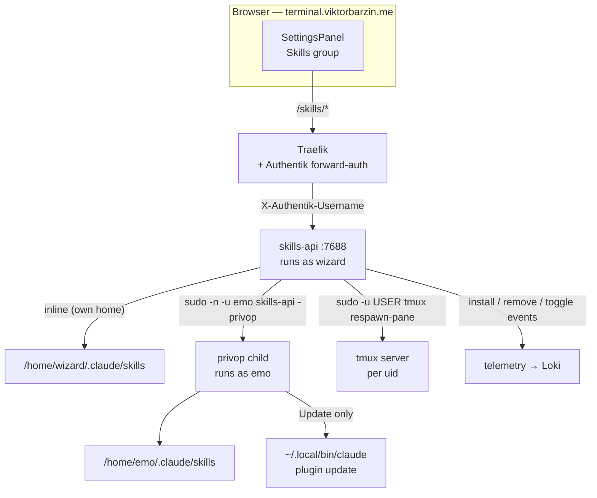
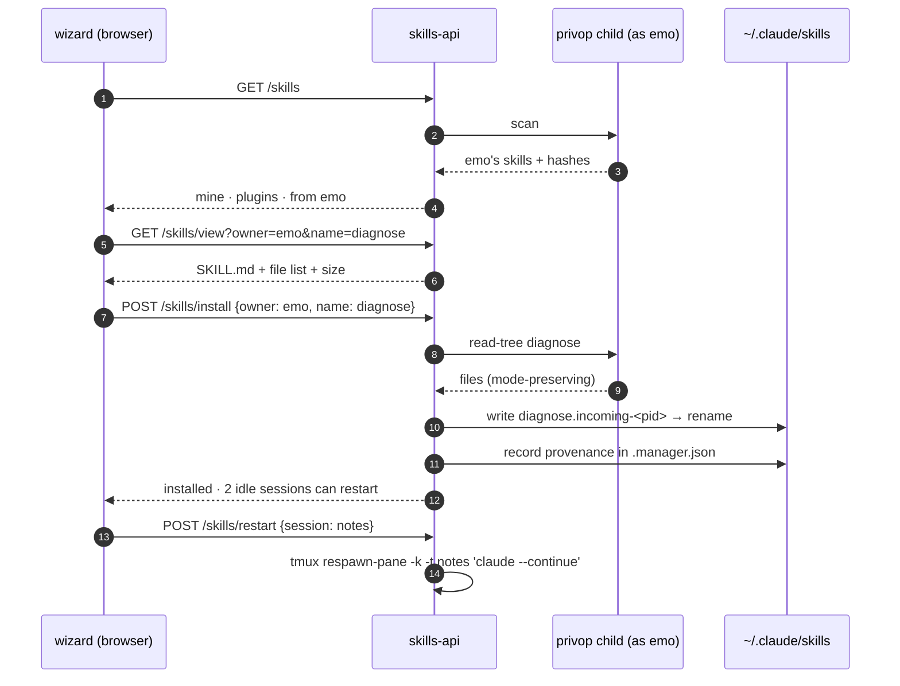

# Skill manager in the lobby's Settings panel

**Status:** design approved, not yet implemented
**Date:** 2026-08-19
**Owner:** wizard
**Repo:** `terminal-lobby` (a small companion change lands in `infra`)

## Goal

Give every lobby user one place to see the skills their Claude sessions load,
switch them on and off, and pick up a skill another user on the box already
has. Today a skill reaches a second person through the hourly provisioner
(`t3-provision-users.sh`, allowlisted to `emo`, install-if-absent), which got a
starter set onto the box reliably and reproducibly. Two things it does not do
yet: a copy never refreshes after the first install, and the set is chosen
centrally rather than by each user. The manager adds the per-user, self-service
half.

Scope is a **Skills** group inside the existing Settings overlay, plus a small
backend that owns the filesystem work.

```stats
13 | skill names present in both accounts
9 | of those whose content differs
8 | skills only emo has today
17 | vendored skills the retirement drops
```

## Non-goals

- No marketplace, and no registry repo. A separate skills repo is a plan for
  later; it changes nothing here. For this feature, each user simply *has* a set
  of skills and where they came from is not modelled.
- No browsing of upstream marketplaces (`claude-plugins-official` and friends).
  `/plugin` already does that well.
- No authoring surface: the manager reads skills and moves them, it does not
  edit them.
- No changes to project-scoped skills (e.g. the ~10 under `infra/.claude/skills`),
  which load from the repo a session is working in.

## What is already here (and gets reused)

| Existing piece | What it gives us |
|---|---|
| `SettingsPanel.tsx` | The overlay, its focus trap, Escape/backdrop close, and the flat `tl-settings-group` section style the new group adopts |
| `session-events/commands.go` | A working reference implementation of skill discovery: `~/.claude/skills/*/SKILL.md`, `~/.claude/commands/**.md`, and enabled plugins resolved through `settings.json` → `enabledPlugins` + `plugins/cache/<market>/<name>/<version>` |
| `file-api/privop.go`, `session-events/privreader.go` | The `sudo -n -u <user> <binary> -privop` pattern for acting as another OS user, with the child re-validating every path |
| `authuser` | `X-Authentik-Username` → `/etc/ttyd-user-map`, and the `?as=` admin act-as gate against `/etc/ttyd-admins` |
| `telemetry` | The Loki-bound event helper each service already uses |
| The `wizard ALL=(emo) NOPASSWD: /usr/bin/tmux` grant | Restarting a session's Claude needs no new privilege |

## Decisions

Each of these was settled in the 2026-08-19 grilling session.

> [!NOTE]
> A dedicated skills repo for storing and distributing wizard's own skills is a
> separate plan for later. For this feature each user simply has a set of skills
> and their origin is not modelled.

| # | Decision | Why |
|---|---|---|
| 1 | A **Skills group inside the Settings overlay**, not a separate full-screen view | The panel already carries every other per-user setting; a group is the smallest surface that answers the ask |
| 2 | **Every user's `~/.claude/skills` is visible to every lobby user**, no publish step and no per-skill privacy flag | Matches what OS permissions already allow — `/home/wizard` is `751` with `.claude/skills` at `775`, so emo can read those files today; wizard reads emo's `700` home via the sudo he already holds |
| 3 | **The recipient clicks Install.** Nothing is pushed into anyone's account | Skills carry executable code, so the person taking on that code is the one choosing to |
| 4 | **Install copies a snapshot**, and the manager flags later divergence | A copy is stable and editable; a live symlink into another home would work emo→wizard but not wizard→emo (his home is `700`), so it would be asymmetric |
| 5 | **Installs land directly in `~/.claude/skills/<name>`** as real directories | This is how wizard's 38 skills already live; nothing on the box reads the `~/.agents/skills` indirection any more once the provisioner step goes |
| 6 | **Name collisions block**, show a diff, and offer *Replace* with a timestamped backup; identical content is labelled "same as yours" with no action | 13 of emo's 22 skill names already exist in wizard's account and 9 of those genuinely differ, so this is the common path, not an edge case |
| 7 | The list covers **loose skills and marketplace plugins** in one inventory | That is what a session actually loads; disabling `superpowers` from the same place is worth the one extra call |
| 8 | After a change, the panel names the **sessions still running an older skill set** and offers Restart on those whose Claude state is `done`/`awaiting`, never mid-turn | A new skill only reaches a new session; the state dot the sidebar already shows tells busy from idle |
| 9 | Restart respawns the pane with **`claude --continue`** | Keeps the transcript, so loading the skill does not cost the thread |
| 10 | A **new `skills-api` service on :7688** owns the endpoints | Deploying it can never drop an open SSE transcript stream (`session-events`) or a file preview (`file-api`), and the one privileged write op stays auditable on its own |
| 11 | **`install_skills()`, `SKILL_USERS`, and `scripts/workstation/claude-skills/` are retired** from the infra repo | The manager becomes the only distribution path; emo's existing copies stay on disk and remain installable from him |
| 12 | Rows offer **View, Update, Enable/Disable, Remove** (backup first); plugin rows also offer **Update** | Reading a peer's skill before installing it matters when skills ship scripts |

### Two mechanisms chosen on evidence

**Enable/disable is a direct `settings.json` write.** `claude plugin disable
<name>@skills-dir` was tested in a throwaway HOME and writes exactly
`{"enabledPlugins": {"<name>@skills-dir": false}}`, with `enable` flipping it
back. Writing that key ourselves is instant and needs no external binary. The
format belongs to Claude Code, so the write lives behind one function with tests
asserting its shape.

**Plugin Update execs the user's own `claude`.** The binary is per-user
(`/home/emo/.local/bin/claude`), but the privileged child is already running *as*
that user, so exec'ing it grants nothing extra — it is the same thing that user
could run in a terminal. It costs a few seconds per call, which is acceptable for
an explicit Update button.

## Architecture



The privileged child is the same shape as `session-events`': one long-lived
process per user speaking a fixed request/response protocol on stdin/stdout,
re-validating every path against its own `$HOME/.claude/skills` root, so the
sudo grant trusts nothing from the caller.

## Installing a peer's skill



A collision changes only the middle: `install` refuses with `409` and the client
fetches `GET /skills/diff`, then re-posts with `replace: true`, which moves the
existing directory to `.backup/<name>-<UTC timestamp>/` before writing.

## HTTP surface

All routes take the standard `X-Authentik-Username` header and the optional
`?as=<user>` admin switch, resolved through `authuser` exactly as the sibling
services do.

| Method + path | Purpose |
|---|---|
| `GET /skills` | Full inventory: the caller's skills (with enabled state and provenance), their marketplace plugins, and every other mapped user's skills |
| `GET /skills/view?owner=&name=` | `SKILL.md` body plus the file list, sizes, and which files are executable |
| `GET /skills/diff?owner=&name=` | Unified diff of the peer's copy against the caller's same-named skill |
| `POST /skills/install` | `{owner, name, replace?}` — copy in; `409` when a differing skill of that name exists and `replace` is not set |
| `POST /skills/toggle` | `{id, enabled}` — one `enabledPlugins` write; `id` is `<name>@skills-dir` or `<plugin>@<marketplace>` |
| `POST /skills/remove` | `{name}` — back up, then delete |
| `POST /skills/plugin-update` | `{plugin}` — exec the caller's own `claude plugin update` |
| `POST /skills/restart` | `{session}` — respawn that session's pane with `claude --continue`; refuses a session whose state is `running` |
| `GET /health` | Unauthenticated, like every sibling |

## On-disk contract

```
~/.claude/skills/
  grilling/                    a skill this user authored
  diagnose/                    installed from emo
  .manager.json                provenance, written only by skills-api
  .backup/diagnose-20260819T091200Z/
```

`.manager.json`:

```json
{
  "version": 1,
  "installed": {
    "diagnose": {
      "from": "emo",
      "sourceHash": "sha256:9f2c…",
      "installedAt": "2026-08-19T09:12:00Z"
    }
  }
}
```

> [!WARNING]
> A skill can ship executable code — `spotify/scripts/spotify.py`,
> `visualize/scripts/viz-publish.sh` and `diagnosing-bugs/scripts/hitl-loop.template.sh`
> do today. Installing one means those scripts run in your sessions, which is why
> the recipient initiates every install and View comes before Install.

**Copy rules.** The source must be a directory containing `SKILL.md`. `.git`,
`node_modules` and `__pycache__` are excluded (`claudeception/` carries a nested
`.git` today). Symlinks pointing outside the skill directory are skipped rather
than followed. Mode bits are preserved so scripts stay executable. A copy is
capped at 5 MB and 500 files, written to `<name>.incoming-<pid>` and renamed into
place, and performed by the child running as the recipient so ownership is right
without a `chown`.

**Hashing.** `sourceHash` is a sha256 over the sorted `(relative path, mode,
content)` triples of the copied set. Comparing it three ways gives the whole
update story: peer hash ≠ stored hash means *update available*; local hash ≠
stored hash means *locally modified*; both differing means the Update button
offers the same Replace-with-backup flow as a first-time collision.

**emo's 17 existing symlinks** into `~/.agents/skills` keep resolving and appear
as ordinary skills. Removing one deletes the symlink and backs up the resolved
content, leaving `~/.agents/skills` alone — inert once the provisioner step is
retired.

## Frontend shape

A single `<section class="tl-settings-group">` between the existing groups,
holding three lists: **Mine** (toggle + row actions), **Plugins** (toggle +
Update), and **From `<user>`** for each other mapped user. State lives in a new
`store/skills.ts` over `lib/skills-api.ts`, following the `file-api.ts`
error-handling shape. Row expansion shows the description, file count, size, and
the action buttons; View and diff render in place.

## Companion change in `infra`

- Delete `install_skills()`, the `SKILL_USERS` variable, and
  `scripts/workstation/claude-skills/` (17 vendored skills).
- `stacks/terminal/main.tf`: add a `kubernetes_service` + `kubernetes_endpoints`
  + `IngressRoute` for `skills-api` on `:7688`, matching
  `PathPrefix('/skills/')` with the `authentik-forward-auth` middleware and no
  prefix strip — the same shape as the `file-api` block.
- Update the memory entry describing the vendoring flow (id 6530) so it points
  at the manager instead.

> [!IMPORTANT]
> Retiring `install_skills()` means a brand-new user starts with no skills and
> pulls what they want from a colleague. Existing copies on disk are untouched.

`devvm/sudoers.d-ttyd-users` (in this repo, hand-maintained by decision) gains
`/usr/local/bin/skills-api` on each per-user line, with a comment explaining the
op set the child accepts.

## Rollout order

1. `skillscan` package: scan, hash, copy, and the `.manager.json` reader/writer, test-first.
2. `skills-api` with its privop child, auth wiring, and telemetry.
3. `devvm/skills-api.service` + the sudoers line; add `skills-api` to `scripts/deploy-services.sh` (`SERVICES`, the per-service install loop, `enable --now`, and a `/health` + `401` verification like its siblings).
4. `infra` terraform route, pushed and left to CI; verify with read-only kubectl.
5. Frontend group + store + vitest coverage; ship with `deploy-v2.sh`.
6. Retire the provisioner step and the vendored snapshot.
7. ADR-0011, README component table, and the `CONTEXT.md` glossary entries.

## Testing

Go, mirroring the 117 existing `_test.go` files: table tests for scan and hash
stability, copy exclusions and caps, collision classification (same / differs /
absent), containment refusals for `..` and escaping symlinks, the `enabledPlugins`
write preserving unknown keys, and the privop protocol. Auth tests follow
`file-api/actas_test.go`.

Frontend, mirroring the 119 vitest files: store transitions for install / update /
toggle / remove, the three collision states, and the restart affordance appearing
only for idle sessions.

Manual check: install one of the 8 skills only emo has, restart an idle session,
confirm the skill appears in that session's `/` menu.

## Open questions and known limits

- **`--continue` picks the most recent conversation for the pane's directory.**
  Where two sessions share a cwd, a restart could resume the other thread.
  wizard's shell wrapper already records a pane→session-id map at
  `~/.local/state/claude-pane-sessions.json`, so `--resume <id>` would be exact
  where that map exists; worth doing if it proves to be a real problem.
- **`enabledPlugins` is Claude Code's format, not ours.** Verified on 2.1.235.
  If a future version changes it, toggles need a matching update — the tests are
  there to catch it loudly.
- **`/commands/` and `/search/` are not routed** by the ingress today (only
  `/events/ /prompt/ /cancel/ /earlier/ /result/ /pane/ /keys/` are), so the
  composer's per-user slash-command catalogue currently falls back to built-ins.
  Unrelated to this feature and a one-line fix in the same terraform file —
  listed here so the choice to include it is deliberate rather than accidental.
- **`devvm/sudoers.d-ttyd-users` still carries a line for `ancamilea`**, who left
  the roster on 2026-08-17. Noted for a separate tidy, not changed here.
- **Trust remains manual.** Nothing scans an installed skill for what its scripts
  do. The safeguards are View before Install, provenance recorded in
  `.manager.json`, and a backup taken before any replace.
