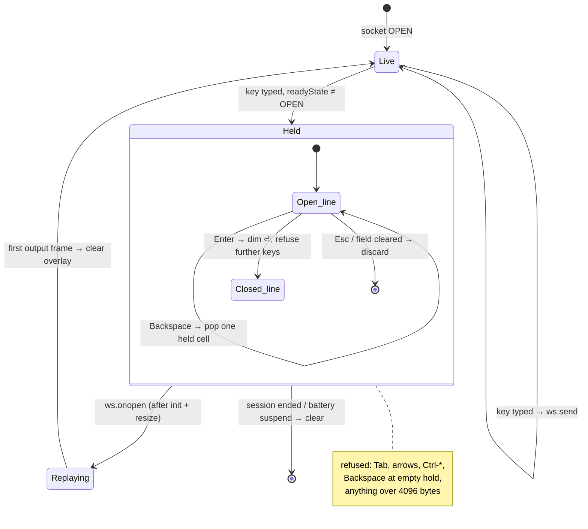

# Offline typing — held keys you can see

**Status:** Designed 2026-08-23, not yet built. **Author:** Viktor Barzin
(decisions), Claude (design). **Scope:** `frontend/term.html`, client-side only.

## What we wanted

Type into a session while the connection is gone, see that what you typed has
not left the browser yet, and have it typed into the session when the link comes
back. The visual half is part of the ask: unsent characters should be
distinguishable from what the session actually holds, rather than announced in
words after the fact.

The second half of the ask was performance — specifically, that a keystroke
should not disappear into a socket that only looks alive.

## What term.html does today

```stats
4096 | byte hold cap
3 s | replay window today
~75 s | black-hole blind spot
9 | sentinel tests to keep green
```

`tl-pending-input` (`frontend/term.html:13116`) already holds keys typed while
the socket is down. Its shape, read from the source:

| Behaviour | Today |
|---|---|
| Hold cap | `PENDING_INPUT_MAX_BYTES = 4096` |
| Hold lifetime | `PENDING_INPUT_TTL_MS = 3000` — replayed under 3 s, **discarded** over it |
| What you see | Nothing on screen. A pill flash (`.dropped`) plus a toast, at most one per 5 s |
| Wording | "Not connected — holding your keys until the session is back" / "Reconnected — what you typed while offline was discarded" |
| Gates | `hasConnectedOnce` (nothing to replay into), `batterySuspended`, watch mode |
| Replay point | `ws.onopen`, after the init handshake and the resize (`term.html:15096`) |
| Covered by | 9 sentinel tests in `frontend-v2/test/term-html.bridge.test.ts:504-592` |

The queue's own comment states the reason for the 3 s ceiling, and it still
holds: *"the pty may be somewhere else entirely by the time we
reconnect… replaying blind would run keys against a prompt that no longer
exists."*

There is also a gap on the detection side. `sendInput` holds keys only when
`readyState !== OPEN`, but a black-holed socket stays `OPEN` until the liveness
watchdog strikes out — `LIVENESS_STRIKES = 3` at `LIVENESS_PROBE_MS = 25000`,
so up to roughly 75 s of typing goes into a dead socket while the pill still
reads connected. The 25 s cadence is deliberate, to spare a phone's radio
(`scripts/devserve/BATTERY.md`).

## The invariant

> **While the socket is down, the screen shows exactly what will be typed when
> it returns — nothing more, nothing less.**

Every decision below is enforcement of that sentence. It is what lets the 3 s
ceiling be lifted: the coloured text on screen replaces the timeout as the
safety mechanism, because you can see what is held before it goes anywhere.

## Decisions

1. **Echo only while the socket is not `OPEN`.** No prediction on a healthy
   connection. This keeps the correctness argument simple: no output can arrive
   over a dead socket, so the frozen tmux repaint plus our own characters is the
   whole picture, with nothing interleaving.

2. **Held set: printable characters, text paste, Backspace.** Tab, arrows,
   `Ctrl-R`, `Ctrl-C` and other control sequences are refused with the existing
   rate-limited toast. They are all things only the pty can resolve — holding a
   Tab would put a completion on screen that the session never produced.

3. **Backspace with an empty hold is refused.** The overlay adds cells and never
   touches a cell tmux drew. Backspacing past the hold would have to blank real
   cells, and the page cannot tell the input line from the prompt or from Claude
   Code's box border — readline refuses to delete past its line start, so the
   screen would show a deletion that never happens.

4. **A trailing Enter closes the hold.** Enter is accepted, renders as a dim `⏎`
   at the end of the run, and further keys are refused ("your line is held").
   `PENDING_INPUT_TTL_MS` keeps its 3000 but its meaning narrows to the
   auto-Enter window: under it the newline replays and the command runs exactly
   as today; over it the newline is dropped and only the text is typed, leaving
   the line on the prompt for you to confirm.

5. **No expiry.** The hold lives as long as the page and the session. Nothing is
   discarded on a timer, because nothing is invisible any more.

6. **Esc discards** on a keyboard — it is refused as pty input while offline
   anyway, so the key is free. On a phone, clearing the compose field discards:
   its own backspaces drain the hold, which needs no new gesture.

7. **Drawing: one 1-cell xterm decoration per held character**, anchored at the
   pty cursor (`registerMarker(0)` + `registerDecoration`). Held characters are
   `var(--accent)`, underlined, on an opaque `var(--terminal-bg)` cell so the
   frozen screen beneath does not bleed through. Nothing is written to the
   buffer, so removing the decorations restores the underlying cells exactly —
   which matters because the dominant session content is Claude Code's boxed
   TUI, where a buffer write would overwrite the box border and leave a hole
   until the next repaint. Marker support on the alternate buffer was checked
   against the vendored build: xterm 6.0.0's `registerMarker` resolves against
   the *active* buffer (`addMarker(ybase + y + x)`), and `addon-image` already
   registers markers there. The documented normal-buffer-only restriction does
   not apply to this build.

8. **Two states, both honest.** Held: accent, underlined — "this is only on your
   screen". Replayed: dim, no underline — "sent, waiting to see it land" —
   cleared when the first output frame arrives, which is proof the pty
   responded.

9. **On a phone the signal moves to the compose field.** When the compose bar
   owns the input its text goes accent + underline and the field takes an accent
   border; the terminal overlay is skipped, since with the soft keyboard up the
   pty cursor is often off-screen. This forces one fix: Enter while offline must
   no longer call `mirrorLineReset()`, which today would clear the field while
   the hold survived it.

10. **Copy.** The pill gains a count — `You are offline · 12 held` — and its
    hover legend (`tlAttachLegend`) explains the model and Esc. The "holding
    your keys" toast goes; the coloured text carries the same information on
    screen. Toasts remain only where there is nothing on screen to see: a
    refused key and a full hold.

11. **Typing-triggered liveness probe.** A keystroke with no output within
    ~1.5 s runs the liveness probe immediately instead of waiting for the 25 s
    tick. Idle cadence is unchanged, so battery behaviour is unchanged; a
    keystroke only *triggers* a probe, and the probe failing is still what
    strikes. A legitimately silent keystroke (a password prompt) therefore costs
    one probe and nothing else.

12. **The hold stays a sliceable pure kernel.** The sentinel tests slice
    `// >>> tl-pending-input` … `// <<< tl-pending-input` and run it under
    `runInNewContext`, which is what makes it testable in a page with no
    build step. New logic keeps that shape; anything touching the DOM stays
    outside the sentinels.

## How it fits together



The replay path, and why the newline is the only thing that can be dropped:

```mermaid
sequenceDiagram
    participant U as You
    participant P as term.html
    participant W as ttyd (ws)
    participant X as tmux / pty

    Note over P: socket down — screen frozen
    U->>P: g i t space c o m m i t
    P->>P: hold 12 bytes, draw 12 accent cells at the cursor
    U->>P: Enter
    P->>P: hold closes — dim ⏎, further keys refused
    U->>P: Tab
    P--)U: refused ("reconnect to use this key")

    Note over P,W: link returns
    P->>W: init handshake (AuthToken, cols, rows)
    P->>W: resize
    alt outage < 3 s
        P->>W: "git commit" + \r
        Note over X: the command runs, as it does today
    else outage ≥ 3 s
        P->>W: "git commit"
        Note over X: text lands on the prompt; you press Enter
    end
    P->>P: overlay goes dim
    X-->>P: output frame
    P->>P: overlay cleared
```

## What we deliberately did not build

- **Online prediction.** Echoing every keystroke on a healthy connection is
  where the typing-latency win lives, and it is a full prediction engine:
  output interleaves with predictions, so it needs echo matching, confirmation
  timeouts and bail-outs for alt-screen TUIs, passwords and completion. Deferred
  as its own piece of work, not ruled out.
- **Offline page load.** `/sw.js` is push-only (`frontend-v2/src/pwa/register.ts:3`),
  so reloading with no network still gives a blank page. Precaching the terminal
  page would work against ADR-0007's zero-touch self-update, whose whole subject
  is stale JS healing itself against its own `__TL_ASSET__` fingerprint.
- **Persisting the hold across a reload.** A hold you have forgotten typing
  would reappear against a session that has moved on, without the on-screen
  warning the rest of this design relies on.
- **A settings toggle.** Holding visible keys is strictly better than losing
  invisible ones, and prefs roam through tmux-api — which is unreachable
  while offline.
- **A confirm gate before replay.** Considered, and declined: replaying text
  into a key-driven pager can still act (see limits).

## Known limits

> [!WARNING]
> **Text replay is not inert everywhere.** `less`, `htop`, `vim` in normal mode
> and `fzf` act on single letters, so replaying `deploy` into a pager runs
> d/e/p/l/o/y as commands even with the newline dropped. Claude Code's composer
> — the dominant content here — is safe. Accepted knowingly rather than gated.
- **The black-hole window shrinks but does not close.** Decision 11 starts the
  probe seconds in rather than up to 75 s in, but the probe still has to fail
  before keys are held; a keystroke or two can still be lost to a socket that has
  not yet been declared dead.
- **The hold dies with the page.** A reload, or the lobby swapping the iframe to
  another session, takes it with them.
- **Mid-line editing stays out.** Append and Backspace only, matching the
  compose mirror's own V1 constraint — no cursor tracking, no arrow
  repositioning.
- **The overlay covers cells while it is up.** Inside Claude Code's box a long
  hold will sit over the right-hand border until it is replayed or discarded.
  Nothing is destroyed, but the box looks briefly clipped.

## Verification

Unit — extend `frontend-v2/test/term-html.bridge.test.ts`, keeping the
slice-and-run pattern. Two existing contracts change and their tests change with
them: *"discards — and says so — once the gap outlived the replay window"*
becomes *keeps the text, drops the newline*, and *"ages from the FIRST key"*
now governs the Enter only. New cases: control sequences refused; Backspace at
an empty hold refused; Backspace pops exactly one held character; the hold closes
at Enter; Esc discards; the byte cap still refuses rather than lying.

In prod — the deploy is its own test trigger. `./scripts/deploy-v2.sh` installs
`term.html` through clipboard-upload with no ttyd restart, but `index.html`
carries the git SHA and so differs on every deploy, which restarts ttyd and drops
every attached terminal's WebSocket. That is the path this design serves:
deploy, watch your own session hold and replay, then exercise the longer outages
deliberately (airplane mode on the phone, devtools offline on the desktop) across
a shell prompt, Claude Code's composer, and a pager.

## Open questions

- The ~1.5 s "no output after a keystroke" threshold for decision 11 is a
  starting value, not a measured one. Worth checking against a real prompt on
  the tunnel before settling it, since Claude Code can legitimately take longer
  than a shell to paint.
- Whether the dim state in decision 8 needs a timeout of its own if the first
  output frame never arrives — a reconnect that immediately re-drops would leave
  a dim overlay with nothing to clear it. The straightforward answer is that it
  reverts to held, but that path needs writing down once built.

## Files

| File | Change |
|---|---|
| `frontend/term.html` | The hold kernel, the decoration overlay, the compose-field colouring, the pill count and legend, the typing-triggered probe |
| `frontend-v2/test/term-html.bridge.test.ts` | Rewrite two contracts, add the new ones |
| `docs/plans/2026-08-23-offline-typing-held-keys-design.md` | This document |
