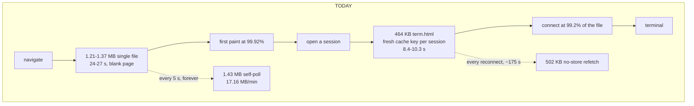
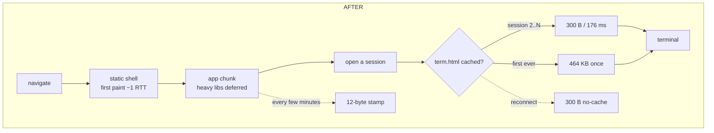
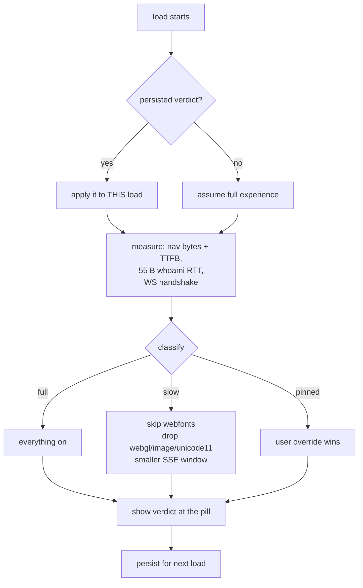

# Slow clients — the lobby stops downloading itself

**Status:** Designed 2026-08-28, not yet built. **Author:** Viktor Barzin
(decisions), Claude (research + design). **Scope:** `frontend-v2/`,
`frontend/term.html`, `session-events/`, plus one Traefik middleware change in
`infra`.

## What we set out to fix

Three symptoms on a slow link: new sessions take a long time to start, existing
sessions do not load — the Text view appears but the Terminal view does not —
and a suspicion that the lobby overfetches.

One of the three turned out to have a different cause. "Existing sessions do not
load, only Text mode" was substantially a regression from the offline-typing
change of 2026-08-25: two held-input hooks were declared *after* the
coarse-pointer block that assigns them, so on touch devices the `let` sat in its
temporal dead zone and the ReferenceError rejected the whole async IIFE, taking
the `/token` fetch and the WebSocket attach with it. Desktop was unaffected,
which is why it read as network-shaped. Diagnostics recorded it 20 times; fixed
in `89b0ed7` and deployed. The rest of this document is about the network, which
has its own, larger version of the same complaint.

## What the measurements say

```stats
17.16 MB/min | self-download, idle
1.83 GB | per 24h, one phone
1279:2 | full bodies vs 304s
99.2% | of term.html before connect()
```

Ranked by cost to a client at 400 kbps (50,000 B/s) with a 300 ms round trip.

**1. The app re-downloads itself every five seconds.** `healer.ts:47` sets
`SELF_CHECK_MS = 5000`; `healer.logic.ts:86-89` reads the entire response body
with `await r.text()` to extract a 12-hex build stamp; `healer.ts:339` schedules
it fire-and-forget with no in-flight guard. Loki over 24 h for one phone: **200
responses peak 1,279, 304 responses 2** — 99.84% full bodies, 1,430,075–1,430,242
bytes each, exactly 5.000 s apart, carrying `Referer: terminal.viktorbarzin.me`
(a fetch, not a navigation). That is ≈1.83 GB/24 h from a single device, and
17.16 of the 17.18 MB/min measured at idle. One such fetch takes 28.6 s at
400 kbps and it fires every 5 s: **5.7× the whole downlink**, permanently
saturated, up to 3 in flight at once. Every other symptom sits downstream of it.

**2. First paint waits for 99.92% of a 4,744,477-byte document.** The SPA is one
inline module spanning bytes 35,862–4,660,450; `<div id="root">` is at byte
4,740,657. Under CDP throttling at the production-equivalent rate, first paint
lands 0.07 s *after* the last byte: document finished 24.46 s, first paint
24.53 s, FCP 25.02 s. On the wire it is 1,206,450 B (brotli) to 1,365,623 B
(zstd) — 24–27 s of blank page. 59 of 60 iPhone boots record
`tl.nav.cached:false`. `sw.js` is push-only by design, so there is no cache
fallback, and the compressing edge drops `Content-Length`, so a dropped
connection restarts from byte 0. Payload that no terminal attach needs:
mermaid 11 (3,565,102 B of source), highlight.js 11, CodeMirror 6 with nine
language packs — all eager.

**3. `term.html` is a second whole document with a per-session cache key.**
1,796,077 B raw, 464,075–469,987 B on the wire, and `connect()` is the script's
last statement (`term.html:15521`) at byte 1,781,283 — **99.2% in**.
`terminal-url.ts:52` puts the session name in the query string, so every session
is a fresh cache entry: measured 1,796,377 B for a new name, **300 B** for an
exact repeat. 8.4–10.3 s per session, and it repeats on every session.

**4. The Text view's opening replay is uncompressed.** `sse.go:26-30` sends
`OpenWindowTurns = 20`, measured at 766,661–2,098,703 B per open with 99.93%
arriving inside 0.1 s as a backlog dump. Verified live: the Traefik `compress`
middleware does not include `text/event-stream`. `gzip -6` gives 4.8–5.4×
(1,754,321 → 366,490). 2.1 MB is 42 s.

**5. Every WebSocket reconnect re-downloads `term.html` with `cache:'no-store'`**
(`term.html:15398` → `fetchSelf` at `:5320-5322`). Measured from inside a loaded
page: `no-store` 502,720 B / 10,293 ms versus `no-cache` 300 B / 256 ms —
**1,676× the bytes for identical information**. The only guard is
`if (document.hidden) return`, which is false for a CSS-hidden iframe, so every
kept frame does it. Median iPhone socket life is 175 s (n=389).

**6. Two boot gates that do not pay off.** `term.html:10224` races the webfont for
2,000 ms, but the two preloads are 186,752 B = 3.7 s at 400 kbps, so on a slow
link the race always loses and xterm measures fallback metrics anyway — the bytes
are paid and the benefit is not received. And the `/whoami` preflight at `:5418`
has no AbortController: reset that one request and the catch at `:5429` renders
"Access denied" and returns, with no retry and no WebSocket attempt (measured:
dead pane at 518 ms).

The overfetching suspicion: `/sessions` is 853–925 B on the wire,
`/layout` 833 B, 44 requests each per 30 minutes — 1,686 B per turn, a 0.7% duty
cycle, and it already parks while the tab is hidden (`lobby.ts:404-408`). That
is not where the cost is. The redundancy is elsewhere: two `/whoami` per attach,
`/pane` + `/commands` fetched in *terminal* mode (including two 404s during a
create), a per-iframe 10 s telemetry flusher, and `/dirs` — 110,428 B
uncompressed, with no caller at all. Also self-amplifying: 28,379 of 32,619
`api.slow` records are for `/telemetry` itself, because the 500 ms threshold sits
below a healthy 300 ms round trip.

**The session pool is working.** A slot is parked, the unit is enabled, 14
`pool: claimed` lines, `rename-session` 6–8 ms. The server is 0.31 s of an
~11.3 s wall clock — **3%**. The other 97% is `term.html`.

## Why Terminal failed where Text survived

Text is already inside the bundle the browser downloaded to draw the lobby.
Terminal needs a second 1.8 MB document whose `connect()` sits at 99.2% of the
file — so a truncated download produces a page that renders, is titled
"Terminal", holds 393,029 of 1,790,811 characters, never fires `load`, and
reports nothing. Nothing recovers it: the iframe (`TerminalView.tsx:368-375`) has
`onLoad` and no `onerror` or watchdog, and the cover lifts on a blind
`setTimeout(hideCover, 1800)`. Text resumes from a cursor instead
(`Last-Event-ID`, `sse.go:32-41`) and carries `probeStatus`, `classifyFailure`
and a jittered reconnect (`client.ts:246-284`).

Deadlines on the terminal path, for the record: `TOKEN_TIMEOUT_MS` 8000,
`WS_OPEN_TIMEOUT_MS` 10000, `RETRY_DELAYS_MS` [1000, 2000, 4000, 8000, 16000],
`LIVENESS_PROBE_MS` 25000 × 3 strikes, `REQUEST_TIMEOUT_MS` 8000. The whoami
preflight is unbounded, and **the document download has no watchdog at all**.

## The invariant

> **Nothing on the critical path to a working terminal is paid twice, and nothing
> that is not needed to reach one is paid before it.**

## Decisions

1. **The build stamp gets its own endpoint.** A ~12-byte response served from the
   shared asset dir (a route, not a service), polled every few minutes rather
   than every 5 s, with an in-flight guard and paused while the tab is hidden.
   Chosen over fixing the caching because the reason iOS never revalidates is
   still unexplained — this path never depends on a 304 to be cheap.

2. **The lobby stops being one file.** Drop `vite-plugin-singlefile`: hashed
   external chunks with `<link rel=modulepreload>`, `immutable` caching on the
   content-hashed chunks, a static shell in `<body>` so first paint is one packet
   in, and mermaid, CodeMirror and highlight.js lazy behind the Text view.
   ADR-0007's `__TL_ASSET__` fingerprint and the deploy's single-file rollback
   move in the same change, because both currently assume one artefact.

3. **One `term.html` for every session.** The session name moves from the query
   string to the fragment, so all sessions share one cache entry: sessions 2..N
   cost 300 B / 176 ms instead of 502,420 B / 10,295 ms.

4. **`no-store` becomes `no-cache`** on the reconnect self-check — same
   information, 1,676× fewer bytes.

5. **SSE gets compressed, and the transcript loads backwards.**
   `text/event-stream` joins the Traefik compress middleware (a Terraform change
   in `infra`, auto-applied on push). The windowing half grew into its own
   design — [Text mode loads the transcript
   backwards](2026-08-28-text-reverse-transcript-load-design.md) — which replaces
   the `?turns=` parameter sketched here: the replay runs from the newest event
   towards the oldest, bytes rather than turns bound it, and first paint stops
   depending on window size. Measured while designing it: 93.6% of a 20-turn
   opening window is tool payload that folds away unseen, and one turn can be
   377 KB, so a turn was never a unit of size.

6. **A diagnostics module measures, decides, and shows its work.**
   `navigator.connection` does not exist on iOS — 200 of 200 iPhone records lack
   it, and there is no `prefers-reduced-data` either — so the module measures
   rather than asks: Navigation Timing for bytes and TTFB (free, already
   collected), the 55-byte `/whoami` as a pure RTT probe (fetch timing is already
   wrapped at `diag.js:627-675`), and the WebSocket handshake as a persisted
   prior. It classifies, switches automatically, and shows the verdict where the
   connection pill already lives, with a settings override to pin a tier. The
   verdict persists per device, because a measurement taken during a load arrives
   too late to help that load.

7. **Three levers, and only three.** A slow verdict may skip the webfonts
   (−186,752 B, ~3.7 s, and the race already always loses), drop the webgl, image
   and unicode11 addons (−113 KB gzip, ~96 ms parse; the cost is the canvas
   renderer instead of WebGL, and sixel images become tmux's text placeholder per
   ADR-0004), and shrink the SSE opening window (up to −2.1 MB). It may **not**
   change which view opens: a terminal stays a terminal.

8. **The terminal load gets a watchdog.** It arms when the iframe mounts. The
   first failure retries once silently, because a truncated document is usually a
   one-off stall and a silent retry that works is the best outcome. The second
   replaces the cover with the reason and a retry control, and offers the
   transcript as a link — never as an automatic switch.

9. **Instrumentation ships with the fixes, not after.** `term.ready` and
   `tl.token_ms` have formatters and a catalog entry but no caller — 0 records in
   14 days — so today nothing on this path is measured. `term.ready` gains legs
   (navigation start → first byte → xterm paint), `tl.nav.dom` / `tl.nav.load`
   stop reading 0 (they are read at boot before the events fire,
   `diag.js:859-860`), and a `conn.failed` event records the case that currently
   cannot be recorded at all: never loaded.

10. **The cleanups ride along**: one `/whoami` per attach instead of two,
    `/pane` and `/commands` only in Text mode, `/dirs` deleted, and the
    `api.slow` threshold raised above a healthy round trip so telemetry stops
    reporting on itself.

11. **One landing.** Everything above ships together.

## How it fits together

The cold-load path, before and after:





The diagnostics verdict, and what it is allowed to touch:



## What we deliberately did not build

- **Automatic view switching.** Landing in Text mode on a hopeless link is the
  biggest single win available and it was declined: a terminal you asked for
  should not silently become a transcript.
- **A fix for the corp-network case.** A middlebox that establishes the socket
  and then passes no frames is a fast link with a broken transport; none of this
  helps it, and a throughput measurement would call it healthy. Out of scope by
  choice.
- **Chasing the iOS revalidation mystery as the primary fix** — see below.
- **Things that only look like levers**, all verified: `term.html` is already
  compressed at the edge (~464 KB received), `scrollback: 10000` is inert under
  tmux's alternate screen, the client flow control never arms below ~17 MiB/s
  arrival, and the iframe is already lazy behind the `attachAllowed` latch.

## Known limits and open questions

> [!IMPORTANT]
> **Why iOS never revalidates is unexplained, and decision 2 partly depends on
> it.** The 1,279:2 ratio is measured; the mechanism is not. A desktop CDP
> harness measured 137-byte 304s and ttyd answers `If-None-Match` correctly, so
> it revalidates in Chrome and does not on the real phone. One measured
> contributing fact: the compressed edge response carries no `ETag` and no
> `Content-Length`. Decision 1 routes around it; decision 2's warm-load win
> assumes WebKit will store hashed chunks. Close this before trusting the
> immutable-caching half of the split — the cold-load win stands either way.

- **No real-device slow-link measurement.** Every throttled figure here is
  desktop Chromium under CDP, and the one iPhone-derived number contradicted it.
  Validate on the phone before trusting any of them.
- **The dataset is biased against the worst links.** `diag.js:262` drops the
  *oldest* queued records at `bufferMax: 200` with no counter, so boot records
  die first — exactly the ones a slow load produces.
- **Three of seven creates never reached ttyd** after the last deploy: no
  `session.attached` line, absent from `tmux ls`. The attach leg failed, not the
  Claude boot, and no instrument exists to say why. `session.created` carries no
  duration.
- **`conn.dropped` records nothing useful yet**: `tl.down_ms`,
  `tl.reconnect_n` and `tl.reason` appear in 0 of 1,527 records; 79.8% of closes
  are code 1006 and 622 closed at `up_s=0`.
- **Tier thresholds are guesses** until measured on the target device.
- **`WebGL2 not supported` throws 6 uncaught errors** during terminal open,
  unrelated to this work and worth its own fix.

## Verification

Each decision has a number to beat, measured the same way it was measured here:
idle bytes/min from Loki (17.18 → target under 0.1); first paint under CDP
throttling (24.5 s → target under 2 s); per-session terminal cost (502,420 B →
300 B for sessions 2..N); SSE open (2.1 MB → ~100 KB); reconnect refetch
(502,720 B → 300 B). Then the same five on the actual iPhone, because the
research's one real-device number contradicted its CDP equivalent — and with
`term.ready` finally emitting, that comparison becomes possible for the first
time.

## Files

| File | Change |
|---|---|
| `frontend-v2/src/deploy/healer.ts`, `healer.logic.ts` | Stamp endpoint, interval, in-flight guard, hidden-tab pause |
| `frontend-v2/vite.config.ts`, `index.html` | Drop single-file, hashed chunks, static shell, lazy heavy libs |
| `frontend-v2/src/.../terminal-url.ts` | Session name to the fragment |
| `frontend/term.html` | `no-cache` refetch, font race, whoami abort, `term.ready` legs |
| `frontend-v2/src/.../TerminalView.tsx` | Load watchdog, retry, surfaced reason |
| `frontend-v2/src/diagnostics` (new) | Measure, classify, persist, apply, show |
| `session-events/sse.go`, `main.go`, `sessionio/filesource.go` | Reverse, byte-bounded backfill + `state` frame (see the [linked design](2026-08-28-text-reverse-transcript-load-design.md)) |
| `infra/stacks/…` (Traefik compress) | `text/event-stream` in `includedContentTypes` |
| `scripts/deploy-v2.sh`, ADR-0007 | Multi-artefact fingerprint and rollback |
