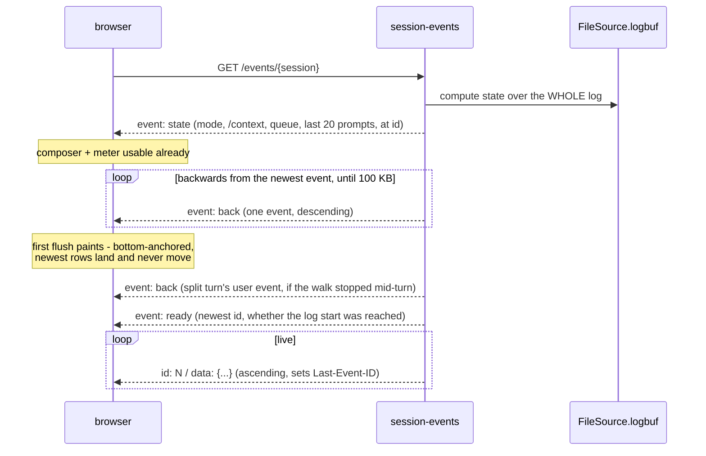
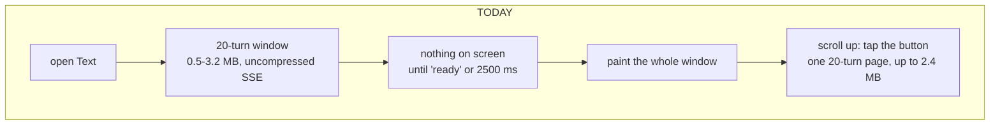
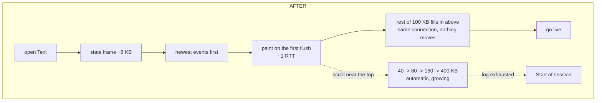
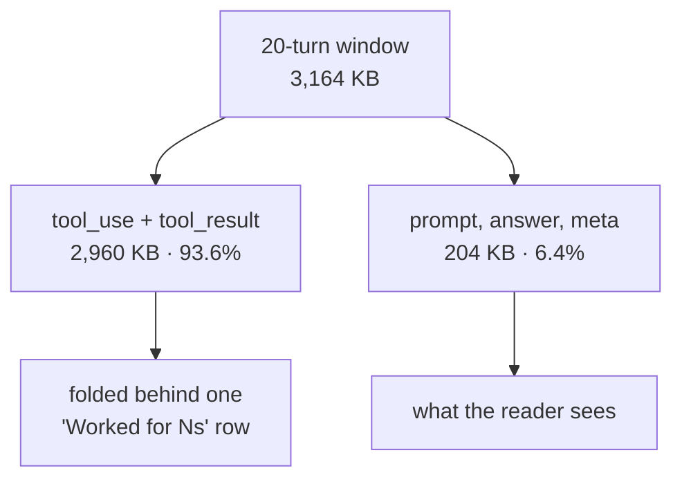

# Text mode loads the transcript backwards

**Status:** Shipped 2026-08-28 (`15e054f`), deployed and measured on live. **Author:** Viktor Barzin
(decisions), Claude (research + design). **Scope:** `session-events/`,
`sessionio/`, `frontend-v2/src/store/session.ts`,
`frontend-v2/src/components/MessagesTimeline.tsx`. **Ships as decision 5 of**
[the slow-client design](2026-08-28-slow-client-performance-design.md) — one
landing, together with the bundle split and the SSE compression that multiplies
this win.

## What we set out to fix

Opening a session in Text mode should put the last thing that happened on screen
straight away. Today it puts the last *twenty turns* on the wire first, and shows
nothing until all of them have landed.

The design started from a belief worth checking: that the whole transcript
replayed from the oldest message. The code already windows it — `sse.go:30` sets
`OpenWindowTurns = 20` and `FileSource.ReplayWindow` clips a fresh open to the
last twenty turns at a turn boundary, with `GET /earlier?before=<id>` paging back
behind a button. The window has been there since 2026-08-16. What makes it feel
like a load from the beginning is that the window is large, arrives as one
burst, and gates the first paint (`store/session.ts:130`, released by
`event: ready` or a 2,500 ms fallback).

## What the measurements say

Three real transcripts, normalized through `sessionio` — the same bytes the
browser would receive:

```stats
3,164 KB | 20-turn open, session A
96.3% | of those bytes fold away
377 KB | one turn, session B
930.7 KB | whole-session spine, session C
```

| | events | wire | turns | 1 turn | 3 turns | 20 turns |
|---|---|---|---|---|---|---|
| A `d061c5a8` (18.5 MB raw) | 4,314 | 4.78 MB | 23 | 72 KB | 304 KB | **3,164 KB** |
| B `047b47c2` (9.8 MB raw) | 1,764 | 2.46 MB | 14 | 377 KB | 982 KB | **2,401 KB** |
| C `8791a4d9` (25.5 MB raw) | 3,633 | 4.75 MB | 208 | 28 KB | 65 KB | **555 KB** |

Three facts came out of this that shaped every decision below.

**A turn is not a unit of size.** Per-turn cost across session A's 23 turns runs
0, 2, 57, 70, 72, 74, … 410, 484, 1,092 KB. Three orders of magnitude, in one
session. Any window measured in turns inherits that variance.

**Most of what a window carries is never displayed.** In the 20-turn opening
window, `tool_use` + `tool_result` are 93.6% / 96.3% / 83.6% of the bytes — and a
settled turn renders as at most three rows (`timeline.logic.ts:564`): the
prompt, the last assistant message, and one `Worked for Ns` fold holding
everything else. Session A's window carries 1,164 tool calls, and twenty
one-line summaries are what they render as.

**The transcript's own "spine" is not a cheap substitute.** Replaying every
`meta` / `user` / `turn_end` event from the start — the events three client-side
derivations depend on — costs 86.4 KB (A, 1.85%), 58.4 KB (B, 2.43%), 69.3 KB
(D, 2.33%) and **930.7 KB (C, 20.08%)**. Queued-prompt meta carries the prompt
text in full, so the sessions with the most turns have the most expensive spine.

Two more measurements worth carrying into the design. `/earlier` returns JSON
and the Traefik `compress` middleware (`infra/stacks/terminal/main.tf:93`, empty
spec = defaults) already gzips it; `/events` is `text/event-stream`, which it
does not, so the opening window was the one path paying full price. That half
was solved differently and better while this was being built — session-events
now gzips SSE **itself**, because Traefik's compress is an entrypoint middleware
and opting `text/event-stream` in there would change streaming for every
consumer in the cluster to fix one page. The reverse backfill gets it for free.
And
sessions stay mounted for 24 h once visited (`store/keepalive.ts:44`, in-memory,
so a reload clears them), each holding its own open stream — five sessions in a
page's life is five opening windows.

## The invariant

> **The transcript loads from its newest end, and nothing is fetched before
> something is on screen.**

## Decisions

1. **The replay runs backwards.** On a fresh open `/events` walks the log from
   the newest event towards the oldest, so the first frames the client receives
   are the last thing that happened. First paint stops depending on how much
   follows it — roughly one round trip and the first few rows, whatever the
   budget.

2. **Bytes are the wire unit; a turn is a rendering concern.** `turns=` never
   appears. A backfill stops on a byte budget wherever it happens to be, and a
   turn may be split across two responses — which is what allows a bounded
   open, since nothing bounds a single turn (377 KB measured, with no
   ceiling). When a walk stops mid-turn it emits that turn's `user` event as
   well, so a reader never sees an answer with no question above it.

3. **Reverse arrival suits the fold model better than forward arrival.**
   `turn_end` is a turn's last event, so walking backwards delivers it first: the
   turn is known settled on arrival and folds immediately. Forward arrival does
   the opposite — every work row renders while the turn looks unsettled, then
   collapses when `turn_end` finally lands. That collapse is the flicker the
   paint-hold was built to hide (measured 2026-08-18: row count flat at 14, content
   2,194px → 594px → 851px, four changes to what sat mid-screen inside a second).
   Reversing removes the condition that produces it.

4. **The opening backfill budget is 100 KB, and it no longer gates the paint.**
   It buys roughly 1 turn of free scrollback on the heavy sessions and 4 on the
   light one. Everything past it waits until somebody scrolls, because that is
   the common case: most opens are read at the live end and closed.

5. **A single response is capped at 400 KB.** `/earlier` fills to the caller's
   budget or 400 KB, whichever comes first. The cap applies to every caller
   including a cached older bundle, so no request can return an unbounded body.

6. **Scrolling up pages automatically, in growing steps.** A step fires when the
   scroll comes within about a screen of the top: 40 KB, then 80, 160, 400 KB,
   resetting when scrolling stops. The existing top row becomes its status line —
   `Loading earlier…`, a tappable retry if a fetch fails, `Start of session` when
   the log is exhausted. Search-jump asks for 400 KB from its first step, since
   it already knows it is reaching far, and `MAX_JUMP_STEPS` rises 40 → 200 now
   that a step is bounded.

7. **A computed `state` frame leads the stream.** Three client derivations read
   whatever the held window happens to contain: `contextState`
   (`context.logic.ts:27`), `queuedPrompts` (`timeline.logic.ts:843`) and
   `promptHistory` (`timeline.logic.ts:876`). At 100 KB of backfill the context
   meter would empty, the composer's ↑ history would hold two prompts, and a
   `dequeued` event whose `queued` fell outside the window would `shift()` the
   wrong head. So session-events computes them from the whole log it already
   holds in memory and sends one named frame ahead of the backfill: permission
   mode, the newest `/context` reading with its turns-ago, the live queue, the
   last 20 prompts, and the event id it was computed at. Roughly 8 KB, flat in
   session length. The client seeds from it and folds only events with a greater
   id, which makes the queue correct rather than merely unbroken: computing it
   from a window's midpoint depends on that window happening to contain the
   matching `queued` event.

8. **A turn arrives whole in fidelity, if not in one response.** No summary
   stubs: when a turn's events are on the client they are the real events, so a
   fold opens with no spinner and no new per-turn endpoint. Splitting a turn
   across responses (decision 2) is about *when* bytes arrive, not *which*.

9. **The chunked row mount stays exactly as it is.** It completes in two frames
   at the new sizes, and it is still load-bearing for the one case that stays
   large: unfolding a 467-step turn inserts 467 rows in a single task, which is
   the 485 ms of main-thread blocking (worst task 336 ms) it was built for.

10. **Instrumentation ships with it**, per decision 9 of the slow-client design.
    `events.stream_opened` gains `tl.bytes` and `tl.turns`; a new
    `text.window_grew` records bytes, turns and reason (`scroll` | `search`); and
    a `text.first_paint` records the gap between stream open and the first row on
    screen, which is the number this whole design exists to move and which
    nothing measures today.

11. **One landing**, inside the slow-client landing.

## How it fits together

The open, frame by frame:



What the reader experiences, before and after:





Where the bytes go, at the same depth:



## What we deliberately did not build

- **Fold summary stubs.** The server could send a settled turn as prompt +
  answer + a fold stub and fetch its work on expansion, which is where the 93.6%
  lives. Declined (decision 8): that trades a visible wait when a fold
  opens for the bytes saved, and reverse loading plus a byte budget reaches a
  snappy open without making that trade.
- **A viewport-measured turn count.** Considered and dropped once the stream was
  reversed: with the paint no longer waiting for the window, there is nothing
  left for the measurement to decide.
- **A top-up round trip after first paint.** Superseded by decision 1 — the
  backfill and the paint share one connection, so filling the screen costs no
  extra request.
- **Replaying the whole spine.** Priced at 930.7 KB on the 208-turn session,
  against the 555 KB window it would have replaced.
- **Background backfill of the whole session.** Contradicts the rule the design
  is built on; scrolling up is cheap and interruptible instead.

## Known limits and open questions

> [!IMPORTANT]
> **Four things now write `scrollTop`** — the bottom pin, `growMounted`'s
> prepend compensation, `loadEarlier`'s anchor arithmetic, and the new
> auto-page. Three of them writing against each other produced the measured lurch of
> 2026-08-18 (scrollTop 307 → 1850 → 250 → 547 px, with what sat mid-screen
> changing four times in the first second), fixed by computing the anchor
> arithmetic around its own setter. Adding a fourth writer is the main hazard in
> this change and wants a test that opens a session and asserts no visible row
> moves during the backfill.

- **A split turn renders with a partial fold.** Its count and duration grow as
  the rest arrives. The row is keyed by turn, so it updates in place rather than
  remounting, and the growth happens above the reader — but this has not been
  seen on a real session yet.
- **Backfill frames carry no SSE `id:`**, so `Last-Event-ID` is never set from
  them and a resume stays forward-only. A connection dropped mid-backfill
  therefore loses the un-received part, recovered through the same `/earlier`
  path as a scroll-up. The client does hold the newest id from the very first
  frame; under forward replay the newest id arrives last.
- **iOS momentum scrolling plus prepending** is a known failure mode for an
  auto-paging timeline: content inserted during a momentum scroll can move under
  the reader. `overflow-anchor: none` is already set
  (`app.css:561`) and the compensation is anchor-based, but this has only been
  measured on desktop.
- **No real-device measurement.** This inherits the slow-client design's caveat:
  every throttled figure is desktop Chromium under CDP, and the one
  iPhone-derived number in that research contradicted its CDP equivalent.
- **The 100 KB and 400 KB budgets are chosen, not derived.** They are priced
  against 400 kbps / 300 ms RTT and should be revisited once `text.first_paint`
  is emitting from real devices.
- **`FileSource.logbuf` holds the whole session in memory**, which is what makes
  the `state` frame cheap to compute. That was already true; this design leans on
  it, so it is worth stating.

## Verification — what it actually did

Measured on the deployed services against two live sessions, `design-t3`
(1,342 events) and `performance`:

| | before | after | after, gzipped |
|---|---|---|---|
| `design-t3` open | 1,865,660 B | 107,274 B | **22,136 B** |
| `performance` open | 1,802,897 B | 106,545 B | **18,474 B** |

That is **17× fewer bytes on the wire uncompressed, 84–98× with the in-service
gzip** that landed alongside this. A short session (`health`, 560 B) grows
slightly — 650 B raw — because the state frame is a fixed cost; gzipped it is
426 B, still smaller.

In a real browser against the deployed build, on `design-t3`:

```stats
39.4 ms | to the first frame
121.3 ms | to the first row on screen
1 | state frame, 160 B
160 | history frames, 102,557 B
```

Contract checks, all on live:

- Frames arrive `state` → 160 × `back` → `ready`, with **0** `id:` lines before
  `ready`, so `Last-Event-ID` is never set from the backfill.
- The backfill is strictly descending: 0 out-of-order across 159 comparisons.
- Paging walked the whole 1,183-event session back in **39 steps with zero
  gaps** — every id delivered exactly once, ending at `cursor: 0`.
- A split turn's prompt rode along as designed: a step with `cursor: 1146`
  carried event 387, `kind: user`, from below it.
- The step ladder climbed as designed under a reader's scroll:
  `bytes=40000 → 80000 → 160000 → 400000 → 400000`, cursor walking
  `1067 → 1036 → 976 → 850 → 595`.
- The mode chip read `bypass` from the state frame although no mode-carrying
  event was inside the window.
- `Start of session` replaced the control once the cursor reached 0.

Still to measure: `text.first_paint` on the actual iPhone, over the real link.
The numbers above are a desktop browser on the LAN, which is the easy case.

## Files

| File | Change |
|---|---|
| `sessionio/filesource.go` | Backward byte-bounded walk replaces `window()`; split-turn `user` event; `state` computation over `logbuf` |
| `sessionio/filesource_test.go` | Budget boundaries, split-turn prompt, state correctness against a mid-queue window |
| `session-events/sse.go` | `event: state`, reversed `event: back` backfill, `ready` payload, no `id:` on backfill |
| `session-events/main.go` | `/earlier` takes `?bytes=`, drops `?turns=`; `OpenWindowTurns` retired |
| `frontend-v2/src/store/session.ts` | Prepend lane for backfill, seed from `state`, paint on first flush |
| `frontend-v2/src/sse/client.ts` | Route `state` / `back` / `ready` / live |
| `frontend-v2/src/components/MessagesTimeline.tsx` | Auto-page near the top, growing step, status row |
| `scripts/qa-harness.py` | Route the session-events paths production routes |
| `frontend-v2/src/components/{context,timeline}.logic.ts` | Derivations seed from the state frame |
| `frontend-v2/src/components/find.logic.ts` | `MAX_JUMP_STEPS` 40 → 200, 400 KB steps |
| `frontend-v2/src/lib/config.ts` | `earlierUrl` takes a byte budget |
| `telemetry` catalog | `text.first_paint`, `text.window_grew`, `tl.bytes` / `tl.turns` |

## What changed between the design and the build

Two things, both found while building.

**The auto-page trigger came from elsewhere.** A parallel piece of work landed
its own version of "reaching the top loads more" while this was being verified,
and its trigger is the better of the two: it marks the compensation's own
`scrollTop` write so a self-caused scroll event can be told from a reader's
gesture. This branch had used a re-arm flag instead, which stalls permanently if
a window happens to insert less than one viewport of height. Its version was
kept whole; the row kept the control this design specified — a retry when a
fetch fails, and `Start of session` when the history runs out.

**SSE compression moved from the edge into the service**, for the reason given
above. The design assumed a Traefik middleware change; the landed answer needs
no infra change at all and has a smaller blast radius.
